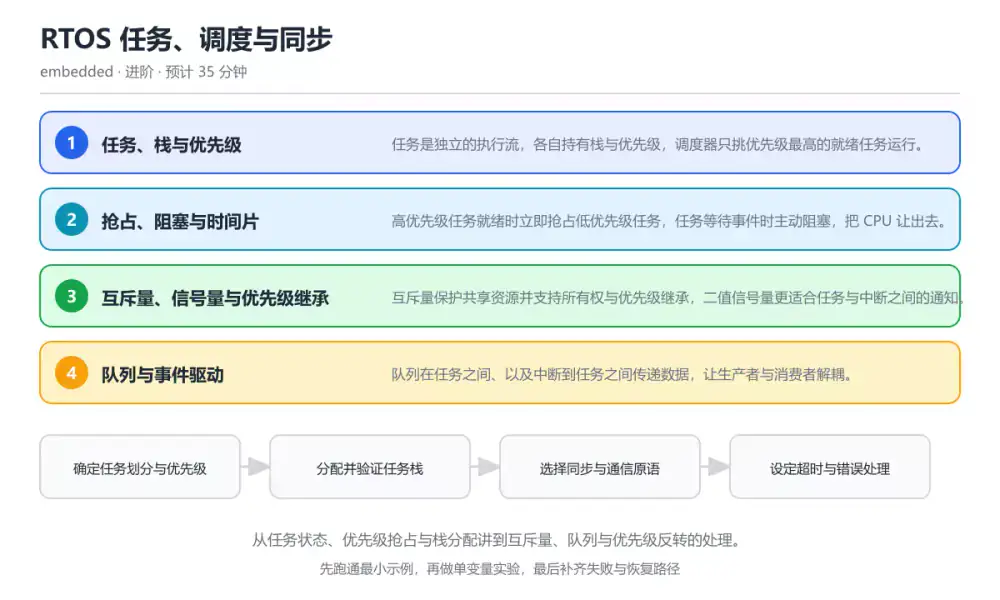
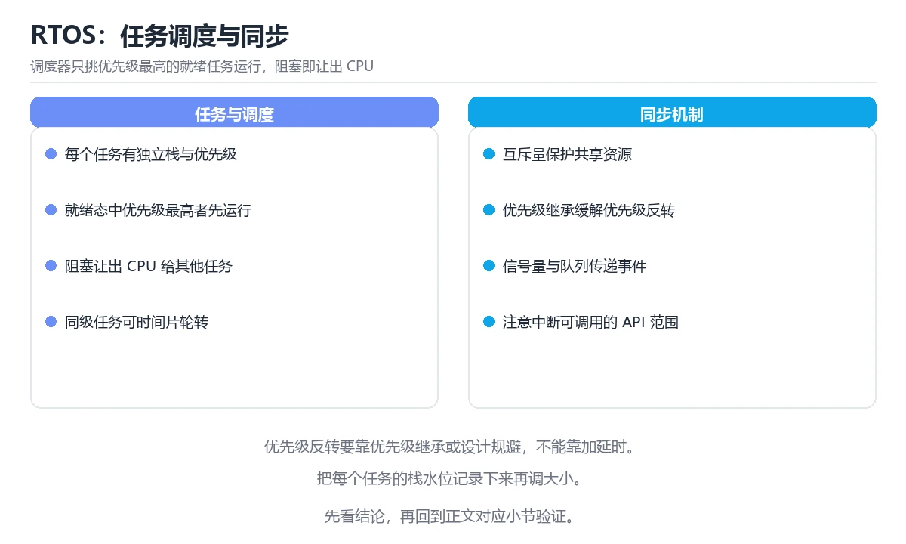

# RTOS 任务、调度与同步

> 内容更新时间：2026-10-06 · 学习阶段：进阶 · 预计用时：45 分钟

分类：embedded。关键词：RTOS、任务调度、优先级反转、互斥量、队列。从任务状态、优先级抢占与栈分配讲到互斥量、队列与优先级反转的处理。



## 本节知识框架

**课程定位**：所属分类 `embedded`（嵌入式与物联网），课程主题 `RTOS 任务、调度与同步`，学习阶段 进阶，建议用时 40 分钟。

本课主线：从任务状态、优先级抢占与栈分配讲到互斥量、队列与优先级反转的处理。

**学完本课应当能够**
- 说清 `RTOS` 与 `优先级反转` 的含义与区别，并各举一个正例和一个反例。
- 用本课示例验证 `优先级继承` 的行为，记录输入、输出与失败条件。
- 遇到「在中断服务程序里调用阻塞接口」这类问题时，能说出触发条件与修复顺序。

### 从概念到验证的学习链条

1. `RTOS`：先掌握 提供任务调度、同步与时间管理的实时操作系统内核，再用它解释 `优先级反转` 为什么会出现。
2. `优先级反转`：先掌握 高优先级任务因等待低优先级任务持有的锁而被中等优先级任务插队的现象，再用它解释 `优先级继承` 为什么会出现。
3. `优先级继承`：先掌握 在锁被等待时临时提升持有者优先级的补救机制，再用它解释 `任务栈` 为什么会出现。
4. `任务栈`：先掌握 每个任务独立占用的内存区域，保存局部变量与调用现场，再用它解释 `上下文切换` 为什么会出现。
5. `上下文切换`：先掌握 保存当前任务现场并恢复下一个任务现场的调度动作，再用它解释 `互斥量` 为什么会出现。
6. `互斥量`：先掌握 互斥量保护共享资源并支持所有权与优先级继承，二值信号量更适合任务与中断之间的通知，再用它解释 本课示例的观察结果 为什么会出现。

**先修与衔接**：本课是「嵌入式与物联网」分类的第 5 课。当前没有登记显式先修或后续课程；课程主线是从任务状态、优先级抢占与栈分配讲到互斥量、队列与优先级反转的处理。学完后按 `embedded` 分类顺序继续。

### 完成判据

- **定义关**：不看正文也能说明 `RTOS` 是 提供任务调度、同步与时间管理的实时操作系统内核，并指出一个反例。
- **机制关**：能按“输入 → 转换 → 输出 → 验证”复述 `RTOS 任务、调度与同步`，而不是只背结论。
- **示例关**：能运行或推演 `RTOS 任务、调度与同步` 的 `text` 示例，并说明一个真实出现的标识符或字面量。
- **证据关**：能指出 `RTOS 任务、调度与同步` 示例里的 调用了 `sensor_task()`，并说明它支持或反驳了本课的哪一条结论。
- **排错关**：能复现 在中断服务程序里调用阻塞接口，记录现象并按 改用带 FromISR 后缀的非阻塞接口，把耗时处理交给任务 修复。
- **迁移关**：能把 `RTOS`、`任务调度`、`优先级反转`、`互斥量` 放进一个与 `RTOS 任务、调度与同步` 不同的项目场景，并保持输入与验证条件可追踪。
- **复盘关**：学完 `RTOS 任务、调度与同步` 后，用一句话写下仍然不确定的结论，并列出下一次验证需要的输入、环境和成功判据。

### 复习清单

- [ ] 能不看正文复述本课核心术语，并指出一个边界或反例。
- [ ] 能运行或推演本课示例，记录输入、输出与失败现象。
- [ ] 能完成一次自测，并把错题对照错误表定位原因。

**本课配图**



## 核心概念定义

| 术语 | 操作性定义 | 常见边界与风险 |
| --- | --- | --- |
| RTOS | 提供任务调度、同步与时间管理的实时操作系统内核。 | 只在「提供任务调度、同步与时间管理的实时操作系统内核」这一前提下成立，换输入或换环境要重新验证。 |
| 优先级反转 | 高优先级任务因等待低优先级任务持有的锁而被中等优先级任务插队的现象。 | 共享状态与调度顺序会改变结论，单线程或串行测试通过不等于并发下成立。 |
| 优先级继承 | 在锁被等待时临时提升持有者优先级的补救机制。 | 共享状态与调度顺序会改变结论，单线程或串行测试通过不等于并发下成立。 |
| 任务栈 | 每个任务独立占用的内存区域，保存局部变量与调用现场。 | 易错：给所有任务统一分配很小的栈空间；正确做法是按实测峰值加余量分配，并开启栈使用量检查。 |
| 上下文切换 | 保存当前任务现场并恢复下一个任务现场的调度动作。 | 只在「保存当前任务现场并恢复下一个任务现场的调度动作」这一前提下成立，换输入或换环境要重新验证。 |
| 互斥量 | 互斥量保护共享资源并支持所有权与优先级继承，二值信号量更适合任务与中断之间的通知 | 易错：在 ISR 里直接等待队列消息或获取互斥量；正确做法是改用带 FromISR 后缀的非阻塞接口，把耗时处理交给任务。 |

## 原理与运行机制

### 机制总览

**教材衔接：核心知识**

### 1. 任务、栈与优先级

任务是独立的执行流，各自持有栈与优先级，调度器只挑优先级最高的就绪任务运行。

创建任务时分配任务控制块与栈空间，就绪任务按优先级排队，系统节拍或事件发生时调度器切换上下文。

在RTOS 任务、调度与同步里可以这样验证：在同一工程里创建两个不同优先级的任务各自翻转引脚，用逻辑分析仪观察执行占比。

边界：每个任务的栈都按静态估算分配，估算过小会破坏相邻内存，现象往往是随机跑飞而不是明确报错。

工程视角：开启栈使用量检测或填充标记，给每个任务留出余量并把实测峰值写进工程文档。

### 2. 抢占、阻塞与时间片

高优先级任务就绪时立即抢占低优先级任务，任务等待事件时主动阻塞，把 CPU 让出去。

调度器在节拍中断与系统调用返回点重新评估就绪队列，同优先级任务可按时间片轮转，阻塞任务不参与调度直到事件或超时。

在RTOS 任务、调度与同步里可以这样验证：让高优先级任务等待队列消息，观察它阻塞期间低优先级任务获得执行机会。

边界：忙等不会让出 CPU，会让低优先级任务长期得不到执行，也会挤占实时性预算。

工程视角：用阻塞式接口替代轮询，为等待设置超时并在超时分支输出诊断信息。

### 3. 互斥量、信号量与优先级继承

互斥量保护共享资源并支持所有权与优先级继承，二值信号量更适合任务与中断之间的通知。

互斥量记录持有者，当高优先级任务等待低优先级任务持有的锁时，系统临时提升持有者优先级，减少中等优先级任务插队的时间。

在RTOS 任务、调度与同步里可以这样验证：让低优先级任务持锁后被中优先级任务抢占，对比启用与关闭优先级继承时高优先级任务的等待时间。

边界：在中断服务程序里调用会阻塞的互斥量接口属于非法操作，会触发断言或不可预期行为。

工程视角：统一约定中断只发通知、任务负责处理，并给共享资源的加锁顺序编号以避免死锁。

### 4. 队列与事件驱动

队列在任务之间、以及中断到任务之间传递数据，让生产者与消费者解耦。

发送方把数据拷贝进环形缓冲区，接收方在队列为空时阻塞等待，数据到达后由内核唤醒等待任务。

在RTOS 任务、调度与同步里可以这样验证：用中断向队列投递按键事件，任务在队列上阻塞等待并打印事件与时间戳。

边界：队列深度不足会丢数据或让发送方阻塞，在中断里等待队列空间会破坏实时性。

工程视角：按最坏突发速率估算队列深度，中断侧使用非阻塞发送并统计丢弃次数。

### 机制拆解：每一步的输入、动作与输出

#### 1. `RTOS`
- 输入：`RTOS`；本步把 提供任务调度、同步与时间管理的实时操作系统内核 当作判断规则。
- 动作：围绕 `RTOS` 保留中间状态，并记录它与 `优先级反转` 的对应关系。
- 输出：`优先级反转`，它可以被下一段代码、测试或记录继续使用。
- `RTOS` 的失败条件：只在「提供任务调度、同步与时间管理的实时操作系统内核」这一前提下成立，换输入或换环境要重新验证。

#### 2. `优先级反转`
- 输入：`RTOS`；本步把 高优先级任务因等待低优先级任务持有的锁而被中等优先级任务插队的现象 当作判断规则。
- 动作：围绕 `优先级反转` 保留中间状态，并记录它与 `优先级继承` 的对应关系。
- 输出：`优先级继承`，它可以被下一段代码、测试或记录继续使用。
- `优先级反转` 的失败条件：共享状态与调度顺序会改变结论，单线程或串行测试通过不等于并发下成立。

#### 3. `优先级继承`
- 输入：`优先级反转`；本步把 在锁被等待时临时提升持有者优先级的补救机制 当作判断规则。
- 动作：围绕 `优先级继承` 保留中间状态，并记录它与 `任务栈` 的对应关系。
- 输出：`任务栈`，它可以被下一段代码、测试或记录继续使用。
- `优先级继承` 的失败条件：共享状态与调度顺序会改变结论，单线程或串行测试通过不等于并发下成立。

#### 4. `任务栈`
- 输入：`优先级继承`；本步把 每个任务独立占用的内存区域，保存局部变量与调用现场 当作判断规则。
- 动作：围绕 `任务栈` 保留中间状态，并记录它与 `上下文切换` 的对应关系。
- 输出：`上下文切换`，它可以被下一段代码、测试或记录继续使用。
- `任务栈` 的失败条件：当任务栈按经验值随手填写时，会出现给所有任务统一分配很小的栈空间。

#### 5. `上下文切换`
- 输入：`任务栈`；本步把 保存当前任务现场并恢复下一个任务现场的调度动作 当作判断规则。
- 动作：围绕 `上下文切换` 保留中间状态，并记录它与 `互斥量` 的对应关系。
- 输出：`互斥量`，它可以被下一段代码、测试或记录继续使用。
- `上下文切换` 的失败条件：只在「保存当前任务现场并恢复下一个任务现场的调度动作」这一前提下成立，换输入或换环境要重新验证。

#### 6. `互斥量`
- 输入：`上下文切换`；本步把 互斥量保护共享资源并支持所有权与优先级继承，二值信号量更适合任务与中断之间的通知 当作判断规则。
- 动作：围绕 `互斥量` 保留中间状态，并记录它与 `sensor_task` 的对应关系。
- 输出：`sensor_task`，它可以被下一段代码、测试或记录继续使用。
- `互斥量` 的失败条件：当在中断服务程序里调用阻塞接口时，会出现在 ISR 里直接等待队列消息或获取互斥量。

### 示例中的可观察事实

1. 调用了 `sensor_task()`；它对应的课程主题是 `RTOS 任务、调度与同步`。
2. 调用了 `xSemaphoreTake()`；它对应的课程主题是 `RTOS 任务、调度与同步`。
3. 调用了 `read_sensor_register()`；它对应的课程主题是 `RTOS 任务、调度与同步`。
4. 调用了 `xSemaphoreGive()`；它对应的课程主题是 `RTOS 任务、调度与同步`。
5. 调用了 `vTaskDelay()`；它对应的课程主题是 `RTOS 任务、调度与同步`。
6. 调用了 `pdMS_TO_TICKS()`；它对应的课程主题是 `RTOS 任务、调度与同步`。
7. 调用了 `button_isr()`；它对应的课程主题是 `RTOS 任务、调度与同步`。
8. 调用了 `xQueueSendFromISR()`；它对应的课程主题是 `RTOS 任务、调度与同步`。

### 复现实验记录

- 环境：`RTOS 任务、调度与同步` 使用 `text` 示例，固定 `RTOS`、`任务调度`、`优先级反转`、`互斥量` 作为第一组条件。
- 首轮输入：先确认 调用了 `sensor_task()`，预测 `RTOS` 会怎样变化。
- 基线观察：记录命令、输入、输出和错误原文，不用截图代替可复制的文本。
- 单变量修改：只改变 `RTOS`，观察 `互斥量` 是否仍满足定义。
- 失败注入：复现 在中断服务程序里调用阻塞接口，确认现象是 在 ISR 里直接等待队列消息或获取互斥量。
- 记录结论：把“修改前、修改后、预期变化、实际变化”写成四列表，这样复盘 `RTOS 任务、调度与同步` 时才能区分概念错误与实现错误。

## 典型应用场景

**教材衔接：深度拓展与实战**

### 机制拆解 1：任务、栈与优先级

创建任务时分配任务控制块与栈空间，就绪任务按优先级排队，系统节拍或事件发生时调度器切换上下文。

落地时先确认前提：每个任务的栈都按静态估算分配，估算过小会破坏相邻内存，现象往往是随机跑飞而不是明确报错。再把结论写进检查表，让下一位同学可以按同样的输入复现。

工程做法：开启栈使用量检测或填充标记，给每个任务留出余量并把实测峰值写进工程文档。

### 机制拆解 2：抢占、阻塞与时间片

调度器在节拍中断与系统调用返回点重新评估就绪队列，同优先级任务可按时间片轮转，阻塞任务不参与调度直到事件或超时。

落地时先确认前提：忙等不会让出 CPU，会让低优先级任务长期得不到执行，也会挤占实时性预算。再把结论写进检查表，让下一位同学可以按同样的输入复现。

工程做法：用阻塞式接口替代轮询，为等待设置超时并在超时分支输出诊断信息。

### 机制拆解 3：互斥量、信号量与优先级继承

互斥量记录持有者，当高优先级任务等待低优先级任务持有的锁时，系统临时提升持有者优先级，减少中等优先级任务插队的时间。

落地时先确认前提：在中断服务程序里调用会阻塞的互斥量接口属于非法操作，会触发断言或不可预期行为。再把结论写进检查表，让下一位同学可以按同样的输入复现。

工程做法：统一约定中断只发通知、任务负责处理，并给共享资源的加锁顺序编号以避免死锁。

### 机制拆解 4：队列与事件驱动

发送方把数据拷贝进环形缓冲区，接收方在队列为空时阻塞等待，数据到达后由内核唤醒等待任务。

落地时先确认前提：队列深度不足会丢数据或让发送方阻塞，在中断里等待队列空间会破坏实时性。再把结论写进检查表，让下一位同学可以按同样的输入复现。

工程做法：按最坏突发速率估算队列深度，中断侧使用非阻塞发送并统计丢弃次数。

### 机制对照表

| 概念 | 解决什么问题 | 关键前提 | 失败信号 |
| --- | --- | --- | --- |
| 任务、栈与优先级 | 任务是独立的执行流，各自持有栈与优先级，调度器只挑优先级最高的就绪任务运行。 | 每个任务的栈都按静态估算分配，估算过小会破坏相邻内存，现象往往是随机跑飞 | 开启栈使用量检测或填充标记，给每个任务留出余量并把实测峰值写进工程文档。 |
| 抢占、阻塞与时间片 | 高优先级任务就绪时立即抢占低优先级任务，任务等待事件时主动阻塞，把 CPU 让出 | 忙等不会让出 CPU，会让低优先级任务长期得不到执行，也会挤占实时性预算 | 用阻塞式接口替代轮询，为等待设置超时并在超时分支输出诊断信息。 |
| 互斥量、信号量与优先级继承 | 互斥量保护共享资源并支持所有权与优先级继承，二值信号量更适合任务与中断之间的通知 | 在中断服务程序里调用会阻塞的互斥量接口属于非法操作，会触发断言或不可预期 | 统一约定中断只发通知、任务负责处理，并给共享资源的加锁顺序编号以避免死锁 |
| 队列与事件驱动 | 队列在任务之间、以及中断到任务之间传递数据，让生产者与消费者解耦。 | 队列深度不足会丢数据或让发送方阻塞，在中断里等待队列空间会破坏实时性。 | 按最坏突发速率估算队列深度，中断侧使用非阻塞发送并统计丢弃次数。 |

### 自测问答

**问 1**：高优先级任务因等待低优先级任务持有的锁而被中等优先级任务插队，这一现象称为？

**答**：优先级反转。优先级反转的根源是锁的持有者优先级过低，于是中等优先级任务反而先获得 CPU；启用优先级继承可以让持有者临时提速，把等待时间压缩到可接受的范围内。 正确选项「优先级反转」对应《RTOS 任务、调度与同步》的要点「任务、栈与优先级」：任务是独立的执行流，各自持有栈与优先级，调度器只挑优先级最高的就绪任务运行。判断「任务、栈与优先级」时先确认前提是否成立，再回到《RTOS 任务、调度与同步》的示例核对一次；把别的语言或框架的默认做法直接搬到任务、栈与优先级上，往往会在本课的边界条件里失效。

**问 2**：在中断服务程序里与任务通信，推荐使用哪类接口？

**答**：带 FromISR 后缀的非阻塞接口。中断上下文不允许阻塞，必须使用专为 ISR 提供的非阻塞接口，并在需要时请求上下文切换；在中断里等待锁或无限等待队列消息都会破坏实时性甚至触发断言。 正确选项「带 FromISR 后缀的非阻塞接口」对应《RTOS 任务、调度与同步》的要点「抢占、阻塞与时间片」：高优先级任务就绪时立即抢占低优先级任务，任务等待事件时主动阻塞，把 CPU 让出去。判断「抢占、阻塞与时间片」时先确认前提是否成立，再回到《RTOS 任务、调度与同步》的示例核对一次；借鉴相邻主题的经验之前，先核对抢占、阻塞与时间片的前提是否成立。

**问 3**：以下哪些做法有助于控制实时性风险？（多选）

**答**：用阻塞式调用代替忙等轮询；给等待加上超时并记录超时次数；开启任务栈使用量检查。阻塞式调用会让出 CPU，超时与计数便于发现异常，栈检查能提前暴露溢出风险；把全部业务逻辑放进中断会拉长中断处理时间，是实时性问题的常见来源。 正确选项「用阻塞式调用代替忙等轮询；给等待加上超时并记录超时次数；开启任务栈使用量检查」对应《RTOS 任务、调度与同步》的要点「互斥量、信号量与优先级继承」：互斥量保护共享资源并支持所有权与优先级继承，二值信号量更适合任务与中断之间的通知。判断「互斥量、信号量与优先级继承」时先确认前提是否成立，再回到《RTOS 任务、调度与同步》的示例核对一次；记住互斥量、信号量与优先级继承的结论之外还要记住适用条件，换一个输入往往就不成立了。

**问 4**：请按任务从创建到被事件唤醒的典型顺序排列。

**答**：创建任务并分配栈。任务先被创建并分配栈，随后进入就绪队列，被调度器选中后运行，遇到等待事件转入阻塞，事件到达再回到就绪队列等待下次调度。 正确选项「创建任务并分配栈；进入就绪队列等待调度；被调度器选中运行；等待事件而阻塞；事件到达后重新就绪」对应《RTOS 任务、调度与同步》的要点「队列与事件驱动」：队列在任务之间、以及中断到任务之间传递数据，让生产者与消费者解耦。判断「队列与事件驱动」时先确认前提是否成立，再回到《RTOS 任务、调度与同步》的示例核对一次；干扰项常常是相邻主题里成立的结论，只有按队列与事件驱动的输入与约束判断才能排除。

**问 5**：阅读这段中断与任务的协作代码，下面哪项判断是正确的？

**答**：中断用 FromISR 接口投递事件，任务在队列上等待并设置超时。这段 RTOS 代码把中断侧限制为非阻塞投递，任务侧用带超时的等待接收事件，超时分支还会记录日志；在中断里调用阻塞接口或省略超时，都会让实时性问题难以定位。 正确选项「中断用 FromISR 接口投递事件，任务在队列上等待并设置超时」对应《RTOS 任务、调度与同步》的要点「任务、栈与优先级」：任务是独立的执行流，各自持有栈与优先级，调度器只挑优先级最高的就绪任务运行。判断「任务、栈与优先级」时先确认前提是否成立，再回到《RTOS 任务、调度与同步》的示例核对一次；把任务、栈与优先级的做法换到别的约束下未必成立，先确认边界再决定答案。


### 工程检查表

- [ ] 确定任务划分与优先级
- [ ] 分配并验证任务栈
- [ ] 选择同步与通信原语
- [ ] 设定超时与错误处理
- [ ] 用跟踪工具核对实时性
- [ ] 【任务、栈与优先级】开启栈使用量检测或填充标记，给每个任务留出余量并把实测峰值写进工程文档。
- [ ] 【抢占、阻塞与时间片】用阻塞式接口替代轮询，为等待设置超时并在超时分支输出诊断信息。
- [ ] 【互斥量、信号量与优先级继承】统一约定中断只发通知、任务负责处理，并给共享资源的加锁顺序编号以避免死锁。
- [ ] 【队列与事件驱动】按最坏突发速率估算队列深度，中断侧使用非阻塞发送并统计丢弃次数。


### 结论与下一步

- **在中断服务程序里调用阻塞接口**：典型现象是在 ISR 里直接等待队列消息或获取互斥量；正确做法是改用带 FromISR 后缀的非阻塞接口，把耗时处理交给任务。
- **任务栈按经验值随手填写**：典型现象是给所有任务统一分配很小的栈空间；正确做法是按实测峰值加余量分配，并开启栈使用量检查。
- **共享资源没有固定加锁顺序**：典型现象是不同任务以相反顺序获取同一组锁；正确做法是为锁编号并统一按序获取，必要时用超时打破等待。

### 最小验证场景

- 准备：保留 `text` 示例的原始输入，先记录 `RTOS 任务、调度与同步` 的基线输出和完整运行命令。
- 观察：先核对 调用了 `sensor_task()`，再改变一个与 `RTOS` 相关的条件。
- 判定：新结果与 `RTOS 任务、调度与同步` 的基线不同不等于错误；只有当差异破坏了 `RTOS` 的定义或错误表中的约束，才判定为失败。

### 选择与边界

- 使用 `RTOS` 时，先满足它的定义：提供任务调度、同步与时间管理的实时操作系统内核；只在「提供任务调度、同步与时间管理的实时操作系统内核」这一前提下成立，换输入或换环境要重新验证。
- 使用 `优先级反转` 时，先满足它的定义：高优先级任务因等待低优先级任务持有的锁而被中等优先级任务插队的现象；共享状态与调度顺序会改变结论，单线程或串行测试通过不等于并发下成立。
- 使用 `优先级继承` 时，先满足它的定义：在锁被等待时临时提升持有者优先级的补救机制；共享状态与调度顺序会改变结论，单线程或串行测试通过不等于并发下成立。
- 使用 `任务栈` 时，先满足它的定义：每个任务独立占用的内存区域，保存局部变量与调用现场；易错：给所有任务统一分配很小的栈空间；正确做法是按实测峰值加余量分配，并开启栈使用量检查。
- 使用 `上下文切换` 时，先满足它的定义：保存当前任务现场并恢复下一个任务现场的调度动作；只在「保存当前任务现场并恢复下一个任务现场的调度动作」这一前提下成立，换输入或换环境要重新验证。

## 代码/协议/SQL 示例

**教材衔接：关键流程**

```text
确定任务划分与优先级 → 分配并验证任务栈 → 选择同步与通信原语 → 设定超时与错误处理 → 用跟踪工具核对实时性
```

1. 确定任务划分与优先级
2. 分配并验证任务栈
3. 选择同步与通信原语
4. 设定超时与错误处理
5. 用跟踪工具核对实时性

```c
#include "FreeRTOS.h"
#include "task.h"
#include "queue.h"
#include "semphr.h"

static QueueHandle_t event_queue;
static SemaphoreHandle_t bus_mutex;

// 低优先级任务持锁访问寄存器，临界区尽量短
static void sensor_task(void *arg) {
    for (;;) {
        xSemaphoreTake(bus_mutex, portMAX_DELAY);
        read_sensor_register();
        xSemaphoreGive(bus_mutex);
        vTaskDelay(pdMS_TO_TICKS(20));
    }
}

// 中断只投递事件，真正的处理交给任务
void button_isr(void) {
    BaseType_t higher_woken = pdFALSE;
    uint32_t event = 1u;
    xQueueSendFromISR(event_queue, &event, &higher_woken);
    portYIELD_FROM_ISR(higher_woken);
}

static void handler_task(void *arg) {
    uint32_t event;
    for (;;) {
        if (xQueueReceive(event_queue, &event, pdMS_TO_TICKS(100)) == pdPASS) {
            handle_event(event);
        } else {
            log_timeout();          // 超时也要有明确处理
        }
    }
}
```

### 示例精读：先找证据，再改一个条件

1. 调用了 `sensor_task()`；它出现在 `RTOS 任务、调度与同步` 的示例中，阅读时先确认它前后各发生了什么。
2. 调用了 `xSemaphoreTake()`；它出现在 `RTOS 任务、调度与同步` 的示例中，阅读时先确认它前后各发生了什么。
3. 调用了 `read_sensor_register()`；它出现在 `RTOS 任务、调度与同步` 的示例中，阅读时先确认它前后各发生了什么。
4. 调用了 `xSemaphoreGive()`；它出现在 `RTOS 任务、调度与同步` 的示例中，阅读时先确认它前后各发生了什么。
5. 调用了 `vTaskDelay()`；它出现在 `RTOS 任务、调度与同步` 的示例中，阅读时先确认它前后各发生了什么。
6. 调用了 `pdMS_TO_TICKS()`；它出现在 `RTOS 任务、调度与同步` 的示例中，阅读时先确认它前后各发生了什么。
7. 调用了 `button_isr()`；它出现在 `RTOS 任务、调度与同步` 的示例中，阅读时先确认它前后各发生了什么。
8. 调用了 `xQueueSendFromISR()`；它出现在 `RTOS 任务、调度与同步` 的示例中，阅读时先确认它前后各发生了什么。
- 在 `RTOS 任务、调度与同步` 中与 `RTOS` 对照：示例必须能支持 提供任务调度、同步与时间管理的实时操作系统内核，否则说明这一段还缺少实现或验证步骤。
- 在 `RTOS 任务、调度与同步` 中与 `优先级反转` 对照：示例必须能支持 高优先级任务因等待低优先级任务持有的锁而被中等优先级任务插队的现象，否则说明这一段还缺少实现或验证步骤。
- 在 `RTOS 任务、调度与同步` 中与 `优先级继承` 对照：示例必须能支持 在锁被等待时临时提升持有者优先级的补救机制，否则说明这一段还缺少实现或验证步骤。
- 在 `RTOS 任务、调度与同步` 中与 `任务栈` 对照：示例必须能支持 每个任务独立占用的内存区域，保存局部变量与调用现场，否则说明这一段还缺少实现或验证步骤。

## 时间/空间复杂度或性能分析

**性能关注点（RTOS 任务、调度与同步）**：资源受限是前提：记录 Flash/RAM 占用、中断延迟与功耗。

**测量方法**：以 `RTOS 任务、调度与同步` 的 `RTOS` 场景为对象，固定输入跑一遍记录基线，再把规模或并发度提高一个数量级复测；两次结果的差值与波动范围才是结论依据。

### 需要控制的变量与记录项

- `RTOS 任务、调度与同步` 的 `RTOS`：固定它的版本、输入范围和资源上限，分别记录速度、内存与失败率的变化。
- `RTOS 任务、调度与同步` 的 `任务调度`：固定它的版本、输入范围和资源上限，分别记录速度、内存与失败率的变化。
- `RTOS 任务、调度与同步` 的 `优先级反转`：固定它的版本、输入范围和资源上限，分别记录速度、内存与失败率的变化。
- `RTOS 任务、调度与同步` 的 `互斥量`：固定它的版本、输入范围和资源上限，分别记录速度、内存与失败率的变化。
- `RTOS 任务、调度与同步` 的 `队列`：固定它的版本、输入范围和资源上限，分别记录速度、内存与失败率的变化。
- `RTOS 任务、调度与同步` 中 `RTOS` 的边界：只在「提供任务调度、同步与时间管理的实时操作系统内核」这一前提下成立，换输入或换环境要重新验证。达到边界时不要外推，必须重新测量。
- `RTOS 任务、调度与同步` 中 `优先级反转` 的边界：共享状态与调度顺序会改变结论，单线程或串行测试通过不等于并发下成立。达到边界时不要外推，必须重新测量。
- `RTOS 任务、调度与同步` 中 `优先级继承` 的边界：共享状态与调度顺序会改变结论，单线程或串行测试通过不等于并发下成立。达到边界时不要外推，必须重新测量。
- `RTOS 任务、调度与同步` 中 `任务栈` 的边界：易错：给所有任务统一分配很小的栈空间；正确做法是按实测峰值加余量分配，并开启栈使用量检查。达到边界时不要外推，必须重新测量。
- `RTOS 任务、调度与同步` 中 `上下文切换` 的边界：只在「保存当前任务现场并恢复下一个任务现场的调度动作」这一前提下成立，换输入或换环境要重新验证。达到边界时不要外推，必须重新测量。
- `RTOS 任务、调度与同步` 的代码证据：先验证 调用了 `sensor_task()`，再记录该路径的输入规模与耗时；只看代码行数不能推出复杂度。

## 常见误区与易错点

| 容易写错的做法 | 实际现象 | 原因与正确做法 |
| --- | --- | --- |
| 在中断服务程序里调用阻塞接口 | 在 ISR 里直接等待队列消息或获取互斥量。 | 改用带 FromISR 后缀的非阻塞接口，把耗时处理交给任务。 |
| 任务栈按经验值随手填写 | 给所有任务统一分配很小的栈空间。 | 按实测峰值加余量分配，并开启栈使用量检查。 |
| 共享资源没有固定加锁顺序 | 不同任务以相反顺序获取同一组锁。 | 为锁编号并统一按序获取，必要时用超时打破等待。 |

### 现场 1：在中断服务程序里调用阻塞接口

**症状**：在 ISR 里直接等待队列消息或获取互斥量。

**根因与修复**：改用带 FromISR 后缀的非阻塞接口，把耗时处理交给任务。

**自检**：在本课示例里复现「在中断服务程序里调用阻塞接口」，改成改用带 FromISR 后缀的非阻塞接口，把耗时处理交给任务后重跑；如果症状消失且失败路径按预期变化，说明定位正确。

### 现场 2：任务栈按经验值随手填写

**症状**：给所有任务统一分配很小的栈空间。

**根因与修复**：按实测峰值加余量分配，并开启栈使用量检查。

**自检**：在本课示例里复现「任务栈按经验值随手填写」，改成按实测峰值加余量分配，并开启栈使用量检查后重跑；如果症状消失且失败路径按预期变化，说明定位正确。

### 现场 3：共享资源没有固定加锁顺序

**症状**：不同任务以相反顺序获取同一组锁。

**根因与修复**：为锁编号并统一按序获取，必要时用超时打破等待。

**自检**：在本课示例里复现「共享资源没有固定加锁顺序」，改成为锁编号并统一按序获取，必要时用超时打破等待后重跑；如果症状消失且失败路径按预期变化，说明定位正确。

## 与其他知识点的关系

**教材衔接：复习与迁移**


### 迁移练习

- **术语归属**：`RTOS`、`优先级反转`、`优先级继承` 的定义以本课「核心概念定义」为准，换到其他课程时先确认定义是否被改写。

### 容易混淆的相邻概念

- `RTOS` 与 `优先级反转`：前者强调 提供任务调度、同步与时间管理的实时操作系统内核；后者强调 高优先级任务因等待低优先级任务持有的锁而被中等优先级任务插队的现象。判断时分别检查两条定义的适用范围，不要只看名称相似就互换。
- `优先级反转` 与 `优先级继承`：前者强调 高优先级任务因等待低优先级任务持有的锁而被中等优先级任务插队的现象；后者强调 在锁被等待时临时提升持有者优先级的补救机制。判断时分别检查两条定义的适用范围，不要只看名称相似就互换。
- `优先级继承` 与 `任务栈`：前者强调 在锁被等待时临时提升持有者优先级的补救机制；后者强调 每个任务独立占用的内存区域，保存局部变量与调用现场。判断时分别检查两条定义的适用范围，不要只看名称相似就互换。
- `任务栈` 与 `上下文切换`：前者强调 每个任务独立占用的内存区域，保存局部变量与调用现场；后者强调 保存当前任务现场并恢复下一个任务现场的调度动作。判断时分别检查两条定义的适用范围，不要只看名称相似就互换。
- `上下文切换` 与 `互斥量`：前者强调 保存当前任务现场并恢复下一个任务现场的调度动作；后者强调 互斥量保护共享资源并支持所有权与优先级继承，二值信号量更适合任务与中断之间的通知。判断时分别检查两条定义的适用范围，不要只看名称相似就互换。

## 自测题与参考答案

> 先独立作答，再对照参考答案；答案都能在本课正文、术语表或错误表里找到依据。

### 自测 1（概念复述）

不看正文，写出 `RTOS` 的操作性定义，并说明它与 `优先级反转` 的区别。

**参考答案**：提供任务调度、同步与时间管理的实时操作系统内核。

`优先级反转` 的定位是：高优先级任务因等待低优先级任务持有的锁而被中等优先级任务插队的现象；两者的差别要从适用对象与失败模式上说明。

### 自测 2（排错）

本课错误表记录了「在中断服务程序里调用阻塞接口」这类做法。请写出它会出现的现象、根因，以及修复顺序。

**参考答案**：现象是在 ISR 里直接等待队列消息或获取互斥量；正确做法是改用带 FromISR 后缀的非阻塞接口，把耗时处理交给任务。修复时先复现现象并保留证据，再改动一处假设重跑，确认现象消失。

### 自测 3（动手验证）

运行本课的 `text` 示例，改动其中一个输入后重新运行，记录输出与错误信息。

**参考答案**：正常输入下 `text` 示例应当复现正文给出的结果；改动输入后，如果结果改变或报错，先核对它是否满足 `RTOS 任务、调度与同步` 中`RTOS` 的适用范围，再检查错误表里是否有同类现象。

### 自测 4（代码阅读）

阅读本课开头的 `text` 示例，说明它体现了`RTOS` 的哪一条性质，并指出改动哪个输入会让这条性质不再成立。

**参考答案**：`RTOS` 的定义是 提供任务调度、同步与时间管理的实时操作系统内核，示例正是在实现这条定义。改动与 `RTOS` 有关的一个输入后，如果结果不再符合 `RTOS 任务、调度与同步` 的正文描述，就说明该性质只在当前前提成立。

### 自测 5（迁移）

把 `RTOS 任务、调度与同步` 的方法迁移到自己的项目：围绕 `RTOS` 写出一个与错误表同类的风险点，并说明触发条件和检验方式。

**参考答案**：例如「共享资源没有固定加锁顺序」，它会导致不同任务以相反顺序获取同一组锁；检验方式是按为锁编号并统一按序获取，必要时用超时打破等待改一处再复现，确认现象消失且没有引入新的失败分支。

### 自测 6（对比）

用一个表格对比 `RTOS` 与 `优先级反转`：各写一行适用场景、一行失败表现。

**参考答案**：`RTOS` 的定义是提供任务调度、同步与时间管理的实时操作系统内核；`优先级反转` 的定义是高优先级任务因等待低优先级任务持有的锁而被中等优先级任务插队的现象。两者的失败表现分别对应本课错误表里与本术语相关的行。

### 自测 7（排错顺序）

面对「在中断服务程序里调用阻塞接口」引发的问题，请把“复现 在 ISR 里直接等待队列消息或获取互斥量 → 保留证据 → 改用带 FromISR 后缀的非阻塞接口，把耗时处理交给任务 → 回归验证”四步写成可执行的检查清单。

**参考答案**：第一步按在 ISR 里直接等待队列消息或获取互斥量复现；第二步记录输入、版本与完整报错；第三步按改用带 FromISR 后缀的非阻塞接口，把耗时处理交给任务只改一处；第四步重跑并确认失败路径也按预期变化。

### 自测 8（边界判断）

针对 `互斥量`，分别写出“可以使用”的条件和“结论不再成立”的条件。

**参考答案**：易错：在 ISR 里直接等待队列消息或获取互斥量；正确做法是改用带 FromISR 后缀的非阻塞接口，把耗时处理交给任务。 同时要把 `互斥量` 的定义 互斥量保护共享资源并支持所有权与优先级继承，二值信号量更适合任务与中断之间的通知 与实际输入逐项对照。

### 自测 9（机制重建）

不看正文，按输入、转换、输出、验证四段重建 `RTOS` → `优先级反转` → `优先级继承` → `任务栈` 的作用链。

**参考答案**：起点是 `RTOS` 的定义 提供任务调度、同步与时间管理的实时操作系统内核；中间每一步都保留可观察状态；终点由 `互斥量` 检查，失败时回到错误表定位第一个偏离定义的步骤。

### 自测 10（综合排错）

在 `RTOS 任务、调度与同步` 中，现象是 不同任务以相反顺序获取同一组锁。请围绕 共享资源没有固定加锁顺序 写出最小复现、关键证据、修复动作和回归验证，并说明为什么不能只凭一次运行下结论。

**参考答案**：先复现 共享资源没有固定加锁顺序，记录输入与完整错误；再按 为锁编号并统一按序获取，必要时用超时打破等待 只改一处。回归时同时跑正常路径和边界路径，只有两次结果都可解释，才把修复视为完成。

### 自测 11（一分钟复述）

用每分钟约 200 字的速度复述 `RTOS 任务、调度与同步`：先给主问题，再按顺序说出 `RTOS`、`优先级反转`、`优先级继承`、`任务栈`，最后给一个失败案例。

**自评标准**：主问题必须对应 从任务状态、优先级抢占与栈分配讲到互斥量、队列与优先级反转的处理；每个术语都要能接上一句定义或边界；失败案例必须写成可观察现象，不能用“可能有风险”代替证据。

## 术语速查

| 术语 | 一句话说明 |
| --- | --- |
| `RTOS` | 提供任务调度、同步与时间管理的实时操作系统内核。 |
| `优先级反转` | 高优先级任务因等待低优先级任务持有的锁而被中等优先级任务插队的现象。 |
| `优先级继承` | 在锁被等待时临时提升持有者优先级的补救机制。 |
| `任务栈` | 每个任务独立占用的内存区域，保存局部变量与调用现场。 |
| `上下文切换` | 保存当前任务现场并恢复下一个任务现场的调度动作。 |
| `互斥量` | 互斥量保护共享资源并支持所有权与优先级继承，二值信号量更适合任务与中断之间的通知。 |

**术语关系**：`RTOS`（提供任务调度、同步与时间管理的实时操作系统内核） → `优先级反转`（高优先级任务因等待低优先级任务持有的锁而被中等优先级任务插队的现象） → `优先级继承`（在锁被等待时临时提升持有者优先级的补救机制） → `任务栈`（每个任务独立占用的内存区域）。

## 考点精讲

`RTOS 任务、调度与同步` 的题库有 5 道题，下面逐题给出题干、正确项与判断依据：先自己作答，再核对正确项，最后回到正文对应小节复核。

### 考点 1：第 1 题

- **题目**：高优先级任务因等待低优先级任务持有的锁而被中等优先级任务插队，这一现象称为？
- **正确项**：优先级反转
- **判断依据**：这道题落在术语 `优先级反转` 上：高优先级任务因等待低优先级任务持有的锁而被中等优先级任务插队的现象。复习时把 `优先级反转` 的定义、适用边界和一个反例一起说清楚，再回到「核心概念定义」核对原文。

### 考点 2：第 2 题

- **题目**：在中断服务程序里与任务通信，推荐使用哪类接口？
- **正确项**：带 FromISR 后缀的非阻塞接口
- **判断依据**：这道题检验本课主问题：从任务状态、优先级抢占与栈分配讲到互斥量、队列与优先级反转的处理。复习时先复述本课主问题，再举一个会让结论失效的输入。

### 考点 3：第 3 题

- **题目**：以下哪些做法有助于控制实时性风险？（多选）
- **正确项**：用阻塞式调用代替忙等轮询；给等待加上超时并记录超时次数；开启任务栈使用量检查
- **判断依据**：这道题落在术语 `任务栈` 上：每个任务独立占用的内存区域，保存局部变量与调用现场。复习时把 `任务栈` 的定义、适用边界和一个反例一起说清楚，再回到「核心概念定义」核对原文。

### 考点 4：第 4 题

- **题目**：请按任务从创建到被事件唤醒的典型顺序排列。
- **正确项**：创建任务并分配栈 → 进入就绪队列等待调度 → 被调度器选中运行 → 等待事件而阻塞 → 事件到达后重新就绪
- **判断依据**：这道题检验本课主问题：从任务状态、优先级抢占与栈分配讲到互斥量、队列与优先级反转的处理。复习时先复述本课主问题，再举一个会让结论失效的输入。

### 考点 5：第 5 题

- **题目**：阅读这段中断与任务的协作代码，下面哪项判断是正确的？
- **正确项**：中断用 FromISR 接口投递事件，任务在队列上等待并设置超时
- **判断依据**：这道题检验本课主问题：从任务状态、优先级抢占与栈分配讲到互斥量、队列与优先级反转的处理。复习时先复述本课主问题，再举一个会让结论失效的输入。

### 考点 6：`RTOS`

- **要点**：提供任务调度、同步与时间管理的实时操作系统内核。
- **RTOS 的边界**：只在「提供任务调度、同步与时间管理的实时操作系统内核」这一前提下成立，换输入或换环境要重新验证。

### 考点 7：`优先级反转`

- **要点**：高优先级任务因等待低优先级任务持有的锁而被中等优先级任务插队的现象。
- **优先级反转 的边界**：共享状态与调度顺序会改变结论，单线程或串行测试通过不等于并发下成立。

### 考点 8：`优先级继承`

- **要点**：在锁被等待时临时提升持有者优先级的补救机制。
- **优先级继承 的边界**：共享状态与调度顺序会改变结论，单线程或串行测试通过不等于并发下成立。

### 考点 9：`任务栈`

- **要点**：每个任务独立占用的内存区域，保存局部变量与调用现场。
- **任务栈 的边界**：易错：给所有任务统一分配很小的栈空间；正确做法是按实测峰值加余量分配，并开启栈使用量检查。

### 考点 10：`上下文切换`

- **要点**：保存当前任务现场并恢复下一个任务现场的调度动作。
- **上下文切换 的边界**：只在「保存当前任务现场并恢复下一个任务现场的调度动作」这一前提下成立，换输入或换环境要重新验证。

### 考点 11：`互斥量`

- **要点**：互斥量保护共享资源并支持所有权与优先级继承，二值信号量更适合任务与中断之间的通知
- **互斥量 的边界**：易错：在 ISR 里直接等待队列消息或获取互斥量；正确做法是改用带 FromISR 后缀的非阻塞接口，把耗时处理交给任务。

### 考点 12：排错——在中断服务程序里调用阻塞接口

- **现象**：在 ISR 里直接等待队列消息或获取互斥量。
- **处理**：改用带 FromISR 后缀的非阻塞接口，把耗时处理交给任务。

### 考点 13：排错——任务栈按经验值随手填写

- **现象**：给所有任务统一分配很小的栈空间。
- **处理**：按实测峰值加余量分配，并开启栈使用量检查。

### 考点 14：综合辨析——`RTOS` 与 `互斥量`

- **辨析点**：`RTOS` 的定义是 提供任务调度、同步与时间管理的实时操作系统内核；`互斥量` 的定义是 互斥量保护共享资源并支持所有权与优先级继承，二值信号量更适合任务与中断之间的通知。
- **答题要求**：面对 `RTOS 任务、调度与同步` 的题目，先判断描述的是 `RTOS` 还是 `互斥量`，再归到对应定义，最后写出一个会让该定义失效的边界输入。

### 考点 15：排错评分点

- **现象分**：能写出 在 ISR 里直接等待队列消息或获取互斥量，而不是只写“程序有错”。
- **证据分**：保留触发 在中断服务程序里调用阻塞接口 的输入、版本和错误原文。
- **修复分**：按 改用带 FromISR 后缀的非阻塞接口，把耗时处理交给任务 只改一处，并同时回归正常路径与边界路径。

## 内容元数据

- 内容版本：v2.0
- 最后更新：2026-10-06
- 学习阶段：进阶

| 字段 | 值 |
| --- | --- |
| 课程 ID | `embedded_rtos_tasks` |
| 所属分类 | `embedded` |
| 难度 | 进阶 |
| 预计用时 | 35 分钟 |
| 关键词 | RTOS、任务调度、优先级反转、互斥量、队列 |
| 配图 | `images/lesson_embedded_rtos_tasks.webp` |
| 参考资料 | 3 条 |
| 内容更新时间 | 2026-10-06 |

## 参考资料与复核

- 来源性质：官方文档、标准或权威教材；本课核对关键词：RTOS、任务调度、优先级反转、互斥量、队列。
- 最后复核：2026-10-04
- 下次复核：2027-02-17
- 复核范围：版本兼容、API 行为与工程实践

下面列出的资料用于核对本课结论，复习时可以对照阅读：
- [FreeRTOS 官方文档](https://www.freertos.org/Documentation/RTOS_book.html)
- [Zephyr 内核服务文档](https://docs.zephyrproject.org/latest/kernel/services/index.html)
- [ARM Cortex-M 处理器文档](https://developer.arm.com/documentation/100166/latest/)

| [本课术语索引：RTOS 任务、调度与同步](#核心概念定义) | 按本课输入、术语边界和错误表现逐项核对 |
> 复核提示：《RTOS 任务、调度与同步》的结论如与资料冲突，以资料中的规范文本为准，并在笔记里记录差异与日期。