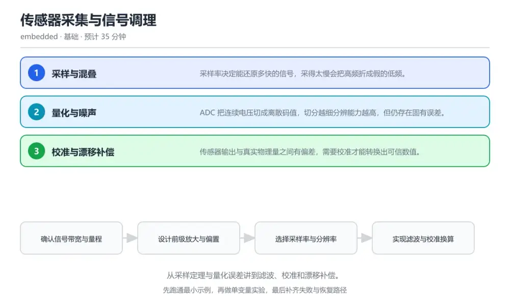
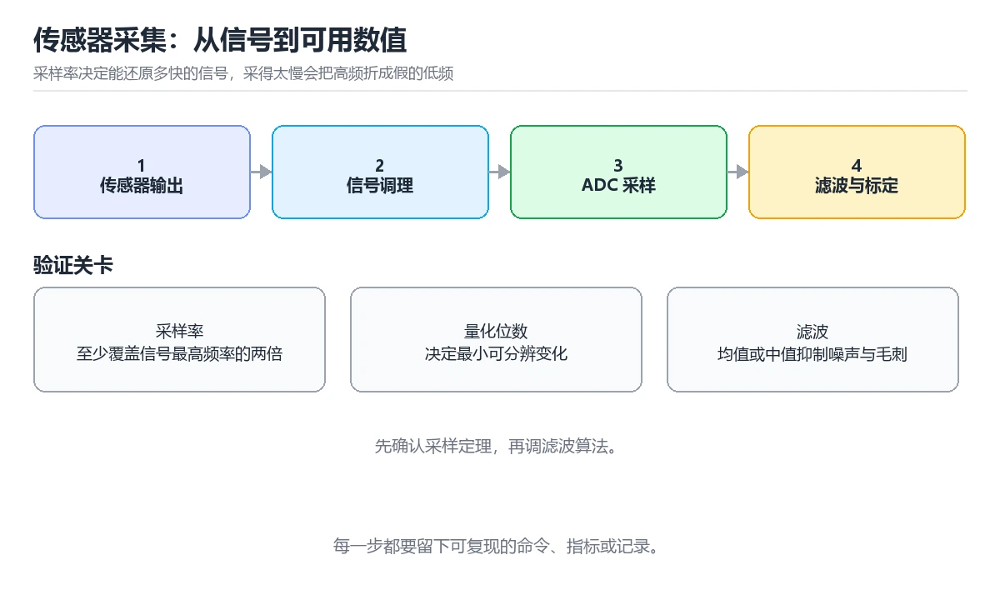

# 传感器采集与信号调理

> 内容更新时间：2026-10-06 · 学习阶段：基础 · 预计用时：30 分钟

分类：embedded。关键词：ADC、采样率、量化误差、数字滤波、校准。从采样定理与量化误差讲到滤波、校准和漂移补偿。

学习建议：先通读《传感器采集与信号调理》的核心知识与关键流程，再运行可运行练习并完成测验；遇到不确定的结论，回到「故障现场」按症状、根因、修复、验证四步核对。



## 学习目标

- 能按信号带宽选择采样率与滤波策略。
- 能估算量化误差并判断它是否影响结论。
- 能用两点校准把原始码值换算成物理量。

## 前置知识

- 了解电压、分压与运放的基本作用。
- 知道 ADC 的分辨率与参考电压含义。
- 能编写简单的整数滤波代码。

## 核心知识

### 1. 采样与混叠

采样率决定能还原多快的信号，采得太慢会把高频折成假的低频。

按采样定理采样率应大于信号最高频率的两倍，实际工程留出数倍余量，并在 ADC 前加抗混叠低通滤波。

在传感器采集与信号调理里可以这样验证：在本课示例里用两种采样率采同一个方波，观察低采样率下出现缓慢波动的假信号。

边界：只提高数字滤波强度而不加模拟前级滤波，混叠产生的假信号无法被恢复。

工程视角：把信号带宽、采样率与滤波截止频率写进参数表，采样率变化时同步复核三者关系。

### 2. 量化与噪声

ADC 把连续电压切成离散码值，切分越细分辨能力越高，但仍存在固有误差。

量化误差由位数与参考电压决定，噪声会叠加在信号上，通过多次平均可降低随机噪声但无法消除偏置误差。

在传感器采集与信号调理里可以这样验证：在本课示例里对同一电压连续采样并求平均，观察平均值波动随采样次数下降。

边界：平均会掩盖真实变化，对快速变化的量做长平均等于把有用信号一起滤掉。

工程视角：把有效位数与噪声水平写进驱动说明，滤波窗口按信号变化率而不是凭感觉选定。

### 3. 校准与漂移补偿

传感器输出与真实物理量之间有偏差，需要校准才能转换出可信数值。

用两个已知参考点求增益与偏置，运行中再用温度或时间项修正漂移，校准系数存在非易失存储中。

在传感器采集与信号调理里可以这样验证：在本课示例里用冰水与沸水两点校准温度通道，记录校准前后的偏差曲线。

边界：只用单点校准无法确定增益误差，量程两端会同时偏。

工程视角：把校准日期与系数版本写入设备记录，长期部署时安排周期性复校。

## 关键流程

```text
确认信号带宽与量程 → 设计前级放大与偏置 → 选择采样率与分辨率 → 实现滤波与校准换算 → 用参考源验证整体误差
```

1. 确认信号带宽与量程
2. 设计前级放大与偏置
3. 选择采样率与分辨率
4. 实现滤波与校准换算
5. 用参考源验证整体误差

## 动手练习

1. 用两种采样率采集同一信号，画出或记录两次结果的差异并解释混叠。
2. 用两点校准温度通道，记录校准前后在量程两端的偏差。
3. 把滤波窗口从 4 改到 32，记录噪声幅度与响应延迟的变化。

**验收标准**：留下 MOVING_WINDOW 的输入、命令、输出和结论，让别人能按记录复现。

## 常见错误与排查

> 说明：本表由《传感器采集与信号调理》的核心知识整理（2026-10-06），人工复核进度见 docs/content_review_batches.md。

| 易错点 | 容易踩的做法 | 正确结论 |
| --- | --- | --- |
| 采样数据出现慢速假波动 | 采样率低于被测信号带宽，且没有前级滤波 | 提高采样率到信号带宽的数倍，并在 ADC 前加抗混叠低通滤波 |
| 测量端点总是偏 | 只做单点校准，忽略增益误差 | 改用两点校准分别求增益与偏置，并在量程两端各验证一次 |
| 滤波后响应明显滞后 | 窗口取得过长，快速变化被平均掉 | 按信号变化率缩短窗口，或改用对突变更敏感的滤波结构 |

## 可运行练习

### 任务 1：先跑通，再解释

```c
#define ADC_FULL_SCALE 4095.0f   // 12 位 ADC 满量程码值

// 两点校准：用两个已知参考得到增益与偏置
static void calibrate(float code_low, float value_low,
                      float code_high, float value_high,
                      float *gain, float *offset) {
    *gain = (value_high - value_low) / (code_high - code_low);
    *offset = value_low - (*gain) * code_low;
}

// 滑动平均：抑制随机噪声，窗口长度按信号变化率确定
static uint16_t moving_average(uint16_t sample) {
    static uint16_t window[MOVING_WINDOW] = {0};
    static uint8_t index = 0;
    static uint32_t sum = 0;
    sum -= window[index];
    window[index] = sample;
    sum += sample;
    index = (index + 1) % MOVING_WINDOW;
    return (uint16_t)(sum / MOVING_WINDOW);
}

```

calibrate 用两个参考点解出增益与偏置，之后每个原始码值都能换算成物理量。moving_average 用固定窗口平滑随机噪声，窗口越小跟随越快，越大越平稳，取值要与信号变化率匹配。

### 任务 2：只改一个条件

复制上面的示例，只改一个输入或参数再跑一次；先写下预测，再和真实输出对照，并说明差异来自传感器采集与信号调理的哪条机制。

### 任务 3：迁移到自己的数据

把《传感器采集与信号调理》里的示例换成你自己的一小段数据或场景，保持结构不变；如果换不动，说明还有哪条前提没有理解，回到核心知识对应小节。

## 故障现场

### 现场 1：采样数据出现慢速假波动

**症状**：在《传感器采集与信号调理》的复现场景中，采样率低于被测信号带宽，且没有前级滤波。

**根因**：当出现“采样数据出现慢速假波动”时，执行路径已经绕过了《传感器采集与信号调理》的关键约束，最终以“采样率低于被测信号带宽，且没有前级滤波”暴露出来；修复前必须先确认约束在哪里失效。

**修复**：针对《传感器采集与信号调理》的问题，提高采样率到信号带宽的数倍，并在 ADC 前加抗混叠低通滤波。

**验证**：在《传感器采集与信号调理》中按“提高采样率到信号带宽的数倍，并在 ADC 前加抗混叠低通滤波”调整后，从“采样数据出现慢速假波动”的触发条件重放同一条路径，确认“采样率低于被测信号带宽，且没有前级滤波”不再出现，并补一个相邻边界用例检查没有引入新问题。

### 现场 2：测量端点总是偏

**症状**：在《传感器采集与信号调理》的复现场景中，只做单点校准，忽略增益误差。

**根因**：“只做单点校准，忽略增益误差”只是表层结果。向上追溯会落到“测量端点总是偏”这一步，因为它省略了《传感器采集与信号调理》的约束，使实现行为和预期模型发生了偏离。

**修复**：针对《传感器采集与信号调理》的问题，改用两点校准分别求增益与偏置，并在量程两端各验证一次。

**验证**：保留《传感器采集与信号调理》里触发“只做单点校准，忽略增益误差”的输入、版本和日志，按“改用两点校准分别求增益与偏置，并在量程两端各验证一次”完成修改后原样重放；只有失败现象消失且相邻场景仍可解释，才保留改动。

### 现场 3：滤波后响应明显滞后

**症状**：在《传感器采集与信号调理》的复现场景中，窗口取得过长，快速变化被平均掉。

**根因**：当出现“滤波后响应明显滞后”时，执行路径已经绕过了《传感器采集与信号调理》的关键约束，最终以“窗口取得过长，快速变化被平均掉”暴露出来；修复前必须先确认约束在哪里失效。

**修复**：针对《传感器采集与信号调理》的问题，按信号变化率缩短窗口，或改用对突变更敏感的滤波结构。

**验证**：先在《传感器采集与信号调理》中记录“滤波后响应明显滞后”留下的失败证据，再执行“按信号变化率缩短窗口，或改用对突变更敏感的滤波结构”并重放；确认错误路径变为明确结果，且修复没有掩盖同类故障。

## 本课复习清单

离开本课前，逐项确认：

- [ ] 能按信号带宽说出采样率与滤波截止频率的选法。
- [ ] 能估算量化误差并判断它是否影响结论。
- [ ] 能用两个参考点写出校准公式并说明各项含义。
- [ ] 至少运行一次 MOVING_WINDOW 的示例，记录输入、输出和 ADC 的边界情况。
- [ ] 把本课最容易混淆的两个概念写成一句话对照。

| 复盘项 | 记录 |
| --- | --- |
| 已经能独立解释的考点 |  |
| 仍然说不清的概念 |  |
| 下一步验证动作 |  |

## 复习与自测

### 核心知识

遮住正文回答：传感器采集与信号调理解决什么问题、依赖哪些前提、失败时先看哪个信号？三问都能答清楚，再进入下一节。

### 动手练习

把《传感器采集与信号调理》里「只改一个条件」的练习再做一遍，这次先写预测再运行；预测和结果不一致的地方，就是需要回读的章节。

### 最小可运行示例

```c
#define ADC_FULL_SCALE 4095.0f   // 12 位 ADC 满量程码值

// 两点校准：用两个已知参考得到增益与偏置
static void calibrate(float code_low, float value_low,
                      float code_high, float value_high,
                      float *gain, float *offset) {
    *gain = (value_high - value_low) / (code_high - code_low);
    *offset = value_low - (*gain) * code_low;
}

// 滑动平均：抑制随机噪声，窗口长度按信号变化率确定
static uint16_t moving_average(uint16_t sample) {
    static uint16_t window[MOVING_WINDOW] = {0};
    static uint8_t index = 0;
    static uint32_t sum = 0;
    sum -= window[index];
    window[index] = sample;
    sum += sample;
    index = (index + 1) % MOVING_WINDOW;
    return (uint16_t)(sum / MOVING_WINDOW);
}

```

### 预期输出

```text
raw 2048 -> 24.6 C，after 16-sample average ripple 0.3 -> 0.06 C
```

### 验证步骤

1. 确认输入数据与运行环境和示例一致。
2. 运行示例，记录输出与耗时等可观测指标。
3. 换一个边界输入重跑，确认结论仍然成立。
4. 把两次结果写成一句话结论，注明前提与局限。

## 术语速查

先遮住右列，尝试用自己的话解释，再回到正文核对。

| 术语 | 一句话说明 |
| --- | --- |
| `采样率` | 每秒对模拟信号取样的次数。 |
| `混叠` | 采样不足时高频信号被折成低频假信号的现象。 |
| `量化误差` | 连续电压被离散码值表示时产生的固有误差。 |
| `两点校准` | 用两个参考点同时求出增益与偏置的校准方法。 |
| `漂移` | 随时间或温度变化而缓慢偏离标定值的现象。 |
| `采样` | 采样率决定能还原多快的信号，采得太慢会把高频折成假的低频 |

## 考点精讲

### 考点 1：被测信号最高频率为 100 Hz，按采样

题型：概念判断。题干：被测信号最高频率为 100 Hz，按采样定理最低采样率应为？

判断要点：200 Hz。采样率必须高于信号最高频率的两倍才能避免混叠，工程上还会留出数倍余量并配合抗混叠滤波。 正确选项「200 Hz」对应《传感器采集与信号调理》的要点「采样与混叠」：采样率决定能还原多快的信号，采得太慢会把高频折成假的低频。判断「采样与混叠」时先确认前提是否成立，再回到《传感器采集与信号调理》的示例核对一次；把别的语言或框架的默认做法直接搬到采样与混叠上，往往会在本课的边界条件里失效。

### 考点 2：对快速变化的信号使用过长的滑动平均窗口会

题型：概念判断。题干：对快速变化的信号使用过长的滑动平均窗口会怎样？

判断要点：真实变化被一起平滑掉。平均抑制随机噪声的同时也抑制真实变化，窗口长度必须按信号变化率取舍。 正确选项「真实变化被一起平滑掉」对应《传感器采集与信号调理》的要点「量化与噪声」：ADC 把连续电压切成离散码值，切分越细分辨能力越高，但仍存在固有误差。判断「量化与噪声」时先确认前提是否成立，再回到《传感器采集与信号调理》的示例核对一次；借鉴相邻主题的经验之前，先核对量化与噪声的前提是否成立。

### 考点 3：提高测量可信度可以采取哪些做法？（多选）

题型：多选辨析。题干：提高测量可信度可以采取哪些做法？（多选）

判断要点：用两个参考点做校准；记录校准日期与系数版本；定期复校并核对漂移。两点校准确定增益与偏置，记录与复校保证长期可信；单次采样不评估噪声与漂移，不足以支撑结论。 正确选项「用两个参考点做校准；记录校准日期与系数版本；定期复校并核对漂移」对应《传感器采集与信号调理》的要点「校准与漂移补偿」：传感器输出与真实物理量之间有偏差，需要校准才能转换出可信数值。判断「校准与漂移补偿」时先确认前提是否成立，再回到《传感器采集与信号调理》的示例核对一次；记住校准与漂移补偿的结论之外还要记住适用条件，换一个输入往往就不成立了。

### 考点 4：请按一次可靠采集的信号链顺序排列。

题型：顺序排列。题干：请按一次可靠采集的信号链顺序排列。

判断要点：传感器输出模拟量。模拟前级决定信号能不能被正确转换，采样与滤波决定数值质量，最后一步才把码值换算为物理量。 正确选项「传感器输出模拟量；放大与偏置匹配量程；ADC 转换并采样；数字滤波抑制噪声；校准换算并输出物理量」对应《传感器采集与信号调理》的要点「采样与混叠」：采样率决定能还原多快的信号，采得太慢会把高频折成假的低频。判断「采样与混叠」时先确认前提是否成立，再回到《传感器采集与信号调理》的示例核对一次；干扰项常常是相邻主题里成立的结论，只有按采样与混叠的输入与约束判断才能排除。

### 考点 5：阅读这段采集代码，主要问题是什么？

题型：排错。题干：阅读这段采集代码，主要问题是什么？

判断要点：采样周期与滤波窗口都远小于信号变化速度，慢信号被噪声主导。温度是慢变量，1 毫秒采一次又不做滤波会输出大量噪声；应按信号带宽设置采样周期，并用合适长度的滤波或抽取来平滑。 正确选项「采样周期与滤波窗口都远小于信号变化速度，慢信号被噪声主导」对应《传感器采集与信号调理》的要点「量化与噪声」：ADC 把连续电压切成离散码值，切分越细分辨能力越高，但仍存在固有误差。判断「量化与噪声」时先确认前提是否成立，再回到《传感器采集与信号调理》的示例核对一次；把量化与噪声的做法换到别的约束下未必成立，先确认边界再决定答案。

## English Overview

Sensor Acquisition and Signal Conditioning

A sensor chain goes from physical quantity to a trustworthy number: amplify and bias the signal, sample above twice the signal bandwidth, filter the noise, then convert codes into engineering units with a two-point calibration. Sample rate, filter window and calibration all trade responsiveness against stability, so each must be chosen for the measured signal.



## 本课小结

- 传感器采集与信号调理围绕ADC、采样率、量化误差展开，先建立基线再讨论优化。
- 采样率决定能还原多快的信号，采得太慢会把高频折成假的低频。
- MOVING_WINDOW 出错时先记录症状，再定位根因，最后用一次复跑确认修复。

## 内容元数据

- 内容版本：v2.0
- 最后更新：2026-10-06
- 学习阶段：基础

| 字段 | 值 |
| --- | --- |
| 课程 ID | `embedded_sensor_signal` |
| 所属分类 | `embedded` |
| 难度 | 基础 |
| 预计用时 | 35 分钟 |
| 关键词 | ADC、采样率、量化误差、数字滤波、校准 |
| 配图 | `images/lesson_embedded_sensor_signal.webp` |
| 参考资料 | 2 条 |
| 内容更新时间 | 2026-10-06 |

## 参考资料与复核

- 最后复核：2026-10-04
- 下次复核：2027-01-24
- 复核范围：版本兼容、API 行为与工程实践

下面列出的资料用于核对本课结论，复习时可以对照阅读：
- [TI 精密 ADC 应用手册](https://www.ti.com/lit/an/sbaa407/sbaa407.pdf)
- [Microchip 传感器调理技术文档](https://ww1.microchip.com/downloads/en/Appnotes/00713a.pdf)

> 复核提示：《传感器采集与信号调理》的结论如与资料冲突，以资料中的规范文本为准，并在笔记里记录差异与日期。

## 复习与迁移

### 概念复述

不看正文，把传感器采集与信号调理讲给一个没学过的同事：先讲它解决什么问题，再讲一个最小例子，最后说明一个不适用场景。

### 测验回顾

回到《传感器采集与信号调理》测验，只重做答错或犹豫的题；对每道题写一句「我为什么改选这个答案」，写不出理由就回到对应小节。

### 迁移练习

把《传感器采集与信号调理》的方法用到一个你自己的真实场景：说明输入、约束与验证方式，并列出仍然不确定、需要下一次实验回答的问题。

## 深度拓展与实战

这一节把传感器采集与信号调理的机制拆开验证：每一步都给出输入、判断标准和失败信号，便于在真实项目里复用。

### 机制拆解 1：采样与混叠

按采样定理采样率应大于信号最高频率的两倍，实际工程留出数倍余量，并在 ADC 前加抗混叠低通滤波。

落地时先确认前提：只提高数字滤波强度而不加模拟前级滤波，混叠产生的假信号无法被恢复。；再把结论写进检查表，让下一位同学可以按同样的输入复现。

工程做法：把信号带宽、采样率与滤波截止频率写进参数表，采样率变化时同步复核三者关系。

### 机制拆解 2：量化与噪声

量化误差由位数与参考电压决定，噪声会叠加在信号上，通过多次平均可降低随机噪声但无法消除偏置误差。

落地时先确认前提：平均会掩盖真实变化，对快速变化的量做长平均等于把有用信号一起滤掉。；再把结论写进检查表，让下一位同学可以按同样的输入复现。

工程做法：把有效位数与噪声水平写进驱动说明，滤波窗口按信号变化率而不是凭感觉选定。

### 机制拆解 3：校准与漂移补偿

用两个已知参考点求增益与偏置，运行中再用温度或时间项修正漂移，校准系数存在非易失存储中。

落地时先确认前提：只用单点校准无法确定增益误差，量程两端会同时偏。；再把结论写进检查表，让下一位同学可以按同样的输入复现。

工程做法：把校准日期与系数版本写入设备记录，长期部署时安排周期性复校。

### 机制对照表

| 概念 | 解决什么问题 | 关键前提 | 失败信号 |
| --- | --- | --- | --- |
| 采样与混叠 | 采样率决定能还原多快的信号，采得太慢会把高频折成假的低频。 | 只提高数字滤波强度而不加模拟前级滤波，混叠产生的假信号无法被恢复。 | 把信号带宽、采样率与滤波截止频率写进参数表，采样率变化时同步复核三者关系 |
| 量化与噪声 | ADC 把连续电压切成离散码值，切分越细分辨能力越高，但仍存在固有误差。 | 平均会掩盖真实变化，对快速变化的量做长平均等于把有用信号一起滤掉。 | 把有效位数与噪声水平写进驱动说明，滤波窗口按信号变化率而不是凭感觉选定。 |
| 校准与漂移补偿 | 传感器输出与真实物理量之间有偏差，需要校准才能转换出可信数值。 | 只用单点校准无法确定增益误差，量程两端会同时偏。 | 把校准日期与系数版本写入设备记录，长期部署时安排周期性复校。 |

### 自测问答

**问 1**：被测信号最高频率为 100 Hz，按采样定理最低采样率应为？

**答**：200 Hz。采样率必须高于信号最高频率的两倍才能避免混叠，工程上还会留出数倍余量并配合抗混叠滤波。 正确选项「200 Hz」对应《传感器采集与信号调理》的要点「采样与混叠」：采样率决定能还原多快的信号，采得太慢会把高频折成假的低频。判断「采样与混叠」时先确认前提是否成立，再回到《传感器采集与信号调理》的示例核对一次；把别的语言或框架的默认做法直接搬到采样与混叠上，往往会在本课的边界条件里失效。

**问 2**：对快速变化的信号使用过长的滑动平均窗口会怎样？

**答**：真实变化被一起平滑掉，响应滞后。平均抑制随机噪声的同时也抑制真实变化，窗口长度必须按信号变化率取舍。 正确选项「真实变化被一起平滑掉，响应滞后」对应《传感器采集与信号调理》的要点「量化与噪声」：ADC 把连续电压切成离散码值，切分越细分辨能力越高，但仍存在固有误差。判断「量化与噪声」时先确认前提是否成立，再回到《传感器采集与信号调理》的示例核对一次；借鉴相邻主题的经验之前，先核对量化与噪声的前提是否成立。

**问 3**：提高测量可信度可以采取哪些做法？（多选）

**答**：用两个参考点做校准；记录校准日期与系数版本；定期复校并核对漂移。两点校准确定增益与偏置，记录与复校保证长期可信；单次采样不评估噪声与漂移，不足以支撑结论。 正确选项「用两个参考点做校准；记录校准日期与系数版本；定期复校并核对漂移」对应《传感器采集与信号调理》的要点「校准与漂移补偿」：传感器输出与真实物理量之间有偏差，需要校准才能转换出可信数值。判断「校准与漂移补偿」时先确认前提是否成立，再回到《传感器采集与信号调理》的示例核对一次；记住校准与漂移补偿的结论之外还要记住适用条件，换一个输入往往就不成立了。

**问 4**：请按一次可靠采集的信号链顺序排列。

**答**：传感器输出模拟量。模拟前级决定信号能不能被正确转换，采样与滤波决定数值质量，最后一步才把码值换算为物理量。 正确选项「传感器输出模拟量；放大与偏置匹配量程；ADC 转换并采样；数字滤波抑制噪声；校准换算并输出物理量」对应《传感器采集与信号调理》的要点「采样与混叠」：采样率决定能还原多快的信号，采得太慢会把高频折成假的低频。判断「采样与混叠」时先确认前提是否成立，再回到《传感器采集与信号调理》的示例核对一次；干扰项常常是相邻主题里成立的结论，只有按采样与混叠的输入与约束判断才能排除。

**问 5**：阅读这段采集代码，主要问题是什么？

**答**：采样周期与滤波窗口都远小于信号变化速度，慢信号被噪声主导。温度是慢变量，1 毫秒采一次又不做滤波会输出大量噪声；应按信号带宽设置采样周期，并用合适长度的滤波或抽取来平滑。 正确选项「采样周期与滤波窗口都远小于信号变化速度，慢信号被噪声主导」对应《传感器采集与信号调理》的要点「量化与噪声」：ADC 把连续电压切成离散码值，切分越细分辨能力越高，但仍存在固有误差。判断「量化与噪声」时先确认前提是否成立，再回到《传感器采集与信号调理》的示例核对一次；把量化与噪声的做法换到别的约束下未必成立，先确认边界再决定答案。

### 排错速查

- 看到「采样率低于被测信号带宽，且没有前级滤波」时，先按「提高采样率到信号带宽的数倍，并在 ADC 前加抗混叠低通滤波」处理，再用传感器采集与信号调理的最小示例确认结论是否恢复。
- 看到「只做单点校准，忽略增益误差」时，先按「改用两点校准分别求增益与偏置，并在量程两端各验证一次」处理，再用传感器采集与信号调理的最小示例确认结论是否恢复。
- 看到「窗口取得过长，快速变化被平均掉」时，先按「按信号变化率缩短窗口，或改用对突变更敏感的滤波结构」处理，再用传感器采集与信号调理的最小示例确认结论是否恢复。

### 工程检查表

- [ ] 确认信号带宽与量程
- [ ] 设计前级放大与偏置
- [ ] 选择采样率与分辨率
- [ ] 实现滤波与校准换算
- [ ] 用参考源验证整体误差
- [ ] 【采样与混叠】把信号带宽、采样率与滤波截止频率写进参数表，采样率变化时同步复核三者关系。
- [ ] 【量化与噪声】把有效位数与噪声水平写进驱动说明，滤波窗口按信号变化率而不是凭感觉选定。
- [ ] 【校准与漂移补偿】把校准日期与系数版本写入设备记录，长期部署时安排周期性复校。

### 迁移练习

把传感器采集与信号调理的方法用到一个真实场景：写下ADC、采样率、量化误差在你的场景里分别对应什么，再记录一次失败尝试和它的恢复步骤。

### 延伸阅读与下一步

- 复习ADC、采样率、量化误差、数字滤波、校准时，优先回看「采样与混叠」与「校准与漂移补偿」两节。
- 把从「确认信号带宽与量程」到「用参考源验证整体误差」的流程画成一张图，放进自己的笔记。
- 一周后重做本课测验，只把答错的题留到下一轮复习。

### 结论与下一步

学完传感器采集与信号调理，应该能独立完成三件事：先用最小示例确认ADC的行为，再用一个边界输入验证结论，最后把失败路径写成可重复的检查。下一步把本课术语加入复习清单，并在两周内用一次真实任务检验记忆是否牢固。

