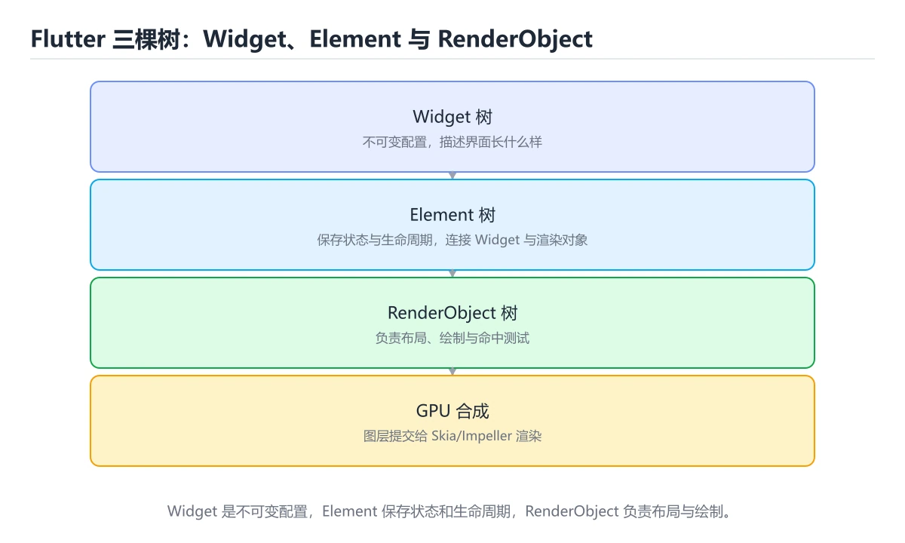
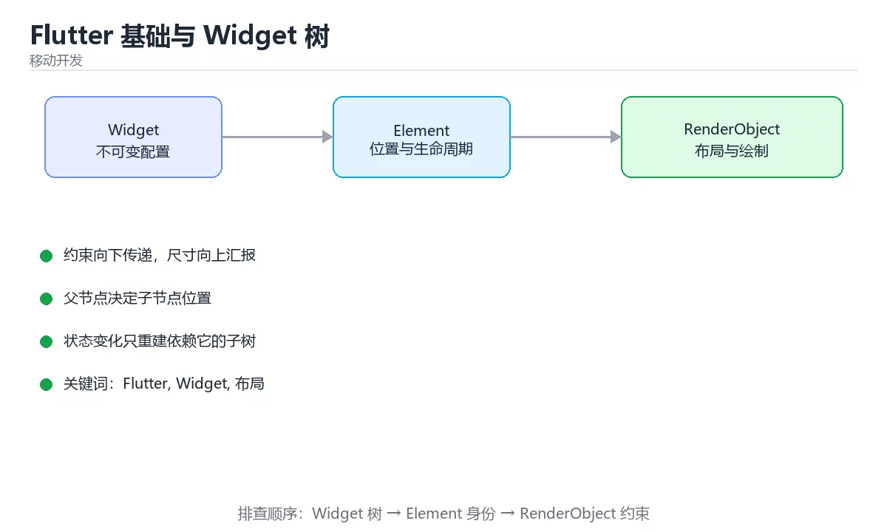

# Flutter 基础与 Widget 树





> 内容更新时间：2026-10-03 · 学习阶段：入门 · 预计用时：16 分钟

## 学习目标

- 能用自己的话解释「Flutter 基础与 Widget 树」解决了什么问题，而不是只背术语。
- 能说清 「Flutter」、「Widget」、「布局」、「约束」 之间的关系，并分别举出一个例子。
- 能把本课知识放回「移动开发」的知识体系，说明它和相邻主题的边界。
- 能完成本课练习，并用验收标准检查自己的结果。

> 一句话摘要：Widget 分类、布局三原则与常用布局对照。

## 前置知识

- 会进行基本的文件、命令行或浏览器操作；遇到不熟悉的术语先查本课关键词。
- 本课阶段：入门。只需要基本计算机操作，不要求编程经验。
- 开始前先复习：Flutter、Widget、布局。
- 如果某一步看不懂，先记录具体卡点，完成练习后再回头读一遍。


## 一切皆 Widget

Flutter 用 Dart 编写，UI 由 Widget 组合而成。Widget 是**不可变的配置描述**，真正的渲染由 Element 与 RenderObject 完成，因此重建 Widget 很廉价，性能瓶颈通常在布局与绘制。

| 类型 | 作用 | 例子 |
| --- | --- | --- |
| 布局 Widget | 控制位置与尺寸 | Row、Column、Stack、Container |
| 渲染 Widget | 直接绘制内容 | Text、Image、Icon |
| 交互 Widget | 处理输入 | GestureDetector、InkWell、TextField |
| 状态 Widget | 持有可变状态 | StatefulWidget、Provider 消费 |

## 布局三原则

1. 约束向下传递（父给子的最大/最小尺寸）。
2. 尺寸向上返回（子决定自己多大）。
3. 父决定子位置。

理解这三点就能解释绝大多数 "RenderFlex overflowed" 报错：Row/Column 在主轴方向需要有限空间，子项应使用 Expanded/Flexible 或可滚动的 ListView。

## 常用布局对照

| 需求 | Widget |
| --- | --- |
| 线性排列 | Row / Column（配 MainAxisAlignment） |
| 层叠 | Stack + Positioned |
| 网格 | GridView（SliverGridDelegate） |
| 滚动列表 | ListView.builder（长列表必须用 builder 懒加载） |
| 间距 | SizedBox 或 Padding（列表用 separator） |
| 自适应换行 | Wrap |

## 与 Android/iOS 的差异

Flutter 自带渲染引擎（Skia/Impeller）直接绘制，不依赖原生控件，因此**跨平台 UI 完全一致**；代价是包体较大、需要自带字体与图标，且极少数原生控件（如地图、相机）需通过插件桥接。

## 常用 Widget 代码骨架

| 需求 | 骨架要点 |
| --- | --- |
| 页面骨架 | Scaffold + AppBar + body，底部操作放 bottomNavigationBar |
| 列表 | ListView.builder(itemCount, itemBuilder) + ListView.separated 分隔线 |
| 卡片列表项 | Card 内套 InkWell 获得涟漪，Padding 统一内边距 |
| 表单 | Form + GlobalKey + TextFormField(validator) + _formKey.currentState!.validate() |
| 加载状态 | FutureBuilder 三分支：waiting 转圈、hasError 提示、无数据显示空状态 |
| 底部导航 | Scaffold + NavigationBar + IndexedStack 保留各页状态 |
| 下拉刷新 | RefreshIndicator 包 ListView，onRefresh 返回 Future |

调试技巧：`flutter run` 时按 `p` 打开布局检查器看约束；用 `debugPrint` 代替 print（长日志不被截断）；`flutter analyze` 进 CI 防低级错误。

## 本课小结
Flutter 的核心心智模型是**约束驱动的 Widget 树 + 不可变描述 + 状态驱动重建**；掌握布局三原则与 builder 懒加载，就能避免大部分性能与溢出问题。


## Widget 分类速查

| 类型 | 特点 | 典型组件 |
| --- | --- | --- |
| 无状态 | 不可变、由父级控制 | `StatelessWidget`、`Text`、`Icon` |
| 有状态 | 自身持有并修改状态 | `StatefulWidget`、`TextField`、`AnimationController` |
| 布局 | 控制子组件位置与尺寸 | `Row`、`Column`、`Stack`、`Wrap` |
| 容器与装饰 | 背景、边框、尺寸约束 | `Container`、`DecoratedBox`、`Card` |
| 滚动 | 提供滚动能力 | `ListView`、`GridView`、`CustomScrollView` |
| 交互 | 手势与命中测试 | `GestureDetector`、`InkWell`、`Dismissible` |

## 布局速查

| 需求 | 写法 |
| --- | --- |
| 主轴铺满 | `Expanded(child: ...)` 或 `flex: n` |
| 主轴居中 | `mainAxisAlignment: MainAxisAlignment.center` |
| 交叉轴拉伸 | `crossAxisAlignment: CrossAxisAlignment.stretch` |
| 固定间距 | `SizedBox(height: 12)` 或 `gap` 风格封装 |
| 等分网格 | `GridView.builder` + `SliverGridDelegateWithFixedCrossAxisCount` |
| 层叠 | `Stack` + `Positioned` |
| 溢出换行 | `Wrap` 或 `SingleChildScrollView` |
| 长列表 | `ListView.builder`（不要用 `Column` 堆） |

```dart
// 卡片列表：固定高度 + builder 懒加载，避免一次性构建全部子项
class LessonList extends StatelessWidget {
  const LessonList({super.key, required this.titles});

  final List<String> titles;

  @override
  Widget build(BuildContext context) {
    return ListView.separated(
      padding: const EdgeInsets.all(16),
      itemCount: titles.length,
      separatorBuilder: (_, __) => const SizedBox(height: 8),
      itemBuilder: (context, index) {
        return Card(
          child: ListTile(
            title: Text(titles[index]),
            trailing: const Icon(Icons.chevron_right),
            onTap: () {},
          ),
        );
      },
    );
  }
}

// 自适应两列：用 LayoutBuilder 按可用宽度决定列数
Widget adaptiveGrid(BuildContext context, List<Widget> items) {
  return LayoutBuilder(
    builder: (context, constraints) {
      final columns = constraints.maxWidth >= 900 ? 4 : (constraints.maxWidth >= 600 ? 3 : 2);
      return GridView.count(
        crossAxisCount: columns,
        shrinkWrap: true,
        physics: const NeverScrollableScrollPhysics(),
        children: items,
      );
    },
  );
}
```

## 常见错误对照表

| 容易踩的做法 | 实际现象 | 原因与正确做法 |
| --- | --- | --- |
| `Column` 里放长列表 | 溢出或性能差 | 改用 `ListView` / `CustomScrollView` |
| 只给子组件 `Container` 设宽高却期望撑满 | 尺寸不符合预期 | 用 `Expanded` 或 `SizedBox.expand` |
| 忘记 `const` | 无谓重建 | 能加的地方都加 `const` |
| 在 `Column` 里用 `Expanded` 但父级无限高 | 运行报错 | 用 `mainAxisSize` 或固定高度 |
| 用 `Container` 只为了 padding | 层次冗余 | 直接用 `Padding` |
| 直接改 Widget 字段期望刷新 | 界面不更新 | 状态改变要走 `setState` 或状态管理 |
| 大列表用 `Column` + `map` | 内存与首帧慢 | 用 `builder` 懒加载 |
| 不处理安全区域 | 内容被刘海或手势条遮挡 | 用 `SafeArea` |
| 硬编码尺寸 | 小屏溢出 | 用相对尺寸与 `LayoutBuilder` |
| 忘记 `dispose` 控制器 | 内存泄漏 | 在 `dispose` 中释放 |

## 自测清单

- [ ] 能说出无状态与有状态组件的使用边界。
- [ ] 会用 `Row`、`Column`、`Stack`、`Expanded` 完成常见布局。
- [ ] 长列表使用 `builder` 懒加载。
- [ ] 尺寸适配使用 `LayoutBuilder` 与相对单位。
- [ ] 控制器与监听在 `dispose` 中释放。


## 零基础详解：Widget、约束与布局

### 一句话说清它是什么

Flutter 里「一切皆 Widget」。理解布局只需记住三条：
**约束向下传递、尺寸向上汇报、父节点决定子节点位置**。

### 用生活比喻理解

| 概念 | 比喻 | 说明 |
| --- | --- | --- |
| Widget | 图纸 | 描述界面长什么样，本身不可变 |
| Element | 现场施工记录 | 连接 Widget 与真实渲染对象 |
| RenderObject | 实际建筑 | 负责测量、布局与绘制 |
| 约束 | 房间尺寸限制 | 父节点告诉子节点可用空间 |
| setState | 重新装修 | 标记需要重建的部分 |

### 三条布局规则

```text
1. 约束向下：父节点给出 minWidth/maxWidth/minHeight/maxHeight
2. 尺寸向上：子节点在约束内决定自己的大小并汇报
3. 父定位置：父节点决定把子节点放在哪
```

**看到 `RenderFlex overflowed` 就是子节点要的空间超过了父节点给的约束。**

### 最常用的五个布局组件

| 组件 | 作用 | 典型场景 |
| --- | --- | --- |
| `Row` / `Column` | 一维排列 | 横向或纵向组合 |
| `Expanded` / `Flexible` | 按比例分配剩余空间 | 让某个子项撑满 |
| `Stack` | 层叠定位 | 角标、悬浮按钮 |
| `ListView.builder` | 懒加载列表 | 长列表 |
| `Padding` / `SizedBox` | 留白与固定尺寸 | 间距控制 |

```dart
Column(
  crossAxisAlignment: CrossAxisAlignment.start,
  children: [
    const Text('标题', style: TextStyle(fontSize: 20)),
    const SizedBox(height: 8),                 // 用 SizedBox 控制间距
    Row(
      children: [
        const Icon(Icons.person),
        const SizedBox(width: 8),
        Expanded(                              // 占满剩余宽度
          child: Text(
            '很长的说明文字会自动换行，不会溢出',
            maxLines: 2,
            overflow: TextOverflow.ellipsis,
          ),
        ),
      ],
    ),
  ],
)
```

### 长列表一定用 builder

```dart
ListView.builder(
  itemCount: items.length,
  itemBuilder: (context, index) {
    final item = items[index];
    return ListTile(
      title: Text(item.title),
      subtitle: Text(item.subtitle),
      onTap: () => _open(context, item),
    );
  },
)
```

**不要用 `SingleChildScrollView` + `Column` 渲染几百条数据**，那样会一次性构建全部子项。

### 四类常见溢出与修法

| 报错 | 原因 | 修法 |
| --- | --- | --- |
| 横向溢出 | Row 内子项太宽 | 用 `Expanded` 或 `Flexible` 包住 |
| 纵向溢出 | Column 高度不够 | 用 `SingleChildScrollView` 或 `ListView` |
| 文本溢出 | 文字太长 | `maxLines` 加 `TextOverflow.ellipsis` |
| 无限高度约束 | ListView 套在 Column 里 | 给 `shrinkWrap` 或加 `Expanded` |

### 状态与重建

```dart
class Counter extends StatefulWidget {
  const Counter({super.key});

  @override
  State<Counter> createState() => _CounterState();
}

class _CounterState extends State<Counter> {
  int _count = 0;

  @override
  Widget build(BuildContext context) {
    return Column(
      children: [
        Text('计数：$_count'),
        FilledButton(
          onPressed: () => setState(() => _count++),   // 只在必要时重建
          child: const Text('加一'),
        ),
      ],
    );
  }
}
```

三条性能习惯：

```dart
1. 能加 const 就加：const 组件不会因父级重建而重建
2. setState 范围尽量小：把状态下沉到最小的 StatefulWidget
3. 高频重绘用 RepaintBoundary 隔离
```

### 新手最容易踩的八个坑

| 坑 | 现象 | 正确做法 |
| --- | --- | --- |
| 忘记 dispose 控制器 | 内存泄漏 | `dispose()` 里释放 |
| 在 build 里发请求 | 反复请求 | 放 `initState` 或状态管理 |
| setState 后已卸载 | 报「setState called after dispose」 | 加 `if (!mounted) return;` |
| ListView 套 Column | 高度约束冲突 | 用 `Expanded` 包 ListView |
| 用 `Container` 加宽高又不用 | 多余层级 | 用 `SizedBox` 更轻 |
| 列表 key 缺失 | 元素错位 | 用 `ValueKey(item.id)` |
| 硬编码尺寸 | 小屏溢出 | 用比例或 `LayoutBuilder` |
| 忽略 `SafeArea` | 内容被刘海遮挡 | 顶部或底部包 `SafeArea` |

### 手把手练习：一个可滚动的卡片列表

```dart
class ItemList extends StatelessWidget {
  const ItemList({super.key, required this.items});
  final List<Item> items;

  @override
  Widget build(BuildContext context) {
    if (items.isEmpty) {
      return const Center(child: Text('暂无数据'));
    }

    return ListView.separated(
      padding: const EdgeInsets.all(16),
      itemCount: items.length,
      separatorBuilder: (_, __) => const SizedBox(height: 12),
      itemBuilder: (context, index) {
        final item = items[index];
        return Card(
          key: ValueKey(item.id),
          child: ListTile(
            title: Text(item.title, maxLines: 1, overflow: TextOverflow.ellipsis),
            subtitle: Text(item.subtitle, maxLines: 2, overflow: TextOverflow.ellipsis),
            trailing: const Icon(Icons.chevron_right),
            onTap: () => Navigator.of(context).push(
              MaterialPageRoute(builder: (_) => DetailPage(item: item)),
            ),
          ),
        );
      },
    );
  }
}
```

### 学完自测

- [ ] 能背出布局三条规则。
- [ ] 知道 `Expanded` 与 `Flexible` 的区别。
- [ ] 能说出长列表为什么必须用 builder。
- [ ] 知道 `const` 组件为什么能减少重建。
- [ ] 能说出 `dispose` 里必须释放哪些东西。

## 动手练习


> 本课练习重点：围绕「Flutter、Widget、布局」完成复述、实验和交付，每个结果都要能被别人检查。

先做一个最小 Widget，再切换状态与约束，最后在窄屏和深色模式下验证布局。

### 练习 1：建立心智模型（10 分钟）

合上教程，用 3～5 句话回答：

1. 「Flutter 基础与 Widget 树」解决了什么问题？
2. 如果没有它，会出现什么具体后果？
3. 它和「Widget」是什么关系？

**验收标准**：至少出现一个本课关键词，并写出一个反例、边界条件或失效场景。

### 练习 2：做一次可控实验（20 分钟）

从正文中选一个最小示例，完成以下操作：

1. 先预测修改一个参数、输入或步骤后的结果。
2. 再实际执行或逐步推演，记录真实结果。
3. 如果结果与预测不同，写出差异原因。

**验收标准**：留下「原例 → 改动 → 预测 → 结果 → 原因」五步记录。

### 练习 3：交付一个小结果（30 分钟）

创建一个最小 Widget，分别验证正常输入、空数据和超长文本三种状态。

任务要求：

- 结果必须能被别人检查，不能只写“我已经理解了”。
- 至少覆盖「Flutter」和「Widget」两个关键词。
- 写出 1 个仍然不确定的问题，以及下一步如何验证。

> 提示：时间有限时优先做练习 1 和练习 2；练习 3 可以拆成两次完成。


## 实践任务

本节围绕“Flutter 基础与 Widget 树”安排 3 个可交付任务，每个任务都要求留下可以复查的记录。

### 任务 1：用自己的话画出结构

合上教程，用 5 句话说明“Flutter 基础与 Widget 树”解决什么问题、输入是什么、输出是什么、失败时会怎样、与相邻概念的边界在哪里。画一张流程图或状态图，把每个节点标注成“输入 / 处理 / 输出 / 失败路径”之一。

**验收标准**：图里至少有 5 个节点和 1 条失败路径；每个节点都能在正文中找到依据。

### 任务 2：做一次对比实验

从正文里选两个差异最小的方案，列成 4 列表格：方案、前提、代价、适用边界。然后只改变一个条件（数据规模、并发度、精度或资源上限），记录结果变化。

**验收标准**：表格里两个方案的结论不能完全一样；写下“在什么条件下应该换方案”。

### 任务 3：迁移到自己的场景

把“Flutter 基础与 Widget 树”的核心方法用到你熟悉的一个真实场景，写出一份 300 字以内的实施记录：目标、步骤、验证方式、仍然不确定的问题。

**验收标准**：至少有一个可复现的命令、代码片段或数据样例；结论能被别人独立检查。


## 故障现场

这一节把“Flutter 基础与 Widget 树”最常见的失败方式还原成现场记录，练习时按“症状 → 复现 → 定位 → 修复 → 预防”的顺序排查。

### 现场 1：“Flutter 基础与 Widget 树”的 Flutter 常规用例通过，但边界用例失败

**症状**：在“Flutter 基础与 Widget 树”的练习或生产场景里出现““Flutter 基础与 Widget 树”的 Flutter 常规用例通过，但边界用例失败”。

**复现**：准备一组最小输入，只保留触发““Flutter 基础与 Widget 树”的 Flutter 常规用例通过，但边界用例失败”的必要条件，连续运行两次确认结果稳定。

**定位**：围绕“Flutter 的前置条件与取值边界没有写进代码，默认值掩盖了空值和极值”检查调用链、输入数据和环境配置，先验证假设再改代码。

**修复**：为“Flutter 基础与 Widget 树”补一条空值或极值用例，把前置条件写成断言，并让失败信息直接指出是哪个输入越界

**预防**：把““Flutter 基础与 Widget 树”的 Flutter 常规用例通过，但边界用例失败”写成一条自动化用例，并在“Flutter 基础与 Widget 树”的验收清单里保留对应检查项。


### 现场 2：“Flutter 基础与 Widget 树”的 Widget 结果在两次运行之间不一致

**症状**：在“Flutter 基础与 Widget 树”的练习或生产场景里出现““Flutter 基础与 Widget 树”的 Widget 结果在两次运行之间不一致”。

**复现**：准备一组最小输入，只保留触发““Flutter 基础与 Widget 树”的 Widget 结果在两次运行之间不一致”的必要条件，连续运行两次确认结果稳定。

**定位**：围绕“Widget 依赖了当前版本、执行顺序或共享状态，单次运行无法暴露差异”检查调用链、输入数据和环境配置，先验证假设再改代码。

**修复**：固定“Flutter 基础与 Widget 树”使用的版本与随机种子，记录两次运行的完整输入和输出，再逐项消除非确定性来源

**预防**：把““Flutter 基础与 Widget 树”的 Widget 结果在两次运行之间不一致”写成一条自动化用例，并在“Flutter 基础与 Widget 树”的验收清单里保留对应检查项。


### 现场 3：“Flutter 基础与 Widget 树”的验证只在开发机通过

**症状**：在“Flutter 基础与 Widget 树”的练习或生产场景里出现““Flutter 基础与 Widget 树”的验证只在开发机通过”。

**复现**：准备一组最小输入，只保留触发““Flutter 基础与 Widget 树”的验证只在开发机通过”的必要条件，连续运行两次确认结果稳定。

**定位**：围绕“环境版本、配置和输入规模与目标环境不同，Flutter 缺少可重复的验证记录”检查调用链、输入数据和环境配置，先验证假设再改代码。

**修复**：把“Flutter 基础与 Widget 树”的运行环境、输入样本和预期输出写成清单，并在另一套环境复跑同一条命令

**预防**：把““Flutter 基础与 Widget 树”的验证只在开发机通过”写成一条自动化用例，并在“Flutter 基础与 Widget 树”的验收清单里保留对应检查项。


## 考点精讲：把测验题还原成判断过程

本课有 6 个判断点。先自己作答，再看「判断依据」；如果结论正确但理由不完整，回到正文对应章节补足概念。

### 考点 1：Flutter 布局的三条原则是？

- **正确判断**：约束向下、尺寸向上、父决定位置
- **判断依据**：正确答案是「约束向下、尺寸向上、父决定位置」，本课在「零基础详解：Widget、约束与布局」中说明：约束向下传递、尺寸向上汇报、父节点决定子节点位置。理解它才能解释 RenderFlex overflow 等报错。本课还在「常用 Widget 代码骨架」中说明：调试技巧：flutter run 时按 p 打开布局检查器看约束。本课还在「常用 Widget 代码骨架」中说明：flutter analyze 进 CI 防低级错误。
- **迁移检查**：把题干里的一个条件换成边界值，原来的结论还成立吗？写出判断过程。

### 考点 2：长列表应该使用？

- **正确判断**：ListView.builder 懒加载
- **判断依据**：正确答案是「ListView.builder 懒加载」，本课在「零基础详解：Widget、约束与布局」中说明：能说出长列表为什么必须用 builder。builder 只构建可见项，避免一次性创建大量 Widget。，本课在「本课小结」中说明：掌握布局三原则与 builder 懒加载，就能避免大部分性能与溢出问题。本课还在「常用 Widget 代码骨架」中说明：调试技巧：flutter run 时按 p 打开布局检查器看约束。
- **迁移检查**：如果给某个错误选项去掉一个限定词，它会不会变成正确？说明理由。

### 考点 3：Flutter 在各平台 UI 高度一致的原因是？

- **正确判断**：自带渲染引擎直接绘制
- **判断依据**：正确答案是「自带渲染引擎直接绘制」，本课在「与 Android/iOS 的差异」中说明：Flutter 自带渲染引擎（Skia/Impeller）直接绘制，不依赖原生控件，因此跨平台 UI 完全一致。代价是包体较大，部分能力需插件桥接。本课还在「与 Android/iOS 的差异」中说明：代价是包体较大、需要自带字体与图标，且极少数原生控件（如地图、相机）需通过插件桥接。本课还在「一切皆 Widget」中说明：Widget 是不可变的配置描述，真正的渲染由 Element 与 RenderObject 完成，因此重建 Widget 很廉价，性能瓶颈通常在布局与绘制。
- **迁移检查**：如果给某个错误选项去掉一个限定词，它会不会变成正确？说明理由。

### 考点 4：让 Row 中的子项按比例占满剩余宽度，应该使用？

- **正确判断**：Expanded(flex: n)
- **判断依据**：正确答案是「Expanded(flex: n)」，本课在「布局三原则」中说明：理解这三点就能解释绝大多数 "RenderFlex overflowed" 报错：Row/Column 在主轴方向需要有限空间，子项应使用 Expanded/Flexible 或可滚动的 ListView。Expanded 会按 flex 比例瓜分剩余空间。本课还在「本课小结」中说明：Flutter 的核心心智模型是约束驱动的 Widget 树 + 不可变描述 + 状态驱动重建。
- **迁移检查**：遮住选项，只根据定义复述一次答案，再回来看哪个选项与复述一致。

### 考点 5：热重载（hot reload）与热重启（hot restart）的关键区别是？

- **正确判断**：热重载保留当前 State
- **判断依据**：正确答案是「热重载保留当前 State」，本课在「本课小结」中说明：掌握布局三原则与 builder 懒加载，就能避免大部分性能与溢出问题。热重载只重新执行 build，State 与页面栈保留。本课还在「零基础详解：Widget、约束与布局」中说明：看到 RenderFlex overflowed 就是子节点要的空间超过了父节点给的约束。本课还在「零基础详解：Widget、约束与布局」中说明：知道 Expanded 与 Flexible 的区别。
- **迁移检查**：如果给某个错误选项去掉一个限定词，它会不会变成正确？说明理由。

### 考点 6：补全代码：「Flutter 基础与 Widget 树」示例中，下面这行代码缺少哪个关键字或函数名？请填入 ____。 `return ____(`

- **正确判断**：LayoutBuilder / layoutbuilder
- **判断依据**：正确答案是「LayoutBuilder」，这道题在问补全代码：Flutter基础与Widget树示例中，…填入____，`return____(`，判断时要把题干限定的输入、边界与目标逐项对齐。本课示例中还能看到 `return LayoutBuilder(` 这样的用法，说明该关键字在本课代码中承担实际功能。
- **迁移检查**：如果填成相近的另一个函数或关键字，程序会在哪一步出错？

### 补充考点 1：关于「Flutter 基础与 Widget 树」，下列哪些说法是正确的？（多选）

- **正确判断**：ListView.builder 懒加载；约束向下、尺寸向上、父决定位置
- **判断依据**：正确答案是「ListView.builder 懒加载；约束向下、尺寸向上、父决定位置」。本课的两个判断点可以互相印证：正确答案是「约束向下、尺寸向上、父决定位置」，本课在「零基础详解·Widget、约束与布局」中说明：约束向下传递、尺寸向上汇报、父节点决定子节点位置。理解它才能解释 RenderF…；Widget 分类、布局三原则与常用布局对照。。在「Flutter 基础与 Widget 树」中，多选时不能只凭一个关键词选答案，要逐项核对题干限定的对象和边界。

### 补充自测（2 题）

1. 按“Flutter 基础与 Widget 树”中 Flutter、Widget、布局 的实践顺序，把四个步骤排成从准备到复盘的合理顺序。
2. 下面这段 Dart 代码复现了“Flutter 基础与 Widget 树”中 Flutter、Widget、布局 相关的一个常见故障，哪一项最准确地解释了问题？

这些题按“先定位概念、再排除边界错误、最后核对答案”的顺序作答；每题解析都给出了判断依据。


## 本课复习清单

离开本课前，逐项确认：

- [ ] 不看解析，能说出「Flutter 布局的三条原则是？」的判断依据。
- [ ] 不看解析，能说出「长列表应该使用？」的判断依据。
- [ ] 不看解析，能说出「Flutter 在各平台 UI 高度一致的原因是？」的判断依据。
- [ ] 不看解析，能说出「让 Row 中的子项按比例占满剩余宽度，应该使用？」的判断依据。
- [ ] 不看解析，能说出「热重载（hot reload）与热重启（hot restart）的关键区别是？」的判断依据。
- [ ] 不看解析，能说出「补全代码：「Flutter 基础与 Widget 树」示例中，下面这行代码缺少哪…」的判断依据。
- [ ] 至少运行一次本课示例，记录输入、输出和一个边界情况。
- [ ] 把本课最容易混淆的两个概念写成一句话对照。

| 复盘项 | 记录 |
| --- | --- |
| 已经能独立解释的考点 |  |
| 仍然说不清的概念 |  |
| 下一步验证动作 |  |

## 术语速查

把本课反复出现的术语集中放在一起。复习时先遮住右列，尝试用自己的话解释，再回到正文核对。

| 术语 | 本课语境 |
| --- | --- |
| `flutter run` | 调试技巧：`flutter run` 时按 `p` 打开布局检查器看约束；用 `debugPrint` 代替 print（长日志不被截断）；`flutter analyze` 进 CI 防低级错误。 |
| `打开布局检查器看约束；用` | 调试技巧：`flutter run` 时按 `p` 打开布局检查器看约束；用 `debugPrint` 代替 print（长日志不被截断）；`flutter analyze` 进 CI 防低级错误。 |
| `代替 print（长日志不被截断）；` | 调试技巧：`flutter run` 时按 `p` 打开布局检查器看约束；用 `debugPrint` 代替 print（长日志不被截断）；`flutter analyze` 进 CI 防低级错误。 |
| `StatelessWidget` | \| 无状态 \| 不可变、由父级控制 \| `StatelessWidget`、`Text`、`Icon` \| |
| `Text` | \| 无状态 \| 不可变、由父级控制 \| `StatelessWidget`、`Text`、`Icon` \| |
| `Icon` | \| 无状态 \| 不可变、由父级控制 \| `StatelessWidget`、`Text`、`Icon` \| |
| `StatefulWidget` | \| 有状态 \| 自身持有并修改状态 \| `StatefulWidget`、`TextField`、`AnimationController` \| |
| `TextField` | \| 有状态 \| 自身持有并修改状态 \| `StatefulWidget`、`TextField`、`AnimationController` \| |
| `AnimationController` | \| 有状态 \| 自身持有并修改状态 \| `StatefulWidget`、`TextField`、`AnimationController` \| |
| `Row` | \| 布局 \| 控制子组件位置与尺寸 \| `Row`、`Column`、`Stack`、`Wrap` \| |
| `Column` | \| 布局 \| 控制子组件位置与尺寸 \| `Row`、`Column`、`Stack`、`Wrap` \| |
| `Stack` | \| 布局 \| 控制子组件位置与尺寸 \| `Row`、`Column`、`Stack`、`Wrap` \| |

## 面试问答与自测

下面把本课考点换成面试追问。先口述自己的答案，
再对照参考回答检查是否遗漏了前提、边界或失败路径。

### 追问 1：Flutter 布局的三条原则是？

**参考回答**：正确答案是「约束向下、尺寸向上、父决定位置」，本课在「零基础详解·Widget、约束与布局」中说明：约束向下传递、尺寸向上汇报、父节点决定子节点位置。理解它才能解释 RenderFlex overflow 等报错。本课还在「常用 Widget 代码骨架」中说明：调试技巧：flutter run 时按 p 打开布局检查器看约束。本课还在「常用 Widget 代码骨架」中说明：flutter analyze 进 CI 防低级错误。

### 追问 2：长列表应该使用？

**参考回答**：正确答案是「ListView.builder 懒加载」，本课在「零基础详解·Widget、约束与布局」中说明：能说出长列表为什么必须用 builder。builder 只构建可见项，避免一次性创建大量 Widget。，本课在「本课小结」中说明：掌握布局三原则与 builder 懒加载，就能避免大部分性能与溢出问题。本课还在「常用 Widget 代码骨架」中说明：调试技巧：flutter run 时按 p 打开布局检查器看约束。

### 追问 3：Flutter 在各平台 UI 高度一致的原因是？

**参考回答**：正确答案是「自带渲染引擎直接绘制」，本课在「与 Android/iOS 的差异」中说明：Flutter 自带渲染引擎（Skia/Impeller）直接绘制，不依赖原生控件，因此跨平台 UI 完全一致。代价是包体较大，部分能力需插件桥接。本课还在「与 Android/iOS 的差异」中说明：代价是包体较大、需要自带字体与图标，且极少数原生控件（如地图、相机）需通过插件桥接。本课还在「一切皆 Widget」中说明：Widget 是不可变的配置描述，真正的渲染由 Element 与 RenderObject 完成，因此重建 Widget 很廉价，性能瓶颈通常在布局与绘制。

### 追问 4：让 Row 中的子项按比例占满剩余宽度，应该使用？

**参考回答**：正确答案是「Expanded(flex: n)」，本课在「布局三原则」中说明：理解这三点就能解释绝大多数 "RenderFlex overflowed" 报错：Row/Column 在主轴方向需要有限空间，子项应使用 Expanded/Flexible 或可滚动的 ListView。Expanded 会按 flex 比例瓜分剩余空间。本课还在「本课小结」中说明：Flutter 的核心心智模型是约束驱动的 Widget 树 + 不可变描述 + 状态驱动重建。

### 追问 5：热重载（hot reload）与热重启（hot restart）的关键区别是？

**参考回答**：正确答案是「热重载保留当前 State」，本课在「本课小结」中说明：掌握布局三原则与 builder 懒加载，就能避免大部分性能与溢出问题。热重载只重新执行 build，State 与页面栈保留。本课还在「零基础详解·Widget、约束与布局」中说明：看到 RenderFlex overflowed 就是子节点要的空间超过了父节点给的约束。本课还在「零基础详解·Widget、约束与布局」中说明：知道 Expanded 与 Flexible 的区别。

## English Overview

**Title:** Flutter Basics

**Summary:** Widget types, layout rules and common layouts.

**Category:** Mobile Development  
**Level:** 入门  
**Key terms:** Flutter, Widget, 布局, 约束

> The full tutorial is written in Chinese. This bilingual overview helps English readers identify the topic, scope and key terms before studying the detailed examples.

## 内容元数据

- 内容版本：v2.0
- 最后更新：2026-10-03
- 学习阶段：入门
- 适用环境：Flutter 3.x / Dart 3.x
- 内容来源：内置结构化课程与工程实践整理
- 相关主题：Flutter、Widget、布局、约束
- 质量版本：P0 测验标准 + P1 覆盖扩展 + P2 体验补全


## 参考资料与复核

- 最后复核：2026-10-04
- 下次复核：2027-04-04
- 复核范围：版本兼容、API 行为、安全建议与工程实践
- 来源性质：官方文档与标准；本课正文为离线教学重组，不复制原文

| 参考资料 | 本课用途 |
| --- | --- |
| [Flutter 官方文档](https://docs.flutter.dev/) | 框架、组件与发布流程 |
| [Dart 官方文档](https://dart.dev/guides) | 语言、异步与工具链 |

> 本课主题：Widget 分类、布局三原则与常用布局对照。

> App 完全离线展示文字链接，不会自动联网；需要延伸阅读时可复制链接到浏览器。
