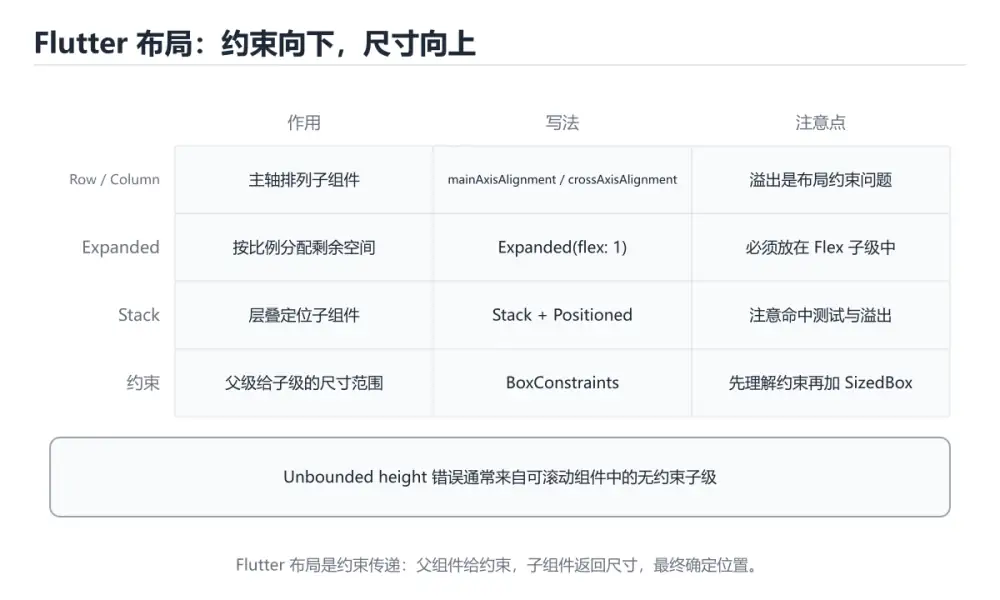
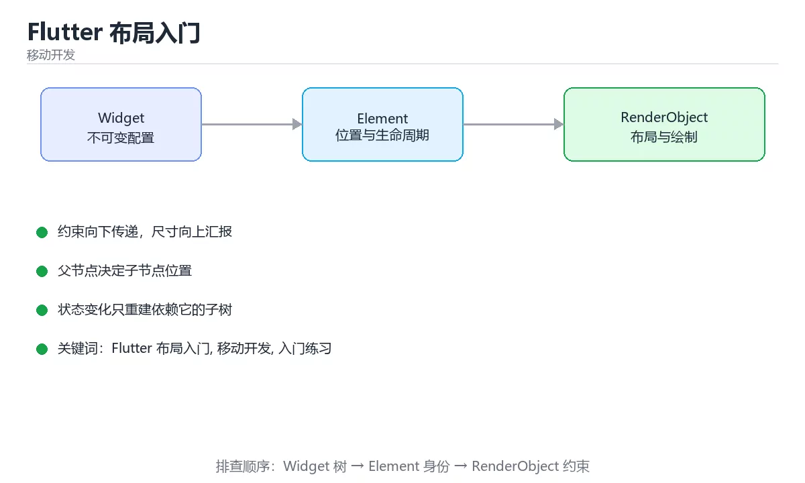

# Flutter 布局入门





> 内容更新时间：2026-10-03 · 学习阶段：入门 · 预计用时：15 分钟

## 学习目标

- 先认识「Flutter 布局入门」需要的工具、输入和输出。
- 按步骤运行最小示例，并记录结果与错误。
- 用一个边界输入验证自己是否真正掌握。

## 前置知识

- 会进行基本的文件或命令行操作。
- 不需要预先掌握「移动开发」的高级知识。

## 一句话入门

用 Row、Column 和 Expanded 完成基础布局。

## 最小示例

```dart
import 'package:flutter/material.dart';

void main() {
  runApp(
    const MaterialApp(
      home: Scaffold(
        body: Column(
          children: [
            Expanded(child: ColoredBox(color: Color(0xFF2F6BFF))),
            SizedBox(height: 12, child: ColoredBox(color: Color(0xFFE7EAF0))),
            Expanded(child: ColoredBox(color: Color(0xFFFFFFFF))),
          ],
        ),
      ),
    ),
  );
}
```

## 预期输出

```text
页面被分成上下两块等高的色块，中间是一条 12px 高的浅灰间隔
```

## 常见错误

- 输入或环境与示例不一致，导致结果不符合预期。
- 复制命令时遗漏空格、引号或必要参数。

## 动手练习

1. 原样运行最小示例，保存命令和输出。
2. 把数字 2 改成 10，预测并验证新结果。
3. 制造一个错误输入，写出错误信息和修复方法。

## 本课小结

- 入门阶段先保证能运行、能观察、能解释，再追求复杂功能。
- 每次只改一个变量，记录预测与实际结果。
- 遇到错误先看第一条错误信息，再回到最小示例。


## 代码实验：把示例跑成证据

这一节不引入新语法，而是把「Flutter 布局入门」的最小示例变成可以复现、可以对照的实验。每次只改变一个条件，先写预测，再运行，最后解释差异。

### 实验一：建立基线

```dart
import 'package:flutter/material.dart';

void main() {
  runApp(
    const MaterialApp(
      home: Scaffold(
        body: Column(
          children: [
            Expanded(child: ColoredBox(color: Color(0xFF2F6BFF))),
            SizedBox(height: 12, child: ColoredBox(color: Color(0xFFE7EAF0))),
            Expanded(child: ColoredBox(color: Color(0xFFFFFFFF))),
          ],
        ),
      ),
    ),
  );
}
```

先原样运行上面的代码，记录命令、完整输出和退出状态。然后把输出与正文的预期输出逐字对照，不要用“看起来差不多”代替核对；空格、大小写、换行和错误流向都可能暴露环境差异。

### 实验二：只改一个输入

从代码中选一个会影响结果的字面量、参数或输入，把它替换成边界值：数值可尝试 0、1、最大值和最小值，字符串可尝试空串和超长文本，集合可尝试空集合、单元素和重复元素。先写出预测，再运行并记录实际结果。

### 实验三：制造一个可控错误

把可空变量直接当作非空使用，或者去掉一个必要的 await。记录分析器或运行时的第一条错误，再用空安全或异步等待修复。

| 实验 | 改动 | 预测 | 实际 | 结论 |
| --- | --- | --- | --- | --- |
| 基线 | 保持原样 |  |  |  |
| 边界 |  |  |  |  |
| 失败 |  |  |  |  |

### 实验四：用三句话复述

1. 输入是什么，哪些输入属于合法范围，哪些属于边界或非法范围？
2. 程序按什么顺序处理输入，在哪一步产生了状态变化或副作用？
3. 输出如何验证，失败时第一条可观察证据是什么？

## Dart 与 Flutter 基础机制速览

### Dart、Widget 与构建过程

Flutter 使用 Dart 语言和自带渲染引擎，UI 由不可变 Widget 树描述。`build` 方法根据当前状态返回 Widget 配置，框架比较新旧树并更新必要的渲染对象。Widget 很轻量，频繁重建本身不是问题，真正昂贵的是布局、绘制、图片解码和同步计算。`const` 构造函数能在编译期复用对象，减少不必要的重建。

### 布局与约束

Flutter 布局遵循“约束向下、尺寸向上、父决定位置”。父节点给子节点最大和最小约束，子节点在约束内选择尺寸并向上汇报，父节点决定放置位置。`Row`、`Column`、`Stack`、`Expanded`、`Flexible` 和 `ListView` 各有布局规则；溢出通常不是“孩子太大”这么简单，而是约束链中某一层没有提供可分配空间。调试布局时先看约束，再看尺寸和位置。

### 状态、生命周期与重建

无状态 Widget 只依赖输入，状态变化由父级重建；有状态 Widget 通过 `State` 保存跨帧数据，`setState` 通知框架重新构建。`initState`、`didChangeDependencies`、`dispose` 分别用于初始化、响应依赖变化和释放资源。状态应尽量靠近使用它的组件，跨页面共享再用 Provider、Riverpod 等方案；全局状态过多会让重建范围和依赖关系难以推理。

### 异步、Future 与 Stream

Dart 使用 Future 表示一次异步结果，Stream 表示连续事件序列。`async/await` 让异步代码更易读，但 UI 线程仍然不能被长时间同步计算阻塞。网络、文件和数据库操作要处理超时、取消和错误；在 Widget 中使用异步结果前要检查 `mounted`，避免页面销毁后调用 setState。StreamBuilder 和 FutureBuilder 只负责展示状态，业务逻辑应放在可测试的服务层。

### 空安全、性能与测试

Dart 空安全区分可空和非空类型，`?`、`!`、`?.`、`??` 分别表达可空、断言、安全访问和默认值；`!` 应尽量少用，优先通过控制流让编译器理解非空。性能优化先用 DevTools 测量，再处理重建范围、图片缓存、列表懒加载和 isolate 计算。Widget 测试验证界面与交互，单元测试验证纯逻辑，集成测试覆盖关键流程。

## 实践任务

本节围绕“Flutter 布局入门”安排 3 个可交付任务，每个任务都要求留下可以复查的记录。

### 任务 1：用自己的话画出结构

合上教程，用 5 句话说明“Flutter 布局入门”解决什么问题、输入是什么、输出是什么、失败时会怎样、与相邻概念的边界在哪里。画一张流程图或状态图，把每个节点标注成“输入 / 处理 / 输出 / 失败路径”之一。

**验收标准**：图里至少有 5 个节点和 1 条失败路径；每个节点都能在正文中找到依据。

### 任务 2：做一次对比实验

从正文里选两个差异最小的方案，列成 4 列表格：方案、前提、代价、适用边界。然后只改变一个条件（数据规模、并发度、精度或资源上限），记录结果变化。

**验收标准**：表格里两个方案的结论不能完全一样；写下“在什么条件下应该换方案”。

### 任务 3：迁移到自己的场景

把“Flutter 布局入门”的核心方法用到你熟悉的一个真实场景，写出一份 300 字以内的实施记录：目标、步骤、验证方式、仍然不确定的问题。

**验收标准**：至少有一个可复现的命令、代码片段或数据样例；结论能被别人独立检查。


## 故障现场

这一节把“Flutter 布局入门”最常见的失败方式还原成现场记录，练习时按“症状 → 复现 → 定位 → 修复 → 预防”的顺序排查。

### 现场 1：“Flutter 布局入门”的 Flutter 布局入门 常规用例通过，但边界用例失败

**症状**：在“Flutter 布局入门”的练习或生产场景里出现““Flutter 布局入门”的 Flutter 布局入门 常规用例通过，但边界用例失败”。

**复现**：准备一组最小输入，只保留触发““Flutter 布局入门”的 Flutter 布局入门 常规用例通过，但边界用例失败”的必要条件，连续运行两次确认结果稳定。

**定位**：围绕“Flutter 布局入门 的前置条件与取值边界没有写进代码，默认值掩盖了空值和极值”检查调用链、输入数据和环境配置，先验证假设再改代码。

**修复**：为“Flutter 布局入门”补一条空值或极值用例，把前置条件写成断言，并让失败信息直接指出是哪个输入越界

**预防**：把““Flutter 布局入门”的 Flutter 布局入门 常规用例通过，但边界用例失败”写成一条自动化用例，并在“Flutter 布局入门”的验收清单里保留对应检查项。


### 现场 2：“Flutter 布局入门”的 移动开发 结果在两次运行之间不一致

**症状**：在“Flutter 布局入门”的练习或生产场景里出现““Flutter 布局入门”的 移动开发 结果在两次运行之间不一致”。

**复现**：准备一组最小输入，只保留触发““Flutter 布局入门”的 移动开发 结果在两次运行之间不一致”的必要条件，连续运行两次确认结果稳定。

**定位**：围绕“移动开发 依赖了当前版本、执行顺序或共享状态，单次运行无法暴露差异”检查调用链、输入数据和环境配置，先验证假设再改代码。

**修复**：固定“Flutter 布局入门”使用的版本与随机种子，记录两次运行的完整输入和输出，再逐项消除非确定性来源

**预防**：把““Flutter 布局入门”的 移动开发 结果在两次运行之间不一致”写成一条自动化用例，并在“Flutter 布局入门”的验收清单里保留对应检查项。


### 现场 3：“Flutter 布局入门”的验证只在开发机通过

**症状**：在“Flutter 布局入门”的练习或生产场景里出现““Flutter 布局入门”的验证只在开发机通过”。

**复现**：准备一组最小输入，只保留触发““Flutter 布局入门”的验证只在开发机通过”的必要条件，连续运行两次确认结果稳定。

**定位**：围绕“环境版本、配置和输入规模与目标环境不同，Flutter 布局入门 缺少可重复的验证记录”检查调用链、输入数据和环境配置，先验证假设再改代码。

**修复**：把“Flutter 布局入门”的运行环境、输入样本和预期输出写成清单，并在另一套环境复跑同一条命令

**预防**：把““Flutter 布局入门”的验证只在开发机通过”写成一条自动化用例，并在“Flutter 布局入门”的验收清单里保留对应检查项。


## 考点精讲：把测验题还原成判断过程

本课有 5 个判断点。先自己作答，再看「判断依据」；如果结论正确但理由不完整，回到正文对应章节补足概念。

### 考点 1：Row 与 Column 分别沿哪个方向排列子节点？

- **正确判断**：Row 沿水平主轴，Column 沿垂直主轴排列
- **判断依据**：正确答案是「Row 沿水平主轴，Column 沿垂直主轴排列」，本课在「Dart 与 Flutter 基础机制速览」中说明：父节点给子节点最大和最小约束，子节点在约束内选择尺寸并向上汇报，父节点决定放置位置。Row 的主轴是水平方向，Column 的主轴是垂直方向。本课还在「Dart 与 Flutter 基础机制速览」中说明：Dart 空安全区分可空和非空类型，?、!、?.、?? 分别表达可空、断言、安全访问和默认值。
- **迁移检查**：如果给某个错误选项去掉一个限定词，它会不会变成正确？说明理由。

### 考点 2：在 Row 或 Column 中，Expanded 起到什么作用？

- **正确判断**：按 flex 比例瓜分主轴上的剩余空间
- **判断依据**：正确答案是「按 flex 比例瓜分主轴上的剩余空间」，本课在「Dart 与 Flutter 基础机制速览」中说明：父节点给子节点最大和最小约束，子节点在约束内选择尺寸并向上汇报，父节点决定放置位置。Row 或 Column 先安置固定尺寸的子节点，再把主轴剩余空间按 flex 权重分给 Expanded 包裹的子节点，因此 Expanded 常用于让某一列或某个区域撑满可用空间。本课还在「Dart 与 Flutter 基础机制速览」中说明：Flutter 布局遵循“约束向下、尺寸向上、父决定位置”。
- **迁移检查**：遮住选项，只根据定义复述一次答案，再回来看哪个选项与复述一致。

### 考点 3：本课最小示例中的 Column 会把页面分成什么结构？

- **正确判断**：上下两块等高色块，中间是一条浅灰间隔
- **判断依据**：正确答案是「上下两块等高色块，中间是一条浅灰间隔」，本课在「Dart 与 Flutter 基础机制速览」中说明：Widget 很轻量，频繁重建本身不是问题，真正昂贵的是布局、绘制、图片解码和同步计算。示例在 Column 中放入 Expanded 色块、固定高度的 SizedBox 间隔和另一个色块，Expanded 会吃掉剩余高度，于是页面呈现上下两块等高分区的效果。本课还在「Dart 与 Flutter 基础机制速览」中说明：Row、Column、Stack、Expanded、Flexible 和 ListView 各有布局规则。
- **迁移检查**：如果给某个错误选项去掉一个限定词，它会不会变成正确？说明理由。

### 考点 4：布局时出现 RenderFlex overflow 警告，通常意味着什么？

- **正确判断**：子节点在主轴上的总尺寸超过了可用约束
- **判断依据**：正确答案是「子节点在主轴上的总尺寸超过了可用约束」，本课在「Dart 与 Flutter 基础机制速览」中说明：溢出通常不是“孩子太大”这么简单，而是约束链中某一层没有提供可分配空间。RenderFlex 是 Row、Column 等弹性布局的渲染对象，当子节点尺寸总和超出父容器给出的约束时，它会在边缘报告溢出。本课还在「Dart 与 Flutter 基础机制速览」中说明：const 构造函数能在编译期复用对象，减少不必要的重建。
- **迁移检查**：遮住选项，只根据定义复述一次答案，再回来看哪个选项与复述一致。

### 考点 5：补全代码：「Flutter 布局入门」示例中，下面这行代码缺少哪个关键字或函数名？请填入 ____。 `____(child: ColoredBox(color: Color(0xFF2F6BFF))),`

- **正确判断**：Expanded / expanded
- **判断依据**：正确答案是「Expanded」，本课在「一句话入门」中说明：用 Row、Column 和 Expanded 完成基础布局。本课还在「Dart 与 Flutter 基础机制速览」中说明：Row、Column、Stack、Expanded、Flexible 和 ListView 各有布局规则。本课还在「Dart 与 Flutter 基础机制速览」中说明：async/await 让异步代码更易读，但 UI 线程仍然不能被长时间同步计算阻塞。
- **迁移检查**：不看题干，用自己的话补全这句话，再与标准答案对照。

### 补充考点 1：关于「Flutter 布局入门」，下列哪些说法是正确的？（多选）

- **正确判断**：Row 沿水平主轴，Column 沿垂直主轴排列；按 flex 比例瓜分主轴上的剩余空间
- **判断依据**：正确答案是「Row 沿水平主轴，Column 沿垂直主轴排列；按 flex 比例瓜分主轴上的剩余空间」。本课的两个判断点可以互相印证：正确答案是「Row 沿水平主轴，Column 沿垂直主轴排列」，本课在「Dart 与 Flutter 基础机制速览」中说明：父节点给子节点最大和最小约束，子节点在约束内选择尺寸并向…；用 Row、Column 和 Expanded 完成基础布局。。在「Flutter 布局入门」中，多选时不能只凭一个关键词选答案，要逐项核对题干限定的对象和边界。

### 补充自测（1 题）

1. 下面这段 Dart 代码复现了“Flutter 布局入门”中 Flutter 布局入门、移动开发、入门练习 相关的一个常见故障，哪一项最准确地解释了问题？

这些题按“先定位概念、再排除边界错误、最后核对答案”的顺序作答；每题解析都给出了判断依据。


## 本课复习清单

离开本课前，逐项确认：

- [ ] 不看解析，能说出「Row 与 Column 分别沿哪个方向排列子节点？」的判断依据。
- [ ] 不看解析，能说出「在 Row 或 Column 中，Expanded 起到什么作用？」的判断依据。
- [ ] 不看解析，能说出「本课最小示例中的 Column 会把页面分成什么结构？」的判断依据。
- [ ] 不看解析，能说出「布局时出现 RenderFlex overflow 警告，通常意味着什么？」的判断依据。
- [ ] 不看解析，能说出「补全代码：「Flutter 布局入门」示例中，下面这行代码缺少哪个关键字或函数名…」的判断依据。
- [ ] 至少运行一次本课示例，记录输入、输出和一个边界情况。
- [ ] 把本课最容易混淆的两个概念写成一句话对照。

| 复盘项 | 记录 |
| --- | --- |
| 已经能独立解释的考点 |  |
| 仍然说不清的概念 |  |
| 下一步验证动作 |  |

## 术语速查

把本课反复出现的术语集中放在一起。复习时先遮住右列，尝试用自己的话解释，再回到正文核对。

| 术语 | 本课语境 |
| --- | --- |
| `build` | Flutter 使用 Dart 语言和自带渲染引擎，UI 由不可变 Widget 树描述。`build` 方法根据当前状态返回 Widget 配置，框架比较新旧树并更新必要的渲染对象。Widget 很轻量，频繁重建本身不… |
| `const` | Flutter 使用 Dart 语言和自带渲染引擎，UI 由不可变 Widget 树描述。`build` 方法根据当前状态返回 Widget 配置，框架比较新旧树并更新必要的渲染对象。Widget 很轻量，频繁重建本身不… |
| `Row` | Flutter 布局遵循“约束向下、尺寸向上、父决定位置”。父节点给子节点最大和最小约束，子节点在约束内选择尺寸并向上汇报，父节点决定放置位置。`Row`、`Column`、`Stack`、`Expanded`、`Fle… |
| `Column` | Flutter 布局遵循“约束向下、尺寸向上、父决定位置”。父节点给子节点最大和最小约束，子节点在约束内选择尺寸并向上汇报，父节点决定放置位置。`Row`、`Column`、`Stack`、`Expanded`、`Fle… |
| `Stack` | Flutter 布局遵循“约束向下、尺寸向上、父决定位置”。父节点给子节点最大和最小约束，子节点在约束内选择尺寸并向上汇报，父节点决定放置位置。`Row`、`Column`、`Stack`、`Expanded`、`Fle… |
| `Expanded` | Flutter 布局遵循“约束向下、尺寸向上、父决定位置”。父节点给子节点最大和最小约束，子节点在约束内选择尺寸并向上汇报，父节点决定放置位置。`Row`、`Column`、`Stack`、`Expanded`、`Fle… |
| `Flexible` | Flutter 布局遵循“约束向下、尺寸向上、父决定位置”。父节点给子节点最大和最小约束，子节点在约束内选择尺寸并向上汇报，父节点决定放置位置。`Row`、`Column`、`Stack`、`Expanded`、`Fle… |
| `ListView` | Flutter 布局遵循“约束向下、尺寸向上、父决定位置”。父节点给子节点最大和最小约束，子节点在约束内选择尺寸并向上汇报，父节点决定放置位置。`Row`、`Column`、`Stack`、`Expanded`、`Fle… |
| `State` | 无状态 Widget 只依赖输入，状态变化由父级重建；有状态 Widget 通过 `State` 保存跨帧数据，`setState` 通知框架重新构建。`initState`、`didChangeDependencies… |
| `setState` | 无状态 Widget 只依赖输入，状态变化由父级重建；有状态 Widget 通过 `State` 保存跨帧数据，`setState` 通知框架重新构建。`initState`、`didChangeDependencies… |
| `initState` | 无状态 Widget 只依赖输入，状态变化由父级重建；有状态 Widget 通过 `State` 保存跨帧数据，`setState` 通知框架重新构建。`initState`、`didChangeDependencies… |
| `didChangeDependencies` | 无状态 Widget 只依赖输入，状态变化由父级重建；有状态 Widget 通过 `State` 保存跨帧数据，`setState` 通知框架重新构建。`initState`、`didChangeDependencies… |

## 面试问答与自测

下面把本课考点换成面试追问。先口述自己的答案，
再对照参考回答检查是否遗漏了前提、边界或失败路径。

### 追问 1：Row 与 Column 分别沿哪个方向排列子节点？

**参考回答**：正确答案是「Row 沿水平主轴，Column 沿垂直主轴排列」，本课在「Dart 与 Flutter 基础机制速览」中说明：父节点给子节点最大和最小约束，子节点在约束内选择尺寸并向上汇报，父节点决定放置位置。Row 的主轴是水平方向，Column 的主轴是垂直方向。本课还在「Dart 与 Flutter 基础机制速览」中说明：Dart 空安全区分可空和非空类型，?、!、?.、?? 分别表达可空、断言、安全访问和默认值。

### 追问 2：在 Row 或 Column 中，Expanded 起到什么作用？

**参考回答**：正确答案是「按 flex 比例瓜分主轴上的剩余空间」，本课在「Dart 与 Flutter 基础机制速览」中说明：父节点给子节点最大和最小约束，子节点在约束内选择尺寸并向上汇报，父节点决定放置位置。Row 或 Column 先安置固定尺寸的子节点，再把主轴剩余空间按 flex 权重分给 Expanded 包裹的子节点，因此 Expanded 常用于让某一列或某个区域撑满可用空间。本课还在「Dart 与 Flutter 基础机制速览」中说明：Flutter 布局遵循“约束向下、尺寸向上、父决定位置”。

### 追问 3：本课最小示例中的 Column 会把页面分成什么结构？

**参考回答**：正确答案是「上下两块等高色块，中间是一条浅灰间隔」，本课在「Dart 与 Flutter 基础机制速览」中说明：Widget 很轻量，频繁重建本身不是问题，真正昂贵的是布局、绘制、图片解码和同步计算。示例在 Column 中放入 Expanded 色块、固定高度的 SizedBox 间隔和另一个色块，Expanded 会吃掉剩余高度，于是页面呈现上下两块等高分区的效果。本课还在「Dart 与 Flutter 基础机制速览」中说明：Row、Column、Stack、Expanded、Flexible 和 ListView 各有布局规则。

### 追问 4：布局时出现 RenderFlex overflow 警告，通常意味着什么？

**参考回答**：正确答案是「子节点在主轴上的总尺寸超过了可用约束」，本课在「Dart 与 Flutter 基础机制速览」中说明：溢出通常不是“孩子太大”这么简单，而是约束链中某一层没有提供可分配空间。RenderFlex 是 Row、Column 等弹性布局的渲染对象，当子节点尺寸总和超出父容器给出的约束时，它会在边缘报告溢出。本课还在「Dart 与 Flutter 基础机制速览」中说明：const 构造函数能在编译期复用对象，减少不必要的重建。

### 追问 5：补全代码：「Flutter 布局入门」示例中，下面这行代码缺少哪个关键字或函数名？请填入 ____。 `____(child: ColoredBox(color: Color(0xFF2F6BFF))),`

**参考回答**：正确答案是「Expanded」，本课在「一句话入门」中说明：用 Row、Column 和 Expanded 完成基础布局。本课还在「Dart 与 Flutter 基础机制速览」中说明：Row、Column、Stack、Expanded、Flexible 和 ListView 各有布局规则。本课还在「Dart 与 Flutter 基础机制速览」中说明：async/await 让异步代码更易读，但 UI 线程仍然不能被长时间同步计算阻塞。

## English Overview

**Title:** Flutter Layout Basics

**Summary:** Build layouts with Row, Column and Expanded.

**Category:** Mobile Development  
**Level:** 入门  
**Key terms:** Flutter 布局入门, 移动开发, 入门练习

> The full tutorial is written in Chinese. This bilingual overview helps English readers identify the topic, scope and key terms before studying the detailed examples.

## 内容元数据

- 内容版本：v2.0
- 最后更新：2026-10-03
- 学习阶段：入门
- 适用环境：Flutter 3.x / Dart 3.x
- 内容来源：内置结构化课程与工程实践整理
- 相关主题：Flutter 布局入门、移动开发、入门练习
- 质量版本：P0 测验标准 + P1 覆盖扩展 + P2 体验补全


## 参考资料与复核

- 最后复核：2026-10-04
- 下次复核：2027-04-04
- 复核范围：版本兼容、API 行为、安全建议与工程实践
- 来源性质：官方文档与标准；本课正文为离线教学重组，不复制原文

| 参考资料 | 本课用途 |
| --- | --- |
| [Flutter 官方文档](https://docs.flutter.dev/) | 框架、组件与发布流程 |
| [Dart 官方文档](https://dart.dev/guides) | 语言、异步与工具链 |

> 本课主题：用 Row、Column 和 Expanded 完成基础布局。

> App 完全离线展示文字链接，不会自动联网；需要延伸阅读时可复制链接到浏览器。
