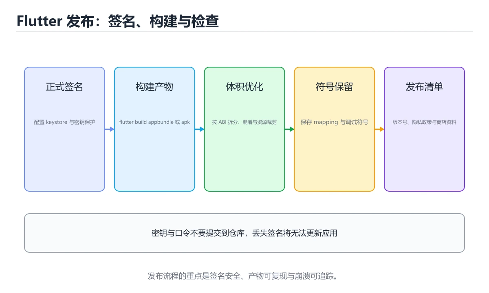
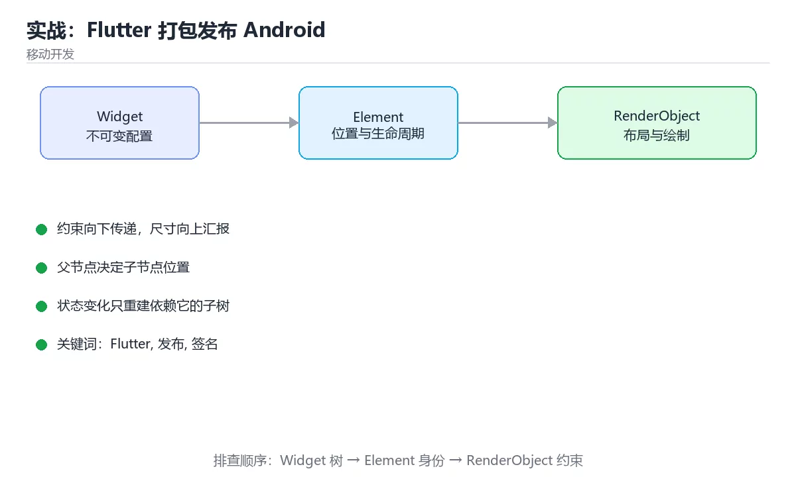

# 实战：Flutter 打包发布 Android

> 内容更新时间：2026-10-06 · 学习阶段：基础 · 预计用时：100 分钟





## 学习目标

- 能用自己的话解释实战：Flutter 打包发布 Android解决了什么问题，而不是只背术语。
- 能说清 「Flutter」、「发布」、「签名」、「混淆」 之间的关系，并分别举出一个例子。
- 能把 Flutter 放回「实战：Flutter 打包发布 Android」的知识体系，说明它和 发布 的边界。
- 能完成本课练习，并用验收标准检查自己的结果。

> 一句话摘要：正式签名、按 ABI 拆分、混淆与符号保留、发布清单。

## 前置知识

- 先完成上一课《Flutter 状态管理与性能》；如果已经掌握，可以直接用本课练习自测。
- 开始前先复习：Flutter、发布、签名。
- 如果 从调试到发布 这一步看不懂，先记录具体卡点，再用 KEYSTORE_PATH 复现一遍。

## 从调试到发布

| 阶段 | 命令 | 关注点 |
| --- | --- | --- |
| 静态检查 | `flutter analyze` | 零 error，info 尽量清零 |
| 测试 | `flutter test` | 单元 + 组件 + 端到端 |
| 构建 | `flutter build apk --release` 或 `--appbundle` | 签名、混淆、ABI |
| 产物校验 | `flutter build apk --analyze-size` | 各模块体积占比 |

## 签名配置

关键：**不要用调试签名发布**。生成 keystore（`keytool -genkey`），把 `key.properties` 放在仓库外并在 `.gitignore` 中排除，`build.gradle.kts` 里读取它配置 `signingConfigs.release`。keystore 与密码丢失后将无法更新已上架应用。

## 体积优化

1. 用 `--split-per-abi` 或 App Bundle 按 ABI 拆分，避免把三种架构都打进一个包。
2. `--tree-shake-icons` 剔除未用图标字体（默认开启）。
3. 压缩图片资源，优先用 WebP；避免打包未使用的字体。
4. 用 `--analyze-size` 找出体积大头，再针对性处理（通常是大图或冗余依赖）。

## 混淆与符号

```text
flutter build apk --release --obfuscate --split-debug-info=build/symbols
```

混淆能提高逆向成本，但崩溃堆栈会变成符号，**必须保存 split-debug-info 产物**，否则线上崩溃无法定位（用 `flutter symbolize` 还原）。

## 发布检查清单

1. 版本号与构建号递增（versionName/versionCode），否则商店拒收。
2. 权限最小化，`AndroidManifest.xml` 中删除不需要的权限。
3. targetSdk 跟上官方的商店要求（过低会被下架或限制）。
4. 应用图标与启动页替换模板资源。
5. 真机验证：冷启动、深色模式、横竖屏、低内存与断网场景。
6. 接入崩溃上报与版本分布统计（可选但强烈建议）。

## 签名配置与体积优化实操

**签名配置四步**：① `keytool -genkey -v -keystore release.jks -keyalg RSA -validity 10000 -alias app` 生成密钥库；② 在项目外创建 `key.properties`（storeFile/storePassword/keyAlias/keyPassword）并写入 .gitignore；③ 在 `android/app/build.gradle.kts` 读取该文件配置 signingConfigs.release；④ 在 buildTypes.release 中引用它。**密钥库与密码必须离线备份**，丢失后无法再更新已上架应用。

**体积优化前后参考**（同一 Flutter 项目）：

| 配置 | 体积变化 |
| --- | --- |
| 默认 release（含 arm64+armeabi+x64） | 约 55 MB |
| `--split-per-abi` 后单包 | 每个约 20~22 MB |
| `--tree-shake-icons`（默认开启） | 图标字体从 1.6 MB 降到约 7 KB |
| 移除未用字体与大图（WebP 化） | 视资源而定，常见可再降 10%~30% |

用 `flutter build apk --analyze-size` 查看各模块占比，优先处理体积最大的资源；App Bundle（`--appbundle`）让商店按设备下发，是发布到 Google Play 的首选形式。

## 本课小结

Flutter 发布的关键是**正式签名 + 按 ABI 拆分 + 混淆并保留符号 + 版本与权限合规**；跑通这四步，产物才算能上架。

## 发布清单速查

| 项 | 要求 |
| --- | --- |
| 版本号 | `pubspec.yaml` 的 `version: 1.0.0+1`，加号后为构建号 |
| 签名 | 正式 keystore，密钥与口令不入仓库 |
| 混淆 | `--obfuscate --split-debug-info=build/symbols` |
| 体积 | 按 ABI 拆分或使用 app bundle |
| 图标与启动图 | 各分辨率齐全，避免拉伸 |
| 权限 | 只声明真正需要的权限并写清用途 |
| 隐私 | 提供隐私政策与数据收集说明 |
| 目标 SDK | 符合商店最新要求 |

## 构建命令速查

```bash
# 产物类型
flutter build apk --release                          # 单个 APK
flutter build apk --release --split-per-abi          # 按 ABI 拆分，体积更小
flutter build appbundle --release                    # 上架 Google Play 推荐

# 混淆与符号保留（崩溃堆栈需用符号还原）
flutter build appbundle --release \
  --obfuscate --split-debug-info=build/symbols

# 还原混淆堆栈
flutter symbolize -i stack.txt -d build/symbols

# 指定版本号与构建号
flutter build apk --release --build-name=1.4.0 --build-number=42
```

```yaml
# android/app/build.gradle.kts 关键片段
android {
    defaultConfig {
        minSdk = 24
        targetSdk = 35
        versionCode = flutter.versionCode
        versionName = flutter.versionName
    }
    signingConfigs {
        create("release") {
            storeFile = file(System.getenv("KEYSTORE_PATH") ?: "keystore.jks")
            storePassword = System.getenv("KEYSTORE_PASSWORD")
            keyAlias = System.getenv("KEY_ALIAS")
            keyPassword = System.getenv("KEY_PASSWORD")
        }
    }
    buildTypes {
        release {
            signingConfig = signingConfigs.getByName("release")
            isMinifyEnabled = true
            isShrinkResources = true
        }
    }
}
```

## 发布前自检速查

| 检查项 | 方法 |
| --- | --- |
| 无调试日志泄漏 | 全局搜索 `print`、`debugPrint` 与测试域名 |
| 密钥未入库 | 搜索仓库与产物中的密钥串 |
| 权限最小化 | 对照 `AndroidManifest.xml` 逐条确认 |
| 崩溃堆栈可还原 | 用符号文件试还原一次 |
| 首屏与冷启动 | 真机测冷启动耗时 |
| 弱网与离线 | 断网、弱网、切后台恢复 |
| 机型覆盖 | 至少覆盖低端机与高刷屏 |
| 升级路径 | 从旧版本升级后数据完整 |

## 常见错误与排查

| 容易踩的做法 | 实际现象 | 原因与正确做法 |
| --- | --- | --- |
| 用 debug 签名发布 | 商店拒绝或无法升级 | 用正式 keystore 并妥善备份 |
| keystore 丢失 | 无法更新已发布应用 | 备份密钥与口令到安全位置 |
| 混淆后不保留符号 | 崩溃堆栈无法定位 | `--split-debug-info` 并存档符号 |
| 只出一个大 APK | 用户下载体积大 | `--split-per-abi` 或 app bundle |
| 忘记改构建号 | 商店拒绝上传 | 每次发布递增构建号 |
| 权限声明过多 | 商店审核与用户信任下降 | 最小权限并说明用途 |
| 测试环境地址打进包 | 生产连错后端 | 用编译期变量区分环境 |
| 未测升级路径 | 老用户升级后崩溃 | 保留旧版本做升级测试 |
| 只在大屏机型测试 | 小屏溢出 | 覆盖小屏与折叠屏 |
| 不配置隐私说明 | 审核被拒 | 提供隐私政策与数据清单 |

## 复习与自测

- [ ] 正式签名密钥已生成、备份且未入库。
- [ ] 发布开启混淆并归档符号文件。
- [ ] 按 ABI 拆分或使用 app bundle 控制体积。
- [ ] 权限最小化，环境地址由编译期注入。
- [ ] 完成弱网、低端机与升级路径测试。

## 零基础详解：Flutter 打包与发布

### 一句话说清它是什么

发布 Flutter 应用要做四件事：**签名、定版本、减体积、留符号**。
前三件决定能不能上架，最后一件决定线上崩溃能不能查。

### 用生活比喻理解

| 概念 | 比喻 | 说明 |
| --- | --- | --- |
| keystore | 公章 | 商店靠它确认是你发布的 |
| applicationId | 身份证号 | 上架后不能改 |
| versionName | 对外版本号 | 用户看到的 1.2.0 |
| versionCode | 内部序号 | 每次上架必须递增 |
| debug symbols | 病历存档 | 还原被混淆的崩溃堆栈 |

### 第一步：生成签名

```bash
keytool -genkeypair -v \
  -keystore ~/keys/release.jks \
  -keyalg RSA -keysize 2048 -validity 10000 \
  -alias release
```

```properties
# android/key.properties（不要提交到 Git）
storePassword=你的密码
keyPassword=你的密码
keyAlias=release
storeFile=/abs/path/release.jks
```

```kotlin
// android/app/build.gradle.kts
val keystoreProperties = java.util.Properties().apply {
    val f = rootProject.file("key.properties")
    if (f.exists()) f.inputStream().use { load(it) }
}

android {
    signingConfigs {
        create("release") {
            storeFile = file(keystoreProperties["storeFile"] as String)
            storePassword = keystoreProperties["storePassword"] as String
            keyAlias = keystoreProperties["keyAlias"] as String
            keyPassword = keystoreProperties["keyPassword"] as String
        }
    }
    buildTypes {
        release {
            signingConfig = signingConfigs.getByName("release")
            isMinifyEnabled = true
            isShrinkResources = true
        }
    }
}
```

**keystore 与密码必须备份**：丢失后无法更新已上架的应用。

### 第二步：版本号

```yaml
# pubspec.yaml
version: 1.2.0+12        # versionName+versionCode
```

```bash
flutter build appbundle --release --build-name=1.2.0 --build-number=12
```

`versionCode` 每次上架都要比上一版大，否则商店会拒绝。

### 第三步：减小体积

```bash
# 按 CPU 架构拆分 APK，单包体积显著下降
flutter build apk --release --split-per-abi

# 或发布 AAB，由商店按设备下发
flutter build appbundle --release

# 查看各部分的体积构成
flutter build apk --analyze-size
```

| 手段 | 效果 |
| --- | --- |
| `--split-per-abi` | 每个架构一个包，用户只下需要的 |
| AAB | 商店动态下发，最小化下载体积 |
| tree-shake icons | 默认开启，只保留用到的图标 |
| 图片与字体裁剪 | 去掉未使用资源 |
| 移除调试依赖 | 生产不带 dev 包 |

### 第四步：保留崩溃符号

```bash
flutter build appbundle --release \
  --obfuscate \
  --split-debug-info=build/symbols
```

**务必把 `build/symbols` 归档保存**，否则线上崩溃只能看到 `a.b.c` 这类无意义符号。

```bash
# 还原堆栈时使用
flutter symbolize -i crash.txt -d build/symbols/app.android-arm64.symbols
```

### 完整发布流水线

```bash
#!/usr/bin/env bash
set -euo pipefail

flutter clean
flutter pub get
flutter analyze
flutter test

flutter build appbundle --release \
  --obfuscate \
  --split-debug-info=build/symbols \
  --build-name="${VERSION:?需要 VERSION}" \
  --build-number="${BUILD_NUMBER:?需要 BUILD_NUMBER}"

echo "产物：build/app/outputs/bundle/release/app-release.aab"
echo "符号：build/symbols（请归档）"
```

### 上架前检查清单

| 检查项 | 说明 |
| --- | --- |
| applicationId 唯一 | 上架后不可更改 |
| 版本号递增 | versionCode 必须大于上一版 |
| 正式签名 | 不能用调试签名 |
| 权限最小化 | 删掉不需要的权限 |
| 隐私政策 | 收集数据必须有说明 |
| 图标与截图齐全 | 各尺寸都要提供 |
| 目标 SDK 达标 | 商店有最低要求 |
| 混淆后自测 | 反射相关代码可能被裁掉 |

### 新手最容易踩的八个坑

| 坑 | 现象 | 正确做法 |
| --- | --- | --- |
| keystore 丢失 | 无法更新应用 | 多处离线备份 |
| key.properties 提交到 Git | 密钥泄露 | 加进 `.gitignore` |
| 忘了递增 versionCode | 上架被拒 | CI 里自动递增 |
| 混淆后崩溃查不了 | 堆栈无意义 | 保留并归档 symbols |
| 用调试签名上架 | 商店拒绝 | 配置 release signingConfig |
| 只测 APK 不测 AAB | 上架后才出问题 | 用 bundletool 本地验证 |
| 权限申请过多 | 审核被拒 | 只申请真正需要的 |
| 混淆裁掉反射用类 | 运行时崩溃 | 配置 keep 规则并自测 |

### 学完自测

- [ ] 能说出 keystore 丢失的后果。
- [ ] 知道 `versionName` 与 `versionCode` 的分工。
- [ ] 能说出三种减小体积的手段。
- [ ] 知道 `--split-debug-info` 产物要做什么。
- [ ] 能列出上架前至少五项检查。

## 动手练习

> 本课练习重点：围绕「Flutter、发布、签名」完成复述、实验和交付，每个结果都要能被别人检查。

先做 Flutter 的最小 Widget，再切换状态，最后在窄屏与深色模式下验证。

### 练习 1：建立心智模型（10 分钟）

合上教程，用 3～5 句话回答：

1. 实战：Flutter 打包发布 Android解决了什么问题？
2. 如果没有它，会出现什么具体后果？
3. 它和「发布」是什么关系？

验收标准：说明 Flutter 与 发布 的分工，并写出一个失效场景。

### 练习 2：做一次可控实验（20 分钟）

从正文中选一个最小示例，完成以下操作：

1. 先预测修改一个参数、输入或步骤后的结果。
2. 再实际执行或逐步推演，记录真实结果。
3. 如果结果与预测不同，写出差异原因。

**验收标准**：先原样跑通正文里的 `KEYSTORE_PATH`，再只改Flutter相关的输入，按「原例 → 改动 → 预测 → 结果 → 原因」记录；预测必须写在实际运行之前。

### 练习 3：交付一个小结果（30 分钟）

把 KEYSTORE_PATH 放进一个最小 Widget，逐个切换三种输入状态观察布局。

任务要求：

- 结果必须能被别人检查，不能只写“我已经理解了”。
- 至少覆盖「Flutter」和「发布」两个关键词。
- 写出 1 个仍然不确定的问题，以及下一步如何验证。

> 提示：时间有限时优先做练习 1 和练习 2；练习 3 可以拆成两次完成。

## 验证命令与预期输出

Flutter 的交付物要能用固定命令复现；下表是本项目的最低验证集：

| 阶段 | 命令 | 预期输出 |
| --- | --- | --- |
| 静态检查 | `flutter analyze` | 无分析问题 |
| 运行测试 | `flutter test` | 测试全部通过 |
| 构建 | `flutter build apk --release` | 成功生成 APK |

### 验收证据

- [ ] 保存依赖安装和启动命令的完整输出。
- [ ] 至少运行 3 条 Flutter 相关测试，其中一条是非法输入或失败路径。
- [ ] 重复执行 Flutter 的操作两次，确认没有重复写入或副作用。
- [ ] 记录一次失败状态码、错误日志和恢复步骤。
- [ ] 记录 KEYSTORE_PATH 的运行环境与复现命令，并补一段回滚说明。

### 回归与回滚

1. 用临时环境验证 KEYSTORE_PATH，确认无误后再对真实数据执行。
2. 修改一处逻辑后重跑全部验证命令，确认没有回归。
3. 若失败，回滚到上一个可运行版本并保留失败日志。
4. 定位原因后补一条自动化测试，再重新执行发布流程。
5. 把教训写入项目复盘或本课笔记，形成下一次的检查项。

## 可运行练习

### 任务 1：先跑通，再解释

```bash
#!/usr/bin/env bash
set -euo pipefail

flutter clean
flutter pub get
flutter analyze
flutter test

flutter build appbundle --release \
  --obfuscate \
  --split-debug-info=build/symbols \
  --build-name="${VERSION:?需要 VERSION}" \
  --build-number="${BUILD_NUMBER:?需要 BUILD_NUMBER}"

echo "产物：build/app/outputs/bundle/release/app-release.aab"
echo "符号：build/symbols（请归档）"
```

**预期输出**：符号：build/symbols（请归档）

### 任务 2：只改一个条件

把「实战：Flutter 打包发布 Android」的最小示例复制一份，只改一个条件再跑一次：

- 改动点：只调整 KEYSTORE_PATH 的一个参数，其余条件一律不动。
- 预测：先写下「实战：Flutter 打包发布 Android」在改动后的输出或错误信息，再运行。
- 记录：对照改动前后的结果，指出差异出在哪一步。
- 验收：换回原条件能复现原结果，改动只影响Flutter。

### 任务 3：迁移到自己的数据

把 KEYSTORE_PATH 换成你自己的输入，先保持步骤不变，再比较输出差异。

## 故障现场

### 现场 1：用 debug 签名发布

**症状**：在《实战：Flutter 打包发布 Android》的复现场景中，商店拒绝或无法升级。

**根因**：触发点是把“用 debug 签名发布”当成安全做法。它没有满足《实战：Flutter 打包发布 Android》要求的前提，因此先表现为“商店拒绝或无法升级”；排查时先完整复现这一段，再核对输入、配置与依赖。

**修复**：针对《实战：Flutter 打包发布 Android》的问题，用正式 keystore 并妥善备份。

**验证**：在《实战：Flutter 打包发布 Android》中按“用正式 keystore 并妥善备份”调整后，从“用 debug 签名发布”的触发条件重放同一条路径，确认“商店拒绝或无法升级”不再出现，并补一个相邻边界用例检查没有引入新问题。

### 现场 2：keystore 丢失

**症状**：在《实战：Flutter 打包发布 Android》的复现场景中，无法更新已发布应用。

**根因**：当出现“keystore 丢失”时，执行路径已经绕过了《实战：Flutter 打包发布 Android》的关键约束，最终以“无法更新已发布应用”暴露出来；修复前必须先确认约束在哪里失效。

**修复**：针对《实战：Flutter 打包发布 Android》的问题，备份密钥与口令到安全位置。

**验证**：先在《实战：Flutter 打包发布 Android》中记录“keystore 丢失”留下的失败证据，再执行“备份密钥与口令到安全位置”并重放；确认错误路径变为明确结果，且修复没有掩盖同类故障。

### 现场 3：混淆后不保留符号

**症状**：在《实战：Flutter 打包发布 Android》的复现场景中，崩溃堆栈无法定位。

**根因**：当出现“混淆后不保留符号”时，执行路径已经绕过了《实战：Flutter 打包发布 Android》的关键约束，最终以“崩溃堆栈无法定位”暴露出来；修复前必须先确认约束在哪里失效。

**修复**：针对《实战：Flutter 打包发布 Android》的问题，--split-debug-info 并存档符号。

**验证**：在《实战：Flutter 打包发布 Android》中按“--split-debug-info 并存档符号”调整后，从“混淆后不保留符号”的触发条件重放同一条路径，确认“崩溃堆栈无法定位”不再出现，并补一个相邻边界用例检查没有引入新问题。

## 本课复习清单

离开本课前，逐项确认：

- [ ] 不看解析，能说出「发布到商店必须使用？」的判断依据。
- [ ] 不看解析，能说出「使用 --obfuscate 时必须同时？」的判断依据。
- [ ] 不看解析，能说出「减小 APK 体积的常用做法是？」的判断依据。
- [ ] 不看解析，能说出「flutter build appbundle 的产物格式是？」的判断依据。
- [ ] 不看解析，能说出「Android 的 minSdk / targetSdk 在哪个文件中配置？」的判断依据。
- [ ] 至少运行一次 KEYSTORE_PATH 的示例，记录输入、输出和 Flutter 的边界情况。
- [ ] 把本课最容易混淆的两个概念写成一句话对照。

| 复盘项 | 记录 |
| --- | --- |
| 已经能独立解释的考点 |  |
| 仍然说不清的概念 |  |
| 下一步验证动作 |  |

## 术语速查

把「实战：Flutter 打包发布 Android」里反复出现的术语集中放在一起。复习时先遮住右列，尝试用自己的话解释，再回到正文核对。

| 术语 | 一句话说明 |
| --- | --- |
| `Flutter` | 用 flutter build apk --analyze-size 查看各模块占比，优先处理体积最大的资源；App Bundle（--appbundle）让商店按设备下发，是发布到 Google Play 的首选形式。 |
| `发布` | 把通过验证的版本交付给用户或部署到目标环境。 |
| `签名` | 发布 Flutter 应用要做四件事：签名、定版本、减体积、留符号。 |
| `混淆` | 正式签名、按 ABI 拆分、混淆与符号保留、发布清单。 |
| `体积优化` | 用 --split-per-abi 或 App Bundle 按 ABI 拆分，避免把三种架构都打进一个包。 |

## 考点精讲

### 考点 1：多选辨析·Flutter

- **题目**：围绕“实战：Flutter 打包发布 Android”中的 Flutter、发布、签名，下列哪两项是本课强调的实践判断？
- **判断依据**：本课把实战：Flutter 打包发布 Android拆成概念、示例与故障现场三部分，因此判断 Flutter 时必须同时交代输入、输出和失败路径，这使“学习 Flutter 时要同时说明输入、输出和失败路径，不能只看正常流程”成立。在实战：Flutter 打包发布 Android里，判断 发布 时要固定版本与边界输入，所以“验证 发布 时要固定版本并覆盖边界输入，结论才可复现”才可复现。

### 考点 2：代码补全·Flutter

- **题目**：这段代码是「实战：Flutter 打包发布 Android」的示例片段，下面哪一项描述与它一致？
- **判断依据**：在「实战：Flutter 打包发布 Android」里，这段代码只做静态声明，没有循环、分支或可观察输出。这段代码出自「实战：Flutter 打包发布 Android」的正文示例，围绕Flutter、发布、签名展开；把输入或边界换成空值、极值或失败情况后，结论要以「实战：Flutter 打包发布 Android」的实际运行结果为准。

### 考点 3：概念判断·Flutter

- **题目**：减小 APK 体积的常用做法是？
- **判断依据**：在「实战：Flutter 打包发布 Android」里，使用 --split-per-abi 或 App Bundle。按 CPU 架构拆分可显著降低单包体积。在「实战：Flutter 打包发布 Android」里判断这道题，要把Flutter、发布、签名的条件、过程与失败路径逐项对齐，换成“减小 APK 体积的常用做法是”这个场景，只有满足前提的结论才成立。

### 考点 4：概念判断·Flutter

- **题目**：flutter build appbundle 的产物格式是？
- **判断依据**：在「实战：Flutter 打包发布 Android」里，结论应落在「.aab（Android App Bundle）」。appbundle 生成 .aab，由商店按设备配置拆分下发。在「实战：Flutter 打包发布 Android」里，这道题要求区分概念与边界，「.aab（Android App Bundle）」只有在题干给出的前提下才成立，而「.ipa（没有覆盖题干给出的条件）」、「.jar」缺少同一组条件。

### 考点 5：概念判断·Flutter

- **题目**：Android 的 minSdk / targetSdk 在哪个文件中配置？
- **判断依据**：在「实战：Flutter 打包发布 Android」里，android/app/build.gradle(.kts) 的 defaultConfig。SDK 版本属于 Android 构建配置，写在 app 模块的 defaultConfig 里。在「实战：Flutter 打包发布 Android」里判断这道题，要把Flutter、发布、签名的条件、过程与失败路径逐项对齐，换成“Android 的 minSdk /”这个场景，只有满足前提的结论才成立。

### 考点 6：顺序排列·Flutter

- **题目**：按照「实战：Flutter 打包发布 Android」从概念到实践的讲解顺序排列下列主题。
- **判断依据**：正确的执行顺序是「从调试到发布」 → 「签名配置」 → 「体积优化」 → 「混淆与符号」。在本课中，正确顺序是：1. 从调试到发布 → 2. 签名配置 → 3. 体积优化 → 4. 混淆与符号。本课围绕正式签名、按 ABI 拆分、混淆与符号保留、发布清单。“按照实战”与「实战：Flutter 打包发布 Android」的术语表相呼应，只有符合Flutter、发布、签名约束的“从调试到发布”才是正文支持的结论。

## English Overview

**Title:** Flutter Release

**Summary:** Signing, ABI splits, obfuscation and release checklist.

**Category:** Mobile Development
**Level:** 高级
**Key terms:** Flutter, 发布, 签名, 混淆, 体积优化

## 内容元数据

- 内容版本：v2.0
- 最后更新：2026-10-06
- 学习阶段：基础
- 适用环境：Flutter 3.x / Dart 3.x；本课聚焦 Flutter。
- 内容来源：内置结构化课程与工程实践整理
- 相关主题：Flutter、发布、签名、混淆、体积优化
- 质量版本：P0 测验标准 + P1 覆盖扩展 + P2 体验补全

## 项目专属规格：实战：Flutter 打包发布 Android

### 核心场景

正式签名、按 ABI 拆分、混淆与符号保留、发布清单。 项目目标是把「Flutter、发布、签名、混淆、体积优化」落实为可运行、可测试、可回滚的交付物。

### 架构与数据流

```text
用户/输入 → 接口或命令 → 领域逻辑 → 存储/外部依赖 → 输出与监控
                         ↘ 失败分类 → 重试/补偿 → 回滚
```

### 最小数据模型

| 对象 | 关键字段 | 约束 |
| --- | --- | --- |
| 输入实体 | Flutter、时间、来源 | 必填校验、长度限制、幂等键 |
| 任务实体 | 状态、优先级、创建时间 | 状态迁移合法、不可重复执行 |
| 结果实体 | 输出、错误码、耗时 | 可序列化、错误可解释 |
| 审计记录 | 操作者、动作、结果、时间 | 不可篡改、可查询、脱敏 |

### 验收场景

1. 正常路径：最小输入得到预期输出，并留下日志与指标。
2. 边界路径：发布 在重复提交与超长输入下不产生额外副作用。
3. 失败路径：依赖超时或不可用时能快速失败、重试或降级。
4. 幂等路径：同一请求执行两次不会产生重复副作用。
5. 回滚路径：发布 的失败能按预案恢复，并记录影响范围。

## 项目交付物

### 建议仓库结构

```text
lib/
  models/
  screens/
  services/
test/
pubspec.yaml
```

### 测试矩阵

| 层级 | 覆盖内容 | 最低数量 | 通过标准 |
| --- | --- | ---: | --- |
| 单元测试 | 领域规则、边界和错误分类 | 8 | 正常、边界、失败路径全部通过 |
| 集成测试 | 数据库、网络、文件或平台边界 | 3 | 使用真实边界且可重复运行 |
| 端到端测试 | 核心用户路径 | 1 | 从输入到输出完整跑通 |
| 手动验收 | 文档中列出的 5 个场景 | 5 | 有命令、输出和结论记录 |

### 验收数据

```json
{
  "project": "flutter_release",
  "scenario": "Flutter的正常路径",
  "input": {"case": "normal", "value": "KEYSTORE_PATH"},
  "expected": {"ok": true, "checks": ["Flutter可复现", "发布有记录"]},
  "failure_case": {"case": "发布越界或缺失", "error": "validation_error"},
  "idempotency_key": "flutter_release-001"
}
```

### 复盘模板

| 问题 | 记录 |
| --- | --- |
| 原目标是什么？ | 用一句话描述可验收目标 |
| 实际发生了什么？ | 时间线、指标和关键日志 |
| 哪个假设被推翻？ | 根因与促成因素 |
| 如何回滚？ | 步骤、耗时和数据校验 |
| 下一步做什么？ | 负责人、期限和验证方式 |

> 项目验收围绕「Flutter、发布、签名」：至少完成一次正常路径、一次边界输入、一次失败恢复和一次幂等检查。

## 参考资料与复核

- 最后复核：2026-10-04
- 下次复核：2027-08-24
- 复核范围：版本兼容、API 行为、安全建议与工程实践
- 来源性质：官方文档、标准或权威教材；正文为离线教学重组

| 参考资料 | 本课用途 |
| --- | --- |
| [Android 发布指南](https://docs.flutter.dev/deployment/android) | 签名、构建与发布 |
| [Flutter 包与插件](https://docs.flutter.dev/packages-and-plugins) | 包管理、插件与平台通道 |
| [Flutter 性能最佳实践](https://docs.flutter.dev/perf/best-practices) | 帧率、构建与内存优化 |

> 「实战：Flutter 打包发布 Android」的链接用于离线阅读后的延伸核对；App 不会自动联网。

<!-- p1-project-review:start -->
## 交付评审：评分表、决策记录与证据链

「实战：Flutter 打包发布 Android」的验收不能只看功能能不能跑通。下面把正文里的交付物、验证命令和关键设计点整理成一张评审表，按表逐项留下证据即可。

### 一、「实战：Flutter 打包发布 Android」的交付物评分表

| 交付物 | 权重 | 合格线 | 需要的证据 |
| --- | ---: | --- | --- |
| 核心链路 | 34% | 能在干净环境复现，且失败路径有明确处理 | 命令与输出、对应测试、一次失败与恢复记录 |
| 测试与验收记录 | 33% | 能在干净环境复现，且失败路径有明确处理 | 命令与输出、对应测试、一次失败与恢复记录 |
| 运行与回滚说明 | 33% | 能在干净环境复现，且失败路径有明确处理 | 命令与输出、对应测试、一次失败与恢复记录 |

「实战：Flutter 打包发布 Android」的评分先看证据再打分：任意一项只要拿不出可复现的命令或测试，该项按 0 分计，不允许用「基本完成」代替。

### 二、需要写下来的决策（ADR）

| 决策点 | 本课给出的做法 | 备选方案 | 代价与回滚 |
| --- | --- | --- | --- |
| 架构与数据流 | 用户/输入 → 接口或命令 → 领域逻辑 → 存储/外部依赖 → 输出与监控 | 不做「架构与数据流」，沿用最朴素的实现（需要额外补一次对照实验） | 若「架构与数据流」出问题，回到上一版本并按本课验收场景重跑 |

ADR 不需要长：每个决策三行就够——选了什么、放弃了什么、出问题怎么退。评审时只检查这三行是否和「实战：Flutter 打包发布 Android」的实际代码一致。

### 三、「实战：Flutter 打包发布 Android」的交付证据链

本课未给出可执行命令，用下面的最小证据集代替：

1. 一条从零开始的环境准备命令。
2. 一条跑通核心链路的命令及其完整输出。
3. 一条触发失败的命令，以及恢复后的验证结果。

把「实战：Flutter 打包发布 Android」的上表整理成一个 evidence/ 目录：每条命令一个文件，文件名带日期，内容包含版本、命令与输出。评审时直接按目录核对，不再口头确认。

### 四、「实战：Flutter 打包发布 Android」的验收指标

| 指标 | 目标值 | 测量方式 | 不达标时的动作 |
| --- | --- | --- | --- |
| Flutter 的核心路径耗时与失败率 | 用本课正文给出的阈值，没有就写实测基线 | 固定环境重复三次取中位数 | 回到对应小节定位，先修原因再重测 |
| 资源占用峰值与回收情况 | 用本课正文给出的阈值，没有就写实测基线 | 固定环境重复三次取中位数 | 回到对应小节定位，先修原因再重测 |
| 验收场景的通过率 | 用本课正文给出的阈值，没有就写实测基线 | 固定环境重复三次取中位数 | 回到对应小节定位，先修原因再重测 |

指标必须能用一条命令或一次操作测出来；写不出测量方式的指标，在「实战：Flutter 打包发布 Android」的评审里一律视为未定义。

### 五、评审记录模板

| 记录项 | 填写要求 |
| --- | --- |
| 项目标识 | `flutter_release` |
| 本次范围 | 说明这一轮交付了「实战：Flutter 打包发布 Android」的哪些部分 |
| 未完成项 | 列出与 Flutter 相关但本轮未做的内容 |
| 证据位置 | 指向 evidence/ 目录下的具体文件 |
| 风险与回滚 | 写清剩余风险、回滚步骤和验证方式 |
| 结论 | 通过 / 有条件通过 / 不通过，三者选一 |

「实战：Flutter 打包发布 Android」评审结束后把这张表填完并归档；下一轮迭代直接读上一次的「未完成项」与「风险与回滚」，避免重复讨论同一个问题。
<!-- p1-project-review:end -->
