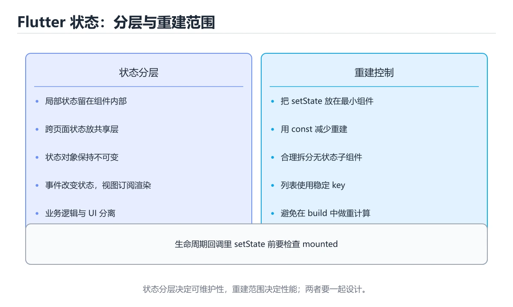
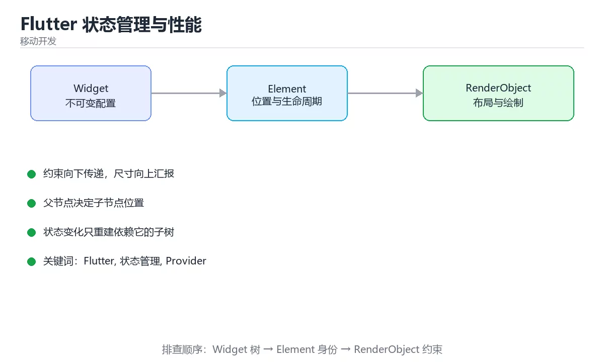

# Flutter 状态管理与性能

> 内容更新时间：2026-10-06 · 学习阶段：入门 · 预计用时：50 分钟





## 本节知识框架

**课程定位**：所属分类 `flutter`（移动开发），课程主题 `Flutter 状态管理与性能`，学习阶段 入门，建议用时 50 分钟。

本课主线：状态分层、重建范围控制与生命周期陷阱。

**学完本课应当能够**
- 说清 `Flutter` 与 `状态管理` 的含义与区别，并各举一个正例和一个反例。
- 用本课示例验证 `性能` 的行为，记录输入、输出与失败条件。
- 遇到「整页 `Consumer` 包住所有内容」这类问题时，能说出触发条件与修复顺序。

### 从概念到验证的学习链条

1. `Flutter`：先掌握 Flutter 状态管理的核心是分层与最小重建：局部用 setState、共享用 Provider/Riverpod、服务端数据走仓库层；再配合 const、Selector 与 RepaintBoundary 控制性能，再用它解释 `状态管理` 为什么会出现。
2. `状态管理`：先掌握 集中或按作用域组织应用状态，并控制读取、更新与生命周期，再用它解释 `性能` 为什么会出现。
3. `性能`：先掌握 系统在给定负载下表现出的吞吐、延迟、资源占用和稳定性，再用它解释 `生命周期` 为什么会出现。
4. `生命周期`：先掌握 引用保持有效的区间；在 Rust 中还用于把多个引用的有效期关系写进类型，再用它解释 本课示例的观察结果 为什么会出现。

**先修与衔接**：本课是「移动开发」分类的第 3 课。先修内容：《Flutter 基础与 Widget 树》。《Flutter 基础与 Widget 树》里的 `flutter run`、`Widget` 是本课的前提。相关或后续课程：《实战：Flutter 打包发布 Android》。

### 完成判据

- **定义关**：不看正文也能说明 `Flutter` 是 Flutter 状态管理的核心是分层与最小重建：局部用 setState、共享用 Provider/Riverpod、服务端数据走仓库层，再配合 const、Selector 与 RepaintBoundary 控制性能，并指出一个反例。
- **机制关**：能按“输入 → 转换 → 输出 → 验证”复述 `Flutter 状态管理与性能`，而不是只背结论。
- **示例关**：能运行或推演 `Flutter 状态管理与性能` 的 `dart` 示例，并说明一个真实出现的标识符或字面量。
- **证据关**：能指出 `Flutter 状态管理与性能` 示例里的 调用了 `unmodifiable()`，并说明它支持或反驳了本课的哪一条结论。
- **排错关**：能复现 整页 `Consumer` 包住所有内容，记录现象并按 只包需要的子树 修复。
- **迁移关**：能把 `Flutter`、`状态管理`、`Provider`、`性能` 放进一个与 `Flutter 状态管理与性能` 不同的项目场景，并保持输入与验证条件可追踪。
- **复盘关**：学完 `Flutter 状态管理与性能` 后，用一句话写下仍然不确定的结论，并列出下一次验证需要的输入、环境和成功判据。

### 复习清单

- [ ] 能不看正文复述本课核心术语，并指出一个边界或反例。
- [ ] 能运行或推演本课示例，记录输入、输出与失败现象。
- [ ] 能完成一次自测，并把错题对照错误表定位原因。

## 核心概念定义

| 术语 | 操作性定义 | 常见边界与风险 |
| --- | --- | --- |
| Flutter | Flutter 状态管理的核心是分层与最小重建：局部用 setState、共享用 Provider/Riverpod、服务端数据走仓库层；再配合 const、Selector 与 RepaintBoundary 控制性能。 | 共享状态与调度顺序会改变结论，单线程或串行测试通过不等于并发下成立。 |
| 状态管理 | 集中或按作用域组织应用状态，并控制读取、更新与生命周期。 | 越界、悬垂引用与释放顺序会破坏结论，必须在边界输入下复验。 |
| 性能 | 系统在给定负载下表现出的吞吐、延迟、资源占用和稳定性。 | 结论随输入规模变化，小规模成立不代表大规模成立，需要重新测量。 |
| 生命周期 | 引用保持有效的区间；在 Rust 中还用于把多个引用的有效期关系写进类型。 | 静态检查只在编译期成立，运行期输入仍需校验。 |

## 原理与运行机制

### 机制总览

**教材衔接：状态分层**

| 类型 | 例子 | 推荐方案 |
| --- | --- | --- |
| 局部 UI 状态 | 输入框内容、开关、动画 | StatefulWidget + setState |
| 跨页面共享 | 登录用户、主题、购物车 | Provider / Riverpod / Bloc |
| 服务端数据 | 列表、详情、分页 | 仓库层 + FutureBuilder/AsyncNotifier + 缓存 |

选型原则：**能局部就不全局**。全局状态越少，重建范围越小、越容易测试。Provider 适合中小项目（ChangeNotifier + Consumer），Riverpod 编译期安全、便于测试，Bloc 适合复杂业务与团队规范要求高的场景。

**教材衔接：重建范围控制**

1. 用 `const` 构造器避免无谓重建。
2. `Consumer`/`Selector` 只包裹真正依赖该状态的子树，而不是整页。
3. 长列表用 `ListView.builder` + `itemExtent`（已知行高时）减少布局计算。
4. 复杂动画或频繁重绘区域用 `RepaintBoundary` 隔离。
5. 避免在 build 里做重活（排序、网络、JSON 解析），移到 initState 或状态层。

**教材衔接：生命周期要点**

`initState` 做一次初始化（注意不能在这里用 context 依赖），`didChangeDependencies` 响应依赖变化，`dispose` 释放控制器、订阅与定时器。**忘记 dispose 是内存泄漏的常见来源**（AnimationController、TextEditingController、StreamSubscription）。

**教材衔接：异步与错误处理**

用 FutureBuilder 时务必处理三种状态：等待、错误、空数据；页面卸载后不要再 setState（用 `if (!mounted) return;`）。分页加载要注意去重与并发请求的竞态（后发先至）。

**教材衔接：状态分类速查**

| 状态类型 | 生命周期 | 推荐方案 |
| --- | --- | --- |
| 局部 UI 状态 | 单页面 | `StatefulWidget` + `setState` |
| 跨组件共享 | 多个页面 | Provider / Riverpod |
| 全局配置 | 应用级 | Provider + 持久化 |
| 派生状态 | 由其他状态计算 | 直接计算，不额外存 |
| 异步数据 | 网络请求 | `FutureBuilder` 或状态管理的异步封装 |

**教材衔接：生命周期速查**

| 阶段 | 时机 | 典型用途 |
| --- | --- | --- |
| `initState` | 组件插入树后 | 初始化控制器、首次请求 |
| `didChangeDependencies` | 依赖变化 | 读取 `InheritedWidget` 或主题 |
| `build` | 每次需要渲染 | 只做构建，不放副作用 |
| `didUpdateWidget` | 父级传入参数变化 | 对比新旧参数做响应 |
| `dispose` | 组件移除 | 取消订阅、释放控制器 |
| `deactivate` | 从树中暂时移除 | 少见，谨慎使用 |

### 机制拆解：每一步的输入、动作与输出

#### 1. `Flutter`
- 输入：`Flutter`；本步把 Flutter 状态管理的核心是分层与最小重建：局部用 setState、共享用 Provider/Riverpod、服务端数据走仓库层；再配合 const、Selector 与 RepaintBoundary 控制性能 当作判断规则。
- 动作：围绕 `Flutter` 保留中间状态，并记录它与 `状态管理` 的对应关系。
- 输出：`状态管理`，它可以被下一段代码、测试或记录继续使用。
- `Flutter` 的失败条件：共享状态与调度顺序会改变结论，单线程或串行测试通过不等于并发下成立。

#### 2. `状态管理`
- 输入：`Flutter`；本步把 集中或按作用域组织应用状态，并控制读取、更新与生命周期 当作判断规则。
- 动作：围绕 `状态管理` 保留中间状态，并记录它与 `性能` 的对应关系。
- 输出：`性能`，它可以被下一段代码、测试或记录继续使用。
- `状态管理` 的失败条件：越界、悬垂引用与释放顺序会破坏结论，必须在边界输入下复验。

#### 3. `性能`
- 输入：`状态管理`；本步把 系统在给定负载下表现出的吞吐、延迟、资源占用和稳定性 当作判断规则。
- 动作：围绕 `性能` 保留中间状态，并记录它与 `生命周期` 的对应关系。
- 输出：`生命周期`，它可以被下一段代码、测试或记录继续使用。
- `性能` 的失败条件：结论随输入规模变化，小规模成立不代表大规模成立，需要重新测量。

#### 4. `生命周期`
- 输入：`性能`；本步把 引用保持有效的区间；在 Rust 中还用于把多个引用的有效期关系写进类型 当作判断规则。
- 动作：围绕 `生命周期` 保留中间状态，并记录它与 `unmodifiable` 的对应关系。
- 输出：`unmodifiable`，它可以被下一段代码、测试或记录继续使用。
- `生命周期` 的失败条件：静态检查只在编译期成立，运行期输入仍需校验。

### 示例中的可观察事实

1. 调用了 `unmodifiable()`；它对应的课程主题是 `Flutter 状态管理与性能`。
2. 调用了 `fold()`；它对应的课程主题是 `Flutter 状态管理与性能`。
3. 调用了 `add()`；它对应的课程主题是 `Flutter 状态管理与性能`。
4. 调用了 `notifyListeners()`；它对应的课程主题是 `Flutter 状态管理与性能`。
5. 调用了 `MultiProvider()`；它对应的课程主题是 `Flutter 状态管理与性能`。
6. 调用了 `ChangeNotifierProvider()`；它对应的课程主题是 `Flutter 状态管理与性能`。
7. 调用了 `CartProvider()`；它对应的课程主题是 `Flutter 状态管理与性能`。
8. 调用了 `Text()`；它对应的课程主题是 `Flutter 状态管理与性能`。

### 复现实验记录

- 环境：`Flutter 状态管理与性能` 使用 `dart` 示例，固定 `Flutter`、`状态管理`、`Provider`、`性能` 作为第一组条件。
- 首轮输入：先确认 调用了 `unmodifiable()`，预测 `Flutter` 会怎样变化。
- 基线观察：记录命令、输入、输出和错误原文，不用截图代替可复制的文本。
- 单变量修改：只改变 `Flutter`，观察 `生命周期` 是否仍满足定义。
- 失败注入：复现 整页 `Consumer` 包住所有内容，确认现象是 无谓重建。
- 记录结论：把“修改前、修改后、预期变化、实际变化”写成四列表，这样复盘 `Flutter 状态管理与性能` 时才能区分概念错误与实现错误。

## 典型应用场景

- **整页 `Consumer` 包住所有内容**：典型现象是无谓重建；正确做法是只包需要的子树。
- **用 `watch` 在回调里读**：典型现象是报错或多余重建；正确做法是回调用 `read`。
- **忘记 `notifyListeners`**：典型现象是界面不更新；正确做法是改完状态必须通知。
- **忘记 `dispose`**：典型现象是内存泄漏、后台继续跑；正确做法是控制器与订阅都要释放。

### 最小验证场景

- 准备：保留 `dart` 示例的原始输入，先记录 `Flutter 状态管理与性能` 的基线输出和完整运行命令。
- 观察：先核对 调用了 `unmodifiable()`，再改变一个与 `Flutter` 相关的条件。
- 判定：新结果与 `Flutter 状态管理与性能` 的基线不同不等于错误；只有当差异破坏了 `Flutter` 的定义或错误表中的约束，才判定为失败。

### 选择与边界

- 使用 `Flutter` 时，先满足它的定义：Flutter 状态管理的核心是分层与最小重建：局部用 setState、共享用 Provider/Riverpod、服务端数据走仓库层；再配合 const、Selector 与 RepaintBoundary 控制性能；共享状态与调度顺序会改变结论，单线程或串行测试通过不等于并发下成立。
- 使用 `状态管理` 时，先满足它的定义：集中或按作用域组织应用状态，并控制读取、更新与生命周期；越界、悬垂引用与释放顺序会破坏结论，必须在边界输入下复验。
- 使用 `性能` 时，先满足它的定义：系统在给定负载下表现出的吞吐、延迟、资源占用和稳定性；结论随输入规模变化，小规模成立不代表大规模成立，需要重新测量。
- 使用 `生命周期` 时，先满足它的定义：引用保持有效的区间；在 Rust 中还用于把多个引用的有效期关系写进类型；静态检查只在编译期成立，运行期输入仍需校验。

## 代码/协议/SQL 示例

### 最小可验证示例

```dart
// 1. 状态：继承 ChangeNotifier，只在数据变化时通知
class CartProvider extends ChangeNotifier {
  final List<Item> _items = [];
  List<Item> get items => List.unmodifiable(_items);
  double get total => _items.fold(0, (sum, item) => sum + item.price);

  void add(Item item) {
    _items.add(item);
    notifyListeners();          // 只在这一处通知
  }
}

// 2. 注入：在应用根部提供
MultiProvider(providers: [
  ChangeNotifierProvider(create: (_) => CartProvider()),
]);

// 3. 消费：只包裹真正依赖的子树
Consumer<CartProvider>(
  builder: (context, cart, child) => Text('合计 ${cart.total}'),
);

// 4. 只读不监听（事件回调里用，避免无谓重建）
context.read<CartProvider>().add(item);
```

**教材衔接：Provider 代码骨架**

四条实践规则：**状态类只暴露只读视图**（`List.unmodifiable`）、**notifyListeners 只在数据真变化时调用**、**读用 read、听用 watch/Consumer**、**Selector 只订阅需要的字段**（如只关心 total 而不是整个 cart）。

**教材衔接：测试策略**

状态类不依赖 Widget，可直接单测：构造 Provider → 调用方法 → 断言状态与通知次数（用 `addListener` 计数）。Widget 测试中通过 `ChangeNotifierProvider.value` 注入假数据，避免真实网络与数据库。

**教材衔接：零基础详解：状态管理与重建范围**

### 一句话说清它是什么

状态管理要回答两个问题：**这份状态归谁管**、**变化时要重建哪一部分**。
能局部就不全局，能小范围就不整页刷新，这是 Flutter 性能与可维护性的核心。

### 用生活比喻理解

| 类型 | 比喻 | 例子 |
| --- | --- | --- |
| 局部状态 | 桌上的便签 | 输入框内容、开关状态 |
| 页面状态 | 房间里的白板 | 列表数据、加载中 |
| 全局状态 | 公司公告栏 | 登录信息、主题、购物车 |
| 临时状态 | 手里的草稿纸 | 动画进度、滚动位置 |

### 三层选型

| 范围 | 方案 | 说明 |
| --- | --- | --- |
| 单个组件 | `StatefulWidget` + `setState` | 最简单，重建范围最小 |
| 父子共享 | 回调 + `ValueNotifier` | 不必引入框架 |
| 跨页面共享 | Provider / Riverpod | 需要统一读写与生命周期 |

### Provider 的三件套

```dart
// 1. 定义可监听模型
class CartModel extends ChangeNotifier {
  final List<Item> _items = [];
  List<Item> get items => List.unmodifiable(_items);
  double get total => _items.fold(0, (sum, i) => sum + i.price);

  void add(Item item) {
    _items.add(item);
    notifyListeners();          // 通知订阅者重建
  }
}

// 2. 在顶层提供
ChangeNotifierProvider(
  create: (_) => CartModel(),
  child: const MyApp(),
)

// 3. 按需读取
class CartBadge extends StatelessWidget {
  const CartBadge({super.key});

  @override
  Widget build(BuildContext context) {
    final count = context.select<CartModel, int>((m) => m.items.length);
    return Badge(label: Text('$count'), child: const Icon(Icons.shopping_cart));
  }
}
```

`context.select` 只订阅需要的字段，**只有这个字段变化才重建**。

### 三个缩小重建范围的技巧

```dart
// 技巧一：把 Consumer 包到最小范围
Consumer<CartModel>(
  builder: (context, cart, child) => Text('${cart.items.length}'),
)

// 技巧二：child 参数复用不依赖状态的部分
Consumer<CartModel>(
  builder: (context, cart, child) => Row(
    children: [child!, Text('${cart.total}')],
  ),
  child: const Icon(Icons.shopping_cart),   // 不会重建
)

// 技巧三：读取不订阅，用 read
onPressed: () => context.read<CartModel>().add(item),
```

| 方法 | 是否订阅 | 用途 |
| --- | --- | --- |
| `watch` / `Consumer` | 是 | 需要随状态重建 |
| `select` | 是（单字段） | 只关心某个字段 |
| `read` | 否 | 事件回调里调用方法 |

### 异步状态要表达出来

```dart
sealed class UiState<T> {
  const UiState();
}

class Loading<T> extends UiState<T> { const Loading(); }
class Success<T> extends UiState<T> {
  const Success(this.data);
  final T data;
}
class Failure<T> extends UiState<T> {
  const Failure(this.message);
  final String message;
}

// 界面按状态分支，四态齐全：加载中、成功、空、失败
Widget buildBody(UiState<List<Item>> state) => switch (state) {
      Loading() => const Center(child: CircularProgressIndicator()),
      Failure(:final message) => Center(child: Text('出错了：$message')),
      Success(:final data) when data.isEmpty => const Center(child: Text('暂无数据')),
      Success(:final data) => ItemList(items: data),
    };
```

**把「加载中 / 成功 / 空 / 失败」都写出来，界面就不会出现莫名其妙的空白。**

### 生命周期与释放

```dart
class _PageState extends State<Page> {
  late final TextEditingController _controller;
  StreamSubscription? _sub;

  @override
  void initState() {
    super.initState();
    _controller = TextEditingController();
    _sub = stream.listen((_) { if (mounted) setState(() {}); });
  }

  @override
  void dispose() {
    _sub?.cancel();          // 取消订阅
    _controller.dispose();   // 释放控制器
    super.dispose();
  }
}
```

### 新手最容易踩的八个坑

| 坑 | 现象 | 正确做法 |
| --- | --- | --- |
| 整页 `Consumer` 包住所有内容 | 无谓重建 | 只包需要的子树 |
| 用 `watch` 在回调里读 | 报错或多余重建 | 回调用 `read` |
| 忘记 `notifyListeners` | 界面不更新 | 改完状态必须通知 |
| 忘记 `dispose` | 内存泄漏、后台继续跑 | 控制器与订阅都要释放 |
| 状态放得太高 | 到处都是依赖 | 状态尽量下沉 |
| 没有失败态 | 出错时白屏 | 四态齐全 |
| 异步回调里 setState | 组件已卸载 | 加 `mounted` 判断 |
| 全局单例存临时状态 | 页面间互相污染 | 临时状态留在页面内 |

### 手把手练习：带四态的列表页

```dart
class ItemPage extends StatefulWidget {
  const ItemPage({super.key});
  @override
  State<ItemPage> createState() => _ItemPageState();
}

class _ItemPageState extends State<ItemPage> {
  UiState<List<Item>> _state = const Loading();

  @override
  void initState() {
    super.initState();
    _load();
  }

  Future<void> _load() async {
    setState(() => _state = const Loading());
    try {
      final items = await repository.fetchAll();
      if (!mounted) return;
      setState(() => _state = Success(items));
    } catch (e) {
      if (!mounted) return;
      setState(() => _state = Failure(e.toString()));
    }
  }

  @override
  Widget build(BuildContext context) => Scaffold(
        appBar: AppBar(title: const Text('列表'), actions: [
          IconButton(onPressed: _load, icon: const Icon(Icons.refresh)),
        ]),
        body: buildBody(_state),
      );
}
```

### 学完自测

- [ ] 能区分局部状态与全局状态。
- [ ] 能说出 `watch`、`select`、`read` 的差别。
- [ ] 知道 `Consumer` 的 `child` 参数为什么能减少重建。
- [ ] 能说出界面应该表达的四种状态。
- [ ] 知道 `dispose` 里必须释放哪些资源。

**运行方式**：运行 `Flutter 状态管理与性能` 的示例时，保存为 `.dart` 后用 `dart run 文件名.dart` 运行；Flutter 示例放到工程的 `lib/` 下。

### 示例精读：先找证据，再改一个条件

1. 调用了 `unmodifiable()`；它出现在 `Flutter 状态管理与性能` 的示例中，阅读时先确认它前后各发生了什么。
2. 调用了 `fold()`；它出现在 `Flutter 状态管理与性能` 的示例中，阅读时先确认它前后各发生了什么。
3. 调用了 `add()`；它出现在 `Flutter 状态管理与性能` 的示例中，阅读时先确认它前后各发生了什么。
4. 调用了 `notifyListeners()`；它出现在 `Flutter 状态管理与性能` 的示例中，阅读时先确认它前后各发生了什么。
5. 调用了 `MultiProvider()`；它出现在 `Flutter 状态管理与性能` 的示例中，阅读时先确认它前后各发生了什么。
6. 调用了 `ChangeNotifierProvider()`；它出现在 `Flutter 状态管理与性能` 的示例中，阅读时先确认它前后各发生了什么。
7. 调用了 `CartProvider()`；它出现在 `Flutter 状态管理与性能` 的示例中，阅读时先确认它前后各发生了什么。
8. 调用了 `Text()`；它出现在 `Flutter 状态管理与性能` 的示例中，阅读时先确认它前后各发生了什么。
- 在 `Flutter 状态管理与性能` 中与 `Flutter` 对照：示例必须能支持 Flutter 状态管理的核心是分层与最小重建：局部用 setState、共享用 Provider/Riverpod、服务端数据走仓库层；再配合 const、Selector 与 RepaintBoundary 控制性能，否则说明这一段还缺少实现或验证步骤。
- 在 `Flutter 状态管理与性能` 中与 `状态管理` 对照：示例必须能支持 集中或按作用域组织应用状态，并控制读取、更新与生命周期，否则说明这一段还缺少实现或验证步骤。
- 在 `Flutter 状态管理与性能` 中与 `性能` 对照：示例必须能支持 系统在给定负载下表现出的吞吐、延迟、资源占用和稳定性，否则说明这一段还缺少实现或验证步骤。
- 在 `Flutter 状态管理与性能` 中与 `生命周期` 对照：示例必须能支持 引用保持有效的区间；在 Rust 中还用于把多个引用的有效期关系写进类型，否则说明这一段还缺少实现或验证步骤。

## 时间/空间复杂度或性能分析

**性能关注点（Flutter 状态管理与性能）**：渲染与重建是主要开销：关注帧时间、重建次数与首屏耗时，热重载与 release 构建要分开记录。

**测量方法**：以 `Flutter 状态管理与性能` 的 `Flutter` 场景为对象，固定输入跑一遍记录基线，再把规模或并发度提高一个数量级复测；两次结果的差值与波动范围才是结论依据。

### 需要控制的变量与记录项

- `Flutter 状态管理与性能` 的 `Flutter`：固定它的版本、输入范围和资源上限，分别记录速度、内存与失败率的变化。
- `Flutter 状态管理与性能` 的 `状态管理`：固定它的版本、输入范围和资源上限，分别记录速度、内存与失败率的变化。
- `Flutter 状态管理与性能` 的 `Provider`：固定它的版本、输入范围和资源上限，分别记录速度、内存与失败率的变化。
- `Flutter 状态管理与性能` 的 `性能`：固定它的版本、输入范围和资源上限，分别记录速度、内存与失败率的变化。
- `Flutter 状态管理与性能` 的 `生命周期`：固定它的版本、输入范围和资源上限，分别记录速度、内存与失败率的变化。
- `Flutter 状态管理与性能` 中 `Flutter` 的边界：共享状态与调度顺序会改变结论，单线程或串行测试通过不等于并发下成立。达到边界时不要外推，必须重新测量。
- `Flutter 状态管理与性能` 中 `状态管理` 的边界：越界、悬垂引用与释放顺序会破坏结论，必须在边界输入下复验。达到边界时不要外推，必须重新测量。
- `Flutter 状态管理与性能` 中 `性能` 的边界：结论随输入规模变化，小规模成立不代表大规模成立，需要重新测量。达到边界时不要外推，必须重新测量。
- `Flutter 状态管理与性能` 中 `生命周期` 的边界：静态检查只在编译期成立，运行期输入仍需校验。达到边界时不要外推，必须重新测量。
- `Flutter 状态管理与性能` 的代码证据：先验证 调用了 `unmodifiable()`，再记录该路径的输入规模与耗时；只看代码行数不能推出复杂度。

## 常见误区与易错点

| 容易写错的做法 | 实际现象 | 原因与正确做法 |
| --- | --- | --- |
| 整页 `Consumer` 包住所有内容 | 无谓重建 | 只包需要的子树 |
| 用 `watch` 在回调里读 | 报错或多余重建 | 回调用 `read` |
| 忘记 `notifyListeners` | 界面不更新 | 改完状态必须通知 |
| 忘记 `dispose` | 内存泄漏、后台继续跑 | 控制器与订阅都要释放 |
| 状态放得太高 | 到处都是依赖 | 状态尽量下沉 |
| 没有失败态 | 出错时白屏 | 四态齐全 |
| 异步回调里 setState | 组件已卸载 | 加 `mounted` 判断 |
| 全局单例存临时状态 | 页面间互相污染 | 临时状态留在页面内 |
| 在 `build` 里发请求或改状态 | 无限重建或报错 | 副作用放 `initState` 或事件回调 |
| 忘记 `notifyListeners` | 界面不刷新 | 状态变更后显式通知 |
| 一次变更多次通知 | 重建次数翻倍 | 合并为一次通知 |
| 用全局状态存临时输入 | 状态混乱 | 局部状态用 `setState` |
| 忘记 `dispose` | 内存泄漏、回调仍在跑 | 释放控制器与订阅 |
| `setState` 后使用旧值 | 界面与数据不一致 | 用函数式更新或读取最新状态 |
| 在 `dispose` 后调用 `setState` | 运行时报错 | 异步回调中先判断 `mounted` |
| 把所有状态都提到全局 | 耦合严重、难测试 | 就近管理，按需共享 |
| 依赖派生状态另存一份 | 两份数据不同步 | 直接计算派生值 |
| 大对象频繁 `notifyListeners` | 卡顿 | 拆分模型或精细订阅 |
| 在 build 里发请求或改状态 | 无限重建或报错。 | 副作用放 initState 或事件回调。 |
| 忘记 dispose | 内存泄漏、回调仍在跑。 | 释放控制器与订阅。 |

### 现场 1：整页 `Consumer` 包住所有内容

**症状**：无谓重建。

**根因与修复**：只包需要的子树。

**自检**：在本课示例里复现「整页 `Consumer` 包住所有内容」，改成只包需要的子树后重跑；如果症状消失且失败路径按预期变化，说明定位正确。

### 现场 2：用 `watch` 在回调里读

**症状**：报错或多余重建。

**根因与修复**：回调用 `read`。

**自检**：在本课示例里复现「用 `watch` 在回调里读」，改成回调用 `read`后重跑；如果症状消失且失败路径按预期变化，说明定位正确。

### 现场 3：忘记 `notifyListeners`

**症状**：界面不更新。

**根因与修复**：改完状态必须通知。

**自检**：在本课示例里复现「忘记 `notifyListeners`」，改成改完状态必须通知后重跑；如果症状消失且失败路径按预期变化，说明定位正确。

### 现场 4：忘记 `dispose`

**症状**：内存泄漏、后台继续跑。

**根因与修复**：控制器与订阅都要释放。

**自检**：在本课示例里复现「忘记 `dispose`」，改成控制器与订阅都要释放后重跑；如果症状消失且失败路径按预期变化，说明定位正确。

### 现场 5：状态放得太高

**症状**：到处都是依赖。

**根因与修复**：状态尽量下沉。

**自检**：在本课示例里复现「状态放得太高」，改成状态尽量下沉后重跑；如果症状消失且失败路径按预期变化，说明定位正确。

### 现场 6：没有失败态

**症状**：出错时白屏。

**根因与修复**：四态齐全。

**自检**：在本课示例里复现「没有失败态」，改成四态齐全后重跑；如果症状消失且失败路径按预期变化，说明定位正确。

### 现场 7：异步回调里 setState

**症状**：组件已卸载。

**根因与修复**：加 `mounted` 判断。

**自检**：在本课示例里复现「异步回调里 setState」，改成加 `mounted` 判断后重跑；如果症状消失且失败路径按预期变化，说明定位正确。

### 现场 8：全局单例存临时状态

**症状**：页面间互相污染。

**根因与修复**：临时状态留在页面内。

**自检**：在本课示例里复现「全局单例存临时状态」，改成临时状态留在页面内后重跑；如果症状消失且失败路径按预期变化，说明定位正确。

### 现场 9：在 `build` 里发请求或改状态

**症状**：无限重建或报错。

**根因与修复**：副作用放 `initState` 或事件回调。

**自检**：在本课示例里复现「在 `build` 里发请求或改状态」，改成副作用放 `initState` 或事件回调后重跑；如果症状消失且失败路径按预期变化，说明定位正确。

## 与其他知识点的关系

- **先修**：`Flutter 基础与 Widget 树`。本课默认这些内容已经掌握。
- **相关或后续**：`实战：Flutter 打包发布 Android`。本课术语会在这些课程里继续使用。
- **术语归属**：`Flutter`、`状态管理`、`性能` 的定义以本课「核心概念定义」为准，换到其他课程时先确认定义是否被改写。
- 同一分类的《Flutter 基础与 Widget 树》也涉及 `Flutter`；两课衔接时先确认这个术语的定义是否一致。
- 同一分类的《实战：Flutter 打包发布 Android》也涉及 `Flutter`；两课衔接时先确认这个术语的定义是否一致。

### 先修与后续术语接口

- `Flutter 基础与 Widget 树`：共同关键词 `Flutter`。
- `实战：Flutter 打包发布 Android`：共享术语 `Flutter`，共同关键词 `Flutter`。

### 容易混淆的相邻概念

- `Flutter` 与 `状态管理`：前者强调 Flutter 状态管理的核心是分层与最小重建：局部用 setState、共享用 Provider/Riverpod、服务端数据走仓库层；再配合 const、Selector 与 RepaintBoundary 控制性能；后者强调 集中或按作用域组织应用状态，并控制读取、更新与生命周期。判断时分别检查两条定义的适用范围，不要只看名称相似就互换。
- `状态管理` 与 `性能`：前者强调 集中或按作用域组织应用状态，并控制读取、更新与生命周期；后者强调 系统在给定负载下表现出的吞吐、延迟、资源占用和稳定性。判断时分别检查两条定义的适用范围，不要只看名称相似就互换。
- `性能` 与 `生命周期`：前者强调 系统在给定负载下表现出的吞吐、延迟、资源占用和稳定性；后者强调 引用保持有效的区间；在 Rust 中还用于把多个引用的有效期关系写进类型。判断时分别检查两条定义的适用范围，不要只看名称相似就互换。

## 自测题与参考答案

> 先独立作答，再对照参考答案；答案都能在本课正文、术语表或错误表里找到依据。

### 自测 1（概念复述）

不看正文，写出 `Flutter` 的操作性定义，并说明它与 `状态管理` 的区别。

**参考答案**：Flutter 状态管理的核心是分层与最小重建：局部用 setState、共享用 Provider/Riverpod、服务端数据走仓库层；再配合 const、Selector 与 RepaintBoundary 控制性能。

`状态管理` 的定位是：集中或按作用域组织应用状态，并控制读取、更新与生命周期；两者的差别要从适用对象与失败模式上说明。

### 自测 2（排错）

本课错误表记录了「整页 `Consumer` 包住所有内容」这类做法。请写出它会出现的现象、根因，以及修复顺序。

**参考答案**：现象是无谓重建；正确做法是只包需要的子树。修复时先复现现象并保留证据，再改动一处假设重跑，确认现象消失。

### 自测 3（动手验证）

运行本课的 `dart` 示例，把其中的 `'合计 ${cart.total}'` 换成一个边界值后重新运行，记录输出与错误信息。

**参考答案**：正常输入下 `dart` 示例应当复现正文给出的结果；把 `'合计 ${cart.total}'` 换成边界值后，如果结果改变或报错，先核对它是否满足 `Flutter 状态管理与性能` 中`Flutter` 的适用范围，再检查错误表里是否有同类现象。

### 自测 4（代码阅读）

阅读本课开头的 `dart` 示例，说明它体现了`Flutter` 的哪一条性质，并指出改动哪个输入会让这条性质不再成立。

**参考答案**：`Flutter` 的定义是 Flutter 状态管理的核心是分层与最小重建：局部用 setState、共享用 Provider/Riverpod、服务端数据走仓库层，再配合 const、Selector 与 RepaintBoundary 控制性能，示例正是在实现这条定义。改动与 `Flutter` 有关的一个输入后，如果结果不再符合 `Flutter 状态管理与性能` 的正文描述，就说明该性质只在当前前提成立。

### 自测 5（迁移）

把 `Flutter 状态管理与性能` 的方法迁移到自己的项目：围绕 `Flutter` 写出一个与错误表同类的风险点，并说明触发条件和检验方式。

**参考答案**：例如「忘记 dispose」，它会导致内存泄漏、回调仍在跑；检验方式是按释放控制器与订阅改一处再复现，确认现象消失且没有引入新的失败分支。

### 自测 6（对比）

用一个表格对比 `Flutter` 与 `状态管理`：各写一行适用场景、一行失败表现。

**参考答案**：`Flutter` 的定义是Flutter 状态管理的核心是分层与最小重建：局部用 setState、共享用 Provider/Riverpod、服务端数据走仓库层；再配合 const、Selector 与 RepaintBoundary 控制性能；`状态管理` 的定义是集中或按作用域组织应用状态，并控制读取、更新与生命周期。两者的失败表现分别对应本课错误表里与本术语相关的行。

### 自测 7（排错顺序）

面对「整页 `Consumer` 包住所有内容」引发的问题，请把“复现 无谓重建 → 保留证据 → 只包需要的子树 → 回归验证”四步写成可执行的检查清单。

**参考答案**：第一步按无谓重建复现；第二步记录输入、版本与完整报错；第三步按只包需要的子树只改一处；第四步重跑并确认失败路径也按预期变化。

### 自测 8（边界判断）

针对 `生命周期`，分别写出“可以使用”的条件和“结论不再成立”的条件。

**参考答案**：静态检查只在编译期成立，运行期输入仍需校验。 同时要把 `生命周期` 的定义 引用保持有效的区间；在 Rust 中还用于把多个引用的有效期关系写进类型 与实际输入逐项对照。

### 自测 9（机制重建）

不看正文，按输入、转换、输出、验证四段重建 `Flutter` → `状态管理` → `性能` → `生命周期` 的作用链。

**参考答案**：起点是 `Flutter` 的定义 Flutter 状态管理的核心是分层与最小重建：局部用 setState、共享用 Provider/Riverpod、服务端数据走仓库层；再配合 const、Selector 与 RepaintBoundary 控制性能；中间每一步都保留可观察状态；终点由 `生命周期` 检查，失败时回到错误表定位第一个偏离定义的步骤。

### 自测 10（综合排错）

在 `Flutter 状态管理与性能` 中，现象是 内存泄漏、回调仍在跑。请围绕 忘记 dispose 写出最小复现、关键证据、修复动作和回归验证，并说明为什么不能只凭一次运行下结论。

**参考答案**：先复现 忘记 dispose，记录输入与完整错误；再按 释放控制器与订阅 只改一处。回归时同时跑正常路径和边界路径，只有两次结果都可解释，才把修复视为完成。

### 自测 11（一分钟复述）

用每分钟约 200 字的速度复述 `Flutter 状态管理与性能`：先给主问题，再按顺序说出 `Flutter`、`状态管理`、`性能`、`生命周期`，最后给一个失败案例。

**自评标准**：主问题必须对应 状态分层、重建范围控制与生命周期陷阱；每个术语都要能接上一句定义或边界；失败案例必须写成可观察现象，不能用“可能有风险”代替证据。

## 术语速查

| 术语 | 一句话说明 |
| --- | --- |
| `Flutter` | Flutter 状态管理的核心是分层与最小重建：局部用 setState、共享用 Provider/Riverpod、服务端数据走仓库层；再配合 const、Selector 与 RepaintBoundary 控制性能。 |
| `状态管理` | 集中或按作用域组织应用状态，并控制读取、更新与生命周期。 |
| `性能` | 系统在给定负载下表现出的吞吐、延迟、资源占用和稳定性。 |
| `生命周期` | 引用保持有效的区间；在 Rust 中还用于把多个引用的有效期关系写进类型。 |

**术语关系**：`Flutter`（Flutter 状态管理的核心是分层与最小重建：局部用 setState、共享用 Provider/Riverpod、服务端数据走仓库层） → `状态管理`（集中或按作用域组织应用状态） → `性能`（系统在给定负载下表现出的吞吐、延迟、资源占用和稳定性） → `生命周期`（引用保持有效的区间）。

## 考点精讲

`Flutter 状态管理与性能` 的题库有 6 道题，下面逐题给出题干、正确项与判断依据：先自己作答，再核对正确项，最后回到正文对应小节复核。

### 考点 1：第 1 题

- **题目**：围绕“Flutter 状态管理与性能”中的 Flutter、状态管理、Provider，下列哪两项是本课强调的实践判断？
- **正确项**：学习 Flutter 时要同时说明输入、输出和失败路径，不能只看正常流程；验证 状态管理 时要固定版本并覆盖边界输入，结论才可复现
- **判断依据**：这道题落在术语 `Flutter` 上：Flutter 状态管理的核心是分层与最小重建：局部用 setState、共享用 Provider/Riverpod、服务端数据走仓库层，再配合 const、Selector 与 RepaintBoundary 控制性能。复习时把 `Flutter` 的定义、适用边界和一个反例一起说清楚，再回到「核心概念定义」核对原文。

### 考点 2：第 2 题

- **题目**：代码语言为 `dart`，选自 `Flutter 状态管理与性能` 的 `Flutter` 部分。课程问题为状态分层、重建范围控制与生命周期陷阱。哪一项描述与代码一致？
- **正确项**：调用了 `ChangeNotifierProvider()`
- **判断依据**：这道题落在术语 `Flutter` 上：Flutter 状态管理的核心是分层与最小重建：局部用 setState、共享用 Provider/Riverpod、服务端数据走仓库层，再配合 const、Selector 与 RepaintBoundary 控制性能。复习时把 `Flutter` 的定义、适用边界和一个反例一起说清楚，再回到「核心概念定义」核对原文。

### 考点 3：第 3 题

- **题目**：忘记在 dispose 中释放控制器会导致？
- **正确项**：内存泄漏与后台继续执行
- **判断依据**：这道题检验本课主问题：状态分层、重建范围控制与生命周期陷阱。复习时先复述本课主问题，再举一个会让结论失效的输入。

### 考点 4：第 4 题

- **题目**：ChangeNotifier 子类中通知界面刷新的方法是？
- **正确项**：notifyListeners
- **判断依据**：这道题检验本课主问题：状态分层、重建范围控制与生命周期陷阱。复习时先复述本课主问题，再举一个会让结论失效的输入。

### 考点 5：第 5 题

- **题目**：订阅 Provider 时，只希望在某个字段变化时重建，应该用？
- **正确项**：context.select<Model, T>((m) => m.field)
- **判断依据**：这道题检验本课主问题：状态分层、重建范围控制与生命周期陷阱。复习时先复述本课主问题，再举一个会让结论失效的输入。

### 考点 6：第 6 题

- **题目**：下面几项都与 `Flutter` 有关，请按 `Flutter 状态管理与性能` 的正文顺序排列；该课主线是状态分层、重建范围控制与生命周期陷阱。
- **正确项**：状态分层 → 重建范围控制 → 生命周期要点 → 异步与错误处理
- **判断依据**：这道题落在术语 `Flutter` 上：Flutter 状态管理的核心是分层与最小重建：局部用 setState、共享用 Provider/Riverpod、服务端数据走仓库层，再配合 const、Selector 与 RepaintBoundary 控制性能。复习时把 `Flutter` 的定义、适用边界和一个反例一起说清楚，再回到「核心概念定义」核对原文。

### 考点 7：`Flutter`

- **要点**：Flutter 状态管理的核心是分层与最小重建：局部用 setState、共享用 Provider/Riverpod、服务端数据走仓库层；再配合 const、Selector 与 RepaintBoundary 控制性能。
- **Flutter 的边界**：共享状态与调度顺序会改变结论，单线程或串行测试通过不等于并发下成立。

### 考点 8：`状态管理`

- **要点**：集中或按作用域组织应用状态，并控制读取、更新与生命周期。
- **状态管理 的边界**：越界、悬垂引用与释放顺序会破坏结论，必须在边界输入下复验。

### 考点 9：`性能`

- **要点**：系统在给定负载下表现出的吞吐、延迟、资源占用和稳定性。
- **性能 的边界**：结论随输入规模变化，小规模成立不代表大规模成立，需要重新测量。

### 考点 10：`生命周期`

- **要点**：引用保持有效的区间；在 Rust 中还用于把多个引用的有效期关系写进类型。
- **生命周期 的边界**：静态检查只在编译期成立，运行期输入仍需校验。

### 考点 11：排错——整页 `Consumer` 包住所有内容

- **现象**：无谓重建。
- **处理**：只包需要的子树。

### 考点 12：排错——用 `watch` 在回调里读

- **现象**：报错或多余重建。
- **处理**：回调用 `read`。

### 考点 13：综合辨析——`Flutter` 与 `生命周期`

- **辨析点**：`Flutter` 的定义是 Flutter 状态管理的核心是分层与最小重建：局部用 setState、共享用 Provider/Riverpod、服务端数据走仓库层；再配合 const、Selector 与 RepaintBoundary 控制性能；`生命周期` 的定义是 引用保持有效的区间；在 Rust 中还用于把多个引用的有效期关系写进类型。
- **答题要求**：面对 `Flutter 状态管理与性能` 的题目，先判断描述的是 `Flutter` 还是 `生命周期`，再归到对应定义，最后写出一个会让该定义失效的边界输入。

### 考点 14：排错评分点

- **现象分**：能写出 无谓重建，而不是只写“程序有错”。
- **证据分**：保留触发 整页 `Consumer` 包住所有内容 的输入、版本和错误原文。
- **修复分**：按 只包需要的子树 只改一处，并同时回归正常路径与边界路径。

## 内容元数据

- 内容版本：v2.0
- 最后更新：2026-10-06
- 学习阶段：入门
- 适用环境：Flutter 3.x / Dart 3.x；本课聚焦 Flutter。
- 内容来源：内置结构化课程与工程实践整理
- 相关主题：Flutter、状态管理、Provider、性能、生命周期
- 质量版本：P0 测验标准 + P1 覆盖扩展 + P2 体验补全

## 参考资料与复核

- 最后复核：2026-10-04
- 下次复核：2027-08-10
- 复核范围：版本兼容、API 行为、安全建议与工程实践
- 来源性质：官方文档、标准或权威教材；本课核对关键词：Flutter、状态管理、Provider、性能、生命周期。

| 参考资料 | 本课用途 |
| --- | --- |
| [Flutter 状态管理](https://docs.flutter.dev/data-and-backend/state-mgmt/intro) | 状态分层与重建范围 |
| [Flutter UI 文档](https://docs.flutter.dev/ui) | Widget、布局与渲染 |
| [Dart 异步编程](https://dart.dev/libraries/async/async-await) | Future、Stream 与事件循环 |

| [本课术语索引：Flutter 状态管理与性能](#核心概念定义) | 按本课输入、术语边界和错误表现逐项核对 |
> 「Flutter 状态管理与性能」的链接用于离线阅读后的延伸核对；App 不会自动联网。