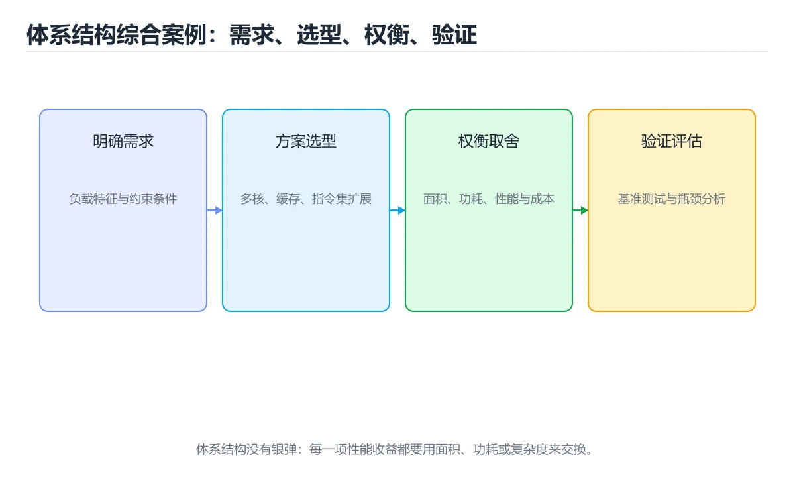
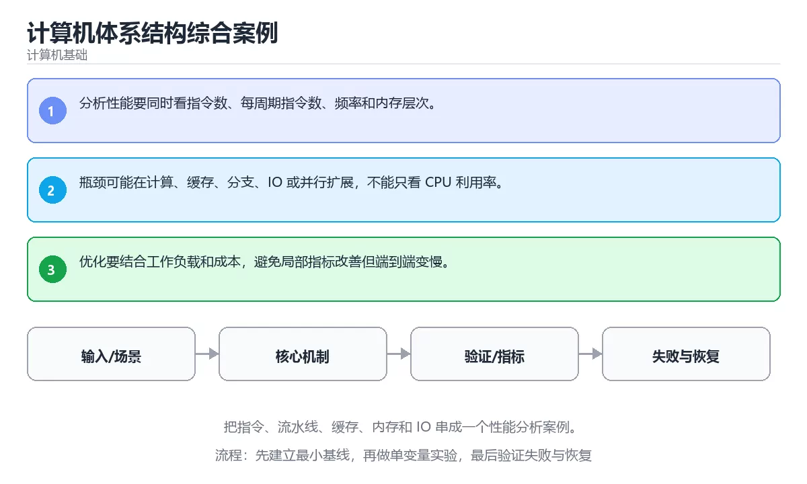

# 计算机体系结构综合案例





> 内容更新时间：2026-10-06 · 学习阶段：高级 · 预计用时：40 分钟

## 本节知识框架

**课程定位**：所属分类 `fundamentals`（计算机基础），课程主题 `计算机体系结构综合案例`，学习阶段 高级，建议用时 45 分钟。

本课主线：把指令、流水线、缓存、内存和 IO 串成一个性能分析案例。

**学完本课应当能够**
- 说清 `体系结构` 与 `性能分析` 的含义与区别，并各举一个正例和一个反例。
- 用本课示例验证 `瓶颈` 的行为，记录输入、输出与失败条件。
- 遇到「只看主频判断性能」这类问题时，能说出触发条件与修复顺序。

### 从概念到验证的学习链条

1. `体系结构`：先掌握 系统中主要组件、职责、接口以及它们之间协作和权衡的整体结构，再用它解释 `性能分析` 为什么会出现。
2. `性能分析`：先掌握 通过测量和证据找出资源消耗与瓶颈原因，区分现象、假设和根因，再用它解释 `瓶颈` 为什么会出现。
3. `瓶颈`：先掌握 按“计算机体系结构综合案例”中 体系结构、性能分析、瓶颈 的实践顺序，把四个步骤排成从准备到复盘的合理顺序，再用它解释 `权衡` 为什么会出现。
4. `权衡`：先掌握 在性能、成本、复杂度、可靠性和交付速度之间选择当前最合适的折中，再用它解释 本课示例的观察结果 为什么会出现。

**先修与衔接**：本课是「计算机基础」分类的第 30 课。先修内容：《嵌入式与 IoT 基础》。《嵌入式与 IoT 基础》里的 `嵌入式`、`MCU` 是本课的前提。相关或后续课程：《计算机组成入门》。

### 完成判据

- **定义关**：不看正文也能说明 `体系结构` 是 系统中主要组件、职责、接口以及它们之间协作和权衡的整体结构，并指出一个反例。
- **机制关**：能按“输入 → 转换 → 输出 → 验证”复述 `计算机体系结构综合案例`，而不是只背结论。
- **示例关**：能运行或推演 `计算机体系结构综合案例` 的 `text` 示例，并说明一个真实出现的标识符或字面量。
- **证据关**：能指出 `计算机体系结构综合案例` 示例里的 调用了 `speedup()`，并说明它支持或反驳了本课的哪一条结论。
- **排错关**：能复现 只看主频判断性能，记录现象并按 用基准测试与性能计数器定位真实瓶颈 修复。
- **迁移关**：能把 `体系结构`、`性能分析`、`瓶颈`、`权衡` 放进一个与 `计算机体系结构综合案例` 不同的项目场景，并保持输入与验证条件可追踪。
- **复盘关**：学完 `计算机体系结构综合案例` 后，用一句话写下仍然不确定的结论，并列出下一次验证需要的输入、环境和成功判据。

### 复习清单

- [ ] 能不看正文复述本课核心术语，并指出一个边界或反例。
- [ ] 能运行或推演本课示例，记录输入、输出与失败现象。
- [ ] 能完成一次自测，并把错题对照错误表定位原因。

## 核心概念定义

| 术语 | 操作性定义 | 常见边界与风险 |
| --- | --- | --- |
| 体系结构 | 系统中主要组件、职责、接口以及它们之间协作和权衡的整体结构。 | 只在「系统中主要组件、职责、接口以及它们之间协作和权衡的整体结构」这一前提下成立，换输入或换环境要重新验证。 |
| 性能分析 | 通过测量和证据找出资源消耗与瓶颈原因，区分现象、假设和根因。 | 只在「通过测量和证据找出资源消耗与瓶颈原因，区分现象、假设和根因」这一前提下成立，换输入或换环境要重新验证。 |
| 瓶颈 | 按“计算机体系结构综合案例”中 体系结构、性能分析、瓶颈 的实践顺序，把四个步骤排成从准备到复盘的合理顺序。 | 易错：忽略每周期指令数、缓存与内存带宽；正确做法是用基准测试与性能计数器定位真实瓶颈。 |
| 权衡 | 在性能、成本、复杂度、可靠性和交付速度之间选择当前最合适的折中。 | 结论随输入规模变化，小规模成立不代表大规模成立，需要重新测量。 |

## 原理与运行机制

### 机制总览

**教材衔接：核心知识**

### 1. 分析性能要同时看指令数、每周期指令数、频率和内存层次。

- 关键做法：基线只保留 性能分析 必需的部分，其余条件一次加一个。
- 验证标准：性能分析 的异常路径有明确错误信息与恢复动作。

### 2. 瓶颈可能在计算、缓存、分支、IO 或并行扩展，不能只看 CPU 利用率。

把这条结论放回「计算机体系结构综合案例」的完整流程里展开：

- 正文依据：能用自己的话解释：瓶颈可能在计算、缓存、分支、IO 或并行扩展，不能只看 CPU 利用率。
- 落地检查：把「2. 瓶颈可能在计算、缓存、分支、IO 或并行扩展，不能只看 CPU 利用率。」改写成一条可执行的核对项，逐条验证输入、超时与失败路径。

### 3. 优化要结合工作负载和成本，避免局部指标改善但端到端变慢。

把这条结论放回「计算机体系结构综合案例」的完整流程里展开：

- 正文依据：合上教程，用 3～5 句话解释计算机体系结构综合案例。
- 落地检查：把「3. 优化要结合工作负载和成本，避免局部指标改善但端到端变慢。」改写成一条可执行的核对项，逐条验证输入、超时与失败路径。

**教材衔接：关键流程**

**教材衔接：实践路径**

**教材衔接：验证步骤**

### 机制拆解：每一步的输入、动作与输出

#### 1. `体系结构`
- 输入：`体系结构`；本步把 系统中主要组件、职责、接口以及它们之间协作和权衡的整体结构 当作判断规则。
- 动作：围绕 `体系结构` 保留中间状态，并记录它与 `性能分析` 的对应关系。
- 输出：`性能分析`，它可以被下一段代码、测试或记录继续使用。
- `体系结构` 的失败条件：只在「系统中主要组件、职责、接口以及它们之间协作和权衡的整体结构」这一前提下成立，换输入或换环境要重新验证。

#### 2. `性能分析`
- 输入：`体系结构`；本步把 通过测量和证据找出资源消耗与瓶颈原因，区分现象、假设和根因 当作判断规则。
- 动作：围绕 `性能分析` 保留中间状态，并记录它与 `瓶颈` 的对应关系。
- 输出：`瓶颈`，它可以被下一段代码、测试或记录继续使用。
- `性能分析` 的失败条件：只在「通过测量和证据找出资源消耗与瓶颈原因，区分现象、假设和根因」这一前提下成立，换输入或换环境要重新验证。

#### 3. `瓶颈`
- 输入：`性能分析`；本步把 按“计算机体系结构综合案例”中 体系结构、性能分析、瓶颈 的实践顺序，把四个步骤排成从准备到复盘的合理顺序 当作判断规则。
- 动作：围绕 `瓶颈` 保留中间状态，并记录它与 `权衡` 的对应关系。
- 输出：`权衡`，它可以被下一段代码、测试或记录继续使用。
- `瓶颈` 的失败条件：当只看主频判断性能时，会出现忽略每周期指令数、缓存与内存带宽。

#### 4. `权衡`
- 输入：`瓶颈`；本步把 在性能、成本、复杂度、可靠性和交付速度之间选择当前最合适的折中 当作判断规则。
- 动作：围绕 `权衡` 保留中间状态，并记录它与 `speedup` 的对应关系。
- 输出：`speedup`，它可以被下一段代码、测试或记录继续使用。
- `权衡` 的失败条件：结论随输入规模变化，小规模成立不代表大规模成立，需要重新测量。

### 示例中的可观察事实

1. 调用了 `speedup()`；它对应的课程主题是 `计算机体系结构综合案例`。
2. 调用了 `print()`；它对应的课程主题是 `计算机体系结构综合案例`。
3. 调用了 `round()`；它对应的课程主题是 `计算机体系结构综合案例`。

### 复现实验记录

- 环境：`计算机体系结构综合案例` 使用 `text` 示例，固定 `体系结构`、`性能分析`、`瓶颈`、`权衡` 作为第一组条件。
- 首轮输入：先确认 调用了 `speedup()`，预测 `体系结构` 会怎样变化。
- 基线观察：记录命令、输入、输出和错误原文，不用截图代替可复制的文本。
- 单变量修改：只改变 `体系结构`，观察 `权衡` 是否仍满足定义。
- 失败注入：复现 只看主频判断性能，确认现象是 忽略每周期指令数、缓存与内存带宽。
- 记录结论：把“修改前、修改后、预期变化、实际变化”写成四列表，这样复盘 `计算机体系结构综合案例` 时才能区分概念错误与实现错误。

## 典型应用场景

**教材衔接：零基础精讲：把计算机体系结构综合案例真正讲透**

### 先建立一个直觉

把计算机看成一个分层机器：逻辑门组成运算单元，指令驱动数据移动，缓存缩短等待时间，操作系统把硬件抽象成可编程接口。落到本课，「计算机体系结构综合案例」关心的是 体系结构 与 性能分析 的配合，也就是说这条直觉要在 核心知识 里被具体验证。

本课的摘要可以当作一张地图：把指令、流水线、缓存、内存和 IO 串成一个性能分析案例。

### 逐步拆解

1. 澄清输入与目标。先写清「计算机体系结构综合案例」要解决的问题、合法输入范围和成功标准，再进入后续步骤。
2. 描述处理过程。把「体系结构、性能分析、瓶颈、权衡」映射到具体步骤，每步都要求能单独验证。
3. 定义输出。把 parallel_fraction 的返回值、日志和失败信号都写清楚，缺一项都不算完整。
4. 关掉一个看似必要的检查（性能分析相关），观察哪个测试或指标先失败，用证据说明它为什么不能省。
5. 选一个只有两三步的体系结构例子，先写出预期输出，再运行确认；不一致时先怀疑前提而不是代码。

### 把正文串成一条执行链

- **1. 分析性能要同时看指令数、每周期指令数、频率和内存层次。**：在「计算机体系结构综合案例」里，「1. 分析性能要同时看指令数、每周期指令数、频率和内存层次。」这一步要先写清输入与预期，再记录实际结果和差异；结果不符时回到对应小节核对前提。
- **2. 瓶颈可能在计算、缓存、分支、IO 或并行扩展，不能只看 CPU 利用率。**：在「计算机体系结构综合案例」里，「2. 瓶颈可能在计算、缓存、分支、IO 或并行扩展，不能只看 CPU 利用率。」这一步要先写清输入与预期，再记录实际结果和差异；结果不符时回到对应小节核对前提。
- **3. 优化要结合工作负载和成本，避免局部指标改善但端到端变慢。**：在「计算机体系结构综合案例」里，「3. 优化要结合工作负载和成本，避免局部指标改善但端到端变慢。」这一步要先写清输入与预期，再记录实际结果和差异；结果不符时回到对应小节核对前提。
- **考点 1：关于「分析性能要同时看指令数、每周期指令数、频率和内存层次。」，下列说法正确的是？**：先独立作答，再回到本课对应小节核对判断依据；答错时记录是哪一个前提被忽略。
- **考点 2：按“计算机体系结构综合案例”中 体系结构、性能分析、瓶颈 的实践顺序，把四个步骤排成从准备到复盘的合理顺序。**：先独立作答，再回到本课对应小节核对判断依据；答错时记录是哪一个前提被忽略。
- **考点 3：关于「优化要结合工作负载和成本，避免局部指标改善但端到端变慢。」，下列说法正确的是？**：先独立作答，再回到本课对应小节核对判断依据；答错时记录是哪一个前提被忽略。

### 从测验反推易错点

- 参考判断：分析性能要同时看指令数、每周期指令数、频率和内存层次。
- 自问：如果去掉题干里的一个限定词，结论还成立吗？

- 参考判断：瓶颈可能在计算、缓存、分支、IO 或并行扩展，不能只看 CPU 利用率。

- 参考判断：优化要结合工作负载和成本，避免局部指标改善但端到端变慢。

**检查点 4：本课的核心学习目标是什么？**

- 参考判断：把指令、流水线、缓存、内存和 IO 串成一个性能分析案例。

**检查点 5：以下哪些术语与计算机体系结构综合案例直接相关？（多选）**

- 参考判断：体系结构、性能分析

### 工程排错顺序

| 先查什么 | 要得到的证据 | 判断标准 |
| --- | --- | --- |
| 输入如何表示，位宽与精度是否明确？ | 日志、输入样例、测试或指标 | 能复现并解释，才算定位 |
| 数据经过哪些层级，瓶颈在哪一层？ | 日志、输入样例、测试或指标 | 能复现并解释，才算定位 |
| 顺序、分支与并行如何影响结果？ | 日志、输入样例、测试或指标 | 能复现并解释，才算定位 |
| 是否用基准测试验证了推断？ | 日志、输入样例、测试或指标 | 能复现并解释，才算定位 |

### 变式训练

1. 先用一个单文件示例验证 parallel_fraction，确认正确性后再引入框架或分布式组件。
2. 扩大 性能分析 的规模，记录本课结论在哪一个量级开始不成立。
3. 把 性能分析 换成失败输入，记录错误信息与恢复动作。
5. 把 parallel_fraction 的执行顺序调换一次，记录哪个中间结果先错；顺序敏感的地方就是本课的关键约束。
6. 在低带宽或低算力条件下重跑 性能分析，记录降级路径是否仍然可用。


### 迁移案例库

换一个 性能分析 约束重做一次，确认结论在新条件下是否仍然成立。

#### 迁移案例 1：围绕「体系结构」做一次小实验

**验收**：至少给出一个反例，说明体系结构在什么情况下会失效；只写成功案例不算通过。

#### 迁移案例 2：围绕「性能分析」做一次小实验

**步骤**：
1. 复述当前方案对「性能分析」的假设，写成一句可证伪的话。

#### 迁移案例 3：围绕「瓶颈」做一次小实验

**步骤**：
1. 复述当前方案对「瓶颈」的假设，写成一句可证伪的话。

#### 迁移案例 4：围绕「权衡」做一次小实验

**步骤**：
1. 复述当前方案对「权衡」的假设，写成一句可证伪的话。

#### 迁移案例 5：围绕「体系结构」做一次小实验

**步骤**：

#### 迁移案例 6：围绕「性能分析」做一次小实验

**步骤**：

#### 迁移案例 7：围绕「瓶颈」做一次小实验

**步骤**：

#### 迁移案例 8：围绕「权衡」做一次小实验

**步骤**：

#### 迁移案例 9：围绕「体系结构」做一次小实验

**步骤**：

#### 迁移案例 10：围绕「性能分析」做一次小实验

**步骤**：

#### 迁移案例 11：围绕「瓶颈」做一次小实验

**步骤**：

#### 迁移案例 12：围绕「权衡」做一次小实验

**步骤**：

#### 迁移案例 13：围绕「体系结构」做一次小实验

**步骤**：

#### 迁移案例 14：围绕「性能分析」做一次小实验

**步骤**：

#### 迁移案例 15：围绕「瓶颈」做一次小实验

**步骤**：

#### 迁移案例 16：围绕「权衡」做一次小实验

**步骤**：

<!-- p0-depth-v2:end -->

- **只看主频判断性能**：典型现象是忽略每周期指令数、缓存与内存带宽；正确做法是用基准测试与性能计数器定位真实瓶颈。
- **不区分计算密集与访存密集**：典型现象是优化方向选错；正确做法是先测指令数、缓存命中率与带宽占用。
- **换硬件不检查软件适配**：典型现象是新指令集没有被真正用上；正确做法是确认编译器与运行时是否启用了新特性。

### 最小验证场景

- 准备：保留 `text` 示例的原始输入，先记录 `计算机体系结构综合案例` 的基线输出和完整运行命令。
- 观察：先核对 调用了 `speedup()`，再改变一个与 `体系结构` 相关的条件。
- 判定：新结果与 `计算机体系结构综合案例` 的基线不同不等于错误；只有当差异破坏了 `体系结构` 的定义或错误表中的约束，才判定为失败。

### 选择与边界

- 使用 `体系结构` 时，先满足它的定义：系统中主要组件、职责、接口以及它们之间协作和权衡的整体结构；只在「系统中主要组件、职责、接口以及它们之间协作和权衡的整体结构」这一前提下成立，换输入或换环境要重新验证。
- 使用 `性能分析` 时，先满足它的定义：通过测量和证据找出资源消耗与瓶颈原因，区分现象、假设和根因；只在「通过测量和证据找出资源消耗与瓶颈原因，区分现象、假设和根因」这一前提下成立，换输入或换环境要重新验证。
- 使用 `瓶颈` 时，先满足它的定义：按“计算机体系结构综合案例”中 体系结构、性能分析、瓶颈 的实践顺序，把四个步骤排成从准备到复盘的合理顺序；易错：忽略每周期指令数、缓存与内存带宽；正确做法是用基准测试与性能计数器定位真实瓶颈。
- 使用 `权衡` 时，先满足它的定义：在性能、成本、复杂度、可靠性和交付速度之间选择当前最合适的折中；结论随输入规模变化，小规模成立不代表大规模成立，需要重新测量。

## 代码/协议/SQL 示例

### 最小可验证示例

**教材衔接：最小可运行示例**

下面这段代码演示 体系结构 的最小路径，先原样运行，再按注释改一处：

```python
def speedup(parallel_fraction, factor):
    return 1 / ((1 - parallel_fraction) + parallel_fraction / factor)

print(round(speedup(0.5, 4), 2))
```

**教材衔接：预期输出**

```text
1.6
```

### 示例精读：先找证据，再改一个条件

1. 调用了 `speedup()`；它出现在 `计算机体系结构综合案例` 的示例中，阅读时先确认它前后各发生了什么。
2. 调用了 `print()`；它出现在 `计算机体系结构综合案例` 的示例中，阅读时先确认它前后各发生了什么。
3. 调用了 `round()`；它出现在 `计算机体系结构综合案例` 的示例中，阅读时先确认它前后各发生了什么。
- 在 `计算机体系结构综合案例` 中与 `体系结构` 对照：示例必须能支持 系统中主要组件、职责、接口以及它们之间协作和权衡的整体结构，否则说明这一段还缺少实现或验证步骤。
- 在 `计算机体系结构综合案例` 中与 `性能分析` 对照：示例必须能支持 通过测量和证据找出资源消耗与瓶颈原因，区分现象、假设和根因，否则说明这一段还缺少实现或验证步骤。
- 在 `计算机体系结构综合案例` 中与 `瓶颈` 对照：示例必须能支持 按“计算机体系结构综合案例”中 体系结构、性能分析、瓶颈 的实践顺序，把四个步骤排成从准备到复盘的合理顺序，否则说明这一段还缺少实现或验证步骤。
- 在 `计算机体系结构综合案例` 中与 `权衡` 对照：示例必须能支持 在性能、成本、复杂度、可靠性和交付速度之间选择当前最合适的折中，否则说明这一段还缺少实现或验证步骤。

## 时间/空间复杂度或性能分析

**性能关注点（计算机体系结构综合案例）**：关注资源换算与精度损失：记录单位换算误差、存储空间与实际耗时。

**本课特有开销（计算机体系结构综合案例 · 体系结构）**：缓存命中率比缓存实现本身更关键，先记录命中率与失效策略再谈优化。

**测量方法**：以 `计算机体系结构综合案例` 的 `体系结构` 场景为对象，固定输入跑一遍记录基线，再把规模或并发度提高一个数量级复测；两次结果的差值与波动范围才是结论依据。

### 需要控制的变量与记录项

- `计算机体系结构综合案例` 的 `体系结构`：固定它的版本、输入范围和资源上限，分别记录速度、内存与失败率的变化。
- `计算机体系结构综合案例` 的 `性能分析`：固定它的版本、输入范围和资源上限，分别记录速度、内存与失败率的变化。
- `计算机体系结构综合案例` 的 `瓶颈`：固定它的版本、输入范围和资源上限，分别记录速度、内存与失败率的变化。
- `计算机体系结构综合案例` 的 `权衡`：固定它的版本、输入范围和资源上限，分别记录速度、内存与失败率的变化。
- `计算机体系结构综合案例` 中 `体系结构` 的边界：只在「系统中主要组件、职责、接口以及它们之间协作和权衡的整体结构」这一前提下成立，换输入或换环境要重新验证。达到边界时不要外推，必须重新测量。
- `计算机体系结构综合案例` 中 `性能分析` 的边界：只在「通过测量和证据找出资源消耗与瓶颈原因，区分现象、假设和根因」这一前提下成立，换输入或换环境要重新验证。达到边界时不要外推，必须重新测量。
- `计算机体系结构综合案例` 中 `瓶颈` 的边界：易错：忽略每周期指令数、缓存与内存带宽；正确做法是用基准测试与性能计数器定位真实瓶颈。达到边界时不要外推，必须重新测量。
- `计算机体系结构综合案例` 中 `权衡` 的边界：结论随输入规模变化，小规模成立不代表大规模成立，需要重新测量。达到边界时不要外推，必须重新测量。
- `计算机体系结构综合案例` 的代码证据：先验证 调用了 `speedup()`，再记录该路径的输入规模与耗时；只看代码行数不能推出复杂度。

## 常见误区与易错点

| 容易写错的做法 | 实际现象 | 原因与正确做法 |
| --- | --- | --- |
| 只看主频判断性能 | 忽略每周期指令数、缓存与内存带宽。 | 用基准测试与性能计数器定位真实瓶颈。 |
| 不区分计算密集与访存密集 | 优化方向选错。 | 先测指令数、缓存命中率与带宽占用。 |
| 换硬件不检查软件适配 | 新指令集没有被真正用上。 | 确认编译器与运行时是否启用了新特性。 |

### 现场 1：只看主频判断性能

**症状**：忽略每周期指令数、缓存与内存带宽。

**根因与修复**：用基准测试与性能计数器定位真实瓶颈。

**自检**：在本课示例里复现「只看主频判断性能」，改成用基准测试与性能计数器定位真实瓶颈后重跑；如果症状消失且失败路径按预期变化，说明定位正确。

### 现场 2：不区分计算密集与访存密集

**症状**：优化方向选错。

**根因与修复**：先测指令数、缓存命中率与带宽占用。

**自检**：在本课示例里复现「不区分计算密集与访存密集」，改成先测指令数、缓存命中率与带宽占用后重跑；如果症状消失且失败路径按预期变化，说明定位正确。

### 现场 3：换硬件不检查软件适配

**症状**：新指令集没有被真正用上。

**根因与修复**：确认编译器与运行时是否启用了新特性。

**自检**：在本课示例里复现「换硬件不检查软件适配」，改成确认编译器与运行时是否启用了新特性后重跑；如果症状消失且失败路径按预期变化，说明定位正确。

## 与其他知识点的关系

| 关系 | 课程 | 为什么 |
| --- | --- | --- |
| 先修 | 《嵌入式与 IoT 基础》 | 本课会直接使用它的概念或操作前提。 |
| 关联 | 《计算机组成入门》 | 用于横向比较或把本课结论迁移到相邻主题。 |
| 前置顺序 | 《SSD、存储栈与持久化》 | 同分类中安排在本课之前，建议先完成其自测。 |

**教材衔接：复习与迁移**

### 概念复述

- 用一句话说明「计算机体系结构综合案例」解决什么问题：把指令、流水线、缓存、内存和 IO 串成一个性能分析案例。
- 写出体系结构、性能分析、瓶颈之间的关系，并各举一个例子。
- 说出本课最容易混淆的两个概念，以及区分它们的判据。

### 正文逐节复核

- **零基础精讲：把计算机体系结构综合案例真正讲透**：本课的摘要可以当作一张地图：把指令、流水线、缓存、内存和 IO 串成一个性能分析案例。


### 迁移练习

把「计算机体系结构综合案例」的结论迁移到相邻主题，每次迁移都写清预测与证据：

- **先修**：`嵌入式与 IoT 基础`。本课默认这些内容已经掌握。
- **相关或后续**：`计算机组成入门`。本课术语会在这些课程里继续使用。
- **术语归属**：`体系结构`、`性能分析`、`瓶颈` 的定义以本课「核心概念定义」为准，换到其他课程时先确认定义是否被改写。

### 先修与后续术语接口

- `计算机组成入门`：两者通过本分类的学习顺序衔接，阅读时重点比较各自的输入与失败条件。
- `嵌入式与 IoT 基础`：两者通过本分类的学习顺序衔接，阅读时重点比较各自的输入与失败条件。

### 容易混淆的相邻概念

- `体系结构` 与 `性能分析`：前者强调 系统中主要组件、职责、接口以及它们之间协作和权衡的整体结构；后者强调 通过测量和证据找出资源消耗与瓶颈原因，区分现象、假设和根因。判断时分别检查两条定义的适用范围，不要只看名称相似就互换。
- `性能分析` 与 `瓶颈`：前者强调 通过测量和证据找出资源消耗与瓶颈原因，区分现象、假设和根因；后者强调 按“计算机体系结构综合案例”中 体系结构、性能分析、瓶颈 的实践顺序，把四个步骤排成从准备到复盘的合理顺序。判断时分别检查两条定义的适用范围，不要只看名称相似就互换。
- `瓶颈` 与 `权衡`：前者强调 按“计算机体系结构综合案例”中 体系结构、性能分析、瓶颈 的实践顺序，把四个步骤排成从准备到复盘的合理顺序；后者强调 在性能、成本、复杂度、可靠性和交付速度之间选择当前最合适的折中。判断时分别检查两条定义的适用范围，不要只看名称相似就互换。

## 自测题与参考答案

> 先独立作答，再对照参考答案；答案都能在本课正文、术语表或错误表里找到依据。

### 自测 1（概念复述）

不看正文，写出 `体系结构` 的操作性定义，并说明它与 `性能分析` 的区别。

**参考答案**：系统中主要组件、职责、接口以及它们之间协作和权衡的整体结构。

`性能分析` 的定位是：通过测量和证据找出资源消耗与瓶颈原因，区分现象、假设和根因；两者的差别要从适用对象与失败模式上说明。

### 自测 2（排错）

本课错误表记录了「只看主频判断性能」这类做法。请写出它会出现的现象、根因，以及修复顺序。

**参考答案**：现象是忽略每周期指令数、缓存与内存带宽；正确做法是用基准测试与性能计数器定位真实瓶颈。修复时先复现现象并保留证据，再改动一处假设重跑，确认现象消失。

### 自测 3（动手验证）

运行本课的 `text` 示例，改动其中一个输入后重新运行，记录输出与错误信息。

**参考答案**：正常输入下 `text` 示例应当复现正文给出的结果；改动输入后，如果结果改变或报错，先核对它是否满足 `计算机体系结构综合案例` 中`体系结构` 的适用范围，再检查错误表里是否有同类现象。

### 自测 4（代码阅读）

阅读本课开头的 `text` 示例，说明它体现了`体系结构` 的哪一条性质，并指出改动哪个输入会让这条性质不再成立。

**参考答案**：`体系结构` 的定义是 系统中主要组件、职责、接口以及它们之间协作和权衡的整体结构，示例正是在实现这条定义。改动与 `体系结构` 有关的一个输入后，如果结果不再符合 `计算机体系结构综合案例` 的正文描述，就说明该性质只在当前前提成立。

### 自测 5（迁移）

把 `计算机体系结构综合案例` 的方法迁移到自己的项目：围绕 `体系结构` 写出一个与错误表同类的风险点，并说明触发条件和检验方式。

**参考答案**：例如「换硬件不检查软件适配」，它会导致新指令集没有被真正用上；检验方式是按确认编译器与运行时是否启用了新特性改一处再复现，确认现象消失且没有引入新的失败分支。

### 自测 6（对比）

用一个表格对比 `体系结构` 与 `性能分析`：各写一行适用场景、一行失败表现。

**参考答案**：`体系结构` 的定义是系统中主要组件、职责、接口以及它们之间协作和权衡的整体结构；`性能分析` 的定义是通过测量和证据找出资源消耗与瓶颈原因，区分现象、假设和根因。两者的失败表现分别对应本课错误表里与本术语相关的行。

### 自测 7（排错顺序）

面对「只看主频判断性能」引发的问题，请把“复现 忽略每周期指令数、缓存与内存带宽 → 保留证据 → 用基准测试与性能计数器定位真实瓶颈 → 回归验证”四步写成可执行的检查清单。

**参考答案**：第一步按忽略每周期指令数、缓存与内存带宽复现；第二步记录输入、版本与完整报错；第三步按用基准测试与性能计数器定位真实瓶颈只改一处；第四步重跑并确认失败路径也按预期变化。

### 自测 8（边界判断）

针对 `权衡`，分别写出“可以使用”的条件和“结论不再成立”的条件。

**参考答案**：结论随输入规模变化，小规模成立不代表大规模成立，需要重新测量。 同时要把 `权衡` 的定义 在性能、成本、复杂度、可靠性和交付速度之间选择当前最合适的折中 与实际输入逐项对照。

### 自测 9（机制重建）

不看正文，按输入、转换、输出、验证四段重建 `体系结构` → `性能分析` → `瓶颈` → `权衡` 的作用链。

**参考答案**：起点是 `体系结构` 的定义 系统中主要组件、职责、接口以及它们之间协作和权衡的整体结构；中间每一步都保留可观察状态；终点由 `权衡` 检查，失败时回到错误表定位第一个偏离定义的步骤。

### 自测 10（综合排错）

在 `计算机体系结构综合案例` 中，现象是 新指令集没有被真正用上。请围绕 换硬件不检查软件适配 写出最小复现、关键证据、修复动作和回归验证，并说明为什么不能只凭一次运行下结论。

**参考答案**：先复现 换硬件不检查软件适配，记录输入与完整错误；再按 确认编译器与运行时是否启用了新特性 只改一处。回归时同时跑正常路径和边界路径，只有两次结果都可解释，才把修复视为完成。

### 自测 11（一分钟复述）

用每分钟约 200 字的速度复述 `计算机体系结构综合案例`：先给主问题，再按顺序说出 `体系结构`、`性能分析`、`瓶颈`、`权衡`，最后给一个失败案例。

**自评标准**：主问题必须对应 把指令、流水线、缓存、内存和 IO 串成一个性能分析案例；每个术语都要能接上一句定义或边界；失败案例必须写成可观察现象，不能用“可能有风险”代替证据。

## 术语速查

| 术语 | 一句话说明 |
| --- | --- |
| `体系结构` | 系统中主要组件、职责、接口以及它们之间协作和权衡的整体结构。 |
| `性能分析` | 通过测量和证据找出资源消耗与瓶颈原因，区分现象、假设和根因。 |
| `瓶颈` | 按“计算机体系结构综合案例”中 体系结构、性能分析、瓶颈 的实践顺序，把四个步骤排成从准备到复盘的合理顺序。 |
| `权衡` | 在性能、成本、复杂度、可靠性和交付速度之间选择当前最合适的折中。 |

**术语关系**：`体系结构`（系统中主要组件、职责、接口以及它们之间协作和权衡的整体结构） → `性能分析`（通过测量和证据找出资源消耗与瓶颈原因） → `瓶颈`（按“计算机体系结构综合案例”中 体系结构、性能分析、瓶颈 的实践顺序） → `权衡`（在性能、成本、复杂度、可靠性和交付速度之间选择当前最合适的折中）。

## 考点精讲

`计算机体系结构综合案例` 的题库有 6 道题，下面逐题给出题干、正确项与判断依据：先自己作答，再核对正确项，最后回到正文对应小节复核。

### 考点 1：第 1 题

- **题目**：在 `计算机体系结构综合案例` 里，与 `体系结构` 有关的说法中，哪一项最符合把指令、流水线、缓存、内存和 IO 串成一个性能分析案例。？
- **正确项**：分析性能要同时看指令数、每周期指令数、频率和内存层次。
- **判断依据**：这道题落在术语 `体系结构` 上：系统中主要组件、职责、接口以及它们之间协作和权衡的整体结构。复习时把 `体系结构` 的定义、适用边界和一个反例一起说清楚，再回到「核心概念定义」核对原文。

### 考点 2：第 2 题

- **题目**：按“计算机体系结构综合案例”中 体系结构、性能分析、瓶颈 的实践顺序，把四个步骤排成从准备到复盘的合理顺序。
- **正确项**：先明确 体系结构 的输入、输出与约束 → 写出最小示例并核对 性能分析 的基线结果 → 只改一个变量，记录边界与失败路径的变化 → 固定版本与证据，把“计算机体系结构综合案例”的结论写成可复现记录
- **判断依据**：这道题落在术语 `体系结构` 上：系统中主要组件、职责、接口以及它们之间协作和权衡的整体结构。复习时把 `体系结构` 的定义、适用边界和一个反例一起说清楚，再回到「核心概念定义」核对原文。

### 考点 3：第 3 题

- **题目**：在 `计算机体系结构综合案例` 里，与 `体系结构` 有关的说法中，哪一项最符合把指令、流水线、缓存、内存和 IO 串成一个性能分析案例。？（计算机体系结构综合案例·计算机基础 第 3 题）
- **正确项**：优化要结合工作负载和成本，避免局部指标改善但端到端变慢。
- **判断依据**：这道题落在术语 `体系结构` 上：系统中主要组件、职责、接口以及它们之间协作和权衡的整体结构。复习时把 `体系结构` 的定义、适用边界和一个反例一起说清楚，再回到「核心概念定义」核对原文。

### 考点 4：第 4 题

- **题目**：`计算机体系结构综合案例` 的主线是：把指令、流水线、缓存、内存和 IO 串成一个性能分析案例。下面哪一项与这条主线一致？
- **正确项**：把指令、流水线、缓存、内存和 IO 串成一个性能分析案例。
- **判断依据**：这道题落在术语 `体系结构` 上：系统中主要组件、职责、接口以及它们之间协作和权衡的整体结构。复习时把 `体系结构` 的定义、适用边界和一个反例一起说清楚，再回到「核心概念定义」核对原文。

### 考点 5：第 5 题

- **题目**：课程 `把指令、流水线、缓存、内存和 IO 串成一个性能分析案例。`。在 `计算机体系结构综合案例` 里，`体系结构`、`性能分析` 与下面哪些选项属于同一层概念？（多选）
- **正确项**：体系结构；性能分析
- **判断依据**：这道题落在术语 `体系结构` 上：系统中主要组件、职责、接口以及它们之间协作和权衡的整体结构。复习时把 `体系结构` 的定义、适用边界和一个反例一起说清楚，再回到「核心概念定义」核对原文。

### 考点 6：第 6 题

- **题目**：`计算机体系结构综合案例` 的示例代码服务于“把指令、流水线、缓存、内存和 IO 串成一个性能分析案例。”。哪一条判断是正确的？
- **正确项**：分析性能要同时看指令数、每周期指令数、频率和内存层次。
- **判断依据**：这道题落在术语 `体系结构` 上：系统中主要组件、职责、接口以及它们之间协作和权衡的整体结构。复习时把 `体系结构` 的定义、适用边界和一个反例一起说清楚，再回到「核心概念定义」核对原文。

### 考点 7：`体系结构`

- **要点**：系统中主要组件、职责、接口以及它们之间协作和权衡的整体结构。
- **体系结构 的边界**：只在「系统中主要组件、职责、接口以及它们之间协作和权衡的整体结构」这一前提下成立，换输入或换环境要重新验证。

### 考点 8：`性能分析`

- **要点**：通过测量和证据找出资源消耗与瓶颈原因，区分现象、假设和根因。
- **性能分析 的边界**：只在「通过测量和证据找出资源消耗与瓶颈原因，区分现象、假设和根因」这一前提下成立，换输入或换环境要重新验证。

### 考点 9：`瓶颈`

- **要点**：按“计算机体系结构综合案例”中 体系结构、性能分析、瓶颈 的实践顺序，把四个步骤排成从准备到复盘的合理顺序。
- **瓶颈 的边界**：易错：忽略每周期指令数、缓存与内存带宽；正确做法是用基准测试与性能计数器定位真实瓶颈。

### 考点 10：`权衡`

- **要点**：在性能、成本、复杂度、可靠性和交付速度之间选择当前最合适的折中。
- **权衡 的边界**：结论随输入规模变化，小规模成立不代表大规模成立，需要重新测量。

### 考点 11：排错——只看主频判断性能

- **现象**：忽略每周期指令数、缓存与内存带宽。
- **处理**：用基准测试与性能计数器定位真实瓶颈。

### 考点 12：排错——不区分计算密集与访存密集

- **现象**：优化方向选错。
- **处理**：先测指令数、缓存命中率与带宽占用。

### 考点 13：综合辨析——`体系结构` 与 `权衡`

- **辨析点**：`体系结构` 的定义是 系统中主要组件、职责、接口以及它们之间协作和权衡的整体结构；`权衡` 的定义是 在性能、成本、复杂度、可靠性和交付速度之间选择当前最合适的折中。
- **答题要求**：面对 `计算机体系结构综合案例` 的题目，先判断描述的是 `体系结构` 还是 `权衡`，再归到对应定义，最后写出一个会让该定义失效的边界输入。

### 考点 14：排错评分点

- **现象分**：能写出 忽略每周期指令数、缓存与内存带宽，而不是只写“程序有错”。
- **证据分**：保留触发 只看主频判断性能 的输入、版本和错误原文。
- **修复分**：按 用基准测试与性能计数器定位真实瓶颈 只改一处，并同时回归正常路径与边界路径。

## 内容元数据

- 内容版本：v2.0
- 最后更新：2026-10-06
- 学习阶段：高级
- 适用环境：通用计算机体系结构知识；本课聚焦 体系结构。
- 内容来源：内置结构化课程与工程实践整理
- 相关主题：体系结构、性能分析、瓶颈、权衡
- 质量版本：P0 测验标准 + P1 覆盖扩展 + P2 体验补全

## 参考资料与复核

- 最后复核：2026-10-04
- 下次复核：2027-03-17
- 复核范围：版本兼容、API 行为、安全建议与工程实践
- 来源性质：官方文档、标准或权威教材；本课核对关键词：体系结构、性能分析、瓶颈、权衡。

| 参考资料 | 本课用途 |
| --- | --- |
| [Intel 开发者文档](https://www.intel.com/content/www/us/en/developer/articles/technical/intel-sdm.html) | x86 指令集与体系结构 |
| [MDN 计算机基础](https://developer.mozilla.org/docs/Learn_web_development/Core) | Web 相关计算机基础 |
| [MIT 6.033 计算机系统工程](https://ocw.mit.edu/courses/6-033-computer-system-engineering-spring-2018/) | 系统设计与并发 |

| [本课术语索引：计算机体系结构综合案例](#核心概念定义) | 按本课输入、术语边界和错误表现逐项核对 |
> 「计算机体系结构综合案例」的链接用于离线阅读后的延伸核对；App 不会自动联网。