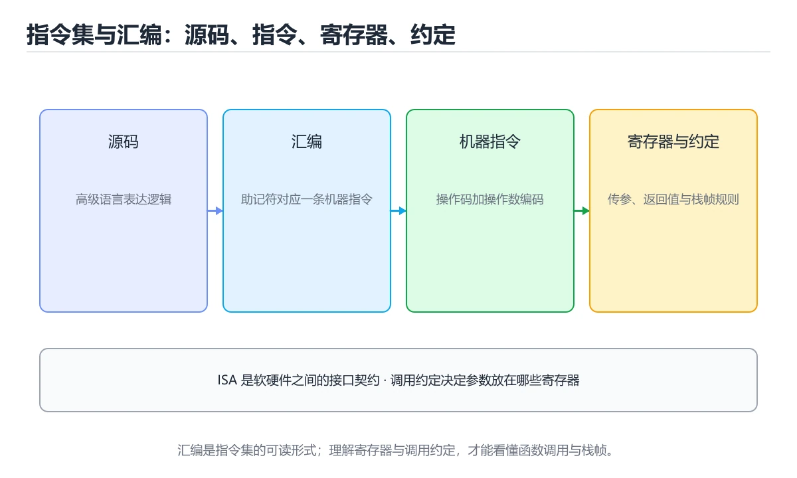
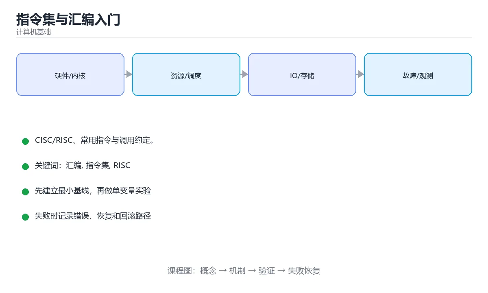

# 指令集与汇编入门





> 内容更新时间：2026-10-06 · 学习阶段：进阶 · 预计用时：40 分钟

## 学习目标

- 能用自己的话解释指令集与汇编入门解决了什么问题，而不是只背术语。
- 能说清 「汇编」、「指令集」、「RISC」、「CISC」 之间的关系，并分别举出一个例子。
- 能把 汇编 放回「指令集与汇编入门」的知识体系，说明它和 指令集 的边界。
- 能完成本课练习，并用验收标准检查自己的结果。

> 一句话摘要：CISC/RISC、常用指令与调用约定。

## 前置知识

- 先完成上一课《数字逻辑与布尔代数》；如果已经掌握，可以直接用本课练习自测。
- 开始前先复习：汇编、指令集、RISC。
- 如果 从源码到机器指令 这一步看不懂，先记录具体卡点，再用 DWORD 复现一遍。

## 从源码到机器指令

高级语言经过编译生成汇编，汇编再被汇编器翻译成机器码。同一条 `a = b + c` 在不同架构上会变成不同的指令序列。

## 指令集架构（ISA）

| 类型 | 特点 | 代表 |
| --- | --- | --- |
| CISC | 指令复杂、变长，一条指令可完成多步操作 | x86-64 |
| RISC | 指令精简、定长，靠流水线提升性能 | ARM、RISC-V、LoongArch |

移动端与服务器逐渐转向 RISC 架构的原因：功耗更优、便于并行与流片。

## 常见指令类别

| 类别 | 示例 | 说明 |
| --- | --- | --- |
| 数据传送 | mov、load、store | 寄存器与内存之间搬运 |
| 算术运算 | add、sub、imul | 加减乘与比较 |
| 逻辑运算 | and、or、xor、shl | 位运算与移位 |
| 控制转移 | jmp、je、call、ret | 跳转、条件跳转、函数调用 |
| 栈操作 | push、pop | 配合调用约定维护栈帧 |

## 寄存器与调用约定

通用寄存器存放临时数据与参数；程序计数器 PC 指向下一条指令；栈指针 SP 指向栈顶；标志寄存器保存比较结果（零标志、进位标志等）。

调用约定规定参数如何传递（寄存器还是栈）、返回值放在哪、哪些寄存器由被调用者保存。函数调用时压入返回地址与栈帧，返回时恢复——这就是递归可能栈溢出的原因。

## 一段汇编的阅读方法

阅读汇编时关注三件事：数据从哪里来（寄存器/内存）、做了什么运算、下一条指令怎么走（顺序/跳转）。编译器优化后常见模式：把热变量放进寄存器、循环展开、用移位代替乘除 2 的幂、内联小函数。

## 为什么还要学汇编

1. 排查崩溃与性能问题：看反汇编定位优化是否生效。
2. 理解指针、栈、调用约定与未定义行为的真实代价。
3. 安全领域：逆向工程、漏洞分析与利用。
4. 系统编程与编译器开发的基础。

## 工具

| 工具 | 用途 |
| --- | --- |
| gcc/clang -S | 生成汇编代码 |
| objdump -d | 反汇编可执行文件 |
| gdb / lldb | 单步调试并查看寄存器 |
| Compiler Explorer | 在线对比不同编译选项的汇编输出 |

## 本课小结

汇编是**机器指令的人类可读形式**。不必手写，但要能读懂：重点抓数据流向、运算与控制跳转，以及调用约定如何维护栈帧。

## 寄存器与指令速查

| 类别 | x86-64 示例 | ARM64 示例 | 用途 |
| --- | --- | --- | --- |
| 通用寄存器 | RAX、RBX、RCX | X0 到 X30 | 临时数据 |
| 栈指针 | RSP | SP | 指向栈顶 |
| 帧指针 | RBP | X29（FP） | 指向当前栈帧 |
| 指令指针 | RIP | PC | 下一条指令地址 |
| 参数寄存器 | RDI、RSI、RDX、RCX、R8、R9 | X0 到 X7 | 前几个函数参数 |
| 返回值 | RAX | X0 | 函数返回值 |
| 标志寄存器 | RFLAGS | NZCV | 条件跳转依据 |

| 指令类型 | 示例 | 说明 |
| --- | --- | --- |
| 数据搬移 | `mov eax, 1` | 寄存器与内存之间移动 |
| 算术 | `add`、`sub`、`imul` | 整数运算 |
| 逻辑 | `and`、`or`、`xor` | 位运算 |
| 比较 | `cmp a, b` | 设置标志位 |
| 跳转 | `jmp`、`je`、`jne`、`jg` | 无条件与条件跳转 |
| 调用 | `call`、`ret` | 压入返回地址 / 返回 |
| 栈操作 | `push`、`pop` | 调整 RSP |
| 访存 | `mov [rbp-4], eax` | 按地址读写 |

```asm
; x86-64：函数调用与栈帧（Intel 语法）
; int add(int a, int b) { return a + b; }
add:
    push rbp            ; 保存调用者的帧指针
    mov  rbp, rsp       ; 建立当前栈帧
    mov  DWORD PTR [rbp-4], edi   ; 第 1 个参数 a
    mov  DWORD PTR [rbp-8], esi   ; 第 2 个参数 b
    mov  eax, DWORD PTR [rbp-4]
    add  eax, DWORD PTR [rbp-8]   ; eax = a + b
    pop  rbp            ; 恢复调用者的帧指针
    ret                 ; 返回值在 eax 中
```

| 概念 | 说明 |
| --- | --- |
| 调用约定 | 规定参数如何传递、谁清理栈、哪些寄存器需保存 |
| 栈帧 | 函数执行期间的栈空间，含参数、局部变量与保存的寄存器 |
| 叶子函数 | 不再调用其他函数，可省略栈帧建立 |
| 尾调用优化 | 尾位置调用可复用当前栈帧 |
| 内联 | 编译期把函数体展开，消除调用开销 |

## 常见错误与排查

| 容易写错的做法 | 实际现象 | 原因与正确做法 |
| --- | --- | --- |
| 忘记保存被调用者寄存器 | 调用方数据被破坏 | 遵循调用约定保存与恢复 |
| 栈不平衡（push 多于 pop） | 返回地址错乱、崩溃 | 每条 push 都要对应 pop 或调整 SP |
| 混淆 AT&T 与 Intel 语法 | 操作数顺序理解反了 | AT&T 是「源, 目的」，Intel 相反 |
| 认为所有寄存器都可随意使用 | 破坏调用约定 | 遵守 ABI 规定的易失与非易失寄存器 |
| 忽略对齐要求 | 部分指令崩溃（如 SSE） | 保持栈 16 字节对齐 |
| 用汇编优化所有热点 | 收益小、维护难 | 先用 profiler 定位，再考虑内联汇编 |
| 认为汇编一定更快 | 可能更慢 | 手工代码可能破坏编译器优化 |
| 直接改写编译器输出的汇编 | 难以维护 | 在源码层面优化，或用内联汇编封装 |
| 忽略内存序与屏障 | 多线程下行为不确定 | 使用内存屏障或原子指令 |
| 认为 RISC 指令简单就不需要流水线考虑 | 性能不及预期 | RISC 依赖调度与流水线填充 |

## 复习与自测

- [ ] 能说出常见寄存器的作用。
- [ ] 能读懂简单的函数栈帧汇编。
- [ ] 知道调用约定包含哪些内容。
- [ ] 能区分 x86 与 ARM 的参数寄存器差异。
- [ ] 知道内存序与屏障在多线程中的作用。

## 补充：指令分类、寄存器与调用约定

### 四类基础指令

| 类别 | 作用 | 典型指令（x86-64 / ARM64） |
| --- | --- | --- |
| 数据传送 | 在寄存器与内存间搬数据 | `mov` / `ldr`、`str` |
| 算术逻辑 | 加减乘除与位运算 | `add`、`sub`、`and` / `add`、`and` |
| 控制流 | 跳转、条件分支 | `jmp`、`je` / `b`、`b.eq` |
| 函数调用 | 调用与返回 | `call`、`ret` / `bl`、`ret` |

```asm
# 一段可读的汇编骨架（伪代码风格）
main:
    mov  eax, 5          ; 把 5 放进寄存器 eax
    mov  ebx, 3          ; 把 3 放进 ebx
    add  eax, ebx        ; eax = eax + ebx = 8
    cmp  eax, 10         ; 比较 eax 与 10
    jl   smaller         ; 若小于则跳转
    mov  eax, 0
    ret
smaller:
    mov  eax, 1
    ret
```

### 寄存器的分工

| 用途 | x86-64 | ARM64 |
| --- | --- | --- |
| 返回值 | `rax` | `x0` |
| 函数参数 | `rdi, rsi, rdx, rcx, r8, r9` | `x0 ~ x7` |
| 栈指针 | `rsp` | `sp` |
| 帧指针 | `rbp` | `x29` |
| 被调用者保存 | `rbx, rbp, r12-r15` | `x19 ~ x28` |
| 调用者保存（易失） | `rax, rcx, rdx, rsi, rdi, r8-r11` | `x0 ~ x18` |

```text
「调用者保存」与「被调用者保存」的意义
  · 易失寄存器：函数可以随意用，调用方若要保留需自己先保存
  · 非易失寄存器：被调函数若要用，必须先保存并在返回前恢复
  · 违反约定会导致「上一个函数的值莫名改变」这类诡异 bug
```

### 从 C 到汇编：三个对照

```c
// ① 简单加法：参数用寄存器传入，返回值放 rax/x0
int add(int a, int b) { return a + b; }
```

```asm
add:
    lea  eax, [rdi + rsi]    ; x86-64：结果直接算进 eax
    ret
```

```c
// ② 局部变量：可能被放在栈上，也可能被优化进寄存器
int calc(int x) { int y = x * 2; return y + 1; }
```

```asm
calc:
    lea  eax, [rdi*2 + 1]    ; -O2 下直接被折叠成一条指令
    ret
```

```c
// ③ 函数调用：参数入寄存器，call 压入返回地址
int main(void) { return add(1, 2); }
```

```asm
main:
    mov  edi, 1
    mov  esi, 2
    sub  rsp, 8              ; 对齐栈（ABI 要求 16 字节对齐）
    call add
    add  rsp, 8
    ret
```

### 栈帧的建立与销毁

```text
典型函数序言（prologue）
  push rbp            ; 保存调用者的帧指针
  mov  rbp, rsp       ; 建立自己的帧
  sub  rsp, 32        ; 为局部变量预留空间

典型函数尾声（epilogue）
  mov  rsp, rbp       ; 释放局部变量
  pop  rbp            ; 恢复帧指针
  ret                 ; 弹出返回地址并跳回

-O2 常把「只用到少量寄存器」的函数优化成无帧指针（frame pointer omission），
此时调试器读栈会困难一些，可用 -fno-omit-frame-pointer 保留
```

### 怎么自己看懂汇编

```bash
# 1. 生成汇编
gcc -S -O2 -masm=intel demo.c -o demo.s

# 2. 反汇编已有二进制
objdump -d --demangle ./app | less
objdump -d -M intel ./app | grep -A 20 "<main>:"

# 3. 交叉调试：看某行 C 对应的汇编
gdb ./app
(gdb) disassemble /m main
```

### 自查清单

- [ ] 能说出四类基础指令各自的作用
- [ ] 知道 x86-64 与 ARM64 的参数寄存器
- [ ] 能解释「调用者保存」与「被调用者保存」
- [ ] 能看懂函数序言与尾声
- [ ] 会用 `objdump` 或 `gcc -S` 查看汇编

## 动手练习

> 本课练习重点：围绕「汇编、指令集、RISC」完成复述、实验和交付，每个结果都要能被别人检查。

先画出 DWORD 的流程，再手算一组输入，最后运行核对。

### 练习 1：建立心智模型（10 分钟）

合上教程，用 3～5 句话回答：

1. 指令集与汇编入门解决了什么问题？
2. 如果没有它，会出现什么具体后果？
3. 它和「指令集」是什么关系？

验收标准：用自己的话解释 汇编，并给出一个它不成立的反例。

### 练习 2：做一次可控实验（20 分钟）

从正文中选一个最小示例，完成以下操作：

1. 先预测修改一个参数、输入或步骤后的结果。
2. 再实际执行或逐步推演，记录真实结果。
3. 如果结果与预测不同，写出差异原因。

**验收标准**：先在「从源码到机器指令」里找一个可运行的最小输入，再按五步法记录汇编的影响；预测与结果不一致时补写被忽略的前提。

### 练习 3：交付一个小结果（30 分钟）

用表格、真值表或计算过程把抽象概念落到一个可核对的结果上。

任务要求：

- 结果必须能被别人检查，不能只写“我已经理解了”。
- 至少覆盖「汇编」和「指令集」两个关键词。
- 写出 1 个仍然不确定的问题，以及下一步如何验证。

> 提示：时间有限时优先做练习 1 和练习 2；练习 3 可以拆成两次完成。

## 可运行练习

### 任务 1：先跑通，再解释

```c
// ① 简单加法：参数用寄存器传入，返回值放 rax/x0
int add(int a, int b) { return a + b; }
```

### 任务 2：只改一个条件

把「指令集与汇编入门」的最小示例复制一份，只改一个条件再跑一次：

- 改动点：只调整 DWORD 的一个参数，其余条件一律不动。
- 预测：先写下「指令集与汇编入门」在改动后的输出或错误信息，再运行。
- 记录：对照改动前后的结果，指出差异出在哪一步。
- 验收：换回原条件能复现原结果，改动只影响汇编。

### 任务 3：迁移到自己的数据

换一个 指令集 场景重做一次，确认结论不是只对示例数据成立。

## 故障现场

### 现场 1：忘记保存被调用者寄存器

**症状**：在《指令集与汇编入门》的复现场景中，调用方数据被破坏。

**根因**：“调用方数据被破坏”只是表层结果。向上追溯会落到“忘记保存被调用者寄存器”这一步，因为它省略了《指令集与汇编入门》的约束，使实现行为和预期模型发生了偏离。

**修复**：针对《指令集与汇编入门》的问题，遵循调用约定保存与恢复。

**验证**：在《指令集与汇编入门》中按“遵循调用约定保存与恢复”调整后，从“忘记保存被调用者寄存器”的触发条件重放同一条路径，确认“调用方数据被破坏”不再出现，并补一个相邻边界用例检查没有引入新问题。

### 现场 2：栈不平衡（push 多于 pop）

**症状**：在《指令集与汇编入门》的复现场景中，返回地址错乱、崩溃。

**根因**：触发点是把“栈不平衡（push 多于 pop）”当成安全做法。它没有满足《指令集与汇编入门》要求的前提，因此先表现为“返回地址错乱、崩溃”；排查时先完整复现这一段，再核对输入、配置与依赖。

**修复**：针对《指令集与汇编入门》的问题，每条 push 都要对应 pop 或调整 SP。

**验证**：先在《指令集与汇编入门》中记录“栈不平衡（push 多于 pop）”留下的失败证据，再执行“每条 push 都要对应 pop 或调整 SP”并重放；确认错误路径变为明确结果，且修复没有掩盖同类故障。

### 现场 3：混淆 AT&T 与 Intel 语法

**症状**：在《指令集与汇编入门》的复现场景中，操作数顺序理解反了。

**根因**：“操作数顺序理解反了”只是表层结果。向上追溯会落到“混淆 AT&T 与 Intel 语法”这一步，因为它省略了《指令集与汇编入门》的约束，使实现行为和预期模型发生了偏离。

**修复**：针对《指令集与汇编入门》的问题，AT&T 是「源, 目的」，Intel 相反。

**验证**：在《指令集与汇编入门》中按“AT&T 是「源, 目的」，Intel 相反”调整后，从“混淆 AT&T 与 Intel 语法”的触发条件重放同一条路径，确认“操作数顺序理解反了”不再出现，并补一个相邻边界用例检查没有引入新问题。

## 本课复习清单

离开本课前，逐项确认：

- [ ] 不看解析，能说出「下面属于 RISC 架构的是？」的判断依据。
- [ ] 不看解析，能说出「函数调用时返回地址通常保存在哪里？」的判断依据。
- [ ] 不看解析，能说出「阅读汇编代码时应重点关注？」的判断依据。
- [ ] 不看解析，能说出「AT&T 与 Intel 汇编语法在操作数顺序上的差别是？」的判断依据。
- [ ] 不看解析，能说出「x86/ARM 上压栈操作会让栈指针 SP 如何变化？」的判断依据。
- [ ] 用 汇编 构造一个正常输入和一个边界输入，分别记录输出与判断依据。
- [ ] 把本课最容易混淆的两个概念写成一句话对照。

| 复盘项 | 记录 |
| --- | --- |
| 已经能独立解释的考点 |  |
| 仍然说不清的概念 |  |
| 下一步验证动作 |  |

## 术语速查

| 术语 | 一句话说明 |
| --- | --- |
| `汇编` | 与机器指令一一对应的助记符表示；把编译后的 C 代码反汇编逐条对照，能看清寄存器与栈的使用。 |
| `寄存器` | CPU 内部最快的存储单元，用来暂存操作数与地址，不同架构的分工各不相同。 |
| `栈帧` | 函数调用时在栈上建立的记录，保存返回地址、参数与局部变量，返回时整体弹出。 |
| `指令集` | CPU 支持的指令与寄存器约定，比如 x86-64 与 ARM64，决定了汇编代码的写法与可移植性。 |

## 考点精讲

### 考点 1：概念判断·汇编

- **题目**：下面属于 RISC 架构的是？
- **判断依据**：ARM、RISC-V 是精简指令集，移动端与服务器大量使用。在「指令集与汇编入门」里，其他选项：ARM 与 RISC-V 是 RISC 的代表。这道题的关键在「指令集与汇编入门」的汇编、指令集、RISC：先确认题干“下面属于 RISC 架构的是”问的是哪一步，再排除偷换前提的选项。

### 考点 2：代码补全·汇编

- **题目**：这段代码是「指令集与汇编入门」的示例片段，下面哪一项描述与它一致？
- **判断依据**：在「指令集与汇编入门」里，题干的正确项是这段代码只做静态声明，没有循环、分支或可观察输出，在「指令集与汇编入门」里它只能证明汇编相关约束存在，不能替代真实运行证据。把输入或边界换成空值、极值或失败情况后，结论要以「指令集与汇编入门」的实际运行结果为准。在「指令集与汇编入门」里判断这道题，要把汇编、指令集、RISC的条件、过程与失败路径逐项对齐，换成“这段代码是指令集与汇编入门的示例”这个场景，只有满足前提的结论才成立。

### 考点 3：概念判断·汇编

- **题目**：阅读汇编代码时应重点关注？
- **判断依据**：抓住数据从哪来、做了什么、下一条去哪，就能读懂汇编。在「指令集与汇编入门」里，其他选项：阅读汇编要抓住数据流向、运算与跳转。在「指令集与汇编入门」里，如果只凭关键词作答，很容易把「只关注变量名长度，需要额外的验证与维护」、「注释数量」与「数据流向、运算与跳转」混在一起；在「指令集与汇编入门」里判断这道题，要把汇编、指令集、RISC的条件、过程与失败路径逐项对齐，换成“阅读汇编代码时应重点关注”这个场景，只有满足前提的结论才成立。

### 考点 4：概念判断·汇编

- **题目**：AT&T 与 Intel 汇编语法在操作数顺序上的差别是？
- **判断依据**：GCC 反汇编默认输出 AT&T 语法，可在 objdump 中切换成 Intel 便于阅读。在「指令集与汇编入门」里，其他选项：AT&T 是「源, 目的」，Intel 语法正好相反。在「指令集与汇编入门」里，这道题要求区分概念与边界，「AT&T 是「源, 目的」」只有在题干给出的前提下才成立，而「Intel 语法只用寄存器」、「AT&T 没有操作数」缺少同一组条件。

### 考点 5：多选辨析·汇编

- **题目**：围绕“指令集与汇编入门”中的 汇编、指令集、RISC，下列哪两项是本课强调的实践判断？
- **判断依据**：本课把指令集与汇编入门拆成概念、示例与故障现场三部分，因此判断 汇编 时必须同时交代输入、输出和失败路径，这使“学习 汇编 时要同时说明输入、输出和失败路径，不能只看正常流程”成立。在指令集与汇编入门里，判断 指令集 时要固定版本与边界输入，所以“验证 指令集 时要固定版本并覆盖边界输入，结论才可复现”才可复现。

### 考点 6：填空·汇编

- **题目**：补全代码：「指令集与汇编入门」示例中，下面这行代码缺少哪个关键字或函数名？请填入 ____。 `int ____(void) { return add(1, 2); }`
- **判断依据**：这道题的关键在「指令集与汇编入门」的汇编、指令集、RISC：先确认题干“补全代码”问的是哪一步，再排除偷换前提的选项。把“main”代回「指令集与汇编入门」里“指令集与汇编入门示例中”的例子核对，条件一旦改变，结论就要用汇编、指令集、RISC重新推导。“main”是否可用，取决于汇编、指令集、RISC在题干条件下的表现，不能直接套用相邻结论。

## English Overview

**Title:** ISA & Assembly

**Summary:** CISC vs RISC, instructions and calling conventions.

**Category:** Fundamentals
**Level:** 高级
**Key terms:** 汇编, 指令集, RISC, CISC, 调用约定

## 内容元数据

- 内容版本：v2.0
- 最后更新：2026-10-06
- 学习阶段：进阶
- 适用环境：通用计算机体系结构知识
；本课聚焦 汇编。
- 内容来源：内置结构化课程与工程实践整理
- 相关主题：汇编、指令集、RISC、CISC、调用约定
- 质量版本：P0 测验标准 + P1 覆盖扩展 + P2 体验补全

## 参考资料与复核

- 最后复核：2026-10-04
- 下次复核：2027-03-17
- 复核范围：版本兼容、API 行为、安全建议与工程实践
- 来源性质：官方文档、标准或权威教材；正文为离线教学重组

| 参考资料 | 本课用途 |
| --- | --- |
| [Arm 架构文档](https://developer.arm.com/documentation) | 处理器与内存体系结构 |
| [MIT 6.004 计算结构](https://ocw.mit.edu/courses/6-004-computation-structures-spring-2017/) | 数字逻辑、ISA 与计算机组织 |
| [Linux 内核文档](https://docs.kernel.org/) | 操作系统与硬件接口 |

> 「指令集与汇编入门」的链接用于离线阅读后的延伸核对；App 不会自动联网。

<!-- p1-deep-dive:start -->
## 深挖「汇编」的边界与代价

这一章只用「指令集与汇编入门」自己的正文、代码和测验题，把汇编推到边界再看一遍：先确认它在什么条件下成立，再估计代价，最后给出可复现的证据。

### 一、汇编 的关键句与适用条件

| 正文出处 | 原句 | 用之前先确认 |
| --- | --- | --- |
| 从源码到机器指令 | 高级语言经过编译生成汇编，汇编再被汇编器翻译成机器码。 | 把 汇编 换成边界值时，这一步是否仍然成立 |
| 指令集架构（ISA） | 移动端与服务器逐渐转向 RISC 架构的原因：功耗更优、便于并行与流片。 | 把 RISC 换成边界值时，这一步是否仍然成立 |
| 寄存器与调用约定 | 调用约定规定参数如何传递（寄存器还是栈）、返回值放在哪、哪些寄存器由被调用者保存。 | 把 调用约定 换成边界值时，这一步是否仍然成立 |
| 一段汇编的阅读方法 | 阅读汇编时关注三件事：数据从哪里来（寄存器/内存）、做了什么运算、下一条指令怎么走（顺序/跳转）。 | 把 汇编 换成边界值时，这一步是否仍然成立 |
| 为什么还要学汇编 | 排查崩溃与性能问题：看反汇编定位优化是否生效。 | 把 汇编 换成边界值时，这一步是否仍然成立 |

读这张表时不要只记结论：每一句都要问「把汇编换成边界值还成立吗」。如果第二列的原句里已经写明前提，第三列就写成「前提不变」；如果原句省略了前提，第三列必须补出来。

### 二、把 DWORD 推到边界

下面是本课第一段代码（asm），先原样运行一次作为基线：

```asm
; x86-64：函数调用与栈帧（Intel 语法）
; int add(int a, int b) { return a + b; }
add:
    push rbp            ; 保存调用者的帧指针
    mov  rbp, rsp       ; 建立当前栈帧
    mov  DWORD PTR [rbp-4], edi   ; 第 1 个参数 a
    mov  DWORD PTR [rbp-8], esi   ; 第 2 个参数 b
    mov  eax, DWORD PTR [rbp-4]
    add  eax, DWORD PTR [rbp-8]   ; eax = a + b
    pop  rbp            ; 恢复调用者的帧指针
    ret                 ; 返回值在 eax 中
```

| 变式 | 怎么改 | 先写下什么 | 观察点 |
| --- | --- | --- | --- |
| 边界输入 | 把 DWORD 的输入换成空值或最大值 | 预测输出 | 是否报错、是否静默返回 |
| 只改一处 | 把 Intel 的一个参数改成另一档 | 预测差异来源 | 输出变化能否用本课结论解释 |
| 去掉一步 | 注释掉 DWORD 之后的一行 | 预测哪一步先失败 | 错误位置是否与预期一致 |

三次实验都要保留「原例 → 改动 → 预测 → 结果 → 原因」五步记录；其中「原因」必须引用「指令集与汇编入门」正文里的结论，而不是只写「正常」或「报错」。

### 三、「汇编」的代价怎么量

| 观察项 | 怎么测 | 结论怎么写 |
| --- | --- | --- |
| 时间 | 把 汇编 的输入规模翻倍，记录耗时变化 | 写出增长是线性、对数还是常数，并给出实测数据 |
| 空间 | 记录 指令集 占用的内存或存储峰值 | 说明峰值出现在哪一步，以及能否提前释放 |
| 可读性 | 统计完成同一件事需要多少行代码或多少步操作 | 用具体行数代替「更简洁」这类主观描述 |
| 失败代价 | 触发一次失败，记录恢复所需步骤 | 写清失败后是否有残留状态、如何回滚 |

如果在「指令集与汇编入门」里量不出上表的任何一项，说明实验还停留在阅读层面：先把输入规模翻倍，再回来填表。

### 四、测验复盘

| 题号 | 正确答案 | 最容易选错的干扰项 | 复盘动作 |
| --- | --- | --- | --- |
| 1 | ARM 与 RISC-V | x86-64 | 把干扰项改写成一句反例，再说明它违反本课哪条前提 |
| 2 | 这段代码只做静态声明，没有循环、分支或可观察输出。 | 这段代码把主要逻辑封装在函数或方法里，需要被调用才会执行。 | 把干扰项改写成一句反例，再说明它违反本课哪条前提 |
| 3 | 数据流向、运算与跳转 | 变量名长度 | 把干扰项改写成一句反例，再说明它违反本课哪条前提 |
| 4 | AT&T 是「源, 目的」 | Intel 语法只用寄存器 | 把干扰项改写成一句反例，再说明它违反本课哪条前提 |
| 5 | 学习 汇编 时要同时说明输入、输出和失败路径，不能只看正常流程 | 只要 汇编 的常规示例通过，就可以跳过边界与异常路径 | 把干扰项改写成一句反例，再说明它违反本课哪条前提 |
| 6 | 0 | （无干扰项） | 把干扰项改写成一句反例，再说明它违反本课哪条前提 |

复盘「指令集与汇编入门」时只写「我记住了」没有意义：每个错误选项都要能对应到本课的一条前提，写完后再回到第一节的关键句表核对一次。

### 五、离开本课前的自检

- [ ] 能用一句话说明 汇编 解决什么问题、在什么条件下失效。
- [ ] 能指出 指令集 与相邻概念的分工，并各举一个反例。
- [ ] 能在不看解析的情况下重做本课测验，并解释指令集与汇编入门中每个错误选项。
- [ ] 能按第二节的表格完成至少两次 汇编 实验，并留下命令与输出。
- [ ] 能写出「指令集与汇编入门」的三条结论，每条都配一个适用边界。

全部勾选后，再去做「指令集与汇编入门」的测验与练习；只要有一项答不上来，就回到对应小节补一次实验，而不是先背结论。
<!-- p1-deep-dive:end -->
