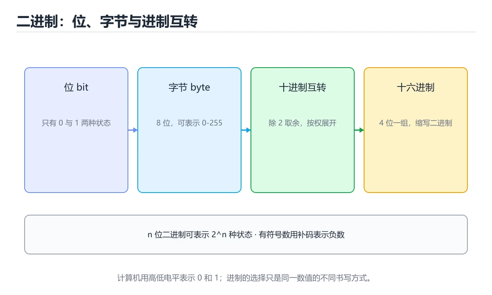

# 二进制与进制转换




> 内容更新时间：2026-10-06 · 学习阶段：基础 · 预计用时：50 分钟

## 本节知识框架

**课程定位**：所属分类 `fundamentals`（计算机基础），课程主题 `二进制与进制转换`，学习阶段 基础，建议用时 50 分钟。

本课主线：位与字节、二进制互转，以及补码表示负数。

**学完本课应当能够**
- 说清 `补码` 与 `进制转换` 的含义与区别，并各举一个正例和一个反例。
- 用本课示例验证 `位运算` 的行为，记录输入、输出与失败条件。
- 遇到「把补码符号位当成普通数值位」这类问题时，能说出触发条件与修复顺序。

### 从概念到验证的学习链条

1. `补码`：先掌握 表示负数时使用补码：正数取反加一得到对应的负数，再用它解释 `进制转换` 为什么会出现。
2. `进制转换`：先掌握 二进制、八进制、十六进制与十进制之间的换算，十六进制只是二进制的紧凑写法，再用它解释 `位运算` 为什么会出现。
3. `位运算`：先掌握 与、或、异或、取反与移位，直接操作二进制位，常用于掩码、压缩与协议解析，再用它解释 `溢出` 为什么会出现。
4. `溢出`：先掌握 定点整数超出表示范围后的行为，无符号数会回绕，有符号数在 C 里属于未定义行为，再用它解释 本课示例的观察结果 为什么会出现。

**先修与衔接**：本课是「计算机基础」分类的第 3 课。相关或后续课程：《CPU 工作原理》。

### 完成判据

- **定义关**：不看正文也能说明 `补码` 是 表示负数时使用补码：正数取反加一得到对应的负数，并指出一个反例。
- **机制关**：能按“输入 → 转换 → 输出 → 验证”复述 `二进制与进制转换`，而不是只背结论。
- **示例关**：能运行或推演 `二进制与进制转换` 的 `python` 示例，并说明一个真实出现的标识符或字面量。
- **证据关**：能指出 `二进制与进制转换` 示例里的 调用了 `bool()`，并说明它支持或反驳了本课的哪一条结论。
- **排错关**：能复现 把补码符号位当成普通数值位，记录现象并按 最高位是权值为 -2ⁿ⁻¹ 的符号位 修复。
- **迁移关**：能把 `二进制`、`bit`、`byte`、`进制` 放进一个与 `二进制与进制转换` 不同的项目场景，并保持输入与验证条件可追踪。
- **复盘关**：学完 `二进制与进制转换` 后，用一句话写下仍然不确定的结论，并列出下一次验证需要的输入、环境和成功判据。

### 复习清单

- [ ] 能不看正文复述本课核心术语，并指出一个边界或反例。
- [ ] 能运行或推演本课示例，记录输入、输出与失败现象。
- [ ] 能完成一次自测，并把错题对照错误表定位原因。

## 核心概念定义

| 术语 | 操作性定义 | 常见边界与风险 |
| --- | --- | --- |
| 补码 | 表示负数时使用补码：正数取反加一得到对应的负数。 | 易错：数值算错；正确做法是最高位是权值为 -2ⁿ⁻¹ 的符号位。 |
| 进制转换 | 二进制、八进制、十六进制与十进制之间的换算，十六进制只是二进制的紧凑写法。 | 换编码、换字节序或换平台都可能改变结果，处理前先固定输入编码。 |
| 位运算 | 与、或、异或、取反与移位，直接操作二进制位，常用于掩码、压缩与协议解析。 | 易错：语义错误；正确做法是浮点遵循 IEEE 754，不是补码。 |
| 溢出 | 定点整数超出表示范围后的行为，无符号数会回绕，有符号数在 C 里属于未定义行为。 | 易错：结果回绕或未定义；正确做法是明确类型范围并做边界检查。 |

## 原理与运行机制

### 机制总览

**教材衔接：为什么计算机只用 0 和 1**

计算机由晶体管构成，晶体管最容易稳定区分两种状态：通电 / 断电。用两种状态编码信息，抗干扰能力强、电路实现简单，这就是二进制的物理基础。

**教材衔接：位与字节**

- **bit（位）**：一个 0 或 1，最小信息单位。
- **Byte（字节）**：8 个 bit，例如 `10110010`。
- 常见换算：`1 KB = 1024 B`、`1 MB = 1024 KB`、`1 GB = 1024 MB`。

**教材衔接：进制转换速查**

| 十进制 | 二进制 | 八进制 | 十六进制 |
| --- | --- | --- | --- |
| 0 | 0 | 0 | 0 |
| 5 | 101 | 5 | 5 |
| 8 | 1000 | 10 | 8 |
| 10 | 1010 | 12 | A |
| 15 | 1111 | 17 | F |
| 16 | 10000 | 20 | 10 |
| 255 | 11111111 | 377 | FF |
| 1024 | 10000000000 | 2000 | 400 |

进制转换方法：

| 方向 | 方法 |
| --- | --- |
| 十转二 | 不断除以 2 取余数，逆序读出 |
| 二转十 | 按位乘以 2 的幂次求和 |
| 二转十六 | 每 4 位一组（不足补 0）直接查表 |
| 二转八 | 每 3 位一组 |
| 十六转二 | 每位展开成 4 位 |

**教材衔接：补充：位运算技巧、补码与浮点结构**

### 六个位运算的用途

| 运算 | 符号 | 典型用途 |
| --- | --- | --- |
| 与 | `&` | 取位、判断奇偶、掩码 |
| 或 | `\|` | 置位、合并标志 |
| 异或 | `^` | 翻转位、找唯一出现一次的数 |
| 取反 | `~` | 构造掩码 |
| 左移 | `<<` | 乘 2ⁿ、构造标志位 |
| 右移 | `>>` | 除 2ⁿ（有符号保留符号位） |

```python
FLAG_READ, FLAG_WRITE, FLAG_EXEC = 1 << 0, 1 << 1, 1 << 2

perm = FLAG_READ | FLAG_WRITE      # 置位：0b011 = 3
has_write = bool(perm & FLAG_WRITE)     # 取位
perm &= ~FLAG_WRITE                     # 清位
perm ^= FLAG_EXEC                       # 翻转位

# 经典技巧：找出唯一出现一次的数字（其余都出现两次）
def single_number(nums):
    result = 0
    for n in nums:
        result ^= n
    return result
```

### 补码：为什么负数这样表示

```text
8 位有符号整数（补码）
  0  → 0000 0000
  1  → 0000 0001
  -1 → 1111 1111
 -128→ 1000 0000

规则：负数的绝对值取反加一
  -5 = ~(0000 0101) + 1 = 1111 1011

好处
  · 加法与减法用同一套电路（a - b = a + (~b + 1)）
  · 只有一个 0（反码会有 +0 与 -0）
  · 范围不对称：-128 ~ 127
```

```text
溢出示例（8 位）
  127 + 1 = 1000 0000 = -128   ← 有符号溢出（未定义行为）
  255 + 1 = 0000 0000 = 0      ← 无符号回绕（定义明确）
```

### 字节序：大端与小端

```text
数值 0x12345678 在内存中的两种排布

大端（Big-endian，网络字节序）
  低地址 [12][34][56][78] 高地址

小端（Little-endian，x86/ARM 常见）
  低地址 [78][56][34][12] 高地址
```

| 场景 | 结论 |
| --- | --- |
| 网络传输 | 统一用大端（htonl / htons 转换） |
| 读写二进制文件 | 显式指定字节序，别依赖平台 |
| 跨语言通信 | 在协议里写清字节序 |

### IEEE 754 浮点数的结构

```text
32 位单精度：1 位符号 | 8 位指数 | 23 位尾数
64 位双精度：1 位符号 | 11 位指数 | 52 位尾数

关键事实
  · 指数有偏移量（单精度 +127），便于比较大小
  · 尾数隐含前导 1，因此有效位数比字段多一位
  · 特殊值：+0/-0、±Inf、NaN（指数全 1）
  · 因此 0.1 无法精确表示，累加会出现误差
```

```python
import struct

bits = struct.unpack('>I', struct.pack('>f', 0.1))[0]
print(f"{bits:032b}")
# 00111101110011001100110011001101 —— 尾数是近似值
```

### 进制转换的三种写法

| 目标 | 内置写法 | 手写思路 |
| --- | --- | --- |
| 十进制 → 二进制 | `bin(n)` | 反复除 2 取余再倒序 |
| 十进制 → 十六进制 | `hex(n)` | 每 4 位一组（8421 法） |
| 任意进制 → 十进制 | `int(s, base)` | 按位累加：`acc * base + digit` |

```python
def to_base(n: int, base: int) -> str:
    digits = "0123456789abcdef"
    if n == 0:
        return "0"
    out = []
    while n:
        out.append(digits[n % base])
        n //= base
    return "".join(reversed(out))
```

### 自查清单

- [ ] 能用位运算实现置位、清位、取位
- [ ] 会手算补码并解释为什么负数取反加一
- [ ] 知道大小端差异及网络字节序约定
- [ ] 能说出浮点数的三部分结构与误差来源
- [ ] 能手写任意进制转换

### 机制拆解：每一步的输入、动作与输出

#### 1. `补码`
- 输入：`二进制`；本步把 表示负数时使用补码：正数取反加一得到对应的负数 当作判断规则。
- 动作：围绕 `补码` 保留中间状态，并记录它与 `进制转换` 的对应关系。
- 输出：`进制转换`，它可以被下一段代码、测试或记录继续使用。
- `补码` 的失败条件：当把补码符号位当成普通数值位时，会出现数值算错。

#### 2. `进制转换`
- 输入：`补码`；本步把 二进制、八进制、十六进制与十进制之间的换算，十六进制只是二进制的紧凑写法 当作判断规则。
- 动作：围绕 `进制转换` 保留中间状态，并记录它与 `位运算` 的对应关系。
- 输出：`位运算`，它可以被下一段代码、测试或记录继续使用。
- `进制转换` 的失败条件：换编码、换字节序或换平台都可能改变结果，处理前先固定输入编码。

#### 3. `位运算`
- 输入：`进制转换`；本步把 与、或、异或、取反与移位，直接操作二进制位，常用于掩码、压缩与协议解析 当作判断规则。
- 动作：围绕 `位运算` 保留中间状态，并记录它与 `溢出` 的对应关系。
- 输出：`溢出`，它可以被下一段代码、测试或记录继续使用。
- `位运算` 的失败条件：当浮点数用位运算处理时，会出现语义错误。

#### 4. `溢出`
- 输入：`位运算`；本步把 定点整数超出表示范围后的行为，无符号数会回绕，有符号数在 C 里属于未定义行为 当作判断规则。
- 动作：围绕 `溢出` 保留中间状态，并记录它与 `bool` 的对应关系。
- 输出：`bool`，它可以被下一段代码、测试或记录继续使用。
- `溢出` 的失败条件：当忘记整数溢出时，会出现结果回绕或未定义。

### 示例中的可观察事实

1. 调用了 `bool()`；它对应的课程主题是 `二进制与进制转换`。
2. 调用了 `single_number()`；它对应的课程主题是 `二进制与进制转换`。

### 复现实验记录

- 环境：`二进制与进制转换` 使用 `python` 示例，固定 `二进制`、`bit`、`byte`、`进制` 作为第一组条件。
- 首轮输入：先确认 调用了 `bool()`，预测 `补码` 会怎样变化。
- 基线观察：记录命令、输入、输出和错误原文，不用截图代替可复制的文本。
- 单变量修改：只改变 `二进制`，观察 `溢出` 是否仍满足定义。
- 失败注入：复现 把补码符号位当成普通数值位，确认现象是 数值算错。
- 记录结论：把“修改前、修改后、预期变化、实际变化”写成四列表，这样复盘 `二进制与进制转换` 时才能区分概念错误与实现错误。

## 典型应用场景

- **把补码符号位当成普通数值位**：典型现象是数值算错；正确做法是最高位是权值为 -2ⁿ⁻¹ 的符号位。
- **认为 8 位能表示 0 到 255 的有符号数**：典型现象是范围判断错误；正确做法是有符号是 -128 到 127。
- **忘记整数溢出**：典型现象是结果回绕或未定义；正确做法是明确类型范围并做边界检查。
- **用 `>>` 处理负数期望逻辑右移**：典型现象是结果错误；正确做法是用无符号类型或无符号右移。

### 最小验证场景

- 准备：保留 `python` 示例的原始输入，先记录 `二进制与进制转换` 的基线输出和完整运行命令。
- 观察：先核对 调用了 `bool()`，再改变一个与 `补码` 相关的条件。
- 判定：新结果与 `二进制与进制转换` 的基线不同不等于错误；只有当差异破坏了 `补码` 的定义或错误表中的约束，才判定为失败。

### 选择与边界

- 使用 `补码` 时，先满足它的定义：表示负数时使用补码：正数取反加一得到对应的负数；易错：数值算错；正确做法是最高位是权值为 -2ⁿ⁻¹ 的符号位。
- 使用 `进制转换` 时，先满足它的定义：二进制、八进制、十六进制与十进制之间的换算，十六进制只是二进制的紧凑写法；换编码、换字节序或换平台都可能改变结果，处理前先固定输入编码。
- 使用 `位运算` 时，先满足它的定义：与、或、异或、取反与移位，直接操作二进制位，常用于掩码、压缩与协议解析；易错：语义错误；正确做法是浮点遵循 IEEE 754，不是补码。
- 使用 `溢出` 时，先满足它的定义：定点整数超出表示范围后的行为，无符号数会回绕，有符号数在 C 里属于未定义行为；易错：结果回绕或未定义；正确做法是明确类型范围并做边界检查。

## 代码/协议/SQL 示例

### 最小可验证示例

```text
13 / 2 = 6 ... 1
 6 / 2 = 3 ... 0
 3 / 2 = 1 ... 1
 1 / 2 = 0 ... 1

从下往上读：1101
```

**教材衔接：二进制与十进制互转**

十进制转二进制用「除 2 取余，逆序排列」：

二进制转十进制按权重相加：

```text
1101 = 1×2³ + 1×2² + 0×2¹ + 1×2⁰
     = 8 + 4 + 1
     = 13
```

用 Python 验证：

```python
print(bin(13))        # 0b1101
print(int("1101", 2)) # 13
print(hex(255))       # 0xff
```

**教材衔接：常见的十六进制**

十六进制每位对应 4 个二进制位，书写更短，常用于颜色值、内存地址和字节数据。

```text
1111 1111  ->  F F
0xFF = 255
```

**教材衔接：有符号数与补码（进阶）**

8 位无符号数范围是 `0 ~ 255`。表示负数时使用**补码**：正数取反加一得到对应的负数。

```text
 5 = 0000 0101
-5 = 1111 1011   (取反 1111 1010，再加 1)
```

补码的好处是：减法可以复用加法电路，`5 + (-5) = 0` 自然成立。

**教材衔接：位运算与补码速查**

| 概念 | 说明 |
| --- | --- |
| 无符号数 | 全部位表示数值，n 位范围 0 到 2ⁿ-1 |
| 有符号补码 | 最高位为符号位，n 位范围 -2ⁿ⁻¹ 到 2ⁿ⁻¹-1 |
| 取相反数 | 按位取反再加 1（`-x = ~x + 1`） |
| 溢出 | 有符号溢出在 C/C++ 是未定义行为，在 Java 会回绕 |
| 位运算 | `&` 与、`\|` 或、`^` 异或、`~` 取反、`<<` 左移、`>>` 右移 |

```python
# Python：整数无固定位宽，需要掩码时显式限制
def to_twos_complement(value: int, bits: int = 8) -> int:
    """把有符号数转成 bits 位补码表示的无符号值。"""
    return value & ((1 << bits) - 1)

def from_twos_complement(raw: int, bits: int = 8) -> int:
    """把 bits 位补码还原成有符号整数。"""
    sign_bit = 1 << (bits - 1)
    return raw - (1 << bits) if raw & sign_bit else raw

assert to_twos_complement(-5) == 251          # 11111011
assert from_twos_complement(251) == -5
assert bin(0xFF) == "0b11111111"
assert int("1101", 2) == 13
assert hex(255) == "0xff"
```

**教材衔接：深挖「二进制」的边界与代价**

### 一、二进制 的关键句与适用条件

| 正文出处 | 原句 | 用之前先确认 |
| --- | --- | --- |
| 为什么计算机只用 0 和 1 | 用两种状态编码信息，抗干扰能力强、电路实现简单，这就是二进制的物理基础。 | 把 二进制 换成边界值时，这一步是否仍然成立 |
| 位与字节 | bit（位）：一个 0 或 1，最小信息单位。 | 把 bit 换成边界值时，这一步是否仍然成立 |
| 位与字节 | Byte（字节）：8 个 bit，例如 10110010。 | 把 bit 换成边界值时，这一步是否仍然成立 |
| 常见的十六进制 | 十六进制每位对应 4 个二进制位，书写更短，常用于颜色值、内存地址和字节数据。 | 把 二进制 换成边界值时，这一步是否仍然成立 |
| 有符号数与补码（进阶） | 表示负数时使用补码：正数取反加一得到对应的负数。 | 把 补码 换成边界值时，这一步是否仍然成立 |

### 二、把 二进制与进制转换 推到边界

下面是本课第一段代码（text），先原样运行一次作为基线：

| 变式 | 怎么改 | 先写下什么 | 观察点 |
| --- | --- | --- | --- |
| 边界输入 | 把 二进制与进制转换 的输入换成空值或最大值 | 预测输出 | 是否报错、是否静默返回 |
| 只改一处 | 把 二进制与进制转换 的一个参数改成另一档 | 预测差异来源 | 输出变化能否用本课结论解释 |
| 去掉一步 | 注释掉 二进制与进制转换 之后的一行 | 预测哪一步先失败 | 错误位置是否与预期一致 |


### 四、测验复盘

| 题号 | 正确答案 | 最容易选错的干扰项 | 复盘动作 |
| --- | --- | --- | --- |
| 1 | 学习 二进制 时要同时说明输入、输出和失败路径，不能只看正常流程 | 把 bit 的单次运行结果当成所有版本和规模都成立 | 把干扰项改写成一句反例，再说明它违反本课哪条前提 |
| 2 | 8 | 16 | 把干扰项改写成一句反例，再说明它违反本课哪条前提 |
| 3 | 1111 1011 | 0000 0101 | 把干扰项改写成一句反例，再说明它违反本课哪条前提 |
| 4 | 31 | 15 | 把干扰项改写成一句反例，再说明它违反本课哪条前提 |
| 5 | 这段代码包含条件分支，不同输入会走不同的执行路径。 | 这段代码包含循环结构，同一段逻辑会被重复执行。 | 把干扰项改写成一句反例，再说明它违反本课哪条前提 |
| 6 | 0 | （无干扰项） | 把干扰项改写成一句反例，再说明它违反本课哪条前提 |

### 五、离开本课前的自检

**运行方式**：运行 `二进制与进制转换` 的示例时，保存为 `.py` 文件后用 `python 文件名.py` 运行；第三方依赖先在虚拟环境里安装。

### 示例精读：先找证据，再改一个条件

1. 调用了 `bool()`；它出现在 `二进制与进制转换` 的示例中，阅读时先确认它前后各发生了什么。
2. 调用了 `single_number()`；它出现在 `二进制与进制转换` 的示例中，阅读时先确认它前后各发生了什么。
- 在 `二进制与进制转换` 中与 `补码` 对照：示例必须能支持 表示负数时使用补码：正数取反加一得到对应的负数，否则说明这一段还缺少实现或验证步骤。
- 在 `二进制与进制转换` 中与 `进制转换` 对照：示例必须能支持 二进制、八进制、十六进制与十进制之间的换算，十六进制只是二进制的紧凑写法，否则说明这一段还缺少实现或验证步骤。
- 在 `二进制与进制转换` 中与 `位运算` 对照：示例必须能支持 与、或、异或、取反与移位，直接操作二进制位，常用于掩码、压缩与协议解析，否则说明这一段还缺少实现或验证步骤。
- 在 `二进制与进制转换` 中与 `溢出` 对照：示例必须能支持 定点整数超出表示范围后的行为，无符号数会回绕，有符号数在 C 里属于未定义行为，否则说明这一段还缺少实现或验证步骤。

## 时间/空间复杂度或性能分析

**性能关注点（二进制与进制转换）**：关注资源换算与精度损失：记录单位换算误差、存储空间与实际耗时。

**本课特有开销（二进制与进制转换 · 二进制）**：小文件看元数据开销，大文件看吞吐，两者要分别测量。

**测量方法**：以 `二进制与进制转换` 的 `二进制` 场景为对象，固定输入跑一遍记录基线，再把规模或并发度提高一个数量级复测；两次结果的差值与波动范围才是结论依据。

### 需要控制的变量与记录项

- `二进制与进制转换` 的 `二进制`：固定它的版本、输入范围和资源上限，分别记录速度、内存与失败率的变化。
- `二进制与进制转换` 的 `bit`：固定它的版本、输入范围和资源上限，分别记录速度、内存与失败率的变化。
- `二进制与进制转换` 的 `byte`：固定它的版本、输入范围和资源上限，分别记录速度、内存与失败率的变化。
- `二进制与进制转换` 的 `进制`：固定它的版本、输入范围和资源上限，分别记录速度、内存与失败率的变化。
- `二进制与进制转换` 的 `补码`：固定它的版本、输入范围和资源上限，分别记录速度、内存与失败率的变化。
- `二进制与进制转换` 中 `补码` 的边界：易错：数值算错；正确做法是最高位是权值为 -2ⁿ⁻¹ 的符号位。达到边界时不要外推，必须重新测量。
- `二进制与进制转换` 中 `进制转换` 的边界：换编码、换字节序或换平台都可能改变结果，处理前先固定输入编码。达到边界时不要外推，必须重新测量。
- `二进制与进制转换` 中 `位运算` 的边界：易错：语义错误；正确做法是浮点遵循 IEEE 754，不是补码。达到边界时不要外推，必须重新测量。
- `二进制与进制转换` 中 `溢出` 的边界：易错：结果回绕或未定义；正确做法是明确类型范围并做边界检查。达到边界时不要外推，必须重新测量。
- `二进制与进制转换` 的代码证据：先验证 调用了 `bool()`，再记录该路径的输入规模与耗时；只看代码行数不能推出复杂度。

## 常见误区与易错点

| 容易写错的做法 | 实际现象 | 原因与正确做法 |
| --- | --- | --- |
| 把补码符号位当成普通数值位 | 数值算错 | 最高位是权值为 -2ⁿ⁻¹ 的符号位 |
| 认为 8 位能表示 0 到 255 的有符号数 | 范围判断错误 | 有符号是 -128 到 127 |
| 忘记整数溢出 | 结果回绕或未定义 | 明确类型范围并做边界检查 |
| 用 `>>` 处理负数期望逻辑右移 | 结果错误 | 用无符号类型或无符号右移 |
| 十六进制与二进制混合计算时位数对不齐 | 结果错误 | 先补齐到 4 的整数倍 |
| 浮点数用位运算处理 | 语义错误 | 浮点遵循 IEEE 754，不是补码 |
| 认为 1 KB = 1000 字节 | 存储换算错误 | 1 KiB = 1024 字节，1 KB 通常指 1000 |
| 位运算不加括号 | 优先级错误 | `(x & 0xFF) == 0xFF` |
| 用十进制字符串当二进制解析 | 结果错 | 明确基数，如 `int(s, 2)` |
| 忽略大小端差异 | 跨平台数据错乱 | 协议中明确字节序并统一转换 |

### 现场 1：把补码符号位当成普通数值位

**症状**：数值算错。

**根因与修复**：最高位是权值为 -2ⁿ⁻¹ 的符号位。

**自检**：在本课示例里复现「把补码符号位当成普通数值位」，改成最高位是权值为 -2ⁿ⁻¹ 的符号位后重跑；如果症状消失且失败路径按预期变化，说明定位正确。

### 现场 2：认为 8 位能表示 0 到 255 的有符号数

**症状**：范围判断错误。

**根因与修复**：有符号是 -128 到 127。

**自检**：在本课示例里复现「认为 8 位能表示 0 到 255 的有符号数」，改成有符号是 -128 到 127后重跑；如果症状消失且失败路径按预期变化，说明定位正确。

### 现场 3：忘记整数溢出

**症状**：结果回绕或未定义。

**根因与修复**：明确类型范围并做边界检查。

**自检**：在本课示例里复现「忘记整数溢出」，改成明确类型范围并做边界检查后重跑；如果症状消失且失败路径按预期变化，说明定位正确。

### 现场 4：用 `>>` 处理负数期望逻辑右移

**症状**：结果错误。

**根因与修复**：用无符号类型或无符号右移。

**自检**：在本课示例里复现「用 `>>` 处理负数期望逻辑右移」，改成用无符号类型或无符号右移后重跑；如果症状消失且失败路径按预期变化，说明定位正确。

### 现场 5：十六进制与二进制混合计算时位数对不齐

**症状**：结果错误。

**根因与修复**：先补齐到 4 的整数倍。

**自检**：在本课示例里复现「十六进制与二进制混合计算时位数对不齐」，改成先补齐到 4 的整数倍后重跑；如果症状消失且失败路径按预期变化，说明定位正确。

### 现场 6：浮点数用位运算处理

**症状**：语义错误。

**根因与修复**：浮点遵循 IEEE 754，不是补码。

**自检**：在本课示例里复现「浮点数用位运算处理」，改成浮点遵循 IEEE 754，不是补码后重跑；如果症状消失且失败路径按预期变化，说明定位正确。

### 现场 7：认为 1 KB = 1000 字节

**症状**：存储换算错误。

**根因与修复**：1 KiB = 1024 字节，1 KB 通常指 1000。

**自检**：在本课示例里复现「认为 1 KB = 1000 字节」，改成1 KiB = 1024 字节，1 KB 通常指 1000后重跑；如果症状消失且失败路径按预期变化，说明定位正确。

### 现场 8：位运算不加括号

**症状**：优先级错误。

**根因与修复**：`(x & 0xFF) == 0xFF`。

**自检**：在本课示例里复现「位运算不加括号」，改成`(x & 0xFF) == 0xFF`后重跑；如果症状消失且失败路径按预期变化，说明定位正确。

### 现场 9：用十进制字符串当二进制解析

**症状**：结果错。

**根因与修复**：明确基数，如 `int(s, 2)`。

**自检**：在本课示例里复现「用十进制字符串当二进制解析」，改成明确基数，如 `int(s, 2)`后重跑；如果症状消失且失败路径按预期变化，说明定位正确。

## 与其他知识点的关系

- **相关或后续**：`CPU 工作原理`。本课术语会在这些课程里继续使用。
- **术语归属**：`补码`、`进制转换`、`位运算` 的定义以本课「核心概念定义」为准，换到其他课程时先确认定义是否被改写。

### 先修与后续术语接口

- `CPU 工作原理`：两者通过本分类的学习顺序衔接，阅读时重点比较各自的输入与失败条件。

### 容易混淆的相邻概念

- `补码` 与 `进制转换`：前者强调 表示负数时使用补码：正数取反加一得到对应的负数；后者强调 二进制、八进制、十六进制与十进制之间的换算，十六进制只是二进制的紧凑写法。判断时分别检查两条定义的适用范围，不要只看名称相似就互换。
- `进制转换` 与 `位运算`：前者强调 二进制、八进制、十六进制与十进制之间的换算，十六进制只是二进制的紧凑写法；后者强调 与、或、异或、取反与移位，直接操作二进制位，常用于掩码、压缩与协议解析。判断时分别检查两条定义的适用范围，不要只看名称相似就互换。
- `位运算` 与 `溢出`：前者强调 与、或、异或、取反与移位，直接操作二进制位，常用于掩码、压缩与协议解析；后者强调 定点整数超出表示范围后的行为，无符号数会回绕，有符号数在 C 里属于未定义行为。判断时分别检查两条定义的适用范围，不要只看名称相似就互换。

## 自测题与参考答案

> 先独立作答，再对照参考答案；答案都能在本课正文、术语表或错误表里找到依据。

### 自测 1（概念复述）

不看正文，写出 `补码` 的操作性定义，并说明它与 `进制转换` 的区别。

**参考答案**：表示负数时使用补码：正数取反加一得到对应的负数。

`进制转换` 的定位是：二进制、八进制、十六进制与十进制之间的换算，十六进制只是二进制的紧凑写法；两者的差别要从适用对象与失败模式上说明。

### 自测 2（排错）

本课错误表记录了「把补码符号位当成普通数值位」这类做法。请写出它会出现的现象、根因，以及修复顺序。

**参考答案**：现象是数值算错；正确做法是最高位是权值为 -2ⁿ⁻¹ 的符号位。修复时先复现现象并保留证据，再改动一处假设重跑，确认现象消失。

### 自测 3（动手验证）

运行本课的 `python` 示例，把其中的 `1` 换成一个边界值后重新运行，记录输出与错误信息。

**参考答案**：正常输入下 `python` 示例应当复现正文给出的结果；把 `1` 换成边界值后，如果结果改变或报错，先核对它是否满足 `二进制与进制转换` 中`补码` 的适用范围，再检查错误表里是否有同类现象。

### 自测 4（代码阅读）

阅读本课开头的 `python` 示例，说明它体现了`补码` 的哪一条性质，并指出改动哪个输入会让这条性质不再成立。

**参考答案**：`补码` 的定义是 表示负数时使用补码：正数取反加一得到对应的负数，示例正是在实现这条定义。改动与 `补码` 有关的一个输入后，如果结果不再符合 `二进制与进制转换` 的正文描述，就说明该性质只在当前前提成立。

### 自测 5（迁移）

把 `二进制与进制转换` 的方法迁移到自己的项目：围绕 `补码` 写出一个与错误表同类的风险点，并说明触发条件和检验方式。

**参考答案**：例如「忽略大小端差异」，它会导致跨平台数据错乱；检验方式是按协议中明确字节序并统一转换改一处再复现，确认现象消失且没有引入新的失败分支。

### 自测 6（对比）

用一个表格对比 `补码` 与 `进制转换`：各写一行适用场景、一行失败表现。

**参考答案**：`补码` 的定义是表示负数时使用补码：正数取反加一得到对应的负数；`进制转换` 的定义是二进制、八进制、十六进制与十进制之间的换算，十六进制只是二进制的紧凑写法。两者的失败表现分别对应本课错误表里与本术语相关的行。

### 自测 7（排错顺序）

面对「把补码符号位当成普通数值位」引发的问题，请把“复现 数值算错 → 保留证据 → 最高位是权值为 -2ⁿ⁻¹ 的符号位 → 回归验证”四步写成可执行的检查清单。

**参考答案**：第一步按数值算错复现；第二步记录输入、版本与完整报错；第三步按最高位是权值为 -2ⁿ⁻¹ 的符号位只改一处；第四步重跑并确认失败路径也按预期变化。

### 自测 8（边界判断）

针对 `溢出`，分别写出“可以使用”的条件和“结论不再成立”的条件。

**参考答案**：易错：结果回绕或未定义；正确做法是明确类型范围并做边界检查。 同时要把 `溢出` 的定义 定点整数超出表示范围后的行为，无符号数会回绕，有符号数在 C 里属于未定义行为 与实际输入逐项对照。

### 自测 9（机制重建）

不看正文，按输入、转换、输出、验证四段重建 `补码` → `进制转换` → `位运算` → `溢出` 的作用链。

**参考答案**：起点是 `补码` 的定义 表示负数时使用补码：正数取反加一得到对应的负数；中间每一步都保留可观察状态；终点由 `溢出` 检查，失败时回到错误表定位第一个偏离定义的步骤。

### 自测 10（综合排错）

在 `二进制与进制转换` 中，现象是 跨平台数据错乱。请围绕 忽略大小端差异 写出最小复现、关键证据、修复动作和回归验证，并说明为什么不能只凭一次运行下结论。

**参考答案**：先复现 忽略大小端差异，记录输入与完整错误；再按 协议中明确字节序并统一转换 只改一处。回归时同时跑正常路径和边界路径，只有两次结果都可解释，才把修复视为完成。

### 自测 11（一分钟复述）

用每分钟约 200 字的速度复述 `二进制与进制转换`：先给主问题，再按顺序说出 `补码`、`进制转换`、`位运算`、`溢出`，最后给一个失败案例。

**自评标准**：主问题必须对应 位与字节、二进制互转，以及补码表示负数；每个术语都要能接上一句定义或边界；失败案例必须写成可观察现象，不能用“可能有风险”代替证据。

## 术语速查

| 术语 | 一句话说明 |
| --- | --- |
| `补码` | 表示负数时使用补码：正数取反加一得到对应的负数。 |
| `进制转换` | 二进制、八进制、十六进制与十进制之间的换算，十六进制只是二进制的紧凑写法。 |
| `位运算` | 与、或、异或、取反与移位，直接操作二进制位，常用于掩码、压缩与协议解析。 |
| `溢出` | 定点整数超出表示范围后的行为，无符号数会回绕，有符号数在 C 里属于未定义行为。 |

**术语关系**：`补码`（表示负数时使用补码：正数取反加一得到对应的负数） → `进制转换`（二进制、八进制、十六进制与十进制之间的换算） → `位运算`（与、或、异或、取反与移位） → `溢出`（定点整数超出表示范围后的行为）。

## 考点精讲

`二进制与进制转换` 的题库有 6 道题，下面逐题给出题干、正确项与判断依据：先自己作答，再核对正确项，最后回到正文对应小节复核。

### 考点 1：第 1 题

- **题目**：围绕“二进制与进制转换”中的 二进制、bit、byte，下列哪两项是本课强调的实践判断？
- **正确项**：学习 二进制 时要同时说明输入、输出和失败路径，不能只看正常流程；验证 bit 时要固定版本并覆盖边界输入，结论才可复现
- **判断依据**：这道题落在术语 `进制转换` 上：二进制、八进制、十六进制与十进制之间的换算，十六进制只是二进制的紧凑写法。复习时把 `进制转换` 的定义、适用边界和一个反例一起说清楚，再回到「核心概念定义」核对原文。

### 考点 2：第 2 题

- **题目**：1 Byte 等于多少 bit？
- **正确项**：8
- **判断依据**：这道题检验本课主问题：位与字节、二进制互转，以及补码表示负数。复习时先复述本课主问题，再举一个会让结论失效的输入。

### 考点 3：第 3 题

- **题目**：十进制 -5 的 8 位补码表示是什么？
- **正确项**：1111 1011
- **判断依据**：这道题落在术语 `补码` 上：表示负数时使用补码：正数取反加一得到对应的负数。复习时把 `补码` 的定义、适用边界和一个反例一起说清楚，再回到「核心概念定义」核对原文。

### 考点 4：第 4 题

- **题目**：十六进制 0x1F 转换成十进制是？
- **正确项**：31
- **判断依据**：这道题检验本课主问题：位与字节、二进制互转，以及补码表示负数。复习时先复述本课主问题，再举一个会让结论失效的输入。

### 考点 5：第 5 题

- **题目**：代码语言为 `python`，选自 `二进制与进制转换` 的 `补码` 部分。课程问题为位与字节、二进制互转，以及补码表示负数。哪一项描述与代码一致？
- **正确项**：调用了 `single_number()`
- **判断依据**：这道题落在术语 `补码` 上：表示负数时使用补码：正数取反加一得到对应的负数。复习时把 `补码` 的定义、适用边界和一个反例一起说清楚，再回到「核心概念定义」核对原文。

### 考点 6：第 6 题

- **题目**：填空：补齐下面这段术语说明中的空缺。课程 `位与字节、二进制互转，以及补码表示负数。`，这段说明是：`____`：定点整数超出表示范围后的行为，无符号数会回绕，有符号数在 C 里属于未定义行为。空缺处应填哪个术语？
- **正确项**：溢出
- **判断依据**：这道题落在术语 `补码` 上：表示负数时使用补码：正数取反加一得到对应的负数。复习时把 `补码` 的定义、适用边界和一个反例一起说清楚，再回到「核心概念定义」核对原文。

### 考点 7：`补码`

- **要点**：表示负数时使用补码：正数取反加一得到对应的负数。
- **补码 的边界**：易错：数值算错；正确做法是最高位是权值为 -2ⁿ⁻¹ 的符号位。

### 考点 8：`进制转换`

- **要点**：二进制、八进制、十六进制与十进制之间的换算，十六进制只是二进制的紧凑写法。
- **进制转换 的边界**：换编码、换字节序或换平台都可能改变结果，处理前先固定输入编码。

### 考点 9：`位运算`

- **要点**：与、或、异或、取反与移位，直接操作二进制位，常用于掩码、压缩与协议解析。
- **位运算 的边界**：易错：语义错误；正确做法是浮点遵循 IEEE 754，不是补码。

### 考点 10：`溢出`

- **要点**：定点整数超出表示范围后的行为，无符号数会回绕，有符号数在 C 里属于未定义行为。
- **溢出 的边界**：易错：结果回绕或未定义；正确做法是明确类型范围并做边界检查。

### 考点 11：排错——把补码符号位当成普通数值位

- **现象**：数值算错。
- **处理**：最高位是权值为 -2ⁿ⁻¹ 的符号位。

### 考点 12：排错——认为 8 位能表示 0 到 255 的有符号数

- **现象**：范围判断错误。
- **处理**：有符号是 -128 到 127。

### 考点 13：综合辨析——`补码` 与 `溢出`

- **辨析点**：`补码` 的定义是 表示负数时使用补码：正数取反加一得到对应的负数；`溢出` 的定义是 定点整数超出表示范围后的行为，无符号数会回绕，有符号数在 C 里属于未定义行为。
- **答题要求**：面对 `二进制与进制转换` 的题目，先判断描述的是 `补码` 还是 `溢出`，再归到对应定义，最后写出一个会让该定义失效的边界输入。

### 考点 14：排错评分点

- **现象分**：能写出 数值算错，而不是只写“程序有错”。
- **证据分**：保留触发 把补码符号位当成普通数值位 的输入、版本和错误原文。
- **修复分**：按 最高位是权值为 -2ⁿ⁻¹ 的符号位 只改一处，并同时回归正常路径与边界路径。

## 内容元数据

- 内容版本：v2.0
- 最后更新：2026-10-06
- 学习阶段：基础
- 适用环境：通用计算机体系结构知识
；本课聚焦 二进制。
- 内容来源：内置结构化课程与工程实践整理
- 相关主题：二进制、bit、byte、进制、补码、十六进制
- 质量版本：P0 测验标准 + P1 覆盖扩展 + P2 体验补全

## 参考资料与复核

- 最后复核：2026-10-04
- 下次复核：2027-03-17
- 复核范围：版本兼容、API 行为、安全建议与工程实践
- 来源性质：官方文档、标准或权威教材；本课核对关键词：二进制、bit、byte、进制、补码、十六进制。

| 参考资料 | 本课用途 |
| --- | --- |
| [NIST 二进制与数据表示](https://www.nist.gov/pml/owm/binary-information) | 二进制、位与数据单位 |
| [CS50 计算机科学导论](https://cs50.harvard.edu/x/) | 计算机科学综合入门 |
| [MDN 计算机基础](https://developer.mozilla.org/docs/Learn_web_development/Core) | Web 相关计算机基础 |

| [本课术语索引：二进制与进制转换](#核心概念定义) | 按本课输入、术语边界和错误表现逐项核对 |
> 「二进制与进制转换」的链接用于离线阅读后的延伸核对；App 不会自动联网。

<!-- p1-deep-dive:start -->