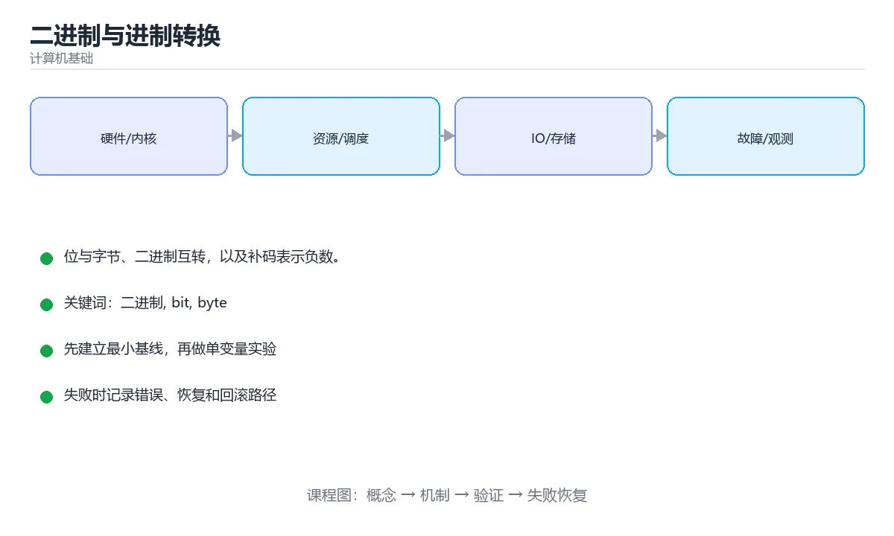

# 二进制与进制转换



> 内容更新时间：2026-10-03 · 学习阶段：基础 · 预计用时：12 分钟

## 学习目标

- 能用自己的话解释「二进制与进制转换」解决了什么问题，而不是只背术语。
- 能说清 「二进制」、「bit」、「byte」、「进制」 之间的关系，并分别举出一个例子。
- 能把本课知识放回「计算机基础」的知识体系，说明它和相邻主题的边界。
- 能完成本课练习，并用验收标准检查自己的结果。

> 一句话摘要：位与字节、二进制互转，以及补码表示负数。

## 前置知识

- 会进行基本的文件、命令行或浏览器操作；遇到不熟悉的术语先查本课关键词。
- 本课阶段：基础。建议会读写简单代码或命令，并理解变量、输入输出等基本概念。
- 开始前先复习：二进制、bit、byte。
- 如果某一步看不懂，先记录具体卡点，完成练习后再回头读一遍。


## 为什么计算机只用 0 和 1

计算机由晶体管构成，晶体管最容易稳定区分两种状态：通电 / 断电。用两种状态编码信息，抗干扰能力强、电路实现简单，这就是二进制的物理基础。

## 位与字节

- **bit（位）**：一个 0 或 1，最小信息单位。
- **Byte（字节）**：8 个 bit，例如 `10110010`。
- 常见换算：`1 KB = 1024 B`、`1 MB = 1024 KB`、`1 GB = 1024 MB`。

## 二进制与十进制互转

十进制转二进制用「除 2 取余，逆序排列」：

```text
13 / 2 = 6 ... 1
 6 / 2 = 3 ... 0
 3 / 2 = 1 ... 1
 1 / 2 = 0 ... 1

从下往上读：1101
```

二进制转十进制按权重相加：

```text
1101 = 1×2³ + 1×2² + 0×2¹ + 1×2⁰
     = 8 + 4 + 1
     = 13
```

用 Python 验证：

```python
print(bin(13))        # 0b1101
print(int("1101", 2)) # 13
print(hex(255))       # 0xff
```

## 常见的十六进制

十六进制每位对应 4 个二进制位，书写更短，常用于颜色值、内存地址和字节数据。

```text
1111 1111  ->  F F
0xFF = 255
```

## 有符号数与补码（进阶）

8 位无符号数范围是 `0 ~ 255`。表示负数时使用**补码**：正数取反加一得到对应的负数。

```text
 5 = 0000 0101
-5 = 1111 1011   (取反 1111 1010，再加 1)
```

补码的好处是：减法可以复用加法电路，`5 + (-5) = 0` 自然成立。

## 本课小结
进制只是同一数值的不同书写方式。理解位权与补码，是理解内存、字符编码和网络字节序的前提。

<!-- appendix:v1 -->

## 进制转换速查

| 十进制 | 二进制 | 八进制 | 十六进制 |
| --- | --- | --- | --- |
| 0 | 0 | 0 | 0 |
| 5 | 101 | 5 | 5 |
| 8 | 1000 | 10 | 8 |
| 10 | 1010 | 12 | A |
| 15 | 1111 | 17 | F |
| 16 | 10000 | 20 | 10 |
| 255 | 11111111 | 377 | FF |
| 1024 | 10000000000 | 2000 | 400 |

进制转换方法：

| 方向 | 方法 |
| --- | --- |
| 十转二 | 不断除以 2 取余数，逆序读出 |
| 二转十 | 按位乘以 2 的幂次求和 |
| 二转十六 | 每 4 位一组（不足补 0）直接查表 |
| 二转八 | 每 3 位一组 |
| 十六转二 | 每位展开成 4 位 |

## 位运算与补码速查

| 概念 | 说明 |
| --- | --- |
| 无符号数 | 全部位表示数值，n 位范围 0 到 2ⁿ-1 |
| 有符号补码 | 最高位为符号位，n 位范围 -2ⁿ⁻¹ 到 2ⁿ⁻¹-1 |
| 取相反数 | 按位取反再加 1（`-x = ~x + 1`） |
| 溢出 | 有符号溢出在 C/C++ 是未定义行为，在 Java 会回绕 |
| 位运算 | `&` 与、`\|` 或、`^` 异或、`~` 取反、`<<` 左移、`>>` 右移 |

```python
# Python：整数无固定位宽，需要掩码时显式限制
def to_twos_complement(value: int, bits: int = 8) -> int:
    """把有符号数转成 bits 位补码表示的无符号值。"""
    return value & ((1 << bits) - 1)


def from_twos_complement(raw: int, bits: int = 8) -> int:
    """把 bits 位补码还原成有符号整数。"""
    sign_bit = 1 << (bits - 1)
    return raw - (1 << bits) if raw & sign_bit else raw


assert to_twos_complement(-5) == 251          # 11111011
assert from_twos_complement(251) == -5
assert bin(0xFF) == "0b11111111"
assert int("1101", 2) == 13
assert hex(255) == "0xff"
```

## 常见错误对照表

| 容易写错的做法 | 实际现象 | 原因与正确做法 |
| --- | --- | --- |
| 把补码符号位当成普通数值位 | 数值算错 | 最高位是权值为 -2ⁿ⁻¹ 的符号位 |
| 认为 8 位能表示 0 到 255 的有符号数 | 范围判断错误 | 有符号是 -128 到 127 |
| 忘记整数溢出 | 结果回绕或未定义 | 明确类型范围并做边界检查 |
| 用 `>>` 处理负数期望逻辑右移 | 结果错误 | 用无符号类型或无符号右移 |
| 十六进制与二进制混合计算时位数对不齐 | 结果错误 | 先补齐到 4 的整数倍 |
| 浮点数用位运算处理 | 语义错误 | 浮点遵循 IEEE 754，不是补码 |
| 认为 1 KB = 1000 字节 | 存储换算错误 | 1 KiB = 1024 字节，1 KB 通常指 1000 |
| 位运算不加括号 | 优先级错误 | `(x & 0xFF) == 0xFF` |
| 用十进制字符串当二进制解析 | 结果错 | 明确基数，如 `int(s, 2)` |
| 忽略大小端差异 | 跨平台数据错乱 | 协议中明确字节序并统一转换 |

## 自测清单

- [ ] 能在二、八、十、十六进制之间快速转换。
- [ ] 会用补码计算负数，知道 8 位有符号范围。
- [ ] 知道 1 Byte = 8 bit，1 KiB = 1024 Byte。
- [ ] 位运算表达式加括号，避免优先级陷阱。
- [ ] 能在代码中显式处理整数溢出与位宽掩码。

<!-- appendix:v4 -->

## 补充：位运算技巧、补码与浮点结构

### 六个位运算的用途

| 运算 | 符号 | 典型用途 |
| --- | --- | --- |
| 与 | `&` | 取位、判断奇偶、掩码 |
| 或 | `\|` | 置位、合并标志 |
| 异或 | `^` | 翻转位、找唯一出现一次的数 |
| 取反 | `~` | 构造掩码 |
| 左移 | `<<` | 乘 2ⁿ、构造标志位 |
| 右移 | `>>` | 除 2ⁿ（有符号保留符号位） |

```python
FLAG_READ, FLAG_WRITE, FLAG_EXEC = 1 << 0, 1 << 1, 1 << 2

perm = FLAG_READ | FLAG_WRITE      # 置位：0b011 = 3
has_write = bool(perm & FLAG_WRITE)     # 取位
perm &= ~FLAG_WRITE                     # 清位
perm ^= FLAG_EXEC                       # 翻转位

# 经典技巧：找出唯一出现一次的数字（其余都出现两次）
def single_number(nums):
    result = 0
    for n in nums:
        result ^= n
    return result
```

### 补码：为什么负数这样表示

```text
8 位有符号整数（补码）
  0  → 0000 0000
  1  → 0000 0001
  -1 → 1111 1111
 -128→ 1000 0000

规则：负数的绝对值取反加一
  -5 = ~(0000 0101) + 1 = 1111 1011

好处
  · 加法与减法用同一套电路（a - b = a + (~b + 1)）
  · 只有一个 0（反码会有 +0 与 -0）
  · 范围不对称：-128 ~ 127
```

```text
溢出示例（8 位）
  127 + 1 = 1000 0000 = -128   ← 有符号溢出（未定义行为）
  255 + 1 = 0000 0000 = 0      ← 无符号回绕（定义明确）
```

### 字节序：大端与小端

```text
数值 0x12345678 在内存中的两种排布

大端（Big-endian，网络字节序）
  低地址 [12][34][56][78] 高地址

小端（Little-endian，x86/ARM 常见）
  低地址 [78][56][34][12] 高地址
```

| 场景 | 结论 |
| --- | --- |
| 网络传输 | 统一用大端（htonl / htons 转换） |
| 读写二进制文件 | 显式指定字节序，别依赖平台 |
| 跨语言通信 | 在协议里写清字节序 |

### IEEE 754 浮点数的结构

```text
32 位单精度：1 位符号 | 8 位指数 | 23 位尾数
64 位双精度：1 位符号 | 11 位指数 | 52 位尾数

关键事实
  · 指数有偏移量（单精度 +127），便于比较大小
  · 尾数隐含前导 1，因此有效位数比字段多一位
  · 特殊值：+0/-0、±Inf、NaN（指数全 1）
  · 因此 0.1 无法精确表示，累加会出现误差
```

```python
import struct

bits = struct.unpack('>I', struct.pack('>f', 0.1))[0]
print(f"{bits:032b}")
# 00111101110011001100110011001101 —— 尾数是近似值
```

### 进制转换的三种写法

| 目标 | 内置写法 | 手写思路 |
| --- | --- | --- |
| 十进制 → 二进制 | `bin(n)` | 反复除 2 取余再倒序 |
| 十进制 → 十六进制 | `hex(n)` | 每 4 位一组（8421 法） |
| 任意进制 → 十进制 | `int(s, base)` | 按位累加：`acc * base + digit` |

```python
def to_base(n: int, base: int) -> str:
    digits = "0123456789abcdef"
    if n == 0:
        return "0"
    out = []
    while n:
        out.append(digits[n % base])
        n //= base
    return "".join(reversed(out))
```

### 自查清单

- [ ] 能用位运算实现置位、清位、取位
- [ ] 会手算补码并解释为什么负数取反加一
- [ ] 知道大小端差异及网络字节序约定
- [ ] 能说出浮点数的三部分结构与误差来源
- [ ] 能手写任意进制转换

## 动手练习

<!-- practice-diversified:v1 -->

> 本课练习重点：围绕「二进制、bit、byte」完成复述、实验和交付，每个结果都要能被别人检查。

先用表格或时序图描述机制，再手算一个最小例子，最后用程序验证。

### 练习 1：建立心智模型（10 分钟）

合上教程，用 3～5 句话回答：

1. 「二进制与进制转换」解决了什么问题？
2. 如果没有它，会出现什么具体后果？
3. 它和「bit」是什么关系？

**验收标准**：至少出现一个本课关键词，并写出一个反例、边界条件或失效场景。

### 练习 2：做一次可控实验（20 分钟）

从正文中选一个最小示例，完成以下操作：

1. 先预测修改一个参数、输入或步骤后的结果。
2. 再实际执行或逐步推演，记录真实结果。
3. 如果结果与预测不同，写出差异原因。

**验收标准**：留下「原例 → 改动 → 预测 → 结果 → 原因」五步记录。

### 练习 3：交付一个小结果（30 分钟）

用表格、真值表或计算过程把抽象概念落到一个可核对的结果上。

任务要求：

- 结果必须能被别人检查，不能只写“我已经理解了”。
- 至少覆盖「二进制」和「bit」两个关键词。
- 写出 1 个仍然不确定的问题，以及下一步如何验证。

> 提示：时间有限时优先做练习 1 和练习 2；练习 3 可以拆成两次完成。

<!-- scaffold:v1 -->

<!-- p2-enrichment:v1 -->

## English Overview

**Title:** Binary Numbers

**Summary:** Bits, bytes, base conversion and two's complement.

**Category:** Fundamentals  
**Level:** 基础  
**Key terms:** 二进制, bit, byte, 进制, 补码, 十六进制

> The full tutorial is written in Chinese. This bilingual overview helps English readers identify the topic, scope and key terms before studying the detailed examples.

## 内容元数据

- 内容版本：v2.0
- 最后更新：2026-10-03
- 学习阶段：基础
- 适用环境：通用计算机体系结构知识
- 内容来源：内置结构化课程与工程实践整理
- 相关主题：二进制、bit、byte、进制、补码、十六进制
- 质量版本：P0 测验标准 + P1 覆盖扩展 + P2 体验补全

<!-- p2-references:v1 -->

## 参考资料与复核

- 最后复核：2026-10-04
- 下次复核：2027-04-04
- 复核范围：版本兼容、API 行为、安全建议与工程实践
- 来源性质：官方文档与标准；本课正文为离线教学重组，不复制原文

| 参考资料 | 本课用途 |
| --- | --- |
| [Linux Kernel Docs](https://docs.kernel.org/) | 操作系统与硬件接口 |
| [Arm Architecture](https://developer.arm.com/documentation) | 处理器与内存体系结构 |

> 本课主题：位与字节、二进制互转，以及补码表示负数。

> App 完全离线展示文字链接，不会自动联网；需要延伸阅读时可复制链接到浏览器。

