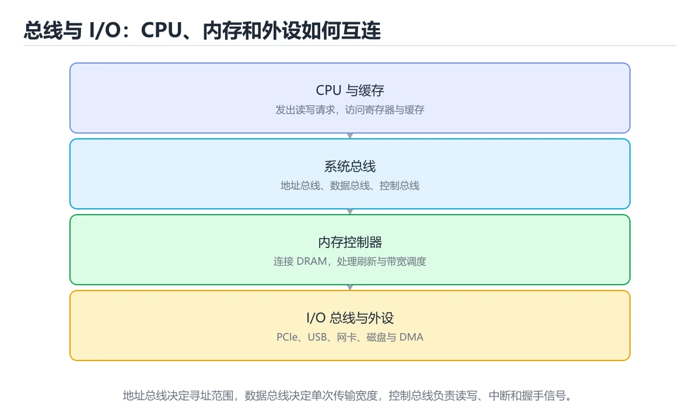
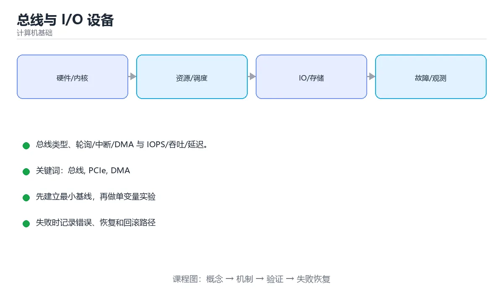

# 总线与 I/O 设备

> 内容更新时间：2026-10-06 · 学习阶段：进阶 · 预计用时：40 分钟





## 本节知识框架

**课程定位**：所属分类为「计算机基础」，课程主题为「总线与 I/O 设备」，学习阶段为「进阶」，建议用时 40 分钟。

**本课要解决的主问题**：总线类型、轮询/中断/DMA 与 IOPS/吞吐/延迟。

| 学习层次 | 要回答的问题 | 完成判据 |
| --- | --- | --- |
| 概念层 | 「总线与 I/O 设备」有哪些必须区分的对象与术语？ | 能用自己的话定义核心术语，并各举一个正例和一个反例。 |
| 机制层 | 这些对象按什么顺序发生作用，输入如何变成输出？ | 能画出或写出机制步骤，并说明每一步的失败条件。 |
| 应用层 | 什么场景适合使用「总线与 I/O 设备」，什么场景不适合？ | 能给出一个真实场景、一个最小示例和一个边界案例。 |
| 性能层 | 时间、空间、吞吐或延迟受哪些量影响？ | 能说出复杂度或性能瓶颈的证据来源；没有证据时明确写“材料未提供”。 |
| 复习层 | 怎样确认自己不是只记住了结论？ | 能独立完成本课自测，并把错误定位到概念、机制、示例或边界。 |

### 阅读路线

1. 先读「核心概念定义」，建立「总线」等对象的精确定义。
2. 再读「原理与运行机制」，把定义串成可重复的过程。
3. 用「代码/协议/SQL 示例」验证过程，并只改一个条件观察结果变化。
4. 最后检查性能、易错点、知识关系与自测题，形成可复习的证据链。

**前置知识**：《链接与加载》

**学习位置**：本课位于《链接与加载》之后；如果前一课的自测不能通过，应先回补再继续。

**后续衔接**：下一课《中断、异常与 DMA》会继续使用本课术语，学完后建议立即完成一次自测。

**教材衔接：学习目标**

- 能用自己的话解释总线与 I/O 设备解决了什么问题，而不是只背术语。
- 能说清 「总线」、「PCIe」、「DMA」、「IOPS」 之间的关系，并分别举出一个例子。
- 能把 总线 放回「总线与 I/O 设备」的知识体系，说明它和 PCIe 的边界。
- 能完成本课练习，并用验收标准检查自己的结果。

> 一句话摘要：总线类型、轮询/中断/DMA 与 IOPS/吞吐/延迟。

**教材衔接：前置知识**

- 先完成上一课《链接与加载》；如果已经掌握，可以直接用本课练习自测。
- 本课阶段：进阶。建议先完成「链接与加载」，或确认自己能独立跑通正文里的 TimeoutError 示例。
- 开始前先复习：总线、PCIe、DMA。
- 卡在 总线 上时不要跳过：把输入、预期和实际输出写成三行，再回头读正文。

**教材衔接：本课小结**

理解 I/O 的关键是三条链路：**总线负责搬数据、中断负责通知、DMA 负责免 CPU 搬运**；性能则用吞吐、IOPS 与延迟三个维度衡量。

## 核心概念定义

> 阅读约定：本课先给「总线与 I/O 设备」相关术语的操作性定义与适用边界；正文里的口语化说法与定义冲突时，以定义和可复现示例为准。

| 术语 | 操作性定义 | 本课中的边界 |
| --- | --- | --- |
| 总线 | 总线是 CPU、内存和外设之间传输地址、数据与控制信号的公共通道。 | 仅在「总线与 I/O 设备」明确给出的输入、版本与资源条件下成立。 |
| PCIe | 连接 CPU 与 GPU、SSD 等高速外设的串行总线标准。 | 仅在「总线与 I/O 设备」明确给出的输入、版本与资源条件下成立。 |
| DMA | 总线是 CPU、内存和外设之间传输地址、数据与控制信号的公共通道；I/O 设备通过控制器接入总线，CPU 通过端口、内存映射或 DMA 与设备交换数据。 | 仅在「总线与 I/O 设备」明确给出的输入、版本与资源条件下成立。 |
| IOPS | 理解 I/O 的关键是三条链路：总线负责搬数据、中断负责通知、DMA 负责免 CPU 搬运；性能则用吞吐、IOPS 与延迟三个维度衡量。 | 仅在「总线与 I/O 设备」明确给出的输入、版本与资源条件下成立。 |
| 设备 | 通过总线连接的外设；CPU 用内存映射或端口读写它的寄存器，并用中断或 DMA 交换数据。 | 仅在「总线与 I/O 设备」明确给出的输入、版本与资源条件下成立。 |

### 定义如何使用

在「总线与 I/O 设备」中判断一个说法是否成立，先确认它使用的是哪个对象的定义，再检查输入规模、运行环境与失败路径。定义不是口号，而是后续推导、代码示例和自测题共享的约束。

## 原理与运行机制

### 机制总览

1. **建立输入**：把「总线」按本课定义整理成可观察、可重复的输入条件。
2. **执行转换**：围绕「PCIe」执行本课的核心步骤；每一步都记录中间状态，避免只看最终输出。
3. **产生输出**：得到「DMA」后，用正文示例或协议/SQL 结果核对输出是否符合预期。
4. **改变一个条件**：只替换一个边界条件或环境参数，观察「总线与 I/O 设备」的结论是否仍然成立。

| 阶段 | 关注对象 | 失败时应检查 |
| --- | --- | --- |
| 输入 | 总线 | 类型、范围、编码、版本或前置状态是否满足定义。 |
| 处理 | PCIe | 顺序、可见性、锁、路由、事务或调度规则是否被破坏。 |
| 输出 | DMA | 结果是否可复现，错误是否被正确传播而不是被吞掉。 |

本课的机制结论要用「总线与 I/O 设备」自己的示例验证。「总线与 I/O 设备」没有给出某个数量级、吞吐或内存数据时，本课把该判断标为“材料未提供”，不从相邻主题外推。

**教材衔接：总线：连接部件的公共通道**

总线按功能分三类：**数据总线**传数据、**地址总线**指明目标、**控制总线**传读写/中断/时钟等信号。按层级分为片内总线（CPU 内部）、系统总线（连接内存与芯片组）与 I/O 总线（PCIe、USB、SATA）。

| 总线 | 特点 |
| --- | --- |
| PCIe | 串行、点对点、多通道（x1/x4/x16），现代设备主流 |
| USB | 热插拔、可级联、供电与数据一体 |
| SATA / NVMe | 前者面向 SATA SSD/HDD，后者直连 PCIe，延迟更低 |

**教材衔接：设备与 CPU 的通信方式**

| 方式 | 说明 | 代价 |
| --- | --- | --- |
| 轮询 | CPU 反复查询设备状态 | 浪费 CPU |
| 中断 | 设备就绪时通知 CPU | 有上下文切换开销 |
| DMA | 设备直接与内存交换数据，完成后中断通知 | 需要 IOMMU 做地址保护 |

端口映射 I/O（独立地址空间，如 x86 的 in/out 指令）与内存映射 I/O（设备寄存器映射到物理地址，用普通访存指令访问）是两种编址方案，后者在现代系统中更常见。

**教材衔接：设备分类**

块设备（磁盘、SSD）以固定大小块读写、支持随机访问；字符设备（键盘、串口）以字节流方式访问；网络设备是特殊类别，通过套接字而非设备文件交互。Linux 中设备通过 `/dev` 下的设备文件暴露，主设备号标识驱动、次设备号标识具体设备。

**教材衔接：总线与设备速查**

| 总线 | 典型速率量级 | 用途 |
| --- | --- | --- |
| PCIe 4.0 x4 | 约 8 GB/s | NVMe SSD |
| PCIe 4.0 x16 | 约 32 GB/s | 显卡 |
| USB 3.2 Gen2 | 约 1.2 GB/s | 外设 |
| SATA III | 约 600 MB/s | 机械盘与老式 SSD |
| I2C / SPI | 几百 kbit/s 到几十 Mbit/s | 传感器、嵌入式 |

## 典型应用场景

| 场景 | 典型输入或前提 | 期望产物 |
| --- | --- | --- |
| 学习验证 | 使用本课最小示例和 总线、PCIe | 能复现正文结论，并解释每一步。 |
| 工程落地 | 把「总线与 I/O 设备」放入真实模块或服务边界 | 输出可观测、失败可定位、参数可配置。 |
| 故障排查 | 只改一个版本、规模、输入或依赖条件 | 能区分概念错误、实现错误和环境差异。 |

判断「总线与 I/O 设备」的场景是否成立，标准是能否写出输入、处理、输出和失败路径；材料中没有出现的数据在本课标注为“材料未提供”，不用推测替代证据。

## 代码/协议/SQL 示例

### 最小可验证示例

下面保留《总线与 I/O 设备》原文中的最小示例。先预测《总线与 I/O 设备》示例的输出，再按正文步骤运行或推演；示例依赖外部环境时，同时记录版本与输入。

```python
import time

def polling_read(read_once, is_ready, timeout=1.0):
    """轮询：延迟低但持续占用 CPU。"""
    deadline = time.monotonic() + timeout
    while time.monotonic() < deadline:
        if is_ready():
            return read_once()
    raise TimeoutError("轮询超时")

def interrupt_like(read_once, is_ready, idle=0.001, timeout=1.0):
    """模拟中断驱动：空闲时让出 CPU（用 sleep 近似，实际由中断唤醒）。"""
    deadline = time.monotonic() + timeout
    while time.monotonic() < deadline:
        if is_ready():
            return read_once()
        time.sleep(idle)          # 让出 CPU，代价是响应延迟
    raise TimeoutError("等待事件超时")

def throughput_mb_s(bytes_transferred: int, seconds: float) -> float:
    """把传输量与耗时换算成 MB/s（1 MB 按 10^6 字节）。"""
    if seconds <= 0:
        raise ValueError("耗时必须为正")
    return bytes_transferred / 1_000_000 / seconds

print(round(throughput_mb_s(8_000_000, 1.0), 1))    # 8.0 MB/s
```

**教材衔接：深入补充：总线与 I/O 设备**

前面已经建立了基本概念。这一节换一个角度，把总线与 I/O 设备放进真实工程里，
重点回答三件事：总线 为什么存在、内部如何运转、什么时候会失效。

### 一、核心模型

总线是 CPU、内存和外设之间传输地址、数据与控制信号的公共通道；I/O 设备通过控制器接入总线，CPU 通过端口、内存映射或 DMA 与设备交换数据。

```text
CPU 发起读写 → 总线仲裁与地址译码 → 设备控制器接收 → 数据搬运/设备执行 → 中断或轮询通知 → CPU 处理完成
```

### 二、关键机制拆解

1. 地址总线决定可寻址空间，数据总线决定一次能搬运多少位，控制总线传递读写、中断、时钟和握手信号。
2. PCIe 采用点对点串行通道和分层协议，可通过多条 lane 扩展带宽；早期 PCI 是共享并行总线，扩展性和频率受限制。
3. 端口映射 I/O 使用独立指令空间，内存映射 I/O 把设备寄存器映射到地址空间，后者更常见也更易统一编程。
4. 轮询实现简单但浪费 CPU；中断让设备主动通知 CPU，适合低频事件；高吞吐设备常采用中断加批量处理的混合方式。
5. DMA 让设备直接读写内存，CPU 只负责配置和收尾，能把大块数据搬运从 CPU 拷贝循环中解放出来。
6. IOMMU 为设备提供地址翻译和隔离，既支持虚拟化，也能阻止设备越权访问不属于它的内存区域。

### 三、对照表：抓住容易混淆的边界

| 维度 | 一侧 | 另一侧 |
| --- | --- | --- |
| 轮询 | CPU 反复检查设备状态 | 简单但延迟和 CPU 占用可控性差 |
| 中断 | 设备完成后主动通知 CPU | 响应及时但高频中断会产生开销 |
| PIO | CPU 逐字搬运数据 | 实现简单但吞吐低、占用 CPU |
| DMA | 设备直接搬运内存数据 | 吞吐高，但需要缓冲区和一致性管理 |

### 四、工作示例

网卡收到一个数据包后，通过 DMA 把数据写入预分配缓冲区，再发中断通知 CPU。CPU 在中断处理里只做状态确认和唤醒协议栈，把耗时的数据解析放到软中断或工作队列，避免长时间关闭中断。

### 五、常见误区与失效边界

| 错误做法或假设 | 后果 | 正确做法 |
| --- | --- | --- |
| 认为中断一定比轮询快 | 高频小包场景被中断风暴拖垮 | 根据事件频率和批处理能力选择机制 |
| DMA 缓冲区没有对齐或没有生命周期管理 | 设备写到已释放内存或越界 | 使用 DMA 安全分配器并明确所有权 |
| 忽略缓存一致性 | CPU 看到旧数据或设备读到旧数据 | 使用一致性映射或显式刷新缓存 |
| 把设备寄存器当普通内存随意访问 | 出现乱序、丢失写或副作用 | 按设备规范使用读写屏障和专用访问函数 |

### 六、场景推演

设计一个高速采集卡驱动：数据到达后先进入 DMA 环形缓冲区，硬件按批次发中断；驱动完成描述符回收和内存屏障，再把数据交给上层。若改成每个样本一次中断，CPU 会全部消耗在中断上下文，吞吐反而下降。

### 七、自测问答

**Q1：为什么需要 IOMMU？**

它提供设备地址翻译和隔离，提升虚拟化能力并限制越权访问。

**Q2：DMA 的最大收益是什么？**

把大块数据搬运从 CPU 逐字拷贝中解放出来。

**Q3：中断风暴如何缓解？**

降低中断频率、批量处理、合并中断或改用轮询。

**Q4：MMIO 相比端口 I/O 的优势是什么？**

设备寄存器进入统一地址空间，便于用普通内存访问机制管理。

### 八、小项目：把知识变成可检查的产出

实现一个模拟 I/O 驱动：用队列代表设备缓冲区，分别实现轮询、每包中断和批量中断三种模式；统计 CPU 次数、延迟和吞吐，画出三组数据并解释差异。

### 九、适用边界

总线与 I/O 知识解释数据如何进出设备，但不替代设备协议、文件系统或网络协议。真正的性能瓶颈可能来自介质、驱动、协议栈或应用层，分析时必须逐层测量。

### 十、完成检查清单

- [ ] 能区分地址、数据和控制总线
- [ ] 能比较轮询、中断和 DMA 的适用场景
- [ ] 能解释 MMIO 与端口 I/O 的差异
- [ ] 能说明 IOMMU 和缓存一致性的作用
- [ ] 能设计一个批量 I/O 的基本流程

## 时间/空间复杂度或性能分析

**复杂度证据**：「总线与 I/O 设备」的现有材料没有给出渐近时间或空间复杂度的明确结论，本课只做定性检查，不补写未经验证的 $O$ 记号。

| 维度 | 本课关注点 | 判断依据 |
| --- | --- | --- |
| 时间/延迟 | 「总线与 I/O 设备」的主要步骤是否会随输入规模、并发度或网络往返增长。 | 以正文复杂度、基准数据或可重复测量为准。 |
| 空间/内存 | 中间状态、缓存、副本、连接或索引是否随规模增长。 | 记录峰值内存与数据副本，不只看最终结果。 |
| 吞吐/资源 | 版本、调度、锁、IO、序列化或协议开销是否成为瓶颈。 | 固定环境做对照实验，改变一个变量。 |

评估「总线与 I/O 设备」时要区分“正确性成立”和“性能达标”两件事；材料没有给出基准时，本课只保留量级来源与测量方法，不写不可验证的绝对数字。

**教材衔接：性能指标**

吞吐量（MB/s）衡量带宽，IOPS 衡量每秒操作数，延迟衡量单次耗时。三者互相制约：小随机 IO 看 IOPS 与延迟，大顺序 IO 看吞吐。机械盘受寻道与旋转延迟限制，SSD 受闪存写入放大与垃圾回收影响。

**教材衔接：性能指标速查**

| 指标 | 关注点 |
| --- | --- |
| IOPS | 每秒 IO 次数，小随机 IO 的核心指标 |
| 吞吐（MB/s） | 大块顺序读写的能力 |
| 延迟 | 单次 IO 的耗时，直接影响响应 |
| 队列深度 | 同时未完成的 IO 数，影响并发能力 |
| 4K 随机读 | 数据库与虚拟化最关键的负载 |
| 顺序带宽 | 备份、日志、大文件拷贝更关注 |

## 常见误区与易错点

> 复核《总线与 I/O 设备》的易错点时，优先保留原文的错误表、故障现场与排错路径；每条修正都要能用本课示例复验。

| 易错点 | 常见表现 | 正确做法 |
| --- | --- | --- |
| 只背结论 | 能复述「总线与 I/O 设备」的定义，却说不清输入、输出与边界。 | 回到机制步骤，用最小示例逐一验证。 |
| 混淆相邻概念 | 把本课对象与相邻主题的对象当成同一类。 | 先比较定义、资源归属、生命周期和失败模式。 |
| 忽略版本与环境 | 在开发机通过后直接外推到生产环境。 | 固定版本、输入和资源条件，再记录可复现结果。 |

**教材衔接：常见错误与排查**

| 容易写错的做法 | 实际现象 | 原因与正确做法 |
| --- | --- | --- |
| 用顺序带宽衡量数据库盘 | 结论乐观 | 数据库多为 4K 随机读写，看 IOPS |
| 只看 IOPS 不看延迟 | 高负载下体验差 | 两者结合，关注尾延迟 |
| 忽视队列深度影响 | 并发能力被低估 | 在目标队列深度下测 |
| 认为 DMA 完全不需要 CPU | 仍需驱动与中断处理 | DMA 只减少数据搬运的 CPU 参与 |
| 用轮询处理大量设备 | CPU 被吃满 | 批量或负载高时改中断或混合模式 |
| 忽略对齐 | 出现读改写放大 | 按扇区与页对齐 |
| 忽视文件系统与缓存影响 | 结果不代表真实设备 | 用直接 IO 或清理缓存后测 |
| 混用 MB 与 MiB | 数值差 4.8% | 明确单位并统一 |
| 忽略写缓存与掉电风险 | 数据丢失 | 明确 `fsync` 语义与设备缓存策略 |
| 只测一次 | 结果噪声大 | 多次测量并报告分布 |

**教材衔接：故障现场**

### 现场 1：只看 IOPS 不看延迟

**症状**：在《总线与 I/O 设备》的复现场景中，高负载下体验差。

**根因**：当出现“只看 IOPS 不看延迟”时，执行路径已经绕过了《总线与 I/O 设备》的关键约束，最终以“高负载下体验差”暴露出来；修复前必须先确认约束在哪里失效。

**修复**：针对《总线与 I/O 设备》的问题，两者结合，关注尾延迟。

**验证**：先在《总线与 I/O 设备》中记录“只看 IOPS 不看延迟”留下的失败证据，再执行“两者结合，关注尾延迟”并重放；确认错误路径变为明确结果，且修复没有掩盖同类故障。

### 现场 2：忽视队列深度影响

**症状**：在《总线与 I/O 设备》的复现场景中，并发能力被低估。

**根因**：当出现“忽视队列深度影响”时，执行路径已经绕过了《总线与 I/O 设备》的关键约束，最终以“并发能力被低估”暴露出来；修复前必须先确认约束在哪里失效。

**修复**：针对《总线与 I/O 设备》的问题，在目标队列深度下测。

**验证**：先在《总线与 I/O 设备》中记录“忽视队列深度影响”留下的失败证据，再执行“在目标队列深度下测”并重放；确认错误路径变为明确结果，且修复没有掩盖同类故障。

### 现场 3：认为 DMA 完全不需要 CPU

**症状**：在《总线与 I/O 设备》的复现场景中，仍需驱动与中断处理。

**根因**：“仍需驱动与中断处理”只是表层结果。向上追溯会落到“认为 DMA 完全不需要 CPU”这一步，因为它省略了《总线与 I/O 设备》的约束，使实现行为和预期模型发生了偏离。

**修复**：针对《总线与 I/O 设备》的问题，DMA 只减少数据搬运的 CPU 参与。

**验证**：保留《总线与 I/O 设备》里触发“仍需驱动与中断处理”的输入、版本和日志，按“DMA 只减少数据搬运的 CPU 参与”完成修改后原样重放；只有失败现象消失且相邻场景仍可解释，才保留改动。

## 与其他知识点的关系

| 关系 | 课程 | 为什么 |
| --- | --- | --- |
| 先修 | 《链接与加载》 | 本课会直接使用它的概念或操作前提。 |
| 关联 | 《中断、异常与 DMA》 | 用于横向比较或把本课结论迁移到相邻主题。 |
| 前置顺序 | 《链接与加载》 | 同分类中安排在本课之前，建议先完成其自测。 |
| 后续顺序 | 《中断、异常与 DMA》 | 同分类中安排在本课之后，会继续使用本课术语。 |

把「总线与 I/O 设备」放回知识体系时，不只要记住“前面学过什么”，还要说明两个主题在输入、机制、资源边界和失败模式上的差异。这样才能把单课知识迁移到项目、排障和后续课程。

**教材衔接：IO 方式对照**

| 方式 | CPU 参与度 | 延迟 | 适用 |
| --- | --- | --- | --- |
| 程序控制轮询 | 高（忙等） | 最低 | 极低延迟、短传输 |
| 中断驱动 | 中（每次中断处理） | 中等 | 通用场景 |
| DMA | 低（只处理完成中断） | 低 | 大块数据传输 |
| 通道 / 协处理器 | 最低 | 低 | 大型机、专用卸载 |

```python
import time

def polling_read(read_once, is_ready, timeout=1.0):
    """轮询：延迟低但持续占用 CPU。"""
    deadline = time.monotonic() + timeout
    while time.monotonic() < deadline:
        if is_ready():
            return read_once()
    raise TimeoutError("轮询超时")

def interrupt_like(read_once, is_ready, idle=0.001, timeout=1.0):
    """模拟中断驱动：空闲时让出 CPU（用 sleep 近似，实际由中断唤醒）。"""
    deadline = time.monotonic() + timeout
    while time.monotonic() < deadline:
        if is_ready():
            return read_once()
        time.sleep(idle)          # 让出 CPU，代价是响应延迟
    raise TimeoutError("等待事件超时")

def throughput_mb_s(bytes_transferred: int, seconds: float) -> float:
    """把传输量与耗时换算成 MB/s（1 MB 按 10^6 字节）。"""
    if seconds <= 0:
        raise ValueError("耗时必须为正")
    return bytes_transferred / 1_000_000 / seconds

print(round(throughput_mb_s(8_000_000, 1.0), 1))    # 8.0 MB/s
```

## 自测题与参考答案

> 先独立作答《总线与 I/O 设备》的自测题，再对照答案与解析；每处判断都要能在本课正文或示例中找到依据。

### 自测 1

按“总线与 I/O 设备”中 总线、PCIe、DMA 的实践顺序，把四个步骤排成从准备到复盘的合理顺序。

A. 只改一个变量，记录边界与失败路径的变化
B. 固定版本与证据，把“总线与 I/O 设备”的结论写成可复现记录
C. 先明确 总线 的输入、输出与约束
D. 写出最小示例并核对 PCIe 的基线结果

**参考答案**：先明确 总线 的输入、输出与约束 → 写出最小示例并核对 PCIe 的基线结果 → 只改一个变量，记录边界与失败路径的变化 → 固定版本与证据，把“总线与 I/O 设备”的结论写成可复现记录

**解析**：在「总线与 I/O 设备」里，在本课的练习里，顺序应当是：先明确 总线 的输入、输出与约束 → 写出最小示例并核对 PCIe 的基线结果 → 只改一个变量，记录边界与失败路径的变化 → 固定版本与证据，把本课的结论写成可复现记录。这个顺序把 总线 的输入、输出和约束放在最前面，在总线与 I/O 设备里避免概念没对齐就开始调参。第二步用 PCIe 建立可核对的基线，在总线与 I/O 设备里第三步才允许改变一个变量并观察失败路径。

### 自测 2

现代设备互连的主流总线是？

A. VESA
B. ISA
C. PCIe
D. IDE

**参考答案**：PCIe

**解析**：PCIe 串行、点对点、多通道，是显卡、SSD 等的标准接口。其他选项：PCIe 是现代设备互连的主流总线。在「总线与 I/O 设备」里判断这道题，要把总线、PCIe、DMA的条件、过程与失败路径逐项对齐，换成“现代设备互连的主流总线是”这个场景，只有满足前提的结论才成立。回到「总线与 I/O 设备」的正文示例，用“现代设备互连的主流总线是”走一遍总线、PCIe、DMA的完整流程，能复现的结论才可以保留。

### 自测 3

这段 Python 代码是「总线与 I/O 设备」的示例片段，下面哪一项描述与它一致？

```python
import time

def polling_read(read_once, is_ready, timeout=1.0):
    """轮询：延迟低但持续占用 CPU。"""
    deadline = time.monotonic() + timeout
    while time.monotonic() < deadline:
        if is_ready():
            return read_once()
    raise TimeoutError("轮询超时")

def interrupt_like(read_once, is_ready, idle=0.001, timeout=1.0):
    """模拟中断驱动：空闲时让出 CPU（用 sleep 近似，实际由中断唤醒）。"""
    deadline = time.monotonic() + timeout
    while time.monotonic() < deadline:
        if is_ready():
            return read_once()
        time.sleep(idle)          # 让出 CPU，代价是响应延迟
    raise TimeoutError("等待事件超时")

def throughput_mb_s(bytes_transferred: int, seconds: float) -> float:
    """把传输量与耗时换算成 MB/s（1 MB 按 10^6 字节）。"""
    if seconds <= 0:
        raise ValueError("耗时必须为正")
    return bytes_transferred / 1_000_000 / seconds

print(round(throughput_mb_s(8_000_000, 1.0), 1))    # 8.0 MB/s
```

A. 这段代码只做静态声明，没有循环、分支或可观察输出。
B. 这段代码包含异常处理分支，失败时会走专门的补救路径。
C. 这段代码会读取外部输入，结果依赖传入的数据。
D. 这段代码包含条件分支，不同输入会走不同的执行路径。

**参考答案**：这段代码包含条件分支，不同输入会走不同的执行路径。

**解析**：在「总线与 I/O 设备」里，题干的正确项是这段代码包含条件分支，不同输入会走不同的执行路径，在「总线与 I/O 设备」里分支条件由总线决定，替换条件后结论可能变化。把输入或边界换成空值、极值或失败情况后，结论要以「总线与 I/O 设备」的实际运行结果为准。「总线与 I/O 设备」要求先交代总线、PCIe、DMA的前提再下结论，所以“这段代码包含条件分支”只在题干“这段 Python 代码是总线与 I/O 设备的示例片段”给定的条件下成立。

**教材衔接：复习与自测**

- [ ] 能列出常见总线的速率量级。
- [ ] 能说出轮询、中断、DMA 的取舍。
- [ ] 知道数据库看 IOPS、备份看吞吐。
- [ ] 测试设备时会考虑队列深度与对齐。
- [ ] 能区分 MB 与 MiB 并统一单位。

**教材衔接：动手练习**

> 本课练习重点：围绕「总线、PCIe、DMA」完成复述、实验和交付，每个结果都要能被别人检查。

先画出 TimeoutError 的流程，再手算一组输入，最后运行核对。

### 练习 1：建立心智模型（10 分钟）

合上教程，用 3～5 句话回答：

1. 总线与 I/O 设备解决了什么问题？
2. 如果没有它，会出现什么具体后果？
3. 它和「PCIe」是什么关系？

验收标准：回答里必须出现 总线，并写出一个让结论失效的边界条件。

### 练习 2：做一次可控实验（20 分钟）

从正文中选一个最小示例，完成以下操作：

1. 先预测修改一个参数、输入或步骤后的结果。
2. 再实际执行或逐步推演，记录真实结果。
3. 如果结果与预测不同，写出差异原因。

**验收标准**：五步记录要写进笔记——原例是 TimeoutError，改动落在总线上，结论必须能被他人在同一环境里复现。

### 练习 3：交付一个小结果（30 分钟）

用表格、真值表或计算过程把抽象概念落到一个可核对的结果上。

任务要求：

- 结果必须能被别人检查，不能只写“我已经理解了”。
- 至少覆盖「总线」和「PCIe」两个关键词。
- 写出 1 个仍然不确定的问题，以及下一步如何验证。

> 提示：时间有限时优先做练习 1 和练习 2；练习 3 可以拆成两次完成。

**教材衔接：可运行练习**

### 任务 1：先跑通，再解释

```python
import time

def polling_read(read_once, is_ready, timeout=1.0):
    """轮询：延迟低但持续占用 CPU。"""
    deadline = time.monotonic() + timeout
    while time.monotonic() < deadline:
        if is_ready():
            return read_once()
    raise TimeoutError("轮询超时")

def interrupt_like(read_once, is_ready, idle=0.001, timeout=1.0):
    """模拟中断驱动：空闲时让出 CPU（用 sleep 近似，实际由中断唤醒）。"""
    deadline = time.monotonic() + timeout
    while time.monotonic() < deadline:
        if is_ready():
            return read_once()
        time.sleep(idle)          # 让出 CPU，代价是响应延迟
    raise TimeoutError("等待事件超时")

def throughput_mb_s(bytes_transferred: int, seconds: float) -> float:
    """把传输量与耗时换算成 MB/s（1 MB 按 10^6 字节）。"""
    if seconds <= 0:
        raise ValueError("耗时必须为正")
    return bytes_transferred / 1_000_000 / seconds

print(round(throughput_mb_s(8_000_000, 1.0), 1))    # 8.0 MB/s
```

### 任务 2：只改一个条件

把「总线与 I/O 设备」的最小示例复制一份，只改一个条件再跑一次：

- 改动点：把 PCIe 换成边界值，其他输入保持原样。
- 预测：先写下「总线与 I/O 设备」在改动后的输出或错误信息，再运行。
- 记录：对照改动前后的结果，指出差异出在哪一步。
- 验收：换回原条件能复现原结果，改动只影响总线。

### 任务 3：迁移到自己的数据

换一个 PCIe 场景重做一次，确认结论不是只对示例数据成立。

**教材衔接：本课复习清单**

离开本课前，逐项确认：

- [ ] 不看解析，能说出「DMA 的作用是？」的判断依据。
- [ ] 不看解析，能说出「现代设备互连的主流总线是？」的判断依据。
- [ ] 不看解析，能说出「衡量小随机 IO 性能主要看？」的判断依据。
- [ ] 不看解析，能说出「轮询（polling）与中断驱动 IO 的取舍是？」的判断依据。
- [ ] 不看解析，能说出「内存映射 IO（MMIO）的含义是？」的判断依据。
- [ ] 至少运行一次 TimeoutError 的示例，记录输入、输出和 总线 的边界情况。
- [ ] 把本课最容易混淆的两个概念写成一句话对照。

| 复盘项 | 记录 |
| --- | --- |
| 已经能独立解释的考点 |  |
| 仍然说不清的概念 |  |
| 下一步验证动作 |  |

---

## 术语速查

把「总线与 I/O 设备」里反复出现的术语集中放在一起。复习时先遮住右列，尝试用自己的话解释，再回到正文核对。

| 术语 | 一句话说明 |
| --- | --- |
| `总线` | 总线是 CPU、内存和外设之间传输地址、数据与控制信号的公共通道。 |
| `PCIe` | 连接 CPU 与 GPU、SSD 等高速外设的串行总线标准。 |
| `DMA` | 总线是 CPU、内存和外设之间传输地址、数据与控制信号的公共通道；I/O 设备通过控制器接入总线，CPU 通过端口、内存映射或 DMA 与设备交换数据。 |
| `IOPS` | 理解 I/O 的关键是三条链路：总线负责搬数据、中断负责通知、DMA 负责免 CPU 搬运；性能则用吞吐、IOPS 与延迟三个维度衡量。 |
| `设备` | 通过总线连接的外设；CPU 用内存映射或端口读写它的寄存器，并用中断或 DMA 交换数据。 |

## 考点精讲

### 考点 1：顺序排列·总线

- **题目**：按“总线与 I/O 设备”中 总线、PCIe、DMA 的实践顺序，把四个步骤排成从准备到复盘的合理顺序。
- **判断依据**：在「总线与 I/O 设备」里，在本课的练习里，顺序应当是：先明确 总线 的输入、输出与约束 → 写出最小示例并核对 PCIe 的基线结果 → 只改一个变量，记录边界与失败路径的变化 → 固定版本与证据，把本课的结论写成可复现记录。这个顺序把 总线 的输入、输出和约束放在最前面，在总线与 I/O 设备里避免概念没对齐就开始调参。第二步用 PCIe 建立可核对的基线，在总线与 I/O 设备里第三步才允许改变一个变量并观察失败路径。

### 考点 2：概念判断·总线

- **题目**：现代设备互连的主流总线是？
- **判断依据**：PCIe 串行、点对点、多通道，是显卡、SSD 等的标准接口。其他选项：PCIe 是现代设备互连的主流总线。在「总线与 I/O 设备」里判断这道题，要把总线、PCIe、DMA的条件、过程与失败路径逐项对齐，换成“现代设备互连的主流总线是”这个场景，只有满足前提的结论才成立。回到「总线与 I/O 设备」的正文示例，用“现代设备互连的主流总线是”走一遍总线、PCIe、DMA的完整流程，能复现的结论才可以保留。

### 考点 3：概念判断·总线

- **题目**：衡量小随机 IO 性能主要看？
- **判断依据**：小随机 IO 受限于每秒操作数与单次延迟，大顺序 IO 才看吞吐。其他选项：小随机 IO 关注 IOPS 与延迟。如果只凭关键词作答，很容易把「总线位宽」、「主频」与「IOPS 与延迟」混在一起；这道题的关键在「总线与 I/O 设备」的总线、PCIe、DMA：先确认题干“衡量小随机 IO 性能主要看”问的是哪一步，再排除偷换前提的选项。

### 考点 4：代码补全·总线

- **题目**：这段 Python 代码是「总线与 I/O 设备」的示例片段，下面哪一项描述与它一致？
- **判断依据**：在「总线与 I/O 设备」里，题干的正确项是这段代码包含条件分支，不同输入会走不同的执行路径，在「总线与 I/O 设备」里分支条件由总线决定，替换条件后结论可能变化。把输入或边界换成空值、极值或失败情况后，结论要以「总线与 I/O 设备」的实际运行结果为准。「总线与 I/O 设备」要求先交代总线、PCIe、DMA的前提再下结论，所以“这段代码包含条件分支”只在题干“这段 Python 代码是总线与 I/O 设备的示例片段”给定的条件下成立。

### 考点 5：概念判断·总线

- **题目**：内存映射 IO（MMIO）的含义是？
- **判断依据**：与端口 IO（in/out 指令）相比，MMIO 可用常规访存与编译器优化，是现代主流。在「总线与 I/O 设备」里，其他选项：MMIO 把设备寄存器映射到地址空间。这道题的关键在「总线与 I/O 设备」的总线、PCIe、DMA：先确认题干“内存映射 IO（MMIO）的含义是”问的是哪一步，再排除偷换前提的选项。

### 考点 6：多选辨析·总线

- **题目**：以下哪些术语与「总线与 I/O 设备」直接相关？（多选）
- **判断依据**：PCIe是否完整覆盖题干的输入、输出和失败路径，并排除总线、类型收窄这类相邻概念。PCIe」是否完整覆盖题干的输入、输出和失败路径，并排除「总线」、「类型收窄」这类相邻概念。把“总线”代回「总线与 I/O 设备」里“以下哪些术语与总线与 I/O 设备直接相关”的例子核对，条件一旦改变，结论就要用总线、PCIe、DMA重新推导。

## English Overview

**Title:** Buses & I/O

**Summary:** Buses, polling/interrupts/DMA and IO metrics.

**Category:** Fundamentals
**Level:** 进阶
**Key terms:** 总线, PCIe, DMA, IOPS, 设备

## 内容元数据

- 内容版本：v2.0
- 最后更新：2026-10-06
- 学习阶段：进阶
- 适用环境：通用计算机体系结构知识；本课聚焦 总线。
- 内容来源：内置结构化课程与工程实践整理
- 相关主题：总线、PCIe、DMA、IOPS、设备
- 质量版本：P0 测验标准 + P1 覆盖扩展 + P2 体验补全

## 参考资料与复核

- 最后复核：2026-10-04
- 下次复核：2027-03-17
- 复核范围：版本兼容、API 行为、安全建议与工程实践
- 来源性质：官方文档、标准或权威教材；正文为离线教学重组

| 参考资料 | 本课用途 |
| --- | --- |
| [CS50 计算机科学导论](https://cs50.harvard.edu/x/) | 计算机科学综合入门 |
| [MIT 6.006 算法导论](https://ocw.mit.edu/courses/6-006-introduction-to-algorithms-spring-2020/) | 算法与数据结构基础 |
| [MIT 6.033 计算机系统工程](https://ocw.mit.edu/courses/6-033-computer-system-engineering-spring-2018/) | 系统设计与并发 |

> 「总线与 I/O 设备」的链接用于离线阅读后的延伸核对；App 不会自动联网。
