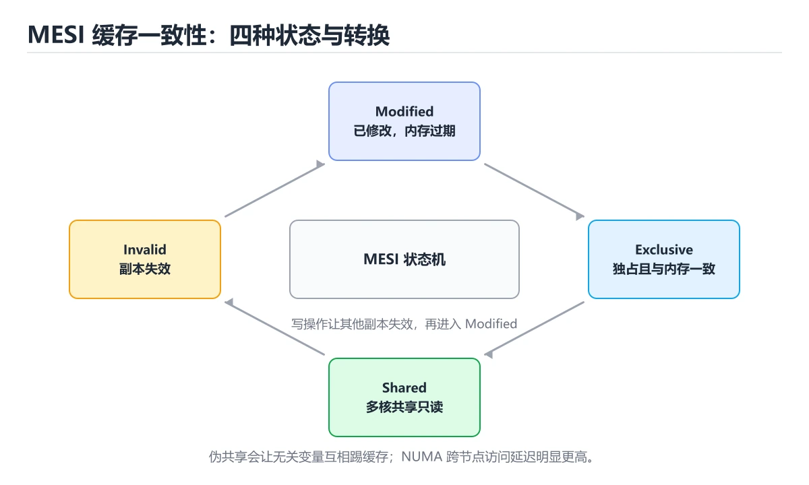
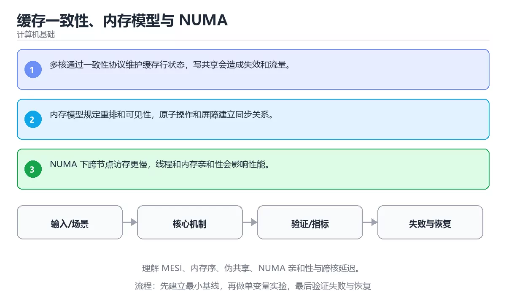

# 缓存一致性、内存模型与 NUMA





> 内容更新时间：2026-10-06 · 学习阶段：高级 · 预计用时：35 分钟

## 本节知识框架

**课程定位**：所属分类 `fundamentals`（计算机基础），课程主题 `缓存一致性、内存模型与 NUMA`，学习阶段 高级，建议用时 45 分钟。

本课主线：理解 MESI、内存序、伪共享、NUMA 亲和性与跨核延迟。

**学完本课应当能够**
- 说清 `缓存一致性` 与 `内存序` 的含义与区别，并各举一个正例和一个反例。
- 用本课示例验证 `NUMA` 的行为，记录输入、输出与失败条件。
- 遇到「以为多核共享内存天然一致」这类问题时，能说出触发条件与修复顺序。

### 从概念到验证的学习链条

1. `缓存一致性`：先掌握 多个缓存副本或缓存与数据源之间保持可接受的新旧关系，需要失效或更新策略，再用它解释 `内存序` 为什么会出现。
2. `内存序`：先掌握 原子操作之间的可见性与排序约定，决定一个线程的写入何时被其他线程观察到，再用它解释 `NUMA` 为什么会出现。
3. `NUMA`：先掌握 非一致内存访问：每个 CPU 有本地内存，跨节点访问更慢，需按节点绑定线程与内存，再用它解释 `伪共享` 为什么会出现。
4. `伪共享`：先掌握 不同核心写同一缓存行里的不同变量，导致缓存行反复失效；用填充或对齐分开变量可消除，再用它解释 `共享内存` 为什么会出现。
5. `共享内存`：先掌握 多个进程或线程访问同一块内存区域，需要同步避免数据竞争，再用它解释 本课示例的观察结果 为什么会出现。

**先修与衔接**：本课是「计算机基础」分类的第 28 课。先修内容：《SIMD 与向量化计算》。《SIMD 与向量化计算》里的 `SIMD`、`向量化` 是本课的前提。相关或后续课程：《SSD、存储栈与持久化》。

### 完成判据

- **定义关**：不看正文也能说明 `缓存一致性` 是 多个缓存副本或缓存与数据源之间保持可接受的新旧关系，需要失效或更新策略，并指出一个反例。
- **机制关**：能按“输入 → 转换 → 输出 → 验证”复述 `缓存一致性、内存模型与 NUMA`，而不是只背结论。
- **示例关**：能运行或推演 `缓存一致性、内存模型与 NUMA` 的 `text` 示例，并说明一个真实出现的标识符或字面量。
- **证据关**：能指出 `缓存一致性、内存模型与 NUMA` 示例里的 调用了 `print()`，并说明它支持或反驳了本课的哪一条结论。
- **排错关**：能复现 以为多核共享内存天然一致，记录现象并按 用同步原语建立先后关系，不依赖时序巧合 修复。
- **迁移关**：能把 `缓存一致性`、`内存序`、`NUMA`、`伪共享` 放进一个与 `缓存一致性、内存模型与 NUMA` 不同的项目场景，并保持输入与验证条件可追踪。
- **复盘关**：学完 `缓存一致性、内存模型与 NUMA` 后，用一句话写下仍然不确定的结论，并列出下一次验证需要的输入、环境和成功判据。

### 复习清单

- [ ] 能不看正文复述本课核心术语，并指出一个边界或反例。
- [ ] 能运行或推演本课示例，记录输入、输出与失败现象。
- [ ] 能完成一次自测，并把错题对照错误表定位原因。

## 核心概念定义

| 术语 | 操作性定义 | 常见边界与风险 |
| --- | --- | --- |
| 缓存一致性 | 多个缓存副本或缓存与数据源之间保持可接受的新旧关系，需要失效或更新策略。 | 缓存与状态残留会让结果过期，先明确失效策略再判断正确性。 |
| 内存序 | 原子操作之间的可见性与排序约定，决定一个线程的写入何时被其他线程观察到。 | 共享状态与调度顺序会改变结论，单线程或串行测试通过不等于并发下成立。 |
| NUMA | 非一致内存访问：每个 CPU 有本地内存，跨节点访问更慢，需按节点绑定线程与内存。 | 共享状态与调度顺序会改变结论，单线程或串行测试通过不等于并发下成立。 |
| 伪共享 | 不同核心写同一缓存行里的不同变量，导致缓存行反复失效；用填充或对齐分开变量可消除。 | 易错：不同线程写同一缓存行，性能骤降；正确做法是把线程独立写入的变量分开填充或按线程分块。 |
| 共享内存 | 多个进程或线程访问同一块内存区域，需要同步避免数据竞争 | 易错：缺少同步时读到旧值；正确做法是用同步原语建立先后关系，不依赖时序巧合。 |
| 输入如何表示，位宽与精度是否明确？ | 日志、输入样例、测试或指标 | 只在「日志、输入样例、测试或指标」这一前提下成立，换输入或换环境要重新验证。 |
| 数据经过哪些层级，瓶颈在哪一层？ | 日志、输入样例、测试或指标 | 只在「日志、输入样例、测试或指标」这一前提下成立，换输入或换环境要重新验证。 |
| 顺序、分支与并行如何影响结果？ | 日志、输入样例、测试或指标 | 只在「日志、输入样例、测试或指标」这一前提下成立，换输入或换环境要重新验证。 |
| 是否用基准测试验证了推断？ | 日志、输入样例、测试或指标 | 只在「日志、输入样例、测试或指标」这一前提下成立，换输入或换环境要重新验证。 |

## 原理与运行机制

### 机制总览

**教材衔接：核心知识**

### 1. 多核通过一致性协议维护缓存行状态，写共享会造成失效和流量。

- 关键做法：先用 cache 建立 缓存一致性 的基线，再逐步加入边界与失败条件。
- 验证标准：cache 的输出能被他人复现，边界输入有对应用例。

### 2. 内存模型规定重排和可见性，原子操作和屏障建立同步关系。

把这条结论放回「缓存一致性、内存模型与 NUMA」的完整流程里展开：

- 正文依据：能用自己的话解释：NUMA 下跨节点访存更慢，线程和内存亲和性会影响性能。
- 落地检查：把「2. 内存模型规定重排和可见性，原子操作和屏障建立同步关系。」改写成一条可执行的核对项，逐条验证输入、超时与失败路径。

### 3. NUMA 下跨节点访存更慢，线程和内存亲和性会影响性能。

把这条结论放回「缓存一致性、内存模型与 NUMA」的完整流程里展开：

- 正文依据：本课关键词：缓存一致性、内存序、NUMA、伪共享。
- 落地检查：把「3. NUMA 下跨节点访存更慢，线程和内存亲和性会影响性能。」改写成一条可执行的核对项，逐条验证输入、超时与失败路径。

**教材衔接：关键流程**

**教材衔接：实践路径**

**教材衔接：验证步骤**

### 机制拆解：每一步的输入、动作与输出

#### 1. `缓存一致性`
- 输入：`缓存一致性`；本步把 多个缓存副本或缓存与数据源之间保持可接受的新旧关系，需要失效或更新策略 当作判断规则。
- 动作：围绕 `缓存一致性` 保留中间状态，并记录它与 `内存序` 的对应关系。
- 输出：`内存序`，它可以被下一段代码、测试或记录继续使用。
- `缓存一致性` 的失败条件：缓存与状态残留会让结果过期，先明确失效策略再判断正确性。

#### 2. `内存序`
- 输入：`缓存一致性`；本步把 原子操作之间的可见性与排序约定，决定一个线程的写入何时被其他线程观察到 当作判断规则。
- 动作：围绕 `内存序` 保留中间状态，并记录它与 `NUMA` 的对应关系。
- 输出：`NUMA`，它可以被下一段代码、测试或记录继续使用。
- `内存序` 的失败条件：共享状态与调度顺序会改变结论，单线程或串行测试通过不等于并发下成立。

#### 3. `NUMA`
- 输入：`内存序`；本步把 非一致内存访问：每个 CPU 有本地内存，跨节点访问更慢，需按节点绑定线程与内存 当作判断规则。
- 动作：围绕 `NUMA` 保留中间状态，并记录它与 `伪共享` 的对应关系。
- 输出：`伪共享`，它可以被下一段代码、测试或记录继续使用。
- `NUMA` 的失败条件：共享状态与调度顺序会改变结论，单线程或串行测试通过不等于并发下成立。

#### 4. `伪共享`
- 输入：`NUMA`；本步把 不同核心写同一缓存行里的不同变量，导致缓存行反复失效；用填充或对齐分开变量可消除 当作判断规则。
- 动作：围绕 `伪共享` 保留中间状态，并记录它与 `共享内存` 的对应关系。
- 输出：`共享内存`，它可以被下一段代码、测试或记录继续使用。
- `伪共享` 的失败条件：当忽视伪共享问题时，会出现不同线程写同一缓存行，性能骤降。

#### 5. `共享内存`
- 输入：`伪共享`；本步把 多个进程或线程访问同一块内存区域，需要同步避免数据竞争 当作判断规则。
- 动作：围绕 `共享内存` 保留中间状态，并记录它与 `print` 的对应关系。
- 输出：`print`，它可以被下一段代码、测试或记录继续使用。
- `共享内存` 的失败条件：当以为多核共享内存天然一致时，会出现缺少同步时读到旧值。

### 示例中的可观察事实

1. 调用了 `print()`；它对应的课程主题是 `缓存一致性、内存模型与 NUMA`。
2. 出现字面量 `core0`；它对应的课程主题是 `缓存一致性、内存模型与 NUMA`。
3. 出现字面量 `core1`；它对应的课程主题是 `缓存一致性、内存模型与 NUMA`。

### 复现实验记录

- 环境：`缓存一致性、内存模型与 NUMA` 使用 `text` 示例，固定 `缓存一致性`、`内存序`、`NUMA`、`伪共享` 作为第一组条件。
- 首轮输入：先确认 调用了 `print()`，预测 `缓存一致性` 会怎样变化。
- 基线观察：记录命令、输入、输出和错误原文，不用截图代替可复制的文本。
- 单变量修改：只改变 `缓存一致性`，观察 `共享内存` 是否仍满足定义。
- 失败注入：复现 以为多核共享内存天然一致，确认现象是 缺少同步时读到旧值。
- 记录结论：把“修改前、修改后、预期变化、实际变化”写成四列表，这样复盘 `缓存一致性、内存模型与 NUMA` 时才能区分概念错误与实现错误。

## 典型应用场景

- **以为多核共享内存天然一致**：典型现象是缺少同步时读到旧值；正确做法是用同步原语建立先后关系，不依赖时序巧合。
- **忽视伪共享问题**：典型现象是不同线程写同一缓存行，性能骤降；正确做法是把线程独立写入的变量分开填充或按线程分块。
- **忽视访存亲和性**：典型现象是跨节点访问内存延迟高；正确做法是把线程与内存绑定到同一节点。

### 最小验证场景

- 准备：保留 `text` 示例的原始输入，先记录 `缓存一致性、内存模型与 NUMA` 的基线输出和完整运行命令。
- 观察：先核对 调用了 `print()`，再改变一个与 `缓存一致性` 相关的条件。
- 判定：新结果与 `缓存一致性、内存模型与 NUMA` 的基线不同不等于错误；只有当差异破坏了 `缓存一致性` 的定义或错误表中的约束，才判定为失败。

### 选择与边界

- 使用 `缓存一致性` 时，先满足它的定义：多个缓存副本或缓存与数据源之间保持可接受的新旧关系，需要失效或更新策略；缓存与状态残留会让结果过期，先明确失效策略再判断正确性。
- 使用 `内存序` 时，先满足它的定义：原子操作之间的可见性与排序约定，决定一个线程的写入何时被其他线程观察到；共享状态与调度顺序会改变结论，单线程或串行测试通过不等于并发下成立。
- 使用 `NUMA` 时，先满足它的定义：非一致内存访问：每个 CPU 有本地内存，跨节点访问更慢，需按节点绑定线程与内存；共享状态与调度顺序会改变结论，单线程或串行测试通过不等于并发下成立。
- 使用 `伪共享` 时，先满足它的定义：不同核心写同一缓存行里的不同变量，导致缓存行反复失效；用填充或对齐分开变量可消除；易错：不同线程写同一缓存行，性能骤降；正确做法是把线程独立写入的变量分开填充或按线程分块。
- 使用 `共享内存` 时，先满足它的定义：多个进程或线程访问同一块内存区域，需要同步避免数据竞争；易错：缺少同步时读到旧值；正确做法是用同步原语建立先后关系，不依赖时序巧合。

## 代码/协议/SQL 示例

### 最小可验证示例

**教材衔接：最小可运行示例**

下面这段代码演示 缓存一致性 的最小路径，先原样运行，再按注释改一处：

```python
cache = {"core0": 1, "core1": 1}
cache["core0"] = 2
# core1 的缓存行失效后必须重新读取，否则会读到旧值
cache["core1"] = cache["core0"]
print(cache)
```

**教材衔接：预期输出**

```text
{'core0': 2, 'core1': 2}
```

### 示例精读：先找证据，再改一个条件

1. 调用了 `print()`；它出现在 `缓存一致性、内存模型与 NUMA` 的示例中，阅读时先确认它前后各发生了什么。
2. 出现字面量 `core0`；它出现在 `缓存一致性、内存模型与 NUMA` 的示例中，阅读时先确认它前后各发生了什么。
3. 出现字面量 `core1`；它出现在 `缓存一致性、内存模型与 NUMA` 的示例中，阅读时先确认它前后各发生了什么。
- 在 `缓存一致性、内存模型与 NUMA` 中与 `缓存一致性` 对照：示例必须能支持 多个缓存副本或缓存与数据源之间保持可接受的新旧关系，需要失效或更新策略，否则说明这一段还缺少实现或验证步骤。
- 在 `缓存一致性、内存模型与 NUMA` 中与 `内存序` 对照：示例必须能支持 原子操作之间的可见性与排序约定，决定一个线程的写入何时被其他线程观察到，否则说明这一段还缺少实现或验证步骤。
- 在 `缓存一致性、内存模型与 NUMA` 中与 `NUMA` 对照：示例必须能支持 非一致内存访问：每个 CPU 有本地内存，跨节点访问更慢，需按节点绑定线程与内存，否则说明这一段还缺少实现或验证步骤。
- 在 `缓存一致性、内存模型与 NUMA` 中与 `伪共享` 对照：示例必须能支持 不同核心写同一缓存行里的不同变量，导致缓存行反复失效；用填充或对齐分开变量可消除，否则说明这一段还缺少实现或验证步骤。

## 时间/空间复杂度或性能分析

**性能关注点（缓存一致性、内存模型与 NUMA）**：关注资源换算与精度损失：记录单位换算误差、存储空间与实际耗时。

**本课特有开销（缓存一致性、内存模型与 NUMA · 缓存一致性）**：缓存命中率比缓存实现本身更关键，先记录命中率与失效策略再谈优化。

**测量方法**：以 `缓存一致性、内存模型与 NUMA` 的 `缓存一致性` 场景为对象，固定输入跑一遍记录基线，再把规模或并发度提高一个数量级复测；两次结果的差值与波动范围才是结论依据。

### 需要控制的变量与记录项

- `缓存一致性、内存模型与 NUMA` 的 `缓存一致性`：固定它的版本、输入范围和资源上限，分别记录速度、内存与失败率的变化。
- `缓存一致性、内存模型与 NUMA` 的 `内存序`：固定它的版本、输入范围和资源上限，分别记录速度、内存与失败率的变化。
- `缓存一致性、内存模型与 NUMA` 的 `NUMA`：固定它的版本、输入范围和资源上限，分别记录速度、内存与失败率的变化。
- `缓存一致性、内存模型与 NUMA` 的 `伪共享`：固定它的版本、输入范围和资源上限，分别记录速度、内存与失败率的变化。
- `缓存一致性、内存模型与 NUMA` 中 `缓存一致性` 的边界：缓存与状态残留会让结果过期，先明确失效策略再判断正确性。达到边界时不要外推，必须重新测量。
- `缓存一致性、内存模型与 NUMA` 中 `内存序` 的边界：共享状态与调度顺序会改变结论，单线程或串行测试通过不等于并发下成立。达到边界时不要外推，必须重新测量。
- `缓存一致性、内存模型与 NUMA` 中 `NUMA` 的边界：共享状态与调度顺序会改变结论，单线程或串行测试通过不等于并发下成立。达到边界时不要外推，必须重新测量。
- `缓存一致性、内存模型与 NUMA` 中 `伪共享` 的边界：易错：不同线程写同一缓存行，性能骤降；正确做法是把线程独立写入的变量分开填充或按线程分块。达到边界时不要外推，必须重新测量。
- `缓存一致性、内存模型与 NUMA` 中 `共享内存` 的边界：易错：缺少同步时读到旧值；正确做法是用同步原语建立先后关系，不依赖时序巧合。达到边界时不要外推，必须重新测量。
- `缓存一致性、内存模型与 NUMA` 的代码证据：先验证 调用了 `print()`，再记录该路径的输入规模与耗时；只看代码行数不能推出复杂度。

## 常见误区与易错点

| 容易写错的做法 | 实际现象 | 原因与正确做法 |
| --- | --- | --- |
| 以为多核共享内存天然一致 | 缺少同步时读到旧值。 | 用同步原语建立先后关系，不依赖时序巧合。 |
| 忽视伪共享问题 | 不同线程写同一缓存行，性能骤降。 | 把线程独立写入的变量分开填充或按线程分块。 |
| 忽视访存亲和性 | 跨节点访问内存延迟高。 | 把线程与内存绑定到同一节点。 |

### 现场 1：以为多核共享内存天然一致

**症状**：缺少同步时读到旧值。

**根因与修复**：用同步原语建立先后关系，不依赖时序巧合。

**自检**：在本课示例里复现「以为多核共享内存天然一致」，改成用同步原语建立先后关系，不依赖时序巧合后重跑；如果症状消失且失败路径按预期变化，说明定位正确。

### 现场 2：忽视伪共享问题

**症状**：不同线程写同一缓存行，性能骤降。

**根因与修复**：把线程独立写入的变量分开填充或按线程分块。

**自检**：在本课示例里复现「忽视伪共享问题」，改成把线程独立写入的变量分开填充或按线程分块后重跑；如果症状消失且失败路径按预期变化，说明定位正确。

### 现场 3：忽视访存亲和性

**症状**：跨节点访问内存延迟高。

**根因与修复**：把线程与内存绑定到同一节点。

**自检**：在本课示例里复现「忽视访存亲和性」，改成把线程与内存绑定到同一节点后重跑；如果症状消失且失败路径按预期变化，说明定位正确。

## 与其他知识点的关系

**教材衔接：复习与迁移**

### 概念复述

- 用一句话说明「缓存一致性、内存模型与 NUMA」解决什么问题：理解 MESI、内存序、伪共享、NUMA 亲和性与跨核延迟。
- 写出缓存一致性、内存序、NUMA之间的关系，并各举一个例子。
- 说出本课最容易混淆的两个概念，以及区分它们的判据。

### 正文逐节复核

- **零基础精讲：把缓存一致性、内存模型与 NUMA真正讲透**：本课的摘要可以当作一张地图：理解 MESI、内存序、伪共享、NUMA 亲和性与跨核延迟。


### 迁移练习

- **先修**：`SIMD 与向量化计算`。本课默认这些内容已经掌握。
- **相关或后续**：`SSD、存储栈与持久化`。本课术语会在这些课程里继续使用。
- **术语归属**：`缓存一致性`、`内存序`、`NUMA` 的定义以本课「核心概念定义」为准，换到其他课程时先确认定义是否被改写。

### 先修与后续术语接口

- `SIMD 与向量化计算`：两者通过本分类的学习顺序衔接，阅读时重点比较各自的输入与失败条件。
- `SSD、存储栈与持久化`：两者通过本分类的学习顺序衔接，阅读时重点比较各自的输入与失败条件。

### 容易混淆的相邻概念

- `缓存一致性` 与 `内存序`：前者强调 多个缓存副本或缓存与数据源之间保持可接受的新旧关系，需要失效或更新策略；后者强调 原子操作之间的可见性与排序约定，决定一个线程的写入何时被其他线程观察到。判断时分别检查两条定义的适用范围，不要只看名称相似就互换。
- `内存序` 与 `NUMA`：前者强调 原子操作之间的可见性与排序约定，决定一个线程的写入何时被其他线程观察到；后者强调 非一致内存访问：每个 CPU 有本地内存，跨节点访问更慢，需按节点绑定线程与内存。判断时分别检查两条定义的适用范围，不要只看名称相似就互换。
- `NUMA` 与 `伪共享`：前者强调 非一致内存访问：每个 CPU 有本地内存，跨节点访问更慢，需按节点绑定线程与内存；后者强调 不同核心写同一缓存行里的不同变量，导致缓存行反复失效；用填充或对齐分开变量可消除。判断时分别检查两条定义的适用范围，不要只看名称相似就互换。
- `伪共享` 与 `共享内存`：前者强调 不同核心写同一缓存行里的不同变量，导致缓存行反复失效；用填充或对齐分开变量可消除；后者强调 多个进程或线程访问同一块内存区域，需要同步避免数据竞争。判断时分别检查两条定义的适用范围，不要只看名称相似就互换。

## 自测题与参考答案

> 先独立作答，再对照参考答案；答案都能在本课正文、术语表或错误表里找到依据。

### 自测 1（概念复述）

不看正文，写出 `缓存一致性` 的操作性定义，并说明它与 `内存序` 的区别。

**参考答案**：多个缓存副本或缓存与数据源之间保持可接受的新旧关系，需要失效或更新策略。

`内存序` 的定位是：原子操作之间的可见性与排序约定，决定一个线程的写入何时被其他线程观察到；两者的差别要从适用对象与失败模式上说明。

### 自测 2（排错）

本课错误表记录了「以为多核共享内存天然一致」这类做法。请写出它会出现的现象、根因，以及修复顺序。

**参考答案**：现象是缺少同步时读到旧值；正确做法是用同步原语建立先后关系，不依赖时序巧合。修复时先复现现象并保留证据，再改动一处假设重跑，确认现象消失。

### 自测 3（动手验证）

运行本课的 `text` 示例，改动其中一个输入后重新运行，记录输出与错误信息。

**参考答案**：正常输入下 `text` 示例应当复现正文给出的结果；改动输入后，如果结果改变或报错，先核对它是否满足 `缓存一致性、内存模型与 NUMA` 中`缓存一致性` 的适用范围，再检查错误表里是否有同类现象。

### 自测 4（代码阅读）

阅读本课开头的 `text` 示例，说明它体现了`缓存一致性` 的哪一条性质，并指出改动哪个输入会让这条性质不再成立。

**参考答案**：`缓存一致性` 的定义是 多个缓存副本或缓存与数据源之间保持可接受的新旧关系，需要失效或更新策略，示例正是在实现这条定义。改动与 `缓存一致性` 有关的一个输入后，如果结果不再符合 `缓存一致性、内存模型与 NUMA` 的正文描述，就说明该性质只在当前前提成立。

### 自测 5（迁移）

把 `缓存一致性、内存模型与 NUMA` 的方法迁移到自己的项目：围绕 `缓存一致性` 写出一个与错误表同类的风险点，并说明触发条件和检验方式。

**参考答案**：例如「忽视访存亲和性」，它会导致跨节点访问内存延迟高；检验方式是按把线程与内存绑定到同一节点改一处再复现，确认现象消失且没有引入新的失败分支。

### 自测 6（对比）

用一个表格对比 `缓存一致性` 与 `内存序`：各写一行适用场景、一行失败表现。

**参考答案**：`缓存一致性` 的定义是多个缓存副本或缓存与数据源之间保持可接受的新旧关系，需要失效或更新策略；`内存序` 的定义是原子操作之间的可见性与排序约定，决定一个线程的写入何时被其他线程观察到。两者的失败表现分别对应本课错误表里与本术语相关的行。

### 自测 7（排错顺序）

面对「以为多核共享内存天然一致」引发的问题，请把“复现 缺少同步时读到旧值 → 保留证据 → 用同步原语建立先后关系，不依赖时序巧合 → 回归验证”四步写成可执行的检查清单。

**参考答案**：第一步按缺少同步时读到旧值复现；第二步记录输入、版本与完整报错；第三步按用同步原语建立先后关系，不依赖时序巧合只改一处；第四步重跑并确认失败路径也按预期变化。

### 自测 8（边界判断）

针对 `共享内存`，分别写出“可以使用”的条件和“结论不再成立”的条件。

**参考答案**：易错：缺少同步时读到旧值；正确做法是用同步原语建立先后关系，不依赖时序巧合。 同时要把 `共享内存` 的定义 多个进程或线程访问同一块内存区域，需要同步避免数据竞争 与实际输入逐项对照。

### 自测 9（机制重建）

不看正文，按输入、转换、输出、验证四段重建 `缓存一致性` → `内存序` → `NUMA` → `伪共享` 的作用链。

**参考答案**：起点是 `缓存一致性` 的定义 多个缓存副本或缓存与数据源之间保持可接受的新旧关系，需要失效或更新策略；中间每一步都保留可观察状态；终点由 `共享内存` 检查，失败时回到错误表定位第一个偏离定义的步骤。

### 自测 10（综合排错）

在 `缓存一致性、内存模型与 NUMA` 中，现象是 跨节点访问内存延迟高。请围绕 忽视访存亲和性 写出最小复现、关键证据、修复动作和回归验证，并说明为什么不能只凭一次运行下结论。

**参考答案**：先复现 忽视访存亲和性，记录输入与完整错误；再按 把线程与内存绑定到同一节点 只改一处。回归时同时跑正常路径和边界路径，只有两次结果都可解释，才把修复视为完成。

### 自测 11（一分钟复述）

用每分钟约 200 字的速度复述 `缓存一致性、内存模型与 NUMA`：先给主问题，再按顺序说出 `缓存一致性`、`内存序`、`NUMA`、`伪共享`，最后给一个失败案例。

**自评标准**：主问题必须对应 理解 MESI、内存序、伪共享、NUMA 亲和性与跨核延迟；每个术语都要能接上一句定义或边界；失败案例必须写成可观察现象，不能用“可能有风险”代替证据。

## 术语速查

| 术语 | 一句话说明 |
| --- | --- |
| `缓存一致性` | 多个缓存副本或缓存与数据源之间保持可接受的新旧关系，需要失效或更新策略。 |
| `内存序` | 原子操作之间的可见性与排序约定，决定一个线程的写入何时被其他线程观察到。 |
| `NUMA` | 非一致内存访问：每个 CPU 有本地内存，跨节点访问更慢，需按节点绑定线程与内存。 |
| `伪共享` | 不同核心写同一缓存行里的不同变量，导致缓存行反复失效；用填充或对齐分开变量可消除。 |
| `共享内存` | 多个进程或线程访问同一块内存区域，需要同步避免数据竞争。 |

**术语关系**：`缓存一致性`（多个缓存副本或缓存与数据源之间保持可接受的新旧关系） → `内存序`（原子操作之间的可见性与排序约定） → `NUMA`（非一致内存访问：每个 CPU 有本地内存） → `伪共享`（不同核心写同一缓存行里的不同变量）。

## 考点精讲

`缓存一致性、内存模型与 NUMA` 的题库有 6 道题，下面逐题给出题干、正确项与判断依据：先自己作答，再核对正确项，最后回到正文对应小节复核。

### 考点 1：第 1 题

- **题目**：在 `缓存一致性、内存模型与 NUMA` 里，与 `缓存一致性` 有关的说法中，哪一项最符合理解 MESI、内存序、伪共享、NUMA 亲和性与跨核延迟。？
- **正确项**：多核通过一致性协议维护缓存行状态，写共享会造成失效和流量。
- **判断依据**：这道题落在术语 `缓存一致性` 上：多个缓存副本或缓存与数据源之间保持可接受的新旧关系，需要失效或更新策略。复习时把 `缓存一致性` 的定义、适用边界和一个反例一起说清楚，再回到「核心概念定义」核对原文。

### 考点 2：第 2 题

- **题目**：在 `缓存一致性、内存模型与 NUMA` 里，与 `缓存一致性` 有关的说法中，哪一项最符合理解 MESI、内存序、伪共享、NUMA 亲和性与跨核延迟。？（缓存一致性、内存模型与 NUMA·计算机基础 第 2 题）
- **正确项**：内存模型规定重排和可见性，原子操作和屏障建立同步关系。
- **判断依据**：这道题落在术语 `缓存一致性` 上：多个缓存副本或缓存与数据源之间保持可接受的新旧关系，需要失效或更新策略。复习时把 `缓存一致性` 的定义、适用边界和一个反例一起说清楚，再回到「核心概念定义」核对原文。

### 考点 3：第 3 题

- **题目**：在 `缓存一致性、内存模型与 NUMA` 里，与 `缓存一致性` 有关的说法中，哪一项最符合理解 MESI、内存序、伪共享、NUMA 亲和性与跨核延迟。？（缓存一致性、内存模型与 NUMA·计算机基础 第 3 题）
- **正确项**：NUMA 下跨节点访存更慢，线程和内存亲和性会影响性能。
- **判断依据**：这道题落在术语 `缓存一致性` 上：多个缓存副本或缓存与数据源之间保持可接受的新旧关系，需要失效或更新策略。复习时把 `缓存一致性` 的定义、适用边界和一个反例一起说清楚，再回到「核心概念定义」核对原文。

### 考点 4：第 4 题

- **题目**：这段 `python` 代码对应 `缓存一致性、内存模型与 NUMA` 的 `缓存一致性`。课程要解决的是理解 MESI、内存序、伪共享、NUMA 亲和性与跨核延迟。关于代码内容，哪一项说法准确？
- **正确项**：出现字面量 `core0`
- **判断依据**：这道题落在术语 `缓存一致性` 上：多个缓存副本或缓存与数据源之间保持可接受的新旧关系，需要失效或更新策略。复习时把 `缓存一致性` 的定义、适用边界和一个反例一起说清楚，再回到「核心概念定义」核对原文。

### 考点 5：第 5 题

- **题目**：课程 `理解 MESI、内存序、伪共享、NUMA 亲和性与跨核延迟。`。在 `缓存一致性、内存模型与 NUMA` 里，`缓存一致性`、`内存序` 与下面哪些选项属于同一层概念？（多选）
- **正确项**：缓存一致性；内存序
- **判断依据**：这道题落在术语 `缓存一致性` 上：多个缓存副本或缓存与数据源之间保持可接受的新旧关系，需要失效或更新策略。复习时把 `缓存一致性` 的定义、适用边界和一个反例一起说清楚，再回到「核心概念定义」核对原文。

### 考点 6：第 6 题

- **题目**：下面几项都与 `缓存一致性` 有关，请按 `缓存一致性、内存模型与 NUMA` 的正文顺序排列；该课主线是理解 MESI、内存序、伪共享、NUMA 亲和性与跨核延迟。
- **正确项**：核心知识 → 关键流程 → 实践路径 → 常见误区
- **判断依据**：这道题落在术语 `缓存一致性` 上：多个缓存副本或缓存与数据源之间保持可接受的新旧关系，需要失效或更新策略。复习时把 `缓存一致性` 的定义、适用边界和一个反例一起说清楚，再回到「核心概念定义」核对原文。

### 考点 7：`缓存一致性`

- **要点**：多个缓存副本或缓存与数据源之间保持可接受的新旧关系，需要失效或更新策略。
- **缓存一致性 的边界**：缓存与状态残留会让结果过期，先明确失效策略再判断正确性。

### 考点 8：`内存序`

- **要点**：原子操作之间的可见性与排序约定，决定一个线程的写入何时被其他线程观察到。
- **内存序 的边界**：共享状态与调度顺序会改变结论，单线程或串行测试通过不等于并发下成立。

### 考点 9：`NUMA`

- **要点**：非一致内存访问：每个 CPU 有本地内存，跨节点访问更慢，需按节点绑定线程与内存。
- **NUMA 的边界**：共享状态与调度顺序会改变结论，单线程或串行测试通过不等于并发下成立。

### 考点 10：`伪共享`

- **要点**：不同核心写同一缓存行里的不同变量，导致缓存行反复失效；用填充或对齐分开变量可消除。
- **伪共享 的边界**：易错：不同线程写同一缓存行，性能骤降；正确做法是把线程独立写入的变量分开填充或按线程分块。

### 考点 11：`共享内存`

- **要点**：多个进程或线程访问同一块内存区域，需要同步避免数据竞争
- **共享内存 的边界**：易错：缺少同步时读到旧值；正确做法是用同步原语建立先后关系，不依赖时序巧合。

### 考点 12：排错——以为多核共享内存天然一致

- **现象**：缺少同步时读到旧值。
- **处理**：用同步原语建立先后关系，不依赖时序巧合。

### 考点 13：排错——忽视伪共享问题

- **现象**：不同线程写同一缓存行，性能骤降。
- **处理**：把线程独立写入的变量分开填充或按线程分块。

### 考点 14：综合辨析——`缓存一致性` 与 `共享内存`

- **辨析点**：`缓存一致性` 的定义是 多个缓存副本或缓存与数据源之间保持可接受的新旧关系，需要失效或更新策略；`共享内存` 的定义是 多个进程或线程访问同一块内存区域，需要同步避免数据竞争。
- **答题要求**：面对 `缓存一致性、内存模型与 NUMA` 的题目，先判断描述的是 `缓存一致性` 还是 `共享内存`，再归到对应定义，最后写出一个会让该定义失效的边界输入。

### 考点 15：排错评分点

- **现象分**：能写出 缺少同步时读到旧值，而不是只写“程序有错”。
- **证据分**：保留触发 以为多核共享内存天然一致 的输入、版本和错误原文。
- **修复分**：按 用同步原语建立先后关系，不依赖时序巧合 只改一处，并同时回归正常路径与边界路径。

## 内容元数据

- 内容版本：v2.0
- 最后更新：2026-10-06
- 学习阶段：高级
- 适用环境：通用计算机体系结构知识；本课聚焦 缓存一致性。
- 内容来源：内置结构化课程与工程实践整理
- 相关主题：缓存一致性、内存序、NUMA、伪共享
- 质量版本：P0 测验标准 + P1 覆盖扩展 + P2 体验补全

## 参考资料与复核

- 最后复核：2026-10-04
- 下次复核：2027-03-17
- 复核范围：版本兼容、API 行为、安全建议与工程实践
- 来源性质：官方文档、标准或权威教材；本课核对关键词：缓存一致性、内存序、NUMA、伪共享。

| 参考资料 | 本课用途 |
| --- | --- |
| [Arm 架构文档](https://developer.arm.com/documentation) | 处理器与内存体系结构 |
| [Linux 内核文档](https://docs.kernel.org/) | 操作系统与硬件接口 |
| [MIT 6.006 算法导论](https://ocw.mit.edu/courses/6-006-introduction-to-algorithms-spring-2020/) | 算法与数据结构基础 |

| [本课术语索引：缓存一致性、内存模型与 NUMA](#核心概念定义) | 按本课输入、术语边界和错误表现逐项核对 |
> 「缓存一致性、内存模型与 NUMA」的链接用于离线阅读后的延伸核对；App 不会自动联网。