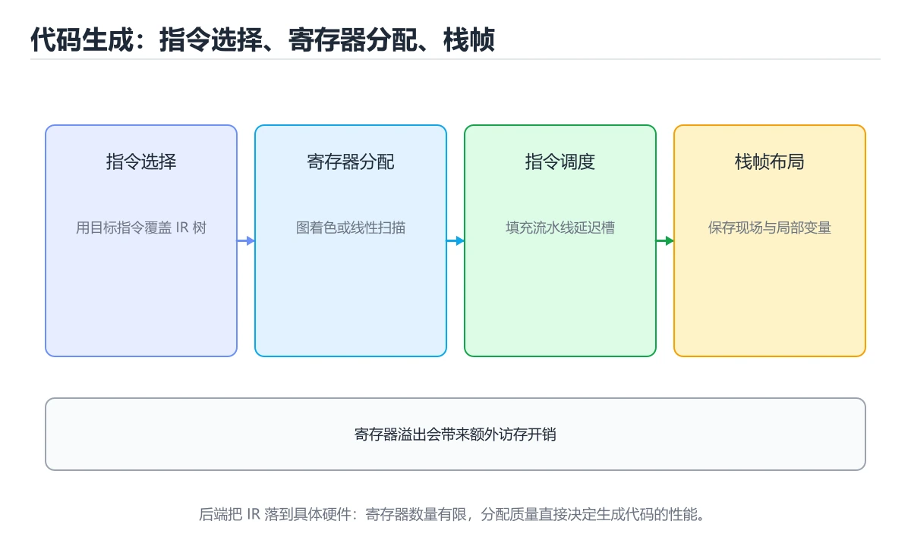
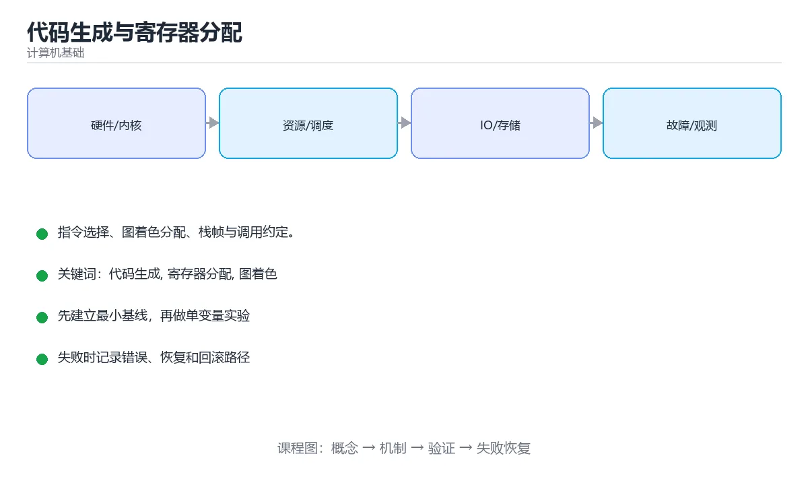

# 代码生成与寄存器分配

> 内容更新时间：2026-10-03





## 学习目标

- 能用自己的话解释代码生成与寄存器分配解决了什么问题，而不是只背术语。
- 能说清 「代码生成」、「寄存器分配」、「图着色」、「栈帧」 之间的关系，并分别举出一个例子。
- 能把本课知识放回「计算机基础」的知识体系，说明它和相邻主题的边界。
- 能完成本课练习，并用验收标准检查自己的结果。

> 一句话摘要：指令选择、图着色分配、栈帧与调用约定。

## 前置知识

- 先完成上一课《中间代码与优化》；如果已经掌握，可以直接用本课练习自测。
- 本课阶段：进阶。建议先掌握同一分类的基础课程，并能独立运行正文中的最小示例。
- 开始前先复习：代码生成、寄存器分配、图着色。
- 如果某一步看不懂，先记录具体卡点，完成练习后再回头读一遍。

## 后端的三件事

```text
IR → 指令选择 → 寄存器分配 → 指令调度 → 目标机器码
```

1. **指令选择**：把 IR 操作映射到具体指令（可能一条 IR 对应多条机器指令，也可能用一条复杂指令覆盖多步）。
2. **寄存器分配**：把无限多的虚拟寄存器映射到有限的物理寄存器，必要时溢出到栈。
3. **指令调度**：重排指令以填充流水线气泡、隐藏访存延迟。

## 指令选择的常见方法

| 方法 | 说明 |
| --- | --- |
| 模板匹配 | 为每个 IR 模式准备指令模板，实现简单 |
| 树覆盖 / 动态规划 | 在表达式树上找最小代价覆盖，能产出更好的代码 |

要考虑寻址模式（`base + index*scale + offset`）、立即数范围、指令长度等约束。

## 寄存器分配

**图着色法**是经典方案：把每个虚拟寄存器看作节点，若两者同时活跃（生命周期重叠）就连一条边；用 k 种颜色着色（k = 物理寄存器数），颜色冲突的节点必须溢出到栈。

溢出（spill）会增加 load/store，因此启发式规则很关键：优先溢出使用次数少、循环外、重算代价低的变量。

**活跃变量分析**（liveness analysis）是分配的前提：一个变量在「定义之后、最后一次使用之前」是活跃的。

## 调用约定与栈帧

函数调用要遵守 ABI 约定：哪些寄存器传参、返回值放哪、哪些由被调用者保存（callee-saved）。栈帧通常包含返回地址、保存的寄存器、局部变量与临时空间，并对齐到 16 字节以满足 SIMD 要求。

## 指令调度与流水线

重排指令填补延迟槽，避免「刚算完就依赖结果」的停顿。现代 CPU 有乱序执行，编译器调度的收益变小，但对嵌入式与 GPU 等顺序执行的架构依然重要。

## 本课小结
后端把与机器无关的 IR 变成高效机器码，核心是**指令选择、图着色寄存器分配、指令调度**三件事，外加对调用约定与栈帧的精确处理。

## 代码生成流程速查

| 阶段 | 输入 | 输出 | 关键问题 |
| --- | --- | --- | --- |
| 指令选择 | IR | 目标指令序列 | 用最合适的指令覆盖模式 |
| 指令调度 | 指令序列 | 重排后的序列 | 隐藏流水线延迟 |
| 寄存器分配 | 活跃区间 | 虚拟到物理寄存器映射 | 冲突与溢出 |
| 溢出处理 | 溢出变量 | 栈槽访问 | 插入存取指令 |
| 窥孔优化 | 局部指令序列 | 更精简的序列 | 合并冗余指令 |

## 寄存器分配速查

| 概念 | 含义 |
| --- | --- |
| 活跃变量分析 | 变量在某点之后是否还会被使用 |
| 干涉图 | 同时活跃的变量之间连边 |
| 图着色 | 用 k 种颜色（寄存器）给节点着色 |
| 溢出（spill） | 颜色不够时把变量放到栈上 |
| 溢出代价 | 按使用频率挑选代价最低的变量溢出 |
| 合并（coalescing） | 把拷贝相关变量分配到同一寄存器 |
| 调用约定 | 规定哪些寄存器跨调用必须保留 |

```python
def live_ranges(instructions):
    """极简活跃区间：返回每个变量首次与最后出现的下标。"""
    ranges = {}
    for index, (defs, uses) in enumerate(instructions):
        for name in list(defs) + list(uses):
            start, _ = ranges.get(name, (index, index))
            ranges[name] = (min(start, index), index)
    return ranges

def build_interference(ranges):
    """区间重叠即干涉，需要分配不同寄存器。"""
    names = list(ranges)
    graph = {name: set() for name in names}
    for i, a in enumerate(names):
        for b in names[i + 1:]:
            a_start, a_end = ranges[a]
            b_start, b_end = ranges[b]
            if a_start <= b_end and b_start <= a_end:   # 区间相交
                graph[a].add(b)
                graph[b].add(a)
    return graph

def greedy_color(graph, k):
    """按度数降序贪心着色；返回 None 表示需要溢出。"""
    color = {}
    for node in sorted(graph, key=lambda n: -len(graph[n])):
        used = {color[nbr] for nbr in graph[node] if nbr in color}
        choice = next((c for c in range(k) if c not in used), None)
        if choice is None:
            return None
        color[node] = choice
    return color

instructions = [
    ({"a"}, set()),
    ({"b"}, {"a"}),
    ({"c"}, {"a", "b"}),
]
ranges = live_ranges(instructions)
graph = build_interference(ranges)
print(ranges, graph)
print(greedy_color(graph, k=2))       # 3 个活跃变量但只有 2 个寄存器时返回 None
```

## 常见错误对照表

| 容易写错的做法 | 实际现象 | 原因与正确做法 |
| --- | --- | --- |
| 活跃区间边界算错 | 干涉图错误 | 明确区间是闭区间还是半开区间 |
| 忽略调用约定 | 跨调用寄存器被破坏 | 标记易失寄存器并避免长期占用 |
| 溢出变量选择不当 | 频繁访存拖慢程序 | 优先溢出使用频率低的变量 |
| 忘记插入存取指令 | 数据不一致 | 溢出点前后要成对 load 与 store |
| 只做局部寄存器分配 | 性能差 | 使用全局图着色或线性扫描 |
| 指令选择只看单条指令 | 错过更优组合 | 做模式匹配与窥孔优化 |
| 调度破坏数据依赖 | 结果错误 | 遵守数据与控制依赖 |
| 忽略分支延迟槽 | RISC 上性能下降 | 按目标架构填充分支延迟槽 |
| 认为更多寄存器总是更快 | 结论片面 | 寄存器数量受架构限制，需要平衡 |
| 忽略调试信息 | 堆栈无法映射源码 | 生成映射表便于调试与剖析 |

## 自测清单

- [ ] 能说出代码生成的几个阶段。
- [ ] 能用活跃变量分析构建干涉图。
- [ ] 知道图着色与溢出的关系。
- [ ] 明白调用约定对寄存器分配的影响。
- [ ] 知道需要保留源码映射以便调试。

## 动手练习

> 本课练习重点：围绕「代码生成、寄存器分配、图着色」完成复述、实验和交付，每个结果都要能被别人检查。

先用表格或时序图描述机制，再手算一个最小例子，最后用程序验证。

### 练习 1：建立心智模型（10 分钟）

合上教程，用 3～5 句话回答：

1. 代码生成与寄存器分配解决了什么问题？
2. 如果没有它，会出现什么具体后果？
3. 它和「寄存器分配」是什么关系？

**验收标准**：至少出现一个本课关键词，并写出一个反例、边界条件或失效场景。

### 练习 2：做一次可控实验（20 分钟）

从正文中选一个最小示例，完成以下操作：

1. 先预测修改一个参数、输入或步骤后的结果。
2. 再实际执行或逐步推演，记录真实结果。
3. 如果结果与预测不同，写出差异原因。

**验收标准**：留下「原例 → 改动 → 预测 → 结果 → 原因」五步记录。

### 练习 3：交付一个小结果（30 分钟）

用表格、真值表或计算过程把抽象概念落到一个可核对的结果上。

任务要求：

- 结果必须能被别人检查，不能只写“我已经理解了”。
- 至少覆盖「代码生成」和「寄存器分配」两个关键词。
- 写出 1 个仍然不确定的问题，以及下一步如何验证。

> 提示：时间有限时优先做练习 1 和练习 2；练习 3 可以拆成两次完成。

## 深入补充：代码生成与寄存器分配

前面已经建立了基本概念。这一节换一个角度，把代码生成与寄存器分配放进真实工程里，
重点回答三件事：它为什么存在、内部如何运转、什么时候会失效。

### 一、核心模型

代码生成把中间表示翻译成目标指令，寄存器分配把无限虚拟寄存器映射到有限物理寄存器；两者共同决定生成代码的正确性、指令数和运行性能。

```text
带类型 IR → 指令选择 → 寄存器分配/溢出 → 指令调度 → 目标代码 → 汇编与链接
```

### 二、关键机制拆解

1. 指令选择把 IR 操作匹配到目标指令，可能利用寻址模式和多指令组合。
2. 寄存器分配通常先做活跃变量分析，构建冲突图，再进行图着色或线性扫描。
3. 寄存器不足时把变量溢出到栈槽，溢出会增加访存和性能开销。
4. 调用约定规定参数、返回值和被调用者保存寄存器，代码生成必须严格遵守。
5. 指令调度在依赖约束内重排指令，隐藏访存延迟并提高流水线利用率。
6. 常量传播、公共子表达式消除和死代码消除通常在生成前完成，减少后续压力。
7. 生成代码必须经过正确性测试，包括边界值、异常路径和 ABI 兼容测试。

### 三、对照表：抓住容易混淆的边界

| 维度 | 一侧 | 另一侧 |
| --- | --- | --- |
| 虚拟寄存器 | 数量无限，便于优化 | 必须映射到有限物理寄存器 |
| 线性扫描 | 按活跃区间快速分配 | 速度快但质量略低 |
| 图着色 | 构建冲突图后着色 | 质量高但编译开销大 |
| 溢出 | 寄存器不够时写回栈 | 保证正确但增加访存 |

### 四、工作示例

循环中变量 a、b、c 同时活跃，但可用寄存器只有两个。分配器选择一个变量溢出到栈槽，在每次使用前重新加载；若通过重排减少活跃区间，可能完全避免溢出。

### 五、常见误区与失效边界

| 错误做法或假设 | 后果 | 正确做法 |
| --- | --- | --- |
| 忽略调用约定 | 函数调用后寄存器值被破坏 | 按 ABI 保存被调用者寄存器 |
| 只看指令数不看依赖 | 调度后性能下降 | 结合延迟、吞吐和流水线约束 |
| 溢出处理破坏活跃性 | 生成代码结果错误 | 溢出后更新冲突图和活跃区间 |
| 缺少边界测试 | 优化在极端输入下失败 | 覆盖整数溢出、空值和异常路径 |

### 六、场景推演

生成的循环比手写汇编慢一倍。火焰图显示大量栈溢出加载。通过减少同时活跃变量、复用临时寄存器并调整指令顺序，溢出次数下降，性能接近手写版本。

### 七、自测问答

**Q1：寄存器分配为什么是 NP 难问题？**

冲突图着色在最坏情况下属于 NP 难，编译器使用近似算法。

**Q2：溢出是什么？**

寄存器不足时把变量暂时存到栈上，使用时再加载。

**Q3：调用约定为什么重要？**

它保证不同函数和模块之间参数、返回值和寄存器保存规则一致。

**Q4：指令调度受什么限制？**

数据依赖、控制依赖、寄存器压力和流水线约束。

### 八、小项目：把知识变成可检查的产出

为一个表达式语言实现简单代码生成：先构建 IR，再做活跃变量分析和线性扫描分配，最后输出伪汇编；测试嵌套表达式和寄存器不足两种场景。

### 九、适用边界

代码生成决定如何执行，但不能弥补错误算法和低效数据结构。优化必须在正确性测试保护下进行，且要测量真实收益。

### 十、完成检查清单

- [ ] 能解释指令选择与调度
- [ ] 能描述寄存器分配流程
- [ ] 能处理溢出和调用约定
- [ ] 能分析生成代码性能
- [ ] 能编写边界与 ABI 测试

### 十一、复习顺序

1. 先不看资料复述“核心模型”，确认能说出它解决的三个问题。
2. 再对照表逐行解释容易混淆的概念，每个概念补一个反例。
3. 跟着工作示例做一遍，改变一个条件并预测结果。
4. 用自测问答检查理解，错题回到对应小节重新阅读。
5. 最后完成小项目，把结果、失败记录和复查清单整理成一份可提交产物。

> 复习不是重读一遍，而是离开原文重新产出：复述、改写、验证、复盘。

## 可运行练习

### 任务 1：先跑通，再解释

```python
def live_ranges(instructions):
    """极简活跃区间：返回每个变量首次与最后出现的下标。"""
    ranges = {}
    for index, (defs, uses) in enumerate(instructions):
        for name in list(defs) + list(uses):
            start, _ = ranges.get(name, (index, index))
            ranges[name] = (min(start, index), index)
    return ranges

def build_interference(ranges):
    """区间重叠即干涉，需要分配不同寄存器。"""
    names = list(ranges)
    graph = {name: set() for name in names}
    for i, a in enumerate(names):
        for b in names[i + 1:]:
            a_start, a_end = ranges[a]
            b_start, b_end = ranges[b]
            if a_start <= b_end and b_start <= a_end:   # 区间相交
                graph[a].add(b)
                graph[b].add(a)
    return graph

def greedy_color(graph, k):
    """按度数降序贪心着色；返回 None 表示需要溢出。"""
    color = {}
    for node in sorted(graph, key=lambda n: -len(graph[n])):
        used = {color[nbr] for nbr in graph[node] if nbr in color}
        choice = next((c for c in range(k) if c not in used), None)
        if choice is None:
            return None
        color[node] = choice
    return color

instructions = [
    ({"a"}, set()),
    ({"b"}, {"a"}),
    ({"c"}, {"a", "b"}),
]
ranges = live_ranges(instructions)
graph = build_interference(ranges)
print(ranges, graph)
print(greedy_color(graph, k=2))       # 3 个活跃变量但只有 2 个寄存器时返回 None
```

### 任务 2：只改一个条件

把「代码生成与寄存器分配」的最小示例复制一份，只改一个条件再跑一次：

- 改动点：只把代码生成的输入换成空值、极值或错误输入，其余保持不变。
- 预测：先写下「代码生成与寄存器分配」在改动后的输出或错误信息，再运行。
- 记录：对照改动前后的结果，指出差异出在哪一步。
- 验收：换回原条件能复现原结果，改动只影响代码生成。

### 任务 3：迁移到自己的数据

用同一套思路处理一组你自己的数据或场景，保持输出格式与任务 1 一致。

## 故障现场

### 现场 1：本课的 代码生成 常规用例通过，但边界用例失败

**症状**：在本课的练习或生产场景里出现“本课的 代码生成 常规用例通过，但边界用例失败”。

**复现**：准备一组最小输入，只保留触发“本课的 代码生成 常规用例通过，但边界用例失败”的必要条件，连续运行两次确认结果稳定。

**定位**：围绕“代码生成 的前置条件与取值边界没有写进代码，默认值掩盖了空值和极值”检查调用链、输入数据和环境配置，先验证假设再改代码。

**预防**：把“本课的 代码生成 常规用例通过，但边界用例失败”写成一条自动化用例，并在本课的验收清单里保留对应检查项。

### 现场 2：本课的 寄存器分配 结果在两次运行之间不一致

**症状**：在本课的练习或生产场景里出现“本课的 寄存器分配 结果在两次运行之间不一致”。

**复现**：准备一组最小输入，只保留触发“本课的 寄存器分配 结果在两次运行之间不一致”的必要条件，连续运行两次确认结果稳定。

**定位**：围绕“寄存器分配 依赖了当前版本、执行顺序或共享状态，单次运行无法暴露差异”检查调用链、输入数据和环境配置，先验证假设再改代码。

**预防**：把“本课的 寄存器分配 结果在两次运行之间不一致”写成一条自动化用例，并在本课的验收清单里保留对应检查项。

### 现场 3：本课的验证只在开发机通过

**症状**：在本课的练习或生产场景里出现“本课的验证只在开发机通过”。

**定位**：围绕“环境版本、配置和输入规模与目标环境不同，代码生成 缺少可重复的验证记录”检查调用链、输入数据和环境配置，先验证假设再改代码。

## 本课复习清单

离开本课前，逐项确认：

- [ ] 不看解析，能说出「经典的寄存器分配算法是？」的判断依据。
- [ ] 不看解析，能说出「寄存器分配中的「溢出（spill）」指？」的判断依据。
- [ ] 不看解析，能说出「活跃变量分析回答的问题是？」的判断依据。
- [ ] 不看解析，能说出「指令选择（instruction selection）要解决的问题是？」的判断依据。
- [ ] 不看解析，能说出「指令调度（instruction scheduling）的主要目标是？」的判断依据。
- [ ] 至少运行一次本课示例，记录输入、输出和一个边界情况。
- [ ] 把本课最容易混淆的两个概念写成一句话对照。

| 复盘项 | 记录 |
| --- | --- |
| 已经能独立解释的考点 |  |
| 仍然说不清的概念 |  |
| 下一步验证动作 |  |

## 术语速查

| 术语 | 本课语境 |
| --- | --- |
| `base + index*scale + offset` | 要考虑寻址模式（`base + index*scale + offset`）、立即数范围、指令长度等约束。 |
| `代码生成` | 围绕“环境版本、配置和输入规模与目标环境不同，代码生成 缺少可重复的验证记录”检查调用链、输入数据和环境配置，先验证假设再改代码。 |
| `寄存器分配` | 围绕“寄存器分配 依赖了当前版本、执行顺序或共享状态，单次运行无法暴露差异”检查调用链、输入数据和环境配置，先验证假设再改代码。 |
| `图着色` | 它在「代码生成与寄存器分配」里是理解「图着色」的关键术语，用来解释定义、适用条件与失败路径；它与代码生成、寄存器分配共同决定这一节的判断边界。复习时回到正文示例核对输入、输出和验证方式。 |
| `栈帧` | 它在「代码生成与寄存器分配」里是理解「栈帧」的关键术语，用来解释定义、适用条件与失败路径；它与代码生成、寄存器分配共同决定这一节的判断边界。复习时回到正文示例核对输入、输出和验证方式。 |
| `ABI` | 函数调用要遵守 ABI 约定：哪些寄存器传参、返回值放哪、哪些由被调用者保存（callee-saved）。 |

## 考点精讲

### 考点 1：顺序排列·代码生成

- **题目**：按“代码生成与寄存器分配”中 代码生成、寄存器分配、图着色 的实践顺序，把四个步骤排成从准备到复盘的合理顺序。
- **判断依据**：题干的正确项是固定版本与证据，把“代码生成与寄存器分配”的结论写成可复现记录。在「代码生成与寄存器分配」里，在本课的练习里，顺序应当是：先明确 代码生成 的输入、输出与约束 → 写出最小示例并核对 寄存器分配 的基线结果 → 只改一个变量，记录边界与失败路径的变化 → 固定版本与证据，把本课的结论写成可复现记录。这个顺序把 代码生成 的输入、输出和约束放在最前面，在代码生成与寄存器分配里避免概念没对齐就开始调参。第二步用 寄存器分配 建立可核对的基线，在代码生成与寄存器分配里第三步才允许改变一个变量并观察失败路径。

### 考点 2：概念判断·代码生成

- **题目**：「代码生成与寄存器分配」的核心结论是什么？
- **判断依据**：题干的正确项是代码生成与寄存器分配：指令选择、图着色分配、栈帧与调用约定。在「代码生成与寄存器分配」里，把代码生成、寄存器分配、图着色放进最小示例验证，换成空值或极值后结论仍要成立。在「代码生成与寄存器分配」里判断这道题，要把代码生成、寄存器分配、图着色的条件、过程与失败路径逐项对齐，换成“代码生成与寄存器分配的核心结论是什么”这个场景，只有满足前提的结论才成立。

### 考点 3：概念判断·代码生成

- **题目**：活跃变量分析回答的问题是？
- **判断依据**：在「代码生成与寄存器分配」里，作答时，先用代码生成建立输入与输出的基线，再把变量在某个位置之后是否还会被使用代入边界条件核对，结论才能复现。在「代码生成与寄存器分配」里判断这道题，要把代码生成、寄存器分配、图着色的条件、过程与失败路径逐项对齐，换成“活跃变量分析回答的问题是”这个场景，只有满足前提的结论才成立。

### 考点 4：概念判断·代码生成

- **题目**：指令选择（instruction selection）要解决的问题是？
- **判断依据**：在「代码生成与寄存器分配」里，结论应落在「用最合适的机器指令组合覆盖中间表示的模式，兼顾效率与合法性」。结论应落在用最合适的机器指令组合覆盖中间表示的模式。常用树覆盖（tree covering）或自底向上重写的方式实现。在「代码生成与寄存器分配」里，这道题要求区分概念与边界，「用最合适的机器指令组合覆盖中间表示的模式，兼顾效率与合法性」只有在题干给出的前提下才成立，而「决定寄存器数量」、「分配栈空间大小」缺少同一组条件。

### 考点 5：概念判断·代码生成

- **题目**：指令调度（instruction scheduling）的主要目标是？
- **判断依据**：在「代码生成与寄存器分配」里，重排指令顺序以隐藏流水线延迟、提高指令级并行。现代乱序执行的 CPU 会自行调度，但编译器调度仍能减少停顿。回到「代码生成与寄存器分配」的正文示例，用“指令调度（instruction s”走一遍代码生成、寄存器分配、图着色的完整流程，能复现的结论才可以保留。

### 考点 6：多选辨析·代码生成

- **题目**：以下哪些术语与「代码生成与寄存器分配」直接相关？（多选）
- **判断依据**：寄存器分配是否完整覆盖题干的输入、输出和失败路径，并排除代码生成、NTFS这类相邻概念。在「代码生成与寄存器分配」里判断这道题，要把代码生成、寄存器分配、图着色的条件、过程与失败路径逐项对齐，换成“以下哪些术语与代码生成与寄存器分配直”这个场景，只有满足前提的结论才成立。

## English Overview

**Title:** Codegen & Register Allocation

**Summary:** Instruction selection, graph coloring and stack frames.

**Category:** Fundamentals
**Level:** 进阶
**Key terms:** 代码生成, 寄存器分配, 图着色, 栈帧, ABI

## 内容元数据

- 内容版本：v2.0
- 最后更新：2026-10-03
- 学习阶段：进阶
- 适用环境：通用计算机体系结构知识
- 内容来源：内置结构化课程与工程实践整理
- 相关主题：代码生成、寄存器分配、图着色、栈帧、ABI
- 质量版本：P0 测验标准 + P1 覆盖扩展 + P2 体验补全

## 参考资料与复核

- 最后复核：2026-10-04
- 下次复核：2027-04-04
- 复核范围：版本兼容、API 行为、安全建议与工程实践
- 来源性质：官方文档、标准或权威教材；正文为离线教学重组

| 参考资料 | 本课用途 |
| --- | --- |
| [Arm 架构文档](https://developer.arm.com/documentation) | 处理器与内存体系结构 |
| [CS50 计算机科学导论](https://cs50.harvard.edu/x/) | 计算机科学综合入门 |
| [Nand2Tetris](https://www.nand2tetris.org/) | 从逻辑门到计算机系统 |

> 「代码生成与寄存器分配」的链接用于离线阅读后的延伸核对；App 不会自动联网。
