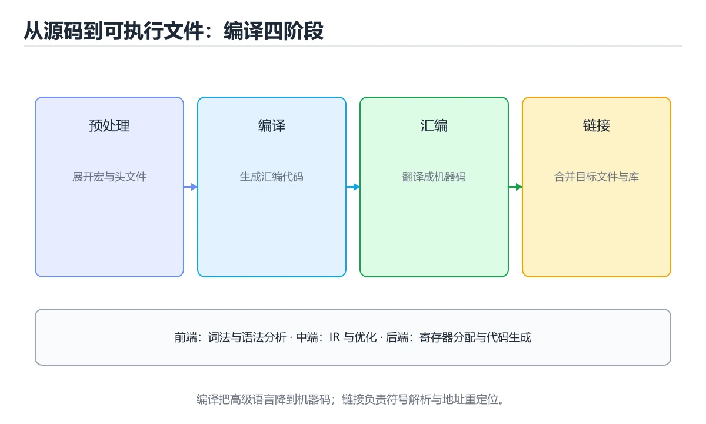
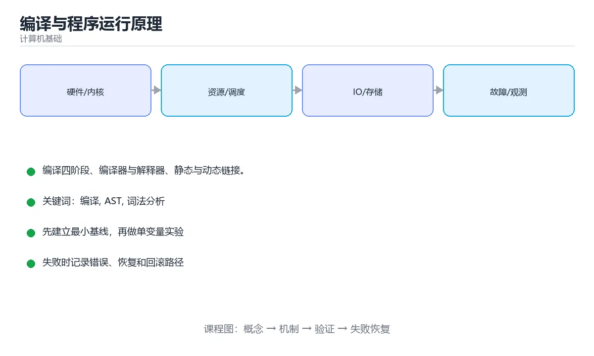

# 编译与程序运行原理





> 内容更新时间：2026-10-03 · 学习阶段：高级 · 预计用时：14 分钟

## 学习目标

- 能用自己的话解释「编译与程序运行原理」解决了什么问题，而不是只背术语。
- 能说清 「编译」、「AST」、「词法分析」、「链接」 之间的关系，并分别举出一个例子。
- 能把本课知识放回「计算机基础」的知识体系，说明它和相邻主题的边界。
- 能完成本课练习，并用验收标准检查自己的结果。

> 一句话摘要：编译四阶段、编译器与解释器、静态与动态链接。

## 前置知识

- 先完成上一课《字符编码与 Unicode》；如果已经掌握，可以直接用本课练习自测。
- 本课阶段：高级。建议具备同一方向的完整基础，能阅读较长的代码、配置或系统设计说明。
- 开始前先复习：编译、AST、词法分析。
- 如果某一步看不懂，先记录具体卡点，完成练习后再回头读一遍。


## 编译的四个阶段

```text
源码 -> 词法分析 -> 语法分析 -> 语义分析 -> 中间代码 -> 优化 -> 目标代码
        Token 流     语法树 AST   类型检查      IR        机器码
```

1. **词法分析**：把字符流切成 Token，如 `int`、`x`、`=`、`10`。
2. **语法分析**：按语法规则构造抽象语法树（AST）。
3. **语义分析**：类型检查、作用域解析、符号表构建。
4. **代码生成与优化**：生成中间表示并优化，最终产出目标代码。

## 编译器与解释器

| 方式 | 过程 | 代表 |
| --- | --- | --- |
| 编译执行 | 一次性翻译成机器码再运行 | C、C++、Rust、Go |
| 解释执行 | 逐条读取并执行 | Python、Ruby |
| 混合（JIT） | 先编译成字节码，热点再编译成机器码 | Java、C#、JavaScript |

## 链接

多个源文件编译成目标文件后，链接器负责：

- **符号解析**：把函数调用与定义对应起来。
- **重定位**：确定最终内存地址。
- **静态链接 vs 动态链接**：库代码是复制进可执行文件，还是运行时加载 `.so`/`.dll`。

```bash
gcc -c math.c -o math.o      # 编译成目标文件
gcc main.o math.o -o app     # 链接
ldd app                      # 查看依赖的动态库
```

## 优化举例

```c
// 优化前：每次循环都调用函数
for (int i = 0; i < strlen(s); i++) { }

// 优化后：把长度提到循环外（人工 + 编译器都会做）
size_t len = strlen(s);
for (size_t i = 0; i < len; i++) { }
```

编译器优化不能改变程序语义，但依赖「无未定义行为」这一前提——所以 UB 会让优化结果难以预测。

## 本课小结
理解编译流程的价值在于：能区分**语法错误、类型错误与链接错误**，并知道性能问题可能出在哪个阶段。


## 编译流程速查

| 阶段 | 输入 | 输出 | 常见错误 |
| --- | --- | --- | --- |
| 词法分析 | 源码字符流 | Token 序列 | 非法字符、未闭合字符串 |
| 语法分析 | Token 序列 | 语法树 / AST | 缺少括号、分号 |
| 语义分析 | AST + 符号表 | 带类型信息的 AST | 类型不匹配、未定义变量 |
| 中间代码生成 | AST | IR（三地址码、SSA） | 少见 |
| 优化 | IR | 更优 IR | 优化错误（罕见但致命） |
| 目标代码生成 | IR | 汇编 | 寄存器分配失败 |
| 汇编与链接 | 汇编 | 可执行文件 | 未定义符号、重复定义 |

## 错误类型对照

| 错误 | 出现阶段 | 例子 | 谁的责任 |
| --- | --- | --- | --- |
| 编译错误 | 编译期 | `expected ';'`、类型不匹配 | 改代码 |
| 链接错误 | 链接期 | `undefined reference to foo` | 补实现或加库 |
| 运行错误 | 运行期 | 空指针、数组越界 | 加校验与测试 |
| 逻辑错误 | 运行期 | 结果不符合预期 | 检查算法与边界 |
| 未定义行为 | 任意 | 越界写、有符号溢出 | 严格避免，用 sanitizer 检测 |

## 编译型与解释型对照

| 方式 | 执行过程 | 优点 | 缺点 | 例子 |
| --- | --- | --- | --- | --- |
| 编译为机器码 | 源码 → 可执行文件 | 启动快、性能高 | 需按平台编译 | C、C++、Rust、Go |
| 编译为字节码 + 虚拟机 | 源码 → 字节码 → JIT | 跨平台、可优化 | 需运行时 | Java、C# |
| 解释执行 | 边翻译边执行 | 灵活、启动快 | 性能较低 | 早期 Python、Shell |
| JIT 混合 | 解释 + 热点编译 | 兼顾启动与峰值性能 | 实现复杂、预热 | V8、JVM、PyPy |

```python
# 用 dis 查看 Python 字节码，理解「编译到字节码 + 解释执行」
import dis

def add(a, b):
    return a + b

dis.dis(add)

# 用 ast 查看语法树，理解「语法分析产出 AST」
import ast

tree = ast.parse("result = 1 + 2 * 3")
print(ast.dump(tree, indent=2))
```

## 常见错误对照表

| 容易写错的做法 | 实际现象 | 原因与正确做法 |
| --- | --- | --- |
| 把链接错误当成语法错误 | 排查方向错误 | 看错误措辞：`undefined reference` 属于链接期 |
| 认为编译通过就没有错误 | 运行时崩溃 | 编译只保证语法与类型层面 |
| 忽略告警 | 潜在 bug 遗留 | 打开 `-Wall -Wextra -Werror` |
| 认为解释型语言没有编译过程 | 结论片面 | Python 也先编译成字节码 |
| 混淆「未定义行为」与「运行错误」 | 优化后行为诡异 | UB 不保证任何结果，必须消除 |
| 头文件里定义全局变量 | 多重定义 | 用 `extern` 声明或 `inline` |
| 忘记加 `-g` 调试 | 堆栈没有行号 | 编译时加调试信息 |
| 用 Debug 构建测性能 | 数据无参考价值 | 用 Release 构建 |
| 忽略平台差异 | 本地能编、CI 失败 | 固定编译器版本与标准 |
| 直接改编译产物 | 不可维护 | 改源码重新编译 |

## 自测清单

- [ ] 能按顺序说出编译的各个阶段与产物。
- [ ] 能区分编译错误、链接错误与运行错误。
- [ ] 知道 Python、Java 也都有编译到字节码的过程。
- [ ] 理解未定义行为的危害。
- [ ] 会用 `dis`、`ast` 等工具观察中间产物。


## 补充：从源码到机器码的六步与常见优化

### 编译六步：每一步产出什么

```text
源码
 │ ① 词法分析：切成 token（关键字、标识符、字面量）
 ▼
Token 流
 │ ② 语法分析：按文法组装成抽象语法树 AST
 ▼
AST
 │ ③ 语义分析：类型检查、作用域解析、生成符号表
 ▼
带类型标注的 AST
 │ ④ 中间代码生成：转成三地址码或 SSA
 ▼
IR
 │ ⑤ 优化：常量折叠、内联、循环优化
 ▼
优化后的 IR
 │ ⑥ 目标代码生成 + 寄存器分配
 ▼
汇编 / 机器码
```

| 阶段 | 出错时报什么 | 典型例子 |
| --- | --- | --- |
| 词法 | 非法字符 | 中文标点、未闭合字符串 |
| 语法 | 期望某符号 | 少写括号/分号 |
| 语义 | 类型不匹配 | `int` 赋值给 `String` |
| 优化/链接 | 未定义符号 | 声明了没实现 |

### 三地址码与 SSA

```text
源码：a = (b + c) * (b + c)

三地址码（每条最多一个运算符）
  t1 = b + c
  t2 = b + c        ← 重复计算
  a  = t1 * t2

优化后（公共子表达式消除）
  t1 = b + c
  a  = t1 * t1

SSA 形式（每个变量只赋值一次，带下标）
  t1_0 = b + c
  a_1  = t1_0 * t1_0
```

**SSA 的价值**：让「变量在哪些路径被赋值」一目了然，因此常量传播、
死代码消除与寄存器分配都更容易实现。

### 六种常见优化

| 优化 | 做什么 | 例子 |
| --- | --- | --- |
| 常量折叠 | 编译期算出常量表达式 | `3 * 4` → `12` |
| 常量传播 | 把已知常量代入后续使用 | `x = 5; y = x + 1` → `y = 6` |
| 公共子表达式消除 | 复用重复计算 | `(b+c)` 只算一次 |
| 死代码消除 | 删除永远不执行或结果未使用 | `if (false) {...}` |
| 循环不变量外提 | 把循环内不变的计算移出 | 循环里 `len(arr)` 只算一次 |
| 内联 | 把短函数展开到调用处 | 小 getter 直接替换 |

```text
优化的前提：不改变可观察行为
  编译器只会在「行为等价」的前提下优化。
  这也解释了为什么未定义行为（UB）危险：
  一旦触发 UB，编译器可以假设它不会发生，从而做出「反直觉」的优化。
```

### 优化级别与代价

| 级别 | 特点 | 适用 |
| --- | --- | --- |
| `-O0` | 不做优化，变量都在内存里 | 调试 |
| `-O1` | 基础优化，编译快 | 日常开发 |
| `-O2` | 大多数优化，性能与体积平衡 | **发布默认** |
| `-O3` | 激进优化（含向量化） | 计算密集、经测试验证 |
| `-Os` | 侧重体积 | 移动端、嵌入式 |

```bash
# 看某段代码被优化成什么样
g++ -O2 -S demo.cpp -o demo.s
clang -O2 -S -emit-llvm demo.cpp -o demo.ll    # 看 LLVM IR

# 让编译器解释为什么没优化
gcc -O2 -fopt-info-vec demo.cpp
```

### AOT 与 JIT 的取舍

| 维度 | AOT（C++/Rust/Go） | JIT（Java/C#/JS） |
| --- | --- | --- |
| 启动速度 | 快 | 需要预热 |
| 峰值性能 | 稳定 | 可依据运行时数据优化，可能更高 |
| 跨平台 | 需各自编译 | 中间码跨平台 |
| 调试与热更新 | 不便 | 相对容易 |
| 确定性 | 强 | 受运行时影响 |

### 自查清单

- [ ] 能按顺序说出编译六步与各自产出
- [ ] 能写出三地址码并把同一表达式改成 SSA
- [ ] 知道六种常见优化各自解决什么
- [ ] 知道 UB 为什么会带来「反直觉」的优化
- [ ] 能说出 AOT 与 JIT 各自适合什么场景

## 动手练习


> 本课练习重点：围绕「编译、AST、词法分析」完成复述、实验和交付，每个结果都要能被别人检查。

先用表格或时序图描述机制，再手算一个最小例子，最后用程序验证。

### 练习 1：建立心智模型（10 分钟）

合上教程，用 3～5 句话回答：

1. 「编译与程序运行原理」解决了什么问题？
2. 如果没有它，会出现什么具体后果？
3. 它和「AST」是什么关系？

**验收标准**：至少出现一个本课关键词，并写出一个反例、边界条件或失效场景。

### 练习 2：做一次可控实验（20 分钟）

从正文中选一个最小示例，完成以下操作：

1. 先预测修改一个参数、输入或步骤后的结果。
2. 再实际执行或逐步推演，记录真实结果。
3. 如果结果与预测不同，写出差异原因。

**验收标准**：留下「原例 → 改动 → 预测 → 结果 → 原因」五步记录。

### 练习 3：交付一个小结果（30 分钟）

用表格、真值表或计算过程把抽象概念落到一个可核对的结果上。

任务要求：

- 结果必须能被别人检查，不能只写“我已经理解了”。
- 至少覆盖「编译」和「AST」两个关键词。
- 写出 1 个仍然不确定的问题，以及下一步如何验证。

> 提示：时间有限时优先做练习 1 和练习 2；练习 3 可以拆成两次完成。


## 可运行练习

下面 3 个任务围绕“编译与程序运行原理”展开，代码可以直接粘贴到 App 的离线沙箱里运行；如果示例会读取标准输入，请按代码注释在沙箱的 stdin 区域填入同样格式的数据。

### 任务 1：先跑通，再解释

```python
# 用 dis 查看 Python 字节码，理解「编译到字节码 + 解释执行」
import dis

def add(a, b):
    return a + b

dis.dis(add)

# 用 ast 查看语法树，理解「语法分析产出 AST」
import ast

tree = ast.parse("result = 1 + 2 * 3")
print(ast.dump(tree, indent=2))
```

**预期输出**：运行后会输出与“编译与程序运行原理”相关的关键结果；请重点核对输出行数、最后一个数值和异常提示。

**验收标准**：代码能正常运行；逐行解释每个变量的值如何变化，并指出哪一行决定了最终结果。

### 任务 2：只改一个条件

复制上面的代码，只修改一个输入、边界或参数（例如空值、最大值、循环次数、过滤条件），先写出你的预测，再实际运行。

**验收标准**：留下“原结果 → 改动 → 预测 → 实际结果 → 差异原因”五步记录；如果预测错误，要写出修正后的心智模型。

### 任务 3：迁移到自己的数据

用同一套思路处理一组你自己的数据或场景，保持输出格式与任务 1 一致。

**验收标准**：代码不少于 10 行，至少包含 1 个边界检查；把代码和运行结果保存到笔记或片段库。


## 故障现场

这一节把“编译与程序运行原理”最常见的失败方式还原成现场记录，练习时按“症状 → 复现 → 定位 → 修复 → 预防”的顺序排查。

### 现场 1：“编译与程序运行原理”的 编译 常规用例通过，但边界用例失败

**症状**：在“编译与程序运行原理”的练习或生产场景里出现““编译与程序运行原理”的 编译 常规用例通过，但边界用例失败”。

**复现**：准备一组最小输入，只保留触发““编译与程序运行原理”的 编译 常规用例通过，但边界用例失败”的必要条件，连续运行两次确认结果稳定。

**定位**：围绕“编译 的前置条件与取值边界没有写进代码，默认值掩盖了空值和极值”检查调用链、输入数据和环境配置，先验证假设再改代码。

**修复**：为“编译与程序运行原理”补一条空值或极值用例，把前置条件写成断言，并让失败信息直接指出是哪个输入越界

**预防**：把““编译与程序运行原理”的 编译 常规用例通过，但边界用例失败”写成一条自动化用例，并在“编译与程序运行原理”的验收清单里保留对应检查项。


### 现场 2：“编译与程序运行原理”的 AST 结果在两次运行之间不一致

**症状**：在“编译与程序运行原理”的练习或生产场景里出现““编译与程序运行原理”的 AST 结果在两次运行之间不一致”。

**复现**：准备一组最小输入，只保留触发““编译与程序运行原理”的 AST 结果在两次运行之间不一致”的必要条件，连续运行两次确认结果稳定。

**定位**：围绕“AST 依赖了当前版本、执行顺序或共享状态，单次运行无法暴露差异”检查调用链、输入数据和环境配置，先验证假设再改代码。

**修复**：固定“编译与程序运行原理”使用的版本与随机种子，记录两次运行的完整输入和输出，再逐项消除非确定性来源

**预防**：把““编译与程序运行原理”的 AST 结果在两次运行之间不一致”写成一条自动化用例，并在“编译与程序运行原理”的验收清单里保留对应检查项。


### 现场 3：“编译与程序运行原理”的验证只在开发机通过

**症状**：在“编译与程序运行原理”的练习或生产场景里出现““编译与程序运行原理”的验证只在开发机通过”。

**复现**：准备一组最小输入，只保留触发““编译与程序运行原理”的验证只在开发机通过”的必要条件，连续运行两次确认结果稳定。

**定位**：围绕“环境版本、配置和输入规模与目标环境不同，编译 缺少可重复的验证记录”检查调用链、输入数据和环境配置，先验证假设再改代码。

**修复**：把“编译与程序运行原理”的运行环境、输入样本和预期输出写成清单，并在另一套环境复跑同一条命令

**预防**：把““编译与程序运行原理”的验证只在开发机通过”写成一条自动化用例，并在“编译与程序运行原理”的验收清单里保留对应检查项。


## 考点精讲：把测验题还原成判断过程

本课有 6 个判断点。先自己作答，再看「判断依据」；如果结论正确但理由不完整，回到正文对应章节补足概念。

### 考点 1：语法分析阶段的主要产物是？

- **正确判断**：抽象语法树 AST
- **判断依据**：正确答案是「抽象语法树 AST」，本课在「编译的四个阶段」中说明：语法分析：按语法规则构造抽象语法树（AST）。词法分析产出 Token，语法分析据此构建 AST，后续语义分析与代码生成都基于它。本课还在「链接」中说明：静态链接 vs 动态链接：库代码是复制进可执行文件，还是运行时加载 .so/.dll。本课还在「编译的四个阶段」中说明：词法分析：把字符流切成 Token，如 int、x、=、10。
- **迁移检查**：遮住选项，只根据定义复述一次答案，再回来看哪个选项与复述一致。

### 考点 2：「undefined reference to function」属于哪类错误？

- **正确判断**：链接错误
- **判断依据**：正确答案是「链接错误」，本课在「本课小结」中说明：理解编译流程的价值在于：能区分语法错误、类型错误与链接错误，并知道性能问题可能出在哪个阶段。编译通过但找不到函数定义，是链接器报出的符号解析失败。本课还在「编译的四个阶段」中说明：词法分析：把字符流切成 Token，如 int、x、=、10。本课还在「编译的四个阶段」中说明：语法分析：按语法规则构造抽象语法树（AST）。
- **迁移检查**：把题干里的一个条件换成边界值，原来的结论还成立吗？写出判断过程。

### 考点 3：Java、C#、JavaScript 的共同点是？

- **正确判断**：都先编译成字节码
- **判断依据**：正确答案是「都先编译成字节码」，本课在「优化举例」中说明：编译器优化不能改变程序语义，但依赖「无未定义行为」这一前提——所以 UB 会让优化结果难以预测。它们都采用「字节码 + JIT」的混合模式，兼顾跨平台与运行性能。本课还在「编译的四个阶段」中说明：语义分析：类型检查、作用域解析、符号表构建。本课还在「链接」中说明：静态链接 vs 动态链接：库代码是复制进可执行文件，还是运行时加载 .so/.dll。
- **迁移检查**：如果给某个错误选项去掉一个限定词，它会不会变成正确？说明理由。

### 考点 4：编译器前端中负责类型检查的是哪个阶段？

- **正确判断**：语义分析
- **判断依据**：语义分析在语法树基础上做名称解析、类型检查与隐式转换标注。其他选项：类型检查在语义分析阶段完成，此时已建立符号表。针对「编译器前端中负责类型检查的是哪个阶段，」，本课在「编译的四个阶段」中说明：语义分析：类型检查、作用域解析、符号表构建。本课还在「本课小结」中说明：理解编译流程的价值在于：能区分语法错误、类型错误与链接错误，并知道性能问题可能出在哪个阶段。本课还在「编译的四个阶段」中说明：代码生成与优化：生成中间表示并优化，最终产出目标代码。
- **迁移检查**：如果给某个错误选项去掉一个限定词，它会不会变成正确？说明理由。

### 考点 5：JIT 编译的含义是？

- **正确判断**：在运行时把热点代码编译成机器码
- **判断依据**：JVM 的 C2、V8 的 TurboFan 都是 JIT，配合解释器形成分层执行策略。其他选项：JIT 在运行时把热点代码编译成机器码。课程摘要指出编译四阶段，编译器与解释器，静态与动态链接，本课要判断的正是JIT编译的含义是。这道题考查 JIT编译的含义是 与编译、AST、词法分析、链接这些概念之间的边界，判断时要把题干限定的条件逐项代入。
- **迁移检查**：如果给某个错误选项去掉一个限定词，它会不会变成正确？说明理由。

### 考点 6：以下哪些术语与「编译与程序运行原理」直接相关？（多选）

- **正确判断**：编译、AST
- **判断依据**：正确答案是「编译、AST」，本课在「补充：从源码到机器码的六步与常见优化」中说明：SSA 的价值：让「变量在哪些路径被赋值」一目了然，因此常量传播。课程摘要指出编译四阶段，编译器与解释器，静态与动态链接，本课要判断的正是以下哪些术语与编译与程序运行原理直接相关，（多选）。
- **迁移检查**：只选其中一项时会漏掉哪个必要条件？把它补进自己的答案。

### 补充自测（2 题）

1. 按“编译与程序运行原理”中 编译、AST、词法分析 的实践顺序，把四个步骤排成从准备到复盘的合理顺序。
2. 下面这段 Python 代码复现了“编译与程序运行原理”中 编译、AST、词法分析 相关的一个常见故障，哪一项最准确地解释了问题？

这些题按“先定位概念、再排除边界错误、最后核对答案”的顺序作答；每题解析都给出了判断依据。


## 本课复习清单

离开本课前，逐项确认：

- [ ] 不看解析，能说出「语法分析阶段的主要产物是？」的判断依据。
- [ ] 不看解析，能说出「「undefined reference to function」属于哪类错误？」的判断依据。
- [ ] 不看解析，能说出「Java、C#、JavaScript 的共同点是？」的判断依据。
- [ ] 不看解析，能说出「编译器前端中负责类型检查的是哪个阶段？」的判断依据。
- [ ] 不看解析，能说出「JIT 编译的含义是？」的判断依据。
- [ ] 不看解析，能说出「以下哪些术语与「编译与程序运行原理」直接相关？（多选）」的判断依据。
- [ ] 至少运行一次本课示例，记录输入、输出和一个边界情况。
- [ ] 把本课最容易混淆的两个概念写成一句话对照。

| 复盘项 | 记录 |
| --- | --- |
| 已经能独立解释的考点 |  |
| 仍然说不清的概念 |  |
| 下一步验证动作 |  |

## 术语速查

把本课反复出现的术语集中放在一起。复习时先遮住右列，尝试用自己的话解释，再回到正文核对。

| 术语 | 本课语境 |
| --- | --- |
| `int` | 词法分析**：把字符流切成 Token，如 `int`、`x`、`=`、`10`。 |
| `.so` | 静态链接 vs 动态链接**：库代码是复制进可执行文件，还是运行时加载 `.so`/`.dll`。 |
| `.dll` | 静态链接 vs 动态链接**：库代码是复制进可执行文件，还是运行时加载 `.so`/`.dll`。 |
| `expected ';'` | \| 编译错误 \| 编译期 \| `expected ';'`、类型不匹配 \| 改代码 \| |
| `undefined reference to foo` | \| 链接错误 \| 链接期 \| `undefined reference to foo` \| 补实现或加库 \| |
| `undefined reference` | \| 把链接错误当成语法错误 \| 排查方向错误 \| 看错误措辞：`undefined reference` 属于链接期 \| |
| `-Wall -Wextra -Werror` | \| 忽略告警 \| 潜在 bug 遗留 \| 打开 `-Wall -Wextra -Werror` \| |
| `extern` | \| 头文件里定义全局变量 \| 多重定义 \| 用 `extern` 声明或 `inline` \| |
| `inline` | \| 头文件里定义全局变量 \| 多重定义 \| 用 `extern` 声明或 `inline` \| |
| `-g` | \| 忘记加 `-g` 调试 \| 堆栈没有行号 \| 编译时加调试信息 \| |
| `dis` | [ ] 会用 `dis`、`ast` 等工具观察中间产物。 |
| `ast` | [ ] 会用 `dis`、`ast` 等工具观察中间产物。 |

## 面试问答与自测

下面把本课考点换成面试追问。先口述自己的答案，
再对照参考回答检查是否遗漏了前提、边界或失败路径。

### 追问 1：语法分析阶段的主要产物是？

**参考回答**：正确答案是「抽象语法树 AST」，本课在「编译的四个阶段」中说明：语法分析：按语法规则构造抽象语法树（AST）。词法分析产出 Token，语法分析据此构建 AST，后续语义分析与代码生成都基于它。本课还在「链接」中说明：静态链接 vs 动态链接：库代码是复制进可执行文件，还是运行时加载 .so/.dll。本课还在「编译的四个阶段」中说明：词法分析：把字符流切成 Token，如 int、x、=、10。

### 追问 2：「undefined reference to function」属于哪类错误？

**参考回答**：正确答案是「链接错误」，本课在「本课小结」中说明：理解编译流程的价值在于：能区分语法错误、类型错误与链接错误，并知道性能问题可能出在哪个阶段。编译通过但找不到函数定义，是链接器报出的符号解析失败。本课还在「编译的四个阶段」中说明：词法分析：把字符流切成 Token，如 int、x、=、10。本课还在「编译的四个阶段」中说明：语法分析：按语法规则构造抽象语法树（AST）。

### 追问 3：Java、C#、JavaScript 的共同点是？

**参考回答**：正确答案是「都先编译成字节码」，本课在「优化举例」中说明：编译器优化不能改变程序语义，但依赖「无未定义行为」这一前提——所以 UB 会让优化结果难以预测。它们都采用「字节码 + JIT」的混合模式，兼顾跨平台与运行性能。本课还在「编译的四个阶段」中说明：语义分析：类型检查、作用域解析、符号表构建。本课还在「链接」中说明：静态链接 vs 动态链接：库代码是复制进可执行文件，还是运行时加载 .so/.dll。

### 追问 4：编译器前端中负责类型检查的是哪个阶段？

**参考回答**：语义分析在语法树基础上做名称解析、类型检查与隐式转换标注。其他选项：类型检查在语义分析阶段完成，此时已建立符号表。针对「编译器前端中负责类型检查的是哪个阶段，」，本课在「编译的四个阶段」中说明：语义分析：类型检查、作用域解析、符号表构建。本课还在「本课小结」中说明：理解编译流程的价值在于：能区分语法错误、类型错误与链接错误，并知道性能问题可能出在哪个阶段。本课还在「编译的四个阶段」中说明：代码生成与优化：生成中间表示并优化，最终产出目标代码。

### 追问 5：JIT 编译的含义是？

**参考回答**：JVM 的 C2、V8 的 TurboFan 都是 JIT，配合解释器形成分层执行策略。其他选项：JIT 在运行时把热点代码编译成机器码。课程摘要指出编译四阶段，编译器与解释器，静态与动态链接，本课要判断的正是JIT编译的含义是。这道题考查 JIT编译的含义是 与编译、AST、词法分析、链接这些概念之间的边界，判断时要把题干限定的条件逐项代入。

## English Overview

**Title:** Compilers & Linking

**Summary:** Compilation stages, compilers vs interpreters, linking.

**Category:** Fundamentals  
**Level:** 高级  
**Key terms:** 编译, AST, 词法分析, 链接, JIT, 解释器

> The full tutorial is written in Chinese. This bilingual overview helps English readers identify the topic, scope and key terms before studying the detailed examples.

## 内容元数据

- 内容版本：v2.0
- 最后更新：2026-10-03
- 学习阶段：高级
- 适用环境：通用计算机体系结构知识
- 内容来源：内置结构化课程与工程实践整理
- 相关主题：编译、AST、词法分析、链接、JIT、解释器
- 质量版本：P0 测验标准 + P1 覆盖扩展 + P2 体验补全


## 参考资料与复核

- 最后复核：2026-10-04
- 下次复核：2027-04-04
- 复核范围：版本兼容、API 行为、安全建议与工程实践
- 来源性质：官方文档与标准；本课正文为离线教学重组，不复制原文

| 参考资料 | 本课用途 |
| --- | --- |
| [Linux Kernel Docs](https://docs.kernel.org/) | 操作系统与硬件接口 |
| [Arm Architecture](https://developer.arm.com/documentation) | 处理器与内存体系结构 |

> 本课主题：编译四阶段、编译器与解释器、静态与动态链接。

> App 完全离线展示文字链接，不会自动联网；需要延伸阅读时可复制链接到浏览器。
