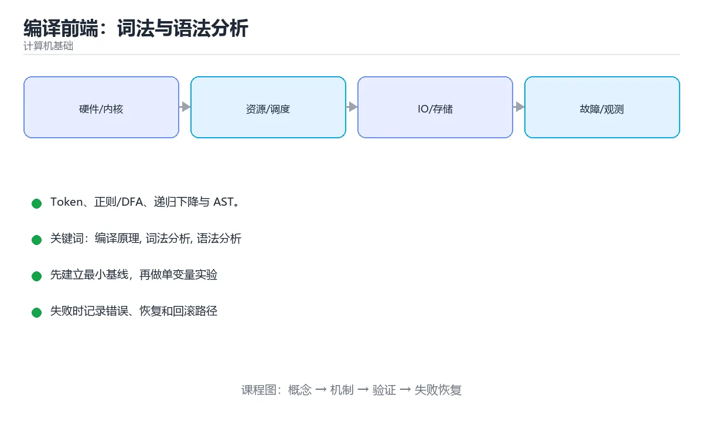

# 编译前端：词法与语法分析



> 内容更新时间：2026-10-03 · 学习阶段：基础 · 预计用时：16 分钟

## 学习目标

- 能用自己的话解释「编译前端：词法与语法分析」解决了什么问题，而不是只背术语。
- 能说清 「编译原理」、「词法分析」、「语法分析」、「AST」 之间的关系，并分别举出一个例子。
- 能把本课知识放回「计算机基础」的知识体系，说明它和相邻主题的边界。
- 能完成本课练习，并用验收标准检查自己的结果。

> 一句话摘要：Token、正则/DFA、递归下降与 AST。

## 前置知识

- 先完成上一课《计算理论入门》；如果已经掌握，可以直接用本课练习自测。
- 本课阶段：基础。建议会读写简单代码或命令，并理解变量、输入输出等基本概念。
- 开始前先复习：编译原理、词法分析、语法分析。
- 如果某一步看不懂，先记录具体卡点，完成练习后再回头读一遍。


## 编译器的整体结构

```text
源程序 → 词法分析 → 语法分析 → 语义分析 → 中间代码 → 优化 → 目标代码
         前端（与语言相关）              中端            后端（与机器相关）
```

前端负责理解程序，后端负责生成机器代码，中端做与两者都无关的优化。这种分层让「新增一门语言」只需换前端，「新增一种 CPU」只需换后端。

## 词法分析

任务：把字符流切成 Token（标识符、关键字、字面量、运算符、分隔符），并过滤空白与注释。

实现方式：

| 方式 | 说明 |
| --- | --- |
| 手写扫描器 | 逐个字符判断，性能好、错误提示友好，工业编译器常用 |
| 正则 + DFA | 用有限自动机识别各类 Token，理论清晰 |
| 词法生成器 | Lex/Flex 根据规则生成代码 |

关键概念：**最长匹配**（`>=` 不能被切成 `>` 和 `=`）、**回溯处理**（`>` 与 `>>`）、**保留字表**（标识符识别后再查表判断是否为关键字）。

## 语法分析

任务：按文法把 Token 流组织成语法树（AST），并报告语法错误。

| 方法 | 特点 | 代表 |
| --- | --- | --- |
| 递归下降 | 每个非终结符写一个函数，直观易读 | 多数手写编译器 |
| LL(1) | 自顶向下、向前看 1 个 Token | 教学与简单语言 |
| LR(1) / LALR | 自底向上、能力强 | Yacc/Bison |
| Pratt / 运算符优先级 | 优雅处理表达式优先级 | 表达式解析 |

表达式文法通常需要消除左递归、处理优先级与结合性（`a+b*c`、`a=b=c`）。

## 错误恢复

好的编译器不会在第一个错误就停下：常见策略有**恐慌模式**（跳到同步点如分号）、**短语级恢复**（补一个缺失的括号）、**错误产生式**（文法里显式写出常见错误形式）。目标是一次编译报出多个错误，并给出精确位置与建议。

## 本课小结
前端两步走：**词法把字符变成 Token，语法把 Token 变成 AST**。手写递归下降 + Pratt 表达式解析是现代语言实现的主流选择。


## 词法与语法分析速查

| 阶段 | 输入 | 输出 | 关键技术 |
| --- | --- | --- | --- |
| 词法分析 | 字符流 | Token 流 | 正则、DFA、最长匹配 |
| 语法分析 | Token 流 | 语法树 / AST | LL、LR、递归下降 |
| 语义分析 | AST | 带类型 AST | 符号表、类型检查 |

| 文法 | 分析方式 | 特点 |
| --- | --- | --- |
| 正则文法 | 有限自动机 | 只需线性扫描 |
| LL(1) | 自顶向下、预测分析表 | 不能有左递归 |
| LR(1) / LALR | 自底向上、移进归约 | 表达能力更强，工具生成 |
| 算符优先 | 处理表达式 | 依赖优先级与结合性 |

```python
import re
from dataclasses import dataclass

@dataclass
class Token:
    kind: str
    value: str
    position: int


# 词法分析：按正则规则切分，注意规则顺序（关键字先于标识符）
TOKEN_RULES = [
    ("NUMBER", re.compile(r"\d+(\.\d+)?")),
    ("IDENT", re.compile(r"[A-Za-z_]\w*")),
    ("OP", re.compile(r"[+\-*/=<>!]+")),
    ("PUNCT", re.compile(r"[(){};,.]")),
    ("SPACE", re.compile(r"\s+")),
]
KEYWORDS = {"if", "else", "while", "return"}


def tokenize(source: str):
    tokens, index = [], 0
    while index < len(source):
        for kind, pattern in TOKEN_RULES:
            match = pattern.match(source, index)
            if not match:
                continue
            text = match.group()
            if kind != "SPACE":                       # 跳过空白
                if kind == "IDENT" and text in KEYWORDS:
                    kind = "KEYWORD"
                tokens.append(Token(kind, text, index))
            index = match.end()
            break
        else:
            raise SyntaxError(f"无法识别的字符 {source[index]!r}（位置 {index}）")
    return tokens


for token in tokenize("if count >= 10 { total = total + 1 }"):
    print(token)
```

## 常见错误对照表

| 容易写错的做法 | 实际现象 | 原因与正确做法 |
| --- | --- | --- |
| 词法器不跳过空白与注释 | 充斥无用 Token | 单独规则处理并在输出中忽略 |
| 关键字规则排在标识符之后 | 关键字被识别为标识符 | 顺序或优先级要明确 |
| 忽略最长匹配原则 | `>=` 被切成 `>` 与 `=` | 每个位置取最长可行匹配 |
| 用正则处理嵌套结构 | 无法匹配或栈溢出 | 嵌套交给语法分析阶段 |
| 递归下降处理左递归文法 | 无限递归 | 先消除左递归 |
| 报错信息不含位置 | 用户无法定位 | 记录行、列与原始片段 |
| 语法分析器不做错误恢复 | 一处错误报一堆 | 同步到分号或右括号后继续 |
| 分词与解析耦合在一起 | 难以测试与复用 | 分阶段实现，各自有单元测试 |
| 忽略 Unicode 标识符 | 国际化标识符报错 | 统一按 Unicode 类别判断 |
| 用正则解析整个语言 | 复杂度爆炸 | 只用于词法层，语法层用正式文法 |

## 自测清单

- [ ] 能写出从字符流到 AST 的分阶段流程。
- [ ] 知道最长匹配与关键字优先原则。
- [ ] 能说出 LL 与 LR 的差异与限制。
- [ ] 报错信息包含位置与上下文。
- [ ] 会为词法器与解析器分别写单元测试。

## 动手练习


> 本课练习重点：围绕「编译原理、词法分析、语法分析」完成复述、实验和交付，每个结果都要能被别人检查。

先用表格或时序图描述机制，再手算一个最小例子，最后用程序验证。

### 练习 1：建立心智模型（10 分钟）

合上教程，用 3～5 句话回答：

1. 「编译前端：词法与语法分析」解决了什么问题？
2. 如果没有它，会出现什么具体后果？
3. 它和「词法分析」是什么关系？

**验收标准**：至少出现一个本课关键词，并写出一个反例、边界条件或失效场景。

### 练习 2：做一次可控实验（20 分钟）

从正文中选一个最小示例，完成以下操作：

1. 先预测修改一个参数、输入或步骤后的结果。
2. 再实际执行或逐步推演，记录真实结果。
3. 如果结果与预测不同，写出差异原因。

**验收标准**：留下「原例 → 改动 → 预测 → 结果 → 原因」五步记录。

### 练习 3：交付一个小结果（30 分钟）

用表格、真值表或计算过程把抽象概念落到一个可核对的结果上。

任务要求：

- 结果必须能被别人检查，不能只写“我已经理解了”。
- 至少覆盖「编译原理」和「词法分析」两个关键词。
- 写出 1 个仍然不确定的问题，以及下一步如何验证。

> 提示：时间有限时优先做练习 1 和练习 2；练习 3 可以拆成两次完成。


## 深入补充：编译前端：词法与语法分析

前面已经建立了基本概念。这一节换一个角度，把「编译前端：词法与语法分析」放进真实工程里，
重点回答三件事：它为什么存在、内部如何运转、什么时候会失效。

### 一、核心模型

编译前端把源码字符流转换成带结构的语法树：词法分析识别 Token，语法分析按文法组织 AST，并为后续语义分析和代码生成提供稳定输入。

```text
字符流 → 正则/DFA 词法扫描 → Token 流 → 文法分析与错误恢复 → AST → 语义分析
```

### 二、关键机制拆解

1. 词法分析处理关键字、标识符、字面量、运算符和注释，输出带位置信息的 Token。
2. 正则表达式适合描述 Token，DFA 适合高效识别，手写扫描器能提供更友好的错误信息。
3. 语法分析常用递归下降、LL、LR 等策略，递归下降易读，LR 能处理更复杂文法。
4. 文法必须处理优先级和结合性，否则 `1 + 2 * 3` 会被解析成错误结构。
5. AST 只保留语义所需结构，注释和空白通常不进入树，但位置映射必须保留。
6. 错误恢复通过同步 Token、插入缺失节点或跳过无效片段，让解析器继续发现更多错误。

### 三、对照表：抓住容易混淆的边界

| 维度 | 一侧 | 另一侧 |
| --- | --- | --- |
| 词法分析 | 识别最小语法单元 | 不关心 Token 之间的结构关系 |
| 语法分析 | 按文法组装 AST | 不判断变量是否声明或类型是否正确 |
| 正则表达式 | 描述简单模式 | 不适合嵌套结构和完整语法 |
| 递归下降 | 手写函数对应文法规则 | 易读易调试，但需要处理左递归 |

### 四、工作示例

表达式 `a + b * c` 的 AST 应把 `b * c` 放在加法的右子树，因为乘法优先级更高。解析 `a = b = 1` 时则要按结合性决定赋值方向，否则语义结果会改变。

### 五、常见误区与失效边界

| 错误做法或假设 | 后果 | 正确做法 |
| --- | --- | --- |
| 把语法错误和语义错误混在一起 | 报错阶段和修复建议都不准确 | 让词法/语法只判断结构，语义阶段检查名字与类型 |
| AST 丢失源码位置 | 无法精确报错和做编辑器跳转 | 每个节点保留起止行列和原始 Token |
| 忽略运算符优先级 | 生成错误语法树 | 在文法或 Pratt 解析器中编码优先级和结合性 |
| 错误恢复直接吞掉整行 | 后续错误全部丢失 | 同步到分号、右括号等安全点再继续解析 |

### 六、场景推演

给编辑器写语法高亮时，词法分析发现未闭合字符串后，应把后续内容标成字符串并给出位置提示；语法分析则继续解析到下一个语句，避免一处错误导致整个文件全是红波浪线。

### 七、自测问答

**Q1：Token 为什么需要位置信息？**

编辑器诊断、语法高亮和跳转都依赖精确的源码范围。

**Q2：AST 和具体语法树有什么区别？**

AST 去掉标点和无关细节，只保留语义结构。

**Q3：递归下降如何处理左递归？**

改写文法消除左递归，或用循环解析同一优先级的运算符。

**Q4：语法错误恢复的目标是什么？**

在发现错误后继续解析，尽量一次报告多个问题。

### 八、小项目：把知识变成可检查的产出

实现一个四则运算解析器：支持变量、括号、加减乘除、比较和赋值；输出 AST，并至少报告未闭合括号、非法 Token 和缺失操作数三种错误。

### 九、适用边界

前端只保证“结构合法”，不保证“程序有意义”。名字解析、类型检查、常量求值和优化属于后续阶段；把前端和后端职责混在一起会让编译器难以维护。

### 十、完成检查清单

- [ ] 能写出 Token 类型和扫描规则
- [ ] 能用递归下降解析带优先级的表达式
- [ ] 能画出 AST 并保留源码位置
- [ ] 能处理至少三种语法错误
- [ ] 能说明前端与语义分析的边界

### 十一、复习顺序

1. 先不看资料复述“核心模型”，确认能说出它解决的三个问题。
2. 再对照表逐行解释容易混淆的概念，每个概念补一个反例。
3. 跟着工作示例做一遍，改变一个条件并预测结果。
4. 用自测问答检查理解，错题回到对应小节重新阅读。
5. 最后完成小项目，把结果、失败记录和复查清单整理成一份可提交产物。

> 复习不是重读一遍，而是离开原文重新产出：复述、改写、验证、复盘。


## 考点精讲：把测验题还原成判断过程

本课有 5 个判断点。先自己作答，再看「判断依据」；如果结论正确但理由不完整，回到正文对应章节补足概念。

### 考点 1：词法分析的输出是什么？

- **正确判断**：Token 流
- **判断依据**：词法把字符流切成 Token，语法分析再把 Token 组织成 AST。其他选项：词法分析输出 Token 流。AST 是语法分析的产物，中间代码与机器码产生于更后的阶段。正确项「Token 流」是该问题的规范说法，换成其他表述都会丢失条件。错误项「抽象语法树」忽略了题目中的限制条件，因此不成立。把题干「词法分析的输出是什么？」放回《编译前端：词法与语法分析》的「Token、正则/DFA、递归下降与 AST」语境，逐项对照定义与边界条件，就能排除其余说法。
- **迁移检查**：遮住选项，只根据定义复述一次答案，再回来看哪个选项与复述一致。

### 考点 2：语法分析的主要产物是？

- **正确判断**：抽象语法树（AST）
- **判断依据**：AST 反映程序的层次结构，是后续语义分析与代码生成的基础。其他选项：语法分析的产物是抽象语法树。符号表由语义分析维护，目标文件属于后端输出。正确项「抽象语法树（AST）」既符合定义也满足题干限定的场景，因此应当选择。错误项「链接表」把不同概念混在一起，缺少题干限定的前提。把题干「语法分析的主要产物是？」放回《编译前端：词法与语法分析》的「Token、正则/DFA、递归下降与 AST」语境，逐项对照定义与边界条件，就能排除其余说法。
- **迁移检查**：遮住选项，只根据定义复述一次答案，再回来看哪个选项与复述一致。

### 考点 3：「最长匹配」原则指的是？

- **正确判断**：尽可能读入更多字符组成一个 Token
- **判断依据**：例如 >= 不会被拆成 > 与 =，这要求扫描器向前多看字符。其他选项：最长匹配指在当前位置尽可能读入更多字符合成一个 Token，例如 >= 不会被拆成 > 与 =。正确项「尽可能读入更多字符组成一个 Token」与本课示例和结论一致，可以直接用于实际编码。错误项「优先匹配最长关键字」在边界或失败路径上会得出错误结果。错误项「函数名越长越好」适用于其他场景，但与本题的前提不匹配。错误项「优先匹配最长的表达式（仅部分场景成立）」把因果关系颠倒了，不能作为正确结论。把题干「「最长匹配」原则指的是？」放回《编译前端：词法与语法分析》的「Token、正则/DFA、递归下降与 AST」语境，逐项对照定义与边界条件，就能排除其余说法。
- **迁移检查**：把题干里的一个条件换成边界值，原来的结论还成立吗？写出判断过程。

### 考点 4：递归下降解析器适合处理哪类文法？

- **正确判断**：LL(1) 等无左递归文法（左递归需先消除）
- **判断依据**：手写解析器可读性好，配合回溯或算符优先能覆盖大多数语言特性。其他选项：递归下降适合 LL(1) 等无左递归文法。含左递归时必须先消除左递归或改写文法。正确项「LL(1) 等无左递归文法（左递归需先消除）」是该问题的规范说法，换成其他表述都会丢失条件。错误项「只有二义性文法」适用于其他场景，但与本题的前提不匹配。错误项「只有正则文法」把因果关系颠倒了，不能作为正确结论。错误项「任意含左递归的文法（仅部分场景成立）」忽略了题目中的限制条件，因此不成立。把题干「递归下降解析器适合处理哪类文法？」放回《编译前端：词法与语法分析》的「Token、正则/DFA、递归下降与 AST」语境，逐项对照定义与边界条件，就能排除其余说法。
- **迁移检查**：如果给某个错误选项去掉一个限定词，它会不会变成正确？说明理由。

### 考点 5：词法分析为什么常用有限自动机实现？

- **正确判断**：Token 规则属于正则语言
- **判断依据**：嵌套结构超出正则能力，因此要交给语法分析阶段处理。其他选项：Token 规则属于正则语言，DFA 可线性时间识别且实现简单。它不支持递归嵌套，也不能检查类型。正确项「Token 规则属于正则语言」完整覆盖了题目要求的关键点，没有遗漏前提。错误项「DFA 能检查类型错误」在边界或失败路径上会得出错误结果。错误项「DFA 支持递归嵌套」适用于其他场景，但与本题的前提不匹配。错误项「DFA 可以生成目标代码」忽略了题目中的限制条件，因此不成立。把题干「词法分析为什么常用有限自动机实现？」放回《编译前端：词法与语法分析》的「Token、正则/DFA、递归下降与 AST」语境，逐项对照定义与边界条件，就能排除其余说法。
- **迁移检查**：把题干里的一个条件换成边界值，原来的结论还成立吗？写出判断过程。

## 本课复习清单

离开本课前，逐项确认：

- [ ] 不看解析，能说出「词法分析的输出是什么？」的判断依据。
- [ ] 不看解析，能说出「语法分析的主要产物是？」的判断依据。
- [ ] 不看解析，能说出「「最长匹配」原则指的是？」的判断依据。
- [ ] 不看解析，能说出「递归下降解析器适合处理哪类文法？」的判断依据。
- [ ] 不看解析，能说出「词法分析为什么常用有限自动机实现？」的判断依据。
- [ ] 至少运行一次本课示例，记录输入、输出和一个边界情况。
- [ ] 把本课最容易混淆的两个概念写成一句话对照。

| 复盘项 | 记录 |
| --- | --- |
| 已经能独立解释的考点 |  |
| 仍然说不清的概念 |  |
| 下一步验证动作 |  |

## English Overview

**Title:** Lexing & Parsing

**Summary:** Tokens, DFA, recursive descent and ASTs.

**Category:** Fundamentals  
**Level:** 基础  
**Key terms:** 编译原理, 词法分析, 语法分析, AST, 递归下降

> The full tutorial is written in Chinese. This bilingual overview helps English readers identify the topic, scope and key terms before studying the detailed examples.

## 内容元数据

- 内容版本：v2.0
- 最后更新：2026-10-03
- 学习阶段：基础
- 适用环境：通用计算机体系结构知识
- 内容来源：内置结构化课程与工程实践整理
- 相关主题：编译原理、词法分析、语法分析、AST、递归下降
- 质量版本：P0 测验标准 + P1 覆盖扩展 + P2 体验补全


## 参考资料与复核

- 最后复核：2026-10-04
- 下次复核：2027-04-04
- 复核范围：版本兼容、API 行为、安全建议与工程实践
- 来源性质：官方文档与标准；本课正文为离线教学重组，不复制原文

| 参考资料 | 本课用途 |
| --- | --- |
| [Linux Kernel Docs](https://docs.kernel.org/) | 操作系统与硬件接口 |
| [Arm Architecture](https://developer.arm.com/documentation) | 处理器与内存体系结构 |

> 本课主题：Token、正则/DFA、递归下降与 AST。

> App 完全离线展示文字链接，不会自动联网；需要延伸阅读时可复制链接到浏览器。

