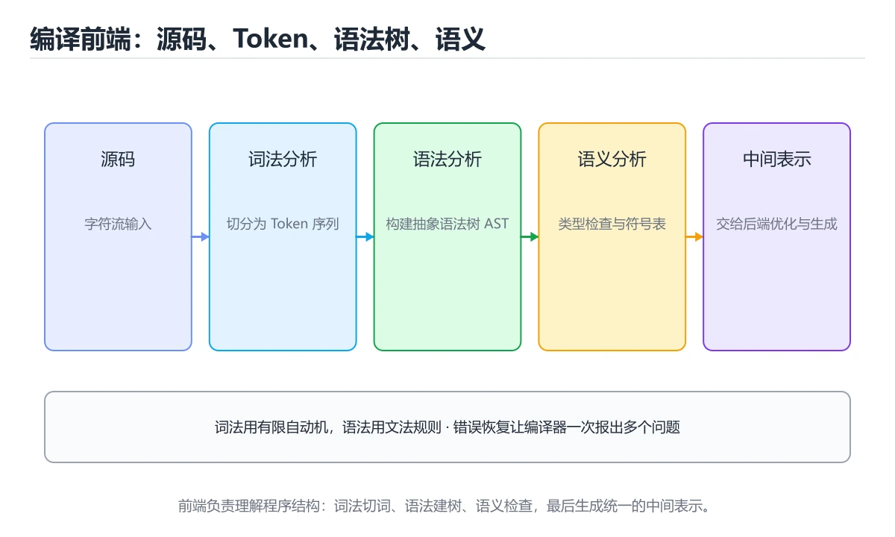

# 编译前端：词法与语法分析




> 内容更新时间：2026-10-06 · 学习阶段：进阶 · 预计用时：50 分钟

## 本节知识框架

**课程定位**：所属分类 `fundamentals`（计算机基础），课程主题 `编译前端：词法与语法分析`，学习阶段 进阶，建议用时 40 分钟。

本课主线：Token、正则/DFA、递归下降与 AST。

**学完本课应当能够**
- 说清 `）、回溯处理（` 与 `a+b*c` 的含义与区别，并各举一个正例和一个反例。
- 用本课示例验证 `词法分析` 的行为，记录输入、输出与失败条件。
- 遇到「把语法错误和语义错误混在一起」这类问题时，能说出触发条件与修复顺序。

### 从概念到验证的学习链条

1. `）、回溯处理（`：先掌握 关键概念：**最长匹配**（`>=` 不能被切成 `>` 和 `=`）、**回溯处理**（`>` 与 `>>`）、**保留字表**（标识符识别后再查表判断是否为关键字），再用它解释 `a+b*c` 为什么会出现。
2. `a+b*c`：先掌握 表达式文法通常需要消除左递归、处理优先级与结合性（`a+b*c`、`a=b=c`），再用它解释 `词法分析` 为什么会出现。
3. `词法分析`：先掌握 任务：把字符流切成 Token（标识符、关键字、字面量、运算符、分隔符），并过滤空白与注释，再用它解释 `语法分析` 为什么会出现。
4. `语法分析`：先掌握 任务：按文法把 Token 流组织成语法树（AST），并报告语法错误，再用它解释 `错误恢复` 为什么会出现。
5. `错误恢复`：先掌握 解析出错后继续分析并尽量给出更多诊断的策略，再用它解释 本课示例的观察结果 为什么会出现。

**先修与衔接**：本课是「计算机基础」分类的第 13 课。相关或后续课程：《语义分析与符号表》。

### 完成判据

- **定义关**：不看正文也能说明 `）、回溯处理（` 是 关键概念：**最长匹配**（`>=` 不能被切成 `>` 和 `=`）、**回溯处理**（`>` 与 `>>`）、**保留字表**（标识符识别后再查表判断是否为关键字），并指出一个反例。
- **机制关**：能按“输入 → 转换 → 输出 → 验证”复述 `编译前端：词法与语法分析`，而不是只背结论。
- **示例关**：能运行或推演 `编译前端：词法与语法分析` 的 `text` 示例，并说明一个真实出现的标识符或字面量。
- **证据关**：能指出 `编译前端：词法与语法分析` 示例里的 调用了 `compile()`，并说明它支持或反驳了本课的哪一条结论。
- **排错关**：能复现 把语法错误和语义错误混在一起，记录现象并按 让词法/语法只判断结构，语义阶段检查名字与类型 修复。
- **迁移关**：能把 `编译原理`、`词法分析`、`语法分析`、`AST` 放进一个与 `编译前端：词法与语法分析` 不同的项目场景，并保持输入与验证条件可追踪。
- **复盘关**：学完 `编译前端：词法与语法分析` 后，用一句话写下仍然不确定的结论，并列出下一次验证需要的输入、环境和成功判据。

### 复习清单

- [ ] 能不看正文复述本课核心术语，并指出一个边界或反例。
- [ ] 能运行或推演本课示例，记录输入、输出与失败现象。
- [ ] 能完成一次自测，并把错题对照错误表定位原因。

## 核心概念定义

| 术语 | 操作性定义 | 常见边界与风险 |
| --- | --- | --- |
| ）、回溯处理（ | 关键概念：**最长匹配**（>= 不能被切成 > 和 =）、**回溯处理**（> 与 >>）、**保留字表**（标识符识别后再查表判断是否为关键字）。 | 只在「关键概念：**最长匹配**（>= 不能被切成 > 和 =）、**回溯处理**（> 与 >>）、**保留字表**（标识符识别后再查表判断是否为关键字）」这一前提下成立，换输入或换环境要重新验证。 |
| a+b*c | 表达式文法通常需要消除左递归、处理优先级与结合性（a+b*c、a=b=c）。 | 只在「表达式文法通常需要消除左递归、处理优先级与结合性（a+b*c、a=b=c）」这一前提下成立，换输入或换环境要重新验证。 |
| 词法分析 | 任务：把字符流切成 Token（标识符、关键字、字面量、运算符、分隔符），并过滤空白与注释。 | 只在「任务：把字符流切成 Token（标识符、关键字、字面量、运算符、分隔符），并过滤空白与注释」这一前提下成立，换输入或换环境要重新验证。 |
| 语法分析 | 任务：按文法把 Token 流组织成语法树（AST），并报告语法错误。 | 易错：无法匹配或栈溢出；正确做法是嵌套交给语法分析阶段。 |
| 错误恢复 | 解析出错后继续分析并尽量给出更多诊断的策略 | 易错：后续错误全部丢失；正确做法是同步到分号、右括号等安全点再继续解析。 |

## 原理与运行机制

### 机制总览

**教材衔接：编译器的整体结构**

```text
源程序 → 词法分析 → 语法分析 → 语义分析 → 中间代码 → 优化 → 目标代码
         前端（与语言相关）              中端            后端（与机器相关）
```

前端负责理解程序，后端负责生成机器代码，中端做与两者都无关的优化。这种分层让「新增一门语言」只需换前端，「新增一种 CPU」只需换后端。

**教材衔接：词法分析**

任务：把字符流切成 Token（标识符、关键字、字面量、运算符、分隔符），并过滤空白与注释。

实现方式：

| 方式 | 说明 |
| --- | --- |
| 手写扫描器 | 逐个字符判断，性能好、错误提示友好，工业编译器常用 |
| 正则 + DFA | 用有限自动机识别各类 Token，理论清晰 |
| 词法生成器 | Lex/Flex 根据规则生成代码 |

关键概念：**最长匹配**（`>=` 不能被切成 `>` 和 `=`）、**回溯处理**（`>` 与 `>>`）、**保留字表**（标识符识别后再查表判断是否为关键字）。

**教材衔接：错误恢复**

好的编译器不会在第一个错误就停下：常见策略有**恐慌模式**（跳到同步点如分号）、**短语级恢复**（补一个缺失的括号）、**错误产生式**（文法里显式写出常见错误形式）。目标是一次编译报出多个错误，并给出精确位置与建议。

### 机制拆解：每一步的输入、动作与输出

#### 1. `）、回溯处理（`
- 输入：`编译原理`；本步把 关键概念：**最长匹配**（`>=` 不能被切成 `>` 和 `=`）、**回溯处理**（`>` 与 `>>`）、**保留字表**（标识符识别后再查表判断是否为关键字） 当作判断规则。
- 动作：围绕 `）、回溯处理（` 保留中间状态，并记录它与 `a+b*c` 的对应关系。
- 输出：`a+b*c`，它可以被下一段代码、测试或记录继续使用。
- `）、回溯处理（` 的失败条件：只在「关键概念：**最长匹配**（`>=` 不能被切成 `>` 和 `=`）、**回溯处理**（`>` 与 `>>`）、**保留字表**（标识符识别后再查表判断是否为关键字）」这一前提下成立，换输入或换环境要重新验证。

#### 2. `a+b*c`
- 输入：`）、回溯处理（`；本步把 表达式文法通常需要消除左递归、处理优先级与结合性（`a+b*c`、`a=b=c`） 当作判断规则。
- 动作：围绕 `a+b*c` 保留中间状态，并记录它与 `词法分析` 的对应关系。
- 输出：`词法分析`，它可以被下一段代码、测试或记录继续使用。
- `a+b*c` 的失败条件：只在「表达式文法通常需要消除左递归、处理优先级与结合性（`a+b*c`、`a=b=c`）」这一前提下成立，换输入或换环境要重新验证。

#### 3. `词法分析`
- 输入：`a+b*c`；本步把 任务：把字符流切成 Token（标识符、关键字、字面量、运算符、分隔符），并过滤空白与注释 当作判断规则。
- 动作：围绕 `词法分析` 保留中间状态，并记录它与 `语法分析` 的对应关系。
- 输出：`语法分析`，它可以被下一段代码、测试或记录继续使用。
- `词法分析` 的失败条件：只在「任务：把字符流切成 Token（标识符、关键字、字面量、运算符、分隔符），并过滤空白与注释」这一前提下成立，换输入或换环境要重新验证。

#### 4. `语法分析`
- 输入：`词法分析`；本步把 任务：按文法把 Token 流组织成语法树（AST），并报告语法错误 当作判断规则。
- 动作：围绕 `语法分析` 保留中间状态，并记录它与 `错误恢复` 的对应关系。
- 输出：`错误恢复`，它可以被下一段代码、测试或记录继续使用。
- `语法分析` 的失败条件：当用正则处理嵌套结构时，会出现无法匹配或栈溢出。

#### 5. `错误恢复`
- 输入：`语法分析`；本步把 解析出错后继续分析并尽量给出更多诊断的策略 当作判断规则。
- 动作：围绕 `错误恢复` 保留中间状态，并记录它与 `compile` 的对应关系。
- 输出：`compile`，它可以被下一段代码、测试或记录继续使用。
- `错误恢复` 的失败条件：当错误恢复直接吞掉整行时，会出现后续错误全部丢失。

### 示例中的可观察事实

1. 调用了 `compile()`；它对应的课程主题是 `编译前端：词法与语法分析`。
2. 调用了 `tokenize()`；它对应的课程主题是 `编译前端：词法与语法分析`。
3. 调用了 `len()`；它对应的课程主题是 `编译前端：词法与语法分析`。
4. 调用了 `group()`；它对应的课程主题是 `编译前端：词法与语法分析`。
5. 调用了 `append()`；它对应的课程主题是 `编译前端：词法与语法分析`。
6. 调用了 `Token()`；它对应的课程主题是 `编译前端：词法与语法分析`。
7. 调用了 `end()`；它对应的课程主题是 `编译前端：词法与语法分析`。
8. 调用了 `SyntaxError()`；它对应的课程主题是 `编译前端：词法与语法分析`。

### 复现实验记录

- 环境：`编译前端：词法与语法分析` 使用 `text` 示例，固定 `编译原理`、`词法分析`、`语法分析`、`AST` 作为第一组条件。
- 首轮输入：先确认 调用了 `compile()`，预测 `）、回溯处理（` 会怎样变化。
- 基线观察：记录命令、输入、输出和错误原文，不用截图代替可复制的文本。
- 单变量修改：只改变 `编译原理`，观察 `错误恢复` 是否仍满足定义。
- 失败注入：复现 把语法错误和语义错误混在一起，确认现象是 报错阶段和修复建议都不准确。
- 记录结论：把“修改前、修改后、预期变化、实际变化”写成四列表，这样复盘 `编译前端：词法与语法分析` 时才能区分概念错误与实现错误。

## 典型应用场景

- **把语法错误和语义错误混在一起**：典型现象是报错阶段和修复建议都不准确；正确做法是让词法/语法只判断结构，语义阶段检查名字与类型。
- **AST 丢失源码位置**：典型现象是无法精确报错和做编辑器跳转；正确做法是每个节点保留起止行列和原始 Token。
- **忽略运算符优先级**：典型现象是生成错误语法树；正确做法是在文法或 Pratt 解析器中编码优先级和结合性。
- **错误恢复直接吞掉整行**：典型现象是后续错误全部丢失；正确做法是同步到分号、右括号等安全点再继续解析。

### 最小验证场景

- 准备：保留 `text` 示例的原始输入，先记录 `编译前端：词法与语法分析` 的基线输出和完整运行命令。
- 观察：先核对 调用了 `compile()`，再改变一个与 `）、回溯处理（` 相关的条件。
- 判定：新结果与 `编译前端：词法与语法分析` 的基线不同不等于错误；只有当差异破坏了 `）、回溯处理（` 的定义或错误表中的约束，才判定为失败。

### 选择与边界

- 使用 `）、回溯处理（` 时，先满足它的定义：关键概念：**最长匹配**（`>=` 不能被切成 `>` 和 `=`）、**回溯处理**（`>` 与 `>>`）、**保留字表**（标识符识别后再查表判断是否为关键字）；只在「关键概念：**最长匹配**（`>=` 不能被切成 `>` 和 `=`）、**回溯处理**（`>` 与 `>>`）、**保留字表**（标识符识别后再查表判断是否为关键字）」这一前提下成立，换输入或换环境要重新验证。
- 使用 `a+b*c` 时，先满足它的定义：表达式文法通常需要消除左递归、处理优先级与结合性（`a+b*c`、`a=b=c`）；只在「表达式文法通常需要消除左递归、处理优先级与结合性（`a+b*c`、`a=b=c`）」这一前提下成立，换输入或换环境要重新验证。
- 使用 `词法分析` 时，先满足它的定义：任务：把字符流切成 Token（标识符、关键字、字面量、运算符、分隔符），并过滤空白与注释；只在「任务：把字符流切成 Token（标识符、关键字、字面量、运算符、分隔符），并过滤空白与注释」这一前提下成立，换输入或换环境要重新验证。
- 使用 `语法分析` 时，先满足它的定义：任务：按文法把 Token 流组织成语法树（AST），并报告语法错误；易错：无法匹配或栈溢出；正确做法是嵌套交给语法分析阶段。
- 使用 `错误恢复` 时，先满足它的定义：解析出错后继续分析并尽量给出更多诊断的策略；易错：后续错误全部丢失；正确做法是同步到分号、右括号等安全点再继续解析。

## 代码/协议/SQL 示例

### 最小可验证示例

```text
源程序 → 词法分析 → 语法分析 → 语义分析 → 中间代码 → 优化 → 目标代码
         前端（与语言相关）              中端            后端（与机器相关）
```

**教材衔接：语法分析**

任务：按文法把 Token 流组织成语法树（AST），并报告语法错误。

| 方法 | 特点 | 代表 |
| --- | --- | --- |
| 递归下降 | 每个非终结符写一个函数，直观易读 | 多数手写编译器 |
| LL(1) | 自顶向下、向前看 1 个 Token | 教学与简单语言 |
| LR(1) / LALR | 自底向上、能力强 | Yacc/Bison |
| Pratt / 运算符优先级 | 优雅处理表达式优先级 | 表达式解析 |

表达式文法通常需要消除左递归、处理优先级与结合性（`a+b*c`、`a=b=c`）。

**教材衔接：词法与语法分析速查**

| 阶段 | 输入 | 输出 | 关键技术 |
| --- | --- | --- | --- |
| 词法分析 | 字符流 | Token 流 | 正则、DFA、最长匹配 |
| 语法分析 | Token 流 | 语法树 / AST | LL、LR、递归下降 |
| 语义分析 | AST | 带类型 AST | 符号表、类型检查 |

| 文法 | 分析方式 | 特点 |
| --- | --- | --- |
| 正则文法 | 有限自动机 | 只需线性扫描 |
| LL(1) | 自顶向下、预测分析表 | 不能有左递归 |
| LR(1) / LALR | 自底向上、移进归约 | 表达能力更强，工具生成 |
| 算符优先 | 处理表达式 | 依赖优先级与结合性 |

```python
import re
from dataclasses import dataclass

@dataclass
class Token:
    kind: str
    value: str
    position: int

# 词法分析：按正则规则切分，注意规则顺序（关键字先于标识符）
TOKEN_RULES = [
    ("NUMBER", re.compile(r"\d+(\.\d+)?")),
    ("IDENT", re.compile(r"[A-Za-z_]\w*")),
    ("OP", re.compile(r"[+\-*/=<>!]+")),
    ("PUNCT", re.compile(r"[(){};,.]")),
    ("SPACE", re.compile(r"\s+")),
]
KEYWORDS = {"if", "else", "while", "return"}

def tokenize(source: str):
    tokens, index = [], 0
    while index < len(source):
        for kind, pattern in TOKEN_RULES:
            match = pattern.match(source, index)
            if not match:
                continue
            text = match.group()
            if kind != "SPACE":                       # 跳过空白
                if kind == "IDENT" and text in KEYWORDS:
                    kind = "KEYWORD"
                tokens.append(Token(kind, text, index))
            index = match.end()
            break
        else:
            raise SyntaxError(f"无法识别的字符 {source[index]!r}（位置 {index}）")
    return tokens

for token in tokenize("if count >= 10 { total = total + 1 }"):
    print(token)
```

**教材衔接：深入补充：编译前端：词法与语法分析**

前面已经建立了基本概念。这一节换一个角度，把编译前端：词法与语法分析放进真实工程里，
重点回答三件事：TOKEN_RULES 解决什么问题、依赖哪些前提、在什么条件下失效。

### 一、核心模型

编译前端把源码字符流转换成带结构的语法树：词法分析识别 Token，语法分析按文法组织 AST，并为后续语义分析和代码生成提供稳定输入。

```text
字符流 → 正则/DFA 词法扫描 → Token 流 → 文法分析与错误恢复 → AST → 语义分析
```

### 二、关键机制拆解

1. 词法分析处理关键字、标识符、字面量、运算符和注释，输出带位置信息的 Token。
2. 正则表达式适合描述 Token，DFA 适合高效识别，手写扫描器能提供更友好的错误信息。
3. 语法分析常用递归下降、LL、LR 等策略，递归下降易读，LR 能处理更复杂文法。
4. 文法必须处理优先级和结合性，否则 `1 + 2 * 3` 会被解析成错误结构。
5. AST 只保留语义所需结构，注释和空白通常不进入树，但位置映射必须保留。
6. 错误恢复通过同步 Token、插入缺失节点或跳过无效片段，让解析器继续发现更多错误。

### 三、对照表：抓住容易混淆的边界

| 维度 | 一侧 | 另一侧 |
| --- | --- | --- |
| 词法分析 | 识别最小语法单元 | 不关心 Token 之间的结构关系 |
| 语法分析 | 按文法组装 AST | 不判断变量是否声明或类型是否正确 |
| 正则表达式 | 描述简单模式 | 不适合嵌套结构和完整语法 |
| 递归下降 | 手写函数对应文法规则 | 易读易调试，但需要处理左递归 |

### 四、工作示例

表达式 `a + b * c` 的 AST 应把 `b * c` 放在加法的右子树，因为乘法优先级更高。解析 `a = b = 1` 时则要按结合性决定赋值方向，否则语义结果会改变。

### 五、常见误区与失效边界

| 错误做法或假设 | 后果 | 正确做法 |
| --- | --- | --- |
| 把语法错误和语义错误混在一起 | 报错阶段和修复建议都不准确 | 让词法/语法只判断结构，语义阶段检查名字与类型 |
| AST 丢失源码位置 | 无法精确报错和做编辑器跳转 | 每个节点保留起止行列和原始 Token |
| 忽略运算符优先级 | 生成错误语法树 | 在文法或 Pratt 解析器中编码优先级和结合性 |
| 错误恢复直接吞掉整行 | 后续错误全部丢失 | 同步到分号、右括号等安全点再继续解析 |

### 六、场景推演

给编辑器写语法高亮时，词法分析发现未闭合字符串后，应把后续内容标成字符串并给出位置提示；语法分析则继续解析到下一个语句，避免一处错误导致整个文件全是红波浪线。

### 七、自测问答

**Q1：Token 为什么需要位置信息？**

编辑器诊断、语法高亮和跳转都依赖精确的源码范围。

**Q2：AST 和具体语法树有什么区别？**

AST 去掉标点和无关细节，只保留语义结构。

**Q3：递归下降如何处理左递归？**

改写文法消除左递归，或用循环解析同一优先级的运算符。

**Q4：语法错误恢复的目标是什么？**

在发现错误后继续解析，尽量一次报告多个问题。

### 八、小项目：把知识变成可检查的产出

实现一个四则运算解析器：支持变量、括号、加减乘除、比较和赋值；输出 AST，并至少报告未闭合括号、非法 Token 和缺失操作数三种错误。

### 九、适用边界

前端只保证“结构合法”，不保证“程序有意义”。名字解析、类型检查、常量求值和优化属于后续阶段；把前端和后端职责混在一起会让编译器难以维护。

### 十、完成检查清单

- [ ] 能写出 Token 类型和扫描规则
- [ ] 能用递归下降解析带优先级的表达式
- [ ] 能画出 AST 并保留源码位置
- [ ] 能处理至少三种语法错误
- [ ] 能说明前端与语义分析的边界

### 十一、复习顺序

1. 用自己的话说明 TOKEN_RULES 的作用，再说出它不适用的情况。
2. 再对照表逐行解释容易混淆的概念，每个概念补一个反例。
3. 跟着工作示例做一遍，改变一个条件并预测结果。
4. 用自测问答检查理解，错题回到对应小节重新阅读。
5. 最后完成 编译原理 的小项目，把结果、失败记录和复查清单整理成可提交产物。

> 复习不是重读一遍，而是离开原文重新产出：复述、改写、验证、复盘。

### 示例精读：先找证据，再改一个条件

1. 调用了 `compile()`；它出现在 `编译前端：词法与语法分析` 的示例中，阅读时先确认它前后各发生了什么。
2. 调用了 `tokenize()`；它出现在 `编译前端：词法与语法分析` 的示例中，阅读时先确认它前后各发生了什么。
3. 调用了 `len()`；它出现在 `编译前端：词法与语法分析` 的示例中，阅读时先确认它前后各发生了什么。
4. 调用了 `group()`；它出现在 `编译前端：词法与语法分析` 的示例中，阅读时先确认它前后各发生了什么。
5. 调用了 `append()`；它出现在 `编译前端：词法与语法分析` 的示例中，阅读时先确认它前后各发生了什么。
6. 调用了 `Token()`；它出现在 `编译前端：词法与语法分析` 的示例中，阅读时先确认它前后各发生了什么。
7. 调用了 `end()`；它出现在 `编译前端：词法与语法分析` 的示例中，阅读时先确认它前后各发生了什么。
8. 调用了 `SyntaxError()`；它出现在 `编译前端：词法与语法分析` 的示例中，阅读时先确认它前后各发生了什么。
- 在 `编译前端：词法与语法分析` 中与 `）、回溯处理（` 对照：示例必须能支持 关键概念：**最长匹配**（`>=` 不能被切成 `>` 和 `=`）、**回溯处理**（`>` 与 `>>`）、**保留字表**（标识符识别后再查表判断是否为关键字），否则说明这一段还缺少实现或验证步骤。
- 在 `编译前端：词法与语法分析` 中与 `a+b*c` 对照：示例必须能支持 表达式文法通常需要消除左递归、处理优先级与结合性（`a+b*c`、`a=b=c`），否则说明这一段还缺少实现或验证步骤。
- 在 `编译前端：词法与语法分析` 中与 `词法分析` 对照：示例必须能支持 任务：把字符流切成 Token（标识符、关键字、字面量、运算符、分隔符），并过滤空白与注释，否则说明这一段还缺少实现或验证步骤。
- 在 `编译前端：词法与语法分析` 中与 `语法分析` 对照：示例必须能支持 任务：按文法把 Token 流组织成语法树（AST），并报告语法错误，否则说明这一段还缺少实现或验证步骤。

## 时间/空间复杂度或性能分析

**性能关注点（编译前端：词法与语法分析）**：关注资源换算与精度损失：记录单位换算误差、存储空间与实际耗时。

**本课特有开销（编译前端：词法与语法分析 · 编译原理）**：回溯会让正则表达式在特定输入上急剧变慢，必须用最坏输入做基准。

**测量方法**：以 `编译前端：词法与语法分析` 的 `编译原理` 场景为对象，固定输入跑一遍记录基线，再把规模或并发度提高一个数量级复测；两次结果的差值与波动范围才是结论依据。

### 需要控制的变量与记录项

- `编译前端：词法与语法分析` 的 `编译原理`：固定它的版本、输入范围和资源上限，分别记录速度、内存与失败率的变化。
- `编译前端：词法与语法分析` 的 `词法分析`：固定它的版本、输入范围和资源上限，分别记录速度、内存与失败率的变化。
- `编译前端：词法与语法分析` 的 `语法分析`：固定它的版本、输入范围和资源上限，分别记录速度、内存与失败率的变化。
- `编译前端：词法与语法分析` 的 `AST`：固定它的版本、输入范围和资源上限，分别记录速度、内存与失败率的变化。
- `编译前端：词法与语法分析` 的 `递归下降`：固定它的版本、输入范围和资源上限，分别记录速度、内存与失败率的变化。
- `编译前端：词法与语法分析` 中 `）、回溯处理（` 的边界：只在「关键概念：**最长匹配**（`>=` 不能被切成 `>` 和 `=`）、**回溯处理**（`>` 与 `>>`）、**保留字表**（标识符识别后再查表判断是否为关键字）」这一前提下成立，换输入或换环境要重新验证。达到边界时不要外推，必须重新测量。
- `编译前端：词法与语法分析` 中 `a+b*c` 的边界：只在「表达式文法通常需要消除左递归、处理优先级与结合性（`a+b*c`、`a=b=c`）」这一前提下成立，换输入或换环境要重新验证。达到边界时不要外推，必须重新测量。
- `编译前端：词法与语法分析` 中 `词法分析` 的边界：只在「任务：把字符流切成 Token（标识符、关键字、字面量、运算符、分隔符），并过滤空白与注释」这一前提下成立，换输入或换环境要重新验证。达到边界时不要外推，必须重新测量。
- `编译前端：词法与语法分析` 中 `语法分析` 的边界：易错：无法匹配或栈溢出；正确做法是嵌套交给语法分析阶段。达到边界时不要外推，必须重新测量。
- `编译前端：词法与语法分析` 中 `错误恢复` 的边界：易错：后续错误全部丢失；正确做法是同步到分号、右括号等安全点再继续解析。达到边界时不要外推，必须重新测量。
- `编译前端：词法与语法分析` 的代码证据：先验证 调用了 `compile()`，再记录该路径的输入规模与耗时；只看代码行数不能推出复杂度。

## 常见误区与易错点

| 容易写错的做法 | 实际现象 | 原因与正确做法 |
| --- | --- | --- |
| 把语法错误和语义错误混在一起 | 报错阶段和修复建议都不准确 | 让词法/语法只判断结构，语义阶段检查名字与类型 |
| AST 丢失源码位置 | 无法精确报错和做编辑器跳转 | 每个节点保留起止行列和原始 Token |
| 忽略运算符优先级 | 生成错误语法树 | 在文法或 Pratt 解析器中编码优先级和结合性 |
| 错误恢复直接吞掉整行 | 后续错误全部丢失 | 同步到分号、右括号等安全点再继续解析 |
| 词法器不跳过空白与注释 | 充斥无用 Token | 单独规则处理并在输出中忽略 |
| 关键字规则排在标识符之后 | 关键字被识别为标识符 | 顺序或优先级要明确 |
| 忽略最长匹配原则 | `>=` 被切成 `>` 与 `=` | 每个位置取最长可行匹配 |
| 用正则处理嵌套结构 | 无法匹配或栈溢出 | 嵌套交给语法分析阶段 |
| 递归下降处理左递归文法 | 无限递归 | 先消除左递归 |
| 报错信息不含位置 | 用户无法定位 | 记录行、列与原始片段 |
| 语法分析器不做错误恢复 | 一处错误报一堆 | 同步到分号或右括号后继续 |
| 分词与解析耦合在一起 | 难以测试与复用 | 分阶段实现，各自有单元测试 |
| 忽略 Unicode 标识符 | 国际化标识符报错 | 统一按 Unicode 类别判断 |
| 用正则解析整个语言 | 复杂度爆炸 | 只用于词法层，语法层用正式文法 |

### 现场 1：把语法错误和语义错误混在一起

**症状**：报错阶段和修复建议都不准确。

**根因与修复**：让词法/语法只判断结构，语义阶段检查名字与类型。

**自检**：在本课示例里复现「把语法错误和语义错误混在一起」，改成让词法/语法只判断结构，语义阶段检查名字与类型后重跑；如果症状消失且失败路径按预期变化，说明定位正确。

### 现场 2：AST 丢失源码位置

**症状**：无法精确报错和做编辑器跳转。

**根因与修复**：每个节点保留起止行列和原始 Token。

**自检**：在本课示例里复现「AST 丢失源码位置」，改成每个节点保留起止行列和原始 Token后重跑；如果症状消失且失败路径按预期变化，说明定位正确。

### 现场 3：忽略运算符优先级

**症状**：生成错误语法树。

**根因与修复**：在文法或 Pratt 解析器中编码优先级和结合性。

**自检**：在本课示例里复现「忽略运算符优先级」，改成在文法或 Pratt 解析器中编码优先级和结合性后重跑；如果症状消失且失败路径按预期变化，说明定位正确。

### 现场 4：错误恢复直接吞掉整行

**症状**：后续错误全部丢失。

**根因与修复**：同步到分号、右括号等安全点再继续解析。

**自检**：在本课示例里复现「错误恢复直接吞掉整行」，改成同步到分号、右括号等安全点再继续解析后重跑；如果症状消失且失败路径按预期变化，说明定位正确。

### 现场 5：词法器不跳过空白与注释

**症状**：充斥无用 Token。

**根因与修复**：单独规则处理并在输出中忽略。

**自检**：在本课示例里复现「词法器不跳过空白与注释」，改成单独规则处理并在输出中忽略后重跑；如果症状消失且失败路径按预期变化，说明定位正确。

### 现场 6：关键字规则排在标识符之后

**症状**：关键字被识别为标识符。

**根因与修复**：顺序或优先级要明确。

**自检**：在本课示例里复现「关键字规则排在标识符之后」，改成顺序或优先级要明确后重跑；如果症状消失且失败路径按预期变化，说明定位正确。

### 现场 7：忽略最长匹配原则

**症状**：`>=` 被切成 `>` 与 `=`。

**根因与修复**：每个位置取最长可行匹配。

**自检**：在本课示例里复现「忽略最长匹配原则」，改成每个位置取最长可行匹配后重跑；如果症状消失且失败路径按预期变化，说明定位正确。

### 现场 8：用正则处理嵌套结构

**症状**：无法匹配或栈溢出。

**根因与修复**：嵌套交给语法分析阶段。

**自检**：在本课示例里复现「用正则处理嵌套结构」，改成嵌套交给语法分析阶段后重跑；如果症状消失且失败路径按预期变化，说明定位正确。

### 现场 9：递归下降处理左递归文法

**症状**：无限递归。

**根因与修复**：先消除左递归。

**自检**：在本课示例里复现「递归下降处理左递归文法」，改成先消除左递归后重跑；如果症状消失且失败路径按预期变化，说明定位正确。

## 与其他知识点的关系

- **相关或后续**：`语义分析与符号表`。本课术语会在这些课程里继续使用。
- **术语归属**：`）、回溯处理（`、`a+b*c`、`词法分析` 的定义以本课「核心概念定义」为准，换到其他课程时先确认定义是否被改写。
- 同一分类的《编译与程序运行原理》也涉及 `AST`；两课衔接时先确认这个术语的定义是否一致。

### 先修与后续术语接口

- `语义分析与符号表`：两者通过本分类的学习顺序衔接，阅读时重点比较各自的输入与失败条件。

### 容易混淆的相邻概念

- `）、回溯处理（` 与 `a+b*c`：前者强调 关键概念：**最长匹配**（`>=` 不能被切成 `>` 和 `=`）、**回溯处理**（`>` 与 `>>`）、**保留字表**（标识符识别后再查表判断是否为关键字）；后者强调 表达式文法通常需要消除左递归、处理优先级与结合性（`a+b*c`、`a=b=c`）。判断时分别检查两条定义的适用范围，不要只看名称相似就互换。
- `a+b*c` 与 `词法分析`：前者强调 表达式文法通常需要消除左递归、处理优先级与结合性（`a+b*c`、`a=b=c`）；后者强调 任务：把字符流切成 Token（标识符、关键字、字面量、运算符、分隔符），并过滤空白与注释。判断时分别检查两条定义的适用范围，不要只看名称相似就互换。
- `词法分析` 与 `语法分析`：前者强调 任务：把字符流切成 Token（标识符、关键字、字面量、运算符、分隔符），并过滤空白与注释；后者强调 任务：按文法把 Token 流组织成语法树（AST），并报告语法错误。判断时分别检查两条定义的适用范围，不要只看名称相似就互换。
- `语法分析` 与 `错误恢复`：前者强调 任务：按文法把 Token 流组织成语法树（AST），并报告语法错误；后者强调 解析出错后继续分析并尽量给出更多诊断的策略。判断时分别检查两条定义的适用范围，不要只看名称相似就互换。

## 自测题与参考答案

> 先独立作答，再对照参考答案；答案都能在本课正文、术语表或错误表里找到依据。

### 自测 1（概念复述）

不看正文，写出 `）、回溯处理（` 的操作性定义，并说明它与 `a+b*c` 的区别。

**参考答案**：关键概念：**最长匹配**（`>=` 不能被切成 `>` 和 `=`）、**回溯处理**（`>` 与 `>>`）、**保留字表**（标识符识别后再查表判断是否为关键字）。

`a+b*c` 的定位是：表达式文法通常需要消除左递归、处理优先级与结合性（`a+b*c`、`a=b=c`）；两者的差别要从适用对象与失败模式上说明。

### 自测 2（排错）

本课错误表记录了「把语法错误和语义错误混在一起」这类做法。请写出它会出现的现象、根因，以及修复顺序。

**参考答案**：现象是报错阶段和修复建议都不准确；正确做法是让词法/语法只判断结构，语义阶段检查名字与类型。修复时先复现现象并保留证据，再改动一处假设重跑，确认现象消失。

### 自测 3（动手验证）

运行本课的 `text` 示例，改动其中一个输入后重新运行，记录输出与错误信息。

**参考答案**：正常输入下 `text` 示例应当复现正文给出的结果；改动输入后，如果结果改变或报错，先核对它是否满足 `编译前端：词法与语法分析` 中`）、回溯处理（` 的适用范围，再检查错误表里是否有同类现象。

### 自测 4（代码阅读）

阅读本课开头的 `text` 示例，说明它体现了`）、回溯处理（` 的哪一条性质，并指出改动哪个输入会让这条性质不再成立。

**参考答案**：`）、回溯处理（` 的定义是 关键概念：**最长匹配**（`>=` 不能被切成 `>` 和 `=`）、**回溯处理**（`>` 与 `>>`）、**保留字表**（标识符识别后再查表判断是否为关键字），示例正是在实现这条定义。改动与 `）、回溯处理（` 有关的一个输入后，如果结果不再符合 `编译前端：词法与语法分析` 的正文描述，就说明该性质只在当前前提成立。

### 自测 5（迁移）

把 `编译前端：词法与语法分析` 的方法迁移到自己的项目：围绕 `）、回溯处理（` 写出一个与错误表同类的风险点，并说明触发条件和检验方式。

**参考答案**：例如「用正则解析整个语言」，它会导致复杂度爆炸；检验方式是按只用于词法层，语法层用正式文法改一处再复现，确认现象消失且没有引入新的失败分支。

### 自测 6（对比）

用一个表格对比 `）、回溯处理（` 与 `a+b*c`：各写一行适用场景、一行失败表现。

**参考答案**：`）、回溯处理（` 的定义是关键概念：**最长匹配**（`>=` 不能被切成 `>` 和 `=`）、**回溯处理**（`>` 与 `>>`）、**保留字表**（标识符识别后再查表判断是否为关键字）；`a+b*c` 的定义是表达式文法通常需要消除左递归、处理优先级与结合性（`a+b*c`、`a=b=c`）。两者的失败表现分别对应本课错误表里与本术语相关的行。

### 自测 7（排错顺序）

面对「把语法错误和语义错误混在一起」引发的问题，请把“复现 报错阶段和修复建议都不准确 → 保留证据 → 让词法/语法只判断结构，语义阶段检查名字与类型 → 回归验证”四步写成可执行的检查清单。

**参考答案**：第一步按报错阶段和修复建议都不准确复现；第二步记录输入、版本与完整报错；第三步按让词法/语法只判断结构，语义阶段检查名字与类型只改一处；第四步重跑并确认失败路径也按预期变化。

### 自测 8（边界判断）

针对 `错误恢复`，分别写出“可以使用”的条件和“结论不再成立”的条件。

**参考答案**：易错：后续错误全部丢失；正确做法是同步到分号、右括号等安全点再继续解析。 同时要把 `错误恢复` 的定义 解析出错后继续分析并尽量给出更多诊断的策略 与实际输入逐项对照。

### 自测 9（机制重建）

不看正文，按输入、转换、输出、验证四段重建 `）、回溯处理（` → `a+b*c` → `词法分析` → `语法分析` 的作用链。

**参考答案**：起点是 `）、回溯处理（` 的定义 关键概念：**最长匹配**（`>=` 不能被切成 `>` 和 `=`）、**回溯处理**（`>` 与 `>>`）、**保留字表**（标识符识别后再查表判断是否为关键字）；中间每一步都保留可观察状态；终点由 `错误恢复` 检查，失败时回到错误表定位第一个偏离定义的步骤。

### 自测 10（综合排错）

在 `编译前端：词法与语法分析` 中，现象是 复杂度爆炸。请围绕 用正则解析整个语言 写出最小复现、关键证据、修复动作和回归验证，并说明为什么不能只凭一次运行下结论。

**参考答案**：先复现 用正则解析整个语言，记录输入与完整错误；再按 只用于词法层，语法层用正式文法 只改一处。回归时同时跑正常路径和边界路径，只有两次结果都可解释，才把修复视为完成。

### 自测 11（一分钟复述）

用每分钟约 200 字的速度复述 `编译前端：词法与语法分析`：先给主问题，再按顺序说出 `）、回溯处理（`、`a+b*c`、`词法分析`、`语法分析`，最后给一个失败案例。

**自评标准**：主问题必须对应 Token、正则/DFA、递归下降与 AST；每个术语都要能接上一句定义或边界；失败案例必须写成可观察现象，不能用“可能有风险”代替证据。

## 术语速查

| 术语 | 一句话说明 |
| --- | --- |
| `）、回溯处理（` | 关键概念：**最长匹配**（`>=` 不能被切成 `>` 和 `=`）、**回溯处理**（`>` 与 `>>`）、**保留字表**（标识符识别后再查表判断是否为关键字）。 |
| `a+b*c` | 表达式文法通常需要消除左递归、处理优先级与结合性（`a+b*c`、`a=b=c`）。 |
| `词法分析` | 任务：把字符流切成 Token（标识符、关键字、字面量、运算符、分隔符），并过滤空白与注释。 |
| `语法分析` | 任务：按文法把 Token 流组织成语法树（AST），并报告语法错误。 |
| `错误恢复` | 解析出错后继续分析并尽量给出更多诊断的策略。 |

**术语关系**：`）、回溯处理（`（关键概念：**最长匹配**（`>=` 不能被切成 `>` 和 `=`）、**回溯处理**（`>` 与 `>>`）、**保留字表**（标识符识别后再查表判断是否为关键字）） → `a+b*c`（表达式文法通常需要消除左递归、处理优先级与结合性（`a+b*c`、`a=b=c`）） → `词法分析`（任务：把字符流切成 Token（标识符、关键字、字面量、运算符、分隔符）） → `语法分析`（任务：按文法把 Token 流组织成语法树（AST））。

## 考点精讲

`编译前端：词法与语法分析` 的题库有 6 道题，下面逐题给出题干、正确项与判断依据：先自己作答，再核对正确项，最后回到正文对应小节复核。

### 考点 1：第 1 题

- **题目**：围绕“编译前端：词法与语法分析”中的 编译原理、词法分析、语法分析，下列哪两项是本课强调的实践判断？
- **正确项**：学习 编译原理 时要同时说明输入、输出和失败路径，不能只看正常流程；验证 词法分析 时要固定版本并覆盖边界输入，结论才可复现
- **判断依据**：这道题落在术语 `词法分析` 上：任务：把字符流切成 Token（标识符、关键字、字面量、运算符、分隔符），并过滤空白与注释。复习时把 `词法分析` 的定义、适用边界和一个反例一起说清楚，再回到「核心概念定义」核对原文。

### 考点 2：第 2 题

- **题目**：`编译前端：词法与语法分析` 的示例代码用于验证 `）、回溯处理（`，其背景是Token、正则/DFA、递归下降与 AST。代码的真实内容是下面哪一项？
- **正确项**：出现字面量 `KEYWORD`
- **判断依据**：这道题落在术语 `）、回溯处理（` 上：关键概念：**最长匹配**（`>=` 不能被切成 `>` 和 `=`）、**回溯处理**（`>` 与 `>>`）、**保留字表**（标识符识别后再查表判断是否为关键字）。复习时把 `）、回溯处理（` 的定义、适用边界和一个反例一起说清楚，再回到「核心概念定义」核对原文。

### 考点 3：第 3 题

- **题目**：「最长匹配」原则指的是？
- **正确项**：尽可能读入更多字符组成一个 Token
- **判断依据**：这道题检验本课主问题：Token、正则/DFA、递归下降与 AST。复习时先复述本课主问题，再举一个会让结论失效的输入。

### 考点 4：第 4 题

- **题目**：递归下降解析器适合处理哪类文法？
- **正确项**：LL(1) 等无左递归文法（左递归需先消除）
- **判断依据**：这道题检验本课主问题：Token、正则/DFA、递归下降与 AST。复习时先复述本课主问题，再举一个会让结论失效的输入。

### 考点 5：第 5 题

- **题目**：词法分析为什么常用有限自动机实现？
- **正确项**：Token 规则属于正则语言
- **判断依据**：这道题落在术语 `词法分析` 上：任务：把字符流切成 Token（标识符、关键字、字面量、运算符、分隔符），并过滤空白与注释。复习时把 `词法分析` 的定义、适用边界和一个反例一起说清楚，再回到「核心概念定义」核对原文。

### 考点 6：第 6 题

- **题目**：填空：补齐下面这段术语说明中的空缺。课程 `Token、正则/DFA、递归下降与 AST。`，这段说明是：`____`：任务：把字符流切成 Token（标识符、关键字、字面量、运算符、分隔符），并过滤空白与注释。空缺处应填哪个术语？
- **正确项**：词法分析
- **判断依据**：这道题落在术语 `词法分析` 上：任务：把字符流切成 Token（标识符、关键字、字面量、运算符、分隔符），并过滤空白与注释。复习时把 `词法分析` 的定义、适用边界和一个反例一起说清楚，再回到「核心概念定义」核对原文。

### 考点 7：`）、回溯处理（`

- **要点**：关键概念：**最长匹配**（`>=` 不能被切成 `>` 和 `=`）、**回溯处理**（`>` 与 `>>`）、**保留字表**（标识符识别后再查表判断是否为关键字）。
- **）、回溯处理（ 的边界**：只在「关键概念：**最长匹配**（`>=` 不能被切成 `>` 和 `=`）、**回溯处理**（`>` 与 `>>`）、**保留字表**（标识符识别后再查表判断是否为关键字）」这一前提下成立，换输入或换环境要重新验证。

### 考点 8：`a+b*c`

- **要点**：表达式文法通常需要消除左递归、处理优先级与结合性（`a+b*c`、`a=b=c`）。
- **a+b*c 的边界**：只在「表达式文法通常需要消除左递归、处理优先级与结合性（`a+b*c`、`a=b=c`）」这一前提下成立，换输入或换环境要重新验证。

### 考点 9：`词法分析`

- **要点**：任务：把字符流切成 Token（标识符、关键字、字面量、运算符、分隔符），并过滤空白与注释。
- **词法分析 的边界**：只在「任务：把字符流切成 Token（标识符、关键字、字面量、运算符、分隔符），并过滤空白与注释」这一前提下成立，换输入或换环境要重新验证。

### 考点 10：`语法分析`

- **要点**：任务：按文法把 Token 流组织成语法树（AST），并报告语法错误。
- **语法分析 的边界**：易错：无法匹配或栈溢出；正确做法是嵌套交给语法分析阶段。

### 考点 11：`错误恢复`

- **要点**：解析出错后继续分析并尽量给出更多诊断的策略
- **错误恢复 的边界**：易错：后续错误全部丢失；正确做法是同步到分号、右括号等安全点再继续解析。

### 考点 12：排错——把语法错误和语义错误混在一起

- **现象**：报错阶段和修复建议都不准确。
- **处理**：让词法/语法只判断结构，语义阶段检查名字与类型。

### 考点 13：排错——AST 丢失源码位置

- **现象**：无法精确报错和做编辑器跳转。
- **处理**：每个节点保留起止行列和原始 Token。

### 考点 14：综合辨析——`）、回溯处理（` 与 `错误恢复`

- **辨析点**：`）、回溯处理（` 的定义是 关键概念：**最长匹配**（`>=` 不能被切成 `>` 和 `=`）、**回溯处理**（`>` 与 `>>`）、**保留字表**（标识符识别后再查表判断是否为关键字）；`错误恢复` 的定义是 解析出错后继续分析并尽量给出更多诊断的策略。
- **答题要求**：面对 `编译前端：词法与语法分析` 的题目，先判断描述的是 `）、回溯处理（` 还是 `错误恢复`，再归到对应定义，最后写出一个会让该定义失效的边界输入。

### 考点 15：排错评分点

- **现象分**：能写出 报错阶段和修复建议都不准确，而不是只写“程序有错”。
- **证据分**：保留触发 把语法错误和语义错误混在一起 的输入、版本和错误原文。
- **修复分**：按 让词法/语法只判断结构，语义阶段检查名字与类型 只改一处，并同时回归正常路径与边界路径。

## 内容元数据

- 内容版本：v2.0
- 最后更新：2026-10-06
- 学习阶段：进阶
- 适用环境：通用计算机体系结构知识
；本课聚焦 编译原理。
- 内容来源：内置结构化课程与工程实践整理
- 相关主题：编译原理、词法分析、语法分析、AST、递归下降
- 质量版本：P0 测验标准 + P1 覆盖扩展 + P2 体验补全

## 参考资料与复核

- 最后复核：2026-10-04
- 下次复核：2027-03-17
- 复核范围：版本兼容、API 行为、安全建议与工程实践
- 来源性质：官方文档、标准或权威教材；本课核对关键词：编译原理、词法分析、语法分析、AST、递归下降。

| 参考资料 | 本课用途 |
| --- | --- |
| [Nand2Tetris](https://www.nand2tetris.org/) | 从逻辑门到计算机系统 |
| [Arm 架构文档](https://developer.arm.com/documentation) | 处理器与内存体系结构 |
| [MIT 6.004 计算结构](https://ocw.mit.edu/courses/6-004-computation-structures-spring-2017/) | 数字逻辑、ISA 与计算机组织 |

| [本课术语索引：编译前端：词法与语法分析](#核心概念定义) | 按本课输入、术语边界和错误表现逐项核对 |
> 「编译前端：词法与语法分析」的链接用于离线阅读后的延伸核对；App 不会自动联网。