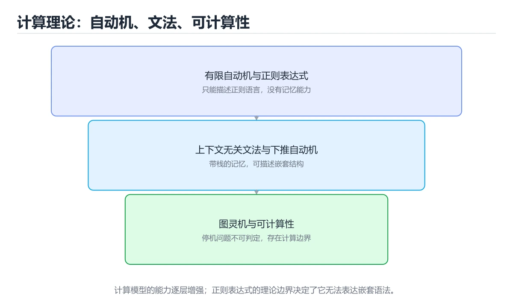
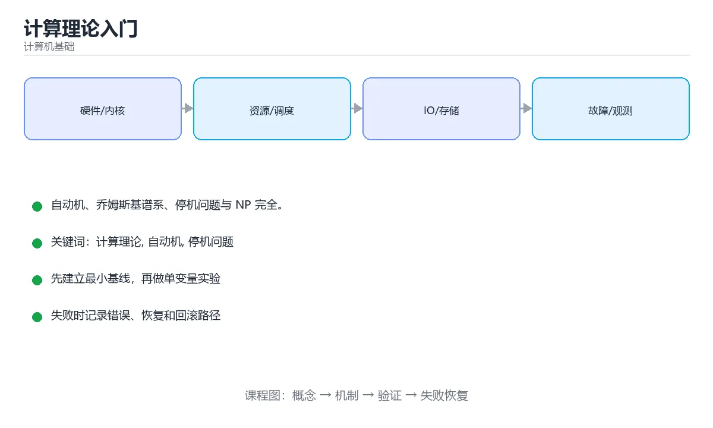

# 计算理论入门





> 内容更新时间：2026-10-06 · 学习阶段：高级 · 预计用时：35 分钟

## 学习目标

- 能用自己的话解释计算理论入门解决了什么问题，而不是只背术语。
- 能说清 「计算理论」、「自动机」、「停机问题」、「NP 完全」 之间的关系，并分别举出一个例子。
- 能把本课知识放回「计算机基础」的知识体系，说明它和相邻主题的边界。
- 能完成本课练习，并用验收标准检查自己的结果。

> 一句话摘要：自动机、乔姆斯基谱系、停机问题与 NP 完全。

## 前置知识

- 先完成上一课《概率统计基础》；如果已经掌握，可以直接用本课练习自测。
- 开始前先复习：计算理论、自动机、停机问题。
- 如果某一步看不懂，先记录具体卡点，完成练习后再回头读一遍。

## 三个核心问题

计算理论回答：**什么问题可以被计算？需要多少资源？用什么模型描述计算？** 它给出计算机能力的边界，也提供了编译器与正则引擎的理论基础。

## 形式语言与自动机

| 模型 | 识别能力 | 对应工具 |
| --- | --- | --- |
| 有限状态自动机 DFA/NFA | 正则语言 | 正则表达式、词法分析 |
| 下推自动机 PDA | 上下文无关语言 | 语法分析、括号匹配 |
| 图灵机 TM | 递归可枚举语言 | 通用计算的理论模型 |

乔姆斯基谱系把它们串起来：正则文法 ⊂ 上下文无关文法 ⊂ 上下文相关文法 ⊂ 无限制文法。编译器前端正是按这条线设计的：词法用正则/DFA，语法用上下文无关文法。

## 正则表达式的理论边界

正则语言无法表达"任意深度的括号匹配"或"aⁿbⁿ 且 n 相同"这类计数依赖。这就是为什么 HTML、JSON、编程语言不能用正则完整解析——必须用语法分析器。理解这一点能避免写出脆弱的正则。

## 可计算性与停机问题

图灵证明了**停机问题不可判定**：不存在一个程序能判断任意程序是否会终止。由此推广出一系列不可判定问题（如判定两个程序是否等价）。实践含义：不要指望静态分析工具能发现所有死循环或所有缺陷。

## 复杂度理论

| 类别 | 含义 | 例子 |
| --- | --- | --- |
| P | 可在多项式时间求解 | 排序、最短路 |
| NP | 可在多项式时间验证 | 旅行商判定、布尔可满足性 |
| NP 完全 | NP 中最难的一类，互相可归约 | SAT、3-SAT、背包判定、图着色 |
| NP 困难 | 至少与 NP 完全一样难 | 旅行商优化版 |

若某个 NP 完全问题存在多项式算法，则 P=NP。工程上的应对是近似算法、启发式搜索、约束求解器与参数化算法。

## 为什么值得学

1. 知道哪些问题"根本做不到"（不可判定 / NP 困难），避免在死路上投入。
2. 理解编译器、正则引擎、类型检查器的实现原理。
3. 培养用归约证明难度的思维方式，是算法设计的进阶能力。

## 本课小结

计算理论划定了计算的三条边界：**能算什么（可计算性）、多快能算（复杂度）、怎么描述算（自动机与文法）**。

## 语言与自动机对照

| 语言类型 | 识别模型 | 典型能力 | 例子 |
| --- | --- | --- | --- |
| 正则语言 | 有限状态自动机（DFA/NFA） | 无计数能力 | 邮箱格式、标识符 |
| 上下文无关语言 | 下推自动机（栈） | 可处理嵌套配对 | 括号匹配、表达式语法 |
| 上下文相关语言 | 线性有界自动机 | 依赖上下文 | 自然语言片段 |
| 递归可枚举语言 | 图灵机 | 可计算的一切 | 通用程序 |

## 复杂度类速查

| 类别 | 含义 | 典型问题 |
| --- | --- | --- |
| P | 可在多项式时间求解 | 排序、最短路 |
| NP | 可在多项式时间验证解 | 旅行商判定、布尔可满足性 |
| NP 完全 | NP 中最难的一类，可互相归约 | SAT、3-SAT、哈密顿回路 |
| NP 难 | 至少和 NP 完全一样难（不必属于 NP） | 停机问题、TSP 优化 |
| PSPACE | 多项式空间可解 | 部分博弈问题 |
| 不可判定 | 不存在通用算法 | 停机问题、等价性判定 |

```python
def is_valid_brackets(text: str) -> bool:
    """正则语言做不到的经典问题：需要栈（下推自动机）。"""
    pairs = {")": "(", "]": "[", "}": "{"}
    stack = []
    for ch in text:
        if ch in "([{":
            stack.append(ch)
        elif ch in pairs and (not stack or stack.pop() != pairs[ch]):
            return False
    return not stack

def halting_reasoning():
    """停机问题的反证思路（示意，不是可运行的判定器）。

    假设存在 H(P, I) 能判断程序 P 在输入 I 上是否停机。
    构造 D(P)：若 H(P, P) 说停机，则 D 死循环；否则 D 停机。
    那么 H(D, D) 无论返回什么都会矛盾 —— 因此 H 不可能存在。
    """
    raise NotImplementedError("停机问题不可判定")
```

## 常见错误与排查

| 容易写错的做法 | 实际现象 | 原因与正确做法 |
| --- | --- | --- |
| 认为正则表达式能匹配任意嵌套 | 递归结构匹配失败 | 嵌套需要栈，属于上下文无关语言 |
| 认为 P 与 NP 已被证明相等或不相等 | 结论错误 | 至今未解决，工程上按不相等假设设计 |
| 把 NP 理解成「非多项式」 | 概念错误 | NP 指「非确定性图灵机多项式时间可解」 |
| 认为 NP 难问题没有实用算法 | 结论片面 | 可用近似、启发式或分支定界 |
| 混淆可判定与可行 | 理论可行但实际不可行 | 指数复杂度在规模大时不可用 |
| 用正则解析 HTML / JSON | 边界情况大量出错 | 用专门的解析器 |
| 认为所有问题都能用程序解决 | 忽视不可判定性 | 明确问题是否可判定 |
| 忽视归约方向 | 证明结论反了 | 要证 A 难，把已知难题归约到 A |
| 认为近似算法没有保证 | 结论片面 | 很多近似算法有可证近似比 |
| 把空间复杂度与时间复杂度混为一谈 | 分类错误 | 分别讨论，PSPACE 与 P 的关系仍未完全明确 |

## 复习与自测

- [ ] 能对应四种语言与识别模型。
- [ ] 能说出 P、NP、NP 完全的含义与关系。
- [ ] 知道停机问题不可判定及反证思路。
- [ ] 明白嵌套结构无法用正则描述。
- [ ] 面对 NP 难问题会考虑近似、启发式或规模限制。

## 补充：自动机层级、可判定性与 P/NP

### 四种计算模型的表达力阶梯

```text
表达力由弱到强
  有限自动机（DFA/NFA）      ── 正则语言：a*b、邮箱格式校验
        ↑ 加上栈
  下推自动机（PDA）          ── 上下文无关语言：括号配对、表达式语法
        ↑ 加上无限可读写纸带
  线性有界自动机（LBA）      ── 上下文相关语言
        ↑ 去掉长度限制
  图灵机（TM）               ── 可计算的一切
```

| 模型 | 记忆能力 | 典型识别对象 | 工程对应 |
| --- | --- | --- | --- |
| 有限自动机 | 当前状态 | 正则表达式 | 词法分析、输入校验 |
| 下推自动机 | 一个栈 | 嵌套结构 | 语法分析（parser） |
| 图灵机 | 无限纸带 | 一般可计算问题 | 通用程序 |

```text
一条实用推论
  正则表达式无法匹配「任意深度的括号」——因为有限自动机没有栈。
  DFA 只能记住固定数量的状态，而括号嵌套深度是无界的。
  所以编程语言解析必须用栈或递归下降，而不是一条正则。
```

### 可判定与不可判定

```text
可判定问题：存在算法，能在有限步内对任意输入给出「是/否」
不可判定问题：不存在这样的算法（不是「还没找到」，而是证明不可能）

经典不可判定问题
  · 停机问题：给定程序与输入，判断它最终是否停止
  · 等价性问题：两个程序是否对所有输入行为一致
  · 死代码检测：某段代码是否永远不会执行
```

```text
停机问题为什么不可判定（反证思路）
  假设存在函数 halt(P, x) 能判断 P 在 x 上是否停机
  构造程序 Q：
      Q(P)：若 halt(P, P) 返回「会停机」，则 Q 无限循环
            否则 Q 立即停止
  把 Q 自己传给自己：Q(Q)
      · 若 halt(Q, Q) 说会停机，则 Q 不停机（矛盾）
      · 若 halt(Q, Q) 说不停机，则 Q 停机（矛盾）
  矛盾 → 假设不成立 → 停机问题不可判定
```

**工程含义**：静态分析工具不可能同时做到「对所有程序都给出准确结论」，
因此它们要么保守（宁可误报）、要么宽松（宁可漏报），要么只能给出近似答案。

### P、NP、NP-完全与 NP-难

```text
P：能在多项式时间内解决的问题（排序、最短路、线性规划）
NP：给定一个解，能在多项式时间内验证其正确性
NP-完全（NPC）：NP 中最难的一类，任一 NP 问题都能归约到它
NP-难（NP-hard）：至少和 NPC 一样难，但不一定属于 NP（可能是不可判定的）

   ┌──────────────── NP ────────────────┐
   │   ┌─────── P ───────┐              │
   │   │ 排序 最短路 匹配  │   NPC（旅行商判定、SAT、背包）│
   │   └─────────────────┘              │
   └────────────────────────────────────┘
        NP-hard 还包含 NP 之外更难的问题
```

P 是否等于 NP 至今未解，但**工程上不依赖这个悬而未决的问题**：

| 场景 | 做法 |
| --- | --- |
| 遇到 NPC 问题 | 用近似算法、启发式（贪心、模拟退火）或限规模求解 |
| 数据规模很小 | 直接用指数算法（回溯 + 剪枝） |
| 需要可接受解 | 用近似比有保证的算法 |
| 需要精确解 | 用整数规划求解器（分枝定界） |

### 这些理论对写代码的实际价值

```text
① 判断问题难度：先看它是不是 NPC，避免白费力气找多项式算法
② 选型依据：正则 vs 手写解析器（是否需要栈）
③ 理解工具边界：静态分析为何必然误报或漏报
④ 复杂度直觉：知道 O(n log n) 排序是理论下界附近的算法
```

### 自查清单

- [ ] 能说出四层计算模型与对应语言类型
- [ ] 知道正则为什么无法匹配任意深度括号
- [ ] 能复述停机问题不可判定的反证思路
- [ ] 能区分 P、NP、NPC 与 NP-hard
- [ ] 遇到 NPC 问题知道用近似或限规模方案

## 动手练习

> 本课练习重点：围绕「计算理论、自动机、停机问题」完成复述、实验和交付，每个结果都要能被别人检查。

先用表格或时序图描述机制，再手算一个最小例子，最后用程序验证。

### 练习 1：建立心智模型（10 分钟）

合上教程，用 3～5 句话回答：

1. 计算理论入门解决了什么问题？
2. 如果没有它，会出现什么具体后果？
3. 它和「自动机」是什么关系？

**验收标准**：至少出现一个本课关键词，并写出一个反例、边界条件或失效场景。

### 练习 2：做一次可控实验（20 分钟）

从正文中选一个最小示例，完成以下操作：

1. 先预测修改一个参数、输入或步骤后的结果。
2. 再实际执行或逐步推演，记录真实结果。
3. 如果结果与预测不同，写出差异原因。

**验收标准**：留下「原例 → 改动 → 预测 → 结果 → 原因」五步记录。

### 练习 3：交付一个小结果（30 分钟）

用表格、真值表或计算过程把抽象概念落到一个可核对的结果上。

任务要求：

- 结果必须能被别人检查，不能只写“我已经理解了”。
- 至少覆盖「计算理论」和「自动机」两个关键词。
- 写出 1 个仍然不确定的问题，以及下一步如何验证。

> 提示：时间有限时优先做练习 1 和练习 2；练习 3 可以拆成两次完成。

## 可运行练习

### 任务 1：先跑通，再解释

```python
def is_valid_brackets(text: str) -> bool:
    """正则语言做不到的经典问题：需要栈（下推自动机）。"""
    pairs = {")": "(", "]": "[", "}": "{"}
    stack = []
    for ch in text:
        if ch in "([{":
            stack.append(ch)
        elif ch in pairs and (not stack or stack.pop() != pairs[ch]):
            return False
    return not stack

def halting_reasoning():
    """停机问题的反证思路（示意，不是可运行的判定器）。

    假设存在 H(P, I) 能判断程序 P 在输入 I 上是否停机。
    构造 D(P)：若 H(P, P) 说停机，则 D 死循环；否则 D 停机。
    那么 H(D, D) 无论返回什么都会矛盾 —— 因此 H 不可能存在。
    """
    raise NotImplementedError("停机问题不可判定")
```

### 任务 2：只改一个条件

把「计算理论入门」的最小示例复制一份，只改一个条件再跑一次：

- 改动点：只把计算理论的输入换成空值、极值或错误输入，其余保持不变。
- 预测：先写下「计算理论入门」在改动后的输出或错误信息，再运行。
- 记录：对照改动前后的结果，指出差异出在哪一步。
- 验收：换回原条件能复现原结果，改动只影响计算理论。

### 任务 3：迁移到自己的数据

用同一套思路处理一组你自己的数据或场景，保持输出格式与任务 1 一致。

## 故障现场

### 现场 1：本课的 计算理论 常规用例通过，但边界用例失败

**症状**：在本课的练习或生产场景里出现“本课的 计算理论 常规用例通过，但边界用例失败”。

**复现**：准备一组最小输入，只保留触发“本课的 计算理论 常规用例通过，但边界用例失败”的必要条件，连续运行两次确认结果稳定。

**定位**：围绕“计算理论 的前置条件与取值边界没有写进代码，默认值掩盖了空值和极值”检查调用链、输入数据和环境配置，先验证假设再改代码。

**预防**：把“本课的 计算理论 常规用例通过，但边界用例失败”写成一条自动化用例，并在本课的验收清单里保留对应检查项。

### 现场 2：本课的 自动机 结果在两次运行之间不一致

**症状**：在本课的练习或生产场景里出现“本课的 自动机 结果在两次运行之间不一致”。

**复现**：准备一组最小输入，只保留触发“本课的 自动机 结果在两次运行之间不一致”的必要条件，连续运行两次确认结果稳定。

**定位**：围绕“自动机 依赖了当前版本、执行顺序或共享状态，单次运行无法暴露差异”检查调用链、输入数据和环境配置，先验证假设再改代码。

**预防**：把“本课的 自动机 结果在两次运行之间不一致”写成一条自动化用例，并在本课的验收清单里保留对应检查项。

### 现场 3：本课的验证只在开发机通过

**症状**：在本课的练习或生产场景里出现“本课的验证只在开发机通过”。

**定位**：围绕“环境版本、配置和输入规模与目标环境不同，计算理论 缺少可重复的验证记录”检查调用链、输入数据和环境配置，先验证假设再改代码。

## 本课复习清单

离开本课前，逐项确认：

- [ ] 不看解析，能说出「正则表达式对应的计算模型是？」的判断依据。
- [ ] 不看解析，能说出「停机问题的结论是？」的判断依据。
- [ ] 不看解析，能说出「NP 完全问题的含义是？」的判断依据。
- [ ] 不看解析，能说出「关于 P 与 NP，目前已知的结论是？」的判断依据。
- [ ] 不看解析，能说出「上下文无关文法对应的自动机是？」的判断依据。
- [ ] 至少运行一次本课示例，记录输入、输出和一个边界情况。
- [ ] 把本课最容易混淆的两个概念写成一句话对照。

| 复盘项 | 记录 |
| --- | --- |
| 已经能独立解释的考点 |  |
| 仍然说不清的概念 |  |
| 下一步验证动作 |  |

## 术语速查

| 术语 | 一句话说明 |
| --- | --- |
| `计算理论` | 围绕“环境版本、配置和输入规模与目标环境不同，计算理论 缺少可重复的验证记录”检查调用链、输入数据和环境配置，先验证假设再改代码。 |
| `自动机` | 围绕“自动机 依赖了当前版本、执行顺序或共享状态，单次运行无法暴露差异”检查调用链、输入数据和环境配置，先验证假设再改代码。 |
| `停机问题` | 按“计算理论入门”中 计算理论、自动机、停机问题 的实践顺序，把四个步骤排成从准备到复盘的合理顺序。 |
| `NP 完全` | 用一句话说明「计算理论入门」解决什么问题：自动机、乔姆斯基谱系、停机问题与 NP 完全。 |
| `正则语言` | 它在「计算理论入门」里是理解「正则语言」的关键术语，用来解释定义、适用条件与失败路径；它与计算理论、自动机共同决定这一节的判断边界。复习时回到正文示例核对输入、输出和验证方式。 |

## 考点精讲

### 考点 1：顺序排列·计算理论

- **题目**：按“计算理论入门”中 计算理论、自动机、停机问题 的实践顺序，把四个步骤排成从准备到复盘的合理顺序。
- **判断依据**：在「计算理论入门」里，在本课的练习里，顺序应当是：先明确 计算理论 的输入、输出与约束 → 写出最小示例并核对 自动机 的基线结果 → 只改一个变量，记录边界与失败路径的变化 → 固定版本与证据，把本课的结论写成可复现记录。这个顺序把 计算理论 的输入、输出和约束放在最前面，在计算理论入门里避免概念没对齐就开始调参。第二步用 自动机 建立可核对的基线，在计算理论入门里第三步才允许改变一个变量并观察失败路径。

### 考点 2：代码补全·计算理论

- **题目**：这段 Python 代码是「计算理论入门」的示例片段，下面哪一项描述与它一致？
- **判断依据**：在「计算理论入门」里，题干的正确项是这段代码把主要逻辑封装在函数或方法里，需要被调用才会执行，在「计算理论入门」里封装边界决定计算理论从哪一步开始生效。把输入或边界换成空值、极值或失败情况后，结论要以「计算理论入门」的实际运行结果为准。把“这段代码把主要逻辑封装在函数或方法里”代回「计算理论入门」里“这段 Python 代码是计算理论入门的示例片段”的例子核对，条件一旦改变，结论就要用计算理论、自动机、停机问题重新推导。

### 考点 3：概念判断·计算理论

- **题目**：NP 完全问题的含义是？
- **判断依据**：在「计算理论入门」里，属于 NP 且 NP 中所有问题都能归约到它。只要其中一个找到多项式算法，就证明 P=NP。「计算理论入门」要求先交代计算理论、自动机、停机问题的前提再下结论，所以“属于 NP 且 NP 中所有问题都能归约”只在题干“NP 完全问题的含义是”给定的条件下成立。

### 考点 4：概念判断·计算理论

- **题目**：关于 P 与 NP，目前已知的结论是？
- **判断依据**：在「计算理论入门」里，作答时，先用计算理论建立输入与输出的基线，再把P ⊆ NP，但 P 是否等于 NP 仍未解决代入边界条件核对，结论才能复现。在「计算理论入门」里，这道题要求区分概念与边界，「P ⊆ NP，但 P 是否等于 NP 仍未解决」只有在题干给出的前提下才成立，而「P 与 NP 无交集」、「NP 完全问题都能在多项式时间内求解」缺少同一组条件。

### 考点 5：概念判断·计算理论

- **题目**：上下文无关文法对应的自动机是？
- **判断依据**：在「计算理论入门」里，下推自动机（PDA）。PDA 比 DFA 多了栈，正好对应括号配对这类嵌套结构。在「计算理论入门」里判断这道题，要把计算理论、自动机、停机问题的条件、过程与失败路径逐项对齐，换成“上下文无关文法对应的自动机是”这个场景，只有满足前提的结论才成立。回到「计算理论入门」的正文示例，用“上下文无关文法对应的自动机是”走一遍计算理论、自动机、停机问题的完整流程，能复现的结论才可以保留。

### 考点 6：多选辨析·计算理论

- **题目**：以下哪些术语与「计算理论入门」直接相关？（多选）
- **判断依据**：自动机是否完整覆盖题干的输入、输出和失败路径，并排除计算理论、拦截器这类相邻概念。把“计算理论”代回「计算理论入门」里“以下哪些术语与计算理论入门直接相关”的例子核对，条件一旦改变，结论就要用计算理论、自动机、停机问题重新推导。「计算理论入门」要求先交代计算理论、自动机、停机问题的前提再下结论，所以“计算理论”只在题干“以下哪些术语与直接相关（多选）”给定的条件下成立。

## English Overview

**Title:** Computation Theory

**Summary:** Automata, undecidability and NP-completeness.

**Category:** Fundamentals
**Level:** 高级
**Key terms:** 计算理论, 自动机, 停机问题, NP 完全, 正则语言

## 内容元数据

- 内容版本：v2.0
- 最后更新：2026-10-06
- 学习阶段：高级
- 适用环境：通用计算机体系结构知识
- 内容来源：内置结构化课程与工程实践整理
- 相关主题：计算理论、自动机、停机问题、NP 完全、正则语言
- 质量版本：P0 测验标准 + P1 覆盖扩展 + P2 体验补全

## 参考资料与复核

- 最后复核：2026-10-04
- 下次复核：2027-04-04
- 复核范围：版本兼容、API 行为、安全建议与工程实践
- 来源性质：官方文档、标准或权威教材；正文为离线教学重组

| 参考资料 | 本课用途 |
| --- | --- |
| [CS50 计算机科学导论](https://cs50.harvard.edu/x/) | 计算机科学综合入门 |
| [Linux 内核文档](https://docs.kernel.org/) | 操作系统与硬件接口 |
| [Nand2Tetris](https://www.nand2tetris.org/) | 从逻辑门到计算机系统 |

> 「计算理论入门」的链接用于离线阅读后的延伸核对；App 不会自动联网。

## 复习与迁移

复习目标：把「计算理论入门」的判断标准放回可复现的例子里。先自己作答，再对照依据；如果结论正确但理由不完整，回到正文补足前提。

### 概念复述

- 用一句话说明「计算理论入门」解决什么问题：自动机、乔姆斯基谱系、停机问题与 NP 完全。
- 写出计算理论、自动机、停机问题之间的关系，并各举一个例子。
- 说出本课最容易混淆的两个概念，以及区分它们的判据。

### 正文逐节复核

- **正则表达式的理论边界**：正则语言无法表达"任意深度的括号匹配"或"aⁿbⁿ 且 n 相同"这类计数依赖。
- **可计算性与停机问题**：图灵证明了**停机问题不可判定**：不存在一个程序能判断任意程序是否会终止。
- **复杂度理论**：若某个 NP 完全问题存在多项式算法，则 P=NP。

### 测验回顾

1. 按“计算理论入门”中 计算理论、自动机、停机问题 的实践顺序，把四个步骤排成从准备到复盘的合理顺序。
   - 依据：在「计算理论入门」里，在本课的练习里，顺序应当是：先明确 计算理论 的输入、输出与约束 → 写出最小示例并核对 自动机 的基线结果 → 只改一个变量，记录边界与失败路径的变化 → 固定版本与证据，把本课的结论写成可复现记录。这个顺序把 计算理论 的输入、输出和约束放在最前面，在计算理论入门里避免概念没对齐就开始调参。第二步用 自动机 建立可核对的基线，在计算理论入门里第三步才允许改变一个变量并观察失败路径。
2. 这段 Python 代码是「计算理论入门」的示例片段，下面哪一项描述与它一致？
   - 依据：在「计算理论入门」里，题干的正确项是这段代码把主要逻辑封装在函数或方法里，需要被调用才会执行，在「计算理论入门」里封装边界决定计算理论从哪一步开始生效。把输入或边界换成空值、极值或失败情况后，结论要以「计算理论入门」的实际运行结果为准。把“这段代码把主要逻辑封装在函数或方法里”代回「计算理论入门」里“这段 Python 代码是计算理论入门的示例片段”的例子核对，条件一旦改变，结论就要用计算理论、自动机、停机问题重新推导。
3. NP 完全问题的含义是？
   - 依据：在「计算理论入门」里，属于 NP 且 NP 中所有问题都能归约到它。只要其中一个找到多项式算法，就证明 P=NP。「计算理论入门」要求先交代计算理论、自动机、停机问题的前提再下结论，所以“属于 NP 且 NP 中所有问题都能归约”只在题干“NP 完全问题的含义是”给定的条件下成立。
4. 关于 P 与 NP，目前已知的结论是？
   - 依据：在「计算理论入门」里，作答时，先用计算理论建立输入与输出的基线，再把P ⊆ NP，但 P 是否等于 NP 仍未解决代入边界条件核对，结论才能复现。在「计算理论入门」里，这道题要求区分概念与边界，「P ⊆ NP，但 P 是否等于 NP 仍未解决」只有在题干给出的前提下才成立，而「P 与 NP 无交集」、「NP 完全问题都能在多项式时间内求解」缺少同一组条件。
5. 上下文无关文法对应的自动机是？
   - 依据：在「计算理论入门」里，下推自动机（PDA）。PDA 比 DFA 多了栈，正好对应括号配对这类嵌套结构。在「计算理论入门」里判断这道题，要把计算理论、自动机、停机问题的条件、过程与失败路径逐项对齐，换成“上下文无关文法对应的自动机是”这个场景，只有满足前提的结论才成立。回到「计算理论入门」的正文示例，用“上下文无关文法对应的自动机是”走一遍计算理论、自动机、停机问题的完整流程，能复现的结论才可以保留。
6. 以下哪些术语与「计算理论入门」直接相关？（多选）
   - 依据：自动机是否完整覆盖题干的输入、输出和失败路径，并排除计算理论、拦截器这类相邻概念。把“计算理论”代回「计算理论入门」里“以下哪些术语与计算理论入门直接相关”的例子核对，条件一旦改变，结论就要用计算理论、自动机、停机问题重新推导。「计算理论入门」要求先交代计算理论、自动机、停机问题的前提再下结论，所以“计算理论”只在题干“以下哪些术语与直接相关（多选）”给定的条件下成立。

### 迁移练习

把「计算理论入门」的结论迁移到相邻主题，每次迁移都写清预测与证据：

1. 换输入：用计算理论处理一组你自己的数据，对比教材示例的结果差异。
2. 换失败条件：制造一个自动机相关的错误，说明如何从错误信息定位根因。
3. 换规模：把数据量或并发度提高一个数量级，说明「计算理论入门」的结论是否仍成立。
