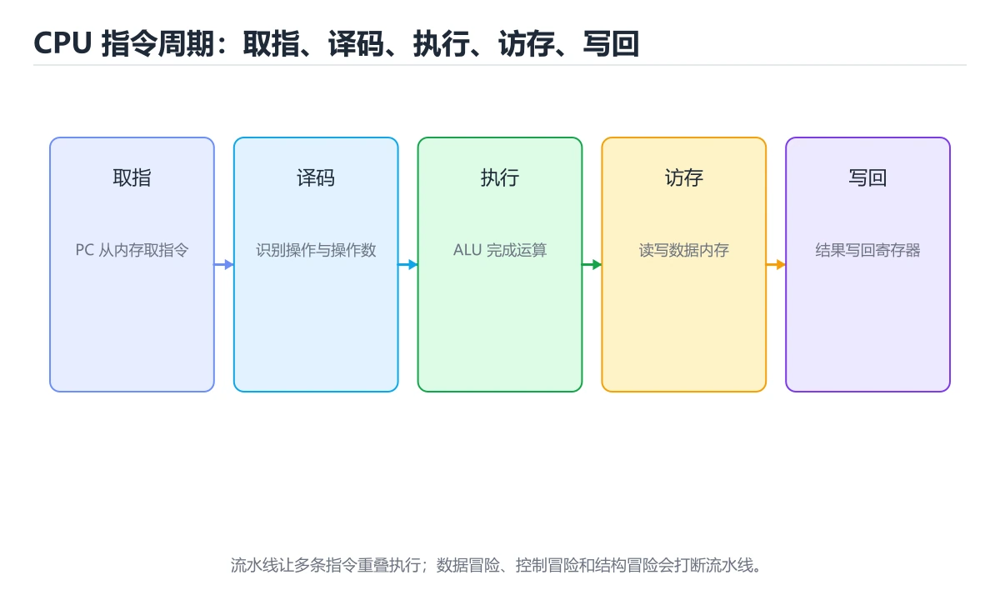
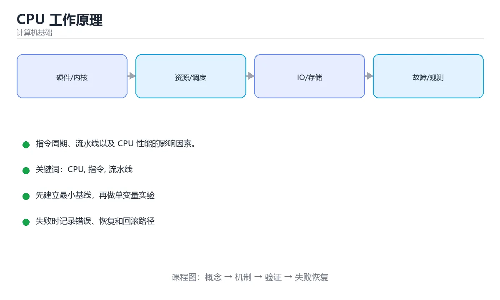

# CPU 工作原理





> 内容更新时间：2026-10-06 · 学习阶段：基础 · 预计用时：45 分钟

## 本节知识框架

**课程定位**：所属分类 `fundamentals`（计算机基础），课程主题 `CPU 工作原理`，学习阶段 基础，建议用时 50 分钟。

本课主线：指令周期、流水线以及 CPU 性能的影响因素。

**学完本课应当能够**
- 说清 `CPU` 与 `指令` 的含义与区别，并各举一个正例和一个反例。
- 用本课示例验证 `流水线` 的行为，记录输入、输出与失败条件。
- 遇到「只看主频判断性能」这类问题时，能说出触发条件与修复顺序。

### 从概念到验证的学习链条

1. `CPU`：先掌握 现代 CPU 通过流水线、超标量和多核来提升 IPC 与并行度，再用它解释 `指令` 为什么会出现。
2. `指令`：先掌握 汇编指令会被转换为机器码，最终变成 CPU 能识别的 0/1 序列，再用它解释 `流水线` 为什么会出现。
3. `流水线`：先掌握 把一条指令拆成多个阶段，让不同指令的不同阶段同时进行，就像工厂流水线，再用它解释 `ALU` 为什么会出现。
4. `ALU`：先掌握 执行（Execute）：ALU 做算术或逻辑运算，或访问内存，再用它解释 `寄存器` 为什么会出现。
5. `寄存器`：先掌握 CPU 内部速度最快的小容量存储，用于保存指令操作数、地址和状态，再用它解释 `分支预测` 为什么会出现。
6. `分支预测`：先掌握 CPU 在执行分支前猜测下一步路径并提前取指，猜错需要清空流水线，再用它解释 本课示例的观察结果 为什么会出现。

**先修与衔接**：本课是「计算机基础」分类的第 4 课。先修内容：《二进制与进制转换》。《二进制与进制转换》里的 `补码`、`进制转换` 是本课的前提。相关或后续课程：《内存与缓存》。

### 完成判据

- **定义关**：不看正文也能说明 `CPU` 是 现代 CPU 通过流水线、超标量和多核来提升 IPC 与并行度，并指出一个反例。
- **机制关**：能按“输入 → 转换 → 输出 → 验证”复述 `CPU 工作原理`，而不是只背结论。
- **示例关**：能运行或推演 `CPU 工作原理` 的 `text` 示例，并说明一个真实出现的标识符或字面量。
- **证据关**：能指出 `CPU 工作原理` 示例里的 调用了 `decode()`，并说明它支持或反驳了本课的哪一条结论。
- **排错关**：能复现 只看主频判断性能，记录现象并按 还要看 IPC、核数、缓存与指令集 修复。
- **迁移关**：能把 `CPU`、`指令`、`流水线`、`ALU` 放进一个与 `CPU 工作原理` 不同的项目场景，并保持输入与验证条件可追踪。
- **复盘关**：学完 `CPU 工作原理` 后，用一句话写下仍然不确定的结论，并列出下一次验证需要的输入、环境和成功判据。

### 复习清单

- [ ] 能不看正文复述本课核心术语，并指出一个边界或反例。
- [ ] 能运行或推演本课示例，记录输入、输出与失败现象。
- [ ] 能完成一次自测，并把错题对照错误表定位原因。

## 核心概念定义

| 术语 | 操作性定义 | 常见边界与风险 |
| --- | --- | --- |
| CPU | 现代 CPU 通过流水线、超标量和多核来提升 IPC 与并行度。 | 只在「现代 CPU 通过流水线、超标量和多核来提升 IPC 与并行度」这一前提下成立，换输入或换环境要重新验证。 |
| 指令 | 汇编指令会被转换为机器码，最终变成 CPU 能识别的 0/1 序列。 | 易错：结论错误；正确做法是还要看 IPC、核数、缓存与指令集。 |
| 流水线 | 把一条指令拆成多个阶段，让不同指令的不同阶段同时进行，就像工厂流水线。 | 易错：实测提升有限；正确做法是受冒险、预测失败与访存限制。 |
| ALU | 执行（Execute）：ALU 做算术或逻辑运算，或访问内存。 | 越界、悬垂引用与释放顺序会破坏结论，必须在边界输入下复验。 |
| 寄存器 | CPU 内部速度最快的小容量存储，用于保存指令操作数、地址和状态。 | 缓存与状态残留会让结果过期，先明确失效策略再判断正确性。 |
| 分支预测 | CPU 在执行分支前猜测下一步路径并提前取指，猜错需要清空流水线。 | 易错：条件分支密集处性能差；正确做法是减少不可预测分支，或用无分支写法。 |
| 主频 | 时钟频率，不一定等价于性能 | 易错：结论错误；正确做法是还要看 IPC、核数、缓存与指令集。 |
| IPC | 每周期执行指令数，吞吐 = 主频 × IPC | 易错：结论错误；正确做法是还要看 IPC、核数、缓存与指令集。 |
| 流水线 | 多阶段重叠执行，理想加速比等于级数 | 易错：实测提升有限；正确做法是受冒险、预测失败与访存限制。 |
| 超标量 | 一个周期发射多条指令 | 只在「一个周期发射多条指令」这一前提下成立，换输入或换环境要重新验证。 |
| 乱序执行 | 由硬件动态重排，掩盖延迟 | 结论随输入规模变化，小规模成立不代表大规模成立，需要重新测量。 |
| 分支预测 | 预测跳转方向，猜错要清空流水线 | 易错：条件分支密集处性能差；正确做法是减少不可预测分支，或用无分支写法。 |
| 数据冒险 | 后续指令依赖前面结果 | 不同版本与依赖组合的行为可能不同，升级或换环境前要按官方变更说明重新验证。 |
| 流水线气泡 | 因冒险或预测失败产生的空转 | 只在「因冒险或预测失败产生的空转」这一前提下成立，换输入或换环境要重新验证。 |
| 超线程 | 一个物理核上跑多个逻辑线程，共享执行单元 | 易错：计算资源高估；正确做法是超线程共享执行单元，提升有限。 |
| 多核 | 真正的并行执行单元 | 只在「真正的并行执行单元」这一前提下成立，换输入或换环境要重新验证。 |

## 原理与运行机制

### 机制总览

**教材衔接：CPU 是什么**

CPU（中央处理器）是计算机的运算与控制中心：它不断从内存取出指令、解释执行，再写回结果。核心流程可以概括为 **取指 → 译码 → 执行 → 写回**。

**教材衔接：指令执行周期速查**

| 阶段 | 作用 | 依赖的部件 |
| --- | --- | --- |
| 取指（Fetch） | 按 PC 读取指令 | 指令缓存、PC |
| 译码（Decode） | 解析操作码与操作数 | 译码器、寄存器堆 |
| 执行（Execute） | ALU 运算或地址计算 | ALU、FPU |
| 访存（Memory） | 读或写数据 | 数据缓存 |
| 写回（Write Back） | 结果写回寄存器 | 寄存器堆 |

**失败路径（来自本课错误表）**
- 只看主频判断性能 → 结论错误 → 还要看 IPC、核数、缓存与指令集。
- 认为流水线能线性提速 → 实测提升有限 → 受冒险、预测失败与访存限制。
- 忽略分支预测失败代价 → 条件分支密集处性能差 → 减少不可预测分支，或用无分支写法。
- 认为超线程等于双核 → 计算资源高估 → 超线程共享执行单元，提升有限。
### 机制拆解：每一步的输入、动作与输出

#### 1. `CPU`
- 输入：`CPU`；本步把 现代 CPU 通过流水线、超标量和多核来提升 IPC 与并行度 当作判断规则。
- 动作：围绕 `CPU` 保留中间状态，并记录它与 `指令` 的对应关系。
- 输出：`指令`，它可以被下一段代码、测试或记录继续使用。
- `CPU` 的失败条件：只在「现代 CPU 通过流水线、超标量和多核来提升 IPC 与并行度」这一前提下成立，换输入或换环境要重新验证。

#### 2. `指令`
- 输入：`CPU`；本步把 汇编指令会被转换为机器码，最终变成 CPU 能识别的 0/1 序列 当作判断规则。
- 动作：围绕 `指令` 保留中间状态，并记录它与 `流水线` 的对应关系。
- 输出：`流水线`，它可以被下一段代码、测试或记录继续使用。
- `指令` 的失败条件：当只看主频判断性能时，会出现结论错误。

#### 3. `流水线`
- 输入：`指令`；本步把 把一条指令拆成多个阶段，让不同指令的不同阶段同时进行，就像工厂流水线 当作判断规则。
- 动作：围绕 `流水线` 保留中间状态，并记录它与 `ALU` 的对应关系。
- 输出：`ALU`，它可以被下一段代码、测试或记录继续使用。
- `流水线` 的失败条件：当认为流水线能线性提速时，会出现实测提升有限。

#### 4. `ALU`
- 输入：`流水线`；本步把 执行（Execute）：ALU 做算术或逻辑运算，或访问内存 当作判断规则。
- 动作：围绕 `ALU` 保留中间状态，并记录它与 `寄存器` 的对应关系。
- 输出：`寄存器`，它可以被下一段代码、测试或记录继续使用。
- `ALU` 的失败条件：越界、悬垂引用与释放顺序会破坏结论，必须在边界输入下复验。

#### 5. `寄存器`
- 输入：`ALU`；本步把 CPU 内部速度最快的小容量存储，用于保存指令操作数、地址和状态 当作判断规则。
- 动作：围绕 `寄存器` 保留中间状态，并记录它与 `分支预测` 的对应关系。
- 输出：`分支预测`，它可以被下一段代码、测试或记录继续使用。
- `寄存器` 的失败条件：缓存与状态残留会让结果过期，先明确失效策略再判断正确性。

#### 6. `分支预测`
- 输入：`寄存器`；本步把 CPU 在执行分支前猜测下一步路径并提前取指，猜错需要清空流水线 当作判断规则。
- 动作：围绕 `分支预测` 保留中间状态，并记录它与 `decode` 的对应关系。
- 输出：`decode`，它可以被下一段代码、测试或记录继续使用。
- `分支预测` 的失败条件：当忽略分支预测失败代价时，会出现条件分支密集处性能差。

### 示例中的可观察事实

1. 调用了 `decode()`；它对应的课程主题是 `CPU 工作原理`。
2. 调用了 `execute()`；它对应的课程主题是 `CPU 工作原理`。
3. 调用了 `write_back()`；它对应的课程主题是 `CPU 工作原理`。

### 复现实验记录

- 环境：`CPU 工作原理` 使用 `text` 示例，固定 `CPU`、`指令`、`流水线`、`ALU` 作为第一组条件。
- 首轮输入：先确认 调用了 `decode()`，预测 `CPU` 会怎样变化。
- 基线观察：记录命令、输入、输出和错误原文，不用截图代替可复制的文本。
- 单变量修改：只改变 `CPU`，观察 `分支预测` 是否仍满足定义。
- 失败注入：复现 只看主频判断性能，确认现象是 结论错误。
- 记录结论：把“修改前、修改后、预期变化、实际变化”写成四列表，这样复盘 `CPU 工作原理` 时才能区分概念错误与实现错误。

## 典型应用场景

- **只看主频判断性能**：典型现象是结论错误；正确做法是还要看 IPC、核数、缓存与指令集。
- **认为流水线能线性提速**：典型现象是实测提升有限；正确做法是受冒险、预测失败与访存限制。
- **忽略分支预测失败代价**：典型现象是条件分支密集处性能差；正确做法是减少不可预测分支，或用无分支写法。
- **认为超线程等于双核**：典型现象是计算资源高估；正确做法是超线程共享执行单元，提升有限。

### 最小验证场景

- 准备：保留 `text` 示例的原始输入，先记录 `CPU 工作原理` 的基线输出和完整运行命令。
- 观察：先核对 调用了 `decode()`，再改变一个与 `CPU` 相关的条件。
- 判定：新结果与 `CPU 工作原理` 的基线不同不等于错误；只有当差异破坏了 `CPU` 的定义或错误表中的约束，才判定为失败。

### 选择与边界

- 使用 `CPU` 时，先满足它的定义：现代 CPU 通过流水线、超标量和多核来提升 IPC 与并行度；只在「现代 CPU 通过流水线、超标量和多核来提升 IPC 与并行度」这一前提下成立，换输入或换环境要重新验证。
- 使用 `指令` 时，先满足它的定义：汇编指令会被转换为机器码，最终变成 CPU 能识别的 0/1 序列；易错：结论错误；正确做法是还要看 IPC、核数、缓存与指令集。
- 使用 `流水线` 时，先满足它的定义：把一条指令拆成多个阶段，让不同指令的不同阶段同时进行，就像工厂流水线；易错：实测提升有限；正确做法是受冒险、预测失败与访存限制。
- 使用 `ALU` 时，先满足它的定义：执行（Execute）：ALU 做算术或逻辑运算，或访问内存；越界、悬垂引用与释放顺序会破坏结论，必须在边界输入下复验。
- 使用 `寄存器` 时，先满足它的定义：CPU 内部速度最快的小容量存储，用于保存指令操作数、地址和状态；缓存与状态残留会让结果过期，先明确失效策略再判断正确性。

## 代码/协议/SQL 示例

### 最小可验证示例

```text
while (true) {
    instruction = memory[PC];   // 取指
    op = decode(instruction);   // 译码
    result = execute(op);       // 执行
    write_back(result);         // 写回
    PC = PC + 1;
}
```

**教材衔接：指令周期**

1. **取指（Fetch）**：程序计数器 PC 指向下一条指令地址，从内存读取指令。
2. **译码（Decode）**：控制器解析操作码和操作数。
3. **执行（Execute）**：ALU 做算术或逻辑运算，或访问内存。
4. **写回（Write Back）**：把结果写回寄存器或内存，PC 递增。

**教材衔接：时钟频率与 IPC**

性能不只是「主频越高越快」，粗略关系是：

```text
程序耗时 ≈ 指令总数 ÷ (主频 × 每周期执行指令数 IPC)
```

现代 CPU 通过流水线、超标量和多核来提升 IPC 与并行度。

**教材衔接：流水线**

把一条指令拆成多个阶段，让不同指令的不同阶段同时进行，就像工厂流水线：

```text
周期:   1    2    3    4    5
指令A: 取指 译码 执行 写回
指令B:      取指 译码 执行 写回
指令C:           取指 译码 执行 写回
```

理想情况下，每个时钟周期完成一条指令，吞吐量提升数倍。

流水线会遇到三类冒险：

- **结构冒险**：硬件资源冲突。
- **数据冒险**：后一条指令依赖前一条的结果。
- **控制冒险**：分支跳转导致取错指令。

解决办法包括转发（forwarding）、停顿（stall）和分支预测。

**教材衔接：一条真实指令的样子**

```asm
mov eax, [num1]   ; 把内存中的 num1 装入寄存器
add eax, [num2]   ; 与 num2 相加
mov [sum], eax    ; 结果写回内存
```

汇编指令会被转换为机器码，最终变成 CPU 能识别的 0/1 序列。

### 示例精读：先找证据，再改一个条件

1. 调用了 `decode()`；它出现在 `CPU 工作原理` 的示例中，阅读时先确认它前后各发生了什么。
2. 调用了 `execute()`；它出现在 `CPU 工作原理` 的示例中，阅读时先确认它前后各发生了什么。
3. 调用了 `write_back()`；它出现在 `CPU 工作原理` 的示例中，阅读时先确认它前后各发生了什么。
- 在 `CPU 工作原理` 中与 `CPU` 对照：示例必须能支持 现代 CPU 通过流水线、超标量和多核来提升 IPC 与并行度，否则说明这一段还缺少实现或验证步骤。
- 在 `CPU 工作原理` 中与 `指令` 对照：示例必须能支持 汇编指令会被转换为机器码，最终变成 CPU 能识别的 0/1 序列，否则说明这一段还缺少实现或验证步骤。
- 在 `CPU 工作原理` 中与 `流水线` 对照：示例必须能支持 把一条指令拆成多个阶段，让不同指令的不同阶段同时进行，就像工厂流水线，否则说明这一段还缺少实现或验证步骤。
- 在 `CPU 工作原理` 中与 `ALU` 对照：示例必须能支持 执行（Execute）：ALU 做算术或逻辑运算，或访问内存，否则说明这一段还缺少实现或验证步骤。

## 时间/空间复杂度或性能分析

| 层级 | 典型大小 | 延迟 | 归属 |
| --- | --- | --- | --- |
| 寄存器 | 几十到几百字节 | 小于 1 周期 | 每核 |
| L1 | 32 到 64 KB | 约 4 周期 | 每核 |
| L2 | 256 KB 到 1 MB | 约 12 周期 | 每核 |
| L3 | 几 MB 到几十 MB | 约 40 周期 | 多核共享 |
| 主存 | GB 级 | 约 200 周期 | 共享 |

```text
理想情况（每拍完成一条）
时钟  1     2     3     4     5     6     7
IF    指令1  指令2  指令3  指令4  指令5  指令6  指令7
ID          指令1  指令2  指令3  指令4  指令5  指令6
EX                指令1  指令2  指令3  指令4  指令5
MEM                     指令1  指令2  指令3  指令4
WB                            指令1  指令2  指令3

五级流水下，理想吞吐是每拍一条；但真实程序会出现「冒险」
```

| 冒险 | 例子 | 解决 |
| --- | --- | --- |
| 结构冒险 | 取指与访存抢同一个内存端口 | 分离指令与数据缓存（I-Cache / D-Cache） |
| 数据冒险 | 后一条指令要用前一条还没写回的结果 | 转发（forwarding）、插入气泡 |
| 控制冒险 | 分支指令结果未知，下一条该取谁 | 分支预测 + 预测失败时冲刷流水线 |

| 概念 | 含义 | 好处 |
| --- | --- | --- |
| 超标量 | 一个周期发射多条指令 | 提高并行度 |
| 乱序执行 | 不按程序顺序执行，只在结果上保持顺序 | 掩盖访存与运算延迟 |
| 寄存器重命名 | 消除假的数据依赖 | 让指令真正并行 |
| 推测执行 | 提前执行分支后的指令 | 分支命中时零等待 |

```text
MESI 四状态
  M（Modified）  本核改了，与内存不一致，其他核没有副本
  E（Exclusive） 只有本核有副本，且与内存一致
  S（Shared）    多个核都有副本，与内存一致
  I（Invalid）   本核副本已失效

典型动作
  核 1 读同一地址 → 从 I 变 S（共享）
  核 2 想写入     → 先让其他核的副本失效，再进入 M
```

**测量方法**：以 `CPU 工作原理` 的 `CPU` 场景为对象，固定输入跑一遍记录基线，再把规模或并发度提高一个数量级复测；两次结果的差值与波动范围才是结论依据。

### 需要控制的变量与记录项

- `CPU 工作原理` 的 `CPU`：固定它的版本、输入范围和资源上限，分别记录速度、内存与失败率的变化。
- `CPU 工作原理` 的 `指令`：固定它的版本、输入范围和资源上限，分别记录速度、内存与失败率的变化。
- `CPU 工作原理` 的 `流水线`：固定它的版本、输入范围和资源上限，分别记录速度、内存与失败率的变化。
- `CPU 工作原理` 的 `ALU`：固定它的版本、输入范围和资源上限，分别记录速度、内存与失败率的变化。
- `CPU 工作原理` 的 `寄存器`：固定它的版本、输入范围和资源上限，分别记录速度、内存与失败率的变化。
- `CPU 工作原理` 中 `CPU` 的边界：只在「现代 CPU 通过流水线、超标量和多核来提升 IPC 与并行度」这一前提下成立，换输入或换环境要重新验证。达到边界时不要外推，必须重新测量。
- `CPU 工作原理` 中 `指令` 的边界：易错：结论错误；正确做法是还要看 IPC、核数、缓存与指令集。达到边界时不要外推，必须重新测量。
- `CPU 工作原理` 中 `流水线` 的边界：易错：实测提升有限；正确做法是受冒险、预测失败与访存限制。达到边界时不要外推，必须重新测量。
- `CPU 工作原理` 中 `ALU` 的边界：越界、悬垂引用与释放顺序会破坏结论，必须在边界输入下复验。达到边界时不要外推，必须重新测量。
- `CPU 工作原理` 中 `寄存器` 的边界：缓存与状态残留会让结果过期，先明确失效策略再判断正确性。达到边界时不要外推，必须重新测量。
- `CPU 工作原理` 的代码证据：先验证 调用了 `decode()`，再记录该路径的输入规模与耗时；只看代码行数不能推出复杂度。

## 常见误区与易错点

| 容易写错的做法 | 实际现象 | 原因与正确做法 |
| --- | --- | --- |
| 只看主频判断性能 | 结论错误 | 还要看 IPC、核数、缓存与指令集 |
| 认为流水线能线性提速 | 实测提升有限 | 受冒险、预测失败与访存限制 |
| 忽略分支预测失败代价 | 条件分支密集处性能差 | 减少不可预测分支，或用无分支写法 |
| 认为超线程等于双核 | 计算资源高估 | 超线程共享执行单元，提升有限 |
| 忽视缓存局部性 | 大数据遍历极慢 | 顺序访问、分块处理提升命中率 |
| 多线程盲目加速 | 甚至变慢 | 受限于共享资源与同步开销 |
| 用主频比较不同架构 | 不公平 | 不同微架构的 IPC 差异很大 |
| 认为指令数少就一定快 | 可能更慢 | 还要看每条指令的延迟与吞吐 |
| 忽略内存墙 | 计算单元等数据 | 优化数据访问模式往往收益更大 |
| 混用 GHz 与 MHz 换算 | 差 1000 倍 | 统一单位后再比较 |

### 现场 1：只看主频判断性能

**症状**：结论错误。

**根因与修复**：还要看 IPC、核数、缓存与指令集。

**自检**：在本课示例里复现「只看主频判断性能」，改成还要看 IPC、核数、缓存与指令集后重跑；如果症状消失且失败路径按预期变化，说明定位正确。

### 现场 2：认为流水线能线性提速

**症状**：实测提升有限。

**根因与修复**：受冒险、预测失败与访存限制。

**自检**：在本课示例里复现「认为流水线能线性提速」，改成受冒险、预测失败与访存限制后重跑；如果症状消失且失败路径按预期变化，说明定位正确。

### 现场 3：忽略分支预测失败代价

**症状**：条件分支密集处性能差。

**根因与修复**：减少不可预测分支，或用无分支写法。

**自检**：在本课示例里复现「忽略分支预测失败代价」，改成减少不可预测分支，或用无分支写法后重跑；如果症状消失且失败路径按预期变化，说明定位正确。

### 现场 4：认为超线程等于双核

**症状**：计算资源高估。

**根因与修复**：超线程共享执行单元，提升有限。

**自检**：在本课示例里复现「认为超线程等于双核」，改成超线程共享执行单元，提升有限后重跑；如果症状消失且失败路径按预期变化，说明定位正确。

### 现场 5：忽视缓存局部性

**症状**：大数据遍历极慢。

**根因与修复**：顺序访问、分块处理提升命中率。

**自检**：在本课示例里复现「忽视缓存局部性」，改成顺序访问、分块处理提升命中率后重跑；如果症状消失且失败路径按预期变化，说明定位正确。

### 现场 6：多线程盲目加速

**症状**：甚至变慢。

**根因与修复**：受限于共享资源与同步开销。

**自检**：在本课示例里复现「多线程盲目加速」，改成受限于共享资源与同步开销后重跑；如果症状消失且失败路径按预期变化，说明定位正确。

### 现场 7：用主频比较不同架构

**症状**：不公平。

**根因与修复**：不同微架构的 IPC 差异很大。

**自检**：在本课示例里复现「用主频比较不同架构」，改成不同微架构的 IPC 差异很大后重跑；如果症状消失且失败路径按预期变化，说明定位正确。

### 现场 8：认为指令数少就一定快

**症状**：可能更慢。

**根因与修复**：还要看每条指令的延迟与吞吐。

**自检**：在本课示例里复现「认为指令数少就一定快」，改成还要看每条指令的延迟与吞吐后重跑；如果症状消失且失败路径按预期变化，说明定位正确。

### 现场 9：忽略内存墙

**症状**：计算单元等数据。

**根因与修复**：优化数据访问模式往往收益更大。

**自检**：在本课示例里复现「忽略内存墙」，改成优化数据访问模式往往收益更大后重跑；如果症状消失且失败路径按预期变化，说明定位正确。

## 与其他知识点的关系

**教材衔接：复习与迁移**

### 概念复述

- 用一句话说明「CPU 工作原理」解决什么问题：指令周期、流水线以及 CPU 性能的影响因素。
- 写出CPU、指令、流水线之间的关系，并各举一个例子。
- 说出本课最容易混淆的两个概念，以及区分它们的判据。

### 正文逐节复核

- **CPU 是什么**：CPU（中央处理器）是计算机的运算与控制中心：它不断从内存取出指令、解释执行，再写回结果。
- **时钟频率与 IPC**：现代 CPU 通过流水线、超标量和多核来提升 IPC 与并行度。
- **流水线**：把一条指令拆成多个阶段，让不同指令的不同阶段同时进行，就像工厂流水线。
- **一条真实指令的样子**：汇编指令会被转换为机器码，最终变成 CPU 能识别的 0/1 序列。
- **实践任务**：本节围绕CPU 工作原理安排 3 个可交付任务，每个任务都要求留下可以复查的记录。


### 迁移练习

把「CPU 工作原理」的结论迁移到相邻主题，每次迁移都写清预测与证据：

- **先修**：`二进制与进制转换`。本课默认这些内容已经掌握。
- **相关或后续**：`内存与缓存`。本课术语会在这些课程里继续使用。
- **术语归属**：`CPU`、`指令`、`流水线` 的定义以本课「核心概念定义」为准，换到其他课程时先确认定义是否被改写。
- 同一分类的《数字逻辑与布尔代数》也涉及 `ALU`；两课衔接时先确认这个术语的定义是否一致。
- 同一分类的《CPU 流水线与指令级并行》也涉及 `流水线`；两课衔接时先确认这个术语的定义是否一致。

### 先修与后续术语接口

- `二进制与进制转换`：两者通过本分类的学习顺序衔接，阅读时重点比较各自的输入与失败条件。
- `内存与缓存`：两者通过本分类的学习顺序衔接，阅读时重点比较各自的输入与失败条件。

### 容易混淆的相邻概念

- `CPU` 与 `指令`：前者强调 现代 CPU 通过流水线、超标量和多核来提升 IPC 与并行度；后者强调 汇编指令会被转换为机器码，最终变成 CPU 能识别的 0/1 序列。判断时分别检查两条定义的适用范围，不要只看名称相似就互换。
- `指令` 与 `流水线`：前者强调 汇编指令会被转换为机器码，最终变成 CPU 能识别的 0/1 序列；后者强调 把一条指令拆成多个阶段，让不同指令的不同阶段同时进行，就像工厂流水线。判断时分别检查两条定义的适用范围，不要只看名称相似就互换。
- `流水线` 与 `ALU`：前者强调 把一条指令拆成多个阶段，让不同指令的不同阶段同时进行，就像工厂流水线；后者强调 执行（Execute）：ALU 做算术或逻辑运算，或访问内存。判断时分别检查两条定义的适用范围，不要只看名称相似就互换。
- `ALU` 与 `寄存器`：前者强调 执行（Execute）：ALU 做算术或逻辑运算，或访问内存；后者强调 CPU 内部速度最快的小容量存储，用于保存指令操作数、地址和状态。判断时分别检查两条定义的适用范围，不要只看名称相似就互换。
- `寄存器` 与 `分支预测`：前者强调 CPU 内部速度最快的小容量存储，用于保存指令操作数、地址和状态；后者强调 CPU 在执行分支前猜测下一步路径并提前取指，猜错需要清空流水线。判断时分别检查两条定义的适用范围，不要只看名称相似就互换。

## 自测题与参考答案

> 先独立作答，再对照参考答案；答案都能在本课正文、术语表或错误表里找到依据。

### 自测 1（概念复述）

不看正文，写出 `CPU` 的操作性定义，并说明它与 `指令` 的区别。

**参考答案**：现代 CPU 通过流水线、超标量和多核来提升 IPC 与并行度。

`指令` 的定位是：汇编指令会被转换为机器码，最终变成 CPU 能识别的 0/1 序列；两者的差别要从适用对象与失败模式上说明。

### 自测 2（排错）

本课错误表记录了「只看主频判断性能」这类做法。请写出它会出现的现象、根因，以及修复顺序。

**参考答案**：现象是结论错误；正确做法是还要看 IPC、核数、缓存与指令集。修复时先复现现象并保留证据，再改动一处假设重跑，确认现象消失。

### 自测 3（动手验证）

运行本课的 `text` 示例，把其中的 `5` 换成一个边界值后重新运行，记录输出与错误信息。

**参考答案**：正常输入下 `text` 示例应当复现正文给出的结果；把 `5` 换成边界值后，如果结果改变或报错，先核对它是否满足 `CPU 工作原理` 中`CPU` 的适用范围，再检查错误表里是否有同类现象。

### 自测 4（代码阅读）

阅读本课开头的 `text` 示例，说明它体现了`CPU` 的哪一条性质，并指出改动哪个输入会让这条性质不再成立。

**参考答案**：`CPU` 的定义是 现代 CPU 通过流水线、超标量和多核来提升 IPC 与并行度，示例正是在实现这条定义。改动与 `CPU` 有关的一个输入后，如果结果不再符合 `CPU 工作原理` 的正文描述，就说明该性质只在当前前提成立。

### 自测 5（迁移）

把 `CPU 工作原理` 的方法迁移到自己的项目：围绕 `CPU` 写出一个与错误表同类的风险点，并说明触发条件和检验方式。

**参考答案**：例如「混用 GHz 与 MHz 换算」，它会导致差 1000 倍；检验方式是按统一单位后再比较改一处再复现，确认现象消失且没有引入新的失败分支。

### 自测 6（对比）

用一个表格对比 `CPU` 与 `指令`：各写一行适用场景、一行失败表现。

**参考答案**：`CPU` 的定义是现代 CPU 通过流水线、超标量和多核来提升 IPC 与并行度；`指令` 的定义是汇编指令会被转换为机器码，最终变成 CPU 能识别的 0/1 序列。两者的失败表现分别对应本课错误表里与本术语相关的行。

### 自测 7（排错顺序）

面对「只看主频判断性能」引发的问题，请把“复现 结论错误 → 保留证据 → 还要看 IPC、核数、缓存与指令集 → 回归验证”四步写成可执行的检查清单。

**参考答案**：第一步按结论错误复现；第二步记录输入、版本与完整报错；第三步按还要看 IPC、核数、缓存与指令集只改一处；第四步重跑并确认失败路径也按预期变化。

### 自测 8（边界判断）

针对 `分支预测`，分别写出“可以使用”的条件和“结论不再成立”的条件。

**参考答案**：易错：条件分支密集处性能差；正确做法是减少不可预测分支，或用无分支写法。 同时要把 `分支预测` 的定义 CPU 在执行分支前猜测下一步路径并提前取指，猜错需要清空流水线 与实际输入逐项对照。

### 自测 9（机制重建）

不看正文，按输入、转换、输出、验证四段重建 `CPU` → `指令` → `流水线` → `ALU` 的作用链。

**参考答案**：起点是 `CPU` 的定义 现代 CPU 通过流水线、超标量和多核来提升 IPC 与并行度；中间每一步都保留可观察状态；终点由 `分支预测` 检查，失败时回到错误表定位第一个偏离定义的步骤。

### 自测 10（综合排错）

在 `CPU 工作原理` 中，现象是 差 1000 倍。请围绕 混用 GHz 与 MHz 换算 写出最小复现、关键证据、修复动作和回归验证，并说明为什么不能只凭一次运行下结论。

**参考答案**：先复现 混用 GHz 与 MHz 换算，记录输入与完整错误；再按 统一单位后再比较 只改一处。回归时同时跑正常路径和边界路径，只有两次结果都可解释，才把修复视为完成。

### 自测 11（一分钟复述）

用每分钟约 200 字的速度复述 `CPU 工作原理`：先给主问题，再按顺序说出 `CPU`、`指令`、`流水线`、`ALU`，最后给一个失败案例。

**自评标准**：主问题必须对应 指令周期、流水线以及 CPU 性能的影响因素；每个术语都要能接上一句定义或边界；失败案例必须写成可观察现象，不能用“可能有风险”代替证据。

## 术语速查

| 术语 | 一句话说明 |
| --- | --- |
| `CPU` | 现代 CPU 通过流水线、超标量和多核来提升 IPC 与并行度。 |
| `指令` | 汇编指令会被转换为机器码，最终变成 CPU 能识别的 0/1 序列。 |
| `流水线` | 把一条指令拆成多个阶段，让不同指令的不同阶段同时进行，就像工厂流水线。 |
| `ALU` | 执行（Execute）：ALU 做算术或逻辑运算，或访问内存。 |
| `寄存器` | CPU 内部速度最快的小容量存储，用于保存指令操作数、地址和状态。 |
| `分支预测` | CPU 在执行分支前猜测下一步路径并提前取指，猜错需要清空流水线。 |

**术语关系**：`CPU`（现代 CPU 通过流水线、超标量和多核来提升 IPC 与并行度） → `指令`（汇编指令会被转换为机器码） → `流水线`（把一条指令拆成多个阶段） → `ALU`（执行（Execute）：ALU 做算术或逻辑运算）。

## 考点精讲

`CPU 工作原理` 的题库有 6 道题，下面逐题给出题干、正确项与判断依据：先自己作答，再核对正确项，最后回到正文对应小节复核。

### 考点 1：第 1 题

- **题目**：CPU 执行一条指令的正确顺序是？
- **正确项**：取指 → 译码 → 执行 → 写回
- **判断依据**：这道题落在术语 `CPU` 上：现代 CPU 通过流水线、超标量和多核来提升 IPC 与并行度。复习时把 `CPU` 的定义、适用边界和一个反例一起说清楚，再回到「核心概念定义」核对原文。

### 考点 2：第 2 题

- **题目**：流水线技术主要提升了什么？
- **正确项**：每周期完成的指令数（吞吐量）
- **判断依据**：这道题落在术语 `指令` 上：汇编指令会被转换为机器码，最终变成 CPU 能识别的 0/1 序列。复习时把 `指令` 的定义、适用边界和一个反例一起说清楚，再回到「核心概念定义」核对原文。

### 考点 3：第 3 题

- **题目**：分支预测主要用于缓解哪类冒险？
- **正确项**：控制冒险
- **判断依据**：这道题落在术语 `分支预测` 上：CPU 在执行分支前猜测下一步路径并提前取指，猜错需要清空流水线。复习时把 `分支预测` 的定义、适用边界和一个反例一起说清楚，再回到「核心概念定义」核对原文。

### 考点 4：第 4 题

- **题目**：围绕“CPU 工作原理”中的 CPU、指令、流水线，下列哪两项是本课强调的实践判断？
- **正确项**：验证 指令 时要固定版本并覆盖边界输入，结论才可复现；学习 CPU 时要同时说明输入、输出和失败路径，不能只看正常流程
- **判断依据**：这道题落在术语 `CPU` 上：现代 CPU 通过流水线、超标量和多核来提升 IPC 与并行度。复习时把 `CPU` 的定义、适用边界和一个反例一起说清楚，再回到「核心概念定义」核对原文。

### 考点 5：第 5 题

- **题目**：`CPU 工作原理` 的示例代码用于验证 `CPU`，其背景是指令周期、流水线以及 CPU 性能的影响因素。代码的真实内容是下面哪一项？
- **正确项**：调用了 `write_back()`
- **判断依据**：这道题落在术语 `CPU` 上：现代 CPU 通过流水线、超标量和多核来提升 IPC 与并行度。复习时把 `CPU` 的定义、适用边界和一个反例一起说清楚，再回到「核心概念定义」核对原文。

### 考点 6：第 6 题

- **题目**：填空：补齐下面这段术语说明中的空缺。课程 `指令周期、流水线以及 CPU 性能的影响因素。`，这段说明是：执行（Execute）：`____` 做算术或逻辑运算，或访问内存。空缺处应填哪个术语？
- **正确项**：ALU
- **判断依据**：这道题落在术语 `CPU` 上：现代 CPU 通过流水线、超标量和多核来提升 IPC 与并行度。复习时把 `CPU` 的定义、适用边界和一个反例一起说清楚，再回到「核心概念定义」核对原文。

### 考点 7：`CPU`

- **要点**：现代 CPU 通过流水线、超标量和多核来提升 IPC 与并行度。
- **CPU 的边界**：只在「现代 CPU 通过流水线、超标量和多核来提升 IPC 与并行度」这一前提下成立，换输入或换环境要重新验证。

### 考点 8：`指令`

- **要点**：汇编指令会被转换为机器码，最终变成 CPU 能识别的 0/1 序列。
- **指令 的边界**：易错：结论错误；正确做法是还要看 IPC、核数、缓存与指令集。

### 考点 9：`流水线`

- **要点**：把一条指令拆成多个阶段，让不同指令的不同阶段同时进行，就像工厂流水线。
- **流水线 的边界**：易错：实测提升有限；正确做法是受冒险、预测失败与访存限制。

### 考点 10：`ALU`

- **要点**：执行（Execute）：ALU 做算术或逻辑运算，或访问内存。
- **ALU 的边界**：越界、悬垂引用与释放顺序会破坏结论，必须在边界输入下复验。

### 考点 11：`寄存器`

- **要点**：CPU 内部速度最快的小容量存储，用于保存指令操作数、地址和状态。
- **寄存器 的边界**：缓存与状态残留会让结果过期，先明确失效策略再判断正确性。

### 考点 12：`分支预测`

- **要点**：CPU 在执行分支前猜测下一步路径并提前取指，猜错需要清空流水线。
- **分支预测 的边界**：易错：条件分支密集处性能差；正确做法是减少不可预测分支，或用无分支写法。

### 考点 13：排错——只看主频判断性能

- **现象**：结论错误。
- **处理**：还要看 IPC、核数、缓存与指令集。

### 考点 14：排错——认为流水线能线性提速

- **现象**：实测提升有限。
- **处理**：受冒险、预测失败与访存限制。

### 考点 15：综合辨析——`CPU` 与 `分支预测`

- **辨析点**：`CPU` 的定义是 现代 CPU 通过流水线、超标量和多核来提升 IPC 与并行度；`分支预测` 的定义是 CPU 在执行分支前猜测下一步路径并提前取指，猜错需要清空流水线。
- **答题要求**：面对 `CPU 工作原理` 的题目，先判断描述的是 `CPU` 还是 `分支预测`，再归到对应定义，最后写出一个会让该定义失效的边界输入。

### 考点 16：排错评分点

- **现象分**：能写出 结论错误，而不是只写“程序有错”。
- **证据分**：保留触发 只看主频判断性能 的输入、版本和错误原文。
- **修复分**：按 还要看 IPC、核数、缓存与指令集 只改一处，并同时回归正常路径与边界路径。

## 内容元数据

- 内容版本：v2.0
- 最后更新：2026-10-06
- 学习阶段：基础
- 适用环境：通用计算机体系结构知识；本课聚焦 CPU。
- 内容来源：内置结构化课程与工程实践整理
- 相关主题：CPU、指令、流水线、ALU、寄存器、分支预测
- 质量版本：P0 测验标准 + P1 覆盖扩展 + P2 体验补全

## 参考资料与复核

- 最后复核：2026-10-04
- 下次复核：2027-03-17
- 复核范围：版本兼容、API 行为、安全建议与工程实践
- 来源性质：官方文档、标准或权威教材；本课核对关键词：CPU、指令、流水线、ALU、寄存器、分支预测。

| 参考资料 | 本课用途 |
| --- | --- |
| [Intel 开发者文档](https://www.intel.com/content/www/us/en/developer/articles/technical/intel-sdm.html) | x86 指令集与体系结构 |
| [Arm 架构文档](https://developer.arm.com/documentation) | 处理器与内存体系结构 |
| [CS50 计算机科学导论](https://cs50.harvard.edu/x/) | 计算机科学综合入门 |

| [本课术语索引：CPU 工作原理](#核心概念定义) | 按本课输入、术语边界和错误表现逐项核对 |
> 「CPU 工作原理」的链接用于离线阅读后的延伸核对；App 不会自动联网。