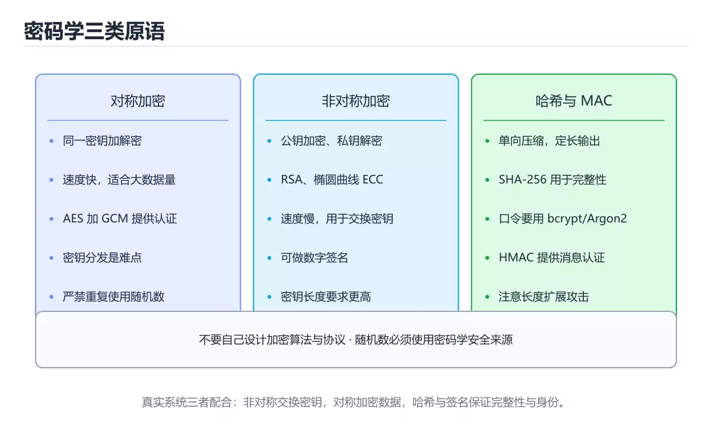
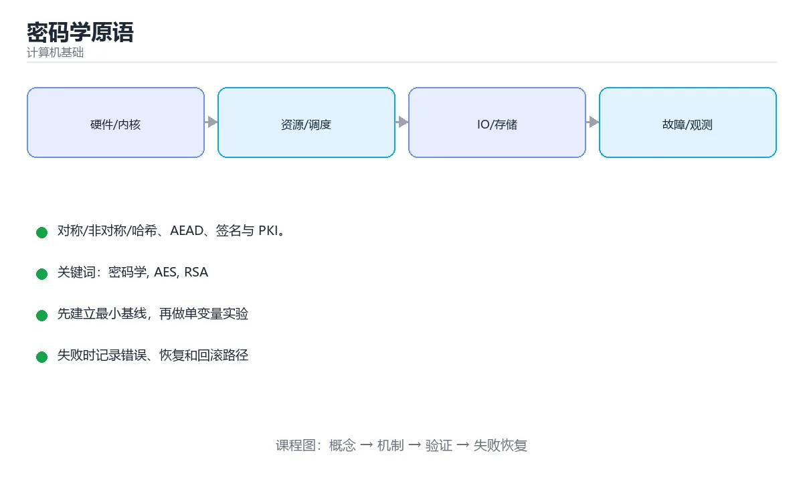

# 密码学原语





> 内容更新时间：2026-10-03 · 学习阶段：高级 · 预计用时：16 分钟

## 学习目标

- 能用自己的话解释「密码学原语」解决了什么问题，而不是只背术语。
- 能说清 「密码学」、「AES」、「RSA」、「SHA-256」 之间的关系，并分别举出一个例子。
- 能把本课知识放回「计算机基础」的知识体系，说明它和相邻主题的边界。
- 能完成本课练习，并用验收标准检查自己的结果。

> 一句话摘要：对称/非对称/哈希、AEAD、签名与 PKI。

## 前置知识

- 先完成上一课《性能度量与并行体系结构》；如果已经掌握，可以直接用本课练习自测。
- 本课阶段：高级。建议具备同一方向的完整基础，能阅读较长的代码、配置或系统设计说明。
- 开始前先复习：密码学、AES、RSA。
- 如果某一步看不懂，先记录具体卡点，完成练习后再回头读一遍。


## 三类基础原语

| 类型 | 代表算法 | 解决的问题 |
| --- | --- | --- |
| 对称加密 | AES、ChaCha20 | 机密性（同一密钥加解密） |
| 非对称加密 | RSA、ECC | 密钥分发与签名（公钥加密、私钥解密） |
| 哈希函数 | SHA-256、BLAKE3 | 完整性、指纹、口令存储 |

对称加密快但密钥分发难，非对称慢但解决分发问题，实际系统用**混合加密**：非对称协商出对称密钥，再用对称密钥传数据（HTTPS 就是这么做的）。

## 分组模式与 AEAD

ECB 相同明文块产生相同密文（不安全）；CBC 需要随机 IV 且易受填充 oracle 攻击；**GCM/ChaCha20-Poly1305** 属于 AEAD，同时提供加密与完整性校验，是当前推荐选择。随机数（nonce）绝不可重复使用。

## 哈希与口令

哈希的性质：单向、抗第二原语、抗碰撞。存储口令**不能用 SHA-256 直接哈希**（GPU 暴力破解极快），应使用专门的慢哈希：bcrypt、scrypt、Argon2，并为每个用户加随机盐。

## 消息认证与签名

MAC/HMAC 用共享密钥验证完整性与来源，用于对称场景；**数字签名**用私钥签名、公钥验签，提供不可否认性，用于证书、软件包与代码签名。

## 密钥交换与前向保密

DH/ECDHE 让双方在不安全信道上协商出共享密钥；使用**临时密钥**的 ECDHE 提供前向保密——即使服务器长期私钥泄露，也无法解密历史会话。

## PKI 与信任

证书把「身份」与「公钥」绑定，由 CA 签名；浏览器沿信任链逐级验证到根证书。证书吊销靠 CRL/OCSP，证书透明度（CT）用于发现伪造证书。

## 工程建议

1. 不要自己发明算法或协议，使用成熟库（libsodium、OpenSSL、语言标准库）。
2. 密钥存 KMS/HSM 或环境变量，绝不入库与入库到代码仓库。
3. 随机数必须用密码学安全随机源（/dev/urandom、SecureRandom）。
4. 支持密钥轮换与版本化，密文里带密钥版本号。
5. 加密只解决机密性，完整性要另行保证（优先用 AEAD）。

## 本课小结
密码学的核心是「用正确的原语解决正确的问题」：**对称管数据、非对称管分发与签名、哈希管完整性与口令、AEAD 管传输安全**。


## 算法选型速查

| 用途 | 推荐算法 | 说明 |
| --- | --- | --- |
| 对称加密 | AES-256-GCM、ChaCha20-Poly1305 | 带认证（AEAD），首选 |
| 非对称加密 | RSA-OAEP、ECDH、X25519 | 一般只用于协商密钥 |
| 数字签名 | Ed25519、ECDSA P-256、RSA-PSS | 优先 Ed25519 |
| 哈希 | SHA-256、SHA-3、BLAKE3 | 禁止 MD5 与 SHA-1 |
| 口令存储 | Argon2id、scrypt、bcrypt | 必须加盐且慢哈希 |
| 消息认证 | HMAC-SHA256 | 共享密钥场景 |
| 密钥派生 | HKDF、PBKDF2 | 从主密钥派生多把子密钥 |

| 必须避免 | 原因 |
| --- | --- |
| MD5 / SHA-1 | 碰撞已被实际构造 |
| ECB 模式 | 相同明文块产生相同密文块 |
| 固定 IV / nonce | 严重削弱甚至完全破坏保密性 |
| 自创加密算法 | 未经审计，几乎必然有漏洞 |
| 明文存储口令 | 一旦泄漏即全部失守 |
| 用时间比较密钥 | 存在时序侧信道，用恒定时间比较 |

```python
import hashlib
import hmac
import os
from base64 import b64encode

# 口令存储：加盐 + 慢哈希（示例用 PBKDF2，生产优先 Argon2id）
def hash_password(password: str, iterations: int = 600_000) -> str:
    salt = os.urandom(16)
    digest = hashlib.pbkdf2_hmac("sha256", password.encode(), salt, iterations)
    return f"pbkdf2_sha256${iterations}${salt.hex()}${digest.hex()}"


def verify_password(password: str, stored: str) -> bool:
    algorithm, iterations, salt_hex, digest_hex = stored.split("$")
    if algorithm != "pbkdf2_sha256":
        raise ValueError("不支持的算法")
    digest = hashlib.pbkdf2_hmac(
        "sha256", password.encode(), bytes.fromhex(salt_hex), int(iterations)
    )
    # 恒定时间比较，避免时序泄漏
    return hmac.compare_digest(digest.hex(), digest_hex)


def encrypt_with_aead(key: bytes, plaintext: bytes, aad: bytes = b""):
    """AES-GCM 示意：随机 nonce + 认证标签（生产用成熟库）。"""
    from cryptography.hazmat.primitives.ciphers.aead import AESGCM

    nonce = os.urandom(12)                   # 每次加密必须唯一
    ciphertext = AESGCM(key).encrypt(nonce, plaintext, aad)
    return b64encode(nonce + ciphertext).decode()


print(hash_password("s3cret")[:32] + "...")
```

## 密钥管理速查

| 要点 | 做法 |
| --- | --- |
| 生成 | 使用密码学安全随机源（`os.urandom`、`secrets`） |
| 存储 | 密钥管理服务（KMS）或硬件模块，不入库不入镜像 |
| 轮换 | 定期轮换并支持新旧密钥并存过渡 |
| 权限 | 最小权限，按服务隔离 |
| 传输 | 通过安全通道，禁止明文粘贴到聊天工具 |
| 备份 | 加密备份并限制访问 |
| 审计 | 记录密钥的读取与使用 |

## 常见错误对照表

| 容易写错的做法 | 实际现象 | 原因与正确做法 |
| --- | --- | --- |
| 用 MD5 做口令哈希 | 可被彩虹表与碰撞攻击 | 用 Argon2id + 随机盐 |
| 自创加密算法 | 安全性无保障 | 用标准算法与成熟库 |
| 复用 IV / nonce | 密文可被分析出明文关系 | 每次加密使用唯一随机 nonce |
| 用 ECB 模式 | 相同块产生相同密文 | 用 GCM 或 CBC + HMAC |
| 加密但无完整性校验 | 密文可被篡改 | 用 AEAD（GCM、Poly1305） |
| 用 `==` 比较 MAC | 时序攻击可逐字节猜测 | 用恒定时间比较 |
| 认为哈希是加密 | 无法还原也算「加密」 | 哈希不可逆，用途完全不同 |
| 用 Base64 当加密 | 数据可被任何人解码 | Base64 只是编码 |
| 密钥写进代码或配置库 | 泄漏风险 | 用密钥管理服务与环境注入 |
| 忽略前向保密 | 长期密钥泄漏后历史流量全暴露 | 用 ECDHE 协商会话密钥 |

## 自测清单

- [ ] 口令存储使用加盐慢哈希（Argon2id 优先）。
- [ ] 对称加密使用 AEAD 并保证 nonce 唯一。
- [ ] 完整性校验用恒定时间比较。
- [ ] 密钥来自密钥管理服务且定期轮换。
- [ ] 不使用 MD5 / SHA-1 / ECB / 自创算法。

## 动手练习


> 本课练习重点：围绕「密码学、AES、RSA」完成复述、实验和交付，每个结果都要能被别人检查。

先用表格或时序图描述机制，再手算一个最小例子，最后用程序验证。

### 练习 1：建立心智模型（10 分钟）

合上教程，用 3～5 句话回答：

1. 「密码学原语」解决了什么问题？
2. 如果没有它，会出现什么具体后果？
3. 它和「AES」是什么关系？

**验收标准**：至少出现一个本课关键词，并写出一个反例、边界条件或失效场景。

### 练习 2：做一次可控实验（20 分钟）

从正文中选一个最小示例，完成以下操作：

1. 先预测修改一个参数、输入或步骤后的结果。
2. 再实际执行或逐步推演，记录真实结果。
3. 如果结果与预测不同，写出差异原因。

**验收标准**：留下「原例 → 改动 → 预测 → 结果 → 原因」五步记录。

### 练习 3：交付一个小结果（30 分钟）

用表格、真值表或计算过程把抽象概念落到一个可核对的结果上。

任务要求：

- 结果必须能被别人检查，不能只写“我已经理解了”。
- 至少覆盖「密码学」和「AES」两个关键词。
- 写出 1 个仍然不确定的问题，以及下一步如何验证。

> 提示：时间有限时优先做练习 1 和练习 2；练习 3 可以拆成两次完成。


## 考点精讲：把测验题还原成判断过程

本课有 6 个判断点。先自己作答，再看「判断依据」；如果结论正确但理由不完整，回到正文对应章节补足概念。

### 考点 1：存储用户口令应使用？

- **正确判断**：bcrypt/Argon2 等慢哈希并加随机盐
- **判断依据**：正确答案是「bcrypt/Argon2 等慢哈希并加随机盐」，本课在「哈希与口令」中说明：存储口令不能用 SHA-256 直接哈希（GPU 暴力破解极快），应使用专门的慢哈希：bcrypt、scrypt、Argon2，并为每个用户加随机盐。慢哈希显著提高暴力破解成本，加盐防止彩虹表。本课还在「本课小结」中说明：密码学的核心是「用正确的原语解决正确的问题」：对称管数据、非对称管分发与签名、哈希管完整性与口令、AEAD 管传输安全。
- **迁移检查**：如果给某个错误选项去掉一个限定词，它会不会变成正确？说明理由。

### 考点 2：AEAD（如 AES-GCM）相比普通分组模式多了什么？

- **正确判断**：完整性校验
- **判断依据**：AEAD 同时保证机密性与完整性，是现代传输加密的首选。其他选项：AEAD 在加密之外提供完整性校验、能防篡改。针对「AEAD（如 AES-GCM）相比普通分组模式多…」，本课在「分组模式与 AEAD」中说明：GCM/ChaCha20-Poly1305 属于 AEAD，同时提供加密与完整性校验，是当前推荐选择。本课还在「分组模式与 AEAD」中说明：CBC 需要随机 IV 且易受填充 oracle 攻击。
- **迁移检查**：如果给某个错误选项去掉一个限定词，它会不会变成正确？说明理由。

### 考点 3：前向保密（Forward Secrecy）依靠什么实现？

- **正确判断**：每次会话使用临时密钥（ECDHE）
- **判断依据**：正确答案是「每次会话使用临时密钥（ECDHE）」，本课在「密钥交换与前向保密」中说明：使用临时密钥的 ECDHE 提供前向保密——即使服务器长期私钥泄露，也无法解密历史会话。临时密钥用完即弃，长期私钥泄露也无法解密历史会话。本课还在「三类基础原语」中说明：对称加密快但密钥分发难，非对称慢但解决分发问题，实际系统用混合加密：非对称协商出对称密钥，再用对称密钥传数据（HTTPS 就是这么做的）。本课还在「本课小结」中说明：密码学的核心是「用正确的原语解决正确的问题」：对称管数据、非对称管分发与签名、哈希管完整性与口令、AEAD 管传输安全。
- **迁移检查**：把题干里的一个条件换成边界值，原来的结论还成立吗？写出判断过程。

### 考点 4：对称加密与非对称加密的性能差异导致的实际做法是？

- **正确判断**：用非对称加密协商/交换密钥
- **判断依据**：正确答案是「用非对称加密协商/交换密钥」，本课在「三类基础原语」中说明：对称加密快但密钥分发难，非对称慢但解决分发问题，实际系统用混合加密：非对称协商出对称密钥，再用对称密钥传数据（HTTPS 就是这么做的）。这就是 TLS 握手（密钥交换）+ 记录层（AES-GCM）的分工。本课还在「工程建议」中说明：随机数必须用密码学安全随机源（/dev/urandom、SecureRandom）。本课还在「消息认证与签名」中说明：MAC/HMAC 用共享密钥验证完整性与来源，用于对称场景。
- **迁移检查**：遮住选项，只根据定义复述一次答案，再回来看哪个选项与复述一致。

### 考点 5：数字签名能保证的性质是？

- **正确判断**：数据完整性与来源可信（私钥持有者签发），但不提供机密性
- **判断依据**：正确答案是「数据完整性与来源可信（私钥持有者签发），但不提供机密性」，本课在「消息认证与签名」中说明：MAC/HMAC 用共享密钥验证完整性与来源，用于对称场景。需要保密要额外加密，防重放还需 nonce 或时间戳。本课还在「消息认证与签名」中说明：数字签名用私钥签名、公钥验签，提供不可否认性，用于证书、软件包与代码签名。本课还在「工程建议」中说明：加密只解决机密性，完整性要另行保证（优先用 AEAD）。
- **迁移检查**：遮住选项，只根据定义复述一次答案，再回来看哪个选项与复述一致。

### 考点 6：补全代码：「密码学原语」示例中，下面这行代码缺少哪个关键字或函数名？请填入 ____。 `from ____.hazmat.primitives.ciphers.aead import AESGCM`

- **正确判断**：cryptography
- **判断依据**：正确答案是「cryptography」，本课在「工程建议」中说明：随机数必须用密码学安全随机源（/dev/urandom、SecureRandom）。本课还在「工程建议」中说明：密钥存 KMS/HSM 或环境变量，绝不入库与入库到代码仓库。
- **迁移检查**：如果填成相近的另一个函数或关键字，程序会在哪一步出错？

## 本课复习清单

离开本课前，逐项确认：

- [ ] 不看解析，能说出「存储用户口令应使用？」的判断依据。
- [ ] 不看解析，能说出「AEAD（如 AES-GCM）相比普通分组模式多了什么？」的判断依据。
- [ ] 不看解析，能说出「前向保密（Forward Secrecy）依靠什么实现？」的判断依据。
- [ ] 不看解析，能说出「对称加密与非对称加密的性能差异导致的实际做法是？」的判断依据。
- [ ] 不看解析，能说出「数字签名能保证的性质是？」的判断依据。
- [ ] 不看解析，能说出「补全代码：「密码学原语」示例中，下面这行代码缺少哪个关键字或函数名？请填入 __…」的判断依据。
- [ ] 至少运行一次本课示例，记录输入、输出和一个边界情况。
- [ ] 把本课最容易混淆的两个概念写成一句话对照。

| 复盘项 | 记录 |
| --- | --- |
| 已经能独立解释的考点 |  |
| 仍然说不清的概念 |  |
| 下一步验证动作 |  |

## 术语速查

把本课反复出现的术语集中放在一起。复习时先遮住右列，尝试用自己的话解释，再回到正文核对。

| 术语 | 本课语境 |
| --- | --- |
| `os.urandom` | \| 生成 \| 使用密码学安全随机源（`os.urandom`、`secrets`） \| |
| `secrets` | \| 生成 \| 使用密码学安全随机源（`os.urandom`、`secrets`） \| |
| `==` | \| 用 `==` 比较 MAC \| 时序攻击可逐字节猜测 \| 用恒定时间比较 \| |
| `密码学` | 本课围绕该主题展开，结合正文与代码示例理解它的适用边界。 |
| `AES` | 本课围绕该主题展开，结合正文与代码示例理解它的适用边界。 |
| `RSA` | 本课围绕该主题展开，结合正文与代码示例理解它的适用边界。 |
| `SHA-256` | 本课围绕该主题展开，结合正文与代码示例理解它的适用边界。 |
| `AEAD` | 本课围绕该主题展开，结合正文与代码示例理解它的适用边界。 |

## 面试问答与自测

下面把本课考点换成面试追问。先口述自己的答案，
再对照参考回答检查是否遗漏了前提、边界或失败路径。

### 追问 1：存储用户口令应使用？

**参考回答**：正确答案是「bcrypt/Argon2 等慢哈希并加随机盐」，本课在「哈希与口令」中说明：存储口令不能用 SHA-256 直接哈希（GPU 暴力破解极快），应使用专门的慢哈希：bcrypt、scrypt、Argon2，并为每个用户加随机盐。慢哈希显著提高暴力破解成本，加盐防止彩虹表。本课还在「本课小结」中说明：密码学的核心是「用正确的原语解决正确的问题」：对称管数据、非对称管分发与签名、哈希管完整性与口令、AEAD 管传输安全。

### 追问 2：AEAD（如 AES-GCM）相比普通分组模式多了什么？

**参考回答**：AEAD 同时保证机密性与完整性，是现代传输加密的首选。其他选项：AEAD 在加密之外提供完整性校验、能防篡改。针对「AEAD（如 AES-GCM）相比普通分组模式多…」，本课在「分组模式与 AEAD」中说明：GCM/ChaCha20-Poly1305 属于 AEAD，同时提供加密与完整性校验，是当前推荐选择。本课还在「分组模式与 AEAD」中说明：CBC 需要随机 IV 且易受填充 oracle 攻击。

### 追问 3：前向保密（Forward Secrecy）依靠什么实现？

**参考回答**：正确答案是「每次会话使用临时密钥（ECDHE）」，本课在「密钥交换与前向保密」中说明：使用临时密钥的 ECDHE 提供前向保密——即使服务器长期私钥泄露，也无法解密历史会话。临时密钥用完即弃，长期私钥泄露也无法解密历史会话。本课还在「三类基础原语」中说明：对称加密快但密钥分发难，非对称慢但解决分发问题，实际系统用混合加密：非对称协商出对称密钥，再用对称密钥传数据（HTTPS 就是这么做的）。本课还在「本课小结」中说明：密码学的核心是「用正确的原语解决正确的问题」：对称管数据、非对称管分发与签名、哈希管完整性与口令、AEAD 管传输安全。

### 追问 4：对称加密与非对称加密的性能差异导致的实际做法是？

**参考回答**：正确答案是「用非对称加密协商/交换密钥」，本课在「三类基础原语」中说明：对称加密快但密钥分发难，非对称慢但解决分发问题，实际系统用混合加密：非对称协商出对称密钥，再用对称密钥传数据（HTTPS 就是这么做的）。这就是 TLS 握手（密钥交换）+ 记录层（AES-GCM）的分工。本课还在「工程建议」中说明：随机数必须用密码学安全随机源（/dev/urandom、SecureRandom）。本课还在「消息认证与签名」中说明：MAC/HMAC 用共享密钥验证完整性与来源，用于对称场景。

### 追问 5：数字签名能保证的性质是？

**参考回答**：正确答案是「数据完整性与来源可信（私钥持有者签发），但不提供机密性」，本课在「消息认证与签名」中说明：MAC/HMAC 用共享密钥验证完整性与来源，用于对称场景。需要保密要额外加密，防重放还需 nonce 或时间戳。本课还在「消息认证与签名」中说明：数字签名用私钥签名、公钥验签，提供不可否认性，用于证书、软件包与代码签名。本课还在「工程建议」中说明：加密只解决机密性，完整性要另行保证（优先用 AEAD）。

## English Overview

**Title:** Cryptography Primitives

**Summary:** Symmetric, asymmetric, hashing, AEAD, signatures and PKI.

**Category:** Fundamentals  
**Level:** 高级  
**Key terms:** 密码学, AES, RSA, SHA-256, AEAD, PKI

> The full tutorial is written in Chinese. This bilingual overview helps English readers identify the topic, scope and key terms before studying the detailed examples.

## 内容元数据

- 内容版本：v2.0
- 最后更新：2026-10-03
- 学习阶段：高级
- 适用环境：通用计算机体系结构知识
- 内容来源：内置结构化课程与工程实践整理
- 相关主题：密码学、AES、RSA、SHA-256、AEAD、PKI
- 质量版本：P0 测验标准 + P1 覆盖扩展 + P2 体验补全


## 参考资料与复核

- 最后复核：2026-10-04
- 下次复核：2027-04-04
- 复核范围：版本兼容、API 行为、安全建议与工程实践
- 来源性质：官方文档与标准；本课正文为离线教学重组，不复制原文

| 参考资料 | 本课用途 |
| --- | --- |
| [Linux Kernel Docs](https://docs.kernel.org/) | 操作系统与硬件接口 |
| [Arm Architecture](https://developer.arm.com/documentation) | 处理器与内存体系结构 |

> 本课主题：对称/非对称/哈希、AEAD、签名与 PKI。

> App 完全离线展示文字链接，不会自动联网；需要延伸阅读时可复制链接到浏览器。
