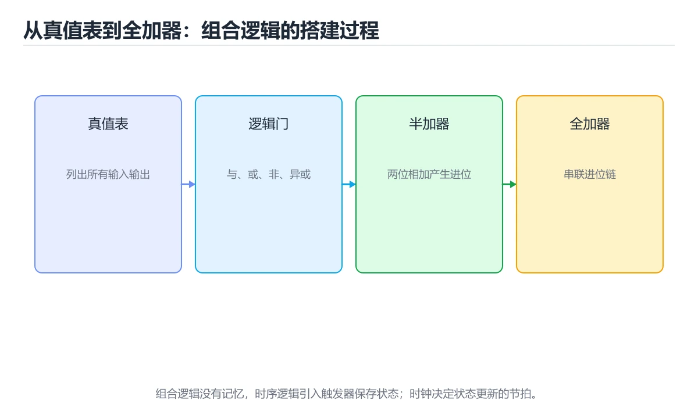
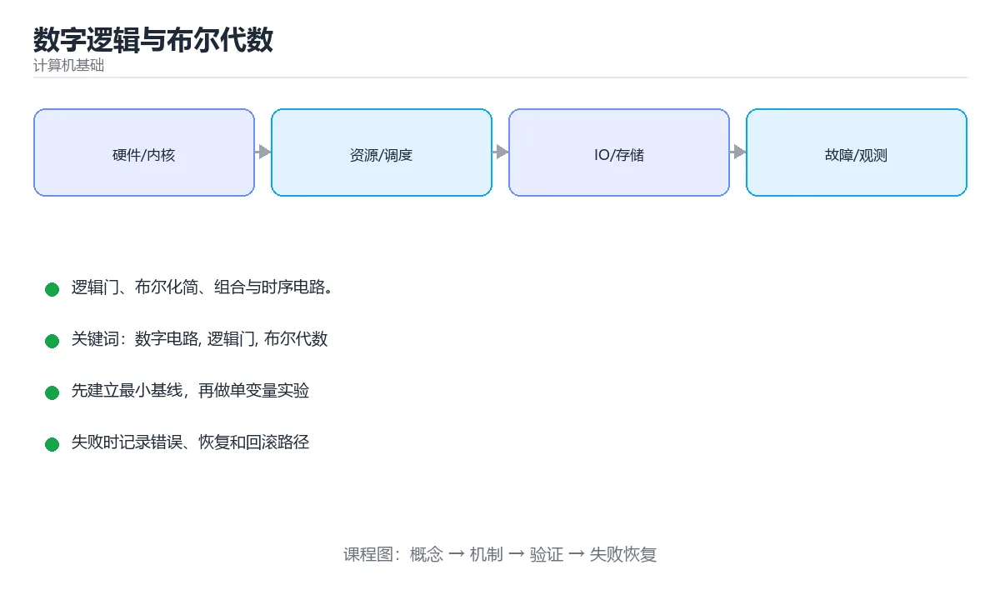

# 数字逻辑与布尔代数





> 内容更新时间：2026-10-06 · 学习阶段：基础 · 预计用时：30 分钟

## 学习目标

- 能用自己的话解释数字逻辑与布尔代数解决了什么问题，而不是只背术语。
- 能说清 「数字电路」、「逻辑门」、「布尔代数」、「触发器」 之间的关系，并分别举出一个例子。
- 能把本课知识放回「计算机基础」的知识体系，说明它和相邻主题的边界。
- 能完成本课练习，并用验收标准检查自己的结果。

> 一句话摘要：逻辑门、布尔化简、组合与时序电路。

## 前置知识

- 先完成上一课《编译与程序运行原理》；如果已经掌握，可以直接用本课练习自测。
- 本课阶段：基础。建议会读写简单代码或命令，并理解变量、输入输出等基本概念。
- 开始前先复习：数字电路、逻辑门、布尔代数。
- 如果某一步看不懂，先记录具体卡点，完成练习后再回头读一遍。

## 从晶体管到逻辑门

数字电路用高低电平表示 0/1，基本逻辑门实现布尔运算：

| 门 | 运算 | 真值表特征 |
| --- | --- | --- |
| AND | 与 | 全 1 才为 1 |
| OR | 或 | 有 1 就为 1 |
| NOT | 非 | 取反 |
| XOR | 异或 | 不同为 1 |
| NAND / NOR | 与非 / 或非 | 通用门，可组合出其他所有门 |

## 布尔代数常用定律

1. 交换律、结合律、分配律。
2. 德摩根定律：`¬(A ∧ B) = ¬A ∨ ¬B`，`¬(A ∨ B) = ¬A ∧ ¬B`。
3. 吸收律：`A ∨ (A ∧ B) = A`。
4. 幂等律与互补律：`A ∧ A = A`，`A ∧ ¬A = 0`。

化简的价值：减少门数量与层级，直接降低面积、功耗与延迟。

## 组合逻辑与时序逻辑

| 类型 | 特点 | 典型器件 |
| --- | --- | --- |
| 组合逻辑 | 输出只取决于当前输入 | 加法器、译码器、多路选择器 |
| 时序逻辑 | 输出还取决于历史状态 | 触发器、寄存器、计数器 |

关键器件：半加器/全加器（做二进制加法）、D 触发器（1 位存储）、寄存器（多位存储）、多路选择器（按选择信号选输入）。

## 从门到 CPU

组合逻辑实现运算，时序逻辑提供状态与时钟同步，二者组合出：

1. 算术逻辑单元 ALU（加减与、或、非、移位、比较）。
2. 寄存器堆与程序计数器。
3. 控制器（译码指令、产生控制信号）。
4. 存储层次（寄存器 → 缓存 → 主存）。

流水线就是在这套结构上加寄存器分段，让多条指令的不同阶段并行推进。

## 硬件描述语言

FPGA/ASIC 开发用 Verilog 或 VHDL 描述电路，思维方式与写软件不同：**描述的是并行硬件结构，而不是顺序执行流程**。综合工具把 HDL 映射成门级网表，再布局布线到芯片上。

下面是一个可综合的半加器模块：`sum` 使用异或实现本位和，`carry` 使用与门实现进位。它与前面真值表逐行对应，也说明 HDL 的 `assign` 描述的是持续生效的硬件连接，而不是按行执行一次的软件语句。

```verilog
module half_adder(
    input  wire a,
    input  wire b,
    output wire sum,
    output wire carry
);
    assign sum   = a ^ b;
    assign carry = a & b;
endmodule
```

把 `a`、`b` 分别取 0/1 代入可以验证：`00` 得到 `sum=0, carry=0`，`01` 和 `10` 得到 `sum=1, carry=0`，`11` 得到 `sum=0, carry=1`。如果要做多位加法，需要把多个全加器级联，并明确每一位的进位如何传递。

## 本课小结

数字逻辑是计算机的物理基础：**逻辑门 → 布尔运算 → 组合/时序电路 → ALU 与寄存器 → CPU**。理解了这条链路，再看指令执行与流水线就顺理成章。

## 逻辑门速查

| 门 | 表达式 | 输出为 1 的条件 |
| --- | --- | --- |
| 与（AND） | A·B | 全为 1 |
| 或（OR） | A+B | 有一个为 1 |
| 非（NOT） | Ā | 输入为 0 |
| 与非（NAND） | A·B 取反 | 不同时为 1（通用门） |
| 或非（NOR） | A+B 取反 | 全为 0 |
| 异或（XOR） | A⊕B | 两者不同 |
| 同或（XNOR） | A⊕B 取反 | 两者相同 |

## 常见错误与排查

| 容易写错的做法 | 实际现象 | 原因与正确做法 |
| --- | --- | --- |
| 把异或当成「或」 | 逻辑错误 | 异或：相同为 0、不同为 1 |
| 认为所有门都需要三个门实现 | 电路冗余 | NAND 与 NOR 是通用门，可单独实现全部逻辑 |
| 组合逻辑里引入反馈 | 振荡或竞态 | 反馈必须由时钟控制的时序元件管理 |
| 忽略竞争冒险 | 输出出现毛刺 | 加采样时钟或冗余项消除 |
| 忘记同步复位 | 上电初始状态不确定 | 复位电路把状态置为已知值 |
| 认为行波进位加法器最快 | 高位要等低位进位 | 高速场景用超前进位加法器 |
| 触发器与锁存器混用 | 时序难以分析 | 锁存器电平敏感，触发器边沿敏感 |
| 忽略时钟偏斜 | 建立时间不满足 | 做时序约束与时钟树平衡 |
| 用位运算模拟加法时忽略进位 | 结果错误 | 明确逐位传进位 |
| 认为仿真通过就一定正确 | 未覆盖时序与边界 | 结合时序分析与形式验证 |

## 复习与自测

- [ ] 能写出七种逻辑门的真值表。
- [ ] 知道 NAND / NOR 是通用门。
- [ ] 能区分组合逻辑与时序逻辑。
- [ ] 能手推半加器、全加器与行波进位加法器。
- [ ] 知道竞争冒险与时钟偏斜的含义。

## 补充：布尔化简、组合与时序逻辑

### 布尔代数常用定律

| 定律 | 表达式 | 用途 |
| --- | --- | --- |
| 交换律 | `A·B = B·A` | 调整顺序 |
| 结合律 | `(A·B)·C = A·(B·C)` | 分组化简 |
| 分配律 | `A·(B+C) = A·B + A·C` | 展开或合并 |
| 德摩根 | `¬(A·B) = ¬A + ¬B` | 把反号推到变量上 |
| 吸收律 | `A + A·B = A` | 消去冗余项 |
| 同一律 | `A + 0 = A`，`A·1 = A` | 去掉常量项 |
| 互补律 | `A + ¬A = 1`，`A·¬A = 0` | 消去互补项 |

```text
化简示例：F = A·B + A·¬B
  分配律：        F = A·(B + ¬B)
  互补律：        F = A·1
  同一律：        F = A
结论：B 的取值不影响结果，电路里可以整个去掉 B 相关连线
```

### 卡诺图：可视化的化简方法

```text
二变量卡诺图（行 A，列 B）
        B=0   B=1
  A=0 │  1  │  1  │
  A=1 │  0  │  1  │

圈相邻的 1（可跨边界，圈内的 1 数量必须是 2 的幂）
  左上两个 1 → ¬A
  右侧两个 1 → B
  F = ¬A + B

规则
  · 圈越大越好（消去更多变量）
  · 圈可以重叠，但每个 1 至少被圈一次
  · 边界处相邻（格雷码排列，任意相邻格只差一位）
```

### 组合逻辑：加法器与选择器

```text
半加器（不考虑进位输入）
  S = A ⊕ B        （和）
  C = A · B        （进位）

全加器（考虑进位输入 Cin）
  S   = A ⊕ B ⊕ Cin
  Cout= A·B + Cin·(A ⊕ B)

把 8 个全加器串起来就是 8 位行波进位加法器
  · 进位要逐级传递，位数越多越慢
  · 优化方案：先行进位（carry lookahead）并行算出进位
```

| 器件 | 功能 | 典型用途 |
| --- | --- | --- |
| 多路选择器 MUX | 按选择信号从多路输入中选一路 | 数据通路切换 |
| 译码器 | n 位输入选中 2ⁿ 条输出之一 | 地址译码 |
| 比较器 | 判断相等或大小 | 条件分支 |

### 时序逻辑：时钟与触发器

```text
D 触发器：在时钟上升沿把 D 的值锁存到 Q

建立时间（setup）   数据必须在时钟沿之前稳定这么久
保持时间（hold）    数据必须在时钟沿之后继续保持这么久

违反后果
  · 违反建立时间 → 数据来不及传播，锁存到旧值
  · 违反保持时间 → 新数据过早到达，冲掉当前值
  · 两者都会导致「亚稳态」：Q 在一段时间内不确定

最高时钟频率近似由最长组合路径（关键路径）决定
```

```text
时序电路的三件套
  · 寄存器：保存状态
  · 组合逻辑：计算下一状态
  · 时钟：决定何时更新

CPU 的流水线寄存器就是这三者的组合：每一级之间插入寄存器，
把长组合路径切短，从而允许更高的时钟频率
```

### 从逻辑门到 CPU 的抽象阶梯

| 层级 | 组件 | 关注点 |
| --- | --- | --- |
| 晶体管 | MOS 管 | 导通与截止 |
| 门电路 | 与/或/非 | 真值表 |
| 组合逻辑 | 加法器、MUX | 延迟与面积 |
| 时序逻辑 | 触发器、寄存器 | 时钟约束 |
| 微架构 | 流水线、缓存 | IPC 与频率 |

### 自查清单

- [ ] 能用德摩根定律把反号推到变量上
- [ ] 会用卡诺图化简三变量表达式
- [ ] 能写出全加器的和与进位表达式
- [ ] 能解释建立时间与保持时间违反的后果
- [ ] 知道寄存器 + 组合逻辑 + 时钟如何构成时序电路

## 动手练习

> 本课练习重点：围绕「数字电路、逻辑门、布尔代数」完成复述、实验和交付，每个结果都要能被别人检查。

先用表格或时序图描述机制，再手算一个最小例子，最后用程序验证。

### 练习 1：建立心智模型（10 分钟）

合上教程，用 3～5 句话回答：

1. 数字逻辑与布尔代数解决了什么问题？
2. 如果没有它，会出现什么具体后果？
3. 它和「逻辑门」是什么关系？

**验收标准**：至少出现一个本课关键词，并写出一个反例、边界条件或失效场景。

### 练习 2：做一次可控实验（20 分钟）

从正文中选一个最小示例，完成以下操作：

1. 先预测修改一个参数、输入或步骤后的结果。
2. 再实际执行或逐步推演，记录真实结果。
3. 如果结果与预测不同，写出差异原因。

**验收标准**：留下「原例 → 改动 → 预测 → 结果 → 原因」五步记录。

### 练习 3：交付一个小结果（30 分钟）

用表格、真值表或计算过程把抽象概念落到一个可核对的结果上。

任务要求：

- 结果必须能被别人检查，不能只写“我已经理解了”。
- 至少覆盖「数字电路」和「逻辑门」两个关键词。
- 写出 1 个仍然不确定的问题，以及下一步如何验证。

> 提示：时间有限时优先做练习 1 和练习 2；练习 3 可以拆成两次完成。

## 可运行练习

本节围绕数字逻辑与布尔代数安排 3 个可交付任务，每个任务都要求留下可以复查的记录。

### 任务 1：用自己的话画出结构

不看书，用一张图说清「数字逻辑与布尔代数」的结构，画完再对照骨架：

- 主干：从晶体管到逻辑门 → 布尔代数常用定律 → 组合逻辑与时序逻辑 → 从门到 CPU
- 连接线：在每条边上标出输入、输出与失败路径。
- 自检：能否用一句话说明数字电路与逻辑门的关系？

### 任务 2：做一次对比实验

**验收标准**：表格里两个方案的结论不能完全一样；写下“在什么条件下应该换方案”。

### 任务 3：迁移到自己的场景

**验收标准**：至少有一个可复现的命令、代码片段或数据样例；结论能被别人独立检查。

## 故障现场

### 现场 1：本课的 数字电路 常规用例通过，但边界用例失败

**症状**：在本课的练习或生产场景里出现“本课的 数字电路 常规用例通过，但边界用例失败”。

**复现**：准备一组最小输入，只保留触发“本课的 数字电路 常规用例通过，但边界用例失败”的必要条件，连续运行两次确认结果稳定。

**定位**：围绕“数字电路 的前置条件与取值边界没有写进代码，默认值掩盖了空值和极值”检查调用链、输入数据和环境配置，先验证假设再改代码。

**预防**：把“本课的 数字电路 常规用例通过，但边界用例失败”写成一条自动化用例，并在本课的验收清单里保留对应检查项。

### 现场 2：本课的 逻辑门 结果在两次运行之间不一致

**症状**：在本课的练习或生产场景里出现“本课的 逻辑门 结果在两次运行之间不一致”。

**复现**：准备一组最小输入，只保留触发“本课的 逻辑门 结果在两次运行之间不一致”的必要条件，连续运行两次确认结果稳定。

**定位**：围绕“逻辑门 依赖了当前版本、执行顺序或共享状态，单次运行无法暴露差异”检查调用链、输入数据和环境配置，先验证假设再改代码。

**预防**：把“本课的 逻辑门 结果在两次运行之间不一致”写成一条自动化用例，并在本课的验收清单里保留对应检查项。

### 现场 3：本课的验证只在开发机通过

**症状**：在本课的练习或生产场景里出现“本课的验证只在开发机通过”。

**定位**：围绕“环境版本、配置和输入规模与目标环境不同，数字电路 缺少可重复的验证记录”检查调用链、输入数据和环境配置，先验证假设再改代码。

## 本课复习清单

离开本课前，逐项确认：

- [ ] 不看解析，能说出「被称为通用门、可组合出其他所有门的是？」的判断依据。
- [ ] 不看解析，能说出「组合逻辑与时序逻辑的关键区别是？」的判断依据。
- [ ] 不看解析，能说出「D 触发器的主要作用是？」的判断依据。
- [ ] 不看解析，能说出「全加器相比半加器多了什么？」的判断依据。
- [ ] 不看解析，能说出「卡诺图（K-map）的用途是？」的判断依据。
- [ ] 至少运行一次本课示例，记录输入、输出和一个边界情况。
- [ ] 把本课最容易混淆的两个概念写成一句话对照。

| 复盘项 | 记录 |
| --- | --- |
| 已经能独立解释的考点 |  |
| 仍然说不清的概念 |  |
| 下一步验证动作 |  |

## 术语速查

把「数字逻辑与布尔代数」里反复出现的术语集中放在一起。复习时先遮住右列，尝试用自己的话解释，再回到正文核对。

| 术语 | 一句话说明 |
| --- | --- |
| `数字电路` | 围绕“环境版本、配置和输入规模与目标环境不同，数字电路 缺少可重复的验证记录”检查调用链、输入数据和环境配置，先验证假设再改代码。 |
| `逻辑门` | 围绕“逻辑门 依赖了当前版本、执行顺序或共享状态，单次运行无法暴露差异”检查调用链、输入数据和环境配置，先验证假设再改代码。 |
| `布尔代数` | “数字逻辑与布尔代数”中的 数字电路、逻辑门、布尔代数，下列哪两项是本课强调的实践判断。 |
| `触发器` | 关键器件：半加器/全加器（做二进制加法）、D 触发器（1 位存储）、寄存器（多位存储）、多路选择器（按选择信号选输入）。 |
| `ALU` | 数字逻辑是计算机的物理基础：逻辑门 → 布尔运算 → 组合/时序电路 → ALU 与寄存器 → CPU。 |

## 考点精讲

### 考点 1：概念判断·数字电路

- **题目**：被称为通用门、可组合出其他所有门的是？
- **判断依据**：NAND/NOR 是功能完备的，可以搭出全部逻辑。在「数字逻辑与布尔代数」里，其他选项：NAND 与 NOR 是通用门，可组合出所有其他逻辑门。在「数字逻辑与布尔代数」里判断这道题，要把数字电路、逻辑门、布尔代数的条件、过程与失败路径逐项对齐，换成“被称为通用门、可组合出其他所有门的是”这个场景，只有满足前提的结论才成立。

### 考点 2：代码补全·数字电路

- **题目**：阅读「数字逻辑与布尔代数」正文里的这段代码，下面哪一项判断是正确的？
- **判断依据**：在「数字逻辑与布尔代数」里，题干的正确项是这段代码只做静态声明，没有循环、分支或可观察输出，在「数字逻辑与布尔代数」里它只能证明数字电路相关约束存在，不能替代真实运行证据。把输入或边界换成空值、极值或失败情况后，结论要以「数字逻辑与布尔代数」的实际运行结果为准。「数字逻辑与布尔代数」要求先交代数字电路、逻辑门、布尔代数的前提再下结论，所以“这段代码只做静态声明，没有循环”只在题干“阅读数字逻辑与布尔代数正文里的这段代码”给定的条件下成立。

### 考点 3：概念判断·数字电路

- **题目**：D 触发器的主要作用是？
- **判断依据**：D 触发器是构成寄存器与计数器的基础存储单元。作答时，先用数字电路建立输入与输出的基线，再把存储 1 位状态代入边界条件核对，结论才能复现。如果只凭关键词作答，很容易把「算术运算」、「放大信号」与「存储 1 位状态」混在一起；把“存储 1 位状态”代回「数字逻辑与布尔代数」里“D 触发器的主要作用是”的例子核对，条件一旦改变，结论就要用数字电路、逻辑门、布尔代数重新推导。

### 考点 4：概念判断·数字电路

- **题目**：全加器相比半加器多了什么？
- **判断依据**：作答时，先用数字电路建立输入与输出的基线，再把进位输入 Cin代入边界条件核对，结论才能复现。这道题要求区分概念与边界，「进位输入 Cin」只有在题干给出的前提下才成立，而「一个与非门」、「三态输出」缺少同一组条件。把“进位输入 Cin”代回「数字逻辑与布尔代数」里“全加器相比半加器多了什么”的例子核对，条件一旦改变，结论就要用数字电路、逻辑门、布尔代数重新推导。

### 考点 5：多选辨析·数字电路

- **题目**：围绕“数字逻辑与布尔代数”中的 数字电路、逻辑门、布尔代数，下列哪两项是本课强调的实践判断？
- **判断依据**：本课把数字逻辑与布尔代数拆成概念、示例与故障现场三部分，因此判断 数字电路 时必须同时交代输入、输出和失败路径，这使“学习 数字电路 时要同时说明输入、输出和失败路径，不能只看正常流程”成立。在数字逻辑与布尔代数里，判断 逻辑门 时要固定版本与边界输入，所以“验证 逻辑门 时要固定版本并覆盖边界输入，结论才可复现”才可复现。

### 考点 6：填空·____ sum = a ^ b;

- **题目**：补全代码：「数字逻辑与布尔代数」示例中，下面这行代码缺少哪个关键字或函数名？请填入 ____。 `____ sum = a ^ b;`
- **判断依据**：在「数字逻辑与布尔代数」里，assign。这道题的关键在「数字逻辑与布尔代数」的数字电路、逻辑门、布尔代数：先确认题干“补全代码”问的是哪一步，再排除偷换前提的选项。回到数字电路、逻辑门、布尔代数本身再看一遍：只有“assign”与题干“assign”的前提一致，结论才成立。

## English Overview

**Title:** Digital Logic

**Summary:** Gates, boolean algebra, combinational and sequential logic.

**Category:** Fundamentals
**Level:** 基础
**Key terms:** 数字电路, 逻辑门, 布尔代数, 触发器, ALU

## 内容元数据

- 内容版本：v2.0
- 最后更新：2026-10-06
- 学习阶段：基础
- 适用环境：通用计算机体系结构知识
- 内容来源：内置结构化课程与工程实践整理
- 相关主题：数字电路、逻辑门、布尔代数、触发器、ALU
- 质量版本：P0 测验标准 + P1 覆盖扩展 + P2 体验补全

## 参考资料与复核

- 最后复核：2026-10-04
- 下次复核：2027-04-04
- 复核范围：版本兼容、API 行为、安全建议与工程实践
- 来源性质：官方文档、标准或权威教材；正文为离线教学重组

| 参考资料 | 本课用途 |
| --- | --- |
| [MIT 6.004 计算结构](https://ocw.mit.edu/courses/6-004-computation-structures-spring-2017/) | 数字逻辑、ISA 与计算机组织 |
| [Nand2Tetris](https://www.nand2tetris.org/) | 从逻辑门到计算机系统 |
| [MIT 6.006 算法导论](https://ocw.mit.edu/courses/6-006-introduction-to-algorithms-spring-2020/) | 算法与数据结构基础 |

> 「数字逻辑与布尔代数」的链接用于离线阅读后的延伸核对；App 不会自动联网。

## 复习与迁移

复习目标：把「数字逻辑与布尔代数」的判断标准放回可复现的例子里。先自己作答，再对照依据；如果结论正确但理由不完整，回到正文补足前提。

### 概念复述

- 用一句话说明「数字逻辑与布尔代数」解决什么问题：逻辑门、布尔化简、组合与时序电路。
- 写出数字电路、逻辑门、布尔代数之间的关系，并各举一个例子。
- 说出本课最容易混淆的两个概念，以及区分它们的判据。

### 正文逐节复核

- **从晶体管到逻辑门**：数字电路用高低电平表示 0/1，基本逻辑门实现布尔运算：。
- **组合逻辑与时序逻辑**：关键器件：半加器/全加器（做二进制加法）、D 触发器（1 位存储）、寄存器（多位存储）、多路选择器（按选择信号选输入）。
- **实践任务**：本节围绕数字逻辑与布尔代数安排 3 个可交付任务，每个任务都要求留下可以复查的记录。

### 测验回顾

1. 被称为通用门、可组合出其他所有门的是？
   - 依据：NAND/NOR 是功能完备的，可以搭出全部逻辑。在「数字逻辑与布尔代数」里，其他选项：NAND 与 NOR 是通用门，可组合出所有其他逻辑门。在「数字逻辑与布尔代数」里判断这道题，要把数字电路、逻辑门、布尔代数的条件、过程与失败路径逐项对齐，换成“被称为通用门、可组合出其他所有门的是”这个场景，只有满足前提的结论才成立。
2. 阅读「数字逻辑与布尔代数」正文里的这段代码，下面哪一项判断是正确的？
   - 依据：在「数字逻辑与布尔代数」里，题干的正确项是这段代码只做静态声明，没有循环、分支或可观察输出，在「数字逻辑与布尔代数」里它只能证明数字电路相关约束存在，不能替代真实运行证据。把输入或边界换成空值、极值或失败情况后，结论要以「数字逻辑与布尔代数」的实际运行结果为准。「数字逻辑与布尔代数」要求先交代数字电路、逻辑门、布尔代数的前提再下结论，所以“这段代码只做静态声明，没有循环”只在题干“阅读数字逻辑与布尔代数正文里的这段代码”给定的条件下成立。
3. D 触发器的主要作用是？
   - 依据：D 触发器是构成寄存器与计数器的基础存储单元。作答时，先用数字电路建立输入与输出的基线，再把存储 1 位状态代入边界条件核对，结论才能复现。如果只凭关键词作答，很容易把「算术运算」、「放大信号」与「存储 1 位状态」混在一起；把“存储 1 位状态”代回「数字逻辑与布尔代数」里“D 触发器的主要作用是”的例子核对，条件一旦改变，结论就要用数字电路、逻辑门、布尔代数重新推导。
4. 全加器相比半加器多了什么？
   - 依据：作答时，先用数字电路建立输入与输出的基线，再把进位输入 Cin代入边界条件核对，结论才能复现。这道题要求区分概念与边界，「进位输入 Cin」只有在题干给出的前提下才成立，而「一个与非门」、「三态输出」缺少同一组条件。把“进位输入 Cin”代回「数字逻辑与布尔代数」里“全加器相比半加器多了什么”的例子核对，条件一旦改变，结论就要用数字电路、逻辑门、布尔代数重新推导。
5. 围绕“数字逻辑与布尔代数”中的 数字电路、逻辑门、布尔代数，下列哪两项是本课强调的实践判断？
   - 依据：本课把数字逻辑与布尔代数拆成概念、示例与故障现场三部分，因此判断 数字电路 时必须同时交代输入、输出和失败路径，这使“学习 数字电路 时要同时说明输入、输出和失败路径，不能只看正常流程”成立。在数字逻辑与布尔代数里，判断 逻辑门 时要固定版本与边界输入，所以“验证 逻辑门 时要固定版本并覆盖边界输入，结论才可复现”才可复现。
6. 补全代码：「数字逻辑与布尔代数」示例中，下面这行代码缺少哪个关键字或函数名？请填入 ____。

`____ sum = a ^ b;`
   - 依据：在「数字逻辑与布尔代数」里，assign。这道题的关键在「数字逻辑与布尔代数」的数字电路、逻辑门、布尔代数：先确认题干“补全代码”问的是哪一步，再排除偷换前提的选项。回到数字电路、逻辑门、布尔代数本身再看一遍：只有“assign”与题干“assign”的前提一致，结论才成立。

### 迁移练习

把「数字逻辑与布尔代数」的结论迁移到相邻主题，每次迁移都写清预测与证据：

1. 换输入：用数字电路处理一组你自己的数据，对比教材示例的结果差异。
2. 换失败条件：制造一个逻辑门相关的错误，说明如何从错误信息定位根因。
3. 换规模：把数据量或并发度提高一个数量级，说明「数字逻辑与布尔代数」的结论是否仍成立。
