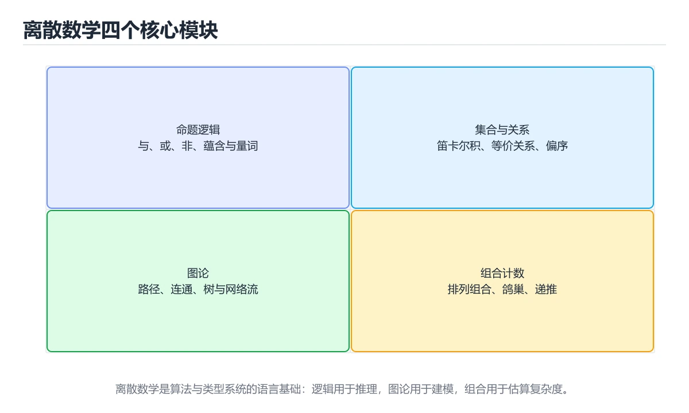
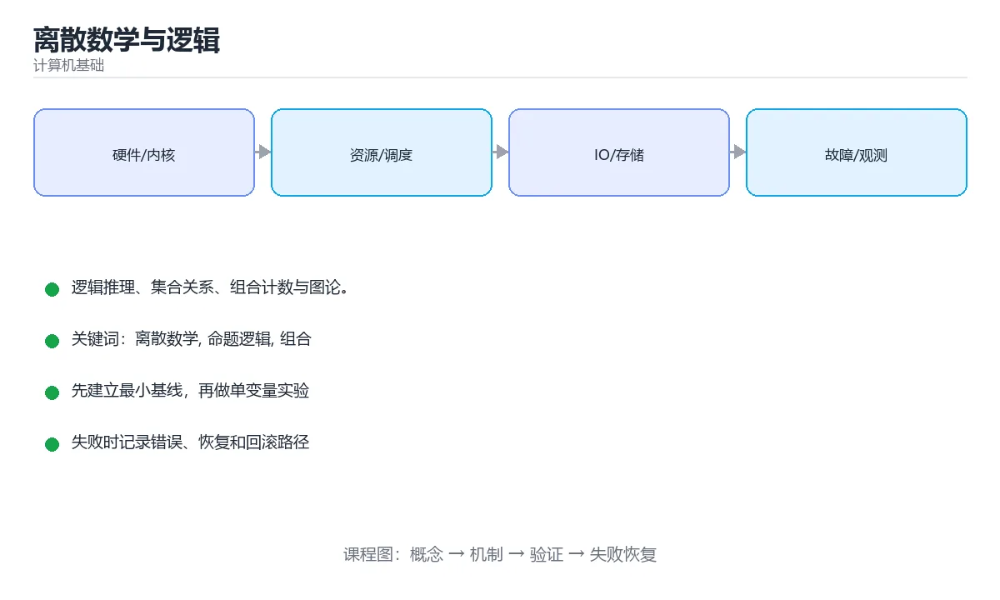

# 离散数学与逻辑





> 内容更新时间：2026-10-03 · 学习阶段：高级 · 预计用时：16 分钟

## 学习目标

- 能用自己的话解释「离散数学与逻辑」解决了什么问题，而不是只背术语。
- 能说清 「离散数学」、「命题逻辑」、「组合」、「图论」 之间的关系，并分别举出一个例子。
- 能把本课知识放回「计算机基础」的知识体系，说明它和相邻主题的边界。
- 能完成本课练习，并用验收标准检查自己的结果。

> 一句话摘要：逻辑推理、集合关系、组合计数与图论。

## 前置知识

- 先完成上一课《指令集与汇编入门》；如果已经掌握，可以直接用本课练习自测。
- 本课阶段：高级。建议具备同一方向的完整基础，能阅读较长的代码、配置或系统设计说明。
- 开始前先复习：离散数学、命题逻辑、组合。
- 如果某一步看不懂，先记录具体卡点，完成练习后再回头读一遍。


## 为什么计算机专业先学离散数学

计算机处理的是**离散对象**：整数、集合、图、逻辑命题、有限状态。离散数学提供描述这些对象的语言，是算法、数据库、编译原理与密码学的共同基础。

## 四个核心模块

| 模块 | 关键内容 | 在计算机中的用途 |
| --- | --- | --- |
| 数理逻辑 | 命题逻辑、谓词逻辑、推理规则 | 程序正确性、SAT 求解、类型系统 |
| 集合与关系 | 集合运算、笛卡尔积、等价关系与偏序 | 数据库关系模型、类型与等价类 |
| 组合计数 | 排列组合、容斥原理、鸽巢原理 | 复杂度分析、概率算法、测试用例设计 |
| 图论 | 路径、连通性、树、匹配、着色 | 网络、调度、编译器、社交网络 |

## 命题逻辑与推理

基本联结词：与、或、非、蕴含、等价。重点掌握蕴含（p→q）与逆否命题（¬q→¬p）等价，这是证明与反证法的核心。

常见证明方法：直接证明、反证法、数学归纳法、构造性证明。程序正确性证明与循环不变式都建立在这些方法上。

## 组合计数的实用结论

1. 鸽巢原理：n+1 个物品放进 n 个盒子，必有一盒至少两个——用于哈希冲突与去重证明。
2. 容斥原理：处理"至少满足一个条件"的计数，是概率计算与筛法的基础。
3. 递推关系：斐波那契、卡特兰数等，直接对应动态规划的状态转移。

## 关系与闭包

等价关系（自反、对称、传递）对应划分与并查集的集合合并；偏序关系对应拓扑排序与依赖管理；传递闭包用于可达性分析（如依赖图、调用图）。

## 与后续课程的连接

离散数学 → 数据结构（图与树）→ 算法（复杂度与证明）→ 编译原理（自动机与文法）→ 数据库（关系代数）→ 密码学（数论）。学的时候刻意建立这种连接，后面会省很多力气。

## 本课小结
离散数学是计算机的"语法书"：**逻辑负责推理，集合与关系负责建模，组合负责计数，图论负责结构**。


## 逻辑等价速查

| 表达式 | 等价形式 | 名称 |
| --- | --- | --- |
| `p → q` | `¬p ∨ q` | 蕴含等价 |
| `p → q` | `¬q → ¬p` | 逆否 |
| `¬(p ∧ q)` | `¬p ∨ ¬q` | 德摩根律 |
| `¬(p ∨ q)` | `¬p ∧ ¬q` | 德摩根律 |
| `p ↔ q` | `(p → q) ∧ (q → p)` | 双条件 |
| `p ⊕ q` | `(p ∨ q) ∧ ¬(p ∧ q)` | 异或 |
| `p ∧ (q ∨ r)` | `(p ∧ q) ∨ (p ∧ r)` | 分配律 |

## 常用证明与计数方法

| 方法 | 适用 | 要点 |
| --- | --- | --- |
| 直接证明 | 一般命题 | 从前提推导结论 |
| 逆否证明 | `p → q` 难直接证 | 改证 `¬q → ¬p` |
| 反证法 | 否定结论导出矛盾 | 假设结论为假 |
| 数学归纳法 | 与自然数相关的命题 | 基础情形 + 归纳步 |
| 强归纳法 | 依赖多个较小情形 | 假设所有小于 n 成立 |
| 鸽巢原理 | 存在性证明 | n+1 个物品放入 n 个盒子 |
| 容斥原理 | 计数并集 | 加单集、减交集、加三交集 |
| 双计数 | 组合恒等式 | 用两种方式数同一集合 |

```python
from itertools import combinations

def pigeonhole_check(items, boxes):
    """鸽巢原理：物品数超过盒子数时必有盒子至少装两个。"""
    return len(items) > boxes


def inclusion_exclusion(sets):
    """容斥原理：计算多个集合的并集大小。"""
    total = 0
    n = len(sets)
    for k in range(1, n + 1):
        sign = 1 if k % 2 == 1 else -1
        for combo in combinations(range(n), k):
            intersection = set.intersection(*(sets[i] for i in combo))
            total += sign * len(intersection)
    return total


def binomial(n: int, k: int) -> int:
    """组合数 C(n,k)，用递推避免阶乘溢出。"""
    if k < 0 or k > n:
        return 0
    k = min(k, n - k)
    result = 1
    for i in range(k):
        result = result * (n - i) // (i + 1)
    return result


assert inclusion_exclusion([{1, 2, 3}, {3, 4}, {4, 5}]) == 5
assert binomial(5, 2) == 10
```

## 常见错误对照表

| 容易写错的做法 | 实际现象 | 原因与正确做法 |
| --- | --- | --- |
| 把 `p → q` 的逆命题当等价 | 逻辑错误 | 只有逆否命题等价：`¬q → ¬p` |
| 混淆「必要」与「充分」 | 推理方向反了 | 充分条件是 `p → q` 中的 p |
| 归纳法只证归纳步 | 证明不完整 | 必须先证基础情形 |
| 归纳步假设不足 | 结论不成立 | 强归纳需假设所有更小情形 |
| 容斥漏掉交集项 | 计数偏大 | 交替加减并检查符号 |
| 组合数用阶乘直算 | 大数溢出或极慢 | 用递推或取模运算 |
| 把「存在」与「任意」写反 | 命题错误 | 明确量词顺序，顺序不同含义不同 |
| 忽略空集情形 | 边界错误 | 空集是任何集合的子集 |
| 认为图论只有无向图结论 | 结论误用 | 有向图的连通性与无向图不同 |
| 用鸽巢原理证明「唯一」 | 结论错 | 它只能证明「至少存在一个」 |

## 自测清单

- [ ] 记得 `p → q` 等价于 `¬p ∨ q` 与 `¬q → ¬p`。
- [ ] 能说清充分条件与必要条件的方向。
- [ ] 会用数学归纳法（含基础情形）。
- [ ] 会用容斥原理计算并集大小。
- [ ] 知道鸽巢原理只能证明存在性。


## 补充：命题逻辑、集合关系与图论基础

### 命题逻辑：真值表与常见等价式

| A | B | ¬A | A∧B | A∨B | A→B |
| --- | --- | --- | --- | --- | --- |
| T | T | F | T | T | T |
| T | F | F | F | T | F |
| F | T | T | F | T | T |
| F | F | T | F | F | T |

```text
关键反直觉点：A→B（蕴含）只有在「A 真且 B 假」时为假
  「如果下雨，我就带伞」——没下雨时，这句话不算说谎

常用等价式
  · A→B ≡ ¬A∨B          （蕴含化析取）
  · ¬(A∧B) ≡ ¬A∨¬B      （德摩根）
  · ¬(A∨B) ≡ ¬A∧¬B      （德摩根）
  · A↔B ≡ (A→B)∧(B→A)   （双条件）
```

### 量词与否定

```text
∀x P(x)：对所有 x，P 成立
∃x P(x)：存在某个 x，使 P 成立

否定规则（量词翻转）
  ¬∀x P(x) ≡ ∃x ¬P(x)
  ¬∃x P(x) ≡ ∀x ¬P(x)

例：「所有学生都通过了」的否定是「存在一个学生没通过」，
    而不是「所有学生都没通过」——这是最常见的口误。
```

### 集合与关系

| 运算 | 记号 | 含义 |
| --- | --- | --- |
| 并 | A∪B | 属于 A 或 B |
| 交 | A∩B | 同时属于 A 和 B |
| 差 | A−B | 属于 A 且不属于 B |
| 补 | ¬A | 全集里不属于 A 的部分 |
| 笛卡尔积 | A×B | 所有有序对 (a,b) |

```text
关系的三个重要性质
  自反：每个元素与自己有关系（如「等于」）
  对称：aRb 则 bRa（如「同班」）
  传递：aRb 且 bRc 则 aRc（如「小于」）

等价关系 = 自反 + 对称 + 传递 → 可以把集合划分成若干等价类
「模 3 同余」就是等价关系，划分出余 0、1、2 三类
```

### 图论：五个必须先掌握的概念

| 概念 | 含义 | 工程对应 |
| --- | --- | --- |
| 度 | 与某顶点相连的边数 | 社交网络的影响力 |
| 路径 | 顶点与边的序列 | 路由、依赖链 |
| 连通 | 任意两点间存在路径 | 网络分区检测 |
| 树 | 连通且无环 | 目录结构、DOM、语法树 |
| 二分图 | 顶点可分成两组，边只跨组 | 任务分配、推荐匹配 |

```text
两条常用结论
  · 树有 n 个顶点就有 n-1 条边；再加一条边必成环
  · 有向无环图（DAG）一定存在拓扑排序，可用于任务调度与构建顺序
```

### 计数原理

```text
加法原理：分类完成 → 各类相加
  从北京到上海可坐飞机（5 班）或高铁（8 班）→ 5 + 8 = 13 种

乘法原理：分步完成 → 各步相乘
  上衣 3 件、裤子 4 条 → 3 × 4 = 12 种搭配

排列：有序选取 P(n,k) = n! / (n-k)!
组合：无序选取 C(n,k) = n! / (k!(n-k)!)

含重复元素的排列：n! / (n1! · n2! · …)
  例「AAB」的排列数 = 3! / 2! = 3（AAB、ABA、BAA）
```

```text
容斥原理（避免重复计数）
  |A∪B| = |A| + |B| - |A∩B|
  例：会 Python 的 30 人、会 Java 的 25 人、两个都会的 10 人
      → 至少会一门的人数 = 30 + 25 - 10 = 45
```

### 概率中的离散基础

| 概念 | 公式 | 说明 |
| --- | --- | --- |
| 期望 | E[X] = Σ x·P(x) | 加权平均，线性可加 |
| 方差 | Var(X) = E[X²] − (E[X])² | 波动程度 |
| 条件概率 | P(A\|B) = P(A∩B)/P(B) | 已知 B 发生时的概率 |
| 贝叶斯 | P(A\|B) = P(B\|A)P(A)/P(B) | 由结果反推原因 |

```text
期望的线性性质非常有用：
  E[X + Y] = E[X] + E[Y]  （不要求 X、Y 独立）
  例：n 个球随机放入 n 个盒子，空盒期望 = n·(1-1/n)ⁿ ≈ n/e
```

### 自查清单

- [ ] 能写出蕴含与双条件的等价式
- [ ] 会正确否定带量词的命题
- [ ] 能判断一个关系是否为等价关系
- [ ] 记得树的边数与 DAG 的拓扑排序
- [ ] 会用容斥原理与期望线性性解题

## 动手练习


> 本课练习重点：围绕「离散数学、命题逻辑、组合」完成复述、实验和交付，每个结果都要能被别人检查。

先用表格或时序图描述机制，再手算一个最小例子，最后用程序验证。

### 练习 1：建立心智模型（10 分钟）

合上教程，用 3～5 句话回答：

1. 「离散数学与逻辑」解决了什么问题？
2. 如果没有它，会出现什么具体后果？
3. 它和「命题逻辑」是什么关系？

**验收标准**：至少出现一个本课关键词，并写出一个反例、边界条件或失效场景。

### 练习 2：做一次可控实验（20 分钟）

从正文中选一个最小示例，完成以下操作：

1. 先预测修改一个参数、输入或步骤后的结果。
2. 再实际执行或逐步推演，记录真实结果。
3. 如果结果与预测不同，写出差异原因。

**验收标准**：留下「原例 → 改动 → 预测 → 结果 → 原因」五步记录。

### 练习 3：交付一个小结果（30 分钟）

用表格、真值表或计算过程把抽象概念落到一个可核对的结果上。

任务要求：

- 结果必须能被别人检查，不能只写“我已经理解了”。
- 至少覆盖「离散数学」和「命题逻辑」两个关键词。
- 写出 1 个仍然不确定的问题，以及下一步如何验证。

> 提示：时间有限时优先做练习 1 和练习 2；练习 3 可以拆成两次完成。


## 可运行练习

下面 3 个任务围绕“离散数学与逻辑”展开，代码可以直接粘贴到 App 的离线沙箱里运行；如果示例会读取标准输入，请按代码注释在沙箱的 stdin 区域填入同样格式的数据。

### 任务 1：先跑通，再解释

```python
from itertools import combinations

def pigeonhole_check(items, boxes):
    """鸽巢原理：物品数超过盒子数时必有盒子至少装两个。"""
    return len(items) > boxes


def inclusion_exclusion(sets):
    """容斥原理：计算多个集合的并集大小。"""
    total = 0
    n = len(sets)
    for k in range(1, n + 1):
        sign = 1 if k % 2 == 1 else -1
        for combo in combinations(range(n), k):
            intersection = set.intersection(*(sets[i] for i in combo))
            total += sign * len(intersection)
    return total


def binomial(n: int, k: int) -> int:
    """组合数 C(n,k)，用递推避免阶乘溢出。"""
    if k < 0 or k > n:
        return 0
    k = min(k, n - k)
    result = 1
    for i in range(k):
        result = result * (n - i) // (i + 1)
    return result


assert inclusion_exclusion([{1, 2, 3}, {3, 4}, {4, 5}]) == 5
assert binomial(5, 2) == 10
```

**预期输出**：运行后会输出与“离散数学与逻辑”相关的关键结果；请重点核对输出行数、最后一个数值和异常提示。

**验收标准**：代码能正常运行；逐行解释每个变量的值如何变化，并指出哪一行决定了最终结果。

### 任务 2：只改一个条件

复制上面的代码，只修改一个输入、边界或参数（例如空值、最大值、循环次数、过滤条件），先写出你的预测，再实际运行。

**验收标准**：留下“原结果 → 改动 → 预测 → 实际结果 → 差异原因”五步记录；如果预测错误，要写出修正后的心智模型。

### 任务 3：迁移到自己的数据

用同一套思路处理一组你自己的数据或场景，保持输出格式与任务 1 一致。

**验收标准**：代码不少于 10 行，至少包含 1 个边界检查；把代码和运行结果保存到笔记或片段库。


## 故障现场

这一节把“离散数学与逻辑”最常见的失败方式还原成现场记录，练习时按“症状 → 复现 → 定位 → 修复 → 预防”的顺序排查。

### 现场 1：“离散数学与逻辑”的 离散数学 常规用例通过，但边界用例失败

**症状**：在“离散数学与逻辑”的练习或生产场景里出现““离散数学与逻辑”的 离散数学 常规用例通过，但边界用例失败”。

**复现**：准备一组最小输入，只保留触发““离散数学与逻辑”的 离散数学 常规用例通过，但边界用例失败”的必要条件，连续运行两次确认结果稳定。

**定位**：围绕“离散数学 的前置条件与取值边界没有写进代码，默认值掩盖了空值和极值”检查调用链、输入数据和环境配置，先验证假设再改代码。

**修复**：为“离散数学与逻辑”补一条空值或极值用例，把前置条件写成断言，并让失败信息直接指出是哪个输入越界

**预防**：把““离散数学与逻辑”的 离散数学 常规用例通过，但边界用例失败”写成一条自动化用例，并在“离散数学与逻辑”的验收清单里保留对应检查项。


### 现场 2：“离散数学与逻辑”的 命题逻辑 结果在两次运行之间不一致

**症状**：在“离散数学与逻辑”的练习或生产场景里出现““离散数学与逻辑”的 命题逻辑 结果在两次运行之间不一致”。

**复现**：准备一组最小输入，只保留触发““离散数学与逻辑”的 命题逻辑 结果在两次运行之间不一致”的必要条件，连续运行两次确认结果稳定。

**定位**：围绕“命题逻辑 依赖了当前版本、执行顺序或共享状态，单次运行无法暴露差异”检查调用链、输入数据和环境配置，先验证假设再改代码。

**修复**：固定“离散数学与逻辑”使用的版本与随机种子，记录两次运行的完整输入和输出，再逐项消除非确定性来源

**预防**：把““离散数学与逻辑”的 命题逻辑 结果在两次运行之间不一致”写成一条自动化用例，并在“离散数学与逻辑”的验收清单里保留对应检查项。


### 现场 3：“离散数学与逻辑”的验证只在开发机通过

**症状**：在“离散数学与逻辑”的练习或生产场景里出现““离散数学与逻辑”的验证只在开发机通过”。

**复现**：准备一组最小输入，只保留触发““离散数学与逻辑”的验证只在开发机通过”的必要条件，连续运行两次确认结果稳定。

**定位**：围绕“环境版本、配置和输入规模与目标环境不同，离散数学 缺少可重复的验证记录”检查调用链、输入数据和环境配置，先验证假设再改代码。

**修复**：把“离散数学与逻辑”的运行环境、输入样本和预期输出写成清单，并在另一套环境复跑同一条命令

**预防**：把““离散数学与逻辑”的验证只在开发机通过”写成一条自动化用例，并在“离散数学与逻辑”的验收清单里保留对应检查项。


## 考点精讲：把测验题还原成判断过程

本课有 6 个判断点。先自己作答，再看「判断依据」；如果结论正确但理由不完整，回到正文对应章节补足概念。

### 考点 1：命题 p→q 等价于下面哪个？

- **正确判断**：¬q→¬p
- **判断依据**：逆否命题与原命题等价，这是反证法的理论基础。其他选项：p→q 等价于 ¬q→¬p（逆否）与 ¬p∨q。针对「命题 p→q 等价于下面哪个，」，本课在「本课小结」中说明：离散数学是计算机的"语法书"：逻辑负责推理，集合与关系负责建模，组合负责计数，图论负责结构。本课还在「为什么计算机专业先学离散数学」中说明：离散数学提供描述这些对象的语言，是算法、数据库、编译原理与密码学的共同基础。本课还在「与后续课程的连接」中说明：离散数学 → 数据结构（图与树）→ 算法（复杂度与证明）→ 编译原理（自动机与文法）→ 数据库（关系代数）→ 密码学（数论）。
- **迁移检查**：遮住选项，只根据定义复述一次答案，再回来看哪个选项与复述一致。

### 考点 2：鸽巢原理在计算机中的典型应用是？

- **正确判断**：证明必然存在重复或冲突
- **判断依据**：正确答案是「证明必然存在重复或冲突」，本课在「与后续课程的连接」中说明：离散数学 → 数据结构（图与树）→ 算法（复杂度与证明）→ 编译原理（自动机与文法）→ 数据库（关系代数）→ 密码学（数论）。n+1 个元素放入 n 个位置必然有重复，用于哈希冲突等证明。本课还在「本课小结」中说明：离散数学是计算机的"语法书"：逻辑负责推理，集合与关系负责建模，组合负责计数，图论负责结构。本课还在「组合计数的实用结论」中说明：鸽巢原理：n+1 个物品放进 n 个盒子，必有一盒至少两个——用于哈希冲突与去重证明。
- **迁移检查**：把题干里的一个条件换成边界值，原来的结论还成立吗？写出判断过程。

### 考点 3：等价关系（自反、对称、传递）对应哪种结构？

- **正确判断**：集合划分与并查集
- **判断依据**：正确答案是「集合划分与并查集」，本课在「关系与闭包」中说明：等价关系（自反、对称、传递）对应划分与并查集的集合合并。等价关系把集合划分为互不相交的等价类。本课还在「为什么计算机专业先学离散数学」中说明：离散数学提供描述这些对象的语言，是算法、数据库、编译原理与密码学的共同基础。本课还在「为什么计算机专业先学离散数学」中说明：计算机处理的是离散对象：整数、集合、图、逻辑命题、有限状态。
- **迁移检查**：把题干里的一个条件换成边界值，原来的结论还成立吗？写出判断过程。

### 考点 4：欧拉路与哈密顿路的区别是？

- **正确判断**：欧拉路经过每条边恰好一次
- **判断依据**：正确答案是「欧拉路经过每条边恰好一次」，本课在「为什么计算机专业先学离散数学」中说明：计算机处理的是离散对象：整数、集合、图、逻辑命题、有限状态。欧拉路有多项式判定（奇度顶点个数），哈密顿路是 NP 完全问题。本课还在「命题逻辑与推理」中说明：重点掌握蕴含（p→q）与逆否命题（¬q→¬p）等价，这是证明与反证法的核心。本课还在「命题逻辑与推理」中说明：常见证明方法：直接证明、反证法、数学归纳法、构造性证明。
- **迁移检查**：遮住选项，只根据定义复述一次答案，再回来看哪个选项与复述一致。

### 考点 5：递推式 T(n) = 2T(n/2) + n 的解是？

- **正确判断**：O(n log n)
- **判断依据**：这是归并排序的复杂度，由主定理 case 2 得到。其他选项：T(n)=2T(n/2)+n 是归并排序的递推式，由主定理得 O(n log n)。针对「递推式 T(n) = 2T(n/2) + n 的…」，本课在「命题逻辑与推理」中说明：程序正确性证明与循环不变式都建立在这些方法上。本课还在「组合计数的实用结论」中说明：递推关系：斐波那契、卡特兰数等，直接对应动态规划的状态转移。
- **迁移检查**：把题干里的一个条件换成边界值，原来的结论还成立吗？写出判断过程。

### 考点 6：以下哪些术语与「离散数学与逻辑」直接相关？（多选）

- **正确判断**：离散数学、命题逻辑
- **判断依据**：正确答案是「离散数学、命题逻辑」，本课在「命题逻辑与推理」中说明：常见证明方法：直接证明、反证法、数学归纳法、构造性证明。课程摘要指出逻辑推理，集合关系，组合计数与图论，本课要判断的正是以下哪些术语与离散数学与逻辑直接相关，（多选）。这道题考查 以下哪些术语与离散数学与逻辑直接相关，（多选） 与离散数学、命题逻辑、组合、图论这些概念之间的边界，判断时要把题干限定的条件逐项代入。
- **迁移检查**：每个正确项各自成立的条件是什么？有没有互相依赖。

### 补充自测（2 题）

1. 按“离散数学与逻辑”中 离散数学、命题逻辑、组合 的实践顺序，把四个步骤排成从准备到复盘的合理顺序。
2. 下面这段 Python 代码复现了“离散数学与逻辑”中 离散数学、命题逻辑、组合 相关的一个常见故障，哪一项最准确地解释了问题？

这些题按“先定位概念、再排除边界错误、最后核对答案”的顺序作答；每题解析都给出了判断依据。


## 本课复习清单

离开本课前，逐项确认：

- [ ] 不看解析，能说出「命题 p→q 等价于下面哪个？」的判断依据。
- [ ] 不看解析，能说出「鸽巢原理在计算机中的典型应用是？」的判断依据。
- [ ] 不看解析，能说出「等价关系（自反、对称、传递）对应哪种结构？」的判断依据。
- [ ] 不看解析，能说出「欧拉路与哈密顿路的区别是？」的判断依据。
- [ ] 不看解析，能说出「递推式 T(n) = 2T(n/2) + n 的解是？」的判断依据。
- [ ] 不看解析，能说出「以下哪些术语与「离散数学与逻辑」直接相关？（多选）」的判断依据。
- [ ] 至少运行一次本课示例，记录输入、输出和一个边界情况。
- [ ] 把本课最容易混淆的两个概念写成一句话对照。

| 复盘项 | 记录 |
| --- | --- |
| 已经能独立解释的考点 |  |
| 仍然说不清的概念 |  |
| 下一步验证动作 |  |

## 术语速查

把本课反复出现的术语集中放在一起。复习时先遮住右列，尝试用自己的话解释，再回到正文核对。

| 术语 | 本课语境 |
| --- | --- |
| `p → q` | \| `p → q` \| `¬p ∨ q` \| 蕴含等价 \| |
| `¬p ∨ q` | \| `p → q` \| `¬p ∨ q` \| 蕴含等价 \| |
| `¬q → ¬p` | \| `p → q` \| `¬q → ¬p` \| 逆否 \| |
| `¬(p ∧ q)` | \| `¬(p ∧ q)` \| `¬p ∨ ¬q` \| 德摩根律 \| |
| `¬p ∨ ¬q` | \| `¬(p ∧ q)` \| `¬p ∨ ¬q` \| 德摩根律 \| |
| `¬(p ∨ q)` | \| `¬(p ∨ q)` \| `¬p ∧ ¬q` \| 德摩根律 \| |
| `¬p ∧ ¬q` | \| `¬(p ∨ q)` \| `¬p ∧ ¬q` \| 德摩根律 \| |
| `p ↔ q` | \| `p ↔ q` \| `(p → q) ∧ (q → p)` \| 双条件 \| |
| `(p → q) ∧ (q → p)` | \| `p ↔ q` \| `(p → q) ∧ (q → p)` \| 双条件 \| |
| `p ⊕ q` | \| `p ⊕ q` \| `(p ∨ q) ∧ ¬(p ∧ q)` \| 异或 \| |
| `(p ∨ q) ∧ ¬(p ∧ q)` | \| `p ⊕ q` \| `(p ∨ q) ∧ ¬(p ∧ q)` \| 异或 \| |
| `p ∧ (q ∨ r)` | \| `p ∧ (q ∨ r)` \| `(p ∧ q) ∨ (p ∧ r)` \| 分配律 \| |

## 面试问答与自测

下面把本课考点换成面试追问。先口述自己的答案，
再对照参考回答检查是否遗漏了前提、边界或失败路径。

### 追问 1：命题 p→q 等价于下面哪个？

**参考回答**：逆否命题与原命题等价，这是反证法的理论基础。其他选项：p→q 等价于 ¬q→¬p（逆否）与 ¬p∨q。针对「命题 p→q 等价于下面哪个，」，本课在「本课小结」中说明：离散数学是计算机的"语法书"：逻辑负责推理，集合与关系负责建模，组合负责计数，图论负责结构。本课还在「为什么计算机专业先学离散数学」中说明：离散数学提供描述这些对象的语言，是算法、数据库、编译原理与密码学的共同基础。本课还在「与后续课程的连接」中说明：离散数学 → 数据结构（图与树）→ 算法（复杂度与证明）→ 编译原理（自动机与文法）→ 数据库（关系代数）→ 密码学（数论）。

### 追问 2：鸽巢原理在计算机中的典型应用是？

**参考回答**：正确答案是「证明必然存在重复或冲突」，本课在「与后续课程的连接」中说明：离散数学 → 数据结构（图与树）→ 算法（复杂度与证明）→ 编译原理（自动机与文法）→ 数据库（关系代数）→ 密码学（数论）。n+1 个元素放入 n 个位置必然有重复，用于哈希冲突等证明。本课还在「本课小结」中说明：离散数学是计算机的"语法书"：逻辑负责推理，集合与关系负责建模，组合负责计数，图论负责结构。本课还在「组合计数的实用结论」中说明：鸽巢原理：n+1 个物品放进 n 个盒子，必有一盒至少两个——用于哈希冲突与去重证明。

### 追问 3：等价关系（自反、对称、传递）对应哪种结构？

**参考回答**：正确答案是「集合划分与并查集」，本课在「关系与闭包」中说明：等价关系（自反、对称、传递）对应划分与并查集的集合合并。等价关系把集合划分为互不相交的等价类。本课还在「为什么计算机专业先学离散数学」中说明：离散数学提供描述这些对象的语言，是算法、数据库、编译原理与密码学的共同基础。本课还在「为什么计算机专业先学离散数学」中说明：计算机处理的是离散对象：整数、集合、图、逻辑命题、有限状态。

### 追问 4：欧拉路与哈密顿路的区别是？

**参考回答**：正确答案是「欧拉路经过每条边恰好一次」，本课在「为什么计算机专业先学离散数学」中说明：计算机处理的是离散对象：整数、集合、图、逻辑命题、有限状态。欧拉路有多项式判定（奇度顶点个数），哈密顿路是 NP 完全问题。本课还在「命题逻辑与推理」中说明：重点掌握蕴含（p→q）与逆否命题（¬q→¬p）等价，这是证明与反证法的核心。本课还在「命题逻辑与推理」中说明：常见证明方法：直接证明、反证法、数学归纳法、构造性证明。

### 追问 5：递推式 T(n) = 2T(n/2) + n 的解是？

**参考回答**：这是归并排序的复杂度，由主定理 case 2 得到。其他选项：T(n)=2T(n/2)+n 是归并排序的递推式，由主定理得 O(n log n)。针对「递推式 T(n) = 2T(n/2) + n 的…」，本课在「命题逻辑与推理」中说明：程序正确性证明与循环不变式都建立在这些方法上。本课还在「组合计数的实用结论」中说明：递推关系：斐波那契、卡特兰数等，直接对应动态规划的状态转移。

## English Overview

**Title:** Discrete Mathematics

**Summary:** Logic, sets, counting and graph theory.

**Category:** Fundamentals  
**Level:** 高级  
**Key terms:** 离散数学, 命题逻辑, 组合, 图论, 证明

> The full tutorial is written in Chinese. This bilingual overview helps English readers identify the topic, scope and key terms before studying the detailed examples.

## 内容元数据

- 内容版本：v2.0
- 最后更新：2026-10-03
- 学习阶段：高级
- 适用环境：通用计算机体系结构知识
- 内容来源：内置结构化课程与工程实践整理
- 相关主题：离散数学、命题逻辑、组合、图论、证明
- 质量版本：P0 测验标准 + P1 覆盖扩展 + P2 体验补全


## 参考资料与复核

- 最后复核：2026-10-04
- 下次复核：2027-04-04
- 复核范围：版本兼容、API 行为、安全建议与工程实践
- 来源性质：官方文档与标准；本课正文为离线教学重组，不复制原文

| 参考资料 | 本课用途 |
| --- | --- |
| [Linux Kernel Docs](https://docs.kernel.org/) | 操作系统与硬件接口 |
| [Arm Architecture](https://developer.arm.com/documentation) | 处理器与内存体系结构 |

> 本课主题：逻辑推理、集合关系、组合计数与图论。

> App 完全离线展示文字链接，不会自动联网；需要延伸阅读时可复制链接到浏览器。
