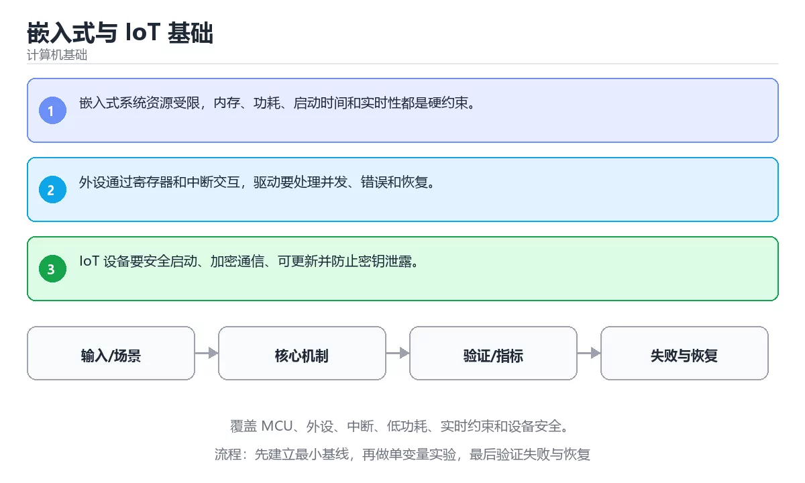

# 嵌入式与 IoT 基础



> 内容更新时间：2026-10-03 · 学习阶段：高级 · 预计用时：25 分钟

## 学习目标

- 能用自己的话解释：嵌入式系统资源受限，内存、功耗、启动时间和实时性都是硬约束。
- 能用自己的话解释：外设通过寄存器和中断交互，驱动要处理并发、错误和恢复。
- 能用自己的话解释：IoT 设备要安全启动、加密通信、可更新并防止密钥泄露。
- 能把本课知识放回「计算机基础」，并完成练习与测验。

## 前置知识

- 已完成「计算机基础」的基础课程，能运行正文中的最小示例。
- 本课关键词：嵌入式、MCU、低功耗、IoT。
- 遇到不熟悉的术语先记录问题，完成练习后再回读。

## 核心知识

### 1. 嵌入式系统资源受限，内存、功耗、启动时间和实时性都是硬约束。

- 它解决的问题：把「嵌入式系统资源受限，内存、功耗、启动时间和实时性都是硬约束。」放回真实场景，说明不做它会带来什么后果。
- 关键做法：先用最小示例建立基线，再逐步加入边界、失败和性能条件。
- 验证标准：结果可复现、错误可解释、边界有测试、失败能恢复。

### 2. 外设通过寄存器和中断交互，驱动要处理并发、错误和恢复。

- 它解决的问题：把「外设通过寄存器和中断交互，驱动要处理并发、错误和恢复。」放回真实场景，说明不做它会带来什么后果。
- 关键做法：先用最小示例建立基线，再逐步加入边界、失败和性能条件。
- 验证标准：结果可复现、错误可解释、边界有测试、失败能恢复。

### 3. IoT 设备要安全启动、加密通信、可更新并防止密钥泄露。

- 它解决的问题：把「IoT 设备要安全启动、加密通信、可更新并防止密钥泄露。」放回真实场景，说明不做它会带来什么后果。
- 关键做法：先用最小示例建立基线，再逐步加入边界、失败和性能条件。
- 验证标准：结果可复现、错误可解释、边界有测试、失败能恢复。

## 关键流程

```text
输入 → 校验 → 核心处理 → 验证 → 记录指标 → 失败恢复
```

## 实践路径

1. 用一句话复述本课要解决的问题。
2. 跑通正文中的最小示例并记录基线。
3. 只改变一个输入或参数，预测并验证结果。
4. 补一个失败路径，记录错误、恢复和指标。
5. 把结论写成可复现的笔记或测试。

## 常见误区

| 误区 | 后果 | 修正 |
| --- | --- | --- |
| 只记术语不做实验 | 遇到真实问题无法判断 | 用最小输入跑通并记录结果 |
| 只测正常路径 | 边界和故障上线才暴露 | 补空值、极值和依赖失败 |
| 没有基线就优化 | 无法证明改进有效 | 先测量再修改 |
| 忽略成本与安全 | 性能和风险失控 | 同时记录资源、权限与失败代价 |

## 动手练习

1. 合上教程，用 3～5 句话解释「嵌入式与 IoT 基础」。
2. 从正文选一个例子，改变一个条件并预测结果。
3. 设计一个失败场景，写出止损与恢复步骤。

**验收标准**：留下输入、命令、输出、差异和下一步问题。

## 本课小结

- 本课属于「计算机基础」，核心关键词是 嵌入式、MCU、低功耗、IoT。
- 先保证正确与可复现，再讨论性能和扩展。
- 完成练习和测验后，把仍然不确定的问题写成下一轮验证清单。

> 本课由 P1 内容扩展生成，重点补充原有课程缺失的主题与工程边界。


## 考点精讲：把测验题还原成判断过程

本课有 5 个判断点。先自己作答，再看「判断依据」；如果结论正确但理由不完整，回到正文对应章节补足概念。

### 考点 1：关于「嵌入式系统资源受限 内存、功耗、启动…」，下列说法正确的是？

- **正确判断**：嵌入式系统资源受限，内存、功耗、启动时间和实时性都是硬约束。
- **判断依据**：正确答案是「嵌入式系统资源受限，内存、功耗、启动时间和实时性都是硬约束。」，本课在「本课小结」中说明：本课属于「计算机基础」，核心关键词是 嵌入式、MCU、低功耗、IoT。，本课在「核心知识」中说明：它解决的问题：把嵌入式系统资源受限，内存、功耗、启动时间和实时性都是硬约束。，本课在「核心知识」中说明：它解决的问题：把外设通过寄存器和中断交互，驱动要处理并发、错误和恢复。
- **迁移检查**：遮住选项，只根据定义复述一次答案，再回来看哪个选项与复述一致。

### 考点 2：关于「外设通过寄存器和中断交互 驱动要处理…」，下列说法正确的是？

- **正确判断**：外设通过寄存器和中断交互，驱动要处理并发、错误和恢复。
- **判断依据**：正确答案是「外设通过寄存器和中断交互，驱动要处理并发、错误和恢复。」，本课在「本课小结」中说明：本课属于「计算机基础」，核心关键词是 嵌入式、MCU、低功耗、IoT。，本课在「核心知识」中说明：它解决的问题：把外设通过寄存器和中断交互，驱动要处理并发、错误和恢复。，本课在「核心知识」中说明：它解决的问题：把嵌入式系统资源受限，内存、功耗、启动时间和实时性都是硬约束。
- **迁移检查**：把题干里的一个条件换成边界值，原来的结论还成立吗？写出判断过程。

### 考点 3：关于「IoT 设备要安全启动、加密通信、可…」，下列说法正确的是？

- **正确判断**：IoT 设备要安全启动、加密通信、可更新并防止密钥泄露。
- **判断依据**：正确答案是「IoT 设备要安全启动、加密通信、可更新并防止密钥泄露。」，本课在「核心知识」中说明：它解决的问题：把外设通过寄存器和中断交互，驱动要处理并发、错误和恢复。，本课在核心知识中说明：它解决的问题：把嵌入式系统资源受限，内存、功耗、启动时间和实时性都是硬约束。，本课在核心知识中说明：它解决的问题：把IoT 设备要安全启动、加密通信、可更新并防止密钥泄露。
- **迁移检查**：遮住选项，只根据定义复述一次答案，再回来看哪个选项与复述一致。

### 考点 4：「嵌入式与 IoT 基础」的核心学习目标是什么？

- **正确判断**：覆盖 MCU、外设、中断、低功耗、实时约束和设备安全。
- **判断依据**：正确答案是「覆盖 MCU、外设、中断、低功耗、实时约束和设备安全。」，本课在「核心知识」中说明：它解决的问题：把嵌入式系统资源受限，内存、功耗、启动时间和实时性都是硬约束。，本课在核心知识中说明：它解决的问题：把IoT 设备要安全启动、加密通信、可更新并防止密钥泄露。本课还在核心知识中说明：它解决的问题：把外设通过寄存器和中断交互，驱动要处理并发、错误和恢复。
- **迁移检查**：把题干里的一个条件换成边界值，原来的结论还成立吗？写出判断过程。

### 考点 5：以下哪些术语与「嵌入式与 IoT 基础」直接相关？（多选）

- **正确判断**：嵌入式、MCU
- **判断依据**：正确答案是「嵌入式、MCU」，本课在「核心知识」中说明：它解决的问题：把嵌入式系统资源受限，内存、功耗、启动时间和实时性都是硬约束。本课还在「核心知识」中说明：它解决的问题：把IoT 设备要安全启动、加密通信、可更新并防止密钥泄露。课程摘要指出覆盖 MCU，外设，中断，低功耗，实时约束和设备安全，本课要判断的正是以下哪些术语与嵌入式与IoT基础直接相关，（多选）。
- **迁移检查**：只选其中一项时会漏掉哪个必要条件？把它补进自己的答案。

### 补充考点 1：阅读「嵌入式与 IoT 基础」的代码片段，下面哪项判断是正确的？

- **正确判断**：嵌入式系统资源受限，内存、功耗、启动时间和实时性都是硬约束。
- **判断依据**：正确答案是「嵌入式系统资源受限，内存、功耗、启动时间和实时性都是硬约束。」。这段代码来自「嵌入式与 IoT 基础」的示例，判断时先看输入与输出，再检查条件、循环和边界。正确答案是「嵌入式系统资源受限，内存、功耗、启动时间和实时性都是硬约束。」，本课在「核心知识」中说明：它解决的问题：把嵌入式系统资源受限，内存、功耗、启动时间和实时性都是硬约束。，本课在「深度追问与自…在「嵌入式与 IoT 基础」中，如果只改一个条件，输出通常会随之改变，因此不能脱离代码前提作答。

## 本课复习清单

离开本课前，逐项确认：

- [ ] 不看解析，能说出「关于「嵌入式系统资源受限 内存、功耗、启动…」，下列说法正确的是？」的判断依据。
- [ ] 不看解析，能说出「关于「外设通过寄存器和中断交互 驱动要处理…」，下列说法正确的是？」的判断依据。
- [ ] 不看解析，能说出「关于「IoT 设备要安全启动、加密通信、可…」，下列说法正确的是？」的判断依据。
- [ ] 不看解析，能说出「「嵌入式与 IoT 基础」的核心学习目标是什么？」的判断依据。
- [ ] 不看解析，能说出「以下哪些术语与「嵌入式与 IoT 基础」直接相关？（多选）」的判断依据。
- [ ] 至少运行一次本课示例，记录输入、输出和一个边界情况。
- [ ] 把本课最容易混淆的两个概念写成一句话对照。

| 复盘项 | 记录 |
| --- | --- |
| 已经能独立解释的考点 |  |
| 仍然说不清的概念 |  |
| 下一步验证动作 |  |

## 逐节复习与自检

下面按正文顺序回顾每一节，并给出一个自检问题；说不清的地方回到原章节补课。

### 核心知识

」放回真实场景，说明不做它会带来什么后果。关键做法：先用最小示例建立基线，再逐步加入边界、失败和性能条件。

自检：这一节与相邻主题的边界在哪里？

### 动手练习

合上教程，用 3～5 句话解释「嵌入式与 IoT 基础」。从正文选一个例子，改变一个条件并预测结果。

自检：如果去掉这一节里的一个前提，结论会怎样变化？

### 最小可运行示例

```python
state = "idle"
for tick in range(1, 4):
    state = "sample" if tick % 2 else "send"
    print(f"tick {tick}: {state}")
```

自检：把这一节讲给没学过的人，最需要强调哪一点？

### 预期输出

```text
tick 1: sample
tick 2: send
tick 3: sample
```

自检：这一节与相邻主题的边界在哪里？

### 验证步骤

制造一次错误输入，记录错误信息与修复方式。

自检：如果去掉这一节里的一个前提，结论会怎样变化？

## 易错点回顾

下面把本课最容易判断错的地方集中成一张清单，复习时先自己回答，再对照解析补全理由。

- **关于「嵌入式系统资源受限 内存、功耗、启动…」，下列说法正确的是？**：正确答案是「嵌入式系统资源受限，内存、功耗、启动时间和实时性都是硬约束。
- **关于「外设通过寄存器和中断交互 驱动要处理…」，下列说法正确的是？**：正确答案是「外设通过寄存器和中断交互，驱动要处理并发、错误和恢复。
- **关于「IoT 设备要安全启动、加密通信、可…」，下列说法正确的是？**：正确答案是「IoT 设备要安全启动、加密通信、可更新并防止密钥泄露。
- **「嵌入式与 IoT 基础」的核心学习目标是什么？**：正确答案是「覆盖 MCU、外设、中断、低功耗、实时约束和设备安全。
- **以下哪些术语与「嵌入式与 IoT 基础」直接相关？（多选）**：正确答案是「嵌入式、MCU」，本课在「核心知识」中说明：它解决的问题：把嵌入式系统资源受限，内存、功耗、启动时间和实时性都是硬约束。

## 深度追问与自测

下面把本课考点换一个角度再问一遍。先合上上一节，写出自己的判断，再对照答案与检查点补全理由。

### 追问 1：关于「嵌入式系统资源受限 内存、功耗、启动…」，下列说法正确的是？

- 先写下判断，再对照：嵌入式系统资源受限，内存、功耗、启动时间和实时性都是硬约束。
- 检查点：如果输入换成边界值，这个结论还需要补充哪个前提？

### 追问 2：关于「外设通过寄存器和中断交互 驱动要处理…」，下列说法正确的是？

- 先写下判断，再对照：外设通过寄存器和中断交互，驱动要处理并发、错误和恢复。
- 检查点：如果输入换成边界值，这个结论还需要补充哪个前提？

### 追问 3：关于「IoT 设备要安全启动、加密通信、可…」，下列说法正确的是？

- 先写下判断，再对照：IoT 设备要安全启动、加密通信、可更新并防止密钥泄露。
- 检查点：如果输入换成边界值，这个结论还需要补充哪个前提？

## 术语速查

把本课反复出现的术语集中放在一起。复习时先遮住右列，尝试用自己的话解释，再回到正文核对。

| 术语 | 本课语境 |
| --- | --- |
| `嵌入式` | 本课围绕该主题展开，结合正文与代码示例理解它的适用边界。 |
| `MCU` | 本课围绕该主题展开，结合正文与代码示例理解它的适用边界。 |
| `低功耗` | 本课围绕该主题展开，结合正文与代码示例理解它的适用边界。 |
| `IoT` | 本课围绕该主题展开，结合正文与代码示例理解它的适用边界。 |

## 面试问答与自测

下面把本课考点换成面试追问。先口述自己的答案，
再对照参考回答检查是否遗漏了前提、边界或失败路径。

### 追问 1：关于「嵌入式系统资源受限 内存、功耗、启动…」，下列说法正确的是？

**参考回答**：正确答案是「嵌入式系统资源受限，内存、功耗、启动时间和实时性都是硬约束。」，本课在「核心知识」中说明：它解决的问题：把嵌入式系统资源受限，内存、功耗、启动时间和实时性都是硬约束。，本课在「深度追问与自测」中说明：先写下判断，再对照：嵌入式系统资源受限，内存、功耗、启动时间和实时性都是硬约束。，本课在「本课小结」中说明：本课属于「计算机基础」，核心关键词是 嵌入式、MCU、低功耗、IoT。

### 追问 2：关于「外设通过寄存器和中断交互 驱动要处理…」，下列说法正确的是？

**参考回答**：正确答案是「外设通过寄存器和中断交互，驱动要处理并发、错误和恢复。」，本课在「核心知识」中说明：它解决的问题：把外设通过寄存器和中断交互，驱动要处理并发、错误和恢复。，本课在「深度追问与自测」中说明：先写下判断，再对照：外设通过寄存器和中断交互，驱动要处理并发、错误和恢复。，本课在「本课小结」中说明：本课属于「计算机基础」，核心关键词是 嵌入式、MCU、低功耗、IoT。

### 追问 3：关于「IoT 设备要安全启动、加密通信、可…」，下列说法正确的是？

**参考回答**：正确答案是「IoT 设备要安全启动、加密通信、可更新并防止密钥泄露。」，本课在「深度追问与自测」中说明：先写下判断，再对照：IoT 设备要安全启动、加密通信、可更新并防止密钥泄露。，本课在「核心知识」中说明：它解决的问题：把IoT 设备要安全启动、加密通信、可更新并防止密钥泄露。，本课在「核心知识」中说明：它解决的问题：把外设通过寄存器和中断交互，驱动要处理并发、错误和恢复。本课还在「本课小结」中说明：本课属于「计算机基础」，核心关键词是 嵌入式、MCU、低功耗、IoT。

### 追问 4：「嵌入式与 IoT 基础」的核心学习目标是什么？

**参考回答**：正确答案是「覆盖 MCU、外设、中断、低功耗、实时约束和设备安全。」，本课在「深度追问与自测」中说明：先写下判断，再对照：嵌入式系统资源受限，内存、功耗、启动时间和实时性都是硬约束。，本课在「核心知识」中说明：它解决的问题：把嵌入式系统资源受限，内存、功耗、启动时间和实时性都是硬约束。，本课在核心知识中说明：它解决的问题：把IoT 设备要安全启动、加密通信、可更新并防止密钥泄露。本课还在「本课小结」中说明：本课属于「计算机基础」，核心关键词是 嵌入式、MCU、低功耗、IoT。

### 追问 5：以下哪些术语与「嵌入式与 IoT 基础」直接相关？（多选）

**参考回答**：正确答案是「嵌入式、MCU」，本课在「核心知识」中说明：它解决的问题：把嵌入式系统资源受限，内存、功耗、启动时间和实时性都是硬约束。本课还在「深度追问与自测」中说明：先写下判断，再对照：嵌入式系统资源受限，内存、功耗、启动时间和实时性都是硬约束。本课还在「核心知识」中说明：它解决的问题：把IoT 设备要安全启动、加密通信、可更新并防止密钥泄露。

## English Overview

**Title:** Embedded and IoT Fundamentals

**Summary:** Cover MCUs, peripherals, interrupts, low power, real-time constraints and device security.

**Category:** Fundamentals  
**Level:** 高级  
**Key terms:** 嵌入式, MCU, 低功耗, IoT

> The full tutorial is written in Chinese. This bilingual overview helps English readers identify the topic, scope and key terms before studying the detailed examples.

## 内容元数据

- 内容版本：v2.0
- 最后更新：2026-10-03
- 学习阶段：高级
- 适用环境：通用计算机体系结构知识
- 内容来源：内置结构化课程与工程实践整理
- 相关主题：嵌入式、MCU、低功耗、IoT
- 质量版本：P0 测验标准 + P1 覆盖扩展 + P2 体验补全


## 最小可运行示例

下面示例用于验证「嵌入式与 IoT 基础」的最小输入、处理和输出。先原样运行，再只修改一个值：

```python
state = "idle"
for tick in range(1, 4):
    state = "sample" if tick % 2 else "send"
    print(f"tick {tick}: {state}")
```

## 预期输出

```text
tick 1: sample
tick 2: send
tick 3: sample
```

## 验证步骤

1. 记录运行环境、命令和真实输出。
2. 修改一个输入，先写预测再运行。
3. 制造一次错误输入，记录错误信息与修复方式。
4. 把结论写回本课笔记或测试用例。


## 参考资料与复核

- 最后复核：2026-10-04
- 下次复核：2027-04-04
- 复核范围：版本兼容、API 行为、安全建议与工程实践
- 来源性质：官方文档与标准；本课正文为离线教学重组，不复制原文

| 参考资料 | 本课用途 |
| --- | --- |
| [Linux Kernel Docs](https://docs.kernel.org/) | 操作系统与硬件接口 |
| [Arm Architecture](https://developer.arm.com/documentation) | 处理器与内存体系结构 |

> 本课主题：覆盖 MCU、外设、中断、低功耗、实时约束和设备安全。

> App 完全离线展示文字链接，不会自动联网；需要延伸阅读时可复制链接到浏览器。
