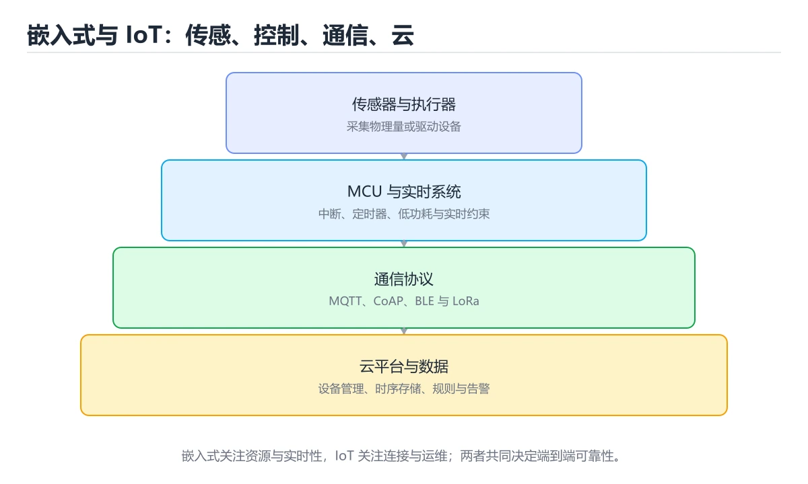

# 嵌入式与 IoT 基础

> 内容更新时间：2026-10-06 · 学习阶段：进阶 · 预计用时：35 分钟




## 学习目标

- 能用自己的话解释：嵌入式系统资源受限，内存、功耗、启动时间和实时性都是硬约束。
- 能用自己的话解释：外设通过寄存器和中断交互，驱动要处理并发、错误和恢复。
- 能用自己的话解释：IoT 设备要安全启动、加密通信、可更新并防止密钥泄露。
- 能把本课知识放回「计算机基础」，并完成练习与测验。

## 前置知识

- 具备本分类的前置知识，能跑通「嵌入式与 IoT 基础」的示例并解释输出。
- 本课关键词：嵌入式、MCU、低功耗、IoT。
- 遇到不熟悉的术语先记录问题，完成练习后再回读。

## 核心知识

### 1. 嵌入式系统资源受限，内存、功耗、启动时间和实时性都是硬约束。

- 关键做法：基线只保留 MCU 必需的部分，其余条件一次加一个。
- 验证标准：MCU 的异常路径有明确错误信息与恢复动作。

### 2. 外设通过寄存器和中断交互，驱动要处理并发、错误和恢复。

把这条结论放回「嵌入式与 IoT 基础」的完整流程里展开：

- 正文依据：能用自己的话解释：嵌入式系统资源受限，内存、功耗、启动时间和实时性都是硬约束。
- 落地检查：把「2. 外设通过寄存器和中断交互，驱动要处理并发、错误和恢复。」改写成一条可执行的核对项，逐条验证输入、超时与失败路径。

### 3. IoT 设备要安全启动、加密通信、可更新并防止密钥泄露。

把这条结论放回「嵌入式与 IoT 基础」的完整流程里展开：

- 正文依据：能用自己的话解释：IoT 设备要安全启动、加密通信、可更新并防止密钥泄露。
- 落地检查：把「3. IoT 设备要安全启动、加密通信、可更新并防止密钥泄露。」改写成一条可执行的核对项，逐条验证输入、超时与失败路径。

## 关键流程

```text
输入 → 校验 → 核心处理 → 验证 → 记录指标 → 失败恢复
```

## 实践路径

1. 用一句话复述本课要解决的问题。
2. 跑通正文中的最小示例并记录基线。
3. 只改变一个输入或参数，预测并验证结果。
4. 补一个失败路径，记录错误、恢复和指标。
5. 把结论写成可复现的笔记或测试。

## 常见错误与排查

> 说明：本表由《嵌入式与 IoT 基础》的核心知识整理（2026-10-07），人工复核进度见 docs/content_review_batches.md。

| 易错点 | 容易踩的做法 | 正确结论 |
| --- | --- | --- |
| 忽略资源与功耗上限 | 开发板能跑，量产设备撑不住 | 先确定 CPU、内存、功耗与成本预算再设计 |
| 通信没有校验与重试 | 噪声或丢包导致数据错误 | 加入校验、确认与重传，并定义离线缓存策略 |
| 没有升级与回滚方案 | 现场设备刷坏后无法恢复 | 支持双分区或回滚机制，升级前备份配置 |

## 动手练习

1. 合上教程，用 3～5 句话解释嵌入式与 IoT 基础。
2. 从正文选一个例子，改变一个条件并预测结果。
3. 设计一个失败场景，写出止损与恢复步骤。

**验收标准**：留下输入、命令、输出、差异和下一步问题。

## 本课小结

- 本课围绕 嵌入式、MCU、低功耗、IoT 展开，复习时重点核对它们的输入、输出和失败路径。
- 做完本课测验后，把答错且解释不清的 MCU 相关题目记成验证任务。


## 可运行练习

### 任务 1：先跑通，再解释

```python
state = "idle"
for tick in range(1, 4):
    state = "sample" if tick % 2 else "send"
    print(f"tick {tick}: {state}")
```

### 任务 2：只改一个条件

把「嵌入式与 IoT 基础」的最小示例复制一份，只改一个条件再跑一次：

- 改动点：只调整 sample 的一个参数，其余条件一律不动。
- 预测：先写下「嵌入式与 IoT 基础」在改动后的输出或错误信息，再运行。
- 记录：对照改动前后的结果，指出差异出在哪一步。
- 验收：换回原条件能复现原结果，改动只影响嵌入式。

### 任务 3：迁移到自己的数据

换一个 MCU 场景重做一次，确认结论不是只对示例数据成立。

## 故障现场

### 现场 1：忽略资源与功耗上限

**症状**：在《嵌入式与 IoT 基础》的复现场景中，开发板能跑，量产设备撑不住。

**根因**：触发点是把“忽略资源与功耗上限”当成安全做法。它没有满足《嵌入式与 IoT 基础》要求的前提，因此先表现为“开发板能跑，量产设备撑不住”；排查时先完整复现这一段，再核对输入、配置与依赖。

**修复**：针对《嵌入式与 IoT 基础》的问题，先确定 CPU、内存、功耗与成本预算再设计。

**验证**：先在《嵌入式与 IoT 基础》中记录“忽略资源与功耗上限”留下的失败证据，再执行“先确定 CPU、内存、功耗与成本预算再设计”并重放；确认错误路径变为明确结果，且修复没有掩盖同类故障。

### 现场 2：通信没有校验与重试

**症状**：在《嵌入式与 IoT 基础》的复现场景中，噪声或丢包导致数据错误。

**根因**：触发点是把“通信没有校验与重试”当成安全做法。它没有满足《嵌入式与 IoT 基础》要求的前提，因此先表现为“噪声或丢包导致数据错误”；排查时先完整复现这一段，再核对输入、配置与依赖。

**修复**：针对《嵌入式与 IoT 基础》的问题，加入校验、确认与重传，并定义离线缓存策略。

**验证**：先在《嵌入式与 IoT 基础》中记录“通信没有校验与重试”留下的失败证据，再执行“加入校验、确认与重传，并定义离线缓存策略”并重放；确认错误路径变为明确结果，且修复没有掩盖同类故障。

### 现场 3：没有升级与回滚方案

**症状**：在《嵌入式与 IoT 基础》的复现场景中，现场设备刷坏后无法恢复。

**根因**：触发点是把“没有升级与回滚方案”当成安全做法。它没有满足《嵌入式与 IoT 基础》要求的前提，因此先表现为“现场设备刷坏后无法恢复”；排查时先完整复现这一段，再核对输入、配置与依赖。

**修复**：针对《嵌入式与 IoT 基础》的问题，支持双分区或回滚机制，升级前备份配置。

**验证**：保留《嵌入式与 IoT 基础》里触发“现场设备刷坏后无法恢复”的输入、版本和日志，按“支持双分区或回滚机制，升级前备份配置”完成修改后原样重放；只有失败现象消失且相邻场景仍可解释，才保留改动。

## 本课复习清单


离开本课前，逐项确认：

- [ ] 不看解析，能说出「关于「外设通过寄存器和中断交互，驱动要处理并发、错误和恢复。」，下列说法正确的是？」的判断依据。
- [ ] 不看解析，能说出「关于「IoT 设备要安全启动、加密通信、可更新并防止密钥泄露。」，下列说法正确的是？」的判断依据。
- [ ] 不看解析，能说出「「嵌入式与 IoT 基础」的核心学习目标是什么？」的判断依据。
- [ ] 至少运行一次《嵌入式与 IoT 基础》的示例，记录输入、输出和一个边界情况。
- [ ] 把本课最容易混淆的两个概念写成一句话对照。

| 复盘项 | 记录 |
| --- | --- |
| 已经能独立解释的考点 |  |
| 仍然说不清的概念 |  |
| 下一步验证动作 |  |

## 复习与自测

对照 核心知识 复述本课结论，答不上来的部分回到 sample 的示例重跑一次。

### 核心知识

自检：这一节与相邻主题的边界在哪里？

### 动手练习

自检：如果去掉这一节里的一个前提，结论会怎样变化？

### 最小可运行示例

```python
state = "idle"
for tick in range(1, 4):
    state = "sample" if tick % 2 else "send"
    print(f"tick {tick}: {state}")
```

自检：把这一节讲给没学过的人，最需要强调哪一点？

### 预期输出

```text
tick 1: sample
tick 2: send
tick 3: sample
```

### 验证步骤

制造一次错误输入，记录错误信息与修复方式。
### 追问 1：关于「嵌入式系统资源受限，内存、功耗、启动时间和实时性都是硬约束。」，下列说法正确的是？

- 先写下判断，再对照：嵌入式系统资源受限，内存、功耗、启动时间和实时性都是硬约束。
- 检查点：如果 嵌入式 的输入换成边界值，这个结论还需要补充哪个前提？

### 追问 2：关于「外设通过寄存器和中断交互，驱动要处理并发、错误和恢复。」，下列说法正确的是？

- 先写下判断，再对照：外设通过寄存器和中断交互，驱动要处理并发、错误和恢复。

### 追问 3：关于「IoT 设备要安全启动、加密通信、可更新并防止密钥泄露。」，下列说法正确的是？

- 先写下判断，再对照：IoT 设备要安全启动、加密通信、可更新并防止密钥泄露。

## 术语速查

| 术语 | 一句话说明 |
| --- | --- |
| `嵌入式` | 把计算系统放入专用设备，强调资源受限、实时和外设交互。 |
| `MCU` | 微控制器，把 CPU、内存和外设集成在单芯片上，用于实时控制与嵌入式设备。 |
| `低功耗` | 通过睡眠模式、降低主频与外设按需上电，把 MCU 平均电流压到微安级以延长电池寿命。 |
| `中断` | 外设或定时器打断主循环去执行的短程序，通常只做标记，把耗时处理放回主循环。 |

## 零基础精讲：把嵌入式与 IoT 基础真正讲透

### 先建立一个直觉

把计算机看成一个分层机器：逻辑门组成运算单元，指令驱动数据移动，缓存缩短等待时间，操作系统把硬件抽象成可编程接口。落到本课，「嵌入式与 IoT 基础」关心的是 嵌入式 与 MCU 的配合，也就是说这条直觉要在 核心知识 里被具体验证。

本课的摘要可以当作一张地图：覆盖 MCU、外设、中断、低功耗、实时约束和设备安全。

### 逐步拆解

1. 澄清输入与目标。先写清「嵌入式与 IoT 基础」要解决的问题、合法输入范围和成功标准，再进入后续步骤。
2. 描述处理过程。把「嵌入式、MCU、低功耗、IoT」映射到具体步骤，每步都要求能单独验证。
3. 定义输出。明确 嵌入式 与 MCU 各自的产物，以及失败时留下什么证据。
4. 构造一次嵌入式越界，记录系统是拒绝、降级还是静默出错；三者对应的修复策略完全不同。
5. 把 sample 的规模缩小到一眼能算清的程度，手动推导结果后再用程序验证，差异处就是理解漏洞。

### 把正文串成一条执行链

- **1. 嵌入式系统资源受限，内存、功耗、启动时间和实时性都是硬约束。**：在「嵌入式与 IoT 基础」里，「1. 嵌入式系统资源受限，内存、功耗、启动时间和实时性都是硬约束。」这一步要先写清输入与预期，再记录实际结果和差异；结果不符时回到对应小节核对前提。
- **2. 外设通过寄存器和中断交互，驱动要处理并发、错误和恢复。**：在「嵌入式与 IoT 基础」里，「2. 外设通过寄存器和中断交互，驱动要处理并发、错误和恢复。」这一步要先写清输入与预期，再记录实际结果和差异；结果不符时回到对应小节核对前提。
- **3. IoT 设备要安全启动、加密通信、可更新并防止密钥泄露。**：在「嵌入式与 IoT 基础」里，「3. IoT 设备要安全启动、加密通信、可更新并防止密钥泄露。」这一步要先写清输入与预期，再记录实际结果和差异；结果不符时回到对应小节核对前提。
- **考点 1：按“嵌入式与 IoT 基础”中 嵌入式、MCU、低功耗 的实践顺序，把四个步骤排成从准备到复盘的合理顺序。**：先独立作答，再回到本课对应小节核对判断依据；答错时记录是哪一个前提被忽略。
- **考点 2：关于「外设通过寄存器和中断交互，驱动要处理并发、错误和恢复。」，下列说法正确的是？**：先独立作答，再回到本课对应小节核对判断依据；答错时记录是哪一个前提被忽略。
- **考点 3：关于「IoT 设备要安全启动、加密通信、可更新并防止密钥泄露。」，下列说法正确的是？**：先独立作答，再回到本课对应小节核对判断依据；答错时记录是哪一个前提被忽略。

### 从测验反推易错点

**检查点 1：关于「嵌入式系统资源受限，内存、功耗、启动时间和实时性都是硬约束。」，下列说法正确的是？**

- 参考判断：嵌入式系统资源受限，内存、功耗、启动时间和实时性都是硬约束。
- 自问：如果去掉题干里的一个限定词，结论还成立吗？

**检查点 2：关于「外设通过寄存器和中断交互，驱动要处理并发、错误和恢复。」，下列说法正确的是？**

- 参考判断：外设通过寄存器和中断交互，驱动要处理并发、错误和恢复。

**检查点 3：关于「IoT 设备要安全启动、加密通信、可更新并防止密钥泄露。」，下列说法正确的是？**

- 参考判断：IoT 设备要安全启动、加密通信、可更新并防止密钥泄露。

**检查点 4：本课的核心学习目标是什么？**

- 参考判断：覆盖 MCU、外设、中断、低功耗、实时约束和设备安全。

**检查点 5：以下哪些术语与嵌入式与 IoT 基础直接相关？（多选）**

- 参考判断：嵌入式、MCU

### 工程排错顺序

| 先查什么 | 要得到的证据 | 判断标准 |
| --- | --- | --- |
| 输入如何表示，位宽与精度是否明确？ | 日志、输入样例、测试或指标 | 能复现并解释，才算定位 |
| 数据经过哪些层级，瓶颈在哪一层？ | 日志、输入样例、测试或指标 | 能复现并解释，才算定位 |
| 顺序、分支与并行如何影响结果？ | 日志、输入样例、测试或指标 | 能复现并解释，才算定位 |
| 是否用基准测试验证了推断？ | 日志、输入样例、测试或指标 | 能复现并解释，才算定位 |

### 变式训练

1. 先用一个单文件示例验证 sample，确认正确性后再引入框架或分布式组件。
2. 扩大 MCU 的规模，记录本课结论在哪一个量级开始不成立。
3. 把 MCU 换成失败输入，记录错误信息与恢复动作。
5. 故意跳过 MCU 的检查再运行，比较与正常流程的差异，并说明这个检查挡住的到底是哪一类失败。
6. 限制 CPU 与内存上限后重跑 sample，观察哪一项参数需要重新设定。

### 本课自测

- [ ] 能用一句话解释「嵌入式」在本课中的角色与边界。
- [ ] 能举出一个正常例子和一个失败例子。
- [ ] 能说出最小验证步骤，以及需要记录的证据。
- [ ] 能用一句话解释「MCU」在本课中的角色与边界。
- [ ] 能用一句话解释「低功耗」在本课中的角色与边界。
- [ ] 能用一句话解释「IoT」在本课中的角色与边界。

### 迁移案例库

围绕 sample 重复同一套方法，每完成一轮就把差异写进笔记。

#### 迁移案例 1：围绕「嵌入式」做一次小实验

**目标**：在不改变课程主体的前提下，验证嵌入式与 IoT 基础中的一个关键判断。

**步骤**：
1. 复述当前方案对「嵌入式」的假设，写成一句可证伪的话。
2. 设计一个正常输入和一个边界输入，分别预测输出。
3. 运行或逐步演算，记录实际输出、耗时和失败信息。
4. 只调整一个参数，比较前后差异并解释原因。
5. 补充一条测试或复习卡，确保下次能更快复现。

**验收**：迁移过程要留下 sample 的可运行记录，并说明MCU在新场景下是否仍然成立。

#### 迁移案例 2：围绕「MCU」做一次小实验

**步骤**：
1. 复述当前方案对「MCU」的假设，写成一句可证伪的话。

#### 迁移案例 3：围绕「低功耗」做一次小实验

**步骤**：
1. 复述当前方案对「低功耗」的假设，写成一句可证伪的话。

#### 迁移案例 4：围绕「IoT」做一次小实验

**步骤**：
1. 复述当前方案对「IoT」的假设，写成一句可证伪的话。

#### 迁移案例 5：围绕「嵌入式」做一次小实验

**步骤**：

#### 迁移案例 6：围绕「MCU」做一次小实验

**步骤**：

#### 迁移案例 7：围绕「低功耗」做一次小实验

**步骤**：

#### 迁移案例 8：围绕「IoT」做一次小实验

**步骤**：

#### 迁移案例 9：围绕「嵌入式」做一次小实验

**步骤**：

#### 迁移案例 10：围绕「MCU」做一次小实验

**步骤**：

#### 迁移案例 11：围绕「低功耗」做一次小实验

**步骤**：

#### 迁移案例 12：围绕「IoT」做一次小实验

**步骤**：

#### 迁移案例 13：围绕「嵌入式」做一次小实验

**步骤**：

#### 迁移案例 14：围绕「MCU」做一次小实验

**步骤**：

#### 迁移案例 15：围绕「低功耗」做一次小实验

**步骤**：

#### 迁移案例 16：围绕「IoT」做一次小实验

**步骤**：

<!-- p0-depth-v2:end -->

## 考点精讲

### 考点 1：顺序排列·嵌入式

- **题目**：按“嵌入式与 IoT 基础”中 嵌入式、MCU、低功耗 的实践顺序，把四个步骤排成从准备到复盘的合理顺序。
- **判断依据**：在「嵌入式与 IoT 基础」里，在本课的练习里，顺序应当是：先明确 嵌入式 的输入、输出与约束 → 写出最小示例并核对 MCU 的基线结果 → 只改一个变量，记录边界与失败路径的变化 → 固定版本与证据，把本课的结论写成可复现记录。这个顺序把 嵌入式 的输入、输出和约束放在最前面，在嵌入式与 IoT 基础里避免概念没对齐就开始调参。第二步用 MCU 建立可核对的基线，在嵌入式与 IoT 基础里第三步才允许改变一个变量并观察失败路径。

### 考点 2：概念判断·嵌入式

- **题目**：关于「外设通过寄存器和中断交互，驱动要处理并发、错误和恢复。」，下列说法正确的是？
- **判断依据**：在「嵌入式与 IoT 基础」里，外设通过寄存器和中断交互，驱动要处理并发、错误和恢复。这道题的关键在「嵌入式与 IoT 基础」的嵌入式、MCU、低功耗：先确认题干“关于外设通过寄存器和中断交互”问的是哪一步，再排除偷换前提的选项。把“外设通过寄存器和中断交互”代回「嵌入式与 IoT 基础」里“外设通过寄存器和中断交互”的例子核对，条件一旦改变，结论就要用嵌入式、MCU、低功耗重新推导。

### 考点 3：概念判断·嵌入式

- **题目**：关于「IoT 设备要安全启动、加密通信、可更新并防止密钥泄露。」，下列说法正确的是？
- **判断依据**：在「嵌入式与 IoT 基础」里，IoT 设备要安全启动、加密通信、可更新并防止密钥泄露。在「嵌入式与 IoT 基础」里，如果只凭关键词作答，很容易把向量化后瓶颈常转向内存带宽，必须同时测量计算和访存。「嵌入式与 IoT 基础」要求先交代嵌入式、MCU、低功耗的前提再下结论，所以“IoT 设备要安全启动、加密通信”只在题干“IoT 设备要安全启动、加密通信、可更新并防止密钥泄露”给定的条件下成立。

### 考点 4：概念判断·嵌入式

- **题目**：「嵌入式与 IoT 基础」的核心学习目标是什么？
- **判断依据**：在「嵌入式与 IoT 基础」里，结论应落在「覆盖 MCU、外设、中断、低功耗、实时约束和设备安全」。在「嵌入式与 IoT 基础」里，结论应落在覆盖 MCU、外设、中断、低功耗、实时约束和设备安全。在「嵌入式与 IoT 基础」里，这道题要求区分概念与边界，覆盖 MCU、外设、中断、低功耗、实时约束和设备安全。

### 考点 5：多选辨析·嵌入式

- **题目**：以下哪些术语与「嵌入式与 IoT 基础」直接相关？（多选）
- **判断依据**：在「嵌入式与 IoT 基础」里，MCU。在「嵌入式与 IoT 基础」里判断这道题，要把嵌入式、MCU、低功耗的条件、过程与失败路径逐项对齐，换成“以下哪些术语与嵌入式与 IoT 基础”这个场景，只有满足前提的结论才成立。回到嵌入式、MCU、低功耗本身再看一遍：只有“嵌入式”与题干“以下哪些术语与嵌入式与”的前提一致，结论才成立。

### 考点 6：排错·嵌入式

- **题目**：阅读「嵌入式与 IoT 基础」的代码片段，下面哪项判断是正确的？
- **判断依据**：在「嵌入式与 IoT 基础」里，题干的正确项是嵌入式系统资源受限，内存、功耗、启动时间和实时性都是硬约束。把“嵌入式系统资源受限，内存、功耗”代回「嵌入式与 IoT 基础」里“阅读嵌入式与 IoT 基础的代码片段”的例子核对，条件一旦改变，结论就要用嵌入式、MCU、低功耗重新推导。「嵌入式与 IoT 基础」要求先交代嵌入式、MCU、低功耗的前提再下结论，所以“嵌入式系统资源受限，内存、功耗”只在题干“阅读嵌入式与”给定的条件下成立。

## English Overview

**Title:** Embedded and IoT Fundamentals

**Summary:** Cover MCUs, peripherals, interrupts, low power, real-time constraints and device security.

**Category:** Fundamentals
**Level:** 高级
**Key terms:** 嵌入式, MCU, 低功耗, IoT

## 内容元数据

- 内容版本：v2.0
- 最后更新：2026-10-06
- 学习阶段：进阶
- 适用环境：通用计算机体系结构知识；本课聚焦 嵌入式。
- 内容来源：内置结构化课程与工程实践整理
- 相关主题：嵌入式、MCU、低功耗、IoT
- 质量版本：P0 测验标准 + P1 覆盖扩展 + P2 体验补全

## 最小可运行示例

下面示例用于验证 嵌入式 的最小输入、处理和输出。先原样运行，再只修改一个值：

```python
state = "idle"
for tick in range(1, 4):
    state = "sample" if tick % 2 else "send"
    print(f"tick {tick}: {state}")
```

## 预期输出

```text
tick 1: sample
tick 2: send
tick 3: sample
```

## 验证步骤

1. 记录运行环境、命令和真实输出。
2. 修改一个输入，先写预测再运行。
4. 把结论写回本课笔记或测试用例。

## 参考资料与复核

- 最后复核：2026-10-04
- 下次复核：2027-03-17
- 复核范围：版本兼容、API 行为、安全建议与工程实践
- 来源性质：官方文档、标准或权威教材；正文为离线教学重组

| 参考资料 | 本课用途 |
| --- | --- |
| [MDN 计算机基础](https://developer.mozilla.org/docs/Learn_web_development/Core) | Web 相关计算机基础 |
| [MIT 6.006 算法导论](https://ocw.mit.edu/courses/6-006-introduction-to-algorithms-spring-2020/) | 算法与数据结构基础 |
| [NIST 二进制与数据表示](https://www.nist.gov/pml/owm/binary-information) | 二进制、位与数据单位 |

> 「嵌入式与 IoT 基础」的链接用于离线阅读后的延伸核对；App 不会自动联网。

## 复习与迁移

复习目标：把「嵌入式与 IoT 基础」的判断标准放回可复现的例子里。先自己作答，再对照依据；如果结论正确但理由不完整，回到正文补足前提。

### 概念复述

- 用一句话说明「嵌入式与 IoT 基础」解决什么问题：覆盖 MCU、外设、中断、低功耗、实时约束和设备安全。
- 写出嵌入式、MCU、低功耗之间的关系，并各举一个例子。
- 说出本课最容易混淆的两个概念，以及区分它们的判据。

### 正文逐节复核

- **零基础精讲：把嵌入式与 IoT 基础真正讲透**：本课的摘要可以当作一张地图：覆盖 MCU、外设、中断、低功耗、实时约束和设备安全。

### 测验回顾

1. 按“嵌入式与 IoT 基础”中 嵌入式、MCU、低功耗 的实践顺序，把四个步骤排成从准备到复盘的合理顺序。
   - 依据：在「嵌入式与 IoT 基础」里，在本课的练习里，顺序应当是：先明确 嵌入式 的输入、输出与约束 → 写出最小示例并核对 MCU 的基线结果 → 只改一个变量，记录边界与失败路径的变化 → 固定版本与证据，把本课的结论写成可复现记录。这个顺序把 嵌入式 的输入、输出和约束放在最前面，在嵌入式与 IoT 基础里避免概念没对齐就开始调参。第二步用 MCU 建立可核对的基线，在嵌入式与 IoT 基础里第三步才允许改变一个变量并观察失败路径。
2. 关于「外设通过寄存器和中断交互，驱动要处理并发、错误和恢复。」，下列说法正确的是？
   - 依据：在「嵌入式与 IoT 基础」里，外设通过寄存器和中断交互，驱动要处理并发、错误和恢复。这道题的关键在「嵌入式与 IoT 基础」的嵌入式、MCU、低功耗：先确认题干“关于外设通过寄存器和中断交互”问的是哪一步，再排除偷换前提的选项。把“外设通过寄存器和中断交互”代回「嵌入式与 IoT 基础」里“外设通过寄存器和中断交互”的例子核对，条件一旦改变，结论就要用嵌入式、MCU、低功耗重新推导。
3. 关于「IoT 设备要安全启动、加密通信、可更新并防止密钥泄露。」，下列说法正确的是？
   - 依据：在「嵌入式与 IoT 基础」里，IoT 设备要安全启动、加密通信、可更新并防止密钥泄露。在「嵌入式与 IoT 基础」里，如果只凭关键词作答，很容易把向量化后瓶颈常转向内存带宽，必须同时测量计算和访存。「嵌入式与 IoT 基础」要求先交代嵌入式、MCU、低功耗的前提再下结论，所以“IoT 设备要安全启动、加密通信”只在题干“IoT 设备要安全启动、加密通信、可更新并防止密钥泄露”给定的条件下成立。
4. 「嵌入式与 IoT 基础」的核心学习目标是什么？
   - 依据：在「嵌入式与 IoT 基础」里，结论应落在「覆盖 MCU、外设、中断、低功耗、实时约束和设备安全」。在「嵌入式与 IoT 基础」里，结论应落在覆盖 MCU、外设、中断、低功耗、实时约束和设备安全。在「嵌入式与 IoT 基础」里，这道题要求区分概念与边界，覆盖 MCU、外设、中断、低功耗、实时约束和设备安全。
5. 以下哪些术语与「嵌入式与 IoT 基础」直接相关？（多选）
   - 依据：在「嵌入式与 IoT 基础」里，MCU。在「嵌入式与 IoT 基础」里判断这道题，要把嵌入式、MCU、低功耗的条件、过程与失败路径逐项对齐，换成“以下哪些术语与嵌入式与 IoT 基础”这个场景，只有满足前提的结论才成立。回到嵌入式、MCU、低功耗本身再看一遍：只有“嵌入式”与题干“以下哪些术语与嵌入式与”的前提一致，结论才成立。
6. 阅读「嵌入式与 IoT 基础」的代码片段，下面哪项判断是正确的？
   - 依据：在「嵌入式与 IoT 基础」里，题干的正确项是嵌入式系统资源受限，内存、功耗、启动时间和实时性都是硬约束。把“嵌入式系统资源受限，内存、功耗”代回「嵌入式与 IoT 基础」里“阅读嵌入式与 IoT 基础的代码片段”的例子核对，条件一旦改变，结论就要用嵌入式、MCU、低功耗重新推导。「嵌入式与 IoT 基础」要求先交代嵌入式、MCU、低功耗的前提再下结论，所以“嵌入式系统资源受限，内存、功耗”只在题干“阅读嵌入式与”给定的条件下成立。

### 迁移练习

把「嵌入式与 IoT 基础」的结论迁移到相邻主题，每次迁移都写清预测与证据：

1. 换输入：用嵌入式处理一组你自己的数据，对比教材示例的结果差异。
2. 换失败条件：制造一个MCU相关的错误，说明如何从错误信息定位根因。
3. 换规模：把数据量或并发度提高一个数量级，说明「嵌入式与 IoT 基础」的结论是否仍成立。
