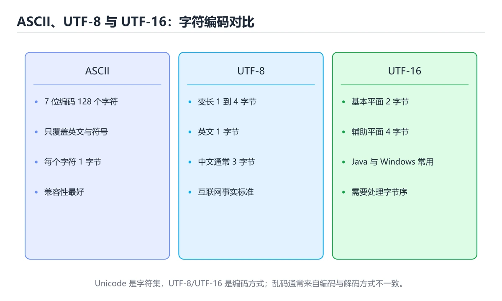
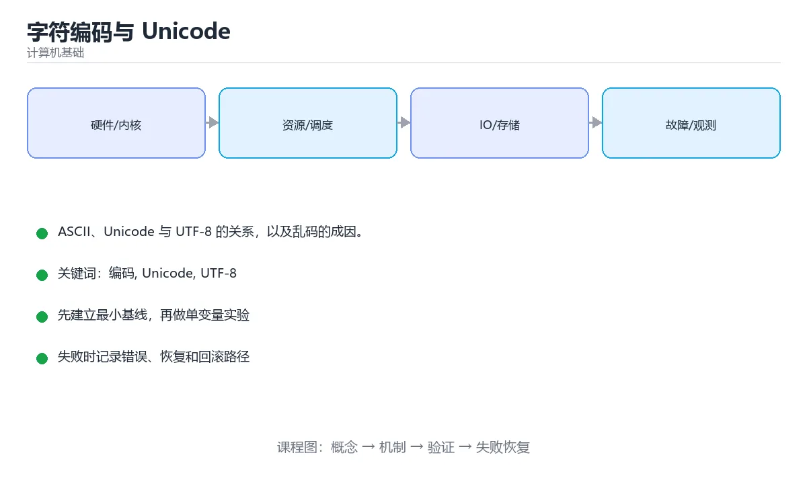

# 字符编码与 Unicode





> 内容更新时间：2026-10-06 · 学习阶段：基础 · 预计用时：40 分钟

## 学习目标

- 能用自己的话解释字符编码与 Unicode解决了什么问题，而不是只背术语。
- 能说清 「编码」、「Unicode」、「UTF-8」、「ASCII」 之间的关系，并分别举出一个例子。
- 能把 编码 放回「字符编码与 Unicode」的知识体系，说明它和 Unicode 的边界。
- 能完成本课练习，并用验收标准检查自己的结果。

> 一句话摘要：ASCII、Unicode 与 UTF-8 的关系，以及乱码的成因。

## 前置知识

- 先完成上一课《内存与缓存》；如果已经掌握，可以直接用本课练习自测。
- 本课阶段：基础。建议先掌握同一分类的基础课程，并能独立运行正文里的 write_text 示例。
- 开始前先复习：编码、Unicode、UTF-8。
- 如果 为什么需要编码 这一步看不懂，先记录具体卡点，再用 write_text 复现一遍。

## 为什么需要编码

计算机只存字节，字符必须映射成数字。这个映射规则就是字符编码。乱码的本质是**写入与读取用了不同的编码**。

## 发展脉络

| 编码 | 特点 |
| --- | --- |
| ASCII | 7 位表示 128 个字符，只有英文与符号 |
| GBK / Latin-1 | 各地区的单/双字节扩展，互不兼容 |
| Unicode | 为所有字符分配唯一码点（code point），如 `U+4E2D` 是「中」 |
| UTF-8 | Unicode 的变长编码：英文 1 字节、中文通常 3 字节 |
| UTF-16 / UTF-32 | 其他变长/定长实现，Java 字符串内部用 UTF-16 |

## UTF-8 编码规则

```text
1 字节：0xxxxxxx                          ASCII 兼容
2 字节：110xxxxx 10xxxxxx
3 字节：1110xxxx 10xxxxxx 10xxxxxx        常用汉字在这段
4 字节：11110xxx 10xxxxxx 10xxxxxx 10xxxxxx   表情等增补字符
```

```python
text = "中A"
data = text.encode("utf-8")
print(data)              # b'\xe4\xb8\xadA'，共 4 字节
print(len(text), len(data))   # 2 个字符，4 个字节
print(data.decode("utf-8"))
```

## 常见错误与排查

1. 读写文件不指定编码，Windows 上默认可能是 GBK。
2. 截断多字节字符会产生非法序列（所以不能按字节切分 UTF-8 文本）。
3. 数据库表的字符集与连接字符集不一致会导致乱码。
4. 字符串「长度」有歧义：字符数、字节数、显示宽度都不同。
| 容易写错的做法 | 实际现象 | 原因与正确做法 |
| --- | --- | --- |
| 读写文件不指定编码 | Windows 上按 GBK 解码导致乱码 | 一律显式 `encoding="utf-8"` |
| 认为 `len(str)` 等于字节数 | 长度与存储量不符 | 中文一个字通常 3 字节 |
| 把 Unicode 与 UTF-8 混为一谈 | 概念错误 | Unicode 是字符集，UTF-8 是编码方式 |
| 用 `errors="ignore"` 静默丢数据 | 数据悄悄缺失 | 用 `replace` 或记录错误并告警 |
| 在 UTF-8 文件里加 BOM | 解析器把 BOM 当内容 | JSON 与配置文件用无 BOM 的 UTF-8 |
| 按字节截断字符串 | 出现半个字符导致乱码 | 按字符或码位截断，或按字节但校验边界 |
| 认为 UTF-16 与字节序无关 | 跨平台读取乱码 | 明确 BOM 或统一用 UTF-8 |
| 用 `upper()` 比较国际化文本 | 某些语言结果不符 | 用 locale 感知的比较或大小写折叠 |
| Emoji 用 1 个 Java char 表示 | 取到半个代理对 | 用码位 API（`codePointAt`） |
| Base64 当作加密 | 数据可还原 | Base64 只是编码，不是加密 |

## 本课小结

统一用 **UTF-8**，读写时显式指定编码，涉及长度计算时先想清楚要的是字符数还是字节数。

## 编码速查

| 编码 | 单位 | 特点 | 适用 |
| --- | --- | --- | --- |
| ASCII | 1 字节 | 0 到 127，只覆盖英文 | 历史遗留 |
| Latin-1 | 1 字节 | 0 到 255，西欧字符 | 老系统 |
| GBK | 1 到 2 字节 | 中文兼容 ASCII | 国内旧系统 |
| UTF-8 | 1 到 4 字节 | 兼容 ASCII，无字节序问题 | 网络与文件首选 |
| UTF-16 | 2 或 4 字节 | 有字节序问题，需 BOM | Windows API、Java 内部 |
| UTF-32 | 4 字节 | 定长，空间浪费 | 内部处理 |

| Unicode 范围 | UTF-8 字节数 | 示例 |
| --- | --- | --- |
| U+0000 到 U+007F | 1 | ASCII |
| U+0080 到 U+07FF | 2 | 拉丁扩展、希腊文 |
| U+0800 到 U+FFFF | 3 | 中文、日文汉字 |
| U+10000 到 U+10FFFF | 4 | Emoji、扩展汉字 |

```python
# 明确编码，避免平台差异
text = "你好，世界"
raw = text.encode("utf-8")
print(len(text), len(raw))          # 5 与 15：中文 3 字节，标点 3 字节
print(raw.decode("utf-8"))

# 处理非法字节：忽略、替换或用替代字符
bad = b"\xff\xfehello"
print(bad.decode("utf-8", errors="replace"))

# 读写文件统一 UTF-8
from pathlib import Path
path = Path("note.txt")
path.write_text(text, encoding="utf-8")
print(path.read_text(encoding="utf-8"))

# 需要 BOM 以兼容 Excel 时可写 utf-8-sig
Path("table.csv").write_text("名称,数量\n苹果,3\n", encoding="utf-8-sig")
```

## 复习与自测

- [ ] 能说出 Unicode 与 UTF-8 的区别。
- [ ] 知道常用汉字在 UTF-8 中占 3 字节。
- [ ] 读写文件一律显式指定编码。
- [ ] 知道 BOM 的作用与副作用。
- [ ] 处理非法字节时明确使用替换或告警策略。

## 补充：UTF-8 编码规则、乱码排查与代码实践

### 码点、编码与字形：三个概念分清

```text
码点（Code Point）  字符在 Unicode 表中的编号，如「中」= U+4E2D
编码（Encoding）    码点如何变成字节，如 UTF-8 用 3 字节表示 U+4E2D
字形（Glyph）       字体把码点画出来的样子

同一个码点在不同字体下字形可以不同；同一个字节序列用不同编码解释会得到不同字符
```

### UTF-8 的编码规则

| 码点范围 | 字节数 | 首字节格式 | 后续字节 |
| --- | --- | --- | --- |
| U+0000 ~ U+007F | 1 | `0xxxxxxx` | —— |
| U+0080 ~ U+07FF | 2 | `110xxxxx` | `10xxxxxx` |
| U+0800 ~ U+FFFF | 3 | `1110xxxx` | `10xxxxxx` × 2 |
| U+10000 ~ U+10FFFF | 4 | `11110xxx` | `10xxxxxx` × 3 |

```text
例：「中」= U+4E2D
  二进制：0100 1110 0010 1101
  填入三字节模板：1110[0100] 10[111000] 10[101101]
  得到：E4 B8 AD   ← 这正是 UTF-8 下的三个字节

自校验特性
  · 首字节的高位决定了「这个词有多长」
  · 后续字节都以 10 开头，因此从任意位置也能重新同步
```

### 常见乱码与成因对照

| 现象 | 典型成因 | 修法 |
| --- | --- | --- |
| `ä¸æ–‡` | UTF-8 字节被按 Latin-1 解读 | 统一声明 UTF-8 |
| `���` | 解码时遇到非法字节，被替换为 U+FFFD | 检查源文件与声明的编码是否一致 |
| `涓枃` | UTF-8 被按 GBK 解读 | 读写两端统一 UTF-8 |
| 首部多出 `` | 把 UTF-8 BOM 当成正文字符 | 读文件时忽略 BOM |
| Windows 下正常、Linux 乱码 | 依赖系统默认编码 | 显式指定 `encoding="utf-8"` |

```bash
# 排查：先看字节，再猜编码
file -i data.txt                  # 查看文件声明的编码
xxd data.txt | head -2            # 看真实字节
iconv -f gbk -t utf-8 bad.txt > fixed.txt   # 尝试转码
```

### 各语言里的三个易错点

| 语言 | 易错点 | 正确做法 |
| --- | --- | --- |
| Python | 不指定 encoding 会用平台默认 | 显式 `encoding="utf-8"`，读二进制用 `"rb"` |
| JavaScript | 字符串按 UTF-16 存储，`length` 是码元数 | emoji 长度可能为 2，用 `[...str].length` 取真实字符数 |
| Java | `String.length()` 同样是 UTF-16 码元数 | 用 `codePointCount` 统计真实字符 |

```javascript
const emoji = "👨‍👩‍👧";
console.log(emoji.length);          // 8（码元数，含零宽连接符）
console.log([...emoji].length);     // 5（码点数）
// 真实「人类感知的字符」还需要按字素簇切分：
console.log(Array.from(new Intl.Segmenter().segment(emoji)).length);  // 1
```

### BOM 该不该有

```text
UTF-8 BOM = EF BB BF（3 字节）

· Windows 记事本有时会写入 BOM
· 多数解析器能处理，但会污染首行内容（如 JSON 解析失败、CSV 首列名带怪字符）
· 规范建议：UTF-8 不使用 BOM

处理方式
  · 读文件时用 utf-8-sig（Python）或手动跳过 BOM
  · 服务端响应头声明 charset=utf-8，不要依赖 BOM
```

### 自查清单

- [ ] 能说出码点、编码、字形的区别
- [ ] 记得 UTF-8 的四种字节长度与首字节前缀
- [ ] 遇到乱码会先看字节再判断编码
- [ ] 知道 emoji 的 `length` 为什么不是 1
- [ ] 知道 BOM 的作用与为什么要避免它

## 动手练习

> 本课练习重点：围绕「编码、Unicode、UTF-8」完成复述、实验和交付，每个结果都要能被别人检查。

先画出 write_text 的流程，再手算一组输入，最后运行核对。

### 练习 1：建立心智模型（10 分钟）

合上教程，用 3～5 句话回答：

1. 字符编码与 Unicode解决了什么问题？
2. 如果没有它，会出现什么具体后果？
3. 它和「Unicode」是什么关系？

验收标准：用自己的话解释 编码，并给出一个它不成立的反例。

### 练习 2：做一次可控实验（20 分钟）

从正文中选一个最小示例，完成以下操作：

1. 先预测修改一个参数、输入或步骤后的结果。
2. 再实际执行或逐步推演，记录真实结果。
3. 如果结果与预测不同，写出差异原因。

**验收标准**：围绕「为什么需要编码」小节做一次五步记录，原例取自 write_text，改动只允许动一处编码，原因要能指回正文的判断依据。

### 练习 3：交付一个小结果（30 分钟）

用表格、真值表或计算过程把抽象概念落到一个可核对的结果上。

任务要求：

- 结果必须能被别人检查，不能只写“我已经理解了”。
- 至少覆盖「编码」和「Unicode」两个关键词。
- 写出 1 个仍然不确定的问题，以及下一步如何验证。

> 提示：时间有限时优先做练习 1 和练习 2；练习 3 可以拆成两次完成。

## 可运行练习

### 任务 1：先跑通，再解释

```python
text = "中A"
data = text.encode("utf-8")
print(data)              # b'\xe4\xb8\xadA'，共 4 字节
print(len(text), len(data))   # 2 个字符，4 个字节
print(data.decode("utf-8"))
```

### 任务 2：只改一个条件

把「字符编码与 Unicode」的最小示例复制一份，只改一个条件再跑一次：

- 改动点：只调整 write_text 的一个参数，其余条件一律不动。
- 预测：先写下「字符编码与 Unicode」在改动后的输出或错误信息，再运行。
- 记录：对照改动前后的结果，指出差异出在哪一步。
- 验收：换回原条件能复现原结果，改动只影响编码。

### 任务 3：迁移到自己的数据

换一个 Unicode 场景重做一次，确认结论不是只对示例数据成立。

## 故障现场

### 现场 1：读写文件不指定编码

**症状**：在《字符编码与 Unicode》的复现场景中，Windows 上按 GBK 解码导致乱码。

**根因**：触发点是把“读写文件不指定编码”当成安全做法。它没有满足《字符编码与 Unicode》要求的前提，因此先表现为“Windows 上按 GBK 解码导致乱码”；排查时先完整复现这一段，再核对输入、配置与依赖。

**修复**：针对《字符编码与 Unicode》的问题，一律显式 encoding="utf-8"。

**验证**：先在《字符编码与 Unicode》中记录“读写文件不指定编码”留下的失败证据，再执行“一律显式 encoding="utf-8"”并重放；确认错误路径变为明确结果，且修复没有掩盖同类故障。

### 现场 2：认为 len(str) 等于字节数

**症状**：在《字符编码与 Unicode》的复现场景中，长度与存储量不符。

**根因**：当出现“认为 len(str) 等于字节数”时，执行路径已经绕过了《字符编码与 Unicode》的关键约束，最终以“长度与存储量不符”暴露出来；修复前必须先确认约束在哪里失效。

**修复**：针对《字符编码与 Unicode》的问题，中文一个字通常 3 字节。

**验证**：先在《字符编码与 Unicode》中记录“认为 len(str) 等于字节数”留下的失败证据，再执行“中文一个字通常 3 字节”并重放；确认错误路径变为明确结果，且修复没有掩盖同类故障。

### 现场 3：用 errors="ignore" 静默丢数据

**症状**：在《字符编码与 Unicode》的复现场景中，数据悄悄缺失。

**根因**：触发点是把“用 errors="ignore" 静默丢数据”当成安全做法。它没有满足《字符编码与 Unicode》要求的前提，因此先表现为“数据悄悄缺失”；排查时先完整复现这一段，再核对输入、配置与依赖。

**修复**：针对《字符编码与 Unicode》的问题，用 replace 或记录错误并告警。

**验证**：先在《字符编码与 Unicode》中记录“用 errors="ignore" 静默丢数据”留下的失败证据，再执行“用 replace 或记录错误并告警”并重放；确认错误路径变为明确结果，且修复没有掩盖同类故障。

## 本课复习清单

离开本课前，逐项确认：

- [ ] 不看解析，能说出「UTF-8 中一个常用汉字通常占几个字节？」的判断依据。
- [ ] 不看解析，能说出「出现乱码的最常见原因是？」的判断依据。
- [ ] 不看解析，能说出「Unicode 与 UTF-8 的关系是？」的判断依据。
- [ ] 不看解析，能说出「UTF-8 与 UTF-16 的主要差别是？」的判断依据。
- [ ] 不看解析，能说出「BOM（字节顺序标记）带来的常见问题是？」的判断依据。
- [ ] 用 编码 构造一个正常输入和一个边界输入，分别记录输出与判断依据。
- [ ] 把本课最容易混淆的两个概念写成一句话对照。

| 复盘项 | 记录 |
| --- | --- |
| 已经能独立解释的考点 |  |
| 仍然说不清的概念 |  |
| 下一步验证动作 |  |

## 术语速查

| 术语 | 一句话说明 |
| --- | --- |
| `码点` | 字符在 Unicode 中的编号，例如 U+4E2D，编码才是它在内存里的字节表示。 |
| `UTF-8` | 变长编码，ASCII 占一字节、常用汉字占三字节，是文件与网络传输的事实标准。 |
| `字形` | 字符在字体里对应的图形，同一个码点在三种字体下字形并不相同。 |
| `BOM` | 文件开头的字节顺序标记，UTF-8 场景通常不需要，带上反而会让某些解析器多读出一个字符。 |

## 考点精讲

### 考点 1：概念判断·编码

- **题目**：UTF-8 中一个常用汉字通常占几个字节？
- **判断依据**：UTF-8 是变长编码：英文 1 字节，常用汉字通常 3 字节，emoji 等增补字符 4 字节。其他选项：常用汉字在 UTF-8 中占 3 字节。在「字符编码与 Unicode」里判断这道题，要把编码、Unicode、UTF-8的条件、过程与失败路径逐项对齐，换成“UTF-8 中一个常用汉字通常占几个”这个场景，只有满足前提的结论才成立。

### 考点 2：概念判断·编码

- **题目**：出现乱码的最常见原因是？
- **判断依据**：在「字符编码与 Unicode」里，写入与读取使用了不同的编码。同一串字节按不同规则解码就会得到错误字符，统一使用 UTF-8 并显式指定编码可避免。「字符编码与 Unicode」要求先交代编码、Unicode、UTF-8的前提再下结论，所以“写入与读取使用了不同的编码”只在题干“出现乱码的最常见原因是”给定的条件下成立。

### 考点 3：代码补全·编码

- **题目**：这段 Python 代码是「字符编码与 Unicode」的示例片段，下面哪一项描述与它一致？
- **判断依据**：在「字符编码与 Unicode」里，题干的正确项是这段代码会产生可观察的输出，运行后能看到结果，在「字符编码与 Unicode」里要结合编码核对输出是否符合预期。把输入或边界换成空值、极值或失败情况后，结论要以「字符编码与 Unicode」的实际运行结果为准。把“这段代码会产生可观察的输出”代回「字符编码与 Unicode」里“这段 Python 代码是字符编码与 Unicode的示例片”的例子核对，条件一旦改变，结论就要用编码、Unicode、UTF-8重新推导。

### 考点 4：多选辨析·编码

- **题目**：围绕“字符编码与 Unicode”中的 编码、Unicode、UTF-8，下列哪两项是本课强调的实践判断？
- **判断依据**：结论应落在验证 Unicode 时要固定版本并覆盖边界输入。本课把字符编码与 Unicode拆成概念、示例与故障现场三部分，因此判断 编码 时必须同时交代输入、输出和失败路径，这使“学习 编码 时要同时说明输入、输出和失败路径，不能只看正常流程”成立。在字符编码与 Unicode里，判断 Unicode 时要固定版本与边界输入，所以“验证 Unicode 时要固定版本并覆盖边界输入，结论才可复现”才可复现。

### 考点 5：概念判断·编码

- **题目**：BOM（字节顺序标记）带来的常见问题是？
- **判断依据**：在「字符编码与 Unicode」里，某些解析器会把 BOM 当成正文内容，导致第一个字段出现异常字符。跨平台文本与 JSON 通常建议使用不带 BOM 的 UTF-8。「字符编码与 Unicode」要求先交代编码、Unicode、UTF-8的前提再下结论，所以“某些解析器会把 BOM 当成正文内容”只在题干“BOM（字节顺序标记）带来的常见问题是”给定的条件下成立。

### 考点 6：填空·编码

- **题目**：补全代码：「字符编码与 Unicode」示例中，下面这行代码缺少哪个关键字或函数名？请填入 ____。 `path.write_text(text, ____="utf-8")`
- **判断依据**：这道题的关键在「字符编码与 Unicode」的编码、Unicode、UTF-8：先确认题干“补全代码”问的是哪一步，再排除偷换前提的选项。把“encoding”代回「字符编码与 Unicode」里“字符编码与 Unicode示例中”的例子核对，条件一旦改变，结论就要用编码、Unicode、UTF-8重新推导。

## English Overview

**Title:** Character Encoding

**Summary:** ASCII, Unicode, UTF-8 and why mojibake happens.

**Category:** Fundamentals
**Level:** 基础
**Key terms:** 编码, Unicode, UTF-8, ASCII, 乱码

## 内容元数据

- 内容版本：v2.0
- 最后更新：2026-10-06
- 学习阶段：基础
- 适用环境：通用计算机体系结构知识
；本课聚焦 编码。
- 内容来源：内置结构化课程与工程实践整理
- 相关主题：编码、Unicode、UTF-8、ASCII、乱码
- 质量版本：P0 测验标准 + P1 覆盖扩展 + P2 体验补全

## 参考资料与复核

- 最后复核：2026-10-04
- 下次复核：2027-03-24
- 复核范围：版本兼容、API 行为、安全建议与工程实践
- 来源性质：官方文档、标准或权威教材；正文为离线教学重组

| 参考资料 | 本课用途 |
| --- | --- |
| [NIST 二进制与数据表示](https://www.nist.gov/pml/owm/binary-information) | 二进制、位与数据单位 |
| [CS50 计算机科学导论](https://cs50.harvard.edu/x/) | 计算机科学综合入门 |
| [MIT 6.006 算法导论](https://ocw.mit.edu/courses/6-006-introduction-to-algorithms-spring-2020/) | 算法与数据结构基础 |

> 「字符编码与 Unicode」的链接用于离线阅读后的延伸核对；App 不会自动联网。

<!-- p1-deep-dive:start -->
## 深挖「编码」的边界与代价

这一章只用「字符编码与 Unicode」自己的正文、代码和测验题，把编码推到边界再看一遍：先确认它在什么条件下成立，再估计代价，最后给出可复现的证据。

### 一、编码 的关键句与适用条件

| 正文出处 | 原句 | 用之前先确认 |
| --- | --- | --- |
| 为什么需要编码 | 乱码的本质是写入与读取用了不同的编码。 | 把 编码 换成边界值时，这一步是否仍然成立 |
| 现场 1：读写文件不指定编码 | 根因：触发点是把“读写文件不指定编码”当成安全做法。它没有满足《字符编码与 Unicode》要求的前提，因此先表现为“Windows 上按 GBK 解码导致乱码”；排查时先完整复现这一段，再核对输入、配置与依赖。 | 把 编码 换成边界值时，这一步是否仍然成立 |
| 现场 1：读写文件不指定编码 | 验证：先在《字符编码与 Unicode》中记录“读写文件不指定编码”留下的失败证据，再执行“一律显式 encoding="utf-8"”并重放；确认错误路径变为明确结果，且修复没有掩盖同类故障。 | 把 编码 换成边界值时，这一步是否仍然成立 |
| 现场 2：认为 len(str) 等于字节数 | 症状：在《字符编码与 Unicode》的复现场景中，长度与存储量不符 | 把 乱码 换成边界值时，这一步是否仍然成立 |
| 现场 2：认为 len(str) 等于字节数 | 根因：当出现“认为 len(str) 等于字节数”时，执行路径已经绕过了《字符编码与 Unicode》的关键约束，最终以“长度与存储量不符”暴露出来；修复前必须先确认约束在哪里失效。 | 把 编码 换成边界值时，这一步是否仍然成立 |

读这张表时不要只记结论：每一句都要问「把编码换成边界值还成立吗」。如果第二列的原句里已经写明前提，第三列就写成「前提不变」；如果原句省略了前提，第三列必须补出来。

### 二、把 ASCII 推到边界

下面是本课第一段代码（text），先原样运行一次作为基线：

```text
1 字节：0xxxxxxx                          ASCII 兼容
2 字节：110xxxxx 10xxxxxx
3 字节：1110xxxx 10xxxxxx 10xxxxxx        常用汉字在这段
4 字节：11110xxx 10xxxxxx 10xxxxxx 10xxxxxx   表情等增补字符
```

| 变式 | 怎么改 | 先写下什么 | 观察点 |
| --- | --- | --- | --- |
| 边界输入 | 把 ASCII 的输入换成空值或最大值 | 预测输出 | 是否报错、是否静默返回 |
| 只改一处 | 把 xxxxxxx 的一个参数改成另一档 | 预测差异来源 | 输出变化能否用本课结论解释 |
| 去掉一步 | 注释掉 ASCII 之后的一行 | 预测哪一步先失败 | 错误位置是否与预期一致 |

三次实验都要保留「原例 → 改动 → 预测 → 结果 → 原因」五步记录；其中「原因」必须引用「字符编码与 Unicode」正文里的结论，而不是只写「正常」或「报错」。

### 三、「编码」的代价怎么量

| 观察项 | 怎么测 | 结论怎么写 |
| --- | --- | --- |
| 时间 | 把 编码 的输入规模翻倍，记录耗时变化 | 写出增长是线性、对数还是常数，并给出实测数据 |
| 空间 | 记录 Unicode 占用的内存或存储峰值 | 说明峰值出现在哪一步，以及能否提前释放 |
| 可读性 | 统计完成同一件事需要多少行代码或多少步操作 | 用具体行数代替「更简洁」这类主观描述 |
| 失败代价 | 触发一次失败，记录恢复所需步骤 | 写清失败后是否有残留状态、如何回滚 |

如果在「字符编码与 Unicode」里量不出上表的任何一项，说明实验还停留在阅读层面：先把输入规模翻倍，再回来填表。

### 四、测验复盘

| 题号 | 正确答案 | 最容易选错的干扰项 | 复盘动作 |
| --- | --- | --- | --- |
| 1 | 3 | 2 | 把干扰项改写成一句反例，再说明它违反本课哪条前提 |
| 2 | 写入与读取使用了不同的编码 | 内存不足（仅部分场景成立） | 把干扰项改写成一句反例，再说明它违反本课哪条前提 |
| 3 | 这段代码会产生可观察的输出，运行后能看到结果。 | 这段代码只做静态声明，没有循环、分支或可观察输出。 | 把干扰项改写成一句反例，再说明它违反本课哪条前提 |
| 4 | 验证 Unicode 时要固定版本并覆盖边界输入，结论才可复现 | 只要 编码 的常规示例通过，就可以跳过边界与异常路径 | 把干扰项改写成一句反例，再说明它违反本课哪条前提 |
| 5 | 某些解析器会把 BOM 当成正文内容，导致第一个字段出现异常字符 | 会让文件无法保存（只在边界情况下成立，不能回答本题） | 把干扰项改写成一句反例，再说明它违反本课哪条前提 |
| 6 | 0 | （无干扰项） | 把干扰项改写成一句反例，再说明它违反本课哪条前提 |

复盘「字符编码与 Unicode」时只写「我记住了」没有意义：每个错误选项都要能对应到本课的一条前提，写完后再回到第一节的关键句表核对一次。

### 五、离开本课前的自检

- [ ] 能用一句话说明 编码 解决什么问题、在什么条件下失效。
- [ ] 能指出 Unicode 与相邻概念的分工，并各举一个反例。
- [ ] 能在不看解析的情况下重做本课测验，并解释字符编码与 Unicode中每个错误选项。
- [ ] 能按第二节的表格完成至少两次 编码 实验，并留下命令与输出。
- [ ] 能写出「字符编码与 Unicode」的三条结论，每条都配一个适用边界。

全部勾选后，再去做「字符编码与 Unicode」的测验与练习；只要有一项答不上来，就回到对应小节补一次实验，而不是先背结论。
<!-- p1-deep-dive:end -->
