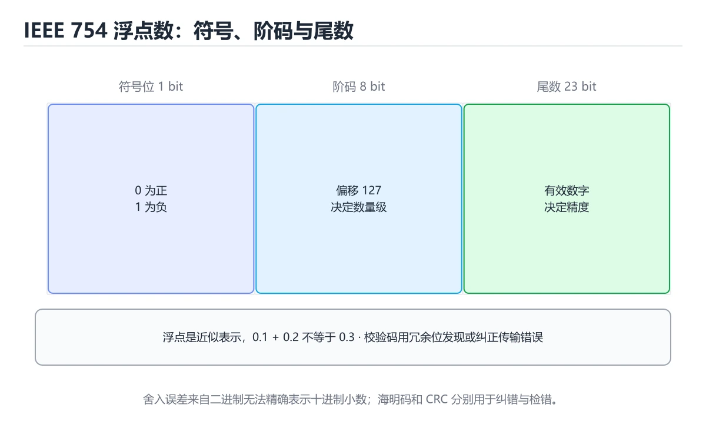
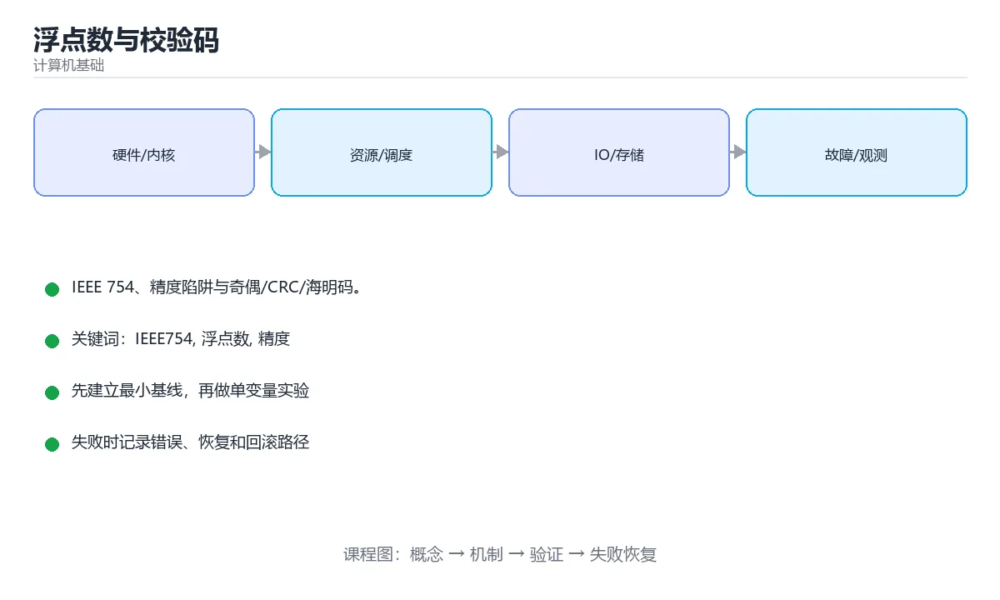

# 本课主题

> 内容更新时间：2026-10-03





## 学习目标

- 能用自己的话解释本课主题解决了什么问题，而不是只背术语。
- 能说清 「IEEE754」、「浮点数」、「精度」、「CRC」 之间的关系，并分别举出一个例子。
- 能把本课知识放回「计算机基础」的知识体系，说明它和相邻主题的边界。
- 能完成本课练习，并用验收标准检查自己的结果。

> 一句话摘要：IEEE 754、精度陷阱与奇偶/CRC/海明码。

## 前置知识

- 先完成上一课《中断、异常与 DMA》；如果已经掌握，可以直接用本课练习自测。
- 本课阶段：进阶。建议先掌握同一分类的基础课程，并能独立运行正文中的最小示例。
- 开始前先复习：IEEE754、浮点数、精度。
- 如果某一步看不懂，先记录具体卡点，完成练习后再回头读一遍。

## IEEE 754 浮点数

单精度（32 位）= 1 位符号 + 8 位阶码 + 23 位尾数；双精度（64 位）= 1 位符号 + 11 位阶码 + 52 位尾数。阶码用**移码**表示，尾数采用隐含首位 1 的规格化形式，从而多出 1 位精度。

| 阶码 | 尾数 | 含义 |
| --- | --- | --- |
| 全 0 | 全 0 | ±0 |
| 全 0 | 非 0 | 非规格化数（逐渐下溢） |
| 全 1 | 全 0 | ±∞ |
| 全 1 | 非 0 | NaN（含 quiet/signaling） |

## 精度陷阱

0.1 与 0.2 无法用二进制精确表示，因此 `0.1 + 0.2 != 0.3`。常见后果：大量小数累加产生偏差、`==` 比较不可靠、金额计算出错。

对策：**用整数或定点表示金额**；比较时用容差 `abs(a-b) < 1e-9`；大量求和用 Kahan 补偿求和或先排序再累加；避免「大数吃小数」（相差过大时小数被吞掉）。

## 校验码

| 方法 | 能力 | 用途 |
| --- | --- | --- |
| 奇偶校验 | 检出奇数个位错误 | 串口、内存简单校验 |
| 累加和 / XOR | 检出常见错误 | 网络简单校验 |
| CRC | 检错能力强、实现便宜 | 以太网帧、磁盘、压缩包 |
| 海明码 | 可纠一位错、检两位错 | ECC 内存 |
| 纠删码（RS） | 丢失分片仍可恢复 | 分布式存储、RAID 6 |

检错与纠错的权衡：检错只需少量冗余位但要重传，纠错需要更多冗余但能就地恢复。

## 本课小结
浮点数决定「怎么表示实数及其误差」，校验码决定「怎么发现与修复传输/存储错误」。两者都是**用有限位表达无限信息**时的工程取舍。

## IEEE 754 速查

| 格式 | 符号位 | 指数位 | 尾数位 | 十进制有效位 |
| --- | --- | --- | --- | --- |
| 单精度 float | 1 | 8 | 23 | 约 7 位 |
| 双精度 double | 1 | 11 | 52 | 约 15 到 16 位 |
| 半精度 half | 1 | 5 | 10 | 约 3 位 |

| 特殊值 | 条件 | 说明 |
| --- | --- | --- |
| 零 | 指数与尾数全 0 | 有 +0 与 -0 |
| 次正规数 | 指数全 0、尾数非 0 | 表示极小数，精度下降 |
| 无穷 | 指数全 1、尾数全 0 | 溢出或除以 0 产生 |
| NaN | 指数全 1、尾数非 0 | 0/0、无穷减无穷产生 |

```python
import math

# 1. 不要用 == 比较浮点
print(0.1 + 0.2 == 0.3)                       # False
print(math.isclose(0.1 + 0.2, 0.3))           # True

# 2. 金额用整数分或 Decimal
from decimal import Decimal, ROUND_HALF_UP
total = Decimal("19.9") * 3
print(total.quantize(Decimal("0.01"), rounding=ROUND_HALF_UP))   # 59.70

# 3. 判 NaN 与无穷
nan_value = float("nan")
print(nan_value != nan_value, math.isnan(nan_value))             # True True
print(math.isinf(float("inf")))                                  # True

# 4. 求和误差：大数吃小数
values = [1e16, 1.0, -1e16]
print(sum(values))                                               # 0.0，丢失了 1.0
print(math.fsum(values))                                         # 1.0，精确求和

# 5. 比较要给出容差
def almost_equal(a, b, rel_tol=1e-9, abs_tol=1e-12) -> bool:
    return math.isclose(a, b, rel_tol=rel_tol, abs_tol=abs_tol)

assert almost_equal(0.1 + 0.2, 0.3)
```

## 校验码速查

| 编码 | 检错能力 | 纠错能力 | 典型用途 |
| --- | --- | --- | --- |
| 奇偶校验 | 检奇数位错误 | 无 | 内存、串口 |
| 校验和 | 检部分错误 | 无 | 简单协议 |
| CRC-32 | 检突发错误强 | 无 | 网络帧、文件校验 |
| 海明码 | 检两位错 | 纠一位错 | ECC 内存 |
| 里德-所罗门 | 检多个符号错 | 纠多个符号错 | 二维码、光盘、深空通信 |
| BCH 码 | 可参数化 | 可参数化 | NAND 闪存 |

```python
import zlib

def crc32_hex(data: bytes) -> str:
    """CRC-32：网络与文件校验的常用实现。"""
    return f"{zlib.crc32(data) & 0xFFFFFFFF:08X}"

def hamming_encode_nibble(nibble: int) -> int:
    """海明(7,4)：4 位数据加 3 位校验，可纠 1 位错。"""
    d1, d2, d3, d4 = ((nibble >> i) & 1 for i in range(4))
    p1 = d1 ^ d2 ^ d4
    p2 = d1 ^ d3 ^ d4
    p3 = d2 ^ d3 ^ d4
    return (p1 << 6) | (p2 << 5) | (d1 << 4) | (p3 << 3) | (d2 << 2) | (d3 << 1) | d4

assert hamming_encode_nibble(0b1011) >= 0
print(f"CRC-32 of 'hello' = {crc32_hex(b'hello')}")
```

## 常见错误对照表

| 容易写错的做法 | 实际现象 | 原因与正确做法 |
| --- | --- | --- |
| 用 `==` 比较浮点结果 | 明明相等却判为不等 | 用 `math.isclose` 或容差 |
| 用 `double` 算金额 | 分位出现 0.0000000001 偏差 | 用整数分或 `Decimal` |
| 用 `x != x` 以外的值判 NaN | 判断错误 | 用 `math.isnan` |
| 大数小数混合求和 | 小数被吃掉 | 用 `math.fsum` 或按量级排序累加 |
| 认为 `0.1` 精确可表示 | 精度分析错误 | 十进制小数多为二进制无限循环 |
| 直接相减判断相等 | 误差被放大 | 用相对容差 |
| 认为 CRC 能纠错 | 期望落空 | CRC 只检错，纠错需海明/RS |
| 校验和不加长度与顺序信息 | 漏检换位错误 | 用带位置的校验或更强的校验算法 |
| 用 MD5 做完整性校验 | 碰撞风险 | 安全场景用 SHA-256 及以上 |
| 忽略次正规数与精度下降 | 极小值计算异常 | 注意数值范围并做缩放 |

## 自测清单

- [ ] 记得双精度是 1 + 11 + 52 位结构。
- [ ] 浮点比较一律使用容差，不用 `==`。
- [ ] 金额使用整数分或 `Decimal`。
- [ ] 知道 NaN 与自身比较为 false。
- [ ] 分得清检错码（CRC）与纠错码（海明、RS）。

## 动手练习

> 本课练习重点：围绕「IEEE754、浮点数、精度」完成复述、实验和交付，每个结果都要能被别人检查。

先用表格或时序图描述机制，再手算一个最小例子，最后用程序验证。

### 练习 1：建立心智模型（10 分钟）

合上教程，用 3～5 句话回答：

1. 本课主题解决了什么问题？
2. 如果没有它，会出现什么具体后果？
3. 它和「浮点数」是什么关系？

**验收标准**：至少出现一个本课关键词，并写出一个反例、边界条件或失效场景。

### 练习 2：做一次可控实验（20 分钟）

从正文中选一个最小示例，完成以下操作：

1. 先预测修改一个参数、输入或步骤后的结果。
2. 再实际执行或逐步推演，记录真实结果。
3. 如果结果与预测不同，写出差异原因。

**验收标准**：留下「原例 → 改动 → 预测 → 结果 → 原因」五步记录。

### 练习 3：交付一个小结果（30 分钟）

用表格、真值表或计算过程把抽象概念落到一个可核对的结果上。

任务要求：

- 结果必须能被别人检查，不能只写“我已经理解了”。
- 至少覆盖「IEEE754」和「浮点数」两个关键词。
- 写出 1 个仍然不确定的问题，以及下一步如何验证。

> 提示：时间有限时优先做练习 1 和练习 2；练习 3 可以拆成两次完成。

## 可运行练习

### 任务 1：先跑通，再解释

```python
import zlib

def crc32_hex(data: bytes) -> str:
    """CRC-32：网络与文件校验的常用实现。"""
    return f"{zlib.crc32(data) & 0xFFFFFFFF:08X}"

def hamming_encode_nibble(nibble: int) -> int:
    """海明(7,4)：4 位数据加 3 位校验，可纠 1 位错。"""
    d1, d2, d3, d4 = ((nibble >> i) & 1 for i in range(4))
    p1 = d1 ^ d2 ^ d4
    p2 = d1 ^ d3 ^ d4
    p3 = d2 ^ d3 ^ d4
    return (p1 << 6) | (p2 << 5) | (d1 << 4) | (p3 << 3) | (d2 << 2) | (d3 << 1) | d4

assert hamming_encode_nibble(0b1011) >= 0
print(f"CRC-32 of 'hello' = {crc32_hex(b'hello')}")
```

### 任务 2：只改一个条件

### 任务 3：迁移到自己的数据

用同一套思路处理一组你自己的数据或场景，保持输出格式与任务 1 一致。

## 故障现场

### 现场 1：本课的 IEEE754 常规用例通过，但边界用例失败

**症状**：在本课的练习或生产场景里出现“本课的 IEEE754 常规用例通过，但边界用例失败”。

**复现**：准备一组最小输入，只保留触发“本课的 IEEE754 常规用例通过，但边界用例失败”的必要条件，连续运行两次确认结果稳定。

**定位**：围绕“IEEE754 的前置条件与取值边界没有写进代码，默认值掩盖了空值和极值”检查调用链、输入数据和环境配置，先验证假设再改代码。

**预防**：把“本课的 IEEE754 常规用例通过，但边界用例失败”写成一条自动化用例，并在本课的验收清单里保留对应检查项。

### 现场 2：本课的 浮点数 结果在两次运行之间不一致

**症状**：在本课的练习或生产场景里出现“本课的 浮点数 结果在两次运行之间不一致”。

**复现**：准备一组最小输入，只保留触发“本课的 浮点数 结果在两次运行之间不一致”的必要条件，连续运行两次确认结果稳定。

**定位**：围绕“浮点数 依赖了当前版本、执行顺序或共享状态，单次运行无法暴露差异”检查调用链、输入数据和环境配置，先验证假设再改代码。

**预防**：把“本课的 浮点数 结果在两次运行之间不一致”写成一条自动化用例，并在本课的验收清单里保留对应检查项。

### 现场 3：本课的验证只在开发机通过

**症状**：在本课的练习或生产场景里出现“本课的验证只在开发机通过”。

**定位**：围绕“环境版本、配置和输入规模与目标环境不同，IEEE754 缺少可重复的验证记录”检查调用链、输入数据和环境配置，先验证假设再改代码。

## 本课复习清单

离开本课前，逐项确认：

- [ ] 不看解析，能说出「双精度浮点数的尾数占多少位？」的判断依据。
- [ ] 不看解析，能说出「0.1 + 0.2 != 0.3 的根本原因是？」的判断依据。
- [ ] 不看解析，能说出「下面哪种编码可以纠正一位错误？」的判断依据。
- [ ] 不看解析，能说出「IEEE 754 中 NaN 与 Inf 的产生原因是？」的判断依据。
- [ ] 不看解析，能说出「奇偶校验与 CRC 的区别是？」的判断依据。
- [ ] 至少运行一次本课示例，记录输入、输出和一个边界情况。
- [ ] 把本课最容易混淆的两个概念写成一句话对照。

| 复盘项 | 记录 |
| --- | --- |
| 已经能独立解释的考点 |  |
| 仍然说不清的概念 |  |
| 下一步验证动作 |  |

## 术语速查

| 术语 | 本课语境 |
| --- | --- |
| `0.1 + 0.2 != 0.3` | 与 0.2 无法用二进制精确表示，因此 `0.1 + 0.2 != 0.3`。常见后果：大量小数累加产生偏差、`==` 比较不可靠、金额计算出错。 |
| `==` | 与 0.2 无法用二进制精确表示，因此 `0.1 + 0.2 != 0.3`。常见后果：大量小数累加产生偏差、`==` 比较不可靠、金额计算出错。 |
| `abs(a-b) < 1e-9` | 对策：**用整数或定点表示金额**；比较时用容差 `abs(a-b) < 1e-9`；大量求和用 Kahan 补偿求和或先排序再累加；避免「大数吃小数」（相差过大时小数被吞掉）。 |
| `math.isclose` | \| 用 `==` 比较浮点结果 \| 明明相等却判为不等 \| 用 `math.isclose` 或容差 \| |
| `double` | \| 用 `double` 算金额 \| 分位出现 0.0000000001 偏差 \| 用整数分或 `Decimal` \| |
| `Decimal` | \| 用 `double` 算金额 \| 分位出现 0.0000000001 偏差 \| 用整数分或 `Decimal` \| |
| `x != x` | \| 用 `x != x` 以外的值判 NaN \| 判断错误 \| 用 `math.isnan` \| |
| `math.isnan` | \| 用 `x != x` 以外的值判 NaN \| 判断错误 \| 用 `math.isnan` \| |
| `math.fsum` | \| 大数小数混合求和 \| 小数被吃掉 \| 用 `math.fsum` 或按量级排序累加 \| |
| `0.1` | \| 认为 `0.1` 精确可表示 \| 精度分析错误 \| 十进制小数多为二进制无限循环 \| |
| `，判断时要把题干限定的输入、边界与目标逐项对齐。本课示例中还能看到` | 判断依据**：正确答案是「isclose」，这道题在问补全代码：本课主题示例中，下面这行代码缺少哪个…ol,abs_tol=abs_tol)`，判断时要把题干限定的输入、边界与目标逐项对齐。本课示例中还能看到 `p… |

## 考点精讲

### 考点 1：双精度浮点数的尾数占多少位？

- **判断依据**：双精度 = 1 位符号 + 11 位阶码 + 52 位尾数。其他选项：双精度是 1 位符号 + 11 位指数 + 52 位尾数。判断这类题时，要把「52」放回题干限定的对象、输入和边界，「23」、「32」 等说法虽然包含相关术语，但范围或前提与本题不一致。

### 考点 2：下面这段 Python 代码复现了“浮点数与校验码”中 IEEE754、浮点数、精度 相关的一个常见故障，哪一项最准确地解释了问题？

- **判断依据**：本题应选「遍历列表时直接删除元素，后续元素被跳过（float_and_check 第 2 题）；应遍历副本或构造新列表」（float_and_check 第 2 题）。本题应选遍历列表时直接删除元素，后续元素被跳过（float_and_check 第 2 题）。应遍历副本或构造新列表（float_and_check 第 2 题）。本题应选遍历列表时直接删除元素，后续元素被跳过（floatandcheck 第 2 题）。

### 考点 3：下面哪种编码可以纠正一位错误？

- **判断依据**：海明码通过多位校验位定位并纠正单个位错误。其他选项：海明码通过多位校验位定位并纠正一位错误。正确的判断需要逐项核对定义、版本和适用条件（floatandcheck 第 3 题）。如果只凭关键词作答，很容易把「XOR 校验」、「累加和」与「海明码」混在一起；正确的判断需要逐项核对定义、版本和适用条件（float_and_check 第 3 题）。

### 考点 4：IEEE 754 中 NaN 与 Inf 的产生原因是？

- **判断依据**：结论应落在「0/0、无穷减无穷等未定义运算产生 NaN；溢出与除零产生 Inf」。结论应落在0/0、无穷减无穷等未定义运算产生 NaN。正确答案是0/0、无穷减无穷等未定义运算产生 NaN。溢出与除零产生 Inf，这道题要结合 IEEE 754 中 NaN 与 Inf 的产生原因是， 限定的语境来判断。

### 考点 5：围绕“浮点数与校验码”中的 IEEE754、浮点数、精度，下列哪两项是本课强调的实践判断？

- **判断依据**：正确答案包括「学习 IEEE754 时要同时说明输入、输出和失败路径，不能只看正常流程」、「验证 浮点数 时要固定版本并覆盖边界输入，结论才可复现」。正确答案是学习 IEEE754 时要同时说明输入、输出和失败路径。本课把本课主题拆成概念、示例与故障现场三部分，因此判断 IEEE754 时必须同时交代输入、输出和失败路径，这使“学习 IEEE754 时要同时说明输入、输出和失败路径，不能只看正常流程”成立。在本课主题里，判断 浮点数 时要固定版本与边界输入，所以“验证 浮点数 时要固定版本并覆盖边界输入，结论才可复现”才可复现。

### 考点 6：补全代码：「浮点数与校验码」示例中，下面这行代码缺少哪个关键字或函数名？请填入 ____。

`return math.____(a, b, rel_tol=rel_tol, abs_tol=abs_tol)`

- **判断依据**：围绕 补全代码：本课主题示例中，下面这行代码缺少哪个关键字或函数… 作答时，先用IEEE754建立输入与输出的基线，再把isclose代入边界条件核对，结论才能复现。解题的关键不是记住孤立术语，而是确认「isclose」是否完整覆盖题干的输入、输出和失败路径，并排除这类相邻概念。

## English Overview

**Title:** Floating Point & Checksums

**Summary:** IEEE 754, precision pitfalls and checksums.

**Category:** Fundamentals
**Level:** 进阶
**Key terms:** IEEE754, 浮点数, 精度, CRC, 海明码

## 内容元数据

- 内容版本：v2.0
- 最后更新：2026-10-03
- 学习阶段：进阶
- 适用环境：通用计算机体系结构知识
- 内容来源：内置结构化课程与工程实践整理
- 相关主题：IEEE754、浮点数、精度、CRC、海明码
- 质量版本：P0 测验标准 + P1 覆盖扩展 + P2 体验补全


## 参考资料与复核

- 最后复核：2026-10-04
- 下次复核：2027-04-04
- 复核范围：版本兼容、API 行为、安全建议与工程实践
- 来源性质：官方文档、标准或权威教材；正文为离线教学重组

| 参考资料 | 本课用途 |
| --- | --- |
| [CS50 计算机科学导论](https://cs50.harvard.edu/x/) | 计算机科学综合入门 |
| [MIT 6.033 计算机系统工程](https://ocw.mit.edu/courses/6-033-computer-system-engineering-spring-2018/) | 系统设计与并发 |
| [NIST 二进制与数据表示](https://www.nist.gov/pml/owm/binary-information) | 二进制、位与数据单位 |

> 「浮点数与校验码」的链接用于离线阅读后的延伸核对；App 不会自动联网。

## 复习与迁移

- 围绕「双精度浮点数的尾数占多少位？」做迁移时，先记录输入、边界和预期，再观察IEEE754对结果的影响，并用「52」解释正常与失败路径。
- 把浮点数放进最小实验：固定版本和输入，只改变一个条件，记录输出差异，并说明「遍历列表时直接删除元素，后续元素被跳过；应遍历副本或构造新列表。」在什么前提下成立。
- 复习「下面哪种编码可以纠正一位错误？」时，不要只背结论；用精度的边界值复现一次，再把现象、原因和修复写成三步记录。
- 如果把CRC换成空值、极值或并发输入，「0/0、无穷减无穷等未定义运算产生 NaN；溢出与除零产生 Inf」是否仍然成立？写出验证命令和观察到的结果。
- 围绕「围绕本课主题中的 IEEE754、浮点数、精度，下列哪两项是本课强调的实践判断？」做迁移时，先记录输入、边界和预期，再观察海明码对结果的影响，并用「学习 IEEE754 时要同时说明输入、输出和失败路径，不能只看正常流程；验证 浮点…」解释正常与失败路径。
- 把IEEE754放进最小实验：固定版本和输入，只改变一个条件，记录输出差异，并说明「isclose」在什么前提下成立。
- 复习「双精度浮点数的尾数占多少位？」时，不要只背结论；用浮点数的边界值复现一次，再把现象、原因和修复写成三步记录。
<!-- p0p1-review:end -->
