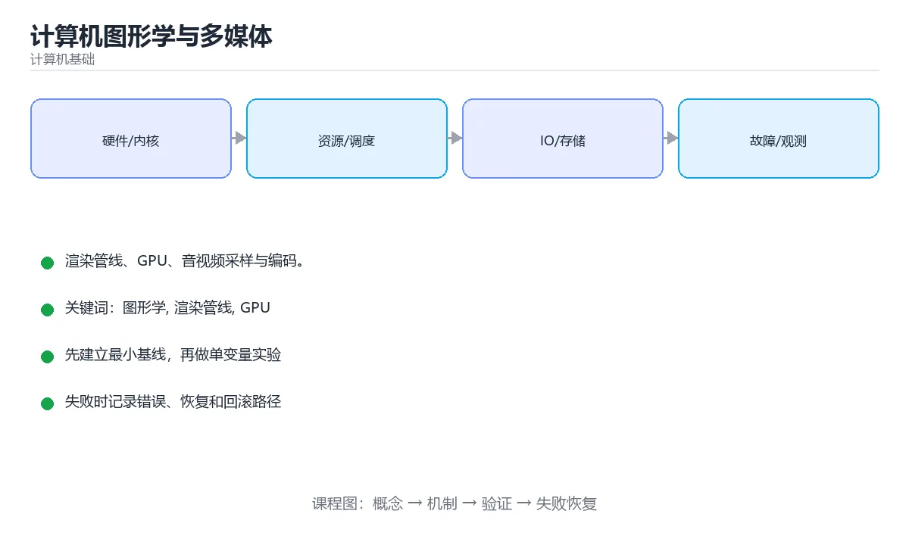

# 计算机图形学与多媒体



> 内容更新时间：2026-10-03 · 学习阶段：高级 · 预计用时：16 分钟

## 学习目标

- 能用自己的话解释「计算机图形学与多媒体」解决了什么问题，而不是只背术语。
- 能说清 「图形学」、「渲染管线」、「GPU」、「音频」 之间的关系，并分别举出一个例子。
- 能把本课知识放回「计算机基础」的知识体系，说明它和相邻主题的边界。
- 能完成本课练习，并用验收标准检查自己的结果。

> 一句话摘要：渲染管线、GPU、音视频采样与编码。

## 前置知识

- 先完成上一课《密码学原语》；如果已经掌握，可以直接用本课练习自测。
- 本课阶段：高级。建议具备同一方向的完整基础，能阅读较长的代码、配置或系统设计说明。
- 开始前先复习：图形学、渲染管线、GPU。
- 如果某一步看不懂，先记录具体卡点，完成练习后再回头读一遍。


## 渲染管线

```text
顶点数据 → 顶点着色器 → 图元装配 → 光栅化 → 片元着色器 → 深度/混合测试 → 帧缓冲
```

1. **顶点着色器**：把顶点从模型空间变换到裁剪空间（模型→世界→视图→投影）。
2. **光栅化**：把三角形转成像素，插值顶点属性（颜色、UV、法线）。
3. **片元着色器**：逐像素计算颜色（光照、纹理采样）。
4. **混合与深度测试**：处理半透明与遮挡关系。

## 关键概念

| 概念 | 说明 |
| --- | --- |
| MVP 矩阵 | 模型、视图、投影三级变换 |
| 光照模型 | Phong/Blinn-Phong、PBR（物理基渲染） |
| 纹理与过滤 | 双线性/三线性、Mipmap 抗锯齿 |
| MSAA / TAA | 硬件多重采样 / 时间抗锯齿 |
| 剔除 | 视锥剔除、背面剔除、遮挡剔除 |
| Draw Call | CPU 提交绘制命令的开销，批处理可减少 |

GPU 的优势是**大规模并行**：成千上万像素同时计算，因此适合着色、矩阵运算与机器学习；瓶颈常在显存带宽与 Draw Call 数量。

## 音频基础

声音是连续波形，数字化需要**采样**（每秒采样次数，常见 44.1kHz/48kHz）与**量化**（位深，16/24 位）。PCM 是未压缩原始数据，体积大；实际使用压缩编码。

| 格式 | 类型 | 特点 |
| --- | --- | --- |
| PCM / WAV | 无损未压缩 | 编辑友好、体积大 |
| FLAC / ALAC | 无损压缩 | 体积约为 PCM 一半 |
| AAC / Opus | 有损压缩 | 流媒体主流，Opus 低延迟 |

## 视频与图像

图像压缩：JPEG（DCT + 量化，有损）、PNG（无损、支持透明）、WebP/AVIF（现代格式，体积更小）。

视频编码利用**空间冗余**（帧内预测）与**时间冗余**（帧间运动补偿）：I 帧（关键帧）、P 帧（前向预测）、B 帧（双向预测）。常见编码 H.264（兼容好）、H.265/HEVC（压缩率高但专利复杂）、AV1（开源免专利，流媒体新宠）。

码率决定画质与带宽：CBR（恒定）适合直播，VBR（可变）适合点播；分辨率、帧率与码率三者需权衡。

## 工程要点

1. 图与视频要做懒加载与占位，避免阻塞首屏。
2. 用分辨率与质量参数按设备能力自适应（避免在低端机解码 4K）。
3. 视频点播用分片 + HLS/DASH，直播用低延迟协议（LL-HLS、WebRTC）。
4. GPU 纹理要按需上传与释放，避免显存泄漏。

## 本课小结
图形学关注「怎么把三维场景画到二维屏幕」，多媒体关注「怎么在有限带宽下表示与压缩音频视频」；两者都是**在保真度与计算/带宽成本之间取舍**。


## 渲染管线速查

| 阶段 | 作用 | 常见优化 |
| --- | --- | --- |
| 应用阶段 | 剔除、LOD、提交绘制调用 | 减少 draw call、批处理 |
| 几何阶段 | 顶点着色、投影、裁剪 | 减少顶点数与过度绘制 |
| 光栅化 | 三角形转像素 | 提高填充率效率 |
| 像素阶段 | 纹理采样、光照、混合 | 降低分辨率或使用 LOD |
| 输出合并 | 深度测试、混合、写帧缓冲 | 减少透明层与带宽占用 |

| 概念 | 说明 |
| --- | --- |
| 帧率与帧时间 | 60 FPS 对应 16.7 ms，30 FPS 对应 33.3 ms |
| 垂直同步 | 避免撕裂，可能引入输入延迟 |
| 双缓冲 / 三缓冲 | 平衡撕裂与延迟 |
| 过度绘制（Overdraw） | 同一像素被多次着色，移动端耗电主因 |
| 抗锯齿 | MSAA 质量好、FXAA 便宜、TAA 时序稳定 |
| 纹理压缩 | 降低带宽与显存，常见 ETC2、ASTC、BC |

## 视频编码速查

| 帧类型 | 说明 |
| --- | --- |
| I 帧 | 关键帧，可独立解码 |
| P 帧 | 前向预测，依赖前面的帧 |
| B 帧 | 双向预测，压缩率最高但延迟大 |

| 概念 | 说明 |
| --- | --- |
| GOP | 两个 I 帧之间的间隔；GOP 越长压缩率越高、随机访问越差 |
| 码率 | 单位时间数据量；CBR 恒定、VBR 可变 |
| CRF | 恒定质量模式，数值越小质量越高 |
| 分辨率与帧率 | 与码率共同决定清晰度与流畅度 |

| 场景 | 推荐 |
| --- | --- |
| 视频点播 | H.264 / H.265，VBR，GOP 适中 |
| 实时互动（会议、云游戏） | 低延迟编码，短 GOP，避免 B 帧 |
| 直播 | H.264 兼容性好，码率自适应 |
| 屏幕内容 | 专用编码或高码率，注意文字锐度 |

```python
def frame_budget_ms(fps: int) -> float:
    """每帧可用时间预算。"""
    return 1000 / fps


def estimate_bitrate(width, height, fps, bits_per_pixel=0.08) -> float:
    """粗略码率估算（Mbps），仅用于量级参考。"""
    return width * height * fps * bits_per_pixel / 1_000_000


def gop_seconds(gop_size: int, fps: int) -> float:
    """GOP 时长：影响随机访问与压缩效率。"""
    return gop_size / fps


print(frame_budget_ms(60))                    # 16.67 ms
print(round(estimate_bitrate(1920, 1080, 30), 1))   # 1080p30 的粗略量级
print(gop_seconds(60, 30))                    # 2 秒
```

## 常见错误对照表

| 容易写错的做法 | 实际现象 | 原因与正确做法 |
| --- | --- | --- |
| 只盯着平均帧率 | 卡顿被掩盖 | 同时看帧时间 P99 与掉帧率 |
| 忽略过度绘制 | 移动端发热降频 | 减少半透明层与重叠 UI |
| 用 CPU 做大量像素运算 | 帧率低、耗电高 | 交给 GPU 或预计算 |
| 大纹理不做压缩 | 显存与带宽吃紧 | 用 ASTC / ETC2 等压缩格式 |
| 每帧重复创建资源 | GC 抖动、掉帧 | 资源复用与对象池 |
| 认为分辨率越高越好 | 性能与功耗恶化 | 按设备分档与动态分辨率 |
| 直播用长 GOP 与 B 帧 | 延迟高、卡顿恢复慢 | 短 GOP、禁用 B 帧 |
| 只提高码率解决模糊 | 带宽压力大 | 先看编码器、分辨率与运动复杂度 |
| 忽略色彩空间与位深 | HDR 内容显示异常 | 全链路统一色彩空间与转码 |
| 忽略音频同步 | 音画不同步 | 用统一时间戳，检查缓冲策略 |

## 自测清单

- [ ] 能说出渲染管线的主要阶段。
- [ ] 知道 60 FPS 的每帧预算是 16.7 ms。
- [ ] 能区分 I / P / B 帧与 GOP 的作用。
- [ ] 知道移动端过度绘制与纹理压缩的重要性。
- [ ] 能按场景（点播、直播、互动）选择编码策略。

## 动手练习


> 本课练习重点：围绕「图形学、渲染管线、GPU」完成复述、实验和交付，每个结果都要能被别人检查。

先用表格或时序图描述机制，再手算一个最小例子，最后用程序验证。

### 练习 1：建立心智模型（10 分钟）

合上教程，用 3～5 句话回答：

1. 「计算机图形学与多媒体」解决了什么问题？
2. 如果没有它，会出现什么具体后果？
3. 它和「渲染管线」是什么关系？

**验收标准**：至少出现一个本课关键词，并写出一个反例、边界条件或失效场景。

### 练习 2：做一次可控实验（20 分钟）

从正文中选一个最小示例，完成以下操作：

1. 先预测修改一个参数、输入或步骤后的结果。
2. 再实际执行或逐步推演，记录真实结果。
3. 如果结果与预测不同，写出差异原因。

**验收标准**：留下「原例 → 改动 → 预测 → 结果 → 原因」五步记录。

### 练习 3：交付一个小结果（30 分钟）

用表格、真值表或计算过程把抽象概念落到一个可核对的结果上。

任务要求：

- 结果必须能被别人检查，不能只写“我已经理解了”。
- 至少覆盖「图形学」和「渲染管线」两个关键词。
- 写出 1 个仍然不确定的问题，以及下一步如何验证。

> 提示：时间有限时优先做练习 1 和练习 2；练习 3 可以拆成两次完成。


## 深入补充：计算机图形学与多媒体

前面已经建立了基本概念。这一节换一个角度，把「计算机图形学与多媒体」放进真实工程里，
重点回答三件事：它为什么存在、内部如何运转、什么时候会失效。

### 一、核心模型

计算机图形学把几何、材质和光照转换为像素，多媒体处理图像、音频和视频；两者都围绕采样、变换、压缩和实时渲染的性能约束展开。

```text
场景/媒体输入 → 几何与像素处理 → 变换与采样 → 光照/滤波/编码 → 渲染或压缩输出 → 显示与传输
```

### 二、关键机制拆解

1. 光栅化把几何图元转换为像素，光线追踪模拟光线传播，两者在质量和性能上取舍。
2. 顶点变换、投影、裁剪和视口映射构成渲染管线的主要阶段。
3. 纹理采样涉及坐标、过滤和 Mipmap，采样不足会产生锯齿，过度过滤会模糊。
4. GPU 通过并行处理大量像素和顶点，瓶颈可能是带宽、填充率或着色器复杂度。
5. 图像压缩利用空间冗余，视频压缩还利用帧间冗余，编码复杂度与画质、码率相关。
6. 音频处理围绕采样率、位深、声道和频域变换展开，延迟是实时应用的关键指标。
7. 色彩空间、伽马校正和 HDR 决定亮度与颜色在不同设备上的呈现。

### 三、对照表：抓住容易混淆的边界

| 维度 | 一侧 | 另一侧 |
| --- | --- | --- |
| 光栅化 | 把图元投影为像素 | 实时性好，难以精确模拟反射 |
| 光线追踪 | 追踪光线求交与着色 | 质量高但计算量大 |
| 有损压缩 | 丢弃人眼不敏感信息 | 码率低但有画质损失 |
| 无损压缩 | 完整保留原始数据 | 体积大但质量不损失 |

### 四、工作示例

游戏画面出现远处纹理闪烁，原因是采样频率不足。开启 Mipmap 和各项异性过滤后，远处纹理使用更低分辨率层级，减少锯齿和带宽消耗。

### 五、常见误区与失效边界

| 错误做法或假设 | 后果 | 正确做法 |
| --- | --- | --- |
| 只追求分辨率不看带宽 | 帧率下降 | 分析填充率、纹理带宽和着色器成本 |
| 忽略伽马校正 | 颜色发灰或过暗 | 在线性空间计算并正确输出 |
| 视频编码参数一刀切 | 画质或体积失控 | 按内容复杂度选择码率和关键帧 |
| 实时音频缓冲区设置不当 | 延迟或爆音 | 平衡缓冲、采样率和调度稳定性 |

### 六、场景推演

移动端视频会议卡顿。排查发现编码分辨率高、码率大且网络抖动。解决方案是动态调整分辨率与码率、启用硬件编码、增加抖动缓冲，并监控端到端延迟。

### 七、自测问答

**Q1：光栅化和光线追踪的核心区别是什么？**

前者逐图元转像素，后者逐光线求交，质量与性能取舍不同。

**Q2：Mipmap 解决什么问题？**

远处纹理采样频率不足导致的锯齿和带宽浪费。

**Q3：视频压缩为什么比图像压缩率高？**

它还能利用相邻帧之间的时间冗余。

**Q4：实时音频最关键的指标是什么？**

端到端延迟、缓冲稳定性和丢包恢复能力。

### 八、小项目：把知识变成可检查的产出

实现一个小型图像处理程序：读取图片，完成缩放、模糊、边缘检测和色彩空间转换；对比不同滤波参数的效果与耗时，并记录内存占用。

### 九、适用边界

图形学与多媒体涉及数学、硬件和编码标准，工程上要优先满足体验指标。算法选择必须结合设备能力、带宽、功耗和实时性。

### 十、完成检查清单

- [ ] 能描述渲染管线主要阶段
- [ ] 能解释采样、过滤和 Mipmap
- [ ] 能比较图像与视频压缩
- [ ] 能分析 GPU 性能瓶颈
- [ ] 能处理实时音视频延迟

### 十一、复习顺序

1. 先不看资料复述“核心模型”，确认能说出它解决的三个问题。
2. 再对照表逐行解释容易混淆的概念，每个概念补一个反例。
3. 跟着工作示例做一遍，改变一个条件并预测结果。
4. 用自测问答检查理解，错题回到对应小节重新阅读。
5. 最后完成小项目，把结果、失败记录和复查清单整理成一份可提交产物。

> 复习不是重读一遍，而是离开原文重新产出：复述、改写、验证、复盘。


## 考点精讲：把测验题还原成判断过程

本课有 6 个判断点。先自己作答，再看「判断依据」；如果结论正确但理由不完整，回到正文对应章节补足概念。

### 考点 1：渲染管线中把三角形转成像素的过程叫？

- **正确判断**：光栅化
- **判断依据**：光栅化确定三角形覆盖哪些像素并插值顶点属性。其他选项：光栅化把三角形转成像素。针对「渲染管线中把三角形转成像素的过程叫，」，本课在「渲染管线」中说明：光栅化：把三角形转成像素，插值顶点属性（颜色、UV、法线）。本课还在「深入补充：计算机图形学与多媒体」中说明：计算机图形学把几何、材质和光照转换为像素，多媒体处理图像、音频和视频。本课还在「深入补充：计算机图形学与多媒体」中说明：图形学与多媒体涉及数学、硬件和编码标准，工程上要优先满足体验指标。
- **迁移检查**：如果给某个错误选项去掉一个限定词，它会不会变成正确？说明理由。

### 考点 2：视频编码中的 I 帧指？

- **正确判断**：帧内编码的关键帧
- **判断依据**：I 帧可独立解码，P/B 帧依赖其他帧做运动补偿。其他选项：I 帧是帧内编码的关键帧，可独立解码。针对「视频编码中的 I 帧指，」，本课在「视频与图像」中说明：视频编码利用空间冗余（帧内预测）与时间冗余（帧间运动补偿）：I 帧（关键帧）、P 帧（前向预测）、B 帧（双向预测）。本课还在「深入补充：计算机图形学与多媒体」中说明：计算机图形学把几何、材质和光照转换为像素，多媒体处理图像、音频和视频。本课还在「深入补充：计算机图形学与多媒体」中说明：图形学与多媒体涉及数学、硬件和编码标准，工程上要优先满足体验指标。
- **迁移检查**：如果给某个错误选项去掉一个限定词，它会不会变成正确？说明理由。

### 考点 3：需要极低延迟的互动场景应优先选？

- **正确判断**：WebRTC
- **判断依据**：WebRTC 基于 UDP，延迟远低于基于分片的 HLS。其他选项：WebRTC 面向低延迟实时互动。针对「需要极低延迟的互动场景应优先选，」，本课在「工程要点」中说明：视频点播用分片 + HLS/DASH，直播用低延迟协议（LL-HLS、WebRTC）。本课还在「本课小结」中说明：图形学关注「怎么把三维场景画到二维屏幕」，多媒体关注「怎么在有限带宽下表示与压缩音频视频」。本课还在「深入补充：计算机图形学与多媒体」中说明：顶点变换、投影、裁剪和视口映射构成渲染管线的主要阶段。
- **迁移检查**：把题干里的一个条件换成边界值，原来的结论还成立吗？写出判断过程。

### 考点 4：Alpha 混合的作用是？

- **正确判断**：按透明通道把前景色与背景色按比例混合
- **判断依据**：正确答案是「按透明通道把前景色与背景色按比例混合」，本课在「视频与图像」中说明：视频编码利用空间冗余（帧内预测）与时间冗余（帧间运动补偿）：I 帧（关键帧）、P 帧（前向预测）、B 帧（双向预测）。Alpha 混合顺序影响结果，半透明渲染通常需要按深度排序或使用预乘 Alpha。本课还在「本课小结」中说明：图形学关注「怎么把三维场景画到二维屏幕」，多媒体关注「怎么在有限带宽下表示与压缩音频视频」。
- **迁移检查**：如果给某个错误选项去掉一个限定词，它会不会变成正确？说明理由。

### 考点 5：色域与位深的区别是？

- **正确判断**：色域决定可表示的颜色范围
- **判断依据**：HDR 需要同时扩大色域、提高位深与亮度范围，三者缺一不可。其他选项：色域决定可表示的颜色范围（渐变是否平滑），两者不能混为一谈。针对「色域与位深的区别是，」，本课在「深入补充：计算机图形学与多媒体」中说明：顶点变换、投影、裁剪和视口映射构成渲染管线的主要阶段。本课还在「深入补充：计算机图形学与多媒体」中说明：色彩空间、伽马校正和 HDR 决定亮度与颜色在不同设备上的呈现。本课还在「渲染管线」中说明：片元着色器：逐像素计算颜色（光照、纹理采样）。
- **迁移检查**：如果给某个错误选项去掉一个限定词，它会不会变成正确？说明理由。

### 考点 6：以下哪些术语与「计算机图形学与多媒体」直接相关？（多选）

- **正确判断**：图形学、渲染管线
- **判断依据**：正确答案是「图形学、渲染管线」，本课在「关键概念」中说明：GPU 的优势是大规模并行：成千上万像素同时计算，因此适合着色、矩阵运算与机器学习。本课还在「视频与图像」中说明：常见编码 H.264（兼容好）、H.265/HEVC（压缩率高但专利复杂）、AV1（开源免专利，流媒体新宠）。本课还在「深入补充：计算机图形学与多媒体」中说明：图像压缩利用空间冗余，视频压缩还利用帧间冗余，编码复杂度与画质、码率相关。
- **迁移检查**：只选其中一项时会漏掉哪个必要条件？把它补进自己的答案。

## 本课复习清单

离开本课前，逐项确认：

- [ ] 不看解析，能说出「渲染管线中把三角形转成像素的过程叫？」的判断依据。
- [ ] 不看解析，能说出「视频编码中的 I 帧指？」的判断依据。
- [ ] 不看解析，能说出「需要极低延迟的互动场景应优先选？」的判断依据。
- [ ] 不看解析，能说出「Alpha 混合的作用是？」的判断依据。
- [ ] 不看解析，能说出「色域与位深的区别是？」的判断依据。
- [ ] 不看解析，能说出「以下哪些术语与「计算机图形学与多媒体」直接相关？（多选）」的判断依据。
- [ ] 至少运行一次本课示例，记录输入、输出和一个边界情况。
- [ ] 把本课最容易混淆的两个概念写成一句话对照。

| 复盘项 | 记录 |
| --- | --- |
| 已经能独立解释的考点 |  |
| 仍然说不清的概念 |  |
| 下一步验证动作 |  |

## English Overview

**Title:** Graphics & Media

**Summary:** Render pipeline, GPU, audio/video sampling and codecs.

**Category:** Fundamentals  
**Level:** 高级  
**Key terms:** 图形学, 渲染管线, GPU, 音频, 视频编码

> The full tutorial is written in Chinese. This bilingual overview helps English readers identify the topic, scope and key terms before studying the detailed examples.

## 内容元数据

- 内容版本：v2.0
- 最后更新：2026-10-03
- 学习阶段：高级
- 适用环境：通用计算机体系结构知识
- 内容来源：内置结构化课程与工程实践整理
- 相关主题：图形学、渲染管线、GPU、音频、视频编码
- 质量版本：P0 测验标准 + P1 覆盖扩展 + P2 体验补全


## 参考资料与复核

- 最后复核：2026-10-04
- 下次复核：2027-04-04
- 复核范围：版本兼容、API 行为、安全建议与工程实践
- 来源性质：官方文档与标准；本课正文为离线教学重组，不复制原文

| 参考资料 | 本课用途 |
| --- | --- |
| [Linux Kernel Docs](https://docs.kernel.org/) | 操作系统与硬件接口 |
| [Arm Architecture](https://developer.arm.com/documentation) | 处理器与内存体系结构 |

> 本课主题：渲染管线、GPU、音视频采样与编码。

> App 完全离线展示文字链接，不会自动联网；需要延伸阅读时可复制链接到浏览器。

