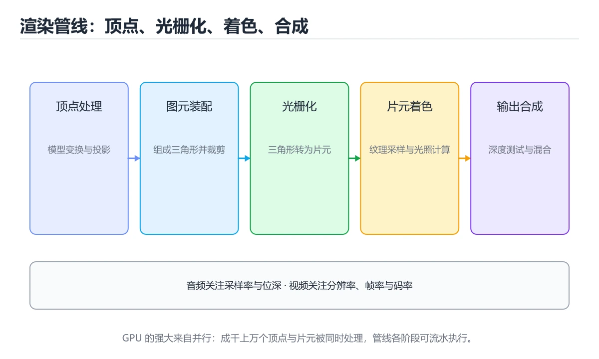

# 计算机图形学与多媒体

> 内容更新时间：2026-10-06 · 学习阶段：高级 · 预计用时：35 分钟




## 学习目标

- 能用自己的话解释计算机图形学与多媒体解决了什么问题，而不是只背术语。
- 能说清 「图形学」、「渲染管线」、「GPU」、「音频」 之间的关系，并分别举出一个例子。
- 能把 图形学 放回「计算机图形学与多媒体」的知识体系，说明它和 渲染管线 的边界。
- 能完成本课练习，并用验收标准检查自己的结果。

> 一句话摘要：渲染管线、GPU、音视频采样与编码。

## 前置知识

- 先完成上一课《密码学原语》；如果已经掌握，可以直接用本课练习自测。
- 开始前先复习：图形学、渲染管线、GPU。
- 看不懂就直接缩小例子：只保留 图形学 相关的两行输入，跑通后再加回其余部分。

## 渲染管线

```text
顶点数据 → 顶点着色器 → 图元装配 → 光栅化 → 片元着色器 → 深度/混合测试 → 帧缓冲
```

1. **顶点着色器**：把顶点从模型空间变换到裁剪空间（模型→世界→视图→投影）。
2. **光栅化**：把三角形转成像素，插值顶点属性（颜色、UV、法线）。
3. **片元着色器**：逐像素计算颜色（光照、纹理采样）。
4. **混合与深度测试**：处理半透明与遮挡关系。

## 关键概念

| 概念 | 说明 |
| --- | --- |
| MVP 矩阵 | 模型、视图、投影三级变换 |
| 光照模型 | Phong/Blinn-Phong、PBR（物理基渲染） |
| 纹理与过滤 | 双线性/三线性、Mipmap 抗锯齿 |
| MSAA / TAA | 硬件多重采样 / 时间抗锯齿 |
| 剔除 | 视锥剔除、背面剔除、遮挡剔除 |
| Draw Call | CPU 提交绘制命令的开销，批处理可减少 |

GPU 的优势是**大规模并行**：成千上万像素同时计算，因此适合着色、矩阵运算与机器学习；瓶颈常在显存带宽与 Draw Call 数量。

## 音频基础

声音是连续波形，数字化需要**采样**（每秒采样次数，常见 44.1kHz/48kHz）与**量化**（位深，16/24 位）。PCM 是未压缩原始数据，体积大；实际使用压缩编码。

| 格式 | 类型 | 特点 |
| --- | --- | --- |
| PCM / WAV | 无损未压缩 | 编辑友好、体积大 |
| FLAC / ALAC | 无损压缩 | 体积约为 PCM 一半 |
| AAC / Opus | 有损压缩 | 流媒体主流，Opus 低延迟 |

## 视频与图像

图像压缩：JPEG（DCT + 量化，有损）、PNG（无损、支持透明）、WebP/AVIF（现代格式，体积更小）。

视频编码利用**空间冗余**（帧内预测）与**时间冗余**（帧间运动补偿）：I 帧（关键帧）、P 帧（前向预测）、B 帧（双向预测）。常见编码 H.264（兼容好）、H.265/HEVC（压缩率高但专利复杂）、AV1（开源免专利，流媒体新宠）。

码率决定画质与带宽：CBR（恒定）适合直播，VBR（可变）适合点播；分辨率、帧率与码率三者需权衡。

## 工程要点

1. 图与视频要做懒加载与占位，避免阻塞首屏。
2. 用分辨率与质量参数按设备能力自适应（避免在低端机解码 4K）。
3. 视频点播用分片 + HLS/DASH，直播用低延迟协议（LL-HLS、WebRTC）。
4. GPU 纹理要按需上传与释放，避免显存泄漏。

## 本课小结

图形学关注「怎么把三维场景画到二维屏幕」，多媒体关注「怎么在有限带宽下表示与压缩音频视频」；两者都是**在保真度与计算/带宽成本之间取舍**。

## 渲染管线速查

| 阶段 | 作用 | 常见优化 |
| --- | --- | --- |
| 应用阶段 | 剔除、LOD、提交绘制调用 | 减少 draw call、批处理 |
| 几何阶段 | 顶点着色、投影、裁剪 | 减少顶点数与过度绘制 |
| 光栅化 | 三角形转像素 | 提高填充率效率 |
| 像素阶段 | 纹理采样、光照、混合 | 降低分辨率或使用 LOD |
| 输出合并 | 深度测试、混合、写帧缓冲 | 减少透明层与带宽占用 |

| 概念 | 说明 |
| --- | --- |
| 帧率与帧时间 | 60 FPS 对应 16.7 ms，30 FPS 对应 33.3 ms |
| 垂直同步 | 避免撕裂，可能引入输入延迟 |
| 双缓冲 / 三缓冲 | 平衡撕裂与延迟 |
| 过度绘制（Overdraw） | 同一像素被多次着色，移动端耗电主因 |
| 抗锯齿 | MSAA 质量好、FXAA 便宜、TAA 时序稳定 |
| 纹理压缩 | 降低带宽与显存，常见 ETC2、ASTC、BC |

## 视频编码速查

| 帧类型 | 说明 |
| --- | --- |
| I 帧 | 关键帧，可独立解码 |
| P 帧 | 前向预测，依赖前面的帧 |
| B 帧 | 双向预测，压缩率最高但延迟大 |

| 概念 | 说明 |
| --- | --- |
| GOP | 两个 I 帧之间的间隔；GOP 越长压缩率越高、随机访问越差 |
| 码率 | 单位时间数据量；CBR 恒定、VBR 可变 |
| CRF | 恒定质量模式，数值越小质量越高 |
| 分辨率与帧率 | 与码率共同决定清晰度与流畅度 |

| 场景 | 推荐 |
| --- | --- |
| 视频点播 | H.264 / H.265，VBR，GOP 适中 |
| 实时互动（会议、云游戏） | 低延迟编码，短 GOP，避免 B 帧 |
| 直播 | H.264 兼容性好，码率自适应 |
| 屏幕内容 | 专用编码或高码率，注意文字锐度 |

```python
def frame_budget_ms(fps: int) -> float:
    """每帧可用时间预算。"""
    return 1000 / fps

def estimate_bitrate(width, height, fps, bits_per_pixel=0.08) -> float:
    """粗略码率估算（Mbps），仅用于量级参考。"""
    return width * height * fps * bits_per_pixel / 1_000_000

def gop_seconds(gop_size: int, fps: int) -> float:
    """GOP 时长：影响随机访问与压缩效率。"""
    return gop_size / fps

print(frame_budget_ms(60))                    # 16.67 ms
print(round(estimate_bitrate(1920, 1080, 30), 1))   # 1080p30 的粗略量级
print(gop_seconds(60, 30))                    # 2 秒
```

## 常见错误与排查

| 容易写错的做法 | 实际现象 | 原因与正确做法 |
| --- | --- | --- |
| 只盯着平均帧率 | 卡顿被掩盖 | 同时看帧时间 P99 与掉帧率 |
| 忽略过度绘制 | 移动端发热降频 | 减少半透明层与重叠 UI |
| 用 CPU 做大量像素运算 | 帧率低、耗电高 | 交给 GPU 或预计算 |
| 大纹理不做压缩 | 显存与带宽吃紧 | 用 ASTC / ETC2 等压缩格式 |
| 每帧重复创建资源 | GC 抖动、掉帧 | 资源复用与对象池 |
| 认为分辨率越高越好 | 性能与功耗恶化 | 按设备分档与动态分辨率 |
| 直播用长 GOP 与 B 帧 | 延迟高、卡顿恢复慢 | 短 GOP、禁用 B 帧 |
| 只提高码率解决模糊 | 带宽压力大 | 先看编码器、分辨率与运动复杂度 |
| 忽略色彩空间与位深 | HDR 内容显示异常 | 全链路统一色彩空间与转码 |
| 忽略音频同步 | 音画不同步 | 用统一时间戳，检查缓冲策略 |

## 复习与自测

- [ ] 能说出渲染管线的主要阶段。
- [ ] 知道 60 FPS 的每帧预算是 16.7 ms。
- [ ] 能区分 I / P / B 帧与 GOP 的作用。
- [ ] 知道移动端过度绘制与纹理压缩的重要性。
- [ ] 能按场景（点播、直播、互动）选择编码策略。

## 动手练习

> 本课练习重点：围绕「图形学、渲染管线、GPU」完成复述、实验和交付，每个结果都要能被别人检查。

先用表格或时序图描述 图形学 的机制，再手算一个最小例子，最后用程序验证。

### 练习 1：建立心智模型（10 分钟）

合上教程，用 3～5 句话回答：

1. 计算机图形学与多媒体解决了什么问题？
2. 如果没有它，会出现什么具体后果？
3. 它和「渲染管线」是什么关系？

验收标准：用自己的话解释 图形学，并给出一个它不成立的反例。

### 练习 2：做一次可控实验（20 分钟）

从正文中选一个最小示例，完成以下操作：

1. 先预测修改一个参数、输入或步骤后的结果。
2. 再实际执行或逐步推演，记录真实结果。
3. 如果结果与预测不同，写出差异原因。

**验收标准**：先原样跑通正文里的 `estimate_bitrate`，再只改图形学相关的输入，按「原例 → 改动 → 预测 → 结果 → 原因」记录；预测必须写在实际运行之前。

### 练习 3：交付一个小结果（30 分钟）

用表格、真值表或计算过程把抽象概念落到一个可核对的结果上。

任务要求：

- 结果必须能被别人检查，不能只写“我已经理解了”。
- 至少覆盖「图形学」和「渲染管线」两个关键词。
- 写出 1 个仍然不确定的问题，以及下一步如何验证。

> 提示：时间有限时优先做练习 1 和练习 2；练习 3 可以拆成两次完成。

## 深入补充：计算机图形学与多媒体

前面已经建立了基本概念。这一节换一个角度，把计算机图形学与多媒体放进真实工程里，
重点回答三件事：estimate_bitrate 解决什么问题、依赖哪些前提、在什么条件下失效。

### 一、核心模型

计算机图形学把几何、材质和光照转换为像素，多媒体处理图像、音频和视频；两者都围绕采样、变换、压缩和实时渲染的性能约束展开。

```text
场景/媒体输入 → 几何与像素处理 → 变换与采样 → 光照/滤波/编码 → 渲染或压缩输出 → 显示与传输
```

### 二、关键机制拆解

1. 光栅化把几何图元转换为像素，光线追踪模拟光线传播，两者在质量和性能上取舍。
2. 顶点变换、投影、裁剪和视口映射构成渲染管线的主要阶段。
3. 纹理采样涉及坐标、过滤和 Mipmap，采样不足会产生锯齿，过度过滤会模糊。
4. GPU 通过并行处理大量像素和顶点，瓶颈可能是带宽、填充率或着色器复杂度。
5. 图像压缩利用空间冗余，视频压缩还利用帧间冗余，编码复杂度与画质、码率相关。
6. 音频处理围绕采样率、位深、声道和频域变换展开，延迟是实时应用的关键指标。
7. 色彩空间、伽马校正和 HDR 决定亮度与颜色在不同设备上的呈现。

### 三、对照表：抓住容易混淆的边界

| 维度 | 一侧 | 另一侧 |
| --- | --- | --- |
| 光栅化 | 把图元投影为像素 | 实时性好，难以精确模拟反射 |
| 光线追踪 | 追踪光线求交与着色 | 质量高但计算量大 |
| 有损压缩 | 丢弃人眼不敏感信息 | 码率低但有画质损失 |
| 无损压缩 | 完整保留原始数据 | 体积大但质量不损失 |

### 四、工作示例

游戏画面出现远处纹理闪烁，原因是采样频率不足。开启 Mipmap 和各项异性过滤后，远处纹理使用更低分辨率层级，减少锯齿和带宽消耗。

### 五、常见误区与失效边界

| 错误做法或假设 | 后果 | 正确做法 |
| --- | --- | --- |
| 只追求分辨率不看带宽 | 帧率下降 | 分析填充率、纹理带宽和着色器成本 |
| 忽略伽马校正 | 颜色发灰或过暗 | 在线性空间计算并正确输出 |
| 视频编码参数一刀切 | 画质或体积失控 | 按内容复杂度选择码率和关键帧 |
| 实时音频缓冲区设置不当 | 延迟或爆音 | 平衡缓冲、采样率和调度稳定性 |

### 六、场景推演

移动端视频会议卡顿。排查发现编码分辨率高、码率大且网络抖动。解决方案是动态调整分辨率与码率、启用硬件编码、增加抖动缓冲，并监控端到端延迟。

### 七、自测问答

**Q1：光栅化和光线追踪的核心区别是什么？**

前者逐图元转像素，后者逐光线求交，质量与性能取舍不同。

**Q2：Mipmap 解决什么问题？**

远处纹理采样频率不足导致的锯齿和带宽浪费。

**Q3：视频压缩为什么比图像压缩率高？**

它还能利用相邻帧之间的时间冗余。

**Q4：实时音频最关键的指标是什么？**

端到端延迟、缓冲稳定性和丢包恢复能力。

### 八、小项目：把知识变成可检查的产出

实现一个小型图像处理程序：读取图片，完成缩放、模糊、边缘检测和色彩空间转换；对比不同滤波参数的效果与耗时，并记录内存占用。

### 九、适用边界

图形学与多媒体涉及数学、硬件和编码标准，工程上要优先满足体验指标。算法选择必须结合设备能力、带宽、功耗和实时性。

### 十、完成检查清单

- [ ] 能描述渲染管线主要阶段
- [ ] 能解释采样、过滤和 Mipmap
- [ ] 能比较图像与视频压缩
- [ ] 能分析 GPU 性能瓶颈
- [ ] 能处理实时音视频延迟

### 十一、复习顺序

1. 不看资料讲清「计算机图形学与多媒体」的核心模型，并各举一个正例和反例。
2. 再对照表逐行解释容易混淆的概念，每个概念补一个反例。
3. 跟着工作示例做一遍，改变一个条件并预测结果。
4. 用自测问答检查理解，错题回到对应小节重新阅读。
5. 最后完成 图形学 的小项目，把结果、失败记录和复查清单整理成可提交产物。

> 复习不是重读一遍，而是离开原文重新产出：复述、改写、验证、复盘。

## 可运行练习

### 任务 1：先跑通，再解释

```python
def frame_budget_ms(fps: int) -> float:
    """每帧可用时间预算。"""
    return 1000 / fps

def estimate_bitrate(width, height, fps, bits_per_pixel=0.08) -> float:
    """粗略码率估算（Mbps），仅用于量级参考。"""
    return width * height * fps * bits_per_pixel / 1_000_000

def gop_seconds(gop_size: int, fps: int) -> float:
    """GOP 时长：影响随机访问与压缩效率。"""
    return gop_size / fps

print(frame_budget_ms(60))                    # 16.67 ms
print(round(estimate_bitrate(1920, 1080, 30), 1))   # 1080p30 的粗略量级
print(gop_seconds(60, 30))                    # 2 秒
```

### 任务 2：只改一个条件

把「计算机图形学与多媒体」的最小示例复制一份，只改一个条件再跑一次：

- 改动点：把 渲染管线 换成边界值，其他输入保持原样。
- 预测：先写下「计算机图形学与多媒体」在改动后的输出或错误信息，再运行。
- 记录：对照改动前后的结果，指出差异出在哪一步。
- 验收：换回原条件能复现原结果，改动只影响图形学。

### 任务 3：迁移到自己的数据

换一个 渲染管线 场景重做一次，确认结论不是只对示例数据成立。

## 故障现场

### 现场 1：忽略过度绘制

**症状**：在《计算机图形学与多媒体》的复现场景中，移动端发热降频。

**根因**：当出现“忽略过度绘制”时，执行路径已经绕过了《计算机图形学与多媒体》的关键约束，最终以“移动端发热降频”暴露出来；修复前必须先确认约束在哪里失效。

**修复**：针对《计算机图形学与多媒体》的问题，减少半透明层与重叠 UI。

**验证**：先在《计算机图形学与多媒体》中记录“忽略过度绘制”留下的失败证据，再执行“减少半透明层与重叠 UI”并重放；确认错误路径变为明确结果，且修复没有掩盖同类故障。

### 现场 2：用 CPU 做大量像素运算

**症状**：在《计算机图形学与多媒体》的复现场景中，帧率低、耗电高。

**根因**：触发点是把“用 CPU 做大量像素运算”当成安全做法。它没有满足《计算机图形学与多媒体》要求的前提，因此先表现为“帧率低、耗电高”；排查时先完整复现这一段，再核对输入、配置与依赖。

**修复**：针对《计算机图形学与多媒体》的问题，交给 GPU 或预计算。

**验证**：在《计算机图形学与多媒体》中按“交给 GPU 或预计算”调整后，从“用 CPU 做大量像素运算”的触发条件重放同一条路径，确认“帧率低、耗电高”不再出现，并补一个相邻边界用例检查没有引入新问题。

### 现场 3：大纹理不做压缩

**症状**：在《计算机图形学与多媒体》的复现场景中，显存与带宽吃紧。

**根因**：“显存与带宽吃紧”只是表层结果。向上追溯会落到“大纹理不做压缩”这一步，因为它省略了《计算机图形学与多媒体》的约束，使实现行为和预期模型发生了偏离。

**修复**：针对《计算机图形学与多媒体》的问题，用 ASTC / ETC2 等压缩格式。

**验证**：保留《计算机图形学与多媒体》里触发“显存与带宽吃紧”的输入、版本和日志，按“用 ASTC / ETC2 等压缩格式”完成修改后原样重放；只有失败现象消失且相邻场景仍可解释，才保留改动。

## 本课复习清单

离开本课前，逐项确认：

- [ ] 不看解析，能说出「渲染管线中把三角形转成像素的过程叫？」的判断依据。
- [ ] 不看解析，能说出「视频编码中的 I 帧指？」的判断依据。
- [ ] 不看解析，能说出「需要极低延迟的互动场景应优先选？」的判断依据。
- [ ] 不看解析，能说出「Alpha 混合的作用是？」的判断依据。
- [ ] 不看解析，能说出「色域与位深的区别是？」的判断依据。
- [ ] 跑通「计算机图形学与多媒体」的最小示例，并记录一次失败输入的处理方式。
- [ ] 把本课最容易混淆的两个概念写成一句话对照。

| 复盘项 | 记录 |
| --- | --- |
| 已经能独立解释的考点 |  |
| 仍然说不清的概念 |  |
| 下一步验证动作 |  |

## 术语速查

| 术语 | 一句话说明 |
| --- | --- |
| `图形学` | 计算机图形学把几何、材质和光照转换为像素，多媒体处理图像、音频和视频。 |
| `渲染管线` | 光栅化：把三角形转成像素，插值顶点属性（颜色、UV、法线）。 |
| `GPU` | GPU 的优势是大规模并行：成千上万像素同时计算，因此适合着色、矩阵运算与机器学习；瓶颈常在显存带宽与 Draw Call 数量。 |
| `音频` | 按时间采样的声音信号，处理时关注采样率、声道和编码格式。 |
| `视频编码` | 压缩视频帧与运动信息，在体积、画质和解码成本间取舍。 |
| `过度绘制` | 同一像素被多次着色，浪费填充带宽 |

## 考点精讲

### 考点 1：概念判断·图形学

- **题目**：渲染管线中把三角形转成像素的过程叫？
- **判断依据**：光栅化确定三角形覆盖哪些像素并插值顶点属性。作答时，先用图形学建立输入与输出的基线，再把光栅化代入边界条件核对，结论才能复现。“渲染管线中把三角形转成像素的过程叫”与「计算机图形学与多媒体」的术语表相呼应，只有符合图形学、渲染管线、GPU约束的“光栅化”才是正文支持的结论。

### 考点 2：代码补全·图形学

- **题目**：阅读「计算机图形学与多媒体」正文里的这段 Python 代码，下面哪一项判断是正确的？
- **判断依据**：在「计算机图形学与多媒体」里，题干的正确项是这段代码把主要逻辑封装在函数或方法里，需要被调用才会执行，在「计算机图形学与多媒体」里封装边界决定图形学从哪一步开始生效。把输入或边界换成空值、极值或失败情况后，结论要以「计算机图形学与多媒体」的实际运行结果为准。回到「计算机图形学与多媒体」的正文示例，用“阅读计算机图形学与多媒体正文里的这段”走一遍图形学、渲染管线、GPU的完整流程，能复现的结论才可以保留。

### 考点 3：顺序排列·图形学

- **题目**：按“计算机图形学与多媒体”中 图形学、渲染管线、GPU 的实践顺序，把四个步骤排成从准备到复盘的合理顺序。
- **判断依据**：在「计算机图形学与多媒体」里，在本课的练习里，顺序应当是：先明确 图形学 的输入、输出与约束 → 写出最小示例并核对 渲染管线 的基线结果 → 只改一个变量，记录边界与失败路径的变化 → 固定版本与证据，把本课的结论写成可复现记录。这个顺序把 图形学 的输入、输出和约束放在最前面，在计算机图形学与多媒体里避免概念没对齐就开始调参。第二步用 渲染管线 建立可核对的基线，在计算机图形学与多媒体里第三步才允许改变一个变量并观察失败路径。

### 考点 4：概念判断·图形学

- **题目**：Alpha 混合的作用是？
- **判断依据**：在「计算机图形学与多媒体」里，结论应落在「按透明通道把前景色与背景色按比例混合」。Alpha 混合顺序影响结果，半透明渲染通常需要按深度排序或使用预乘 Alpha。在「计算机图形学与多媒体」里，这道题要求区分概念与边界，「按透明通道把前景色与背景色按比例混合」只有在题干给出的前提下才成立，而「生成动画关键帧，需要额外的验证与维护」、「压缩图像体积」缺少同一组条件。

### 考点 5：概念判断·图形学

- **题目**：色域与位深的区别是？
- **判断依据**：HDR 需要同时扩大色域、提高位深与亮度范围，三者缺一不可。在「计算机图形学与多媒体」里，其他选项：色域决定可表示的颜色范围（渐变是否平滑），两者不能混为一谈。把“色域决定可表示的颜色范围”代回「计算机图形学与多媒体」里“色域与位深的区别是”的例子核对，条件一旦改变，结论就要用图形学、渲染管线、GPU重新推导。

### 考点 6：多选辨析·图形学

- **题目**：以下哪些术语与「计算机图形学与多媒体」直接相关？（多选）
- **判断依据**：渲染管线是否完整覆盖题干的输入、输出和失败路径，并排除图形学、Flutter这类相邻概念。这道题的关键在「计算机图形学与多媒体」的图形学、渲染管线、GPU：先确认题干“以下哪些术语与计算机图形学与多媒体直”问的是哪一步，再排除偷换前提的选项。把“图形学”代回「计算机图形学与多媒体」里“以下哪些术语与直接相关（多选）”的例子核对，条件一旦改变，结论就要用图形学、渲染管线、GPU重新推导。

## English Overview

**Title:** Graphics & Media

**Summary:** Render pipeline, GPU, audio/video sampling and codecs.

**Category:** Fundamentals
**Level:** 高级
**Key terms:** 图形学, 渲染管线, GPU, 音频, 视频编码

## 内容元数据

- 内容版本：v2.0
- 最后更新：2026-10-06
- 学习阶段：高级
- 适用环境：通用计算机体系结构知识；本课聚焦 图形学。
- 内容来源：内置结构化课程与工程实践整理
- 相关主题：图形学、渲染管线、GPU、音频、视频编码
- 质量版本：P0 测验标准 + P1 覆盖扩展 + P2 体验补全

## 参考资料与复核

- 最后复核：2026-10-04
- 下次复核：2027-03-24
- 复核范围：版本兼容、API 行为、安全建议与工程实践
- 来源性质：官方文档、标准或权威教材；正文为离线教学重组

| 参考资料 | 本课用途 |
| --- | --- |
| [MDN 计算机基础](https://developer.mozilla.org/docs/Learn_web_development/Core) | Web 相关计算机基础 |
| [NIST 二进制与数据表示](https://www.nist.gov/pml/owm/binary-information) | 二进制、位与数据单位 |
| [Intel 开发者文档](https://www.intel.com/content/www/us/en/developer/articles/technical/intel-sdm.html) | x86 指令集与体系结构 |

> 「计算机图形学与多媒体」的链接用于离线阅读后的延伸核对；App 不会自动联网。

<!-- p1-deep-dive:start -->
## 深挖「图形学」的边界与代价

这一章只用「计算机图形学与多媒体」自己的正文、代码和测验题，把图形学推到边界再看一遍：先确认它在什么条件下成立，再估计代价，最后给出可复现的证据。

### 一、图形学 的关键句与适用条件

| 正文出处 | 原句 | 用之前先确认 |
| --- | --- | --- |
| 关键概念 | GPU 的优势是大规模并行：成千上万像素同时计算，因此适合着色、矩阵运算与机器学习； | 把 GPU 换成边界值时，这一步是否仍然成立 |
| 视频与图像 | 视频编码利用空间冗余（帧内预测）与时间冗余（帧间运动补偿）：I 帧（关键帧）、P 帧（前向预测）、B 帧（双向预测）。 | 把 视频编码 换成边界值时，这一步是否仍然成立 |
| 工程要点 | GPU 纹理要按需上传与释放，避免显存泄漏。 | 把 GPU 换成边界值时，这一步是否仍然成立 |
| 一、核心模型 | 计算机图形学把几何、材质和光照转换为像素，多媒体处理图像、音频和视频； | 把 图形学 换成边界值时，这一步是否仍然成立 |
| 二、关键机制拆解 | 顶点变换、投影、裁剪和视口映射构成渲染管线的主要阶段。 | 把 渲染管线 换成边界值时，这一步是否仍然成立 |

读这张表时不要只记结论：每一句都要问「把图形学换成边界值还成立吗」。如果第二列的原句里已经写明前提，第三列就写成「前提不变」；如果原句省略了前提，第三列必须补出来。

### 二、把 计算机图形学与多媒体 推到边界

下面是本课第一段代码（text），先原样运行一次作为基线：

```text
顶点数据 → 顶点着色器 → 图元装配 → 光栅化 → 片元着色器 → 深度/混合测试 → 帧缓冲
```

| 变式 | 怎么改 | 先写下什么 | 观察点 |
| --- | --- | --- | --- |
| 边界输入 | 把 计算机图形学与多媒体 的输入换成空值或最大值 | 预测输出 | 是否报错、是否静默返回 |
| 只改一处 | 把 计算机图形学与多媒体 的一个参数改成另一档 | 预测差异来源 | 输出变化能否用本课结论解释 |
| 去掉一步 | 注释掉 计算机图形学与多媒体 之后的一行 | 预测哪一步先失败 | 错误位置是否与预期一致 |

三次实验都要保留「原例 → 改动 → 预测 → 结果 → 原因」五步记录；其中「原因」必须引用「计算机图形学与多媒体」正文里的结论，而不是只写「正常」或「报错」。

### 三、「图形学」的代价怎么量

| 观察项 | 怎么测 | 结论怎么写 |
| --- | --- | --- |
| 时间 | 把 图形学 的输入规模翻倍，记录耗时变化 | 写出增长是线性、对数还是常数，并给出实测数据 |
| 空间 | 记录 渲染管线 占用的内存或存储峰值 | 说明峰值出现在哪一步，以及能否提前释放 |
| 可读性 | 统计完成同一件事需要多少行代码或多少步操作 | 用具体行数代替「更简洁」这类主观描述 |
| 失败代价 | 触发一次失败，记录恢复所需步骤 | 写清失败后是否有残留状态、如何回滚 |

如果在「计算机图形学与多媒体」里量不出上表的任何一项，说明实验还停留在阅读层面：先把输入规模翻倍，再回来填表。

### 四、测验复盘

| 题号 | 正确答案 | 最容易选错的干扰项 | 复盘动作 |
| --- | --- | --- | --- |
| 1 | 光栅化 | 顶点着色 | 把干扰项改写成一句反例，再说明它违反本课哪条前提 |
| 2 | 这段代码把主要逻辑封装在函数或方法里，需要被调用才会执行。 | 这段代码包含循环结构，同一段逻辑会被重复执行。 | 把干扰项改写成一句反例，再说明它违反本课哪条前提 |
| 3 | 写出最小示例并核对 渲染管线 的基线结果 | 只改一个变量，记录边界与失败路径的变化 | 把干扰项改写成一句反例，再说明它违反本课哪条前提 |
| 4 | 按透明通道把前景色与背景色按比例混合 | 生成动画关键帧（仅部分场景成立） | 把干扰项改写成一句反例，再说明它违反本课哪条前提 |
| 5 | 色域决定可表示的颜色范围 | 位深决定屏幕亮度 | 把干扰项改写成一句反例，再说明它违反本课哪条前提 |
| 6 | 图形学 | Flutter | 把干扰项改写成一句反例，再说明它违反本课哪条前提 |

复盘「计算机图形学与多媒体」时只写「我记住了」没有意义：每个错误选项都要能对应到本课的一条前提，写完后再回到第一节的关键句表核对一次。

### 五、离开本课前的自检

- [ ] 能用一句话说明 图形学 解决什么问题、在什么条件下失效。
- [ ] 能指出 渲染管线 与相邻概念的分工，并各举一个反例。
- [ ] 能在不看解析的情况下重做本课测验，并解释计算机图形学与多媒体中每个错误选项。
- [ ] 能按第二节的表格完成至少两次 图形学 实验，并留下命令与输出。
- [ ] 能写出「计算机图形学与多媒体」的三条结论，每条都配一个适用边界。

全部勾选后，再去做「计算机图形学与多媒体」的测验与练习；只要有一项答不上来，就回到对应小节补一次实验，而不是先背结论。
<!-- p1-deep-dive:end -->

