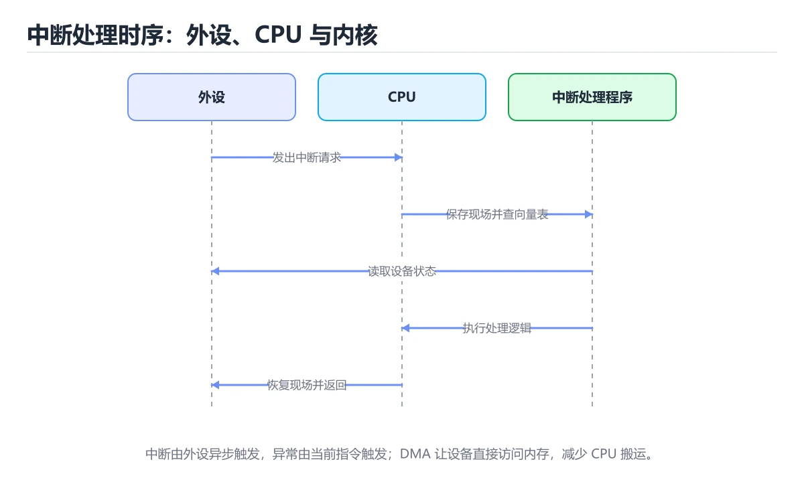

# 中断、异常与 DMA

> 内容更新时间：2026-10-06 · 学习阶段：进阶 · 预计用时：30 分钟




## 学习目标

- 能用自己的话解释中断、异常与 DMA解决了什么问题，而不是只背术语。
- 能说清 「中断」、「异常」、「ISR」、「下半部」 之间的关系，并分别举出一个例子。
- 能把 中断 放回「中断、异常与 DMA」的知识体系，说明它和 异常 的边界。
- 能完成本课练习，并用验收标准检查自己的结果。

> 一句话摘要：三类打断、中断处理流程、下半部与 IOMMU。

## 前置知识

- 先完成上一课《总线与 I/O 设备》；如果已经掌握，可以直接用本课练习自测。
- 本课阶段：进阶。建议先完成「总线与 I/O 设备」，或确认自己能独立跑通正文里的 InterruptHandler 示例。
- 开始前先复习：中断、异常、ISR。
- 看不懂就直接缩小例子：只保留 中断 相关的两行输入，跑通后再加回其余部分。

## 三类「打断」

| 类型 | 来源 | 例子 |
| --- | --- | --- |
| 硬件中断 | 外部设备 | 网卡收包、键盘按键、定时器 |
| 软件中断 | 指令触发 | 系统调用（int 0x80 / syscall） |
| 异常 | CPU 执行指令出错 | 缺页、除零、非法指令 |

异常又分故障（可恢复，如缺页）、陷阱（有意触发，如断点）与中止（不可恢复）。

## 处理流程

```text
设备置位中断请求 → 中断控制器仲裁 → CPU 保存现场 → 查中断向量表
→ 执行中断服务程序（ISR）→ 清中断 → 恢复现场 → 返回被中断指令
```

要点：中断需要**屏蔽与优先级**机制（可屏蔽/不可屏蔽中断），支持嵌套时要小心栈与重入；下半部机制（softirq、tasklet、工作队列）把耗时工作推迟到中断关闭之后执行。

## 上下文切换成本

中断并不等于进程切换：快速路径只保存/恢复寄存器。但中断过于频繁会导致「活锁」——CPU 全在处理中断，正常任务得不到执行，解决方案是中断合并（NAPI 轮询混合、批处理）与亲和性绑定。

## DMA 工作方式

```text
1. CPU 配置 DMA 控制器：源地址、目的地址、长度、方向
2. 设备与内存直接传输，CPU 继续执行其他任务
3. 传输完成，DMA 触发中断通知 CPU
```

优势是免去 CPU 逐字节搬运；风险是恶意/错误设备可读写任意物理内存，因此现代系统引入 **IOMMU** 做地址翻译与隔离，虚拟化场景尤为关键。

## 与性能的关系

高频小包场景下，中断开销可能超过数据搬运本身。常见优化：增大批处理、使用轮询模式（DPDK）、把中断绑定到固定核心、把 DMA 缓冲区做对齐以避免伪共享。

## 本课小结

中断是「事件驱动」的硬件基础：**设备异步通知、CPU 快速响应、重活交给下半部或 DMA**。理解它才能解释高并发网络与存储的性能特征。

## 中断与异常速查

| 类型 | 来源 | 同步性 | 例子 |
| --- | --- | --- | --- |
| 故障（Fault） | 当前指令 | 同步 | 缺页、除零 |
| 陷阱（Trap） | 当前指令 | 同步 | 系统调用、断点 |
| 中止（Abort） | 严重错误 | 同步 | 硬件校验错误 |
| 可屏蔽中断 | 外部设备 | 异步 | 网卡收包、定时器 |
| 不可屏蔽中断 | 严重硬件事件 | 异步 | 内存校验错误、看门狗 |

| 概念 | 说明 |
| --- | --- |
| 中断向量表 | 中断号到处理函数的映射 |
| 上下文保存 | 保存寄存器与程序计数器 |
| 中断延迟 | 从设备发出到开始处理的时间 |
| 中断嵌套 | 高优先级中断打断低优先级 |
| 下半部 | 把耗时工作推迟到中断之外 |
| 软中断 / tasklet / 工作队列 | Linux 中的下半部机制 |
| 中断亲和性 | 把中断绑定到指定 CPU，提升缓存命中 |
| IOMMU | 为设备 DMA 提供地址转换与隔离 |

```python
import queue
import threading
import time

class InterruptHandler:
    """模拟「上半部 + 下半部」：中断处理只做最小工作，其余交给工作线程。"""

    def __init__(self):
        self.queue: queue.Queue = queue.Queue()
        self.worker = threading.Thread(target=self._bottom_half, daemon=True)
        self.events = 0

    def start(self):
        self.worker.start()

    def top_half(self, device_event):
        """上半部：必须极快，只记录事件并排队。"""
        self.events += 1
        self.queue.put(device_event)

    def _bottom_half(self):
        while True:
            event = self.queue.get()
            try:
                self._handle(event)        # 耗时处理放在这里
            finally:
                self.queue.task_done()

    @staticmethod
    def _handle(event):
        time.sleep(0.001)

def page_fault_reason(flags: dict) -> str:
    """缺页的两类原因：页不在内存，或权限不符。"""
    if not flags.get("present"):
        return "页不在物理内存，需要从磁盘调入"
    if flags.get("write") and not flags.get("writable"):
        return "写权限不足，可能是写时复制或段错误"
    return "其他原因"

handler = InterruptHandler()
handler.start()
handler.top_half({"device": "eth0", "bytes": 1500})
print(page_fault_reason({"present": False}))
```

## 常见错误与排查

| 容易写错的做法 | 实际现象 | 原因与正确做法 |
| --- | --- | --- |
| 在中断上半部做耗时工作 | 中断被长时间屏蔽，丢包卡顿 | 只做最小工作，其余交给下半部 |
| 中断上下文中睡眠 | 内核崩溃或警告 | 下半部或工作队列才能睡眠 |
| 忘记保存与恢复上下文 | 返回后寄存器错乱 | 由内核按 ABI 保存与恢复 |
| 认为中断一定会立即处理 | 延迟被低估 | 存在屏蔽、优先级与排队延迟 |
| 忽略中断风暴 | CPU 全被中断占用 | 合并中断、限速或改轮询 |
| 把所有中断绑到同一个 CPU | 单核瓶颈 | 配置中断亲和性分散 |
| 缺页当成崩溃 | 排查方向错误 | 缺页是正常机制，多数可恢复 |
| 认为 DMA 不需要 IOMMU | 设备可访问任意内存 | IOMMU 提供隔离与保护 |
| 忘记处理中断中的错误状态 | 设备卡死 | 读取并清除设备状态寄存器 |
| 用关中断保护所有临界区 | 延迟变差 | 只在极短临界区关中断 |

## 复习与自测

- [ ] 能区分故障、陷阱、中止与外部中断。
- [ ] 知道中断上半部必须极短，耗时工作放下半部。
- [ ] 明白中断上下文不能睡眠。
- [ ] 知道缺页的两类原因及处理差异。
- [ ] 会用中断亲和性与 IOMMU 优化与隔离。

## 动手练习

> 本课练习重点：围绕「中断、异常、ISR」完成复述、实验和交付，每个结果都要能被别人检查。

把 三类「打断」 的机制画成图，再用最小数据验证其中一个结论。

### 练习 1：建立心智模型（10 分钟）

合上教程，用 3～5 句话回答：

1. 中断、异常与 DMA解决了什么问题？
2. 如果没有它，会出现什么具体后果？
3. 它和「异常」是什么关系？

验收标准：回答里必须出现 中断，并写出一个让结论失效的边界条件。

### 练习 2：做一次可控实验（20 分钟）

从正文中选一个最小示例，完成以下操作：

1. 先预测修改一个参数、输入或步骤后的结果。
2. 再实际执行或逐步推演，记录真实结果。
3. 如果结果与预测不同，写出差异原因。

**验收标准**：五步记录要写进笔记——原例是 InterruptHandler，改动落在中断上，结论必须能被他人在同一环境里复现。

### 练习 3：交付一个小结果（30 分钟）

用表格、真值表或计算过程把抽象概念落到一个可核对的结果上。

任务要求：

- 结果必须能被别人检查，不能只写“我已经理解了”。
- 至少覆盖「中断」和「异常」两个关键词。
- 写出 1 个仍然不确定的问题，以及下一步如何验证。

> 提示：时间有限时优先做练习 1 和练习 2；练习 3 可以拆成两次完成。

## 深入补充：中断、异常与 DMA

前面已经建立了基本概念。这一节换一个角度，把中断、异常与 DMA放进真实工程里，
重点回答三件事：三类「打断」 的机制、代价与边界。

### 一、核心模型

中断和异常让 CPU 暂停当前流程去处理紧急事件；DMA 让设备直接搬运数据。三者共同构成操作系统响应外部世界、处理错误和提升 I/O 效率的基础。

```text
事件发生 → 硬件保存现场 → 查中断向量 → 进入处理程序 → 处理/延迟处理 → 恢复现场 → 返回原流程
```

### 二、关键机制拆解

1. 中断通常来自外部设备，异常来自 CPU 内部指令执行，如缺页、除零和非法指令。
2. 中断向量表保存处理程序入口，硬件根据向量号跳转，软件负责保存完整上下文。
3. 可屏蔽中断可以暂时关闭，不可屏蔽中断通常用于严重硬件故障。
4. 中断上半部要尽量短，把耗时工作放到下半部、软中断或工作队列。
5. DMA 让设备直接读写内存，减少 CPU 拷贝次数，但需要缓冲区管理和缓存一致性处理。
6. 缺页异常把虚拟页映射到物理页，是虚拟内存按需加载的核心机制。
7. 中断优先级、嵌套和竞争会带来复杂同步问题，处理程序必须可重入且不能长时间阻塞。

### 三、对照表：抓住容易混淆的边界

| 维度 | 一侧 | 另一侧 |
| --- | --- | --- |
| 中断 | 外部设备异步触发 | 处理 I/O 和定时事件 |
| 异常 | CPU 执行指令同步触发 | 处理错误、缺页和系统调用 |
| 轮询 | CPU 主动检查状态 | 实现简单但浪费 CPU |
| DMA | 设备直接搬运内存 | 减少 CPU 拷贝但需一致性管理 |

### 四、工作示例

网卡收到数据包后触发中断，上半部只记录状态并把数据包加入队列，协议栈处理放在软中断中完成。若把解析全部放在上半部，长时间关闭中断会导致丢包和系统卡顿。

### 五、常见误区与失效边界

| 错误做法或假设 | 后果 | 正确做法 |
| --- | --- | --- |
| 在中断上下文执行耗时操作 | 系统响应变慢甚至丢事件 | 只做最短必要工作并延后处理 |
| 忘记保存和恢复现场 | 返回后程序状态错乱 | 由硬件和内核协作保存完整上下文 |
| DMA 缓冲区被提前释放 | 设备写入已释放内存 | 明确生命周期并使用安全分配器 |
| 把缺页当纯错误 | 无法理解虚拟内存性能 | 区分正常按需分页和非法访问 |

### 六、场景推演

高频采集系统每个样本都触发中断，CPU 全部耗在上下文切换。改为 DMA 环形缓冲加批量中断后，CPU 占用下降、吞吐提升；同时在缓冲区满之前及时回收描述符，避免丢数据。

### 七、自测问答

**Q1：中断和异常有什么区别？**

中断多由外部设备触发，异常由 CPU 执行指令时同步触发。

**Q2：为什么中断处理要短？**

长时间占用会阻塞其他中断和任务，影响系统响应。

**Q3：缺页异常一定是错误吗？**

不一定，按需分页的正常缺页是虚拟内存机制的一部分。

**Q4：DMA 解决了什么问题？**

让设备直接搬运数据，减少 CPU 逐字拷贝的开销。

### 八、小项目：把知识变成可检查的产出

设计一个模拟中断处理流程：事件源、向量表、上半部、下半部和 DMA 缓冲区；分别测试每事件一次中断与批量中断的 CPU 占用和吞吐。

### 九、适用边界

中断、异常和 DMA 是底层机制，不替代设备协议和应用逻辑。排查性能问题时，要先确认瓶颈在设备、驱动、调度还是应用层。

### 十、完成检查清单

- [ ] 能区分中断、异常和系统调用
- [ ] 能描述中断处理的完整流程
- [ ] 能说明上半部与下半部的分工
- [ ] 能解释 DMA 与缓存一致性
- [ ] 能设计一个批量中断的 I/O 方案

### 十一、复习顺序

1. 不看资料讲清「中断、异常与 DMA」的核心模型，并各举一个正例和反例。
2. 再对照表逐行解释容易混淆的概念，每个概念补一个反例。
3. 跟着工作示例做一遍，改变一个条件并预测结果。
4. 用自测问答检查理解，错题回到对应小节重新阅读。
5. 把 异常 的实现、测试与复盘整理成一份可提交的产物。

> 复习不是重读一遍，而是离开原文重新产出：复述、改写、验证、复盘。

## 可运行练习

### 任务 1：先跑通，再解释

```python
import queue
import threading
import time

class InterruptHandler:
    """模拟「上半部 + 下半部」：中断处理只做最小工作，其余交给工作线程。"""

    def __init__(self):
        self.queue: queue.Queue = queue.Queue()
        self.worker = threading.Thread(target=self._bottom_half, daemon=True)
        self.events = 0

    def start(self):
        self.worker.start()

    def top_half(self, device_event):
        """上半部：必须极快，只记录事件并排队。"""
        self.events += 1
        self.queue.put(device_event)

    def _bottom_half(self):
        while True:
            event = self.queue.get()
            try:
                self._handle(event)        # 耗时处理放在这里
            finally:
                self.queue.task_done()

    @staticmethod
    def _handle(event):
        time.sleep(0.001)

def page_fault_reason(flags: dict) -> str:
    """缺页的两类原因：页不在内存，或权限不符。"""
    if not flags.get("present"):
        return "页不在物理内存，需要从磁盘调入"
    if flags.get("write") and not flags.get("writable"):
        return "写权限不足，可能是写时复制或段错误"
    return "其他原因"

handler = InterruptHandler()
handler.start()
handler.top_half({"device": "eth0", "bytes": 1500})
print(page_fault_reason({"present": False}))
```

### 任务 2：只改一个条件

把「中断、异常与 DMA」的最小示例复制一份，只改一个条件再跑一次：

- 改动点：只调整 InterruptHandler 的一个参数，其余条件一律不动。
- 预测：先写下「中断、异常与 DMA」在改动后的输出或错误信息，再运行。
- 记录：对照改动前后的结果，指出差异出在哪一步。
- 验收：换回原条件能复现原结果，改动只影响中断。

### 任务 3：迁移到自己的数据

把 InterruptHandler 换成你自己的输入，先保持步骤不变，再比较输出差异。

## 故障现场

### 现场 1：在中断上半部做耗时工作

**症状**：在《中断、异常与 DMA》的复现场景中，中断被长时间屏蔽，丢包卡顿。

**根因**：当出现“在中断上半部做耗时工作”时，执行路径已经绕过了《中断、异常与 DMA》的关键约束，最终以“中断被长时间屏蔽，丢包卡顿”暴露出来；修复前必须先确认约束在哪里失效。

**修复**：针对《中断、异常与 DMA》的问题，只做最小工作，其余交给下半部。

**验证**：先在《中断、异常与 DMA》中记录“在中断上半部做耗时工作”留下的失败证据，再执行“只做最小工作，其余交给下半部”并重放；确认错误路径变为明确结果，且修复没有掩盖同类故障。

### 现场 2：中断上下文中睡眠

**症状**：在《中断、异常与 DMA》的复现场景中，内核崩溃或警告。

**根因**：当出现“中断上下文中睡眠”时，执行路径已经绕过了《中断、异常与 DMA》的关键约束，最终以“内核崩溃或警告”暴露出来；修复前必须先确认约束在哪里失效。

**修复**：针对《中断、异常与 DMA》的问题，下半部或工作队列才能睡眠。

**验证**：先在《中断、异常与 DMA》中记录“中断上下文中睡眠”留下的失败证据，再执行“下半部或工作队列才能睡眠”并重放；确认错误路径变为明确结果，且修复没有掩盖同类故障。

### 现场 3：忘记保存与恢复上下文

**症状**：在《中断、异常与 DMA》的复现场景中，返回后寄存器错乱。

**根因**：触发点是把“忘记保存与恢复上下文”当成安全做法。它没有满足《中断、异常与 DMA》要求的前提，因此先表现为“返回后寄存器错乱”；排查时先完整复现这一段，再核对输入、配置与依赖。

**修复**：针对《中断、异常与 DMA》的问题，由内核按 ABI 保存与恢复。

**验证**：保留《中断、异常与 DMA》里触发“返回后寄存器错乱”的输入、版本和日志，按“由内核按 ABI 保存与恢复”完成修改后原样重放；只有失败现象消失且相邻场景仍可解释，才保留改动。

## 本课复习清单

离开本课前，逐项确认：

- [ ] 不看解析，能说出「缺页（page fault）属于哪一类？」的判断依据。
- [ ] 不看解析，能说出「中断下半部（softirq/tasklet）的目的是？」的判断依据。
- [ ] 不看解析，能说出「IOMMU 的主要作用是？」的判断依据。
- [ ] 不看解析，能说出「异常与中断的根本区别是？」的判断依据。
- [ ] 不看解析，能说出「中断上下文中不能做的事情是？」的判断依据。
- [ ] 至少运行一次 InterruptHandler 的示例，记录输入、输出和 中断 的边界情况。
- [ ] 把本课最容易混淆的两个概念写成一句话对照。

| 复盘项 | 记录 |
| --- | --- |
| 已经能独立解释的考点 |  |
| 仍然说不清的概念 |  |
| 下一步验证动作 |  |

## 术语速查

| 术语 | 一句话说明 |
| --- | --- |
| `中断` | 中断是「事件驱动」的硬件基础：设备异步通知、CPU 快速响应、重活交给下半部或 DMA。 |
| `异常` | 程序执行中偏离正常控制流的错误事件，需要捕获、传播或转换。 |
| `ISR` | 中断服务程序，在硬件中断发生后尽快完成关键处理并返回。 |
| `下半部` | Linux 中断处理中延后执行耗时工作的机制，如软中断和任务队列。 |
| `IOMMU` | 优势是免去 CPU 逐字节搬运；风险是恶意/错误设备可读写任意物理内存，因此现代系统引入 IOMMU 做地址翻译与隔离，虚拟化场景尤为关键。 |
| `上下文切换` | CPU 核心数有限，操作系统通过时间片轮转让多个线程「同时」运行。切换时需要保存和恢复寄存器、程序计数器等状态 |

## 考点精讲

### 考点 1：顺序排列·中断

- **题目**：按“中断、异常与 DMA”中 中断、异常、ISR 的实践顺序，把四个步骤排成从准备到复盘的合理顺序。
- **判断依据**：在「中断、异常与 DMA」里，在本课的练习里，顺序应当是：先明确 中断 的输入、输出与约束 → 写出最小示例并核对 异常 的基线结果 → 只改一个变量，记录边界与失败路径的变化 → 固定版本与证据，把本课的结论写成可复现记录。这个顺序把 中断 的输入、输出和约束放在最前面，在中断、异常与 DMA里避免概念没对齐就开始调参。第二步用 异常 建立可核对的基线，在中断、异常与 DMA里第三步才允许改变一个变量并观察失败路径。

### 考点 2：概念判断·中断

- **题目**：「中断、异常与 DMA」的核心结论是什么？
- **判断依据**：题干的正确项是中断，异常与 DMA：三类打断，中断处理流程。在「中断、异常与 DMA」里，把中断、异常、ISR放进最小示例验证，换成空值或极值后结论仍要成立。在「中断、异常与 DMA」里判断这道题，要把中断、异常、ISR的条件、过程与失败路径逐项对齐，换成“中断、异常与 DMA的核心结论是什么”这个场景，只有满足前提的结论才成立。

### 考点 3：概念判断·中断

- **题目**：IOMMU 的主要作用是？
- **判断依据**：它限制设备只能访问被授权的内存区域，虚拟化场景尤为重要。在「中断、异常与 DMA」里，其他选项：IOMMU 为设备做地址翻译与内存隔离，防止设备越界访问。在「中断、异常与 DMA」里，如果只凭关键词作答，很容易把「只用来加密网络流量，但这会放大延迟」、「管理电源」与「为设备做地址翻译与内存隔离」混在一起；

### 考点 4：概念判断·中断

- **题目**：异常与中断的根本区别是？
- **判断依据**：在「中断、异常与 DMA」里，作答时，先用中断建立输入与输出的基线，再把异常由当前指令执行引起（同步）代入边界条件核对，结论才能复现。在「中断、异常与 DMA」里，这道题要求区分概念与边界，「异常由当前指令执行引起（同步）」只有在题干给出的前提下才成立，而「两者都必须由内核处理，但这会引入新的复杂度」、「异常来自外部设备」缺少同一组条件。

### 考点 5：概念判断·中断

- **题目**：中断上下文中不能做的事情是？
- **判断依据**：在「中断、异常与 DMA」里，睡眠或阻塞。中断上下文没有可调度的任务上下文，所以耗时工作要交给下半部或工作队列。回到「中断、异常与 DMA」的正文示例，用“中断上下文中不能做的事情是”走一遍中断、异常、ISR的完整流程，能复现的结论才可以保留。

### 考点 6：多选辨析·中断

- **题目**：以下哪些术语与「中断、异常与 DMA」直接相关？（多选）
- **判断依据**：异常是否完整覆盖题干的输入、输出和失败路径，并排除中断、向量检索这类相邻概念。在「中断、异常与 DMA」里判断这道题，要把中断、异常、ISR的条件、过程与失败路径逐项对齐，换成“以下哪些术语与中断、异常与 DMA直”这个场景，只有满足前提的结论才成立。

## English Overview

**Title:** Interrupts & Exceptions

**Summary:** Interrupt types, handling flow, bottom halves and IOMMU.

**Category:** Fundamentals
**Level:** 进阶
**Key terms:** 中断, 异常, ISR, 下半部, IOMMU

## 内容元数据

- 内容版本：v2.0
- 最后更新：2026-10-06
- 学习阶段：进阶
- 适用环境：通用计算机体系结构知识；本课聚焦 中断。
- 内容来源：内置结构化课程与工程实践整理
- 相关主题：中断、异常、ISR、下半部、IOMMU
- 质量版本：P0 测验标准 + P1 覆盖扩展 + P2 体验补全

## 参考资料与复核

- 最后复核：2026-10-04
- 下次复核：2027-03-24
- 复核范围：版本兼容、API 行为、安全建议与工程实践
- 来源性质：官方文档、标准或权威教材；正文为离线教学重组

| 参考资料 | 本课用途 |
| --- | --- |
| [CS50 计算机科学导论](https://cs50.harvard.edu/x/) | 计算机科学综合入门 |
| [MIT 6.006 算法导论](https://ocw.mit.edu/courses/6-006-introduction-to-algorithms-spring-2020/) | 算法与数据结构基础 |
| [Nand2Tetris](https://www.nand2tetris.org/) | 从逻辑门到计算机系统 |

> 「中断、异常与 DMA」的链接用于离线阅读后的延伸核对；App 不会自动联网。

