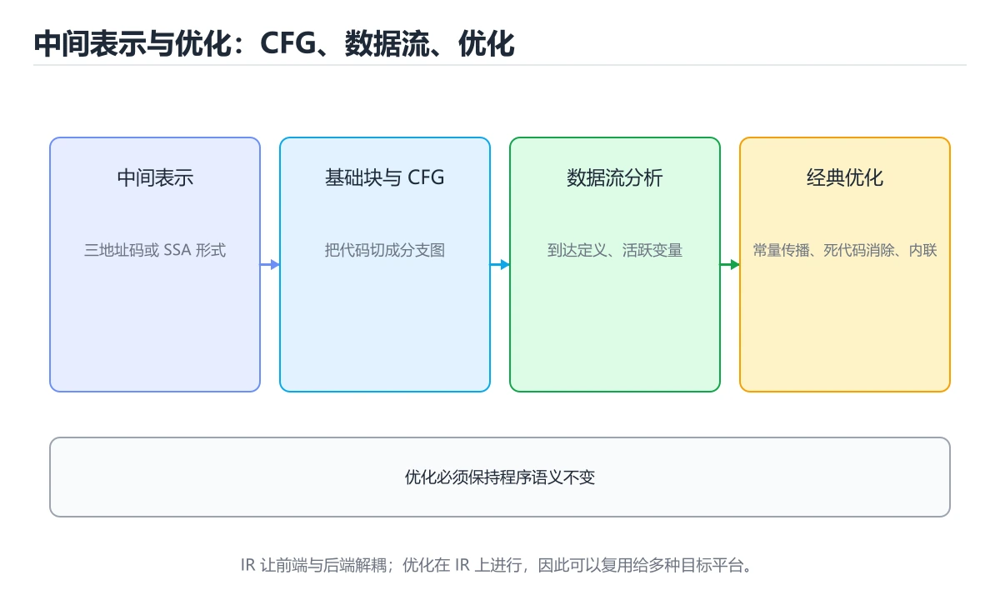
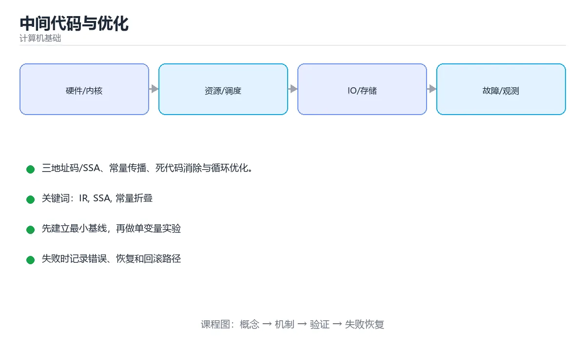

# 中间代码与优化





> 内容更新时间：2026-10-06 · 学习阶段：进阶 · 预计用时：35 分钟

## 学习目标

- 能用自己的话解释中间代码与优化解决了什么问题，而不是只背术语。
- 能说清 「IR」、「SSA」、「常量折叠」、「死代码」 之间的关系，并分别举出一个例子。
- 能把 IR 放回「中间代码与优化」的知识体系，说明它和 SSA 的边界。
- 能完成本课练习，并用验收标准检查自己的结果。

> 一句话摘要：三地址码/SSA、常量传播、死代码消除与循环优化。

## 前置知识

- 先完成上一课《语义分析与符号表》；如果已经掌握，可以直接用本课练习自测。
- 本课阶段：进阶。建议先完成「语义分析与符号表」，或确认自己能独立跑通正文里的 visit_BinOp 示例。
- 开始前先复习：IR、SSA、常量折叠。
- 如果 为什么需要中间表示（IR） 这一步看不懂，先记录具体卡点，再用 visit_BinOp 复现一遍。

## 为什么需要中间表示（IR）

IR 是介于源码与机器码之间的抽象形式，让优化只写一遍就能服务所有前端与后端。常见形态：

| IR | 特点 |
| --- | --- |
| 三地址码 | 每条指令最多一个运算，接近汇编但无寄存器细节 |
| 抽象语法树 | 保留结构信息，适合高层优化 |
| SSA（静态单赋值） | 每个变量只被赋值一次，数据流分析极其方便 |
| 控制流图 CFG | 基本块 + 跳转边，是大多数优化的载体 |

## 基础块与数据流分析

把代码切成基本块（入口出口唯一、内部无跳转），再用数据流分析回答问题：某个变量在此处是否活跃？这个常量能否传播到这里？这段代码是否可达？

## 经典优化

| 优化 | 做法 | 收益 |
| --- | --- | --- |
| 常量折叠与传播 | 编译期算出 `2*3` 并用 6 替换 | 减少运行期计算 |
| 死代码消除 | 删除结果从未被使用的计算 | 减小体积 |
| 公共子表达式消除 | 重复计算只算一次 | 减少重复工作 |
| 循环不变量外提 | 把循环内不变的计算移到循环外 | 显著提速 |
| 强度削减 | `x*2` 换成 `x<<1`、把乘法变累加 | 降低指令代价 |
| 函数内联 | 把小函数展开到调用点 | 为后续优化开路 |
| 尾调用优化 | 复用栈帧 | 支持深递归 |

## 优化必须保持语义

前提是程序**没有未定义行为**：一旦存在 UB（越界、有符号溢出），编译器可以基于「不会发生 UB」的假设做优化，产生与直觉不符的结果。这也是 C/C++ 中「优化后行为变了」的根源。

## 优化级别

`-O0` 不优化（便于调试）、`-O1/-O2` 常规优化（生产常用）、`-O3` 激进优化（向量化、循环展开）、`-Os` 优化体积。**优化会改变指令与行号的对应关系**，因此线上崩溃分析常需要保留调试符号或用 `-O2 -g` 组合。

## 本课小结

优化的本质是**在保持语义的前提下减少工作量**：数据流分析提供事实，SSA 简化表示，各类变换负责改写代码。

## 中间表示速查

| IR 形式 | 特点 | 用途 |
| --- | --- | --- |
| 三地址码 | 每条指令最多一个运算 | 教学与基础优化 |
| SSA | 每个变量只赋值一次 | 现代编译器主流 |
| 控制流图（CFG） | 基本块 + 边 | 数据流分析与优化 |
| 有向无环图（DAG） | 复用公共子表达式 | 局部优化 |
| 字节码 | 面向虚拟机 | Java、Python、C# |

## 常用优化速查

| 优化 | 说明 | 前提 |
| --- | --- | --- |
| 常量折叠 | `3 * 4` 直接算成 12 | 编译期可求值 |
| 常量传播 | 把已知常量代入后续使用 | 数据流分析支持 |
| 公共子表达式消除 | 相同表达式只算一次 | 中间无副作用 |
| 死代码消除 | 删除不影响结果的代码 | 可观察行为不变 |
| 循环不变式外提 | 循环内不变的计算移到外面 | 无副作用、循环必达 |
| 强度削弱 | 乘法换成移位或加法 | 语义等价 |
| 内联 | 把函数体展开 | 权衡代码体积 |
| 循环展开 | 减少循环开销 | 增加代码体积 |
| 向量化 | 用 SIMD 批量处理 | 数据连续且无依赖 |
| 尾调用优化 | 复用栈帧 | 尾位置调用 |

```python
import ast

class ConstantFolder(ast.NodeTransformer):
    """极简常量折叠：把字面量的二元运算在编译期算好。"""

    def visit_BinOp(self, node):
        self.generic_visit(node)
        left, right = node.left, node.right
        if isinstance(left, ast.Constant) and isinstance(right, ast.Constant):
            try:
                value = eval(compile(ast.Expression(node), "<const>", "eval"))
            except Exception:
                return node
            return ast.copy_location(ast.Constant(value=value), node)
        return node

source = "result = 3 * 4 + 2"
tree = ConstantFolder().visit(ast.parse(source))
ast.fix_missing_locations(tree)
print(ast.unparse(tree))          # result = 14
```

## 常见错误与排查

| 容易写错的做法 | 实际现象 | 原因与正确做法 |
| --- | --- | --- |
| 忽略副作用就做消除 | 程序行为改变 | 只有无副作用且结果未被使用的代码才能删 |
| 存在未定义行为仍激进优化 | 结果与预期完全不符 | 先消除 UB，再谈优化 |
| 不做别名分析就重排访存 | 读写顺序被破坏 | 需要别名分析确认安全 |
| 浮点优化假设结合律 | 结果精度变化 | 浮点不满足结合律，需要 `-ffast-math` 才允许 |
| 认为 SSA 只能表示标量 | 无法表达数组与内存 | 内存可用 SSA 形式 + 别名分析表达 |
| 优化改变异常语义 | 异常抛出时机变化 | 保持可观察行为（含异常与日志） |
| 只做局部优化 | 收益有限 | 配合过程间优化（内联、IPA） |
| 忽略代码体积 | 指令缓存命中率下降 | 权衡性能与体积 |
| 手工优化替代编译器 | 收益小且易错 | 先写清晰代码，再依赖剖析数据 |
| 不看优化日志就断言 | 优化假设错误 | 用 `-O -R`、LLVM 优化记录验证 |

## 复习与自测

- [ ] 能说出三地址码与 SSA 的区别。
- [ ] 能列举五种以上常见优化及其前提。
- [ ] 知道未定义行为会让优化结果不可预期。
- [ ] 明白浮点不满足结合律。
- [ ] 优化以「不改变可观察行为」为底线。

## 补充：SSA、循环优化与优化级别的取舍

### IR 的三种常见形态

| 形态 | 特点 | 典型用途 |
| --- | --- | --- |
| 三地址码 | 每条指令一个运算，结构简单 | 教学与基础优化 |
| SSA | 每个变量只赋值一次，带 φ 函数 | 现代编译器主力形式 |
| 控制流图 CFG | 基本块 + 跳转边 | 数据流分析与循环优化 |

```text
一段分支代码的 SSA 形式

原始代码
  if (cond) x = 1; else x = 2;
  use(x);

SSA 形式（φ 表示「依控制流从哪个分支来选哪个值」）
  if (cond) goto L1; else goto L2;
  L1: x1 = 1; goto L3;
  L2: x2 = 2; goto L3;
  L3: x3 = φ(x1, x2);
      use(x3);
```

**为什么要 φ**：SSA 要求每个变量只定义一次，分支汇合点必须显式表示
「值从哪里来」，这样后续分析不必再做复杂的到达定值计算。

### 六种优化的前后对比

```text
① 常量折叠与传播
   const int N = 4; int a[N * 2];
   → int a[8];

② 公共子表达式消除
   x = (a + b) * c; y = (a + b) / c;
   → t = a + b; x = t * c; y = t / c;

③ 死代码消除
   int unused = compute();   // compute 无副作用
   → 整行删除

④ 循环不变量外提
   for (i...) { sum += a[i] * len; }      // len 不变
   → const L = len; for (i...) { sum += a[i] * L; }

⑤ 强度削减
   for (i...) { x = i * 4; }
   → for (i...) { x += 4; }                // 乘法换成加法

⑥ 内联
   int getX() { return _x; }
   obj.getX() * 2  → obj._x * 2
```

### 循环优化为何最重要

```text
经验规律：程序 90% 的时间花在 10% 的循环上

因此编译器在循环上投入的优化最多：
  · 循环展开：减少循环控制开销，增加指令级并行
  · 循环融合/分裂：改善缓存局部性
  · 循环交换：让内存访问更连续（矩阵遍历的经典优化）
  · 向量化：一次处理多个数据（SIMD），-O3 常见

矩阵遍历示例（行优先存储）
  for i: for j: sum += m[i][j]     ← 连续访问，快
  for j: for i: sum += m[i][j]     ← 跨行跳跃，慢（可能差数倍）
```

### 优化级别与「未定义行为」的坑

| 级别 | 会做的事 | 风险 |
| --- | --- | --- |
| `-O0` | 不做优化，便于调试 | 性能差 |
| `-O1` | 基础优化，编译快 | 少 |
| `-O2` | 绝大多数安全优化 | 少（仍可能暴露 UB） |
| `-O3` | 激进向量化与展开 | 代码膨胀、可能暴露 UB |
| `-Ofast` | 放宽浮点语义 | **数值结果可能变化** |

```text
UB（未定义行为）为什么危险
  编译器假设 UB 不会发生，据此做优化。
  例：有符号溢出是 UB → 编译器可能认为「i + 1 > i 恒成立」，
      从而删掉本该存在的边界检查。

实践建议
  · 用 -fsanitize=undefined 在测试时捕获 UB
  · 浮点敏感场景不用 -Ofast，改用 -O2
  · 关键代码对比不同优化级别的输出，确认结果一致
```

### 怎么观察优化是否生效

```bash
# C/C++：输出汇编或 IR 对比
g++ -O0 -S demo.cpp -o demo_O0.s
g++ -O2 -S demo.cpp -o demo_O2.s
diff demo_O0.s demo_O2.s | head -40

# LLVM：看优化后的 IR
clang -O2 -S -emit-llvm demo.cpp -o demo.ll

# Rust：直接看 MIR 与汇编
cargo rustc --release -- --emit asm

# Java：JIT 打印内联与编译决策
java -XX:+PrintCompilation -XX:+UnlockDiagnosticVMOptions -XX:+PrintInlining App
```

### 自查清单

- [ ] 能说出 SSA 与 φ 函数的作用
- [ ] 能举出四种优化并写出前后对比
- [ ] 知道为什么会话循环是优化重点
- [ ] 理解 UB 如何导致「反直觉」的优化结果
- [ ] 会用 `-S` 或 IR 输出验证优化是否生效

## 动手练习

> 本课练习重点：围绕「IR、SSA、常量折叠」完成复述、实验和交付，每个结果都要能被别人检查。

先用表格或时序图描述 IR 的机制，再手算一个最小例子，最后用程序验证。

### 练习 1：建立心智模型（10 分钟）

合上教程，用 3～5 句话回答：

1. 中间代码与优化解决了什么问题？
2. 如果没有它，会出现什么具体后果？
3. 它和「SSA」是什么关系？

验收标准：用自己的话解释 IR，并给出一个它不成立的反例。

### 练习 2：做一次可控实验（20 分钟）

从正文中选一个最小示例，完成以下操作：

1. 先预测修改一个参数、输入或步骤后的结果。
2. 再实际执行或逐步推演，记录真实结果。
3. 如果结果与预测不同，写出差异原因。

**验收标准**：五步记录要写进笔记——原例是 visit_BinOp，改动落在IR上，结论必须能被他人在同一环境里复现。

### 练习 3：交付一个小结果（30 分钟）

用表格、真值表或计算过程把抽象概念落到一个可核对的结果上。

任务要求：

- 结果必须能被别人检查，不能只写“我已经理解了”。
- 至少覆盖「IR」和「SSA」两个关键词。
- 写出 1 个仍然不确定的问题，以及下一步如何验证。

> 提示：时间有限时优先做练习 1 和练习 2；练习 3 可以拆成两次完成。

## 可运行练习

### 任务 1：先跑通，再解释

```python
import ast

class ConstantFolder(ast.NodeTransformer):
    """极简常量折叠：把字面量的二元运算在编译期算好。"""

    def visit_BinOp(self, node):
        self.generic_visit(node)
        left, right = node.left, node.right
        if isinstance(left, ast.Constant) and isinstance(right, ast.Constant):
            try:
                value = eval(compile(ast.Expression(node), "<const>", "eval"))
            except Exception:
                return node
            return ast.copy_location(ast.Constant(value=value), node)
        return node

source = "result = 3 * 4 + 2"
tree = ConstantFolder().visit(ast.parse(source))
ast.fix_missing_locations(tree)
print(ast.unparse(tree))          # result = 14
```

### 任务 2：只改一个条件

把「中间代码与优化」的最小示例复制一份，只改一个条件再跑一次：

- 改动点：只调整 visit_BinOp 的一个参数，其余条件一律不动。
- 预测：先写下「中间代码与优化」在改动后的输出或错误信息，再运行。
- 记录：对照改动前后的结果，指出差异出在哪一步。
- 验收：换回原条件能复现原结果，改动只影响IR。

### 任务 3：迁移到自己的数据

把 visit_BinOp 换成你自己的输入，先保持步骤不变，再比较输出差异。

## 故障现场

### 现场 1：忽略副作用就做消除

**症状**：在《中间代码与优化》的复现场景中，程序行为改变。

**根因**：“程序行为改变”只是表层结果。向上追溯会落到“忽略副作用就做消除”这一步，因为它省略了《中间代码与优化》的约束，使实现行为和预期模型发生了偏离。

**修复**：针对《中间代码与优化》的问题，只有无副作用且结果未被使用的代码才能删。

**验证**：在《中间代码与优化》中按“只有无副作用且结果未被使用的代码才能删”调整后，从“忽略副作用就做消除”的触发条件重放同一条路径，确认“程序行为改变”不再出现，并补一个相邻边界用例检查没有引入新问题。

### 现场 2：存在未定义行为仍激进优化

**症状**：在《中间代码与优化》的复现场景中，结果与预期完全不符。

**根因**：“结果与预期完全不符”只是表层结果。向上追溯会落到“存在未定义行为仍激进优化”这一步，因为它省略了《中间代码与优化》的约束，使实现行为和预期模型发生了偏离。

**修复**：针对《中间代码与优化》的问题，先消除 UB，再谈优化。

**验证**：在《中间代码与优化》中按“先消除 UB，再谈优化”调整后，从“存在未定义行为仍激进优化”的触发条件重放同一条路径，确认“结果与预期完全不符”不再出现，并补一个相邻边界用例检查没有引入新问题。

### 现场 3：不做别名分析就重排访存

**症状**：在《中间代码与优化》的复现场景中，读写顺序被破坏。

**根因**：当出现“不做别名分析就重排访存”时，执行路径已经绕过了《中间代码与优化》的关键约束，最终以“读写顺序被破坏”暴露出来；修复前必须先确认约束在哪里失效。

**修复**：针对《中间代码与优化》的问题，需要别名分析确认安全。

**验证**：先在《中间代码与优化》中记录“不做别名分析就重排访存”留下的失败证据，再执行“需要别名分析确认安全”并重放；确认错误路径变为明确结果，且修复没有掩盖同类故障。

## 本课复习清单

离开本课前，逐项确认：

- [ ] 不看解析，能说出「SSA（静态单赋值）的特点是？」的判断依据。
- [ ] 不看解析，能说出「常量折叠指的是？」的判断依据。
- [ ] 不看解析，能说出「程序中存在未定义行为（UB）时，优化可能？」的判断依据。
- [ ] 不看解析，能说出「死代码消除（DCE）的判断依据是？」的判断依据。
- [ ] 不看解析，能说出「循环不变式外提（LICM）的收益是？」的判断依据。
- [ ] 至少运行一次 visit_BinOp 的示例，记录输入、输出和 IR 的边界情况。
- [ ] 把本课最容易混淆的两个概念写成一句话对照。

| 复盘项 | 记录 |
| --- | --- |
| 已经能独立解释的考点 |  |
| 仍然说不清的概念 |  |
| 下一步验证动作 |  |

## 术语速查

把「中间代码与优化」里反复出现的术语集中放在一起。复习时先遮住右列，尝试用自己的话解释，再回到正文核对。

| 术语 | 一句话说明 |
| --- | --- |
| `IR` | IR 是介于源码与机器码之间的抽象形式，让优化只写一遍就能服务所有前端与后端。常见形态。 |
| `SSA` | 静态单赋值中间表示，每个变量只被赋值一次，便于数据流分析。 |
| `常量折叠` | 编译期直接算出常量表达式的值，用结果替换表达式以减少运行开销。 |
| `死代码` | 永远不会被执行或结果永远用不到的代码，删除或证明其不可达可减少维护成本。 |
| `循环优化` | 减少循环内重复计算、提升数据局部性或展开迭代以降低开销。 |

## 考点精讲

### 考点 1：代码补全·IR

- **题目**：这段代码是「中间代码与优化」的示例片段，下面哪一项描述与它一致？
- **判断依据**：在「中间代码与优化」里，题干的正确项是这段代码只做静态声明，没有循环、分支或可观察输出，在「中间代码与优化」里它只能证明IR相关约束存在，不能替代真实运行证据。把输入或边界换成空值、极值或失败情况后，结论要以「中间代码与优化」的实际运行结果为准。把“这段代码只做静态声明，没有循环”代回「中间代码与优化」里“这段代码是中间代码与优化的示例片段”的例子核对，条件一旦改变，结论就要用IR、SSA、常量折叠重新推导。

### 考点 2：顺序排列·IR

- **题目**：按“中间代码与优化”中 IR、SSA、常量折叠 的实践顺序，把四个步骤排成从准备到复盘的合理顺序。
- **判断依据**：在「中间代码与优化」里，在本课的练习里，顺序应当是：先明确 IR 的输入、输出与约束 → 写出最小示例并核对 SSA 的基线结果 → 只改一个变量，记录边界与失败路径的变化 → 固定版本与证据，把本课的结论写成可复现记录。这个顺序把 IR 的输入、输出和约束放在最前面，在中间代码与优化里避免概念没对齐就开始调参。第二步用 SSA 建立可核对的基线，在中间代码与优化里第三步才允许改变一个变量并观察失败路径。

### 考点 3：概念判断·IR

- **题目**：程序中存在未定义行为（UB）时，优化可能？
- **判断依据**：这是 C/C++ 中「开优化后行为变了」的根源。在「中间代码与优化」里，如果只凭关键词作答，很容易把「一定报错」、「关闭所有优化」与「基于「UB 不会发生」的假设」混在一起。在「中间代码与优化」里，如果只凭关键词作答，很容易把「一定报错」、「关闭所有优化」与「基于「UB 不会发生」的假设」混在一起；

### 考点 4：概念判断·IR

- **题目**：死代码消除（DCE）的判断依据是？
- **判断依据**：在「中间代码与优化」里，结论应落在「计算结果不影响程序可观察行为的代码可以删除」。「可观察行为」包括输出、IO 与副作用，编译器只能在此基础上保守优化。在「中间代码与优化」里，这道题要求区分概念与边界，「计算结果不影响程序可观察行为的代码可以删除」只有在题干给出的前提下才成立，而「没有被函数调用的变量声明」、「注释太少的代码」缺少同一组条件。

### 考点 5：概念判断·IR

- **题目**：循环不变式外提（LICM）的收益是？
- **判断依据**：在「中间代码与优化」里，把循环内每次结果都不变的计算移到循环外，减少重复执行。LICM 要求证明该计算无副作用且循环一定会执行到对应位置。回到「中间代码与优化」的正文示例，用“循环不变式外提（LICM）的收益是”走一遍IR、SSA、常量折叠的完整流程，能复现的结论才可以保留。

### 考点 6：多选辨析·IR

- **题目**：以下哪些术语与「中间代码与优化」直接相关？（多选）
- **判断依据**：SSA是否完整覆盖题干的输入、输出和失败路径，并排除IR、分布式这类相邻概念。SSA」是否完整覆盖题干的输入、输出和失败路径，并排除「IR」、「分布式」这类相邻概念。「中间代码与优化」要求先交代IR、SSA、常量折叠的前提再下结论，所以“IR”只在题干“以下哪些术语与中间代码与优化直接相关”给定的条件下成立。

## English Overview

**Title:** IR & Optimizations

**Summary:** Three-address code, SSA and classic optimizations.

**Category:** Fundamentals
**Level:** 进阶
**Key terms:** IR, SSA, 常量折叠, 死代码, 循环优化

## 内容元数据

- 内容版本：v2.0
- 最后更新：2026-10-06
- 学习阶段：进阶
- 适用环境：通用计算机体系结构知识；本课聚焦 IR。
- 内容来源：内置结构化课程与工程实践整理
- 相关主题：IR、SSA、常量折叠、死代码、循环优化
- 质量版本：P0 测验标准 + P1 覆盖扩展 + P2 体验补全

## 参考资料与复核

- 最后复核：2026-10-04
- 下次复核：2027-10-17
- 复核范围：版本兼容、API 行为、安全建议与工程实践
- 来源性质：官方文档、标准或权威教材；正文为离线教学重组

| 参考资料 | 本课用途 |
| --- | --- |
| [CS50 计算机科学导论](https://cs50.harvard.edu/x/) | 计算机科学综合入门 |
| [MIT 6.004 计算结构](https://ocw.mit.edu/courses/6-004-computation-structures-spring-2017/) | 数字逻辑、ISA 与计算机组织 |
| [MIT 6.033 计算机系统工程](https://ocw.mit.edu/courses/6-033-computer-system-engineering-spring-2018/) | 系统设计与并发 |

> 「中间代码与优化」的链接用于离线阅读后的延伸核对；App 不会自动联网。

<!-- p1-deep-dive:start -->
## 深挖「IR」的边界与代价

这一章只用「中间代码与优化」自己的正文、代码和测验题，把IR推到边界再看一遍：先确认它在什么条件下成立，再估计代价，最后给出可复现的证据。

### 一、IR 的关键句与适用条件

| 正文出处 | 原句 | 用之前先确认 |
| --- | --- | --- |
| 为什么需要中间表示（IR） | IR 是介于源码与机器码之间的抽象形式，让优化只写一遍就能服务所有前端与后端。 | 把 IR 换成边界值时，这一步是否仍然成立 |

读这张表时不要只记结论：每一句都要问「把IR换成边界值还成立吗」。如果第二列的原句里已经写明前提，第三列就写成「前提不变」；如果原句省略了前提，第三列必须补出来。

### 二、把 visit_BinOp 推到边界

下面是本课第一段代码（python），先原样运行一次作为基线：

```python
import ast
class ConstantFolder(ast.NodeTransformer):
    """极简常量折叠：把字面量的二元运算在编译期算好。"""
    def visit_BinOp(self, node):
        self.generic_visit(node)
        left, right = node.left, node.right
        if isinstance(left, ast.Constant) and isinstance(right, ast.Constant):
            try:
                value = eval(compile(ast.Expression(node), "<const>", "eval"))
            except Exception:
                return node
            return ast.copy_location(ast.Constant(value=value), node)
        return node
source = "result = 3 * 4 + 2"
tree = ConstantFolder().visit(ast.parse(source))
ast.fix_missing_locations(tree)
print(ast.unparse(tree))          # result = 14
```

| 变式 | 怎么改 | 先写下什么 | 观察点 |
| --- | --- | --- | --- |
| 边界输入 | 把 visit_BinOp 的输入换成空值或最大值 | 预测输出 | 是否报错、是否静默返回 |
| 只改一处 | 把 ConstantFolder 的一个参数改成另一档 | 预测差异来源 | 输出变化能否用本课结论解释 |
| 去掉一步 | 注释掉 visit_BinOp 之后的一行 | 预测哪一步先失败 | 错误位置是否与预期一致 |

三次实验都要保留「原例 → 改动 → 预测 → 结果 → 原因」五步记录；其中「原因」必须引用「中间代码与优化」正文里的结论，而不是只写「正常」或「报错」。

### 三、「IR」的代价怎么量

| 观察项 | 怎么测 | 结论怎么写 |
| --- | --- | --- |
| 时间 | 把 IR 的输入规模翻倍，记录耗时变化 | 写出增长是线性、对数还是常数，并给出实测数据 |
| 空间 | 记录 SSA 占用的内存或存储峰值 | 说明峰值出现在哪一步，以及能否提前释放 |
| 可读性 | 统计完成同一件事需要多少行代码或多少步操作 | 用具体行数代替「更简洁」这类主观描述 |
| 失败代价 | 触发一次失败，记录恢复所需步骤 | 写清失败后是否有残留状态、如何回滚 |

如果在「中间代码与优化」里量不出上表的任何一项，说明实验还停留在阅读层面：先把输入规模翻倍，再回来填表。

### 四、测验复盘

| 题号 | 正确答案 | 最容易选错的干扰项 | 复盘动作 |
| --- | --- | --- | --- |
| 1 | 这段代码只做静态声明，没有循环、分支或可观察输出。 | 这段代码包含异常处理分支，失败时会走专门的补救路径。 | 把干扰项改写成一句反例，再说明它违反本课哪条前提 |
| 2 | 只改一个变量，记录边界与失败路径的变化 | 固定版本与证据，把“中间代码与优化”的结论写成可复现记录 | 把干扰项改写成一句反例，再说明它违反本课哪条前提 |
| 3 | 基于「UB 不会发生」的假设 | 一定报错 | 把干扰项改写成一句反例，再说明它违反本课哪条前提 |
| 4 | 计算结果不影响程序可观察行为的代码可以删除 | 没有被函数调用的变量声明 | 把干扰项改写成一句反例，再说明它违反本课哪条前提 |
| 5 | 把循环内每次结果都不变的计算移到循环外，减少重复执行 | 减少循环次数（没有覆盖题干给出的条件） | 把干扰项改写成一句反例，再说明它违反本课哪条前提 |
| 6 | IR | 分布式 | 把干扰项改写成一句反例，再说明它违反本课哪条前提 |

复盘「中间代码与优化」时只写「我记住了」没有意义：每个错误选项都要能对应到本课的一条前提，写完后再回到第一节的关键句表核对一次。

### 五、离开本课前的自检

- [ ] 能用一句话说明 IR 解决什么问题、在什么条件下失效。
- [ ] 能指出 SSA 与相邻概念的分工，并各举一个反例。
- [ ] 能在不看解析的情况下重做本课测验，并解释中间代码与优化中每个错误选项。
- [ ] 能按第二节的表格完成至少两次 IR 实验，并留下命令与输出。
- [ ] 能写出「中间代码与优化」的三条结论，每条都配一个适用边界。

全部勾选后，再去做「中间代码与优化」的测验与练习；只要有一项答不上来，就回到对应小节补一次实验，而不是先背结论。
<!-- p1-deep-dive:end -->
