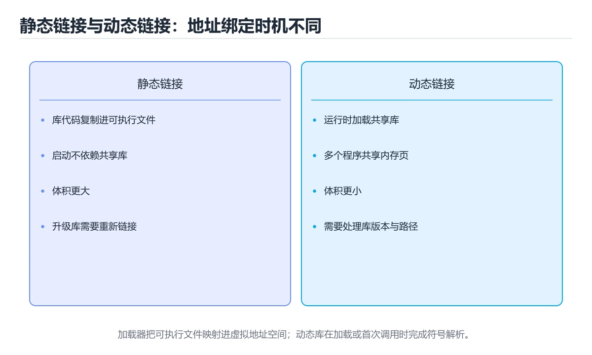

# 链接与加载

> 内容更新时间：2026-10-06 · 学习阶段：进阶 · 预计用时：45 分钟




## 本节知识框架

**课程定位**：所属分类 `fundamentals`（计算机基础），课程主题 `链接与加载`，学习阶段 进阶，建议用时 45 分钟。

本课主线：符号解析、重定位、静态/动态链接与 PLT/GOT。

**学完本课应当能够**
- 说清 `链接` 与 `重定位` 的含义与区别，并各举一个正例和一个反例。
- 用本课示例验证 `动态链接` 的行为，记录输入、输出与失败条件。
- 遇到「链接库顺序写反」这类问题时，能说出触发条件与修复顺序。

### 从概念到验证的学习链条

1. `链接`：先掌握 静态链接把库代码复制进产物，部署简单但体积大，再用它解释 `重定位` 为什么会出现。
2. `重定位`：先掌握 重定位：把所有节区拼装到最终地址，改写引用处的地址，再用它解释 `动态链接` 为什么会出现。
3. `动态链接`：先掌握 程序运行时加载共享库并解析符号，多个进程可复用同一份库，再用它解释 `PLT` 为什么会出现。
4. `PLT`：先掌握 动态链接的程序在编译时不知道库函数最终地址，于是引入 GOT（全局偏移表） 保存地址、PLT（过程链接表） 做跳转桩；首次调用触发动态解析，之后走缓存，再用它解释 `PIC` 为什么会出现。
5. `PIC`：先掌握 PIC（位置无关代码） 让同一份库代码可以映射到任意地址，配合 ASLR 提升安全性；代价是部分访问需要经由 GOT，略微增加间接寻址，再用它解释 本课示例的观察结果 为什么会出现。

**先修与衔接**：本课是「计算机基础」分类的第 16 课。先修内容：《代码生成与寄存器分配》。《代码生成与寄存器分配》里的 `代码生成`、`寄存器分配` 是本课的前提。相关或后续课程：《总线与 I/O 设备》。

### 完成判据

- **定义关**：不看正文也能说明 `链接` 是 静态链接把库代码复制进产物，部署简单但体积大，并指出一个反例。
- **机制关**：能按“输入 → 转换 → 输出 → 验证”复述 `链接与加载`，而不是只背结论。
- **示例关**：能运行或推演 `链接与加载` 的 `text` 示例，并说明一个真实出现的标识符或字面量。
- **证据关**：能指出 `链接与加载` 示例里的 出现字面量 `$ORIGIN`，并说明它支持或反驳了本课的哪一条结论。
- **排错关**：能复现 链接库顺序写反，记录现象并按 被依赖库放在依赖者后面并检查循环依赖 修复。
- **迁移关**：能把 `链接`、`重定位`、`动态链接`、`PLT` 放进一个与 `链接与加载` 不同的项目场景，并保持输入与验证条件可追踪。
- **复盘关**：学完 `链接与加载` 后，用一句话写下仍然不确定的结论，并列出下一次验证需要的输入、环境和成功判据。

### 复习清单

- [ ] 能不看正文复述本课核心术语，并指出一个边界或反例。
- [ ] 能运行或推演本课示例，记录输入、输出与失败现象。
- [ ] 能完成一次自测，并把错题对照错误表定位原因。

## 核心概念定义

| 术语 | 操作性定义 | 常见边界与风险 |
| --- | --- | --- |
| 链接 | 静态链接把库代码复制进产物，部署简单但体积大。 | 易错：出现 undefined reference；正确做法是被依赖库放在依赖者后面并检查循环依赖。 |
| 重定位 | 重定位：把所有节区拼装到最终地址，改写引用处的地址。 | 越界、悬垂引用与释放顺序会破坏结论，必须在边界输入下复验。 |
| 动态链接 | 程序运行时加载共享库并解析符号，多个进程可复用同一份库。 | 共享状态与调度顺序会改变结论，单线程或串行测试通过不等于并发下成立。 |
| PLT | 动态链接的程序在编译时不知道库函数最终地址，于是引入 GOT（全局偏移表） 保存地址、PLT（过程链接表） 做跳转桩；首次调用触发动态解析，之后走缓存。 | 静态检查只在编译期成立，运行期输入仍需校验。 |
| PIC | PIC（位置无关代码） 让同一份库代码可以映射到任意地址，配合 ASLR 提升安全性；代价是部分访问需要经由 GOT，略微增加间接寻址。 | 易错：链接失败或运行时无法加载；正确做法是编译共享库时统一开启位置无关代码。 |

## 原理与运行机制

### 机制总览

**教材衔接：链接器做什么**

编译产出的是目标文件（.o/.obj），其中包含代码、数据与**符号表**。链接器负责：

1. **符号解析**：把每个未定义符号（函数调用、外部变量）关联到某个目标文件或库中的定义。
2. **重定位**：把所有节区拼装到最终地址，改写引用处的地址。
3. **去重与合并**：合并相同节区、丢弃未使用代码（配合 `--gc-sections`）。

**教材衔接：符号与可见性**

符号有强弱之分：**强符号**（函数与已初始化全局变量）不能重复定义，**弱符号**（未初始化全局变量）可以。C++ 用名字修饰（name mangling）把命名空间、参数类型编进符号名以支持重载；`extern "C"` 关闭修饰以便与其他语言互操作。

可见性控制（`-fvisibility=hidden`、`static`、匿名命名空间）能减少符号冲突并加速加载。

**教材衔接：静态链接与动态链接**

| 方式 | 时机 | 优点 | 缺点 |
| --- | --- | --- | --- |
| 静态链接 | 链接时把库代码复制进可执行文件 | 部署简单、无依赖 | 体积大、库升级需重新编译 |
| 动态链接 | 运行时加载 .so/.dll | 体积小、可共享与热更新 | 依赖管理复杂、启动需解析符号 |

### 机制拆解：每一步的输入、动作与输出

#### 1. `链接`
- 输入：`链接`；本步把 静态链接把库代码复制进产物，部署简单但体积大 当作判断规则。
- 动作：围绕 `链接` 保留中间状态，并记录它与 `重定位` 的对应关系。
- 输出：`重定位`，它可以被下一段代码、测试或记录继续使用。
- `链接` 的失败条件：当链接库顺序写反时，会出现出现 undefined reference。

#### 2. `重定位`
- 输入：`链接`；本步把 重定位：把所有节区拼装到最终地址，改写引用处的地址 当作判断规则。
- 动作：围绕 `重定位` 保留中间状态，并记录它与 `动态链接` 的对应关系。
- 输出：`动态链接`，它可以被下一段代码、测试或记录继续使用。
- `重定位` 的失败条件：越界、悬垂引用与释放顺序会破坏结论，必须在边界输入下复验。

#### 3. `动态链接`
- 输入：`重定位`；本步把 程序运行时加载共享库并解析符号，多个进程可复用同一份库 当作判断规则。
- 动作：围绕 `动态链接` 保留中间状态，并记录它与 `PLT` 的对应关系。
- 输出：`PLT`，它可以被下一段代码、测试或记录继续使用。
- `动态链接` 的失败条件：共享状态与调度顺序会改变结论，单线程或串行测试通过不等于并发下成立。

#### 4. `PLT`
- 输入：`动态链接`；本步把 动态链接的程序在编译时不知道库函数最终地址，于是引入 GOT（全局偏移表） 保存地址、PLT（过程链接表） 做跳转桩；首次调用触发动态解析，之后走缓存 当作判断规则。
- 动作：围绕 `PLT` 保留中间状态，并记录它与 `PIC` 的对应关系。
- 输出：`PIC`，它可以被下一段代码、测试或记录继续使用。
- `PLT` 的失败条件：静态检查只在编译期成立，运行期输入仍需校验。

#### 5. `PIC`
- 输入：`PLT`；本步把 PIC（位置无关代码） 让同一份库代码可以映射到任意地址，配合 ASLR 提升安全性；代价是部分访问需要经由 GOT，略微增加间接寻址 当作判断规则。
- 动作：围绕 `PIC` 保留中间状态，并记录它与 `$ORIGIN` 的对应关系。
- 输出：`$ORIGIN`，它可以被下一段代码、测试或记录继续使用。
- `PIC` 的失败条件：当共享库忘记 -fPIC时，会出现链接失败或运行时无法加载。

### 示例中的可观察事实

1. 出现字面量 `$ORIGIN`；它对应的课程主题是 `链接与加载`。

### 复现实验记录

- 环境：`链接与加载` 使用 `text` 示例，固定 `链接`、`重定位`、`动态链接`、`PLT` 作为第一组条件。
- 首轮输入：先确认 出现字面量 `$ORIGIN`，预测 `链接` 会怎样变化。
- 基线观察：记录命令、输入、输出和错误原文，不用截图代替可复制的文本。
- 单变量修改：只改变 `链接`，观察 `PIC` 是否仍满足定义。
- 失败注入：复现 链接库顺序写反，确认现象是 出现 undefined reference。
- 记录结论：把“修改前、修改后、预期变化、实际变化”写成四列表，这样复盘 `链接与加载` 时才能区分概念错误与实现错误。

## 典型应用场景

- **链接库顺序写反**：典型现象是出现 undefined reference；正确做法是被依赖库放在依赖者后面并检查循环依赖。
- **头文件里直接定义全局变量**：典型现象是多个目标文件合并时重复定义；正确做法是头文件只放 extern 声明，定义放到单个源文件。
- **共享库忘记 -fPIC**：典型现象是链接失败或运行时无法加载；正确做法是编译共享库时统一开启位置无关代码。
- **部署依赖 LD_LIBRARY_PATH 临时救火**：典型现象是换环境后找不到库；正确做法是使用 rpath、标准目录或明确的依赖打包方案。

### 最小验证场景

- 准备：保留 `text` 示例的原始输入，先记录 `链接与加载` 的基线输出和完整运行命令。
- 观察：先核对 出现字面量 `$ORIGIN`，再改变一个与 `链接` 相关的条件。
- 判定：新结果与 `链接与加载` 的基线不同不等于错误；只有当差异破坏了 `链接` 的定义或错误表中的约束，才判定为失败。

### 选择与边界

- 使用 `链接` 时，先满足它的定义：静态链接把库代码复制进产物，部署简单但体积大；易错：出现 undefined reference；正确做法是被依赖库放在依赖者后面并检查循环依赖。
- 使用 `重定位` 时，先满足它的定义：重定位：把所有节区拼装到最终地址，改写引用处的地址；越界、悬垂引用与释放顺序会破坏结论，必须在边界输入下复验。
- 使用 `动态链接` 时，先满足它的定义：程序运行时加载共享库并解析符号，多个进程可复用同一份库；共享状态与调度顺序会改变结论，单线程或串行测试通过不等于并发下成立。
- 使用 `PLT` 时，先满足它的定义：动态链接的程序在编译时不知道库函数最终地址，于是引入 GOT（全局偏移表） 保存地址、PLT（过程链接表） 做跳转桩；首次调用触发动态解析，之后走缓存；静态检查只在编译期成立，运行期输入仍需校验。
- 使用 `PIC` 时，先满足它的定义：PIC（位置无关代码） 让同一份库代码可以映射到任意地址，配合 ASLR 提升安全性；代价是部分访问需要经由 GOT，略微增加间接寻址；易错：链接失败或运行时无法加载；正确做法是编译共享库时统一开启位置无关代码。

## 代码/协议/SQL 示例

### 最小可验证示例

```text
内核读取可执行文件头 → 建立虚拟地址空间映射
→ 加载动态链接器 → 解析依赖库 → 重定位 → 执行入口
```

**教材衔接：PLT / GOT 与位置无关代码**

动态链接的程序在编译时不知道库函数最终地址，于是引入 **GOT（全局偏移表）** 保存地址、**PLT（过程链接表）** 做跳转桩；首次调用触发动态解析，之后走缓存。

**PIC（位置无关代码）** 让同一份库代码可以映射到任意地址，配合 ASLR 提升安全性；代价是部分访问需要经由 GOT，略微增加间接寻址。

**教材衔接：加载过程**

```text
内核读取可执行文件头 → 建立虚拟地址空间映射
→ 加载动态链接器 → 解析依赖库 → 重定位 → 执行入口
```

常见排查工具：`ldd`（查看依赖）、`nm`/`objdump -t`（看符号表）、`readelf -d`（看动态段）、`LD_DEBUG=libs`（打印解析过程）。

**教材衔接：链接与加载速查**

| 概念 | 作用 |
| --- | --- |
| 符号表 | 记录已定义与未定义的符号 |
| 重定位 | 修正代码与数据中的地址引用 |
| 静态链接 | 库代码复制进可执行文件 |
| 动态链接 | 运行时由动态链接器加载共享库 |
| PLT | 过程链接表，实现延迟绑定 |
| GOT | 全局偏移表，存放外部符号地址 |
| ASLR | 地址空间布局随机化，提升安全性 |
| PIC | 位置无关代码，可加载到任意地址 |
| 装载器 | 把可执行文件与依赖映射进内存 |

常见错误与含义：

| 错误 | 含义 | 处理方式 |
| --- | --- | --- |
| `undefined reference to foo` | 符号未定义（未链接实现或库） | 补实现或加 `-l` |
| `multiple definition of x` | 同一符号重复定义 | 头文件放声明、源文件放定义 |
| `cannot open shared object file` | 运行时找不到共享库 | 设置 rpath 或检查安装路径 |
| `symbol lookup error` | 运行时符号缺失 | 检查版本与依赖库 |
| `undefined symbol: _Z...` | C++ 名字修饰不匹配 | 用 `extern "C"` 或统一编译器 |

```bash
# 静态库：归档一组目标文件
gcc -c util.c -o util.o
ar rcs libutil.a util.o
gcc main.c -L. -lutil -o app

# 共享库：编译为位置无关代码再打包
gcc -fPIC -c util.c -o util.o
gcc -shared -o libutil.so util.o
gcc main.c -L. -lutil -Wl,-rpath,'$ORIGIN' -o app

# 常用诊断命令
nm -C app | head                 # 查看符号（C++ 名字还原）
ldd app                          # 查看动态依赖
readelf -d app | grep -i rpath   # 查看 rpath
objdump -d -M intel app | head   # 反汇编
```

**教材衔接：深入补充：链接与加载**

前面已经建立了基本概念。这一节换一个角度，把链接与加载放进真实工程里，
重点回答三件事：链接器做什么 的机制、代价与边界。

### 一、核心模型

链接器把多个目标文件和库合并成可执行文件或共享库，核心工作是符号解析、重定位和节区合并；加载器则在程序启动时把文件映射进内存、处理动态依赖并跳转到入口。

```text
源码 → 编译为目标文件 → 符号解析 → 节区合并与重定位 → 可执行文件/共享库 → 加载器映射 → 动态链接 → 入口执行
```

### 二、关键机制拆解

1. 目标文件包含 .text、.data、.bss、只读数据、符号表和重定位表，节区描述代码与数据如何拼装。
2. 强符号包括函数和已初始化全局变量，弱符号包括未初始化全局变量；重复强符号会报错，强弱共存时通常选择强符号。
3. 重定位表记录“哪个位置需要填入哪个符号的最终地址”，链接器完成地址计算后再写回指令或数据。
4. 静态链接把库代码复制进产物，部署简单但体积大；动态链接在运行时解析共享库，体积小但要管理依赖版本。
5. 位置无关代码通过 GOT 保存外部地址，通过 PLT 做跳转桩，首次调用触发解析，之后走缓存以降低开销。
6. 加载器使用 mmap 建立虚拟地址映射，动态加载器解析依赖并执行重定位，ASLR 会让每次运行的地址布局变化。

### 三、对照表：抓住容易混淆的边界

| 维度 | 一侧 | 另一侧 |
| --- | --- | --- |
| 静态链接 | 库代码进入最终可执行文件 | 升级库必须重新编译和发布 |
| 动态链接 | 运行时加载共享库并解析符号 | 依赖管理和版本冲突更复杂 |
| 编译期地址 | 链接器能计算出的固定偏移 | 常被重定位和基址选择影响 |
| 运行时地址 | 加载器映射后确定的虚拟地址 | 每次启动可能因 ASLR 改变 |

### 四、工作示例

执行 `gcc -c math.c -o math.o` 后，用 `nm -u math.o` 查看未定义符号，用 `readelf -r math.o` 看重定位项。链接时若库顺序错误，会出现 `undefined reference`；共享库没加 `-fPIC` 则可能在链接或加载时报错。

### 五、常见误区与失效边界

| 错误做法或假设 | 后果 | 正确做法 |
| --- | --- | --- |
| 链接库顺序写反 | 出现 undefined reference | 被依赖库放在依赖者后面并检查循环依赖 |
| 头文件里直接定义全局变量 | 多个目标文件合并时重复定义 | 头文件只放 extern 声明，定义放到单个源文件 |
| 共享库忘记 -fPIC | 链接失败或运行时无法加载 | 编译共享库时统一开启位置无关代码 |
| 部署依赖 LD_LIBRARY_PATH 临时救火 | 换环境后找不到库 | 使用 rpath、标准目录或明确的依赖打包方案 |

### 六、场景推演

线上服务升级后启动失败，日志显示 `undefined symbol`。排查顺序是：先确认缺失符号名；再用 `nm`、`readelf -d`、`ldd` 检查依赖和版本；然后核对构建环境与运行环境的库版本；最后用可复现的容器验证，而不是只在一台机器上临时设置环境变量。

### 七、自测问答

**Q1：为什么目标文件需要符号表？**

链接器要靠它判断定义和引用关系，完成符号解析与重定位。

**Q2：PLT 和 GOT 分别解决什么问题？**

PLT 提供跳转桩，GOT 保存运行时地址，两者共同支持延迟绑定。

**Q3：静态库和动态库最大的取舍是什么？**

静态库部署简单但体积大，动态库节省空间但依赖管理复杂。

**Q4：ASLR 对调试有什么影响？**

每次运行地址不同，断点和地址分析需要基于模块偏移而不是固定绝对地址。

### 八、小项目：把知识变成可检查的产出

创建静态库和共享库各一个，分别编译两个调用程序；使用 `nm`、`readelf`、`ldd` 记录符号与依赖，再故意制造一次库顺序错误和一次缺失 `-fPIC`，保存完整排查记录。

### 九、适用边界

链接解决的是模块之间的名字和地址问题，不保证 ABI 兼容，也不替代版本管理。跨编译器、跨标准库或跨语言边界时，还需要 ABI、名字修饰和运行时库版本约束。

### 十、完成检查清单

- [ ] 能说出目标文件的主要节区和作用
- [ ] 能解释强符号、弱符号和未定义符号
- [ ] 能独立完成一次符号与依赖排查
- [ ] 能说明 PIC、GOT、PLT 之间的关系
- [ ] 能为动态库制定版本与部署策略

**教材衔接：深挖「链接」的边界与代价**

### 一、链接 的关键句与适用条件

| 正文出处 | 原句 | 用之前先确认 |
| --- | --- | --- |
| 链接器做什么 | 重定位：把所有节区拼装到最终地址，改写引用处的地址。 | 把 重定位 换成边界值时，这一步是否仍然成立 |
| PLT / GOT 与位置无关代码 | 动态链接的程序在编译时不知道库函数最终地址，于是引入 GOT（全局偏移表） 保存地址、PLT（过程链接表） 做跳转桩； | 把 链接 换成边界值时，这一步是否仍然成立 |
| PLT / GOT 与位置无关代码 | 代价是部分访问需要经由 GOT，略微增加间接寻址。 | 把 GOT 换成边界值时，这一步是否仍然成立 |
| 一、核心模型 | 链接器把多个目标文件和库合并成可执行文件或共享库，核心工作是符号解析、重定位和节区合并； | 把 链接 换成边界值时，这一步是否仍然成立 |
| 二、关键机制拆解 | 目标文件包含 .text、.data、.bss、只读数据、符号表和重定位表，节区描述代码与数据如何拼装。 | 把 重定位 换成边界值时，这一步是否仍然成立 |

### 二、把 链接与加载 推到边界

下面是本课第一段代码（text），先原样运行一次作为基线：

```text
内核读取可执行文件头 → 建立虚拟地址空间映射
→ 加载动态链接器 → 解析依赖库 → 重定位 → 执行入口
```

| 变式 | 怎么改 | 先写下什么 | 观察点 |
| --- | --- | --- | --- |
| 边界输入 | 把 链接与加载 的输入换成空值或最大值 | 预测输出 | 是否报错、是否静默返回 |
| 只改一处 | 把 链接与加载 的一个参数改成另一档 | 预测差异来源 | 输出变化能否用本课结论解释 |
| 去掉一步 | 注释掉 链接与加载 之后的一行 | 预测哪一步先失败 | 错误位置是否与预期一致 |


### 四、测验复盘

| 题号 | 正确答案 | 最容易选错的干扰项 | 复盘动作 |
| --- | --- | --- | --- |
| 1 | 学习 链接 时要同时说明输入、输出和失败路径，不能只看正常流程 | 把 重定位 的单次运行结果当成所有版本和规模都成立 | 把干扰项改写成一句反例，再说明它违反本课哪条前提 |
| 2 | 这段代码只做静态声明，没有循环、分支或可观察输出。 | 这段代码会读取外部输入，结果依赖传入的数据。 | 把干扰项改写成一句反例，再说明它违反本课哪条前提 |
| 3 | 支持动态链接的地址跳转与缓存 | 加速编译 | 把干扰项改写成一句反例，再说明它违反本课哪条前提 |
| 4 | 静态库代码被复制进可执行文件 | 静态库只能在 Windows 使用 | 把干扰项改写成一句反例，再说明它违反本课哪条前提 |
| 5 | 让代码可加载到任意地址 | 减少编译时间 | 把干扰项改写成一句反例，再说明它违反本课哪条前提 |
| 6 | 0 | （无干扰项） | 把干扰项改写成一句反例，再说明它违反本课哪条前提 |


### 示例精读：先找证据，再改一个条件

1. 出现字面量 `$ORIGIN`；它出现在 `链接与加载` 的示例中，阅读时先确认它前后各发生了什么。
- 在 `链接与加载` 中与 `链接` 对照：示例必须能支持 静态链接把库代码复制进产物，部署简单但体积大，否则说明这一段还缺少实现或验证步骤。
- 在 `链接与加载` 中与 `重定位` 对照：示例必须能支持 重定位：把所有节区拼装到最终地址，改写引用处的地址，否则说明这一段还缺少实现或验证步骤。
- 在 `链接与加载` 中与 `动态链接` 对照：示例必须能支持 程序运行时加载共享库并解析符号，多个进程可复用同一份库，否则说明这一段还缺少实现或验证步骤。
- 在 `链接与加载` 中与 `PLT` 对照：示例必须能支持 动态链接的程序在编译时不知道库函数最终地址，于是引入 GOT（全局偏移表） 保存地址、PLT（过程链接表） 做跳转桩；首次调用触发动态解析，之后走缓存，否则说明这一段还缺少实现或验证步骤。

## 时间/空间复杂度或性能分析

**性能关注点（链接与加载）**：关注资源换算与精度损失：记录单位换算误差、存储空间与实际耗时。

**本课特有开销（链接与加载 · 链接）**：缓存命中率比缓存实现本身更关键，先记录命中率与失效策略再谈优化。

**测量方法**：以 `链接与加载` 的 `链接` 场景为对象，固定输入跑一遍记录基线，再把规模或并发度提高一个数量级复测；两次结果的差值与波动范围才是结论依据。

### 需要控制的变量与记录项

- `链接与加载` 的 `链接`：固定它的版本、输入范围和资源上限，分别记录速度、内存与失败率的变化。
- `链接与加载` 的 `重定位`：固定它的版本、输入范围和资源上限，分别记录速度、内存与失败率的变化。
- `链接与加载` 的 `动态链接`：固定它的版本、输入范围和资源上限，分别记录速度、内存与失败率的变化。
- `链接与加载` 的 `PLT`：固定它的版本、输入范围和资源上限，分别记录速度、内存与失败率的变化。
- `链接与加载` 的 `GOT`：固定它的版本、输入范围和资源上限，分别记录速度、内存与失败率的变化。
- `链接与加载` 中 `链接` 的边界：易错：出现 undefined reference；正确做法是被依赖库放在依赖者后面并检查循环依赖。达到边界时不要外推，必须重新测量。
- `链接与加载` 中 `重定位` 的边界：越界、悬垂引用与释放顺序会破坏结论，必须在边界输入下复验。达到边界时不要外推，必须重新测量。
- `链接与加载` 中 `动态链接` 的边界：共享状态与调度顺序会改变结论，单线程或串行测试通过不等于并发下成立。达到边界时不要外推，必须重新测量。
- `链接与加载` 中 `PLT` 的边界：静态检查只在编译期成立，运行期输入仍需校验。达到边界时不要外推，必须重新测量。
- `链接与加载` 中 `PIC` 的边界：易错：链接失败或运行时无法加载；正确做法是编译共享库时统一开启位置无关代码。达到边界时不要外推，必须重新测量。
- `链接与加载` 的代码证据：先验证 出现字面量 `$ORIGIN`，再记录该路径的输入规模与耗时；只看代码行数不能推出复杂度。

## 常见误区与易错点

| 容易写错的做法 | 实际现象 | 原因与正确做法 |
| --- | --- | --- |
| 链接库顺序写反 | 出现 undefined reference | 被依赖库放在依赖者后面并检查循环依赖 |
| 头文件里直接定义全局变量 | 多个目标文件合并时重复定义 | 头文件只放 extern 声明，定义放到单个源文件 |
| 共享库忘记 -fPIC | 链接失败或运行时无法加载 | 编译共享库时统一开启位置无关代码 |
| 部署依赖 LD_LIBRARY_PATH 临时救火 | 换环境后找不到库 | 使用 rpath、标准目录或明确的依赖打包方案 |
| 库顺序写反 | `undefined reference` | 被依赖的库放在依赖者后面 |
| 在头文件定义全局变量 | 多重定义 | 用 `extern` 声明或 `inline` 变量 |
| 共享库未加 `-fPIC` | 链接或加载失败 | 编译共享库必须加 `-fPIC` |
| 用绝对路径设置 rpath | 换环境后失效 | 用 `$ORIGIN` 相对路径 |
| 直接依赖 `LD_LIBRARY_PATH` | 部署易遗漏 | 用 rpath 或标准库目录 |
| C++ 库给 C 调用不加 `extern "C"` | 符号找不到 | 用 `extern "C"` 包裹声明 |
| 静态与动态库同名混用 | 链接到意外版本 | 明确指定路径与链接方式 |
| 忘记 `-lm` 等系统库 | 数学函数未定义 | 补齐所需库 |
| 认为 `ldd` 列出的是全部依赖 | 分析偏差 | 只列直接依赖，间接依赖需逐层看 |
| 关闭 ASLR 调试后忘记恢复 | 安全性下降 | 用调试器临时设置，不改系统默认 |
| 共享库未加 -fPIC | 链接或加载失败。 | 编译共享库必须加 -fPIC。 |

### 现场 1：链接库顺序写反

**症状**：出现 undefined reference。

**根因与修复**：被依赖库放在依赖者后面并检查循环依赖。

**自检**：在本课示例里复现「链接库顺序写反」，改成被依赖库放在依赖者后面并检查循环依赖后重跑；如果症状消失且失败路径按预期变化，说明定位正确。

### 现场 2：头文件里直接定义全局变量

**症状**：多个目标文件合并时重复定义。

**根因与修复**：头文件只放 extern 声明，定义放到单个源文件。

**自检**：在本课示例里复现「头文件里直接定义全局变量」，改成头文件只放 extern 声明，定义放到单个源文件后重跑；如果症状消失且失败路径按预期变化，说明定位正确。

### 现场 3：共享库忘记 -fPIC

**症状**：链接失败或运行时无法加载。

**根因与修复**：编译共享库时统一开启位置无关代码。

**自检**：在本课示例里复现「共享库忘记 -fPIC」，改成编译共享库时统一开启位置无关代码后重跑；如果症状消失且失败路径按预期变化，说明定位正确。

### 现场 4：部署依赖 LD_LIBRARY_PATH 临时救火

**症状**：换环境后找不到库。

**根因与修复**：使用 rpath、标准目录或明确的依赖打包方案。

**自检**：在本课示例里复现「部署依赖 LD_LIBRARY_PATH 临时救火」，改成使用 rpath、标准目录或明确的依赖打包方案后重跑；如果症状消失且失败路径按预期变化，说明定位正确。

### 现场 5：库顺序写反

**症状**：`undefined reference`。

**根因与修复**：被依赖的库放在依赖者后面。

**自检**：在本课示例里复现「库顺序写反」，改成被依赖的库放在依赖者后面后重跑；如果症状消失且失败路径按预期变化，说明定位正确。

### 现场 6：在头文件定义全局变量

**症状**：多重定义。

**根因与修复**：用 `extern` 声明或 `inline` 变量。

**自检**：在本课示例里复现「在头文件定义全局变量」，改成用 `extern` 声明或 `inline` 变量后重跑；如果症状消失且失败路径按预期变化，说明定位正确。

### 现场 7：共享库未加 `-fPIC`

**症状**：链接或加载失败。

**根因与修复**：编译共享库必须加 `-fPIC`。

**自检**：在本课示例里复现「共享库未加 `-fPIC`」，改成编译共享库必须加 `-fPIC`后重跑；如果症状消失且失败路径按预期变化，说明定位正确。

### 现场 8：用绝对路径设置 rpath

**症状**：换环境后失效。

**根因与修复**：用 `$ORIGIN` 相对路径。

**自检**：在本课示例里复现「用绝对路径设置 rpath」，改成用 `$ORIGIN` 相对路径后重跑；如果症状消失且失败路径按预期变化，说明定位正确。

### 现场 9：直接依赖 `LD_LIBRARY_PATH`

**症状**：部署易遗漏。

**根因与修复**：用 rpath 或标准库目录。

**自检**：在本课示例里复现「直接依赖 `LD_LIBRARY_PATH`」，改成用 rpath 或标准库目录后重跑；如果症状消失且失败路径按预期变化，说明定位正确。

## 与其他知识点的关系

- **先修**：`代码生成与寄存器分配`。本课默认这些内容已经掌握。
- **相关或后续**：`总线与 I/O 设备`。本课术语会在这些课程里继续使用。
- **术语归属**：`链接`、`重定位`、`动态链接` 的定义以本课「核心概念定义」为准，换到其他课程时先确认定义是否被改写。
- 同一分类的《编译与程序运行原理》也涉及 `链接`；两课衔接时先确认这个术语的定义是否一致。
- 同一分类的《实战：追踪程序的全生命周期》也涉及 `链接`；两课衔接时先确认这个术语的定义是否一致。

### 先修与后续术语接口

- `代码生成与寄存器分配`：两者通过本分类的学习顺序衔接，阅读时重点比较各自的输入与失败条件。
- `总线与 I/O 设备`：两者通过本分类的学习顺序衔接，阅读时重点比较各自的输入与失败条件。

### 容易混淆的相邻概念

- `链接` 与 `重定位`：前者强调 静态链接把库代码复制进产物，部署简单但体积大；后者强调 重定位：把所有节区拼装到最终地址，改写引用处的地址。判断时分别检查两条定义的适用范围，不要只看名称相似就互换。
- `重定位` 与 `动态链接`：前者强调 重定位：把所有节区拼装到最终地址，改写引用处的地址；后者强调 程序运行时加载共享库并解析符号，多个进程可复用同一份库。判断时分别检查两条定义的适用范围，不要只看名称相似就互换。
- `动态链接` 与 `PLT`：前者强调 程序运行时加载共享库并解析符号，多个进程可复用同一份库；后者强调 动态链接的程序在编译时不知道库函数最终地址，于是引入 GOT（全局偏移表） 保存地址、PLT（过程链接表） 做跳转桩；首次调用触发动态解析，之后走缓存。判断时分别检查两条定义的适用范围，不要只看名称相似就互换。
- `PLT` 与 `PIC`：前者强调 动态链接的程序在编译时不知道库函数最终地址，于是引入 GOT（全局偏移表） 保存地址、PLT（过程链接表） 做跳转桩；首次调用触发动态解析，之后走缓存；后者强调 PIC（位置无关代码） 让同一份库代码可以映射到任意地址，配合 ASLR 提升安全性；代价是部分访问需要经由 GOT，略微增加间接寻址。判断时分别检查两条定义的适用范围，不要只看名称相似就互换。

## 自测题与参考答案

> 先独立作答，再对照参考答案；答案都能在本课正文、术语表或错误表里找到依据。

### 自测 1（概念复述）

不看正文，写出 `链接` 的操作性定义，并说明它与 `重定位` 的区别。

**参考答案**：静态链接把库代码复制进产物，部署简单但体积大。

`重定位` 的定位是：重定位：把所有节区拼装到最终地址，改写引用处的地址；两者的差别要从适用对象与失败模式上说明。

### 自测 2（排错）

本课错误表记录了「链接库顺序写反」这类做法。请写出它会出现的现象、根因，以及修复顺序。

**参考答案**：现象是出现 undefined reference；正确做法是被依赖库放在依赖者后面并检查循环依赖。修复时先复现现象并保留证据，再改动一处假设重跑，确认现象消失。

### 自测 3（动手验证）

运行本课的 `text` 示例，改动其中一个输入后重新运行，记录输出与错误信息。

**参考答案**：正常输入下 `text` 示例应当复现正文给出的结果；改动输入后，如果结果改变或报错，先核对它是否满足 `链接与加载` 中`链接` 的适用范围，再检查错误表里是否有同类现象。

### 自测 4（代码阅读）

阅读本课开头的 `text` 示例，说明它体现了`链接` 的哪一条性质，并指出改动哪个输入会让这条性质不再成立。

**参考答案**：`链接` 的定义是 静态链接把库代码复制进产物，部署简单但体积大，示例正是在实现这条定义。改动与 `链接` 有关的一个输入后，如果结果不再符合 `链接与加载` 的正文描述，就说明该性质只在当前前提成立。

### 自测 5（迁移）

把 `链接与加载` 的方法迁移到自己的项目：围绕 `链接` 写出一个与错误表同类的风险点，并说明触发条件和检验方式。

**参考答案**：例如「共享库未加 -fPIC」，它会导致链接或加载失败；检验方式是按编译共享库必须加 -fPIC改一处再复现，确认现象消失且没有引入新的失败分支。

### 自测 6（对比）

用一个表格对比 `链接` 与 `重定位`：各写一行适用场景、一行失败表现。

**参考答案**：`链接` 的定义是静态链接把库代码复制进产物，部署简单但体积大；`重定位` 的定义是重定位：把所有节区拼装到最终地址，改写引用处的地址。两者的失败表现分别对应本课错误表里与本术语相关的行。

### 自测 7（排错顺序）

面对「链接库顺序写反」引发的问题，请把“复现 出现 undefined reference → 保留证据 → 被依赖库放在依赖者后面并检查循环依赖 → 回归验证”四步写成可执行的检查清单。

**参考答案**：第一步按出现 undefined reference复现；第二步记录输入、版本与完整报错；第三步按被依赖库放在依赖者后面并检查循环依赖只改一处；第四步重跑并确认失败路径也按预期变化。

### 自测 8（边界判断）

针对 `PIC`，分别写出“可以使用”的条件和“结论不再成立”的条件。

**参考答案**：易错：链接失败或运行时无法加载；正确做法是编译共享库时统一开启位置无关代码。 同时要把 `PIC` 的定义 PIC（位置无关代码） 让同一份库代码可以映射到任意地址，配合 ASLR 提升安全性；代价是部分访问需要经由 GOT，略微增加间接寻址 与实际输入逐项对照。

### 自测 9（机制重建）

不看正文，按输入、转换、输出、验证四段重建 `链接` → `重定位` → `动态链接` → `PLT` 的作用链。

**参考答案**：起点是 `链接` 的定义 静态链接把库代码复制进产物，部署简单但体积大；中间每一步都保留可观察状态；终点由 `PIC` 检查，失败时回到错误表定位第一个偏离定义的步骤。

### 自测 10（综合排错）

在 `链接与加载` 中，现象是 链接或加载失败。请围绕 共享库未加 -fPIC 写出最小复现、关键证据、修复动作和回归验证，并说明为什么不能只凭一次运行下结论。

**参考答案**：先复现 共享库未加 -fPIC，记录输入与完整错误；再按 编译共享库必须加 -fPIC 只改一处。回归时同时跑正常路径和边界路径，只有两次结果都可解释，才把修复视为完成。

### 自测 11（一分钟复述）

用每分钟约 200 字的速度复述 `链接与加载`：先给主问题，再按顺序说出 `链接`、`重定位`、`动态链接`、`PLT`，最后给一个失败案例。

**自评标准**：主问题必须对应 符号解析、重定位、静态/动态链接与 PLT/GOT；每个术语都要能接上一句定义或边界；失败案例必须写成可观察现象，不能用“可能有风险”代替证据。

## 术语速查

| 术语 | 一句话说明 |
| --- | --- |
| `链接` | 静态链接把库代码复制进产物，部署简单但体积大。 |
| `重定位` | 重定位：把所有节区拼装到最终地址，改写引用处的地址。 |
| `动态链接` | 程序运行时加载共享库并解析符号，多个进程可复用同一份库。 |
| `PLT` | 动态链接的程序在编译时不知道库函数最终地址，于是引入 GOT（全局偏移表） 保存地址、PLT（过程链接表） 做跳转桩；首次调用触发动态解析，之后走缓存。 |
| `PIC` | PIC（位置无关代码） 让同一份库代码可以映射到任意地址，配合 ASLR 提升安全性；代价是部分访问需要经由 GOT，略微增加间接寻址。 |

**术语关系**：`链接`（静态链接把库代码复制进产物） → `重定位`（重定位：把所有节区拼装到最终地址） → `动态链接`（程序运行时加载共享库并解析符号） → `PLT`（动态链接的程序在编译时不知道库函数最终地址）。

## 考点精讲

`链接与加载` 的题库有 6 道题，下面逐题给出题干、正确项与判断依据：先自己作答，再核对正确项，最后回到正文对应小节复核。

### 考点 1：第 1 题

- **题目**：围绕“链接与加载”中的 链接、重定位、动态链接，下列哪两项是本课强调的实践判断？
- **正确项**：学习 链接 时要同时说明输入、输出和失败路径，不能只看正常流程；验证 重定位 时要固定版本并覆盖边界输入，结论才可复现
- **判断依据**：这道题落在术语 `链接` 上：静态链接把库代码复制进产物，部署简单但体积大。复习时把 `链接` 的定义、适用边界和一个反例一起说清楚，再回到「核心概念定义」核对原文。

### 考点 2：第 2 题

- **题目**：`链接与加载` 的示例代码用于验证 `链接`，其背景是符号解析、重定位、静态/动态链接与 PLT/GOT。代码的真实内容是下面哪一项？
- **正确项**：出现字面量 `$ORIGIN`
- **判断依据**：这道题落在术语 `链接` 上：静态链接把库代码复制进产物，部署简单但体积大。复习时把 `链接` 的定义、适用边界和一个反例一起说清楚，再回到「核心概念定义」核对原文。

### 考点 3：第 3 题

- **题目**：PLT 与 GOT 的作用是？
- **正确项**：支持动态链接的地址跳转与缓存
- **判断依据**：这道题落在术语 `链接` 上：静态链接把库代码复制进产物，部署简单但体积大。复习时把 `链接` 的定义、适用边界和一个反例一起说清楚，再回到「核心概念定义」核对原文。

### 考点 4：第 4 题

- **题目**：静态库与动态库链接的关键区别是？
- **正确项**：静态库代码被复制进可执行文件
- **判断依据**：这道题落在术语 `链接` 上：静态链接把库代码复制进产物，部署简单但体积大。复习时把 `链接` 的定义、适用边界和一个反例一起说清楚，再回到「核心概念定义」核对原文。

### 考点 5：第 5 题

- **题目**：位置无关代码（PIC）的作用是？
- **正确项**：让代码可加载到任意地址
- **判断依据**：这道题落在术语 `PIC` 上：PIC（位置无关代码） 让同一份库代码可以映射到任意地址，配合 ASLR 提升安全性，代价是部分访问需要经由 GOT，略微增加间接寻址。复习时把 `PIC` 的定义、适用边界和一个反例一起说清楚，再回到「核心概念定义」核对原文。

### 考点 6：第 6 题

- **题目**：填空：补齐下面这段术语说明中的空缺。课程 `符号解析、重定位、静态/动态链接与 PLT/GOT。`，这段说明是：`____`：程序运行时加载共享库并解析符号，多个进程可复用同一份库。空缺处应填哪个术语？
- **正确项**：动态链接
- **判断依据**：这道题落在术语 `链接` 上：静态链接把库代码复制进产物，部署简单但体积大。复习时把 `链接` 的定义、适用边界和一个反例一起说清楚，再回到「核心概念定义」核对原文。

### 考点 7：`链接`

- **要点**：静态链接把库代码复制进产物，部署简单但体积大。
- **链接 的边界**：易错：出现 undefined reference；正确做法是被依赖库放在依赖者后面并检查循环依赖。

### 考点 8：`重定位`

- **要点**：重定位：把所有节区拼装到最终地址，改写引用处的地址。
- **重定位 的边界**：越界、悬垂引用与释放顺序会破坏结论，必须在边界输入下复验。

### 考点 9：`动态链接`

- **要点**：程序运行时加载共享库并解析符号，多个进程可复用同一份库。
- **动态链接 的边界**：共享状态与调度顺序会改变结论，单线程或串行测试通过不等于并发下成立。

### 考点 10：`PLT`

- **要点**：动态链接的程序在编译时不知道库函数最终地址，于是引入 GOT（全局偏移表） 保存地址、PLT（过程链接表） 做跳转桩；首次调用触发动态解析，之后走缓存。
- **PLT 的边界**：静态检查只在编译期成立，运行期输入仍需校验。

### 考点 11：`PIC`

- **要点**：PIC（位置无关代码） 让同一份库代码可以映射到任意地址，配合 ASLR 提升安全性；代价是部分访问需要经由 GOT，略微增加间接寻址。
- **PIC 的边界**：易错：链接失败或运行时无法加载；正确做法是编译共享库时统一开启位置无关代码。

### 考点 12：排错——链接库顺序写反

- **现象**：出现 undefined reference。
- **处理**：被依赖库放在依赖者后面并检查循环依赖。

### 考点 13：排错——头文件里直接定义全局变量

- **现象**：多个目标文件合并时重复定义。
- **处理**：头文件只放 extern 声明，定义放到单个源文件。

### 考点 14：综合辨析——`链接` 与 `PIC`

- **辨析点**：`链接` 的定义是 静态链接把库代码复制进产物，部署简单但体积大；`PIC` 的定义是 PIC（位置无关代码） 让同一份库代码可以映射到任意地址，配合 ASLR 提升安全性；代价是部分访问需要经由 GOT，略微增加间接寻址。
- **答题要求**：面对 `链接与加载` 的题目，先判断描述的是 `链接` 还是 `PIC`，再归到对应定义，最后写出一个会让该定义失效的边界输入。

### 考点 15：排错评分点

- **现象分**：能写出 出现 undefined reference，而不是只写“程序有错”。
- **证据分**：保留触发 链接库顺序写反 的输入、版本和错误原文。
- **修复分**：按 被依赖库放在依赖者后面并检查循环依赖 只改一处，并同时回归正常路径与边界路径。

## 内容元数据

- 内容版本：v2.0
- 最后更新：2026-10-06
- 学习阶段：进阶
- 适用环境：通用计算机体系结构知识；本课聚焦 链接。
- 内容来源：内置结构化课程与工程实践整理
- 相关主题：链接、重定位、动态链接、PLT、GOT、PIC
- 质量版本：P0 测验标准 + P1 覆盖扩展 + P2 体验补全

## 参考资料与复核

- 最后复核：2026-10-04
- 下次复核：2027-10-17
- 复核范围：版本兼容、API 行为、安全建议与工程实践
- 来源性质：官方文档、标准或权威教材；本课核对关键词：链接、重定位、动态链接、PLT、GOT、PIC。

| 参考资料 | 本课用途 |
| --- | --- |
| [NIST 二进制与数据表示](https://www.nist.gov/pml/owm/binary-information) | 二进制、位与数据单位 |
| [Arm 架构文档](https://developer.arm.com/documentation) | 处理器与内存体系结构 |
| [Nand2Tetris](https://www.nand2tetris.org/) | 从逻辑门到计算机系统 |

| [本课术语索引：链接与加载](#核心概念定义) | 按本课输入、术语边界和错误表现逐项核对 |
> 「链接与加载」的链接用于离线阅读后的延伸核对；App 不会自动联网。

<!-- p1-deep-dive:start -->