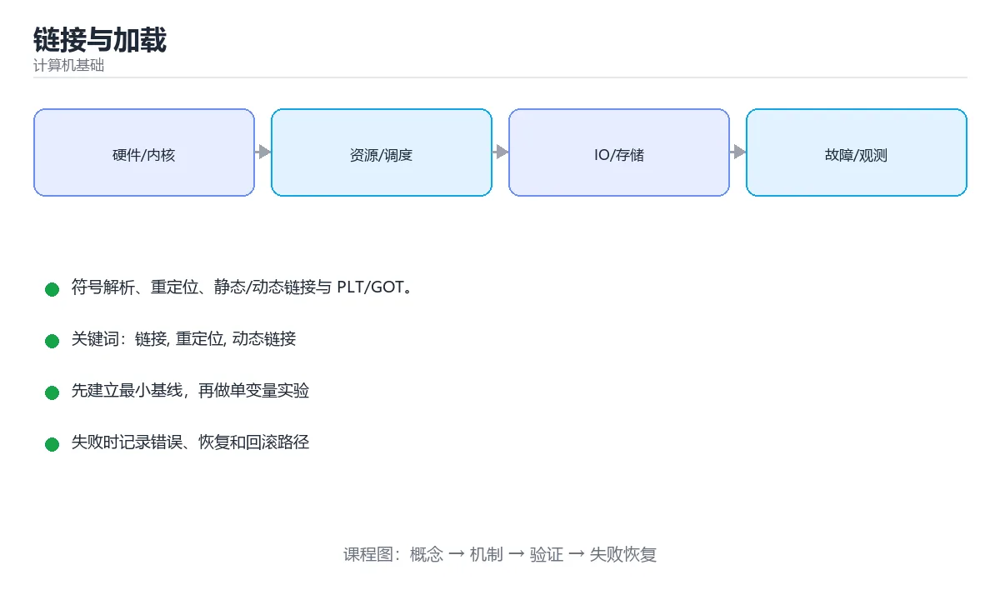

# 链接与加载



> 内容更新时间：2026-10-03 · 学习阶段：进阶 · 预计用时：16 分钟

## 学习目标

- 能用自己的话解释「链接与加载」解决了什么问题，而不是只背术语。
- 能说清 「链接」、「重定位」、「动态链接」、「PLT」 之间的关系，并分别举出一个例子。
- 能把本课知识放回「计算机基础」的知识体系，说明它和相邻主题的边界。
- 能完成本课练习，并用验收标准检查自己的结果。

> 一句话摘要：符号解析、重定位、静态/动态链接与 PLT/GOT。

## 前置知识

- 先完成上一课《代码生成与寄存器分配》；如果已经掌握，可以直接用本课练习自测。
- 本课阶段：进阶。建议先掌握同一分类的基础课程，并能独立运行正文中的最小示例。
- 开始前先复习：链接、重定位、动态链接。
- 如果某一步看不懂，先记录具体卡点，完成练习后再回头读一遍。


## 链接器做什么

编译产出的是目标文件（.o/.obj），其中包含代码、数据与**符号表**。链接器负责：

1. **符号解析**：把每个未定义符号（函数调用、外部变量）关联到某个目标文件或库中的定义。
2. **重定位**：把所有节区拼装到最终地址，改写引用处的地址。
3. **去重与合并**：合并相同节区、丢弃未使用代码（配合 `--gc-sections`）。

## 符号与可见性

符号有强弱之分：**强符号**（函数与已初始化全局变量）不能重复定义，**弱符号**（未初始化全局变量）可以。C++ 用名字修饰（name mangling）把命名空间、参数类型编进符号名以支持重载；`extern "C"` 关闭修饰以便与其他语言互操作。

可见性控制（`-fvisibility=hidden`、`static`、匿名命名空间）能减少符号冲突并加速加载。

## 静态链接与动态链接

| 方式 | 时机 | 优点 | 缺点 |
| --- | --- | --- | --- |
| 静态链接 | 链接时把库代码复制进可执行文件 | 部署简单、无依赖 | 体积大、库升级需重新编译 |
| 动态链接 | 运行时加载 .so/.dll | 体积小、可共享与热更新 | 依赖管理复杂、启动需解析符号 |

## PLT / GOT 与位置无关代码

动态链接的程序在编译时不知道库函数最终地址，于是引入 **GOT（全局偏移表）** 保存地址、**PLT（过程链接表）** 做跳转桩；首次调用触发动态解析，之后走缓存。

**PIC（位置无关代码）** 让同一份库代码可以映射到任意地址，配合 ASLR 提升安全性；代价是部分访问需要经由 GOT，略微增加间接寻址。

## 加载过程

```text
内核读取可执行文件头 → 建立虚拟地址空间映射
→ 加载动态链接器 → 解析依赖库 → 重定位 → 执行入口
```

常见排查工具：`ldd`（查看依赖）、`nm`/`objdump -t`（看符号表）、`readelf -d`（看动态段）、`LD_DEBUG=libs`（打印解析过程）。

## 常见错误

| 报错 | 原因 |
| --- | --- |
| undefined reference | 只声明未定义，或漏链接库/顺序不对 |
| multiple definition | 头文件里定义了非 inline 全局变量 |
| cannot open shared object | 运行时找不到 .so，检查 rpath 与 LD_LIBRARY_PATH |
| symbol lookup error | 运行期符号缺失或版本不匹配 |

## 本课小结
链接解决**名字到地址**的映射，加载解决**文件到内存**的映射。理解符号解析、重定位、PLT/GOT 与 PIC，就能解释绝大多数「编译通过但链接/运行失败」的问题。

<!-- appendix:v1 -->

## 链接与加载速查

| 概念 | 作用 |
| --- | --- |
| 符号表 | 记录已定义与未定义的符号 |
| 重定位 | 修正代码与数据中的地址引用 |
| 静态链接 | 库代码复制进可执行文件 |
| 动态链接 | 运行时由动态链接器加载共享库 |
| PLT | 过程链接表，实现延迟绑定 |
| GOT | 全局偏移表，存放外部符号地址 |
| ASLR | 地址空间布局随机化，提升安全性 |
| PIC | 位置无关代码，可加载到任意地址 |
| 装载器 | 把可执行文件与依赖映射进内存 |

常见错误与含义：

| 错误 | 含义 | 处理方式 |
| --- | --- | --- |
| `undefined reference to foo` | 符号未定义（未链接实现或库） | 补实现或加 `-l` |
| `multiple definition of x` | 同一符号重复定义 | 头文件放声明、源文件放定义 |
| `cannot open shared object file` | 运行时找不到共享库 | 设置 rpath 或检查安装路径 |
| `symbol lookup error` | 运行时符号缺失 | 检查版本与依赖库 |
| `undefined symbol: _Z...` | C++ 名字修饰不匹配 | 用 `extern "C"` 或统一编译器 |

```bash
# 静态库：归档一组目标文件
gcc -c util.c -o util.o
ar rcs libutil.a util.o
gcc main.c -L. -lutil -o app

# 共享库：编译为位置无关代码再打包
gcc -fPIC -c util.c -o util.o
gcc -shared -o libutil.so util.o
gcc main.c -L. -lutil -Wl,-rpath,'$ORIGIN' -o app

# 常用诊断命令
nm -C app | head                 # 查看符号（C++ 名字还原）
ldd app                          # 查看动态依赖
readelf -d app | grep -i rpath   # 查看 rpath
objdump -d -M intel app | head   # 反汇编
```

## 常见错误对照表

| 容易写错的做法 | 实际现象 | 原因与正确做法 |
| --- | --- | --- |
| 库顺序写反 | `undefined reference` | 被依赖的库放在依赖者后面 |
| 在头文件定义全局变量 | 多重定义 | 用 `extern` 声明或 `inline` 变量 |
| 共享库未加 `-fPIC` | 链接或加载失败 | 编译共享库必须加 `-fPIC` |
| 用绝对路径设置 rpath | 换环境后失效 | 用 `$ORIGIN` 相对路径 |
| 直接依赖 `LD_LIBRARY_PATH` | 部署易遗漏 | 用 rpath 或标准库目录 |
| C++ 库给 C 调用不加 `extern "C"` | 符号找不到 | 用 `extern "C"` 包裹声明 |
| 静态与动态库同名混用 | 链接到意外版本 | 明确指定路径与链接方式 |
| 忘记 `-lm` 等系统库 | 数学函数未定义 | 补齐所需库 |
| 认为 `ldd` 列出的是全部依赖 | 分析偏差 | 只列直接依赖，间接依赖需逐层看 |
| 关闭 ASLR 调试后忘记恢复 | 安全性下降 | 用调试器临时设置，不改系统默认 |

## 自测清单

- [ ] 能说清静态链接与动态链接的取舍。
- [ ] 知道 PLT 与 GOT 的作用（延迟绑定）。
- [ ] 会用 `nm`、`ldd`、`readelf` 排查符号与依赖问题。
- [ ] 共享库编译一定加 `-fPIC`。
- [ ] 部署时用 rpath 或标准目录而不是临时环境变量。

## 动手练习

<!-- practice-diversified:v1 -->

> 本课练习重点：围绕「链接、重定位、动态链接」完成复述、实验和交付，每个结果都要能被别人检查。

先用表格或时序图描述机制，再手算一个最小例子，最后用程序验证。

### 练习 1：建立心智模型（10 分钟）

合上教程，用 3～5 句话回答：

1. 「链接与加载」解决了什么问题？
2. 如果没有它，会出现什么具体后果？
3. 它和「重定位」是什么关系？

**验收标准**：至少出现一个本课关键词，并写出一个反例、边界条件或失效场景。

### 练习 2：做一次可控实验（20 分钟）

从正文中选一个最小示例，完成以下操作：

1. 先预测修改一个参数、输入或步骤后的结果。
2. 再实际执行或逐步推演，记录真实结果。
3. 如果结果与预测不同，写出差异原因。

**验收标准**：留下「原例 → 改动 → 预测 → 结果 → 原因」五步记录。

### 练习 3：交付一个小结果（30 分钟）

用表格、真值表或计算过程把抽象概念落到一个可核对的结果上。

任务要求：

- 结果必须能被别人检查，不能只写“我已经理解了”。
- 至少覆盖「链接」和「重定位」两个关键词。
- 写出 1 个仍然不确定的问题，以及下一步如何验证。

> 提示：时间有限时优先做练习 1 和练习 2；练习 3 可以拆成两次完成。

<!-- scaffold:v1 -->

<!-- deep-dive:v1 -->

## 深入补充：链接与加载

前面已经建立了基本概念。这一节换一个角度，把「链接与加载」放进真实工程里，
重点回答三件事：它为什么存在、内部如何运转、什么时候会失效。

### 一、核心模型

链接器把多个目标文件和库合并成可执行文件或共享库，核心工作是符号解析、重定位和节区合并；加载器则在程序启动时把文件映射进内存、处理动态依赖并跳转到入口。

```text
源码 → 编译为目标文件 → 符号解析 → 节区合并与重定位 → 可执行文件/共享库 → 加载器映射 → 动态链接 → 入口执行
```

### 二、关键机制拆解

1. 目标文件包含 .text、.data、.bss、只读数据、符号表和重定位表，节区描述代码与数据如何拼装。
2. 强符号包括函数和已初始化全局变量，弱符号包括未初始化全局变量；重复强符号会报错，强弱共存时通常选择强符号。
3. 重定位表记录“哪个位置需要填入哪个符号的最终地址”，链接器完成地址计算后再写回指令或数据。
4. 静态链接把库代码复制进产物，部署简单但体积大；动态链接在运行时解析共享库，体积小但要管理依赖版本。
5. 位置无关代码通过 GOT 保存外部地址，通过 PLT 做跳转桩，首次调用触发解析，之后走缓存以降低开销。
6. 加载器使用 mmap 建立虚拟地址映射，动态加载器解析依赖并执行重定位，ASLR 会让每次运行的地址布局变化。

### 三、对照表：抓住容易混淆的边界

| 维度 | 一侧 | 另一侧 |
| --- | --- | --- |
| 静态链接 | 库代码进入最终可执行文件 | 升级库必须重新编译和发布 |
| 动态链接 | 运行时加载共享库并解析符号 | 依赖管理和版本冲突更复杂 |
| 编译期地址 | 链接器能计算出的固定偏移 | 常被重定位和基址选择影响 |
| 运行时地址 | 加载器映射后确定的虚拟地址 | 每次启动可能因 ASLR 改变 |

### 四、工作示例

执行 `gcc -c math.c -o math.o` 后，用 `nm -u math.o` 查看未定义符号，用 `readelf -r math.o` 看重定位项。链接时若库顺序错误，会出现 `undefined reference`；共享库没加 `-fPIC` 则可能在链接或加载时报错。

### 五、常见误区与失效边界

| 错误做法或假设 | 后果 | 正确做法 |
| --- | --- | --- |
| 链接库顺序写反 | 出现 undefined reference | 被依赖库放在依赖者后面并检查循环依赖 |
| 头文件里直接定义全局变量 | 多个目标文件合并时重复定义 | 头文件只放 extern 声明，定义放到单个源文件 |
| 共享库忘记 -fPIC | 链接失败或运行时无法加载 | 编译共享库时统一开启位置无关代码 |
| 部署依赖 LD_LIBRARY_PATH 临时救火 | 换环境后找不到库 | 使用 rpath、标准目录或明确的依赖打包方案 |

### 六、场景推演

线上服务升级后启动失败，日志显示 `undefined symbol`。排查顺序是：先确认缺失符号名；再用 `nm`、`readelf -d`、`ldd` 检查依赖和版本；然后核对构建环境与运行环境的库版本；最后用可复现的容器验证，而不是只在一台机器上临时设置环境变量。

### 七、自测问答

**Q1：为什么目标文件需要符号表？**

链接器要靠它判断定义和引用关系，完成符号解析与重定位。

**Q2：PLT 和 GOT 分别解决什么问题？**

PLT 提供跳转桩，GOT 保存运行时地址，两者共同支持延迟绑定。

**Q3：静态库和动态库最大的取舍是什么？**

静态库部署简单但体积大，动态库节省空间但依赖管理复杂。

**Q4：ASLR 对调试有什么影响？**

每次运行地址不同，断点和地址分析需要基于模块偏移而不是固定绝对地址。

### 八、小项目：把知识变成可检查的产出

创建静态库和共享库各一个，分别编译两个调用程序；使用 `nm`、`readelf`、`ldd` 记录符号与依赖，再故意制造一次库顺序错误和一次缺失 `-fPIC`，保存完整排查记录。

### 九、适用边界

链接解决的是模块之间的名字和地址问题，不保证 ABI 兼容，也不替代版本管理。跨编译器、跨标准库或跨语言边界时，还需要 ABI、名字修饰和运行时库版本约束。

### 十、完成检查清单

- [ ] 能说出目标文件的主要节区和作用
- [ ] 能解释强符号、弱符号和未定义符号
- [ ] 能独立完成一次符号与依赖排查
- [ ] 能说明 PIC、GOT、PLT 之间的关系
- [ ] 能为动态库制定版本与部署策略

<!-- p2-enrichment:v1 -->

## English Overview

**Title:** Linking & Loading

**Summary:** Symbol resolution, relocation, static/dynamic linking.

**Category:** Fundamentals  
**Level:** 进阶  
**Key terms:** 链接, 重定位, 动态链接, PLT, GOT, PIC

> The full tutorial is written in Chinese. This bilingual overview helps English readers identify the topic, scope and key terms before studying the detailed examples.

## 内容元数据

- 内容版本：v2.0
- 最后更新：2026-10-03
- 学习阶段：进阶
- 适用环境：通用计算机体系结构知识
- 内容来源：内置结构化课程与工程实践整理
- 相关主题：链接、重定位、动态链接、PLT、GOT、PIC
- 质量版本：P0 测验标准 + P1 覆盖扩展 + P2 体验补全

<!-- p2-references:v1 -->

## 参考资料与复核

- 最后复核：2026-10-04
- 下次复核：2027-04-04
- 复核范围：版本兼容、API 行为、安全建议与工程实践
- 来源性质：官方文档与标准；本课正文为离线教学重组，不复制原文

| 参考资料 | 本课用途 |
| --- | --- |
| [Linux Kernel Docs](https://docs.kernel.org/) | 操作系统与硬件接口 |
| [Arm Architecture](https://developer.arm.com/documentation) | 处理器与内存体系结构 |

> 本课主题：符号解析、重定位、静态/动态链接与 PLT/GOT。

> App 完全离线展示文字链接，不会自动联网；需要延伸阅读时可复制链接到浏览器。

