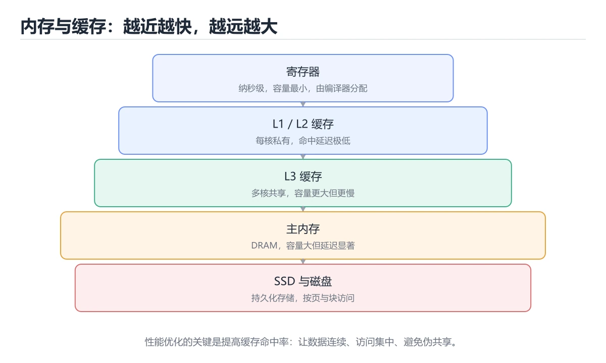
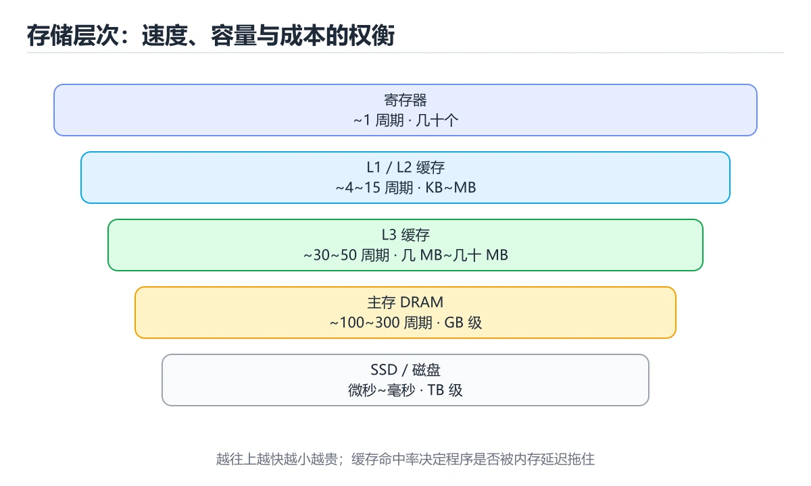
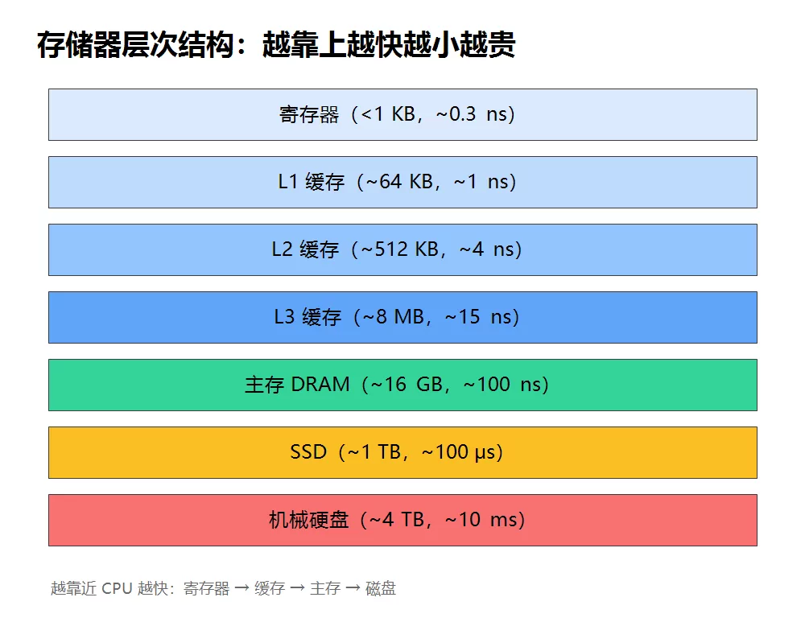

# 内存与缓存

> 内容更新时间：2026-10-06 · 学习阶段：进阶 · 预计用时：40 分钟





## 本节知识框架

**课程定位**：所属分类 `fundamentals`（计算机基础），课程主题 `内存与缓存`，学习阶段 进阶，建议用时 45 分钟。

本课主线：存储层次、虚拟内存、缓存局部性与伪共享。

**学完本课应当能够**
- 说清 `内存` 与 `缓存` 的含义与区别，并各举一个正例和一个反例。
- 用本课示例验证 `虚拟内存` 的行为，记录输入、输出与失败条件。
- 遇到「只比较缓存容量不看访问模式」这类问题时，能说出触发条件与修复顺序。

### 从概念到验证的学习链条

1. `内存`：先掌握 程序运行时保存指令、数据与对象的高速可寻址存储，再用它解释 `缓存` 为什么会出现。
2. `缓存`：先掌握 把计算或读取结果暂存到更快存储，后续请求直接复用，再用它解释 `虚拟内存` 为什么会出现。
3. `虚拟内存`：先掌握 按“内存与缓存”中 内存、缓存、虚拟内存 的实践顺序，把四个步骤排成从准备到复盘的合理顺序，再用它解释 `缓存行` 为什么会出现。
4. `缓存行`：先掌握 CPU 缓存与内存之间传输数据的最小块，通常为 64 字节，再用它解释 `局部性` 为什么会出现。
5. `局部性`：先掌握 时间局部性：刚访问过的数据很可能再次被访问，再用它解释 `MMU` 为什么会出现。
6. `MMU`：先掌握 程序看到的是虚拟地址，由操作系统和 MMU 映射到物理内存，再用它解释 本课示例的观察结果 为什么会出现。

**先修与衔接**：本课是「计算机基础」分类的第 8 课。先修内容：《CPU 工作原理》。《CPU 工作原理》里的 `CPU`、`指令` 是本课的前提。相关或后续课程：《字符编码与 Unicode》。

### 完成判据

- **定义关**：不看正文也能说明 `内存` 是 程序运行时保存指令、数据与对象的高速可寻址存储，并指出一个反例。
- **机制关**：能按“输入 → 转换 → 输出 → 验证”复述 `内存与缓存`，而不是只背结论。
- **示例关**：能运行或推演 `内存与缓存` 的 `text` 示例，并说明一个真实出现的标识符或字面量。
- **证据关**：能从 `内存与缓存` 的示例写出一个输入、处理、输出三元组，并说明它支持或反驳了本课的哪一条结论。
- **排错关**：能复现 只比较缓存容量不看访问模式，记录现象并按 先测量缓存未命中率和内存带宽 修复。
- **迁移关**：能把 `内存`、`缓存`、`虚拟内存`、`缓存行` 放进一个与 `内存与缓存` 不同的项目场景，并保持输入与验证条件可追踪。
- **复盘关**：学完 `内存与缓存` 后，用一句话写下仍然不确定的结论，并列出下一次验证需要的输入、环境和成功判据。

### 复习清单

- [ ] 能不看正文复述本课核心术语，并指出一个边界或反例。
- [ ] 能运行或推演本课示例，记录输入、输出与失败现象。
- [ ] 能完成一次自测，并把错题对照错误表定位原因。

**本课配图**



## 核心概念定义

| 术语 | 操作性定义 | 常见边界与风险 |
| --- | --- | --- |
| 内存 | 程序运行时保存指令、数据与对象的高速可寻址存储。 | 易错：无法解释真实性能差异；正确做法是先测量缓存未命中率和内存带宽。 |
| 缓存 | 把计算或读取结果暂存到更快存储，后续请求直接复用。 | 易错：无法解释真实性能差异；正确做法是先测量缓存未命中率和内存带宽。 |
| 虚拟内存 | 按“内存与缓存”中 内存、缓存、虚拟内存 的实践顺序，把四个步骤排成从准备到复盘的合理顺序。 | 越界、悬垂引用与释放顺序会破坏结论，必须在边界输入下复验。 |
| 缓存行 | CPU 缓存与内存之间传输数据的最小块，通常为 64 字节。 | 易错：浪费带宽并放大伪共享；正确做法是按工作负载选择行大小与预取策略。 |
| 局部性 | 时间局部性：刚访问过的数据很可能再次被访问。 | 易错：优化方向错误；正确做法是时间局部性 + 空间局部性决定命中率。 |
| MMU | 程序看到的是虚拟地址，由操作系统和 MMU 映射到物理内存。 | 易错：调试结论错误；正确做法是程序用虚拟地址，MMU 负责转换。 |

## 原理与运行机制

### 机制总览

**教材衔接：存储器的层次结构**

计算机的存储按「容量越大越慢、越快越贵」排列：

```text
寄存器   < 1 KB     ~0.3 ns
L1 缓存  ~64 KB     ~1 ns
L2 缓存  ~512 KB    ~4 ns
L3 缓存  ~8 MB      ~15 ns
主存     ~16 GB     ~100 ns
SSD      ~1 TB      ~100 μs
机械硬盘 ~4 TB      ~10 ms
```

越靠近 CPU 的存储越快，但容量越小。

**教材衔接：存储层次速查**

| 层级 | 速度 | 容量 | 易失 | 说明 |
| --- | --- | --- | --- | --- |
| 寄存器 | 最快 | 极小 | 是 | 编译器分配 |
| L1 缓存 | 约 4 周期 | 32 到 64 KB | 是 | 指令与数据分开 |
| L2 缓存 | 约 12 周期 | 数百 KB | 是 | 每核独享 |
| L3 缓存 | 约 40 周期 | 数 MB 到数十 MB | 是 | 多核共享 |
| 主存（DRAM） | 约 200 周期 | GB 级 | 是 | 需刷新 |
| SSD | 微秒级 | TB 级 | 否 | 随机读性能好 |
| HDD | 毫秒级 | TB 级 | 否 | 顺序读写远快于随机 |

### 机制拆解：每一步的输入、动作与输出

#### 1. `内存`
- 输入：`内存`；本步把 程序运行时保存指令、数据与对象的高速可寻址存储 当作判断规则。
- 动作：围绕 `内存` 保留中间状态，并记录它与 `缓存` 的对应关系。
- 输出：`缓存`，它可以被下一段代码、测试或记录继续使用。
- `内存` 的失败条件：当只比较缓存容量不看访问模式时，会出现无法解释真实性能差异。

#### 2. `缓存`
- 输入：`内存`；本步把 把计算或读取结果暂存到更快存储，后续请求直接复用 当作判断规则。
- 动作：围绕 `缓存` 保留中间状态，并记录它与 `虚拟内存` 的对应关系。
- 输出：`虚拟内存`，它可以被下一段代码、测试或记录继续使用。
- `缓存` 的失败条件：当只比较缓存容量不看访问模式时，会出现无法解释真实性能差异。

#### 3. `虚拟内存`
- 输入：`缓存`；本步把 按“内存与缓存”中 内存、缓存、虚拟内存 的实践顺序，把四个步骤排成从准备到复盘的合理顺序 当作判断规则。
- 动作：围绕 `虚拟内存` 保留中间状态，并记录它与 `缓存行` 的对应关系。
- 输出：`缓存行`，它可以被下一段代码、测试或记录继续使用。
- `虚拟内存` 的失败条件：越界、悬垂引用与释放顺序会破坏结论，必须在边界输入下复验。

#### 4. `缓存行`
- 输入：`虚拟内存`；本步把 CPU 缓存与内存之间传输数据的最小块，通常为 64 字节 当作判断规则。
- 动作：围绕 `缓存行` 保留中间状态，并记录它与 `局部性` 的对应关系。
- 输出：`局部性`，它可以被下一段代码、测试或记录继续使用。
- `缓存行` 的失败条件：当认为缓存行越大越好时，会出现浪费带宽并放大伪共享。

#### 5. `局部性`
- 输入：`缓存行`；本步把 时间局部性：刚访问过的数据很可能再次被访问 当作判断规则。
- 动作：围绕 `局部性` 保留中间状态，并记录它与 `MMU` 的对应关系。
- 输出：`MMU`，它可以被下一段代码、测试或记录继续使用。
- `局部性` 的失败条件：当忽略局部性原理时，会出现优化方向错误。

#### 6. `MMU`
- 输入：`局部性`；本步把 程序看到的是虚拟地址，由操作系统和 MMU 映射到物理内存 当作判断规则。
- 动作：围绕 `MMU` 保留中间状态，并记录它与 `本课示例的最终结果` 的对应关系。
- 输出：`本课示例的最终结果`，它可以被下一段代码、测试或记录继续使用。
- `MMU` 的失败条件：当混淆虚拟地址与物理地址时，会出现调试结论错误。

### 复现实验记录

- 环境：`内存与缓存` 使用 `text` 示例，固定 `内存`、`缓存`、`虚拟内存`、`缓存行` 作为第一组条件。
- 首轮输入：从示例中的第一个输入开始，预测 `内存` 会怎样变化。
- 基线观察：记录命令、输入、输出和错误原文，不用截图代替可复制的文本。
- 单变量修改：只改变 `内存`，观察 `MMU` 是否仍满足定义。
- 失败注入：复现 只比较缓存容量不看访问模式，确认现象是 无法解释真实性能差异。
- 记录结论：把“修改前、修改后、预期变化、实际变化”写成四列表，这样复盘 `内存与缓存` 时才能区分概念错误与实现错误。

## 典型应用场景

- **只比较缓存容量不看访问模式**：典型现象是无法解释真实性能差异；正确做法是先测量缓存未命中率和内存带宽。
- **认为缓存行越大越好**：典型现象是浪费带宽并放大伪共享；正确做法是按工作负载选择行大小与预取策略。
- **忽略 TLB 未命中**：典型现象是大页、随机访问场景性能异常；正确做法是同时观察 TLB、缓存和内存指标。
- **多线程共享写同一变量**：典型现象是缓存行反复失效，吞吐下降；正确做法是分片、对齐或减少共享写。

### 最小验证场景

- 准备：保留 `text` 示例的原始输入，先记录 `内存与缓存` 的基线输出和完整运行命令。
- 判定：新结果与 `内存与缓存` 的基线不同不等于错误；只有当差异破坏了 `内存` 的定义或错误表中的约束，才判定为失败。

### 选择与边界

- 使用 `内存` 时，先满足它的定义：程序运行时保存指令、数据与对象的高速可寻址存储；易错：无法解释真实性能差异；正确做法是先测量缓存未命中率和内存带宽。
- 使用 `缓存` 时，先满足它的定义：把计算或读取结果暂存到更快存储，后续请求直接复用；易错：无法解释真实性能差异；正确做法是先测量缓存未命中率和内存带宽。
- 使用 `虚拟内存` 时，先满足它的定义：按“内存与缓存”中 内存、缓存、虚拟内存 的实践顺序，把四个步骤排成从准备到复盘的合理顺序；越界、悬垂引用与释放顺序会破坏结论，必须在边界输入下复验。
- 使用 `缓存行` 时，先满足它的定义：CPU 缓存与内存之间传输数据的最小块，通常为 64 字节；易错：浪费带宽并放大伪共享；正确做法是按工作负载选择行大小与预取策略。
- 使用 `局部性` 时，先满足它的定义：时间局部性：刚访问过的数据很可能再次被访问；易错：优化方向错误；正确做法是时间局部性 + 空间局部性决定命中率。

## 代码/协议/SQL 示例

### 最小可验证示例

**教材衔接：原文最小示例**

```python
# 行优先遍历，空间局部性好，速度快
total = 0
for row in matrix:          # matrix 是二维列表
    for value in row:
        total += value
```

```c
// 两个变量挨在一起，可能落在同一个缓存行
int counterA;
int counterB;

// 优化：用填充把二者分开
int counterA;
char padding[64];
int counterB;
```

```python
# 缓存友好：按行遍历（顺序访问），命中率远高于按列
def sum_row_major(matrix):
    total = 0
    for row in matrix:            # 内存连续
        for value in row:
            total += value
    return total

def sum_col_major(matrix):
    total = 0
    rows, cols = len(matrix), len(matrix[0])
    for c in range(cols):
        for r in range(rows):     # 跨行跳跃，缓存不友好
            total += matrix[r][c]
    return total

# 分块（tiling）：把大矩阵切块，让数据留在缓存中
def transpose_blocked(matrix, block=32):
    rows, cols = len(matrix), len(matrix[0])
    result = [[0] * rows for _ in range(cols)]
    for i in range(0, rows, block):
        for j in range(0, cols, block):
            for r in range(i, min(i + block, rows)):
                for c in range(j, min(j + block, cols)):
                    result[c][r] = matrix[r][c]
    return result
```

### 示例精读：先找证据，再改一个条件

- 在 `内存与缓存` 中与 `内存` 对照：示例必须能支持 程序运行时保存指令、数据与对象的高速可寻址存储，否则说明这一段还缺少实现或验证步骤。
- 在 `内存与缓存` 中与 `缓存` 对照：示例必须能支持 把计算或读取结果暂存到更快存储，后续请求直接复用，否则说明这一段还缺少实现或验证步骤。
- 在 `内存与缓存` 中与 `虚拟内存` 对照：示例必须能支持 按“内存与缓存”中 内存、缓存、虚拟内存 的实践顺序，把四个步骤排成从准备到复盘的合理顺序，否则说明这一段还缺少实现或验证步骤。
- 在 `内存与缓存` 中与 `缓存行` 对照：示例必须能支持 CPU 缓存与内存之间传输数据的最小块，通常为 64 字节，否则说明这一段还缺少实现或验证步骤。
- `内存与缓存` 的示例没有抽取到函数调用或字面量；按行记录输入、控制流和输出，避免只背代码外形。

## 时间/空间复杂度或性能分析

**教材衔接：内存地址与虚拟内存**

程序看到的是**虚拟地址**，由操作系统和 MMU 映射到物理内存。这样做的好处：

- 每个进程有独立地址空间，互不干扰。
- 内存不够时可以把不常用的页换出到磁盘。
- 便于内存共享与保护。

| 概念 | 说明 |
| --- | --- |
| 缓存行 | 通常 64 字节，是缓存与内存交换的最小单位 |
| 相联度 | 直接映射、组相联、全相联 |
| 替换策略 | LRU、伪 LRU、随机 |
| 写策略 | 写直达、写回 |
| 虚拟地址 | 程序看到的地址，由 MMU 转换 |
| 物理地址 | 实际内存地址 |
| 页表 | 保存虚拟页到物理页的映射 |
| TLB | 缓存页表项，加速地址转换 |
| 缺页 | 访问的页不在内存，触发异常调入 |
| 伪共享 | 两个线程改同一缓存行中不同变量，导致缓存行来回失效 |

**教材衔接：深入补充：内存与缓存**

前面已经建立了基本概念。这一节换一个角度，把内存与缓存放进真实工程里，
重点回答三件事：transpose_blocked 解决什么问题、依赖哪些前提、在什么条件下失效。

1. 存储层次按容量、速度、成本和带宽分层：寄存器、L1、L2、L3、主存、SSD 和磁盘逐级变大变慢。
2. 时间局部性指刚访问的数据很可能再次访问，空间局部性指相邻地址很可能被连续访问。
3. 缓存以缓存行为单位搬运，常见行为 64 字节；顺序遍历通常比跳跃访问更高效。
4. 直接映射实现简单但冲突多，组相联在复杂度和命中率之间取平衡，全相联命中最好但硬件成本高。
5. 写直达保证缓存与内存一致但流量大，写回延迟写内存但需要脏位和替换时写回。
6. 多核需要缓存一致性协议维护可见性；伪共享会让不同核心反复争用同一条缓存行。
7. 预取器能根据访问模式提前加载数据，但错误预取会污染缓存并占用带宽。

| 错误做法或假设 | 后果 | 正确做法 |
| --- | --- | --- |
| 只比较缓存容量不看访问模式 | 无法解释真实性能差异 | 先测量缓存未命中率和内存带宽 |
| 认为缓存行越大越好 | 浪费带宽并放大伪共享 | 按工作负载选择行大小与预取策略 |
| 忽略 TLB 未命中 | 大页、随机访问场景性能异常 | 同时观察 TLB、缓存和内存指标 |
| 多线程共享写同一变量 | 缓存行反复失效，吞吐下降 | 分片、对齐或减少共享写 |

一个服务在单线程下很快，扩展到多线程后反而变慢。排查时先看是否共享写、锁竞争或伪共享；再用性能计数器观察缓存未命中、上下文切换和内存带宽。解决顺序通常是先减少共享写，再调整数据结构布局，最后才考虑更大缓存。

写操作频繁且局部性好时，可以减少重复写内存的流量。

用同一组数据分别做顺序遍历、跨步遍历和多线程共享计数三种实验；记录耗时、缓存未命中率和内存带宽，写出一份包含原因与优化前后对比的报告。

缓存优化改善的是访问局部性和数据搬运效率，不改变算法复杂度，也不能弥补错误的并发设计。先保证正确性和可测量的瓶颈，再做布局级优化。

1. 不看资料讲清「内存与缓存」的核心模型，并各举一个正例和反例。
2. 再对照表逐行解释容易混淆的概念，每个概念补一个反例。
3. 跟着工作示例做一遍，改变一个条件并预测结果。
4. 用自测问答检查理解，错题回到对应小节重新阅读。
5. 用 transpose_blocked 做一个最小交付，附上运行命令与失败样例。

**测量方法**：以 `内存与缓存` 的 `内存` 场景为对象，固定输入跑一遍记录基线，再把规模或并发度提高一个数量级复测；两次结果的差值与波动范围才是结论依据。

### 需要控制的变量与记录项

- `内存与缓存` 的 `内存`：固定它的版本、输入范围和资源上限，分别记录速度、内存与失败率的变化。
- `内存与缓存` 的 `缓存`：固定它的版本、输入范围和资源上限，分别记录速度、内存与失败率的变化。
- `内存与缓存` 的 `虚拟内存`：固定它的版本、输入范围和资源上限，分别记录速度、内存与失败率的变化。
- `内存与缓存` 的 `缓存行`：固定它的版本、输入范围和资源上限，分别记录速度、内存与失败率的变化。
- `内存与缓存` 的 `局部性`：固定它的版本、输入范围和资源上限，分别记录速度、内存与失败率的变化。
- `内存与缓存` 中 `内存` 的边界：易错：无法解释真实性能差异；正确做法是先测量缓存未命中率和内存带宽。达到边界时不要外推，必须重新测量。
- `内存与缓存` 中 `缓存` 的边界：易错：无法解释真实性能差异；正确做法是先测量缓存未命中率和内存带宽。达到边界时不要外推，必须重新测量。
- `内存与缓存` 中 `虚拟内存` 的边界：越界、悬垂引用与释放顺序会破坏结论，必须在边界输入下复验。达到边界时不要外推，必须重新测量。
- `内存与缓存` 中 `缓存行` 的边界：易错：浪费带宽并放大伪共享；正确做法是按工作负载选择行大小与预取策略。达到边界时不要外推，必须重新测量。
- `内存与缓存` 中 `局部性` 的边界：易错：优化方向错误；正确做法是时间局部性 + 空间局部性决定命中率。达到边界时不要外推，必须重新测量。

## 常见误区与易错点

| 容易写错的做法 | 实际现象 | 原因与正确做法 |
| --- | --- | --- |
| 只比较缓存容量不看访问模式 | 无法解释真实性能差异 | 先测量缓存未命中率和内存带宽 |
| 认为缓存行越大越好 | 浪费带宽并放大伪共享 | 按工作负载选择行大小与预取策略 |
| 忽略 TLB 未命中 | 大页、随机访问场景性能异常 | 同时观察 TLB、缓存和内存指标 |
| 多线程共享写同一变量 | 缓存行反复失效，吞吐下降 | 分片、对齐或减少共享写 |
| 认为缓存和内存一样大 | 容量估算错误 | 缓存容量以 MB 计，只能容纳热点数据 |
| 忽略局部性原理 | 优化方向错误 | 时间局部性 + 空间局部性决定命中率 |
| 多维数组按列遍历 | 命中率低、速度慢 | 按行遍历以利用连续内存 |
| 忽略缓存行大小 | 伪共享导致性能骤降 | 把高频写变量分隔到不同缓存行 |
| 频繁小对象分配 | 缓存与分配器压力大 | 用对象池或批量分配 |
| 认为 TLB 无限大 | 大内存随机访问变慢 | 大页（HugePages）可减少 TLB 未命中 |
| 混淆虚拟地址与物理地址 | 调试结论错误 | 程序用虚拟地址，MMU 负责转换 |
| 认为缺页只在首次访问发生 | 结论片面 | 换出后再访问同样会缺页 |
| 用链表遍历大数据 | 指针跳转导致缓存未命中 | 优先用连续数组 |
| 忽略写策略差异 | 数据一致性判断错 | 写直达保证一致但更慢，写回延迟写回 |

### 现场 1：只比较缓存容量不看访问模式

**症状**：无法解释真实性能差异。

**根因与修复**：先测量缓存未命中率和内存带宽。

**自检**：在本课示例里复现「只比较缓存容量不看访问模式」，改成先测量缓存未命中率和内存带宽后重跑；如果症状消失且失败路径按预期变化，说明定位正确。

### 现场 2：认为缓存行越大越好

**症状**：浪费带宽并放大伪共享。

**根因与修复**：按工作负载选择行大小与预取策略。

**自检**：在本课示例里复现「认为缓存行越大越好」，改成按工作负载选择行大小与预取策略后重跑；如果症状消失且失败路径按预期变化，说明定位正确。

### 现场 3：忽略 TLB 未命中

**症状**：大页、随机访问场景性能异常。

**根因与修复**：同时观察 TLB、缓存和内存指标。

**自检**：在本课示例里复现「忽略 TLB 未命中」，改成同时观察 TLB、缓存和内存指标后重跑；如果症状消失且失败路径按预期变化，说明定位正确。

### 现场 4：多线程共享写同一变量

**症状**：缓存行反复失效，吞吐下降。

**根因与修复**：分片、对齐或减少共享写。

**自检**：在本课示例里复现「多线程共享写同一变量」，改成分片、对齐或减少共享写后重跑；如果症状消失且失败路径按预期变化，说明定位正确。

### 现场 5：认为缓存和内存一样大

**症状**：容量估算错误。

**根因与修复**：缓存容量以 MB 计，只能容纳热点数据。

**自检**：在本课示例里复现「认为缓存和内存一样大」，改成缓存容量以 MB 计，只能容纳热点数据后重跑；如果症状消失且失败路径按预期变化，说明定位正确。

### 现场 6：忽略局部性原理

**症状**：优化方向错误。

**根因与修复**：时间局部性 + 空间局部性决定命中率。

**自检**：在本课示例里复现「忽略局部性原理」，改成时间局部性 + 空间局部性决定命中率后重跑；如果症状消失且失败路径按预期变化，说明定位正确。

### 现场 7：多维数组按列遍历

**症状**：命中率低、速度慢。

**根因与修复**：按行遍历以利用连续内存。

**自检**：在本课示例里复现「多维数组按列遍历」，改成按行遍历以利用连续内存后重跑；如果症状消失且失败路径按预期变化，说明定位正确。

### 现场 8：忽略缓存行大小

**症状**：伪共享导致性能骤降。

**根因与修复**：把高频写变量分隔到不同缓存行。

**自检**：在本课示例里复现「忽略缓存行大小」，改成把高频写变量分隔到不同缓存行后重跑；如果症状消失且失败路径按预期变化，说明定位正确。

### 现场 9：频繁小对象分配

**症状**：缓存与分配器压力大。

**根因与修复**：用对象池或批量分配。

**自检**：在本课示例里复现「频繁小对象分配」，改成用对象池或批量分配后重跑；如果症状消失且失败路径按预期变化，说明定位正确。

## 与其他知识点的关系

**教材衔接：复习与迁移**

### 概念复述

- 用一句话说明「内存与缓存」解决什么问题：存储层次、虚拟内存、缓存局部性与伪共享。
- 写出内存、缓存、虚拟内存之间的关系，并各举一个例子。
- 说出本课最容易混淆的两个概念，以及区分它们的判据。

### 正文逐节复核

- **内存地址与虚拟内存**：程序看到的是**虚拟地址**，由操作系统和 MMU 映射到物理内存。
- **缓存行与伪共享**：缓存不是按字节加载，而是按**缓存行**（通常 64 字节）整块加载。
- **深入补充：内存与缓存**：前面已经建立了基本概念。这一节换一个角度，把内存与缓存放进真实工程里。


### 迁移练习

把「内存与缓存」的结论迁移到相邻主题，每次迁移都写清预测与证据：

- **先修**：`CPU 工作原理`。本课默认这些内容已经掌握。
- **相关或后续**：`字符编码与 Unicode`。本课术语会在这些课程里继续使用。
- **术语归属**：`内存`、`缓存`、`虚拟内存` 的定义以本课「核心概念定义」为准，换到其他课程时先确认定义是否被改写。

### 先修与后续术语接口

- `CPU 工作原理`：两者通过本分类的学习顺序衔接，阅读时重点比较各自的输入与失败条件。
- `字符编码与 Unicode`：两者通过本分类的学习顺序衔接，阅读时重点比较各自的输入与失败条件。

### 容易混淆的相邻概念

- `内存` 与 `缓存`：前者强调 程序运行时保存指令、数据与对象的高速可寻址存储；后者强调 把计算或读取结果暂存到更快存储，后续请求直接复用。判断时分别检查两条定义的适用范围，不要只看名称相似就互换。
- `缓存` 与 `虚拟内存`：前者强调 把计算或读取结果暂存到更快存储，后续请求直接复用；后者强调 按“内存与缓存”中 内存、缓存、虚拟内存 的实践顺序，把四个步骤排成从准备到复盘的合理顺序。判断时分别检查两条定义的适用范围，不要只看名称相似就互换。
- `虚拟内存` 与 `缓存行`：前者强调 按“内存与缓存”中 内存、缓存、虚拟内存 的实践顺序，把四个步骤排成从准备到复盘的合理顺序；后者强调 CPU 缓存与内存之间传输数据的最小块，通常为 64 字节。判断时分别检查两条定义的适用范围，不要只看名称相似就互换。
- `缓存行` 与 `局部性`：前者强调 CPU 缓存与内存之间传输数据的最小块，通常为 64 字节；后者强调 时间局部性：刚访问过的数据很可能再次被访问。判断时分别检查两条定义的适用范围，不要只看名称相似就互换。
- `局部性` 与 `MMU`：前者强调 时间局部性：刚访问过的数据很可能再次被访问；后者强调 程序看到的是虚拟地址，由操作系统和 MMU 映射到物理内存。判断时分别检查两条定义的适用范围，不要只看名称相似就互换。

## 自测题与参考答案

> 先独立作答，再对照参考答案；答案都能在本课正文、术语表或错误表里找到依据。

### 自测 1（概念复述）

不看正文，写出 `内存` 的操作性定义，并说明它与 `缓存` 的区别。

**参考答案**：程序运行时保存指令、数据与对象的高速可寻址存储。

`缓存` 的定位是：把计算或读取结果暂存到更快存储，后续请求直接复用；两者的差别要从适用对象与失败模式上说明。

### 自测 2（排错）

本课错误表记录了「只比较缓存容量不看访问模式」这类做法。请写出它会出现的现象、根因，以及修复顺序。

**参考答案**：现象是无法解释真实性能差异；正确做法是先测量缓存未命中率和内存带宽。修复时先复现现象并保留证据，再改动一处假设重跑，确认现象消失。

### 自测 3（动手验证）

运行本课的 `text` 示例，把其中的 `1` 换成一个边界值后重新运行，记录输出与错误信息。

**参考答案**：正常输入下 `text` 示例应当复现正文给出的结果；把 `1` 换成边界值后，如果结果改变或报错，先核对它是否满足 `内存与缓存` 中`内存` 的适用范围，再检查错误表里是否有同类现象。

### 自测 4（代码阅读）

阅读本课开头的 `text` 示例，说明它体现了`内存` 的哪一条性质，并指出改动哪个输入会让这条性质不再成立。

**参考答案**：`内存` 的定义是 程序运行时保存指令、数据与对象的高速可寻址存储，示例正是在实现这条定义。改动与 `内存` 有关的一个输入后，如果结果不再符合 `内存与缓存` 的正文描述，就说明该性质只在当前前提成立。

### 自测 5（迁移）

把 `内存与缓存` 的方法迁移到自己的项目：围绕 `内存` 写出一个与错误表同类的风险点，并说明触发条件和检验方式。

**参考答案**：例如「忽略写策略差异」，它会导致数据一致性判断错；检验方式是按写直达保证一致但更慢，写回延迟写回改一处再复现，确认现象消失且没有引入新的失败分支。

### 自测 6（对比）

用一个表格对比 `内存` 与 `缓存`：各写一行适用场景、一行失败表现。

**参考答案**：`内存` 的定义是程序运行时保存指令、数据与对象的高速可寻址存储；`缓存` 的定义是把计算或读取结果暂存到更快存储，后续请求直接复用。两者的失败表现分别对应本课错误表里与本术语相关的行。

### 自测 7（排错顺序）

面对「只比较缓存容量不看访问模式」引发的问题，请把“复现 无法解释真实性能差异 → 保留证据 → 先测量缓存未命中率和内存带宽 → 回归验证”四步写成可执行的检查清单。

**参考答案**：第一步按无法解释真实性能差异复现；第二步记录输入、版本与完整报错；第三步按先测量缓存未命中率和内存带宽只改一处；第四步重跑并确认失败路径也按预期变化。

### 自测 8（边界判断）

针对 `MMU`，分别写出“可以使用”的条件和“结论不再成立”的条件。

**参考答案**：易错：调试结论错误；正确做法是程序用虚拟地址，MMU 负责转换。 同时要把 `MMU` 的定义 程序看到的是虚拟地址，由操作系统和 MMU 映射到物理内存 与实际输入逐项对照。

### 自测 9（机制重建）

不看正文，按输入、转换、输出、验证四段重建 `内存` → `缓存` → `虚拟内存` → `缓存行` 的作用链。

**参考答案**：起点是 `内存` 的定义 程序运行时保存指令、数据与对象的高速可寻址存储；中间每一步都保留可观察状态；终点由 `MMU` 检查，失败时回到错误表定位第一个偏离定义的步骤。

### 自测 10（综合排错）

在 `内存与缓存` 中，现象是 数据一致性判断错。请围绕 忽略写策略差异 写出最小复现、关键证据、修复动作和回归验证，并说明为什么不能只凭一次运行下结论。

**参考答案**：先复现 忽略写策略差异，记录输入与完整错误；再按 写直达保证一致但更慢，写回延迟写回 只改一处。回归时同时跑正常路径和边界路径，只有两次结果都可解释，才把修复视为完成。

### 自测 11（一分钟复述）

用每分钟约 200 字的速度复述 `内存与缓存`：先给主问题，再按顺序说出 `内存`、`缓存`、`虚拟内存`、`缓存行`，最后给一个失败案例。

**自评标准**：主问题必须对应 存储层次、虚拟内存、缓存局部性与伪共享；每个术语都要能接上一句定义或边界；失败案例必须写成可观察现象，不能用“可能有风险”代替证据。

## 术语速查

| 术语 | 一句话说明 |
| --- | --- |
| `内存` | 程序运行时保存指令、数据与对象的高速可寻址存储。 |
| `缓存` | 把计算或读取结果暂存到更快存储，后续请求直接复用。 |
| `虚拟内存` | 按“内存与缓存”中 内存、缓存、虚拟内存 的实践顺序，把四个步骤排成从准备到复盘的合理顺序。 |
| `缓存行` | CPU 缓存与内存之间传输数据的最小块，通常为 64 字节。 |
| `局部性` | 时间局部性：刚访问过的数据很可能再次被访问。 |
| `MMU` | 程序看到的是虚拟地址，由操作系统和 MMU 映射到物理内存。 |

**术语关系**：`内存`（程序运行时保存指令、数据与对象的高速可寻址存储） → `缓存`（把计算或读取结果暂存到更快存储） → `虚拟内存`（按“内存与缓存”中 内存、缓存、虚拟内存 的实践顺序） → `缓存行`（CPU 缓存与内存之间传输数据的最小块）。

## 考点精讲

`内存与缓存` 的题库有 6 道题，下面逐题给出题干、正确项与判断依据：先自己作答，再核对正确项，最后回到正文对应小节复核。

### 考点 1：第 1 题

- **题目**：代码语言为 `c`，选自 `内存与缓存` 的 `内存` 部分。课程问题为存储层次、虚拟内存、缓存局部性与伪共享。哪一项描述与代码一致？
- **正确项**：代码里出现了 `缓存行` 这个名字
- **判断依据**：这道题落在术语 `内存` 上：程序运行时保存指令、数据与对象的高速可寻址存储。复习时把 `内存` 的定义、适用边界和一个反例一起说清楚，再回到「核心概念定义」核对原文。

### 考点 2：第 2 题

- **题目**：缓存之所以有效，主要依赖什么原理？
- **正确项**：程序访问的局部性
- **判断依据**：这道题落在术语 `缓存` 上：把计算或读取结果暂存到更快存储，后续请求直接复用。复习时把 `缓存` 的定义、适用边界和一个反例一起说清楚，再回到「核心概念定义」核对原文。

### 考点 3：第 3 题

- **题目**：什么是伪共享（false sharing）？
- **正确项**：多线程修改同一缓存行中的不同变量
- **判断依据**：这道题落在术语 `缓存` 上：把计算或读取结果暂存到更快存储，后续请求直接复用。复习时把 `缓存` 的定义、适用边界和一个反例一起说清楚，再回到「核心概念定义」核对原文。

### 考点 4：第 4 题

- **题目**：按“内存与缓存”中 内存、缓存、虚拟内存 的实践顺序，把四个步骤排成从准备到复盘的合理顺序。
- **正确项**：先明确 内存 的输入、输出与约束 → 写出最小示例并核对 缓存 的基线结果 → 只改一个变量，记录边界与失败路径的变化 → 固定版本与证据，把“内存与缓存”的结论写成可复现记录
- **判断依据**：这道题落在术语 `内存` 上：程序运行时保存指令、数据与对象的高速可寻址存储。复习时把 `内存` 的定义、适用边界和一个反例一起说清楚，再回到「核心概念定义」核对原文。

### 考点 5：第 5 题

- **题目**：TLB 的作用是？
- **正确项**：缓存页表项
- **判断依据**：这道题落在术语 `缓存` 上：把计算或读取结果暂存到更快存储，后续请求直接复用。复习时把 `缓存` 的定义、适用边界和一个反例一起说清楚，再回到「核心概念定义」核对原文。

### 考点 6：第 6 题

- **题目**：课程 `存储层次、虚拟内存、缓存局部性与伪共享。`。在 `内存与缓存` 里，`内存`、`缓存` 与下面哪些选项属于同一层概念？（多选）
- **正确项**：内存；缓存
- **判断依据**：这道题落在术语 `内存` 上：程序运行时保存指令、数据与对象的高速可寻址存储。复习时把 `内存` 的定义、适用边界和一个反例一起说清楚，再回到「核心概念定义」核对原文。

### 考点 7：`内存`

- **要点**：程序运行时保存指令、数据与对象的高速可寻址存储。
- **内存 的边界**：易错：无法解释真实性能差异；正确做法是先测量缓存未命中率和内存带宽。

### 考点 8：`缓存`

- **要点**：把计算或读取结果暂存到更快存储，后续请求直接复用。
- **缓存 的边界**：易错：无法解释真实性能差异；正确做法是先测量缓存未命中率和内存带宽。

### 考点 9：`虚拟内存`

- **要点**：按“内存与缓存”中 内存、缓存、虚拟内存 的实践顺序，把四个步骤排成从准备到复盘的合理顺序。
- **虚拟内存 的边界**：越界、悬垂引用与释放顺序会破坏结论，必须在边界输入下复验。

### 考点 10：`缓存行`

- **要点**：CPU 缓存与内存之间传输数据的最小块，通常为 64 字节。
- **缓存行 的边界**：易错：浪费带宽并放大伪共享；正确做法是按工作负载选择行大小与预取策略。

### 考点 11：`局部性`

- **要点**：时间局部性：刚访问过的数据很可能再次被访问。
- **局部性 的边界**：易错：优化方向错误；正确做法是时间局部性 + 空间局部性决定命中率。

### 考点 12：`MMU`

- **要点**：程序看到的是虚拟地址，由操作系统和 MMU 映射到物理内存。
- **MMU 的边界**：易错：调试结论错误；正确做法是程序用虚拟地址，MMU 负责转换。

### 考点 13：排错——只比较缓存容量不看访问模式

- **现象**：无法解释真实性能差异。
- **处理**：先测量缓存未命中率和内存带宽。

### 考点 14：排错——认为缓存行越大越好

- **现象**：浪费带宽并放大伪共享。
- **处理**：按工作负载选择行大小与预取策略。

### 考点 15：综合辨析——`内存` 与 `MMU`

- **辨析点**：`内存` 的定义是 程序运行时保存指令、数据与对象的高速可寻址存储；`MMU` 的定义是 程序看到的是虚拟地址，由操作系统和 MMU 映射到物理内存。
- **答题要求**：面对 `内存与缓存` 的题目，先判断描述的是 `内存` 还是 `MMU`，再归到对应定义，最后写出一个会让该定义失效的边界输入。

### 考点 16：排错评分点

- **现象分**：能写出 无法解释真实性能差异，而不是只写“程序有错”。
- **证据分**：保留触发 只比较缓存容量不看访问模式 的输入、版本和错误原文。
- **修复分**：按 先测量缓存未命中率和内存带宽 只改一处，并同时回归正常路径与边界路径。

## 内容元数据

- 内容版本：v2.0
- 最后更新：2026-10-06
- 学习阶段：进阶
- 适用环境：通用计算机体系结构知识；本课聚焦 内存。
- 内容来源：内置结构化课程与工程实践整理
- 相关主题：内存、缓存、虚拟内存、缓存行、局部性、MMU
- 质量版本：P0 测验标准 + P1 覆盖扩展 + P2 体验补全

## 参考资料与复核

- 最后复核：2026-10-04
- 下次复核：2027-10-17
- 复核范围：版本兼容、API 行为、安全建议与工程实践
- 来源性质：官方文档、标准或权威教材；本课核对关键词：内存、缓存、虚拟内存、缓存行、局部性、MMU。

| 参考资料 | 本课用途 |
| --- | --- |
| [Arm 架构文档](https://developer.arm.com/documentation) | 处理器与内存体系结构 |
| [Intel 开发者文档](https://www.intel.com/content/www/us/en/developer/articles/technical/intel-sdm.html) | x86 指令集与体系结构 |
| [Linux 内核文档](https://docs.kernel.org/) | 操作系统与硬件接口 |

| [本课术语索引：内存与缓存](#核心概念定义) | 按本课输入、术语边界和错误表现逐项核对 |
> 「内存与缓存」的链接用于离线阅读后的延伸核对；App 不会自动联网。