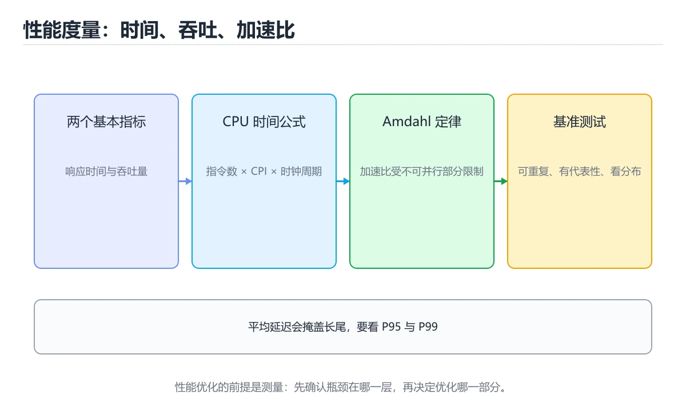
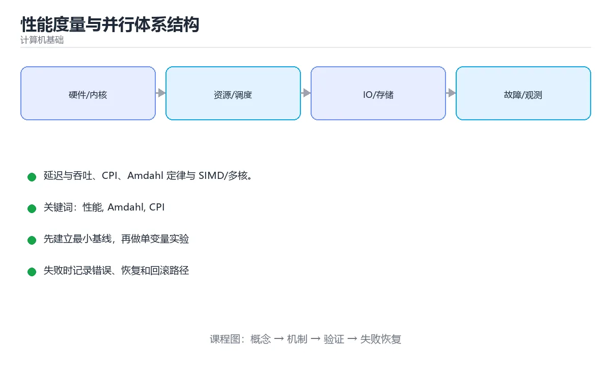

# 性能度量与并行体系结构

> 内容更新时间：2026-10-06 · 学习阶段：进阶 · 预计用时：40 分钟





## 本节知识框架

**课程定位**：所属分类为「计算机基础」，课程主题为「性能度量与并行体系结构」，学习阶段为「进阶」，建议用时 40 分钟。

**本课要解决的主问题**：延迟与吞吐、CPI、Amdahl 定律与 SIMD/多核。

| 学习层次 | 要回答的问题 | 完成判据 |
| --- | --- | --- |
| 概念层 | 「性能度量与并行体系结构」有哪些必须区分的对象与术语？ | 能用自己的话定义核心术语，并各举一个正例和一个反例。 |
| 机制层 | 这些对象按什么顺序发生作用，输入如何变成输出？ | 能画出或写出机制步骤，并说明每一步的失败条件。 |
| 应用层 | 什么场景适合使用「性能度量与并行体系结构」，什么场景不适合？ | 能给出一个真实场景、一个最小示例和一个边界案例。 |
| 性能层 | 时间、空间、吞吐或延迟受哪些量影响？ | 能说出复杂度或性能瓶颈的证据来源；没有证据时明确写“材料未提供”。 |
| 复习层 | 怎样确认自己不是只记住了结论？ | 能独立完成本课自测，并把错误定位到概念、机制、示例或边界。 |

### 阅读路线

1. 先读「核心概念定义」，建立「性能」等对象的精确定义。
2. 再读「原理与运行机制」，把定义串成可重复的过程。
3. 用「代码/协议/SQL 示例」验证过程，并只改一个条件观察结果变化。
4. 最后检查性能、易错点、知识关系与自测题，形成可复习的证据链。

**前置知识**：《浮点数与校验码》

**学习位置**：本课位于《浮点数与校验码》之后；如果前一课的自测不能通过，应先回补再继续。

**后续衔接**：下一课《实战：追踪程序的全生命周期》会继续使用本课术语，学完后建议立即完成一次自测。

**教材衔接：学习目标**

- 能用自己的话解释性能度量与并行体系结构解决了什么问题，而不是只背术语。
- 能说清 「性能」、「Amdahl」、「CPI」、「基准测试」 之间的关系，并分别举出一个例子。
- 能把 性能 放回「性能度量与并行体系结构」的知识体系，说明它和 Amdahl 的边界。
- 能完成本课练习，并用验收标准检查自己的结果。

> 一句话摘要：延迟与吞吐、CPI、Amdahl 定律与 SIMD/多核。

**教材衔接：前置知识**

- 先完成上一课《浮点数与校验码》；如果已经掌握，可以直接用本课练习自测。
- 本课阶段：进阶。建议先完成「浮点数与校验码」，或确认自己能独立跑通正文里的 ValueError 示例。
- 开始前先复习：性能、Amdahl、CPI。
- 卡在 性能 上时不要跳过：把输入、预期和实际输出写成三行，再回头读正文。

**教材衔接：本课小结**

性能优化的顺序是：**先测量（分位数与基准）、再找瓶颈（CPU/内存/IO/锁）、然后用 Amdahl 判断收益上限、最后才动手改代码**。

## 核心概念定义

> 阅读约定：本课先给「性能度量与并行体系结构」相关术语的操作性定义与适用边界；正文里的口语化说法与定义冲突时，以定义和可复现示例为准。

| 术语 | 操作性定义 | 本课中的边界 |
| --- | --- | --- |
| 性能 | 系统在给定负载下表现出的吞吐、延迟、资源占用和稳定性。 | 仅在「性能度量与并行体系结构」明确给出的输入、版本与资源条件下成立。 |
| Amdahl | 为一个 CPU 密集任务建立单线程基线，再用多线程和 SIMD 两种方式优化；记录 P50/P99、吞吐、CPU 利用率和扩展比，并用 Amdahl 定律解释差距。 | 仅在「性能度量与并行体系结构」明确给出的输入、版本与资源条件下成立。 |
| CPI | 优化任一项都能提速：减少指令数（更好算法/编译器）、降低 CPI（流水线、乱序、缓存命中）、提高主频（工艺与功耗限制）。 | 仅在「性能度量与并行体系结构」明确给出的输入、版本与资源条件下成立。 |
| 基准测试 | 在固定环境和输入下重复测量性能，得到可比较的基线。 | 仅在「性能度量与并行体系结构」明确给出的输入、版本与资源条件下成立。 |

### 定义如何使用

在「性能度量与并行体系结构」中判断一个说法是否成立，先确认它使用的是哪个对象的定义，再检查输入规模、运行环境与失败路径。定义不是口号，而是后续推导、代码示例和自测题共享的约束。

## 原理与运行机制

### 机制总览

1. **建立输入**：把「性能」按本课定义整理成可观察、可重复的输入条件。
2. **执行转换**：围绕「Amdahl」执行本课的核心步骤；每一步都记录中间状态，避免只看最终输出。
3. **产生输出**：得到「CPI」后，用正文示例或协议/SQL 结果核对输出是否符合预期。
4. **改变一个条件**：只替换一个边界条件或环境参数，观察「性能度量与并行体系结构」的结论是否仍然成立。

| 阶段 | 关注对象 | 失败时应检查 |
| --- | --- | --- |
| 输入 | 性能 | 类型、范围、编码、版本或前置状态是否满足定义。 |
| 处理 | Amdahl | 顺序、可见性、锁、路由、事务或调度规则是否被破坏。 |
| 输出 | CPI | 结果是否可复现，错误是否被正确传播而不是被吞掉。 |

本课的机制结论要用「性能度量与并行体系结构」自己的示例验证。「性能度量与并行体系结构」没有给出某个数量级、吞吐或内存数据时，本课把该判断标为“材料未提供”，不从相邻主题外推。

**教材衔接：两个基本指标**

**响应时间（延迟）**是单次任务耗时，**吞吐量**是单位时间完成的任务数。二者常互相矛盾：批处理提升吞吐但增加单次延迟，低延迟优化（如禁用合并）会降低吞吐。

性能 = 1 / 响应时间；「快 N 倍」指响应时间变为 1/N。

**教材衔接：Amdahl 定律**

加速比 = 1 / ((1 - p) + p / s)，其中 p 是可并行比例、s 是并行度。含义：**串行部分决定上限**。若只有 50% 可并行，无论多少核，加速比都不超过 2 倍。这解释了「加机器不一定变快」。

**教材衔接：并行体系结构**

| 层次 | 手段 | 说明 |
| --- | --- | --- |
| 指令级 | 流水线、超标量、乱序执行 | 单核内并行 |
| 数据级 | SIMD / 向量指令 | 一条指令处理多个数据 |
| 线程级 | 多核、超线程 | 同时执行多个线程 |
| 异构 | GPU / NPU / FPGA | 大规模数据并行交给加速器 |

多核的代价是**缓存一致性与伪共享**：跨核同步会带来总线流量，线程间共享同一缓存行的不同变量会互相拖慢（用填充对齐解决）。

**教材衔接：核心指标速查**

| 指标 | 含义 | 什么时候看 |
| --- | --- | --- |
| 吞吐（Throughput） | 单位时间处理的请求数 | 容量与成本评估 |
| 延迟（Latency） | 单个请求耗时 | 用户体验 |
| P50 / P95 / P99 | 分位延迟 | 长尾与超时风险 |
| 并发数 | 同时在处理的请求数 | 与延迟、吞吐联动 |
| 错误率 | 失败请求占比 | 稳定性 |
| 饱和度 | 资源使用接近上限的程度 | 容量预警 |
| 排队时间 | 请求在队列中等待 | 定位瓶颈在服务还是排队 |

利特尔法则：`并发数 = 吞吐 × 平均延迟`。用它可以从两个指标反推第三个。

## 典型应用场景

| 场景 | 典型输入或前提 | 期望产物 |
| --- | --- | --- |
| 学习验证 | 使用本课最小示例和 性能、Amdahl | 能复现正文结论，并解释每一步。 |
| 工程落地 | 把「性能度量与并行体系结构」放入真实模块或服务边界 | 输出可观测、失败可定位、参数可配置。 |
| 故障排查 | 只改一个版本、规模、输入或依赖条件 | 能区分概念错误、实现错误和环境差异。 |

判断「性能度量与并行体系结构」的场景是否成立，标准是能否写出输入、处理、输出和失败路径；材料中没有出现的数据在本课标注为“材料未提供”，不用推测替代证据。

## 代码/协议/SQL 示例

### 最小可验证示例

下面保留《性能度量与并行体系结构》原文中的最小示例。先预测《性能度量与并行体系结构》示例的输出，再按正文步骤运行或推演；示例依赖外部环境时，同时记录版本与输入。

```text
程序耗时 = 指令数 × CPI × 时钟周期 = 指令数 × CPI / 主频
```

**教材衔接：阿姆达尔定律速查**

加速比上限为 `1 / (1 - p)`，其中 p 是可并行比例：

| 可并行比例 | 理论最大加速比 |
| --- | --- |
| 50% | 2 倍 |
| 75% | 4 倍 |
| 90% | 10 倍 |
| 95% | 20 倍 |
| 99% | 100 倍 |

结论：把最多时间花在**仍然串行**的那部分，收益最大。

```python
import statistics
import time

def measure(func, repeat: int = 30, warmup: int = 3):
    """基准测量：预热 + 多轮采样 + 报告分位数。"""
    for _ in range(warmup):
        func()

    samples = []
    for _ in range(repeat):
        start = time.perf_counter()
        func()
        samples.append((time.perf_counter() - start) * 1000)   # 毫秒

    samples.sort()
    return {
        "median_ms": round(statistics.median(samples), 3),
        "p95_ms": round(samples[int(len(samples) * 0.95) - 1], 3),
        "min_ms": round(samples[0], 3),
        "max_ms": round(samples[-1], 3),
    }

def percentile(values, p: float) -> float:
    """线性插值计算分位数，便于报表统一口径。"""
    if not values:
        raise ValueError("空集合")
    ordered = sorted(values)
    if len(ordered) == 1:
        return ordered[0]
    position = (len(ordered) - 1) * p
    lower = int(position)
    upper = min(lower + 1, len(ordered) - 1)
    weight = position - lower
    return ordered[lower] * (1 - weight) + ordered[upper] * weight

def little_law(throughput: float, latency_seconds: float) -> float:
    """由吞吐与平均延迟估算并发数。"""
    return throughput * latency_seconds

print(percentile([10, 20, 30, 40, 50], 0.95))
print(little_law(throughput=200, latency_seconds=0.05))   # 约 10 个并发
```

## 时间/空间复杂度或性能分析

**复杂度证据**：「性能度量与并行体系结构」的现有材料没有给出渐近时间或空间复杂度的明确结论，本课只做定性检查，不补写未经验证的 $O$ 记号。

| 维度 | 本课关注点 | 判断依据 |
| --- | --- | --- |
| 时间/延迟 | 「性能度量与并行体系结构」的主要步骤是否会随输入规模、并发度或网络往返增长。 | 以正文复杂度、基准数据或可重复测量为准。 |
| 空间/内存 | 中间状态、缓存、副本、连接或索引是否随规模增长。 | 记录峰值内存与数据副本，不只看最终结果。 |
| 吞吐/资源 | 版本、调度、锁、IO、序列化或协议开销是否成为瓶颈。 | 固定环境做对照实验，改变一个变量。 |

评估「性能度量与并行体系结构」时要区分“正确性成立”和“性能达标”两件事；材料没有给出基准时，本课只保留量级来源与测量方法，不写不可验证的绝对数字。

**教材衔接：CPU 性能公式**

```text
程序耗时 = 指令数 × CPI × 时钟周期 = 指令数 × CPI / 主频
```

优化任一项都能提速：减少指令数（更好算法/编译器）、降低 CPI（流水线、乱序、缓存命中）、提高主频（工艺与功耗限制）。

**教材衔接：深入补充：性能度量与并行体系结构**

前面已经建立了基本概念。这一节换一个角度，把性能度量与并行体系结构放进真实工程里，
重点回答三件事：性能 为什么存在、内部如何运转、什么时候会失效。

### 一、核心模型

性能度量必须同时看延迟、吞吐、资源利用率和错误率；并行体系结构通过多核、SIMD 和缓存层次提升吞吐，但并行效率受 Amdahl 定律、通信和内存带宽限制。

```text
定义指标 → 建立基线 → 压测与采样 → 定位瓶颈 → 优化单点 → 回归验证 → 持续监控
```

### 二、关键机制拆解

1. 平均延迟会掩盖长尾，必须看 P50、P95、P99 和最大值。
2. 吞吐是单位时间完成的工作量，延迟是单次完成时间，两者不一定同向变化。
3. CPU 利用率高不一定是瓶颈，等待 I/O、锁和内存带宽也会造成停顿。
4. Amdahl 定律说明可并行部分比例决定理论上限，串行部分会限制加速比。
5. 多核扩展还受缓存一致性、伪共享、锁竞争和内存带宽影响。
6. SIMD 适合数据并行且分支少的计算，能显著提升吞吐但增加实现复杂度。
7. 性能优化必须可重复测量：固定环境、固定负载、相同指标和足够样本。

### 三、对照表：抓住容易混淆的边界

| 维度 | 一侧 | 另一侧 |
| --- | --- | --- |
| 延迟 | 一次请求耗时 | 关注用户体验和超时 |
| 吞吐 | 单位时间处理量 | 关注容量和成本 |
| 并发 | 同时在处理的任务数 | 不一定等于并行执行 |
| 并行 | 同一时刻真正同时执行 | 受核心数和算法限制 |

### 四、工作示例

接口平均延迟 50ms，但 P99 达到 2s。优化重点应放在长尾：检查 GC、连接池、锁等待、热点数据和重试；即使平均值不变，降低 P99 也能显著提升用户满意度。

### 五、常见误区与失效边界

| 错误做法或假设 | 后果 | 正确做法 |
| --- | --- | --- |
| 只看平均值 | 忽略长尾和超时 | 同时报告分位数和错误率 |
| 没有基线直接优化 | 无法判断是否真的变快 | 先建立可重复的基准 |
| 在开发机比较生产性能 | 环境差异导致错误结论 | 控制硬件、数据和并发变量 |
| 把 CPU 占用当成唯一指标 | 漏掉 I/O、锁和内存瓶颈 | 使用性能计数器和火焰图综合分析 |

### 六、场景推演

服务扩容后吞吐没有提升。分析发现共享锁和伪共享导致多核互相等待，增加核数反而增加一致性流量。减少共享写、分片状态和调整数据布局后，扩展效率才恢复。

### 七、自测问答

**Q1：为什么平均延迟不够？**

少量慢请求会拉高尾延迟，平均值无法反映最差用户体验。

**Q2：延迟和吞吐有什么区别？**

延迟是单次耗时，吞吐是单位时间完成量。

**Q3：Amdahl 定律说明什么？**

串行部分限制整体加速上限，增加并行资源不能无限提升。

**Q4：多核扩展的主要障碍有哪些？**

锁竞争、缓存一致性、伪共享、内存带宽和串行部分。

### 八、小项目：把知识变成可检查的产出

为一个 CPU 密集任务建立单线程基线，再用多线程和 SIMD 两种方式优化；记录 P50/P99、吞吐、CPU 利用率和扩展比，并用 Amdahl 定律解释差距。

### 九、适用边界

性能度量服务于决策，不是数字游戏。优化前先确认瓶颈和用户目标，优化后用相同方法验证，避免把复杂度换成不可维护的代码。

### 十、完成检查清单

- [ ] 能定义延迟、吞吐和错误率指标
- [ ] 能建立可重复的性能基线
- [ ] 能使用分位数和火焰图定位问题
- [ ] 能解释并行扩展限制
- [ ] 能验证优化前后收益

### 十一、复习顺序

1. 合上教程复述 性能，确认能说出它解决的三个问题。
2. 再对照表逐行解释容易混淆的概念，每个概念补一个反例。
3. 跟着工作示例做一遍，改变一个条件并预测结果。
4. 用自测问答检查理解，错题回到对应小节重新阅读。
5. 用 ValueError 做一个最小交付，附上运行命令与失败样例。

> 复习不是重读一遍，而是离开原文重新产出：复述、改写、验证、复盘。

## 常见误区与易错点

> 复核《性能度量与并行体系结构》的易错点时，优先保留原文的错误表、故障现场与排错路径；每条修正都要能用本课示例复验。

| 易错点 | 常见表现 | 正确做法 |
| --- | --- | --- |
| 只背结论 | 能复述「性能度量与并行体系结构」的定义，却说不清输入、输出与边界。 | 回到机制步骤，用最小示例逐一验证。 |
| 混淆相邻概念 | 把本课对象与相邻主题的对象当成同一类。 | 先比较定义、资源归属、生命周期和失败模式。 |
| 忽略版本与环境 | 在开发机通过后直接外推到生产环境。 | 固定版本、输入和资源条件，再记录可复现结果。 |

**教材衔接：基准测试的陷阱**

1. 只报平均值：应给出 P50/P95/P99 分布，尾延迟往往才是用户体验。
2. 忽略预热：JIT、缓存、连接池都需要预热，应丢弃前若干轮。
3. 测试环境与生产不一致（数据量、并发度、网络延迟）。
4. 用玩具数据掩盖缓存友好或 SQL 计划差异。
5. 不做统计显著性判断，把噪声当优化成果。

**教材衔接：常见错误与排查**

| 容易写错的做法 | 实际现象 | 原因与正确做法 |
| --- | --- | --- |
| 只看平均延迟 | 长尾被掩盖 | 同时报告 P95 / P99 与最大值 |
| 不做预热就测 | 首次执行包含冷启动 | 预热若干轮再采样 |
| 只测一轮 | 结果被噪声主导 | 多轮采样并报告分布 |
| 在共享环境测性能 | 数据不可复现 | 固定环境与配置，隔离干扰 |
| 混用毫秒与秒 | 数据差 1000 倍 | 统一单位并标注 |
| 用 Debug 构建测性能 | 结论严重偏低 | 用 Release 构建 |
| 忽略阿姆达尔定律 | 优化收益不及预期 | 先优化串行部分 |
| 混淆吞吐与延迟 | 优化方向错误 | 明确目标：更高吞吐还是更低延迟 |
| 压测只加压不限流 | 打爆下游 | 同步对下游做容量评估 |
| 忽略排队时间 | 误判服务变慢 | 区分服务耗时与排队耗时 |

**教材衔接：故障现场**

### 现场 1：不做预热就测

**症状**：在《性能度量与并行体系结构》的复现场景中，首次执行包含冷启动。

**根因**：当出现“不做预热就测”时，执行路径已经绕过了《性能度量与并行体系结构》的关键约束，最终以“首次执行包含冷启动”暴露出来；修复前必须先确认约束在哪里失效。

**修复**：针对《性能度量与并行体系结构》的问题，预热若干轮再采样。

**验证**：保留《性能度量与并行体系结构》里触发“首次执行包含冷启动”的输入、版本和日志，按“预热若干轮再采样”完成修改后原样重放；只有失败现象消失且相邻场景仍可解释，才保留改动。

### 现场 2：在共享环境测性能

**症状**：在《性能度量与并行体系结构》的复现场景中，数据不可复现。

**根因**：“数据不可复现”只是表层结果。向上追溯会落到“在共享环境测性能”这一步，因为它省略了《性能度量与并行体系结构》的约束，使实现行为和预期模型发生了偏离。

**修复**：针对《性能度量与并行体系结构》的问题，固定环境与配置，隔离干扰。

**验证**：在《性能度量与并行体系结构》中按“固定环境与配置，隔离干扰”调整后，从“在共享环境测性能”的触发条件重放同一条路径，确认“数据不可复现”不再出现，并补一个相邻边界用例检查没有引入新问题。

### 现场 3：混用毫秒与秒

**症状**：在《性能度量与并行体系结构》的复现场景中，数据差 1000 倍。

**根因**：触发点是把“混用毫秒与秒”当成安全做法。它没有满足《性能度量与并行体系结构》要求的前提，因此先表现为“数据差 1000 倍”；排查时先完整复现这一段，再核对输入、配置与依赖。

**修复**：针对《性能度量与并行体系结构》的问题，统一单位并标注。

**验证**：在《性能度量与并行体系结构》中按“统一单位并标注”调整后，从“混用毫秒与秒”的触发条件重放同一条路径，确认“数据差 1000 倍”不再出现，并补一个相邻边界用例检查没有引入新问题。

## 与其他知识点的关系

| 关系 | 课程 | 为什么 |
| --- | --- | --- |
| 先修 | 《浮点数与校验码》 | 本课会直接使用它的概念或操作前提。 |
| 关联 | 《密码学原语》 | 用于横向比较或把本课结论迁移到相邻主题。 |
| 关联 | 《性能剖析与基准测试：九种生态横向对照》 | 用于横向比较或把本课结论迁移到相邻主题。 |
| 前置顺序 | 《浮点数与校验码》 | 同分类中安排在本课之前，建议先完成其自测。 |
| 后续顺序 | 《实战：追踪程序的全生命周期》 | 同分类中安排在本课之后，会继续使用本课术语。 |

把「性能度量与并行体系结构」放回知识体系时，不只要记住“前面学过什么”，还要说明两个主题在输入、机制、资源边界和失败模式上的差异。这样才能把单课知识迁移到项目、排障和后续课程。

## 自测题与参考答案

> 先独立作答《性能度量与并行体系结构》的自测题，再对照答案与解析；每处判断都要能在本课正文或示例中找到依据。

### 自测 1

Amdahl 定律告诉我们？

A. 主频决定一切
B. 核数越多越快
C. 串行部分决定并行加速的上限
D. 延迟一定随吞吐提升

**参考答案**：串行部分决定并行加速的上限

**解析**：在「性能度量与并行体系结构」里，串行部分决定并行加速的上限。若只有一部分可并行，再多核也无法突破上限。这道题的关键在「性能度量与并行体系结构」的性能、Amdahl、CPI：先确认题干“Amdahl 定律告诉我们”问的是哪一步，再排除偷换前提的选项。

### 自测 2

阅读这段加速比计算，下面哪项判断是正确的？

```python
p, s = 0.5, 8.0                    # 可并行比例 50%，并行度 8
speedup = 1 / ((1 - p) + p / s)    # 约等于 1.78
```

A. 结果约 1.78 说明串行部分限制了上限，只增加并行度无法继续提速
B. 把并行度从 8 提到 80，加速比就会接近 8 倍
C. Amdahl 定律只适用于单核程序，多核场景应直接看平均延迟
D. 把可并行比例提高到 0.9 之后，串行部分仍然不是瓶颈

**参考答案**：结果约 1.78 说明串行部分限制了上限，只增加并行度无法继续提速

**解析**：正确判断是结果约 1.78 说明串行部分限制了上限，只增加并行度无法继续提速。Amdahl 定律写成 1 / ((1 - p) + p / s)，串行部分不随并行度缩小，因此把并行度从 8 提到 80 收益依然有限；只有提高可并行比例，例如进一步拆解串行段或减少同步开销，加速比才会明显上升。性能度量还要配合 P95 与 P99 与预热后的稳定数据，避免把噪声当成优化成果。

### 自测 3

围绕“性能度量与并行体系结构”中的 性能、Amdahl、CPI，下列哪两项是本课强调的实践判断？

A. 验证 Amdahl 时要固定版本并覆盖边界输入，结论才可复现
B. 把 Amdahl 的单次运行结果当成所有版本和规模都成立
C. 学习 性能 时要同时说明输入、输出和失败路径，不能只看正常流程
D. 只要 性能 的常规示例通过，就可以跳过边界与异常路径

**参考答案**：验证 Amdahl 时要固定版本并覆盖边界输入，结论才可复现；学习 性能 时要同时说明输入、输出和失败路径，不能只看正常流程

**解析**：本课把性能度量与并行体系结构拆成概念、示例与故障现场三部分，因此判断 性能 时必须同时交代输入、输出和失败路径，这使“学习 性能 时要同时说明输入、输出和失败路径，不能只看正常流程”成立。在性能度量与并行体系结构里，判断 Amdahl 时要固定版本与边界输入，所以“验证 Amdahl 时要固定版本并覆盖边界输入，结论才可复现”才可复现。

**教材衔接：复习与自测**

- [ ] 能用利特尔法则在吞吐、延迟、并发间换算。
- [ ] 性能报告包含中位数、P95、P99 与样本量。
- [ ] 测量时有预热与多轮采样。
- [ ] 记得用 Release 构建做性能测试。
- [ ] 优化前先算可并行比例的理论上限。

**教材衔接：动手练习**

> 本课练习重点：围绕「性能、Amdahl、CPI」完成复述、实验和交付，每个结果都要能被别人检查。

先画出 ValueError 的流程，再手算一组输入，最后运行核对。

### 练习 1：建立心智模型（10 分钟）

合上教程，用 3～5 句话回答：

1. 性能度量与并行体系结构解决了什么问题？
2. 如果没有它，会出现什么具体后果？
3. 它和「Amdahl」是什么关系？

验收标准：说明 性能 与 Amdahl 的分工，并写出一个失效场景。

### 练习 2：做一次可控实验（20 分钟）

从正文中选一个最小示例，完成以下操作：

1. 先预测修改一个参数、输入或步骤后的结果。
2. 再实际执行或逐步推演，记录真实结果。
3. 如果结果与预测不同，写出差异原因。

**验收标准**：把 ValueError 当作原例，改动一次Amdahl的取值，记录命令、输出与差异原因；五步里缺任意一步都算未完成。

### 练习 3：交付一个小结果（30 分钟）

用表格、真值表或计算过程把抽象概念落到一个可核对的结果上。

任务要求：

- 结果必须能被别人检查，不能只写“我已经理解了”。
- 至少覆盖「性能」和「Amdahl」两个关键词。
- 写出 1 个仍然不确定的问题，以及下一步如何验证。

> 提示：时间有限时优先做练习 1 和练习 2；练习 3 可以拆成两次完成。

**教材衔接：可运行练习**

### 任务 1：先跑通，再解释

```python
import statistics
import time

def measure(func, repeat: int = 30, warmup: int = 3):
    """基准测量：预热 + 多轮采样 + 报告分位数。"""
    for _ in range(warmup):
        func()

    samples = []
    for _ in range(repeat):
        start = time.perf_counter()
        func()
        samples.append((time.perf_counter() - start) * 1000)   # 毫秒

    samples.sort()
    return {
        "median_ms": round(statistics.median(samples), 3),
        "p95_ms": round(samples[int(len(samples) * 0.95) - 1], 3),
        "min_ms": round(samples[0], 3),
        "max_ms": round(samples[-1], 3),
    }

def percentile(values, p: float) -> float:
    """线性插值计算分位数，便于报表统一口径。"""
    if not values:
        raise ValueError("空集合")
    ordered = sorted(values)
    if len(ordered) == 1:
        return ordered[0]
    position = (len(ordered) - 1) * p
    lower = int(position)
    upper = min(lower + 1, len(ordered) - 1)
    weight = position - lower
    return ordered[lower] * (1 - weight) + ordered[upper] * weight

def little_law(throughput: float, latency_seconds: float) -> float:
    """由吞吐与平均延迟估算并发数。"""
    return throughput * latency_seconds

print(percentile([10, 20, 30, 40, 50], 0.95))
print(little_law(throughput=200, latency_seconds=0.05))   # 约 10 个并发
```

### 任务 2：只改一个条件

把「性能度量与并行体系结构」的最小示例复制一份，只改一个条件再跑一次：

- 改动点：把 Amdahl 换成边界值，其他输入保持原样。
- 预测：先写下「性能度量与并行体系结构」在改动后的输出或错误信息，再运行。
- 记录：对照改动前后的结果，指出差异出在哪一步。
- 验收：换回原条件能复现原结果，改动只影响性能。

### 任务 3：迁移到自己的数据

用同一套思路处理一组你自己的 性能 数据，保持输出格式与任务 1 一致。

**教材衔接：本课复习清单**

离开本课前，逐项确认：

- [ ] 不看解析，能说出「Amdahl 定律告诉我们？」的判断依据。
- [ ] 不看解析，能说出「性能基准测试应该重点报告？」的判断依据。
- [ ] 不看解析，能说出「提升吞吐量常常会？」的判断依据。
- [ ] 不看解析，能说出「P95 延迟表示什么？」的判断依据。
- [ ] 不看解析，能说出「基准测试结果不可靠的常见原因是？」的判断依据。
- [ ] 跑通「性能度量与并行体系结构」的最小示例，并记录一次失败输入的处理方式。
- [ ] 把本课最容易混淆的两个概念写成一句话对照。

| 复盘项 | 记录 |
| --- | --- |
| 已经能独立解释的考点 |  |
| 仍然说不清的概念 |  |
| 下一步验证动作 |  |

---

## 术语速查

| 术语 | 一句话说明 |
| --- | --- |
| `性能` | 系统在给定负载下表现出的吞吐、延迟、资源占用和稳定性。 |
| `Amdahl` | 为一个 CPU 密集任务建立单线程基线，再用多线程和 SIMD 两种方式优化；记录 P50/P99、吞吐、CPU 利用率和扩展比，并用 Amdahl 定律解释差距。 |
| `CPI` | 优化任一项都能提速：减少指令数（更好算法/编译器）、降低 CPI（流水线、乱序、缓存命中）、提高主频（工艺与功耗限制）。 |
| `基准测试` | 在固定环境和输入下重复测量性能，得到可比较的基线。 |

## 考点精讲

### 考点 1：概念判断·性能

- **题目**：Amdahl 定律告诉我们？
- **判断依据**：在「性能度量与并行体系结构」里，串行部分决定并行加速的上限。若只有一部分可并行，再多核也无法突破上限。这道题的关键在「性能度量与并行体系结构」的性能、Amdahl、CPI：先确认题干“Amdahl 定律告诉我们”问的是哪一步，再排除偷换前提的选项。

### 考点 2：代码阅读·Amdahl 定律

- **题目**：阅读这段加速比计算，下面哪项判断是正确的？
- **正确判断**：结果约 1.78 说明串行部分限制了上限，只增加并行度无法继续提速
- **判断依据**：正确判断是结果约 1.78 说明串行部分限制了上限，只增加并行度无法继续提速。Amdahl 定律写成 1 / ((1 - p) + p / s)，串行部分不随并行度缩小，因此把并行度从 8 提到 80 收益依然有限；只有提高可并行比例，例如进一步拆解串行段或减少同步开销，加速比才会明显上升。性能度量还要配合 P95 与 P99 与预热后的稳定数据，避免把噪声当成优化成果。

### 考点 3：概念判断·性能

- **题目**：提升吞吐量常常会？
- **判断依据**：批处理提升吞吐但牺牲单次响应时间，二者需要权衡。作答时，先用性能建立输入与输出的基线，再把增加单次延迟代入边界条件核对，结论才能复现。如果只凭关键词作答，很容易把「降低内存占用」、「降低单次延迟」与「增加单次延迟」混在一起；「性能度量与并行体系结构」要求先交代性能、Amdahl、CPI的前提再下结论，所以“增加单次延迟”只在题干“提升吞吐量常常会”给定的条件下成立。

### 考点 4：概念判断·性能

- **题目**：P95 延迟表示什么？
- **判断依据**：平均值会掩盖长尾，用 P95/P99 才能反映用户实际体感与超时风险。在「性能度量与并行体系结构」里，其他选项：P95 表示 95% 的请求耗时不超过该值。在「性能度量与并行体系结构」里，这道题要求区分概念与边界，「95% 的请求耗时不超过该值」只有在题干给出的前提下才成立，而「最快的 5% 请求的耗时」、「平均延迟乘以 0.95」缺少同一组条件。

### 考点 5：多选辨析·性能

- **题目**：围绕“性能度量与并行体系结构”中的 性能、Amdahl、CPI，下列哪两项是本课强调的实践判断？
- **判断依据**：本课把性能度量与并行体系结构拆成概念、示例与故障现场三部分，因此判断 性能 时必须同时交代输入、输出和失败路径，这使“学习 性能 时要同时说明输入、输出和失败路径，不能只看正常流程”成立。在性能度量与并行体系结构里，判断 Amdahl 时要固定版本与边界输入，所以“验证 Amdahl 时要固定版本并覆盖边界输入，结论才可复现”才可复现。

### 考点 6：填空·性能

- **题目**：补全代码：「性能度量与并行体系结构」示例中，下面这行代码缺少哪个关键字或函数名？请填入 ____。 `print(little_law(____=200, latency_seconds=0.05)) # 约 10 个并发`
- **判断依据**：在「性能度量与并行体系结构」里，throughput。这道题的关键在「性能度量与并行体系结构」的性能、Amdahl、CPI：先确认题干“补全代码”问的是哪一步，再排除偷换前提的选项。回到性能、Amdahl、CPI本身再看一遍：只有“throughput”与题干“throughput”的前提一致，结论才成立。

## English Overview

**Title:** Performance & Parallelism

**Summary:** Latency, throughput, CPI, Amdahl and parallelism.

**Category:** Fundamentals
**Level:** 进阶
**Key terms:** 性能, Amdahl, CPI, 基准测试, SIMD

## 内容元数据

- 内容版本：v2.0
- 最后更新：2026-10-06
- 学习阶段：进阶
- 适用环境：通用计算机体系结构知识；本课聚焦 性能。
- 内容来源：内置结构化课程与工程实践整理
- 相关主题：性能、Amdahl、CPI、基准测试、SIMD
- 质量版本：P0 测验标准 + P1 覆盖扩展 + P2 体验补全

## 参考资料与复核

- 最后复核：2026-10-04
- 下次复核：2027-10-17
- 复核范围：版本兼容、API 行为、安全建议与工程实践
- 来源性质：官方文档、标准或权威教材；正文为离线教学重组

| 参考资料 | 本课用途 |
| --- | --- |
| [CS50 计算机科学导论](https://cs50.harvard.edu/x/) | 计算机科学综合入门 |
| [Intel 开发者文档](https://www.intel.com/content/www/us/en/developer/articles/technical/intel-sdm.html) | x86 指令集与体系结构 |
| [MDN 计算机基础](https://developer.mozilla.org/docs/Learn_web_development/Core) | Web 相关计算机基础 |

> 「性能度量与并行体系结构」的链接用于离线阅读后的延伸核对；App 不会自动联网。
