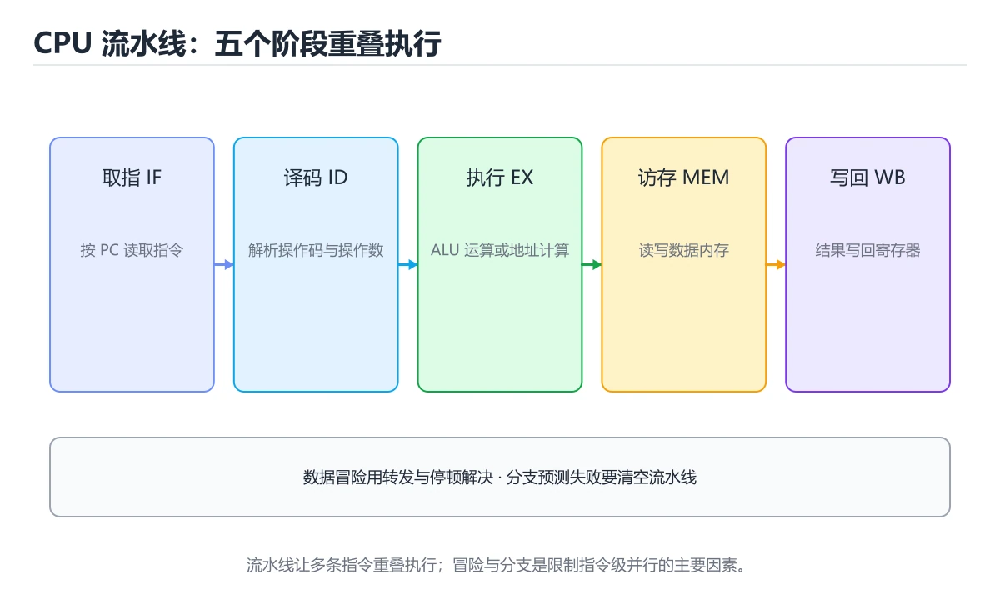

# CPU 流水线与指令级并行

> 内容更新时间：2026-10-06 · 学习阶段：高级 · 预计用时：35 分钟




## 本节知识框架

**课程定位**：所属分类 `fundamentals`（计算机基础），课程主题 `CPU 流水线与指令级并行`，学习阶段 高级，建议用时 45 分钟。

本课主线：理解取指译码执行、流水线冒险、分支预测和乱序执行。

**学完本课应当能够**
- 说清 `流水线` 与 `分支预测` 的含义与区别，并各举一个正例和一个反例。
- 用本课示例验证 `乱序执行` 的行为，记录输入、输出与失败条件。
- 遇到「以为流水线能线性加速」这类问题时，能说出触发条件与修复顺序。

### 从概念到验证的学习链条

1. `流水线`：先掌握 流水线把指令执行拆成多级并重叠推进，提高单位时间吞吐，再用它解释 `分支预测` 为什么会出现。
2. `分支预测`：先掌握 CPU 在执行分支前猜测下一步路径并提前取指，猜错需要清空流水线，再用它解释 `乱序执行` 为什么会出现。
3. `乱序执行`：先掌握 CPU 在不改变程序结果的前提下调整指令执行顺序以利用空闲单元，再用它解释 `冒险` 为什么会出现。
4. `冒险`：先掌握 数据、控制和结构冒险会造成停顿，转发和分支预测用于减少损失，再用它解释 本课示例的观察结果 为什么会出现。

**先修与衔接**：本课是「计算机基础」分类的第 26 课。先修内容：《实战：追踪程序的全生命周期》。《实战：追踪程序的全生命周期》里的 `实战`、`perf` 是本课的前提。相关或后续课程：《SIMD 与向量化计算》。

### 完成判据

- **定义关**：不看正文也能说明 `流水线` 是 流水线把指令执行拆成多级并重叠推进，提高单位时间吞吐，并指出一个反例。
- **机制关**：能按“输入 → 转换 → 输出 → 验证”复述 `CPU 流水线与指令级并行`，而不是只背结论。
- **示例关**：能运行或推演 `CPU 流水线与指令级并行` 的 `text` 示例，并说明一个真实出现的标识符或字面量。
- **证据关**：能指出 `CPU 流水线与指令级并行` 示例里的 调用了 `enumerate()`，并说明它支持或反驳了本课的哪一条结论。
- **排错关**：能复现 以为流水线能线性加速，记录现象并按 先分析冒险比例，再评估实际上限 修复。
- **迁移关**：能把 `流水线`、`分支预测`、`乱序执行`、`冒险` 放进一个与 `CPU 流水线与指令级并行` 不同的项目场景，并保持输入与验证条件可追踪。
- **复盘关**：学完 `CPU 流水线与指令级并行` 后，用一句话写下仍然不确定的结论，并列出下一次验证需要的输入、环境和成功判据。

### 复习清单

- [ ] 能不看正文复述本课核心术语，并指出一个边界或反例。
- [ ] 能运行或推演本课示例，记录输入、输出与失败现象。
- [ ] 能完成一次自测，并把错题对照错误表定位原因。

## 核心概念定义

| 术语 | 操作性定义 | 常见边界与风险 |
| --- | --- | --- |
| 流水线 | 流水线把指令执行拆成多级并重叠推进，提高单位时间吞吐。 | 易错：忽略数据相关、控制相关与停顿；正确做法是先分析冒险比例，再评估实际上限。 |
| 分支预测 | CPU 在执行分支前猜测下一步路径并提前取指，猜错需要清空流水线。 | 易错：分支密集代码性能波动大；正确做法是用性能计数器观察分支预测失败率。 |
| 乱序执行 | CPU 在不改变程序结果的前提下调整指令执行顺序以利用空闲单元。 | 只在「CPU 在不改变程序结果的前提下调整指令执行顺序以利用空闲单元」这一前提下成立，换输入或换环境要重新验证。 |
| 冒险 | 数据、控制和结构冒险会造成停顿，转发和分支预测用于减少损失。 | 易错：忽略数据相关、控制相关与停顿；正确做法是先分析冒险比例，再评估实际上限。 |

## 原理与运行机制

### 机制总览

**教材衔接：核心知识**

### 1. 流水线把指令执行拆成多级并重叠推进，提高单位时间吞吐。

- 关键做法：先用 enumerate 建立 流水线 的基线，再逐步加入边界与失败条件。
- 验证标准：流水线 的结果可复现、错误可解释、失败能恢复。

### 2. 数据、控制和结构冒险会造成停顿，转发和分支预测用于减少损失。

把这条结论放回「CPU 流水线与指令级并行」的完整流程里展开：

- 正文依据：能用自己的话解释：流水线把指令执行拆成多级并重叠推进，提高单位时间吞吐。
- 落地检查：把「2. 数据、控制和结构冒险会造成停顿，转发和分支预测用于减少损失。」改写成一条可执行的核对项，逐条验证输入、超时与失败路径。

### 3. 乱序执行在保持程序语义的前提下重排指令，受依赖和重排序缓冲限制。

把这条结论放回「CPU 流水线与指令级并行」的完整流程里展开：

- 正文依据：能用自己的话解释：数据、控制和结构冒险会造成停顿，转发和分支预测用于减少损失。
- 落地检查：把「3. 乱序执行在保持程序语义的前提下重排指令，受依赖和重排序缓冲限制。」改写成一条可执行的核对项，逐条验证输入、超时与失败路径。

**教材衔接：关键流程**

**教材衔接：实践路径**

**教材衔接：零基础精讲：把CPU 流水线与指令级并行真正讲透**

### 先建立一个直觉

把计算机看成一个分层机器：逻辑门组成运算单元，指令驱动数据移动，缓存缩短等待时间，操作系统把硬件抽象成可编程接口。落到本课，「CPU 流水线与指令级并行」关心的是 流水线 与 分支预测 的配合，也就是说这条直觉要在 核心知识 里被具体验证。

本课的摘要可以当作一张地图：理解取指译码执行、流水线冒险、分支预测和乱序执行。

### 逐步拆解

1. 澄清输入与目标。先写清「CPU 流水线与指令级并行」要解决的问题、合法输入范围和成功标准，再进入后续步骤。
2. 描述处理过程。把「流水线、分支预测、乱序执行、冒险」映射到具体步骤，每步都要求能单独验证。
3. 定义输出。把 enumerate 的返回值、日志和失败信号都写清楚，缺一项都不算完整。
4. 让「CPU 流水线与指令级并行」的失败路径尽早暴露：把流水线推到边界值，记录错误信息、重试或降级动作，以及人工兜底条件。
5. 用同一个流水线输入跑两遍：一遍按正文步骤，一遍故意跳过一步，比较输出并解释为什么必须按顺序执行。

### 把正文串成一条执行链

- **1. 流水线把指令执行拆成多级并重叠推进，提高单位时间吞吐。**：在「CPU 流水线与指令级并行」里，「1. 流水线把指令执行拆成多级并重叠推进，提高单位时间吞吐。」这一步要先写清输入与预期，再记录实际结果和差异；结果不符时回到对应小节核对前提。
- **2. 数据、控制和结构冒险会造成停顿，转发和分支预测用于减少损失。**：在「CPU 流水线与指令级并行」里，「2. 数据、控制和结构冒险会造成停顿，转发和分支预测用于减少损失。」这一步要先写清输入与预期，再记录实际结果和差异；结果不符时回到对应小节核对前提。
- **3. 乱序执行在保持程序语义的前提下重排指令，受依赖和重排序缓冲限制。**：在「CPU 流水线与指令级并行」里，「3. 乱序执行在保持程序语义的前提下重排指令，受依赖和重排序缓冲限制。」这一步要先写清输入与预期，再记录实际结果和差异；结果不符时回到对应小节核对前提。
- **考点 1：核心知识 的代码阅读题**：先独立作答，再回到本课正文核对 enumerate 的执行路径；答错时记录是哪一个前提被忽略。
- **考点 2：关于「数据、控制和结构冒险会造成停顿，转发和分支预测用于减少损失。」，下列说法正确的是？**：先独立作答，再回到本课对应小节核对判断依据；答错时记录是哪一个前提被忽略。
- **考点 3：关于「乱序执行在保持程序语义的前提下重排指令，受依赖和重排序缓冲限制。」，下列说法正确的是？**：先独立作答，再回到本课对应小节核对判断依据；答错时记录是哪一个前提被忽略。

### 从测验反推易错点

- 参考判断：流水线把指令执行拆成多级并重叠推进，提高单位时间吞吐。
- 自问：如果去掉题干里的一个限定词，结论还成立吗？

- 参考判断：数据、控制和结构冒险会造成停顿，转发和分支预测用于减少损失。

- 参考判断：乱序执行在保持程序语义的前提下重排指令，受依赖和重排序缓冲限制。

**检查点 4：本课的核心学习目标是什么？**

- 参考判断：理解取指译码执行、流水线冒险、分支预测和乱序执行。

**检查点 5：以下哪些术语与CPU 流水线与指令级并行直接相关？（多选）**

- 参考判断：流水线、分支预测

### 工程排错顺序

| 先查什么 | 要得到的证据 | 判断标准 |
| --- | --- | --- |
| 输入如何表示，位宽与精度是否明确？ | 日志、输入样例、测试或指标 | 能复现并解释，才算定位 |
| 数据经过哪些层级，瓶颈在哪一层？ | 日志、输入样例、测试或指标 | 能复现并解释，才算定位 |
| 顺序、分支与并行如何影响结果？ | 日志、输入样例、测试或指标 | 能复现并解释，才算定位 |
| 是否用基准测试验证了推断？ | 日志、输入样例、测试或指标 | 能复现并解释，才算定位 |

### 变式训练

1. 把 流水线 放进一个只有单机、没有额外依赖的小项目，先保证正确再扩展。
2. 把 流水线 的输入规模扩大十倍，记录时间、内存和失败路径，找出第一个瓶颈。
3. 把 分支预测 换成失败输入，记录错误信息与恢复动作。
5. 把 enumerate 的执行顺序调换一次，记录哪个中间结果先错；顺序敏感的地方就是本课的关键约束。
6. 在低带宽或低算力条件下重跑 分支预测，记录降级路径是否仍然可用。


### 迁移案例库

围绕 enumerate 重复同一套方法，每完成一轮就把差异写进笔记。

#### 迁移案例 1：围绕「流水线」做一次小实验

**验收**：流水线的结论要有证据、差异可解释、失败可恢复；做不到时回到「核心知识」缩小问题范围。

#### 迁移案例 2：围绕「分支预测」做一次小实验

**步骤**：
1. 复述当前方案对「分支预测」的假设，写成一句可证伪的话。

#### 迁移案例 3：围绕「乱序执行」做一次小实验

**步骤**：
1. 复述当前方案对「乱序执行」的假设，写成一句可证伪的话。

#### 迁移案例 4：围绕「冒险」做一次小实验

**步骤**：
1. 复述当前方案对「冒险」的假设，写成一句可证伪的话。

#### 迁移案例 5：围绕「流水线」做一次小实验

**步骤**：

#### 迁移案例 6：围绕「分支预测」做一次小实验

**步骤**：

#### 迁移案例 7：围绕「乱序执行」做一次小实验

**步骤**：

#### 迁移案例 8：围绕「冒险」做一次小实验

**步骤**：

#### 迁移案例 9：围绕「流水线」做一次小实验

**步骤**：

#### 迁移案例 10：围绕「分支预测」做一次小实验

**步骤**：

#### 迁移案例 11：围绕「乱序执行」做一次小实验

**步骤**：

#### 迁移案例 12：围绕「冒险」做一次小实验

**步骤**：

#### 迁移案例 13：围绕「流水线」做一次小实验

**步骤**：

#### 迁移案例 14：围绕「分支预测」做一次小实验

**步骤**：

#### 迁移案例 15：围绕「乱序执行」做一次小实验

**步骤**：

#### 迁移案例 16：围绕「冒险」做一次小实验

**步骤**：

<!-- p0-depth-v2:end -->

**教材衔接：验证步骤**

### 机制拆解：每一步的输入、动作与输出

#### 1. `流水线`
- 输入：`流水线`；本步把 流水线把指令执行拆成多级并重叠推进，提高单位时间吞吐 当作判断规则。
- 动作：围绕 `流水线` 保留中间状态，并记录它与 `分支预测` 的对应关系。
- 输出：`分支预测`，它可以被下一段代码、测试或记录继续使用。
- `流水线` 的失败条件：当以为流水线能线性加速时，会出现忽略数据相关、控制相关与停顿。

#### 2. `分支预测`
- 输入：`流水线`；本步把 CPU 在执行分支前猜测下一步路径并提前取指，猜错需要清空流水线 当作判断规则。
- 动作：围绕 `分支预测` 保留中间状态，并记录它与 `乱序执行` 的对应关系。
- 输出：`乱序执行`，它可以被下一段代码、测试或记录继续使用。
- `分支预测` 的失败条件：当忽略分支预测失败的代价时，会出现分支密集代码性能波动大。

#### 3. `乱序执行`
- 输入：`分支预测`；本步把 CPU 在不改变程序结果的前提下调整指令执行顺序以利用空闲单元 当作判断规则。
- 动作：围绕 `乱序执行` 保留中间状态，并记录它与 `冒险` 的对应关系。
- 输出：`冒险`，它可以被下一段代码、测试或记录继续使用。
- `乱序执行` 的失败条件：只在「CPU 在不改变程序结果的前提下调整指令执行顺序以利用空闲单元」这一前提下成立，换输入或换环境要重新验证。

#### 4. `冒险`
- 输入：`乱序执行`；本步把 数据、控制和结构冒险会造成停顿，转发和分支预测用于减少损失 当作判断规则。
- 动作：围绕 `冒险` 保留中间状态，并记录它与 `enumerate` 的对应关系。
- 输出：`enumerate`，它可以被下一段代码、测试或记录继续使用。
- `冒险` 的失败条件：当以为流水线能线性加速时，会出现忽略数据相关、控制相关与停顿。

### 示例中的可观察事实

1. 调用了 `enumerate()`；它对应的课程主题是 `CPU 流水线与指令级并行`。
2. 调用了 `print()`；它对应的课程主题是 `CPU 流水线与指令级并行`。
3. 出现字面量 `第 {index} 级：{stage}`；它对应的课程主题是 `CPU 流水线与指令级并行`。

### 复现实验记录

- 环境：`CPU 流水线与指令级并行` 使用 `text` 示例，固定 `流水线`、`分支预测`、`乱序执行`、`冒险` 作为第一组条件。
- 首轮输入：先确认 调用了 `enumerate()`，预测 `流水线` 会怎样变化。
- 基线观察：记录命令、输入、输出和错误原文，不用截图代替可复制的文本。
- 单变量修改：只改变 `流水线`，观察 `冒险` 是否仍满足定义。
- 失败注入：复现 以为流水线能线性加速，确认现象是 忽略数据相关、控制相关与停顿。
- 记录结论：把“修改前、修改后、预期变化、实际变化”写成四列表，这样复盘 `CPU 流水线与指令级并行` 时才能区分概念错误与实现错误。

## 典型应用场景

- **以为流水线能线性加速**：典型现象是忽略数据相关、控制相关与停顿；正确做法是先分析冒险比例，再评估实际上限。
- **忽略分支预测失败的代价**：典型现象是分支密集代码性能波动大；正确做法是用性能计数器观察分支预测失败率。
- **手工展开打乱编译器优化**：典型现象是代码变复杂但没变快；正确做法是先看生成的汇编与剖析数据再决定是否手写。

### 最小验证场景

- 准备：保留 `text` 示例的原始输入，先记录 `CPU 流水线与指令级并行` 的基线输出和完整运行命令。
- 观察：先核对 调用了 `enumerate()`，再改变一个与 `流水线` 相关的条件。
- 判定：新结果与 `CPU 流水线与指令级并行` 的基线不同不等于错误；只有当差异破坏了 `流水线` 的定义或错误表中的约束，才判定为失败。

### 选择与边界

- 使用 `流水线` 时，先满足它的定义：流水线把指令执行拆成多级并重叠推进，提高单位时间吞吐；易错：忽略数据相关、控制相关与停顿；正确做法是先分析冒险比例，再评估实际上限。
- 使用 `分支预测` 时，先满足它的定义：CPU 在执行分支前猜测下一步路径并提前取指，猜错需要清空流水线；易错：分支密集代码性能波动大；正确做法是用性能计数器观察分支预测失败率。
- 使用 `乱序执行` 时，先满足它的定义：CPU 在不改变程序结果的前提下调整指令执行顺序以利用空闲单元；只在「CPU 在不改变程序结果的前提下调整指令执行顺序以利用空闲单元」这一前提下成立，换输入或换环境要重新验证。
- 使用 `冒险` 时，先满足它的定义：数据、控制和结构冒险会造成停顿，转发和分支预测用于减少损失；易错：忽略数据相关、控制相关与停顿；正确做法是先分析冒险比例，再评估实际上限。

## 代码/协议/SQL 示例

### 最小可验证示例

**教材衔接：最小可运行示例**

先用 enumerate 跑通最小示例，然后只改一个与 流水线 相关的取值：

```python
stages = ["取指", "译码", "执行", "写回"]
for index, stage in enumerate(stages, start=1):
    print(f"第 {index} 级：{stage}")
```

**教材衔接：预期输出**

```text
第 1 级：取指
第 2 级：译码
第 3 级：执行
第 4 级：写回
```

### 示例精读：先找证据，再改一个条件

1. 调用了 `enumerate()`；它出现在 `CPU 流水线与指令级并行` 的示例中，阅读时先确认它前后各发生了什么。
2. 调用了 `print()`；它出现在 `CPU 流水线与指令级并行` 的示例中，阅读时先确认它前后各发生了什么。
3. 出现字面量 `第 {index} 级：{stage}`；它出现在 `CPU 流水线与指令级并行` 的示例中，阅读时先确认它前后各发生了什么。
- 在 `CPU 流水线与指令级并行` 中与 `流水线` 对照：示例必须能支持 流水线把指令执行拆成多级并重叠推进，提高单位时间吞吐，否则说明这一段还缺少实现或验证步骤。
- 在 `CPU 流水线与指令级并行` 中与 `分支预测` 对照：示例必须能支持 CPU 在执行分支前猜测下一步路径并提前取指，猜错需要清空流水线，否则说明这一段还缺少实现或验证步骤。
- 在 `CPU 流水线与指令级并行` 中与 `乱序执行` 对照：示例必须能支持 CPU 在不改变程序结果的前提下调整指令执行顺序以利用空闲单元，否则说明这一段还缺少实现或验证步骤。
- 在 `CPU 流水线与指令级并行` 中与 `冒险` 对照：示例必须能支持 数据、控制和结构冒险会造成停顿，转发和分支预测用于减少损失，否则说明这一段还缺少实现或验证步骤。

## 时间/空间复杂度或性能分析

**性能关注点（CPU 流水线与指令级并行）**：关注资源换算与精度损失：记录单位换算误差、存储空间与实际耗时。

**本课特有开销（CPU 流水线与指令级并行 · 流水线）**：比较次数与内存移动决定开销，注意稳定性与额外空间。

**测量方法**：以 `CPU 流水线与指令级并行` 的 `流水线` 场景为对象，固定输入跑一遍记录基线，再把规模或并发度提高一个数量级复测；两次结果的差值与波动范围才是结论依据。

### 需要控制的变量与记录项

- `CPU 流水线与指令级并行` 的 `流水线`：固定它的版本、输入范围和资源上限，分别记录速度、内存与失败率的变化。
- `CPU 流水线与指令级并行` 的 `分支预测`：固定它的版本、输入范围和资源上限，分别记录速度、内存与失败率的变化。
- `CPU 流水线与指令级并行` 的 `乱序执行`：固定它的版本、输入范围和资源上限，分别记录速度、内存与失败率的变化。
- `CPU 流水线与指令级并行` 的 `冒险`：固定它的版本、输入范围和资源上限，分别记录速度、内存与失败率的变化。
- `CPU 流水线与指令级并行` 中 `流水线` 的边界：易错：忽略数据相关、控制相关与停顿；正确做法是先分析冒险比例，再评估实际上限。达到边界时不要外推，必须重新测量。
- `CPU 流水线与指令级并行` 中 `分支预测` 的边界：易错：分支密集代码性能波动大；正确做法是用性能计数器观察分支预测失败率。达到边界时不要外推，必须重新测量。
- `CPU 流水线与指令级并行` 中 `乱序执行` 的边界：只在「CPU 在不改变程序结果的前提下调整指令执行顺序以利用空闲单元」这一前提下成立，换输入或换环境要重新验证。达到边界时不要外推，必须重新测量。
- `CPU 流水线与指令级并行` 中 `冒险` 的边界：易错：忽略数据相关、控制相关与停顿；正确做法是先分析冒险比例，再评估实际上限。达到边界时不要外推，必须重新测量。
- `CPU 流水线与指令级并行` 的代码证据：先验证 调用了 `enumerate()`，再记录该路径的输入规模与耗时；只看代码行数不能推出复杂度。

## 常见误区与易错点

| 容易写错的做法 | 实际现象 | 原因与正确做法 |
| --- | --- | --- |
| 以为流水线能线性加速 | 忽略数据相关、控制相关与停顿。 | 先分析冒险比例，再评估实际上限。 |
| 忽略分支预测失败的代价 | 分支密集代码性能波动大。 | 用性能计数器观察分支预测失败率。 |
| 手工展开打乱编译器优化 | 代码变复杂但没变快。 | 先看生成的汇编与剖析数据再决定是否手写。 |

### 现场 1：以为流水线能线性加速

**症状**：忽略数据相关、控制相关与停顿。

**根因与修复**：先分析冒险比例，再评估实际上限。

**自检**：在本课示例里复现「以为流水线能线性加速」，改成先分析冒险比例，再评估实际上限后重跑；如果症状消失且失败路径按预期变化，说明定位正确。

### 现场 2：忽略分支预测失败的代价

**症状**：分支密集代码性能波动大。

**根因与修复**：用性能计数器观察分支预测失败率。

**自检**：在本课示例里复现「忽略分支预测失败的代价」，改成用性能计数器观察分支预测失败率后重跑；如果症状消失且失败路径按预期变化，说明定位正确。

### 现场 3：手工展开打乱编译器优化

**症状**：代码变复杂但没变快。

**根因与修复**：先看生成的汇编与剖析数据再决定是否手写。

**自检**：在本课示例里复现「手工展开打乱编译器优化」，改成先看生成的汇编与剖析数据再决定是否手写后重跑；如果症状消失且失败路径按预期变化，说明定位正确。

## 与其他知识点的关系

**教材衔接：复习与迁移**

### 概念复述

- 用一句话说明「CPU 流水线与指令级并行」解决什么问题：理解取指译码执行、流水线冒险、分支预测和乱序执行。
- 写出流水线、分支预测、乱序执行之间的关系，并各举一个例子。
- 说出本课最容易混淆的两个概念，以及区分它们的判据。

### 正文逐节复核

- **零基础精讲：把CPU 流水线与指令级并行真正讲透**：本课的摘要可以当作一张地图：理解取指译码执行、流水线冒险、分支预测和乱序执行。


### 迁移练习

- **先修**：`实战：追踪程序的全生命周期`。本课默认这些内容已经掌握。
- **相关或后续**：`SIMD 与向量化计算`。本课术语会在这些课程里继续使用。
- **术语归属**：`流水线`、`分支预测`、`乱序执行` 的定义以本课「核心概念定义」为准，换到其他课程时先确认定义是否被改写。
- 同一分类的《CPU 工作原理》也涉及 `流水线`；两课衔接时先确认这个术语的定义是否一致。

### 先修与后续术语接口

- `实战：追踪程序的全生命周期`：两者通过本分类的学习顺序衔接，阅读时重点比较各自的输入与失败条件。
- `SIMD 与向量化计算`：两者通过本分类的学习顺序衔接，阅读时重点比较各自的输入与失败条件。

### 容易混淆的相邻概念

- `流水线` 与 `分支预测`：前者强调 流水线把指令执行拆成多级并重叠推进，提高单位时间吞吐；后者强调 CPU 在执行分支前猜测下一步路径并提前取指，猜错需要清空流水线。判断时分别检查两条定义的适用范围，不要只看名称相似就互换。
- `分支预测` 与 `乱序执行`：前者强调 CPU 在执行分支前猜测下一步路径并提前取指，猜错需要清空流水线；后者强调 CPU 在不改变程序结果的前提下调整指令执行顺序以利用空闲单元。判断时分别检查两条定义的适用范围，不要只看名称相似就互换。
- `乱序执行` 与 `冒险`：前者强调 CPU 在不改变程序结果的前提下调整指令执行顺序以利用空闲单元；后者强调 数据、控制和结构冒险会造成停顿，转发和分支预测用于减少损失。判断时分别检查两条定义的适用范围，不要只看名称相似就互换。

## 自测题与参考答案

> 先独立作答，再对照参考答案；答案都能在本课正文、术语表或错误表里找到依据。

### 自测 1（概念复述）

不看正文，写出 `流水线` 的操作性定义，并说明它与 `分支预测` 的区别。

**参考答案**：流水线把指令执行拆成多级并重叠推进，提高单位时间吞吐。

`分支预测` 的定位是：CPU 在执行分支前猜测下一步路径并提前取指，猜错需要清空流水线；两者的差别要从适用对象与失败模式上说明。

### 自测 2（排错）

本课错误表记录了「以为流水线能线性加速」这类做法。请写出它会出现的现象、根因，以及修复顺序。

**参考答案**：现象是忽略数据相关、控制相关与停顿；正确做法是先分析冒险比例，再评估实际上限。修复时先复现现象并保留证据，再改动一处假设重跑，确认现象消失。

### 自测 3（动手验证）

运行本课的 `text` 示例，改动其中一个输入后重新运行，记录输出与错误信息。

**参考答案**：正常输入下 `text` 示例应当复现正文给出的结果；改动输入后，如果结果改变或报错，先核对它是否满足 `CPU 流水线与指令级并行` 中`流水线` 的适用范围，再检查错误表里是否有同类现象。

### 自测 4（代码阅读）

阅读本课开头的 `text` 示例，说明它体现了`流水线` 的哪一条性质，并指出改动哪个输入会让这条性质不再成立。

**参考答案**：`流水线` 的定义是 流水线把指令执行拆成多级并重叠推进，提高单位时间吞吐，示例正是在实现这条定义。改动与 `流水线` 有关的一个输入后，如果结果不再符合 `CPU 流水线与指令级并行` 的正文描述，就说明该性质只在当前前提成立。

### 自测 5（迁移）

把 `CPU 流水线与指令级并行` 的方法迁移到自己的项目：围绕 `流水线` 写出一个与错误表同类的风险点，并说明触发条件和检验方式。

**参考答案**：例如「手工展开打乱编译器优化」，它会导致代码变复杂但没变快；检验方式是按先看生成的汇编与剖析数据再决定是否手写改一处再复现，确认现象消失且没有引入新的失败分支。

### 自测 6（对比）

用一个表格对比 `流水线` 与 `分支预测`：各写一行适用场景、一行失败表现。

**参考答案**：`流水线` 的定义是流水线把指令执行拆成多级并重叠推进，提高单位时间吞吐；`分支预测` 的定义是CPU 在执行分支前猜测下一步路径并提前取指，猜错需要清空流水线。两者的失败表现分别对应本课错误表里与本术语相关的行。

### 自测 7（排错顺序）

面对「以为流水线能线性加速」引发的问题，请把“复现 忽略数据相关、控制相关与停顿 → 保留证据 → 先分析冒险比例，再评估实际上限 → 回归验证”四步写成可执行的检查清单。

**参考答案**：第一步按忽略数据相关、控制相关与停顿复现；第二步记录输入、版本与完整报错；第三步按先分析冒险比例，再评估实际上限只改一处；第四步重跑并确认失败路径也按预期变化。

### 自测 8（边界判断）

针对 `冒险`，分别写出“可以使用”的条件和“结论不再成立”的条件。

**参考答案**：易错：忽略数据相关、控制相关与停顿；正确做法是先分析冒险比例，再评估实际上限。 同时要把 `冒险` 的定义 数据、控制和结构冒险会造成停顿，转发和分支预测用于减少损失 与实际输入逐项对照。

### 自测 9（机制重建）

不看正文，按输入、转换、输出、验证四段重建 `流水线` → `分支预测` → `乱序执行` → `冒险` 的作用链。

**参考答案**：起点是 `流水线` 的定义 流水线把指令执行拆成多级并重叠推进，提高单位时间吞吐；中间每一步都保留可观察状态；终点由 `冒险` 检查，失败时回到错误表定位第一个偏离定义的步骤。

### 自测 10（综合排错）

在 `CPU 流水线与指令级并行` 中，现象是 代码变复杂但没变快。请围绕 手工展开打乱编译器优化 写出最小复现、关键证据、修复动作和回归验证，并说明为什么不能只凭一次运行下结论。

**参考答案**：先复现 手工展开打乱编译器优化，记录输入与完整错误；再按 先看生成的汇编与剖析数据再决定是否手写 只改一处。回归时同时跑正常路径和边界路径，只有两次结果都可解释，才把修复视为完成。

### 自测 11（一分钟复述）

用每分钟约 200 字的速度复述 `CPU 流水线与指令级并行`：先给主问题，再按顺序说出 `流水线`、`分支预测`、`乱序执行`、`冒险`，最后给一个失败案例。

**自评标准**：主问题必须对应 理解取指译码执行、流水线冒险、分支预测和乱序执行；每个术语都要能接上一句定义或边界；失败案例必须写成可观察现象，不能用“可能有风险”代替证据。

## 术语速查

| 术语 | 一句话说明 |
| --- | --- |
| `流水线` | 流水线把指令执行拆成多级并重叠推进，提高单位时间吞吐。 |
| `分支预测` | CPU 在执行分支前猜测下一步路径并提前取指，猜错需要清空流水线。 |
| `乱序执行` | CPU 在不改变程序结果的前提下调整指令执行顺序以利用空闲单元。 |
| `冒险` | 数据、控制和结构冒险会造成停顿，转发和分支预测用于减少损失。 |

**术语关系**：`流水线`（流水线把指令执行拆成多级并重叠推进） → `分支预测`（CPU 在执行分支前猜测下一步路径并提前取指） → `乱序执行`（CPU 在不改变程序结果的前提下调整指令执行顺序以利用空闲单元） → `冒险`（数据、控制和结构冒险会造成停顿）。

## 考点精讲

`CPU 流水线与指令级并行` 的题库有 6 道题，下面逐题给出题干、正确项与判断依据：先自己作答，再核对正确项，最后回到正文对应小节复核。

### 考点 1：第 1 题

- **题目**：`CPU 流水线与指令级并行` 的示例代码用于验证 `流水线`，其背景是理解取指译码执行、流水线冒险、分支预测和乱序执行。代码的真实内容是下面哪一项？
- **正确项**：出现字面量 `第 {index} 级：{stage}`
- **判断依据**：这道题落在术语 `流水线` 上：流水线把指令执行拆成多级并重叠推进，提高单位时间吞吐。复习时把 `流水线` 的定义、适用边界和一个反例一起说清楚，再回到「核心概念定义」核对原文。

### 考点 2：第 2 题

- **题目**：在 `CPU 流水线与指令级并行` 里，与 `流水线` 有关的说法中，哪一项最符合理解取指译码执行、流水线冒险、分支预测和乱序执行。？
- **正确项**：数据、控制和结构冒险会造成停顿，转发和分支预测用于减少损失。
- **判断依据**：这道题落在术语 `流水线` 上：流水线把指令执行拆成多级并重叠推进，提高单位时间吞吐。复习时把 `流水线` 的定义、适用边界和一个反例一起说清楚，再回到「核心概念定义」核对原文。

### 考点 3：第 3 题

- **题目**：在 `CPU 流水线与指令级并行` 里，与 `流水线` 有关的说法中，哪一项最符合理解取指译码执行、流水线冒险、分支预测和乱序执行。？（CPU 流水线与指令级并行·计算机基础 第 3 题）
- **正确项**：乱序执行在保持程序语义的前提下重排指令，受依赖和重排序缓冲限制。
- **判断依据**：这道题落在术语 `流水线` 上：流水线把指令执行拆成多级并重叠推进，提高单位时间吞吐。复习时把 `流水线` 的定义、适用边界和一个反例一起说清楚，再回到「核心概念定义」核对原文。

### 考点 4：第 4 题

- **题目**：`CPU 流水线与指令级并行` 的主线是：理解取指译码执行、流水线冒险、分支预测和乱序执行。下面哪一项与这条主线一致？
- **正确项**：理解取指译码执行、流水线冒险、分支预测和乱序执行。
- **判断依据**：这道题落在术语 `流水线` 上：流水线把指令执行拆成多级并重叠推进，提高单位时间吞吐。复习时把 `流水线` 的定义、适用边界和一个反例一起说清楚，再回到「核心概念定义」核对原文。

### 考点 5：第 5 题

- **题目**：课程 `理解取指译码执行、流水线冒险、分支预测和乱序执行。`。在 `CPU 流水线与指令级并行` 里，`流水线`、`分支预测` 与下面哪些选项属于同一层概念？（多选）
- **正确项**：流水线；分支预测
- **判断依据**：这道题落在术语 `流水线` 上：流水线把指令执行拆成多级并重叠推进，提高单位时间吞吐。复习时把 `流水线` 的定义、适用边界和一个反例一起说清楚，再回到「核心概念定义」核对原文。

### 考点 6：第 6 题

- **题目**：下面几项都与 `流水线` 有关，请按 `CPU 流水线与指令级并行` 的正文顺序排列；该课主线是理解取指译码执行、流水线冒险、分支预测和乱序执行。
- **正确项**：核心知识 → 关键流程 → 实践路径 → 常见误区
- **判断依据**：这道题落在术语 `流水线` 上：流水线把指令执行拆成多级并重叠推进，提高单位时间吞吐。复习时把 `流水线` 的定义、适用边界和一个反例一起说清楚，再回到「核心概念定义」核对原文。

### 考点 7：`流水线`

- **要点**：流水线把指令执行拆成多级并重叠推进，提高单位时间吞吐。
- **流水线 的边界**：易错：忽略数据相关、控制相关与停顿；正确做法是先分析冒险比例，再评估实际上限。

### 考点 8：`分支预测`

- **要点**：CPU 在执行分支前猜测下一步路径并提前取指，猜错需要清空流水线。
- **分支预测 的边界**：易错：分支密集代码性能波动大；正确做法是用性能计数器观察分支预测失败率。

### 考点 9：`乱序执行`

- **要点**：CPU 在不改变程序结果的前提下调整指令执行顺序以利用空闲单元。
- **乱序执行 的边界**：只在「CPU 在不改变程序结果的前提下调整指令执行顺序以利用空闲单元」这一前提下成立，换输入或换环境要重新验证。

### 考点 10：`冒险`

- **要点**：数据、控制和结构冒险会造成停顿，转发和分支预测用于减少损失。
- **冒险 的边界**：易错：忽略数据相关、控制相关与停顿；正确做法是先分析冒险比例，再评估实际上限。

### 考点 11：排错——以为流水线能线性加速

- **现象**：忽略数据相关、控制相关与停顿。
- **处理**：先分析冒险比例，再评估实际上限。

### 考点 12：排错——忽略分支预测失败的代价

- **现象**：分支密集代码性能波动大。
- **处理**：用性能计数器观察分支预测失败率。

### 考点 13：综合辨析——`流水线` 与 `冒险`

- **辨析点**：`流水线` 的定义是 流水线把指令执行拆成多级并重叠推进，提高单位时间吞吐；`冒险` 的定义是 数据、控制和结构冒险会造成停顿，转发和分支预测用于减少损失。
- **答题要求**：面对 `CPU 流水线与指令级并行` 的题目，先判断描述的是 `流水线` 还是 `冒险`，再归到对应定义，最后写出一个会让该定义失效的边界输入。

### 考点 14：排错评分点

- **现象分**：能写出 忽略数据相关、控制相关与停顿，而不是只写“程序有错”。
- **证据分**：保留触发 以为流水线能线性加速 的输入、版本和错误原文。
- **修复分**：按 先分析冒险比例，再评估实际上限 只改一处，并同时回归正常路径与边界路径。

## 内容元数据

- 内容版本：v2.0
- 最后更新：2026-10-06
- 学习阶段：高级
- 适用环境：通用计算机体系结构知识；本课聚焦 流水线。
- 内容来源：内置结构化课程与工程实践整理
- 相关主题：流水线、分支预测、乱序执行、冒险
- 质量版本：P0 测验标准 + P1 覆盖扩展 + P2 体验补全

## 参考资料与复核

- 最后复核：2026-10-04
- 下次复核：2027-03-17
- 复核范围：版本兼容、API 行为、安全建议与工程实践
- 来源性质：官方文档、标准或权威教材；本课核对关键词：流水线、分支预测、乱序执行、冒险。

| 参考资料 | 本课用途 |
| --- | --- |
| [Intel 开发者文档](https://www.intel.com/content/www/us/en/developer/articles/technical/intel-sdm.html) | x86 指令集与体系结构 |
| [CS50 计算机科学导论](https://cs50.harvard.edu/x/) | 计算机科学综合入门 |
| [MIT 6.004 计算结构](https://ocw.mit.edu/courses/6-004-computation-structures-spring-2017/) | 数字逻辑、ISA 与计算机组织 |

| [本课术语索引：CPU 流水线与指令级并行](#核心概念定义) | 按本课输入、术语边界和错误表现逐项核对 |
> 「CPU 流水线与指令级并行」的链接用于离线阅读后的延伸核对；App 不会自动联网。