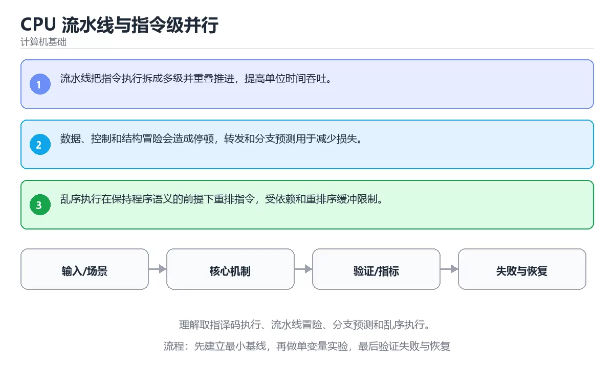

# CPU 流水线与指令级并行



> 内容更新时间：2026-10-03 · 学习阶段：高级 · 预计用时：25 分钟

## 学习目标

- 能用自己的话解释：流水线把指令执行拆成多级并重叠推进，提高单位时间吞吐。
- 能用自己的话解释：数据、控制和结构冒险会造成停顿，转发和分支预测用于减少损失。
- 能用自己的话解释：乱序执行在保持程序语义的前提下重排指令，受依赖和重排序缓冲限制。
- 能把本课知识放回「计算机基础」，并完成练习与测验。

## 前置知识

- 已完成「计算机基础」的基础课程，能运行正文中的最小示例。
- 本课关键词：流水线、分支预测、乱序执行、冒险。
- 遇到不熟悉的术语先记录问题，完成练习后再回读。

## 核心知识

### 1. 流水线把指令执行拆成多级并重叠推进，提高单位时间吞吐。

- 它解决的问题：把「流水线把指令执行拆成多级并重叠推进，提高单位时间吞吐。」放回真实场景，说明不做它会带来什么后果。
- 关键做法：先用最小示例建立基线，再逐步加入边界、失败和性能条件。
- 验证标准：结果可复现、错误可解释、边界有测试、失败能恢复。

### 2. 数据、控制和结构冒险会造成停顿，转发和分支预测用于减少损失。

- 它解决的问题：把「数据、控制和结构冒险会造成停顿，转发和分支预测用于减少损失。」放回真实场景，说明不做它会带来什么后果。
- 关键做法：先用最小示例建立基线，再逐步加入边界、失败和性能条件。
- 验证标准：结果可复现、错误可解释、边界有测试、失败能恢复。

### 3. 乱序执行在保持程序语义的前提下重排指令，受依赖和重排序缓冲限制。

- 它解决的问题：把「乱序执行在保持程序语义的前提下重排指令，受依赖和重排序缓冲限制。」放回真实场景，说明不做它会带来什么后果。
- 关键做法：先用最小示例建立基线，再逐步加入边界、失败和性能条件。
- 验证标准：结果可复现、错误可解释、边界有测试、失败能恢复。

## 关键流程

```text
输入 → 校验 → 核心处理 → 验证 → 记录指标 → 失败恢复
```

## 实践路径

1. 用一句话复述本课要解决的问题。
2. 跑通正文中的最小示例并记录基线。
3. 只改变一个输入或参数，预测并验证结果。
4. 补一个失败路径，记录错误、恢复和指标。
5. 把结论写成可复现的笔记或测试。

## 常见误区

| 误区 | 后果 | 修正 |
| --- | --- | --- |
| 只记术语不做实验 | 遇到真实问题无法判断 | 用最小输入跑通并记录结果 |
| 只测正常路径 | 边界和故障上线才暴露 | 补空值、极值和依赖失败 |
| 没有基线就优化 | 无法证明改进有效 | 先测量再修改 |
| 忽略成本与安全 | 性能和风险失控 | 同时记录资源、权限与失败代价 |

## 动手练习

1. 合上教程，用 3～5 句话解释「CPU 流水线与指令级并行」。
2. 从正文选一个例子，改变一个条件并预测结果。
3. 设计一个失败场景，写出止损与恢复步骤。

**验收标准**：留下输入、命令、输出、差异和下一步问题。

## 本课小结

- 本课属于「计算机基础」，核心关键词是 流水线、分支预测、乱序执行、冒险。
- 先保证正确与可复现，再讨论性能和扩展。
- 完成练习和测验后，把仍然不确定的问题写成下一轮验证清单。

> 本课由 P1 内容扩展生成，重点补充原有课程缺失的主题与工程边界。


## 考点精讲：把测验题还原成判断过程

本课有 4 个判断点。先自己作答，再看「判断依据」；如果结论正确但理由不完整，回到正文对应章节补足概念。

### 考点 1：关于「流水线把指令执行拆成多级并重叠推进 …」，下列说法正确的是？

- **正确判断**：流水线把指令执行拆成多级并重叠推进，提高单位时间吞吐。
- **判断依据**：学习《CPU 流水线与指令级并行》时应把该要点与「流水线」一起理解。正确项「流水线把指令执行拆成多级并重叠推进，提高单位时间吞吐」与题干要求一致，是本课知识点的准确定义。错误项「SIMD 用一条指令处理多个数据，适合规则、独立、无分支的计算」属于相邻主题的说法，范围与本题要求不一致。错误项「多核通过一致性协议维护缓存行状态，写共享会造成失效和流量」把不同概念混在一起，缺少题干限定的前提。错误项「SSD 以页读写、以块擦除，FTL 负责地址映射、磨损均衡和垃圾回收」与课程给出的定义相冲突，不能回答题目所问。把题干「关于「流水线把指令执行拆成多级并重叠推进 …」，下列说法正确的是？」放回《CPU 流水线与指令级并行》的「理解取指译码执行、流水线冒险、分支预测和乱序执行」语境，逐项对照定义与边界条件，就能排除其余说法。
- **迁移检查**：把题干里的一个条件换成边界值，原来的结论还成立吗？写出判断过程。

### 考点 2：关于「数据、控制和结构冒险会造成停顿 转发…」，下列说法正确的是？

- **正确判断**：数据、控制和结构冒险会造成停顿，转发和分支预测用于减少损失。
- **判断依据**：学习《CPU 流水线与指令级并行》时应把该要点与「流水线」一起理解。复习《CPU 流水线与指令级并行》的「流水线、分支预测、乱序执行」时，再用一个边界输入验证同一个结论。正确项「数据、控制和结构冒险会造成停顿，转发和分支预测用于减少损失」既符合定义也满足题干限定的场景，因此应当选择。错误项「随机写、未对齐写和过量 fsync 会放大写放大并降低寿命」把因果关系颠倒了，不能作为正确结论。错误项「数据对齐、连续访问和循环依赖会影响自动向量化效果」属于相邻主题的说法，范围与本题要求不一致。错误项「内存模型规定重排和可见性，原子操作和屏障建立同步关系」把不同概念混在一起，缺少题干限定的前提。把题干「关于「数据、控制和结构冒险会造成停顿 转发…」，下列说法正确的是？」放回《CPU 流水线与指令级并行》的「理解取指译码执行、流水线冒险、分支预测和乱序执行」语境，逐项对照定义与边界条件，就能排除其余说法。
- **迁移检查**：如果给某个错误选项去掉一个限定词，它会不会变成正确？说明理由。

### 考点 3：关于「乱序执行在保持程序语义的前提下重排指…」，下列说法正确的是？

- **正确判断**：乱序执行在保持程序语义的前提下重排指令，受依赖和重排序缓冲限制。
- **判断依据**：学习《CPU 流水线与指令级并行》时应把该要点与「流水线」一起理解。正确项「乱序执行在保持程序语义的前提下重排指令，受依赖和重排序缓冲限制」抓住了题干的核心条件，是经得起边界检验的表述。错误项「向量化后瓶颈常转向内存带宽，必须同时测量计算和访存」与课程给出的定义相冲突，不能回答题目所问。错误项「NUMA 下跨节点访存更慢，线程和内存亲和性会影响性能」只看到了表面现象，没有解释题干真正考查的机制。错误项「持久化要理解页缓存、写屏障和 fsync 语义，不能把 write 当落盘」在边界或失败路径上会得出错误结果。把题干「关于「乱序执行在保持程序语义的前提下重排指…」，下列说法正确的是？」放回《CPU 流水线与指令级并行》的「理解取指译码执行、流水线冒险、分支预测和乱序执行」语境，逐项对照定义与边界条件，就能排除其余说法。
- **迁移检查**：把题干里的一个条件换成边界值，原来的结论还成立吗？写出判断过程。

### 考点 4：「CPU 流水线与指令级并行」的核心学习目标是什么？

- **正确判断**：理解取指译码执行、流水线冒险、分支预测和乱序执行。
- **判断依据**：复习《CPU 流水线与指令级并行》的「流水线、分支预测、乱序执行」时，再用一个边界输入验证同一个结论。正确项「理解取指译码执行、流水线冒险、分支预测和乱序执行」是该问题的规范说法，换成其他表述都会丢失条件。错误项「理解数据并行、向量寄存器、自动向量化、掩码和内存带宽」适用于其他场景，但与本题的前提不匹配。错误项「理解 MESI、内存序、伪共享、NUMA 亲和性与跨核延迟」把因果关系颠倒了，不能作为正确结论。错误项「从闪存页、FTL、写放大、文件系统到 fsync 理解持久化」忽略了题目中的限制条件，因此不成立。把题干「「CPU 流水线与指令级并行」的核心学习目标是什么？」放回《CPU 流水线与指令级并行》的「理解取指译码执行、流水线冒险、分支预测和乱序执行」语境，逐项对照定义与边界条件，就能排除其余说法。
- **迁移检查**：如果给某个错误选项去掉一个限定词，它会不会变成正确？说明理由。

## 本课复习清单

离开本课前，逐项确认：

- [ ] 不看解析，能说出「关于「流水线把指令执行拆成多级并重叠推进 …」，下列说法正确的是？」的判断依据。
- [ ] 不看解析，能说出「关于「数据、控制和结构冒险会造成停顿 转发…」，下列说法正确的是？」的判断依据。
- [ ] 不看解析，能说出「关于「乱序执行在保持程序语义的前提下重排指…」，下列说法正确的是？」的判断依据。
- [ ] 不看解析，能说出「「CPU 流水线与指令级并行」的核心学习目标是什么？」的判断依据。
- [ ] 至少运行一次本课示例，记录输入、输出和一个边界情况。
- [ ] 把本课最容易混淆的两个概念写成一句话对照。

| 复盘项 | 记录 |
| --- | --- |
| 已经能独立解释的考点 |  |
| 仍然说不清的概念 |  |
| 下一步验证动作 |  |

## 逐节复习与自检

下面按正文顺序回顾每一节，并给出一个自检问题；说不清的地方回到原章节补课。

### 核心知识

」放回真实场景，说明不做它会带来什么后果。关键做法：先用最小示例建立基线，再逐步加入边界、失败和性能条件。

自检：这一节与相邻主题的边界在哪里？

### 动手练习

合上教程，用 3～5 句话解释「CPU 流水线与指令级并行」。从正文选一个例子，改变一个条件并预测结果。

自检：如果去掉这一节里的一个前提，结论会怎样变化？

### 最小可运行示例

```python
stages = ["取指", "译码", "执行", "写回"]
for index, stage in enumerate(stages, start=1):
    print(f"第 {index} 级：{stage}")
```

自检：把这一节讲给没学过的人，最需要强调哪一点？

### 预期输出

```text
第 1 级：取指
第 2 级：译码
第 3 级：执行
第 4 级：写回
```

自检：这一节与相邻主题的边界在哪里？

### 验证步骤

制造一次错误输入，记录错误信息与修复方式。

自检：如果去掉这一节里的一个前提，结论会怎样变化？

## 易错点回顾

下面把本课最容易判断错的地方集中成一张清单，复习时先自己回答，再对照解析补全理由。

- **关于「流水线把指令执行拆成多级并重叠推进 …」，下列说法正确的是？**：学习《CPU 流水线与指令级并行》时应把该要点与「流水线」一起理解。
- **关于「数据、控制和结构冒险会造成停顿 转发…」，下列说法正确的是？**：学习《CPU 流水线与指令级并行》时应把该要点与「流水线」一起理解。
- **关于「乱序执行在保持程序语义的前提下重排指…」，下列说法正确的是？**：学习《CPU 流水线与指令级并行》时应把该要点与「流水线」一起理解。
- **「CPU 流水线与指令级并行」的核心学习目标是什么？**：复习《CPU 流水线与指令级并行》的「流水线、分支预测、乱序执行」时，再用一个边界输入验证同一个结论。

## English Overview

**Title:** CPU Pipelines and Instruction-Level Parallelism

**Summary:** Learn fetch-decode-execute, hazards, branch prediction and out-of-order execution.

**Category:** Fundamentals  
**Level:** 高级  
**Key terms:** 流水线, 分支预测, 乱序执行, 冒险

> The full tutorial is written in Chinese. This bilingual overview helps English readers identify the topic, scope and key terms before studying the detailed examples.

## 内容元数据

- 内容版本：v2.0
- 最后更新：2026-10-03
- 学习阶段：高级
- 适用环境：通用计算机体系结构知识
- 内容来源：内置结构化课程与工程实践整理
- 相关主题：流水线、分支预测、乱序执行、冒险
- 质量版本：P0 测验标准 + P1 覆盖扩展 + P2 体验补全


## 最小可运行示例

下面示例用于验证「CPU 流水线与指令级并行」的最小输入、处理和输出。先原样运行，再只修改一个值：

```python
stages = ["取指", "译码", "执行", "写回"]
for index, stage in enumerate(stages, start=1):
    print(f"第 {index} 级：{stage}")
```

## 预期输出

```text
第 1 级：取指
第 2 级：译码
第 3 级：执行
第 4 级：写回
```

## 验证步骤

1. 记录运行环境、命令和真实输出。
2. 修改一个输入，先写预测再运行。
3. 制造一次错误输入，记录错误信息与修复方式。
4. 把结论写回本课笔记或测试用例。


## 参考资料与复核

- 最后复核：2026-10-04
- 下次复核：2027-04-04
- 复核范围：版本兼容、API 行为、安全建议与工程实践
- 来源性质：官方文档与标准；本课正文为离线教学重组，不复制原文

| 参考资料 | 本课用途 |
| --- | --- |
| [Linux Kernel Docs](https://docs.kernel.org/) | 操作系统与硬件接口 |
| [Arm Architecture](https://developer.arm.com/documentation) | 处理器与内存体系结构 |

> 本课主题：理解取指译码执行、流水线冒险、分支预测和乱序执行。

> App 完全离线展示文字链接，不会自动联网；需要延伸阅读时可复制链接到浏览器。
