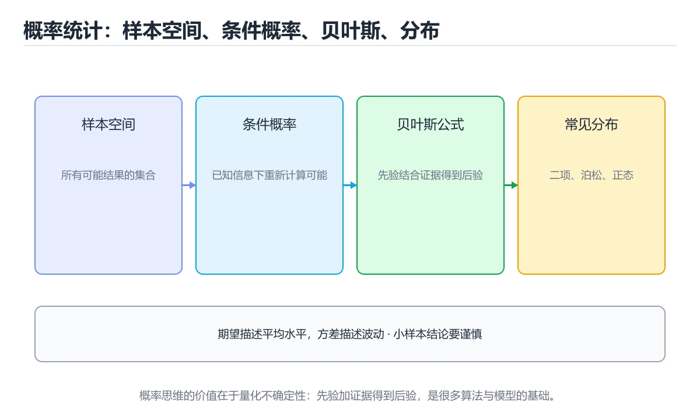
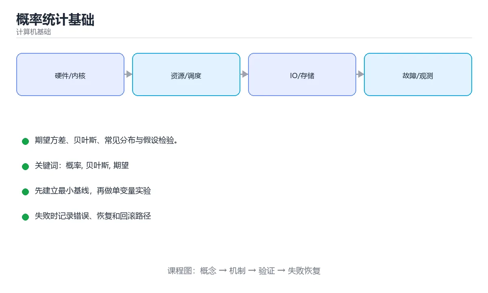

# 概率统计基础

> 内容更新时间：2026-10-06 · 学习阶段：进阶 · 预计用时：25 分钟





## 学习目标

- 能用自己的话解释概率统计基础解决了什么问题，而不是只背术语。
- 能说清 「概率」、「贝叶斯」、「期望」、「假设检验」 之间的关系，并分别举出一个例子。
- 能把 概率 放回「概率统计基础」的知识体系，说明它和 贝叶斯 的边界。
- 能完成本课练习，并用验收标准检查自己的结果。

> 一句话摘要：期望方差、贝叶斯、常见分布与假设检验。

## 前置知识

- 先完成上一课《离散数学与逻辑》；如果已经掌握，可以直接用本课练习自测。
- 开始前先复习：概率、贝叶斯、期望。
- 卡在 概率 上时不要跳过：把输入、预期和实际输出写成三行，再回头读正文。

## 为什么程序员要懂概率

性能压测的尾延迟、机器学习的损失函数、缓存命中率、AB 实验显著性、哈希冲突概率——都建立在概率统计之上。不懂概率，就无法判断"这个差异是真实效果还是随机波动"。

## 基础概念

| 概念 | 说明 |
| --- | --- |
| 随机变量 | 取值由随机试验决定的变量，分离散与连续 |
| 期望 E[X] | 长期平均值，可线性叠加（无论是否独立） |
| 方差 Var(X) | 波动程度，标准差是其平方根 |
| 条件概率 | P(A\|B)，已知 B 发生时 A 的概率 |
| 独立性 | P(A∩B) = P(A)P(B) |

## 贝叶斯公式

P(A|B) = P(B|A)·P(A) / P(B)。它把"已知先验与似然，求后验"这件事形式化：先验是原有判断，似然是新证据的支撑强度，后验是更新后的判断。垃圾邮件过滤、医疗检测误判、A/B 实验的因果推断都基于它。

典型反直觉案例：某病发病率 1‰，检测灵敏度 99%、特异度 99%，检测为阳性时真实患病概率只有约 9%——因为健康人基数大，假阳性数量远超真阳性。

## 常见分布

| 分布 | 场景 |
| --- | --- |
| 二项分布 | n 次独立试验的成功次数（点击、转化） |
| 泊松分布 | 单位时间内的到达次数（请求、故障） |
| 正态分布 | 大量独立因素叠加（测量误差、聚合指标） |
| 指数分布 | 事件间隔时间（请求间隔、寿命） |

## 统计推断

1. 中心极限定理：样本均值近似正态，这是置信区间与假设检验的基础。
2. 假设检验：先设零假设，计算 p 值，p 小于显著性水平（常取 0.05）时拒绝零假设。
3. 置信区间：给出估计的范围与不确定性，比单点估计更有信息量。
4. 常见陷阱：多重比较未校正、样本量不足、辛普森悖论、只报均值不报分布。

## 在工程中的用法

尾延迟分析看 P95/P99 而不是均值；容量规划用泊松分布估算峰值；压测结果的差异要用假设检验判断是否显著；机器学习用交叉熵、最大似然推导损失函数。

## 本课小结

概率统计让你**在不确定中做判断**：用期望看长期收益，用方差看风险，用贝叶斯更新认知，用假设检验区分信号与噪声。

## 常用分布速查

| 分布 | 描述对象 | 期望 | 方差 |
| --- | --- | --- | --- |
| 伯努利 | 一次试验成功与否 | p | p(1-p) |
| 二项 | n 次独立试验的成功次数 | np | np(1-p) |
| 几何 | 首次成功所需试验次数 | 1/p | (1-p)/p² |
| 泊松 | 单位时间事件次数 | λ | λ |
| 均匀 | 区间内等可能 | (a+b)/2 | (b-a)²/12 |
| 指数 | 事件间隔时间 | 1/λ | 1/λ² |
| 正态 | 大量独立因素叠加 | μ | σ² |

## 核心概念速查

| 概念 | 公式 / 含义 |
| --- | --- |
| 条件概率 | `P(A\|B) = P(A∩B) / P(B)` |
| 乘法公式 | `P(A∩B) = P(A\|B)·P(B)` |
| 全概率公式 | `P(B) = Σ P(B\|Aᵢ)·P(Aᵢ)` |
| 贝叶斯公式 | `P(A\|B) = P(B\|A)·P(A) / P(B)` |
| 独立性 | `P(A∩B) = P(A)·P(B)` |
| 期望线性 | `E(X+Y) = E(X) + E(Y)`，**无需独立** |
| 方差 | `Var(X) = E(X²) - (E(X))²` |
| 协方差 | `Cov(X,Y) = E(XY) - E(X)E(Y)`，为 0 不意味着独立 |
| 大数定律 | 样本均值收敛到期望 |
| 中心极限定理 | 独立同分布之和近似正态 |

```python
import random
from math import comb

def bayes(prior: float, sensitivity: float, false_positive: float) -> float:
    """已知患病率先验、检测灵敏度与假阳性率，求阳性时真实患病概率。"""
    p_positive = sensitivity * prior + false_positive * (1 - prior)
    return sensitivity * prior / p_positive

# 患病率 0.1%，灵敏度 99%，假阳性 5%
print(f"{bayes(0.001, 0.99, 0.05):.2%}")   # 约 1.94%，与直觉差异巨大

def monte_carlo_pi(trials: int = 200_000) -> float:
    """蒙特卡洛估算圆周率：大数定律的直接应用。"""
    inside = 0
    for _ in range(trials):
        x, y = random.random(), random.random()
        if x * x + y * y <= 1:
            inside += 1
    return 4 * inside / trials

def binomial_probability(n: int, k: int, p: float) -> float:
    """二项分布：n 次独立试验恰好成功 k 次的概率。"""
    return comb(n, k) * (p ** k) * ((1 - p) ** (n - k))
```

## 常见错误与排查

| 容易写错的做法 | 实际现象 | 原因与正确做法 |
| --- | --- | --- |
| 混淆 `P(A\|B)` 与 `P(B\|A)` | 结论完全相反 | 贝叶斯公式负责换算，别把条件概率弄反 |
| 忽略基础发病率 | 过度高估阳性者患病概率 | 低先验下假阳性占主导 |
| 认为期望线性需要独立 | 少算了可用的性质 | 期望线性对任意变量成立，方差才需要独立 |
| 认为协方差为 0 就是独立 | 结论错误 | 不相关弱于独立，非线性关系仍可能存在 |
| 认为大样本一定代表总体 | 忽略采样偏差 | 样本必须随机且有代表性 |
| 用小样本均值下结论 | 方差大、结论不稳 | 报告置信区间与样本量 |
| 忽略多重比较 | 假阳性率膨胀 | 做 Bonferroni 或 FDR 校正 |
| 把平均值当唯一指标 | 掩盖长尾 | 同时看分位数与最大值 |
| 认为泊松分布适用于任何计数 | 前提被忽略 | 需要事件独立且发生率稳定 |
| 用正态近似处理极端小概率 | 尾部误差大 | 极值场景用精确分布或极值理论 |

## 复习与自测

- [ ] 能写出贝叶斯公式并解释低先验下的反直觉结果。
- [ ] 记得期望线性不要求独立。
- [ ] 知道不相关不等于独立。
- [ ] 会用蒙特卡洛验证概率结论。
- [ ] 抽样时关注样本代表性并报告不确定性。

## 动手练习

> 本课练习重点：围绕「概率、贝叶斯、期望」完成复述、实验和交付，每个结果都要能被别人检查。

把 为什么程序员要懂概率 的机制画成图，再用最小数据验证其中一个结论。

### 练习 1：建立心智模型（10 分钟）

合上教程，用 3～5 句话回答：

1. 概率统计基础解决了什么问题？
2. 如果没有它，会出现什么具体后果？
3. 它和「贝叶斯」是什么关系？

验收标准：回答里必须出现 概率，并写出一个让结论失效的边界条件。

### 练习 2：做一次可控实验（20 分钟）

从正文中选一个最小示例，完成以下操作：

1. 先预测修改一个参数、输入或步骤后的结果。
2. 再实际执行或逐步推演，记录真实结果。
3. 如果结果与预测不同，写出差异原因。

**验收标准**：用 binomial_probability 复现原例后，把贝叶斯改成边界值，五步记录缺一不可，其中「原因」一栏要写明「概率统计基础」里哪条规则被触发。

### 练习 3：交付一个小结果（30 分钟）

用表格、真值表或计算过程把抽象概念落到一个可核对的结果上。

任务要求：

- 结果必须能被别人检查，不能只写“我已经理解了”。
- 至少覆盖「概率」和「贝叶斯」两个关键词。
- 写出 1 个仍然不确定的问题，以及下一步如何验证。

> 提示：时间有限时优先做练习 1 和练习 2；练习 3 可以拆成两次完成。

## 深入补充：概率统计基础

前面已经建立了基本概念。这一节换一个角度，把概率统计基础放进真实工程里，
重点回答三件事：binomial_probability 解决什么问题、依赖哪些前提、在什么条件下失效。

### 一、核心模型

概率统计用数学语言描述不确定性：概率回答“可能发生什么”，统计回答“从样本能推断总体什么”。核心工具包括条件概率、随机变量、分布、期望、方差和假设检验。

```text
定义样本空间 → 建立事件与概率 → 条件化/独立性判断 → 随机变量与分布 → 期望方差 → 抽样 → 估计与检验 → 结论与不确定性
```

### 二、关键机制拆解

1. 样本空间是所有可能结果的集合，事件是样本空间的子集；互斥和独立是两个完全不同的概念。
2. 条件概率 P(A|B) 表示已知 B 发生后 A 的概率；贝叶斯公式把先验、似然和后验连接起来。
3. 随机变量把结果映射成数值，离散型用概率质量函数，连续型用概率密度函数描述。
4. 期望描述长期平均值，方差描述波动；期望相同不代表风险相同。
5. 大数定律说明样本均值会趋近总体均值，中心极限定理说明大量独立样本的和近似正态分布。
6. 假设检验先设原假设，再计算在假设成立时观察到当前或更极端结果的概率 p 值；p 值不是“原假设为真的概率”。
7. 置信区间同时给出效应大小和不确定性，比只报告一个点估计更可靠。

### 三、对照表：抓住容易混淆的边界

| 维度 | 一侧 | 另一侧 |
| --- | --- | --- |
| 互斥 | 两个事件不能同时发生 | 不代表一个发生会影响另一个的概率 |
| 独立 | 一个事件不改变另一个的概率 | 不代表两个事件不能同时发生 |
| 描述统计 | 总结已有样本 | 不推断总体，只描述数据 |
| 推断统计 | 从样本推断总体 | 依赖抽样方法和模型假设 |

### 四、工作示例

医学检测灵敏度 99%、特异度 95%，人群中患病率 1%。即使检测阳性，真实患病概率也不到 17%。原因是低患病率让大量健康人的假阳性超过了真阳性，这就是贝叶斯更新和基础率谬误的典型例子。

### 五、常见误区与失效边界

| 错误做法或假设 | 后果 | 正确做法 |
| --- | --- | --- |
| 把 p 值当成原假设为真的概率 | 结论被严重误读 | 把 p 值理解为假设成立时数据的极端程度 |
| 只看平均值不看方差 | 忽略极端风险和离群值 | 同时报告分位数、方差和样本量 |
| 把相关当成因果 | 做出错误决策 | 用实验、对照和因果图验证因果关系 |
| 反复检验直到显著 | 假阳性率膨胀 | 预先注册假设并做多重比较校正 |

### 六、场景推演

A/B 测试显示新方案转化率提升 2%，但样本量很小且只运行了一天。正确做法是检查样本量、随机分流、置信区间和多重指标；若区间跨越 0 或指标过多，就不能直接宣布胜利，而应延长实验并预先定义主指标。

### 七、自测问答

**Q1：互斥和独立的区别是什么？**

互斥描述事件能否同时发生，独立描述一个事件是否改变另一个事件的概率。

**Q2：为什么只看 p 值不够？**

它不直接给出效应大小和实际重要性，还要结合置信区间与业务成本。

**Q3：中心极限定理解决什么问题？**

它说明大量独立样本的和或均值近似正态，便于构造区间和检验。

**Q4：基础率为什么会扭曲直觉？**

低基础率下假阳性占比可能远高于真阳性，必须先做贝叶斯更新。

### 八、小项目：把知识变成可检查的产出

用一个模拟程序生成患病率 1%、灵敏度 99%、特异度 95% 的 10 万次检测结果，统计阳性中真实患病的比例；再把患病率改为 10%，比较两次结果并解释差异。

### 九、适用边界

概率模型只能描述假设下的不确定性，不能替代领域知识。抽样偏差、数据泄漏和因果混淆是模型无法自动修复的，必须在实验设计和数据采集中解决。

### 十、完成检查清单

- [ ] 能区分互斥、独立和条件概率
- [ ] 能写出贝叶斯更新并解释基础率
- [ ] 能根据场景选择合适的分布
- [ ] 能正确解释 p 值和置信区间
- [ ] 能为一次实验设计样本量和主指标

## 可运行练习

### 任务 1：先跑通，再解释

```python
import random
from math import comb

def bayes(prior: float, sensitivity: float, false_positive: float) -> float:
    """已知患病率先验、检测灵敏度与假阳性率，求阳性时真实患病概率。"""
    p_positive = sensitivity * prior + false_positive * (1 - prior)
    return sensitivity * prior / p_positive

# 患病率 0.1%，灵敏度 99%，假阳性 5%
print(f"{bayes(0.001, 0.99, 0.05):.2%}")   # 约 1.94%，与直觉差异巨大

def monte_carlo_pi(trials: int = 200_000) -> float:
    """蒙特卡洛估算圆周率：大数定律的直接应用。"""
    inside = 0
    for _ in range(trials):
        x, y = random.random(), random.random()
        if x * x + y * y <= 1:
            inside += 1
    return 4 * inside / trials

def binomial_probability(n: int, k: int, p: float) -> float:
    """二项分布：n 次独立试验恰好成功 k 次的概率。"""
    return comb(n, k) * (p ** k) * ((1 - p) ** (n - k))
```

### 任务 2：只改一个条件

把「概率统计基础」的最小示例复制一份，只改一个条件再跑一次：

- 改动点：只把 概率 的输入换成空值、极值或错误输入，其余保持不变。
- 预测：先写下「概率统计基础」在改动后的输出或错误信息，再运行。
- 记录：对照改动前后的结果，指出差异出在哪一步。
- 验收：换回原条件能复现原结果，改动只影响概率。

### 任务 3：迁移到自己的数据

换一个 贝叶斯 场景重做一次，确认结论不是只对示例数据成立。

## 故障现场

### 现场 1：混淆 P(A\|B) 与 P(B\|A)

**症状**：在《概率统计基础》的复现场景中，结论完全相反。

**根因**：当出现“混淆 P(A\|B) 与 P(B\|A)”时，执行路径已经绕过了《概率统计基础》的关键约束，最终以“结论完全相反”暴露出来；修复前必须先确认约束在哪里失效。

**修复**：针对《概率统计基础》的问题，贝叶斯公式负责换算，别把条件概率弄反。

**验证**：保留《概率统计基础》里触发“结论完全相反”的输入、版本和日志，按“贝叶斯公式负责换算，别把条件概率弄反”完成修改后原样重放；只有失败现象消失且相邻场景仍可解释，才保留改动。

### 现场 2：忽略基础发病率

**症状**：在《概率统计基础》的复现场景中，过度高估阳性者患病概率。

**根因**：当出现“忽略基础发病率”时，执行路径已经绕过了《概率统计基础》的关键约束，最终以“过度高估阳性者患病概率”暴露出来；修复前必须先确认约束在哪里失效。

**修复**：针对《概率统计基础》的问题，低先验下假阳性占主导。

**验证**：在《概率统计基础》中按“低先验下假阳性占主导”调整后，从“忽略基础发病率”的触发条件重放同一条路径，确认“过度高估阳性者患病概率”不再出现，并补一个相邻边界用例检查没有引入新问题。

### 现场 3：认为期望线性需要独立

**症状**：在《概率统计基础》的复现场景中，少算了可用的性质。

**根因**：触发点是把“认为期望线性需要独立”当成安全做法。它没有满足《概率统计基础》要求的前提，因此先表现为“少算了可用的性质”；排查时先完整复现这一段，再核对输入、配置与依赖。

**修复**：针对《概率统计基础》的问题，期望线性对任意变量成立，方差才需要独立。

**验证**：在《概率统计基础》中按“期望线性对任意变量成立，方差才需要独立”调整后，从“认为期望线性需要独立”的触发条件重放同一条路径，确认“少算了可用的性质”不再出现，并补一个相邻边界用例检查没有引入新问题。

## 本课复习清单

离开本课前，逐项确认：

- [ ] 不看解析，能说出「关于期望的线性性质，正确的说法是？」的判断依据。
- [ ] 不看解析，能说出「贝叶斯公式的作用是？」的判断依据。
- [ ] 不看解析，能说出「发病率极低的疾病，即使检测灵敏度很高，阳性者真实患病率仍然很低，原因是？」的判断依据。
- [ ] 不看解析，能说出「标准差与方差的关系是？」的判断依据。
- [ ] 不看解析，能说出「大数定律说的是？」的判断依据。
- [ ] 至少运行一次 binomial_probability 的示例，记录输入、输出和 概率 的边界情况。
- [ ] 把本课最容易混淆的两个概念写成一句话对照。

| 复盘项 | 记录 |
| --- | --- |
| 已经能独立解释的考点 |  |
| 仍然说不清的概念 |  |
| 下一步验证动作 |  |

## 术语速查

| 术语 | 一句话说明 |
| --- | --- |
| `概率` | 事件发生的可能性度量，取值在 0 到 1 之间。 |
| `条件概率` | 在已知某事件发生的前提下另一事件发生的概率，是理解独立与相关的基础。 |
| `期望` | 随机变量按概率加权的平均值，用来衡量长期收益或成本的量级。 |
| `贝叶斯定理` | 用先验概率与新证据推导后验概率，是垃圾邮件过滤与 A/B 判断的常用框架。 |

## 考点精讲

### 考点 1：概念判断·概率

- **题目**：关于期望的线性性质，正确的说法是？
- **判断依据**：期望线性是无条件成立的，这是它最实用的性质。作答时，先用概率建立输入与输出的基线，再把不要求独立代入边界条件核对，结论才能复现。在「概率统计基础」里判断这道题，要把概率、贝叶斯、期望的条件、过程与失败路径逐项对齐，换成“关于期望的线性性质”这个场景，只有满足前提的结论才成立。

### 考点 2：代码补全·概率

- **题目**：阅读「概率统计基础」正文里的这段 Python 代码，下面哪一项判断是正确的？
- **判断依据**：在「概率统计基础」里，题干的正确项是这段代码把主要逻辑封装在函数或方法里，需要被调用才会执行，在「概率统计基础」里封装边界决定概率从哪一步开始生效。把输入或边界换成空值、极值或失败情况后，结论要以「概率统计基础」的实际运行结果为准。「概率统计基础」要求先交代概率、贝叶斯、期望的前提再下结论，所以“这段代码把主要逻辑封装在函数或方法里”只在题干“阅读概率统计基础正文里的这段 Python 代码”给定的条件下成立。

### 考点 3：多选辨析·概率

- **题目**：围绕“概率统计基础”中的 概率、贝叶斯、期望，下列哪两项是本课强调的实践判断？
- **判断依据**：本课把概率统计基础拆成概念、示例与故障现场三部分，因此判断 概率 时必须同时交代输入、输出和失败路径，这使“学习 概率 时要同时说明输入、输出和失败路径，不能只看正常流程”成立。在概率统计基础里，判断 贝叶斯 时要固定版本与边界输入，所以“验证 贝叶斯 时要固定版本并覆盖边界输入，结论才可复现”才可复现。

### 考点 4：概念判断·概率

- **题目**：标准差与方差的关系是？
- **判断依据**：方差在推导中性质更好，报告数据离散程度时用标准差更直观。在「概率统计基础」里，其他选项：标准差是方差的平方根，与原数据同量纲，因此更容易解释数据的离散程度。在「概率统计基础」里，这道题要求区分概念与边界，「标准差是方差的平方根」只有在题干给出的前提下才成立，而「标准差只对正态分布有定义」、「标准差是方差的平方」缺少同一组条件。

### 考点 5：概念判断·概率

- **题目**：大数定律说的是？
- **判断依据**：在「概率统计基础」里，样本量增大时样本均值以概率收敛到总体期望。它是蒙特卡洛模拟与线上指标统计的理论基础，但不保证小样本可靠。这道题的关键在「概率统计基础」的概率、贝叶斯、期望：先确认题干“大数定律说的是”问的是哪一步，再排除偷换前提的选项。

### 考点 6：填空·概率

- **题目**：补全代码：「概率统计基础」示例中，下面这行代码缺少哪个关键字或函数名？请填入 ____。 `def ____(prior: float, sensitivity: float, false_positive: float) -> float:`
- **判断依据**：这道题的关键在「概率统计基础」的概率、贝叶斯、期望：先确认题干“补全代码”问的是哪一步，再排除偷换前提的选项。把“bayes”代回「概率统计基础」里“概率统计基础示例中”的例子核对，条件一旦改变，结论就要用概率、贝叶斯、期望重新推导。回到概率、贝叶斯、期望本身再看一遍：只有“bayes”与题干“bayes”的前提一致，结论才成立。

## English Overview

**Title:** Probability & Statistics

**Summary:** Expectation, Bayes, distributions and testing.

**Category:** Fundamentals
**Level:** 高级
**Key terms:** 概率, 贝叶斯, 期望, 假设检验, 分布

## 内容元数据

- 内容版本：v2.0
- 最后更新：2026-10-06
- 学习阶段：进阶
- 适用环境：通用计算机体系结构知识
；本课聚焦 概率。
- 内容来源：内置结构化课程与工程实践整理
- 相关主题：概率、贝叶斯、期望、假设检验、分布
- 质量版本：P0 测验标准 + P1 覆盖扩展 + P2 体验补全

## 参考资料与复核

- 最后复核：2026-10-04
- 下次复核：2027-10-10
- 复核范围：版本兼容、API 行为、安全建议与工程实践
- 来源性质：官方文档、标准或权威教材；正文为离线教学重组

| 参考资料 | 本课用途 |
| --- | --- |
| [MDN 计算机基础](https://developer.mozilla.org/docs/Learn_web_development/Core) | Web 相关计算机基础 |
| [Arm 架构文档](https://developer.arm.com/documentation) | 处理器与内存体系结构 |
| [Linux 内核文档](https://docs.kernel.org/) | 操作系统与硬件接口 |

> 「概率统计基础」的链接用于离线阅读后的延伸核对；App 不会自动联网。

