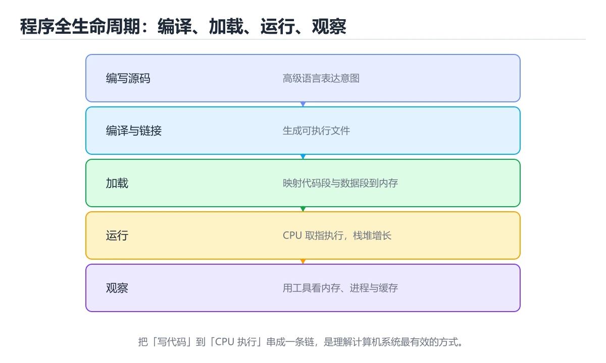
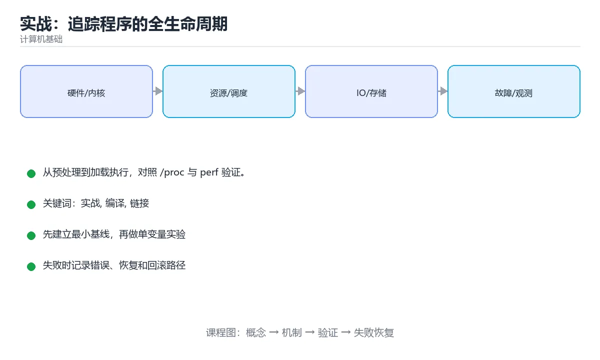

# 实战：追踪程序的全生命周期

> 内容更新时间：2026-10-06 · 学习阶段：进阶 · 预计用时：60 分钟





## 学习目标

- 能用自己的话解释实战：追踪程序的全生命周期解决了什么问题，而不是只背术语。
- 能说清 「实战」、「编译」、「链接」、「/proc」 之间的关系，并分别举出一个例子。
- 能把 实战 放回「实战：追踪程序的全生命周期」的知识体系，说明它和 编译 的边界。
- 能完成本课练习，并用验收标准检查自己的结果。

> 一句话摘要：从预处理到加载执行，对照 /proc 与 perf 验证。

## 前置知识

- 先完成上一课《计算机图形学与多媒体》；如果已经掌握，可以直接用本课练习自测。
- 开始前先复习：实战、编译、链接。
- 卡在 实战 上时不要跳过：把输入、预期和实际输出写成三行，再回头读正文。

## 目标

写一个最小的 C 程序，亲手观察它从源码到运行的全过程：**预处理 → 编译 → 汇编 → 链接 → 加载 → 执行**，并对照计算机基础各篇的知识点。

## 步骤与观察点

| 步骤 | 命令 | 观察什么 |
| --- | --- | --- |
| 预处理 | `gcc -E main.c -o main.i` | 头文件展开、宏替换后的代码量 |
| 编译 | `gcc -S main.i -o main.s` | 生成的汇编（函数调用与栈帧） |
| 汇编 | `gcc -c main.s -o main.o` | 目标文件的符号表 `nm main.o` |
| 链接 | `gcc main.o -o app` | 依赖的动态库 `ldd app` |
| 加载执行 | `strace -f ./app` | 系统调用序列（open/read/write/mmap） |

## 再看内存与进程

运行一个长驻进程后，用 `cat /proc/<pid>/maps` 观察代码段、数据段、堆、栈与共享库的地址布局；用 `pmap -x <pid>` 看内存占用分布；用 `cat /proc/<pid>/status` 看 VmRSS 与上下文切换次数。

## 最后看指令与缓存

用 `perf stat ./app` 看指令数、分支预测失败率、缓存未命中率；把数据规模放大 10 倍再测，观察缓存未命中的变化——这能直观体会"缓存友好"的含义。

## 常见错误与排查

1. 忘记 `-g` 导致 perf/strace 输出无法对应源码行。
2. 用 `-O2` 观察汇编时优化会打乱结构，建议先用 `-O0`。
3. 在虚拟机/容器里 perf 可能受限（需要权限或 host 支持）。
4. 把"能跑"当成理解：一定要能解释每一步产物的作用。
| 容易写错的做法 | 实际现象 | 原因与正确做法 |
| --- | --- | --- |
| 不确认错误就动手改 | 修错地方 | 先看错误信息与日志 |
| 只看应用日志 | 错过系统层面原因 | 结合 `dmesg`（OOM、IO 错误） |
| 用 `strace` 直接在生产跑全量 | 性能严重下降 | 限定系统调用与时长，或用采样工具 |
| 不看退出码 | 无法判断失败原因 | 记录并解释每个非零码 |
| 关闭优化靠猜 bug | 掩盖真实问题 | 用 ASan、UBSan 定位 UB |
| 只压测不监控 | 压塌了才发现 | 同步观察资源与错误率 |
| 无 core dump 就分析崩溃 | 只能猜 | 提前开启 core dump 并保留符号 |
| 忽略构建一致性 | 本地与线上行为不同 | 固定工具链与依赖版本 |
| 改动多个变量同时验证 | 无法归因 | 一次只改一个变量 |
| 排查完不沉淀 | 同类问题重复排查 | 写成 runbook 与自动化脚本 |

## 交付物

一份笔记，包含：各阶段产物截图/输出、`/proc` 内存布局说明、perf 关键指标解读，以及"如果改成动态链接/静态链接，观察到的差异"。

## 交付物与评分标准

**交付物**：一份全生命周期笔记，含四阶段产物（预处理后的 .i、汇编 .s、目标文件 .o、可执行文件）、符号表与依赖库输出、`/proc/<pid>/maps` 的内存布局截图、`strace` 系统调用摘录、`perf stat` 关键指标解读。

**评分标准**：流程完整 30%（四阶段产物齐全）、观察准确 30%（能指出代码段/堆/栈/共享库的位置）、指标解读 25%（能解释指令数、缓存未命中率的含义）、结论 15%（能回答"改静态链接会有什么差异"）。

**常见失败案例**：① 只用 `-O2` 生成汇编，导致结构难以对应源码；② 忘记 `-g` 使 perf/strace 无法映射到源码行；③ 把"程序能跑"当作理解，无法解释任一步骤的作用；④ 在容器中做 perf 未注意权限限制。

## 本课小结

这个实战把**编译原理、组成原理、操作系统**三门课串成一条线：你不再背概念，而是能对着产物与系统调用说出每一步在做什么。

## 全生命周期排查速查

| 阶段 | 关注点 | 常用工具 |
| --- | --- | --- |
| 源码 | 语法、类型、静态缺陷 | 编译器告警、linter、静态分析 |
| 编译 | 优化与生成 | `gcc -S`、`objdump`、LLVM 优化记录 |
| 链接 | 符号与依赖 | `nm`、`ldd`、`readelf` |
| 加载 | 依赖库、地址布局 | `strace`、`/proc/<pid>/maps` |
| 运行 | 系统调用、资源占用 | `strace`、`perf`、`top`、`pidstat` |
| 内存 | 泄漏、越界 | ASan、Valgrind、`pmap` |
| IO | 磁盘与网络 | `iostat`、`iotop`、`tcpdump` |
| 崩溃 | 堆栈与转储 | gdb、core dump、`dmesg` |

```bash
# 一条命令串起常见排查动作（示例：程序启动失败）
file ./app                          # 确认架构与动态链接类型
ldd ./app                           # 检查依赖库是否齐全
nm -C ./app | grep -i main          # 确认入口符号存在
strace -f -e trace=openat,execve ./app 2>&1 | tail -n 30   # 看加载与失败点

# 运行期观察
./app & pid=$!
cat /proc/$pid/maps | head          # 虚拟内存布局
cat /proc/$pid/status | grep -E 'VmRSS|Threads'
perf stat -p $pid sleep 5           # 硬件事件统计

# 崩溃后分析（需先开启 core dump）
ulimit -c unlimited
gdb -batch -ex run -ex bt ./app
```

```python
import subprocess

def run_diagnostics(binary: str) -> dict:
    """收集一个可执行文件的基础诊断信息。"""
    def capture(args):
        try:
            result = subprocess.run(args, capture_output=True, text=True, timeout=10)
            return result.stdout.strip()
        except (OSError, subprocess.SubprocessError) as exc:
            return f"执行失败：{exc}"

    return {
        "file": capture(["file", binary]),
        "deps": capture(["ldd", binary]),
        "missing_symbols": capture(["nm", "-u", binary]),
    }

info = run_diagnostics("/bin/ls")     # 换成自己的产物路径即可
print(info["file"])
```

## 问题定位顺序速查

| 现象 | 先查什么 | 再看什么 |
| --- | --- | --- |
| 启动即退出 | 退出码、依赖库 | `strace` 打开的文件 |
| 运行崩溃 | 堆栈、core dump | ASan 报告 |
| 内存持续增长 | RSS 曲线 | 分配热点、泄漏检测 |
| CPU 高但吞吐低 | 火焰图 | 锁竞争、系统调用 |
| IO 等待高 | `iostat`、`iotop` | 缓存命中率、文件访问模式 |
| 网络超时 | `ss`、`tcpdump` | DNS、TLS、重传 |
| 偶发错误 | 日志与追踪 ID | 复现条件与并发场景 |

## 复习与自测

- [ ] 能按「源码、编译、链接、加载、运行」逐层定位问题。
- [ ] 会用 `file`、`ldd`、`nm`、`strace` 排查启动失败。
- [ ] 会用 `/proc` 查看内存与线程信息。
- [ ] 崩溃分析前准备好 core dump 与符号。
- [ ] 结论会沉淀为可复用的排查脚本。

## 动手练习

> 本课练习重点：围绕「实战、编译、链接」完成复述、实验和交付，每个结果都要能被别人检查。

先用表格或时序图描述 实战 的机制，再手算一个最小例子，最后用程序验证。

### 练习 1：建立心智模型（10 分钟）

合上教程，用 3～5 句话回答：

1. 实战：追踪程序的全生命周期解决了什么问题？
2. 如果没有它，会出现什么具体后果？
3. 它和「编译」是什么关系？

验收标准：说明 实战 与 编译 的分工，并写出一个失效场景。

### 练习 2：做一次可控实验（20 分钟）

从正文中选一个最小示例，完成以下操作：

1. 先预测修改一个参数、输入或步骤后的结果。
2. 再实际执行或逐步推演，记录真实结果。
3. 如果结果与预测不同，写出差异原因。

**验收标准**：把 run_diagnostics 当作原例，改动一次编译的取值，记录命令、输出与差异原因；五步里缺任意一步都算未完成。

### 练习 3：交付一个小结果（30 分钟）

用表格、真值表或计算过程把抽象概念落到一个可核对的结果上。

任务要求：

- 结果必须能被别人检查，不能只写“我已经理解了”。
- 至少覆盖「实战」和「编译」两个关键词。
- 写出 1 个仍然不确定的问题，以及下一步如何验证。

> 提示：时间有限时优先做练习 1 和练习 2；练习 3 可以拆成两次完成。

## 验证命令与预期输出

「实战：追踪程序的全生命周期」不能只看「能编译」，还要能按固定命令复现结果。下表给出最低验证集：

| 阶段 | 命令 | 预期输出 |
| --- | --- | --- |
| 安装依赖 | `python -m pip install -r requirements.txt` | 依赖安装完成，没有版本冲突 |
| 语法检查 | `python -m compileall .` | 所有模块编译通过 |
| 运行测试 | `python -m pytest -q` | 测试全部通过，失败用例数为 0 |
| 启动示例 | `python main.py` | 服务启动并输出监听地址 |

### 验收证据

- [ ] 保存依赖安装和启动命令的完整输出。
- [ ] 测试覆盖 编译 的核心规则，并包含一次可预期的失败。
- [ ] 用同一个幂等键重放 run_diagnostics，确认结果与首次一致。
- [ ] 记录一次失败状态码、错误日志和恢复步骤。
- [ ] 写清 run_diagnostics 的运行前提、启动命令与失败回退方式。

### 回归与回滚

1. 用临时环境验证 run_diagnostics，确认无误后再对真实数据执行。
2. 修改一处逻辑后重跑全部验证命令，确认没有回归。
3. 若失败，回滚到上一个可运行版本并保留失败日志。
4. 定位原因后补一条自动化测试，再重新执行发布流程。
5. 把教训写入项目复盘或本课笔记，形成下一次的检查项。

## 可运行练习

### 任务 1：先跑通，再解释

```python
import subprocess

def run_diagnostics(binary: str) -> dict:
    """收集一个可执行文件的基础诊断信息。"""
    def capture(args):
        try:
            result = subprocess.run(args, capture_output=True, text=True, timeout=10)
            return result.stdout.strip()
        except (OSError, subprocess.SubprocessError) as exc:
            return f"执行失败：{exc}"

    return {
        "file": capture(["file", binary]),
        "deps": capture(["ldd", binary]),
        "missing_symbols": capture(["nm", "-u", binary]),
    }

info = run_diagnostics("/bin/ls")     # 换成自己的产物路径即可
print(info["file"])
```

### 任务 2：只改一个条件

把「实战：追踪程序的全生命周期」的最小示例复制一份，只改一个条件再跑一次：

- 改动点：只把 实战 的输入换成空值、极值或错误输入，其余保持不变。
- 预测：先写下「实战：追踪程序的全生命周期」在改动后的输出或错误信息，再运行。
- 记录：对照改动前后的结果，指出差异出在哪一步。
- 验收：换回原条件能复现原结果，改动只影响实战。

### 任务 3：迁移到自己的数据

用同一套思路处理一组你自己的 实战 数据，保持输出格式与任务 1 一致。

## 故障现场

### 现场 1：只看应用日志

**症状**：在《实战：追踪程序的全生命周期》的复现场景中，错过系统层面原因。

**根因**：“错过系统层面原因”只是表层结果。向上追溯会落到“只看应用日志”这一步，因为它省略了《实战：追踪程序的全生命周期》的约束，使实现行为和预期模型发生了偏离。

**修复**：针对《实战：追踪程序的全生命周期》的问题，结合 dmesg（OOM、IO 错误）。

**验证**：先在《实战：追踪程序的全生命周期》中记录“只看应用日志”留下的失败证据，再执行“结合 dmesg（OOM、IO 错误）”并重放；确认错误路径变为明确结果，且修复没有掩盖同类故障。

### 现场 2：用 strace 直接在生产跑全量

**症状**：在《实战：追踪程序的全生命周期》的复现场景中，性能严重下降。

**根因**：当出现“用 strace 直接在生产跑全量”时，执行路径已经绕过了《实战：追踪程序的全生命周期》的关键约束，最终以“性能严重下降”暴露出来；修复前必须先确认约束在哪里失效。

**修复**：针对《实战：追踪程序的全生命周期》的问题，限定系统调用与时长，或用采样工具。

**验证**：在《实战：追踪程序的全生命周期》中按“限定系统调用与时长，或用采样工具”调整后，从“用 strace 直接在生产跑全量”的触发条件重放同一条路径，确认“性能严重下降”不再出现，并补一个相邻边界用例检查没有引入新问题。

### 现场 3：关闭优化靠猜 bug

**症状**：在《实战：追踪程序的全生命周期》的复现场景中，掩盖真实问题。

**根因**：当出现“关闭优化靠猜 bug”时，执行路径已经绕过了《实战：追踪程序的全生命周期》的关键约束，最终以“掩盖真实问题”暴露出来；修复前必须先确认约束在哪里失效。

**修复**：针对《实战：追踪程序的全生命周期》的问题，用 ASan、UBSan 定位 UB。

**验证**：先在《实战：追踪程序的全生命周期》中记录“关闭优化靠猜 bug”留下的失败证据，再执行“用 ASan、UBSan 定位 UB”并重放；确认错误路径变为明确结果，且修复没有掩盖同类故障。

## 本课复习清单

离开本课前，逐项确认：

- [ ] 不看解析，能说出「查看目标文件的符号表用？」的判断依据。
- [ ] 不看解析，能说出「观察程序执行了哪些系统调用，用？」的判断依据。
- [ ] 不看解析，能说出「查看进程的虚拟内存布局应读？」的判断依据。
- [ ] 不看解析，能说出「ldd 命令的用途是？」的判断依据。
- [ ] 不看解析，能说出「perf stat 与 perf record 的分工是？」的判断依据。
- [ ] 跑通「实战：追踪程序的全生命周期」的最小示例，并记录一次失败输入的处理方式。
- [ ] 把本课最容易混淆的两个概念写成一句话对照。

| 复盘项 | 记录 |
| --- | --- |
| 已经能独立解释的考点 |  |
| 仍然说不清的概念 |  |
| 下一步验证动作 |  |

## 术语速查

把「实战：追踪程序的全生命周期」里反复出现的术语集中放在一起。复习时先遮住右列，尝试用自己的话解释，再回到正文核对。

| 术语 | 一句话说明 |
| --- | --- |
| `实战` | 实战：追踪程序的全生命周期解决了什么问题，而不是只背术语。 |
| `perf` | 交付物：一份全生命周期笔记，含四阶段产物（预处理后的 .i、汇编 .s、目标文件 .o、可执行文件）、符号表与依赖库输出、/proc/<pid>/maps 的内存布局截图、strace 系统调用摘录、perf stat 关键指标解读。 |
| `系统调用追踪` | 用 strace、perf 观察进程发起的系统调用与耗时，判断卡在文件、网络还是锁上。 |
| `火焰图` | 把采样到的调用栈按宽度堆叠成的图，越宽的栈占用 CPU 越多，用来找热点函数。 |

## 考点精讲

### 考点 1：多选辨析·实战

- **题目**：围绕“实战：追踪程序的全生命周期”中的 实战、编译、链接，下列哪两项是本课强调的实践判断？
- **判断依据**：在「实战：追踪程序的全生命周期」里，学习 实战 时要同时说明输入、输出和失败路径，不能只看正常流程。在实战：追踪程序的全生命周期里，判断 编译 时要固定版本与边界输入，所以“验证 编译 时要固定版本并覆盖边界输入，结论才可复现”才可复现。「实战：追踪程序的全生命周期」要求先交代实战、编译、链接的前提再下结论，所以“验证 编译 时要固定版本并覆盖边界输入”只在题干“围绕实战”给定的条件下成立。

### 考点 2：代码补全·实战

- **题目**：这段代码是「实战：追踪程序的全生命周期」的示例片段，下面哪一项描述与它一致？
- **判断依据**：题干的正确项是这段代码只做静态声明，没有循环、分支或可观察输出，在「实战：追踪程序的全生命周期」里它只能证明实战相关约束存在，不能替代真实运行证据。这段代码出自「实战：追踪程序的全生命周期」的正文示例，围绕实战、编译、链接展开；把输入或边界换成空值、极值或失败情况后，结论要以「实战：追踪程序的全生命周期」的实际运行结果为准。把“这段代码只做静态声明，没有循环”代回「实战：追踪程序的全生命周期」里“这段代码是实战”的例子核对，条件一旦改变，结论就要用实战、编译、链接重新推导。

### 考点 3：概念判断·实战

- **题目**：查看进程的虚拟内存布局应读？
- **判断依据**：maps 显示代码段、堆、栈与共享库的地址范围。在「实战：追踪程序的全生命周期」里，其他选项：/proc/<pid>/maps 展示进程的虚拟内存映射。在「实战：追踪程序的全生命周期」里，如果只凭关键词作答，很容易把「/proc/cpuinfo」、「/etc/hosts」与「/proc/<pid>/maps」混在一起；

### 考点 4：概念判断·实战

- **题目**：ldd 命令的用途是？
- **判断依据**：在「实战：追踪程序的全生命周期」里，结论应落在「查看可执行文件依赖哪些动态库」。「缺少 so 文件」类启动失败常先用 ldd 确认依赖是否齐全。在「实战：追踪程序的全生命周期」里，这道题要求区分概念与边界，「查看可执行文件依赖哪些动态库」只有在题干给出的前提下才成立，而「查看文件权限」、「反汇编二进制」缺少同一组条件。

### 考点 5：概念判断·实战

- **题目**：perf stat 与 perf record 的分工是？
- **判断依据**：先用 stat 判断瓶颈方向（IPC、缓存未命中），再用 record 定位热点函数。在「实战：追踪程序的全生命周期」里，其他选项：stat 汇总硬件事件计数（IPC、缓存未命中等），record 采样生成剖析数据并用 perf report 分析。“perf”与「实战：追踪程序的全生命周期」的术语表相呼应，只有符合实战、编译、链接约束的“stat 汇总硬件事件计数”才是正文支持的结论。

### 考点 6：填空·"project": "____",

- **题目**：补全代码：「实战：追踪程序的全生命周期」示例中，下面这行代码缺少哪个关键字或函数名？请填入 ____。 `"project": "____",`
- **判断依据**：空格应填写「fundamentals_project」。在「实战：追踪程序的全生命周期」里判断这道题，要把实战、编译、链接的条件、过程与失败路径逐项对齐，换成“补全代码”这个场景，只有满足前提的结论才成立。“追踪程序的全生命周期示例中”与「实战：追踪程序的全生命周期」的术语表相呼应，只有符合实战、编译、链接约束的“fundamentalsproject”才是正文支持的结论。

## English Overview

**Title:** Project: Program Lifecycle

**Summary:** From preprocessing to loading, verified with /proc and perf.

**Category:** Fundamentals
**Level:** 高级
**Key terms:** 实战, 编译, 链接, /proc, perf

## 内容元数据

- 内容版本：v2.0
- 最后更新：2026-10-06
- 学习阶段：进阶
- 适用环境：通用计算机体系结构知识；本课聚焦 实战。
- 内容来源：内置结构化课程与工程实践整理
- 相关主题：实战、编译、链接、/proc、perf
- 质量版本：P0 测验标准 + P1 覆盖扩展 + P2 体验补全

## 项目专属规格：实战：追踪程序的全生命周期

### 核心场景

从预处理到加载执行，对照 /proc 与 perf 验证。 项目目标是把「实战、编译、链接、/proc、perf」落实为可运行、可测试、可回滚的交付物。

### 架构与数据流

```text
用户/输入 → 接口或命令 → 领域逻辑 → 存储/外部依赖 → 输出与监控
                         ↘ 失败分类 → 重试/补偿 → 回滚
```

### 最小数据模型

| 对象 | 关键字段 | 约束 |
| --- | --- | --- |
| 输入实体 | 实战、时间、来源 | 必填校验、长度限制、幂等键 |
| 任务实体 | 状态、优先级、创建时间 | 状态迁移合法、不可重复执行 |
| 结果实体 | 输出、错误码、耗时 | 可序列化、错误可解释 |
| 审计记录 | 操作者、动作、结果、时间 | 不可篡改、可查询、脱敏 |

### 验收场景

1. 正常路径：最小输入得到预期输出，并留下日志与指标。
2. 边界路径：编译 在重复提交与超长输入下不产生额外副作用。
3. 失败路径：依赖超时或不可用时能快速失败、重试或降级。
4. 幂等路径：同一请求执行两次不会产生重复副作用。
5. 回滚路径：编译 的失败能按预案恢复，并记录影响范围。

## 项目交付物

### 建议仓库结构

```text
src/
tests/
docs/
README.md
```

### 测试矩阵

| 层级 | 覆盖内容 | 最低数量 | 通过标准 |
| --- | --- | ---: | --- |
| 单元测试 | 领域规则、边界和错误分类 | 8 | 正常、边界、失败路径全部通过 |
| 集成测试 | 数据库、网络、文件或平台边界 | 3 | 使用真实边界且可重复运行 |
| 端到端测试 | 核心用户路径 | 1 | 从输入到输出完整跑通 |
| 手动验收 | 文档中列出的 5 个场景 | 5 | 有命令、输出和结论记录 |

### 验收数据

```json
{
  "project": "fundamentals_project",
  "scenario": "实战的正常路径",
  "input": {"case": "normal", "value": "run_diagnostics"},
  "expected": {"ok": true, "checks": ["实战可复现", "编译有记录"]},
  "failure_case": {"case": "编译越界或缺失", "error": "validation_error"},
  "idempotency_key": "fundamentals_project-001"
}
```

### 复盘模板

| 问题 | 记录 |
| --- | --- |
| 原目标是什么？ | 用一句话描述可验收目标 |
| 实际发生了什么？ | 时间线、指标和关键日志 |
| 哪个假设被推翻？ | 根因与促成因素 |
| 如何回滚？ | 步骤、耗时和数据校验 |
| 下一步做什么？ | 负责人、期限和验证方式 |

> 项目验收围绕「实战、编译、链接」：至少完成一次正常路径、一次边界输入、一次失败恢复和一次幂等检查。

## 参考资料与复核

- 最后复核：2026-10-04
- 下次复核：2027-03-24
- 复核范围：版本兼容、API 行为、安全建议与工程实践
- 来源性质：官方文档、标准或权威教材；正文为离线教学重组

| 参考资料 | 本课用途 |
| --- | --- |
| [Nand2Tetris](https://www.nand2tetris.org/) | 从逻辑门到计算机系统 |
| [Linux 内核文档](https://docs.kernel.org/) | 操作系统与硬件接口 |
| [MIT 6.006 算法导论](https://ocw.mit.edu/courses/6-006-introduction-to-algorithms-spring-2020/) | 算法与数据结构基础 |

> 「实战：追踪程序的全生命周期」的链接用于离线阅读后的延伸核对；App 不会自动联网。

<!-- p1-project-review:start -->
## 交付评审：评分表、决策记录与证据链

「实战：追踪程序的全生命周期」的验收不能只看功能能不能跑通。下面把正文里的交付物、验证命令和关键设计点整理成一张评审表，按表逐项留下证据即可。

### 一、「实战：追踪程序的全生命周期」的交付物评分表

| 交付物 | 权重 | 合格线 | 需要的证据 |
| --- | ---: | --- | --- |
| 一份全生命周期笔记 | 20% | 能在干净环境复现，且失败路径有明确处理 | 命令与输出、对应测试、一次失败与恢复记录 |
| 含四阶段产物（预处理后的 .i | 16% | 能在干净环境复现，且失败路径有明确处理 | 命令与输出、对应测试、一次失败与恢复记录 |
| 汇编 .s | 16% | 能在干净环境复现，且失败路径有明确处理 | 命令与输出、对应测试、一次失败与恢复记录 |
| 目标文件 .o | 16% | 能在干净环境复现，且失败路径有明确处理 | 命令与输出、对应测试、一次失败与恢复记录 |
| 可执行文件） | 16% | 能在干净环境复现，且失败路径有明确处理 | 命令与输出、对应测试、一次失败与恢复记录 |
| 符号表与依赖库输出 | 16% | 能在干净环境复现，且失败路径有明确处理 | 命令与输出、对应测试、一次失败与恢复记录 |

「实战：追踪程序的全生命周期」的评分先看证据再打分：任意一项只要拿不出可复现的命令或测试，该项按 0 分计，不允许用「基本完成」代替。

### 二、需要写下来的决策（ADR）

| 决策点 | 本课给出的做法 | 备选方案 | 代价与回滚 |
| --- | --- | --- | --- |
| 架构与数据流 | 用户/输入 → 接口或命令 → 领域逻辑 → 存储/外部依赖 → 输出与监控 | 不做「架构与数据流」，沿用最朴素的实现（需要额外补一次对照实验） | 若「架构与数据流」出问题，回到上一版本并按本课验收场景重跑 |

ADR 不需要长：每个决策三行就够——选了什么、放弃了什么、出问题怎么退。评审时只检查这三行是否和「实战：追踪程序的全生命周期」的实际代码一致。

### 三、「实战：追踪程序的全生命周期」的交付证据链

本课未给出可执行命令，用下面的最小证据集代替：

1. 一条从零开始的环境准备命令。
2. 一条跑通核心链路的命令及其完整输出。
3. 一条触发失败的命令，以及恢复后的验证结果。

把「实战：追踪程序的全生命周期」的上表整理成一个 evidence/ 目录：每条命令一个文件，文件名带日期，内容包含版本、命令与输出。评审时直接按目录核对，不再口头确认。

### 四、「实战：追踪程序的全生命周期」的验收指标

| 指标 | 目标值 | 测量方式 | 不达标时的动作 |
| --- | --- | --- | --- |
| 实战 的核心路径耗时与失败率 | 用本课正文给出的阈值，没有就写实测基线 | 固定环境重复三次取中位数 | 回到对应小节定位，先修原因再重测 |
| 资源占用峰值与回收情况 | 用本课正文给出的阈值，没有就写实测基线 | 固定环境重复三次取中位数 | 回到对应小节定位，先修原因再重测 |
| 验收场景的通过率 | 用本课正文给出的阈值，没有就写实测基线 | 固定环境重复三次取中位数 | 回到对应小节定位，先修原因再重测 |

指标必须能用一条命令或一次操作测出来；写不出测量方式的指标，在「实战：追踪程序的全生命周期」的评审里一律视为未定义。

### 五、评审记录模板

| 记录项 | 填写要求 |
| --- | --- |
| 项目标识 | `fundamentals_project` |
| 本次范围 | 说明这一轮交付了「实战：追踪程序的全生命周期」的哪些部分 |
| 未完成项 | 列出与 实战 相关但本轮未做的内容 |
| 证据位置 | 指向 evidence/ 目录下的具体文件 |
| 风险与回滚 | 写清剩余风险、回滚步骤和验证方式 |
| 结论 | 通过 / 有条件通过 / 不通过，三者选一 |

「实战：追踪程序的全生命周期」评审结束后把这张表填完并归档；下一轮迭代直接读上一次的「未完成项」与「风险与回滚」，避免重复讨论同一个问题。
<!-- p1-project-review:end -->
