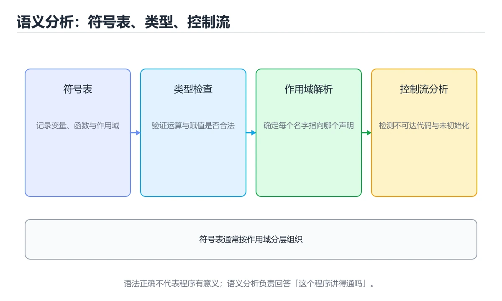
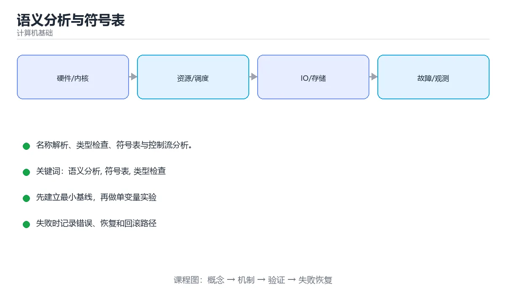

# 语义分析与符号表





> 内容更新时间：2026-10-06 · 学习阶段：基础 · 预计用时：30 分钟

## 学习目标

- 能用自己的话解释语义分析与符号表解决了什么问题，而不是只背术语。
- 能说清 「语义分析」、「符号表」、「类型检查」、「作用域」 之间的关系，并分别举出一个例子。
- 能把本课知识放回「计算机基础」的知识体系，说明它和相邻主题的边界。
- 能完成本课练习，并用验收标准检查自己的结果。

> 一句话摘要：名称解析、类型检查、符号表与控制流分析。

## 前置知识

- 先完成上一课《编译前端：词法与语法分析》；如果已经掌握，可以直接用本课练习自测。
- 本课阶段：基础。建议会读写简单代码或命令，并理解变量、输入输出等基本概念。
- 开始前先复习：语义分析、符号表、类型检查。
- 如果某一步看不懂，先记录具体卡点，完成练习后再回头读一遍。

## 语义分析做什么

语法正确的程序未必有意义（`int x = "abc";` 语法没问题）。语义分析负责：

1. **名称解析**：每个标识符指向哪个声明（作用域链）。
2. **类型检查**：表达式类型是否匹配、函数调用参数是否一致。
3. **一致性检查**：变量是否重复声明、是否所有路径都有返回值、`break` 是否在循环内。
4. **构建符号表与标注 AST**，为后续阶段提供信息。

## 符号表

符号表记录每个名字的声明信息：种类（变量/函数/类型）、类型、作用域层级、存储位置、可见性。

| 实现 | 特点 |
| --- | --- |
| 线性表 | 简单，作用域小的时候够用 |
| 哈希表 | 主流，O(1) 查找 |
| 作用域栈 | 进入块压入，离开块弹出，天然支持嵌套作用域 |

典型查询操作：插入（声明）、查找当前作用域、**向上逐层查找**（词法作用域）、同层重复声明检查。

## 类型系统

| 维度 | 说明 |
| --- | --- |
| 静态 vs 动态 | 类型在编译期还是运行期确定 |
| 强 vs 弱 | 是否允许隐式转换 |
| 名义 vs 结构 | 类型相等靠名字还是靠结构 |
| 类型推断 | 不写类型由编译器推导（HM 算法、局部推断） |

常见检查：赋值兼容、函数调用匹配、运算符重载解析、泛型实例化、空值安全（可空类型）。

## 属性文法与控制流分析

属性文法用「综合属性（自下而上）」与「继承属性（自上而下）」描述语义规则，是类型检查的理论模型。

控制流分析构建控制流图（CFG），用于：**可达性分析**（死代码）、**确定赋值分析**（变量是否一定被初始化）、**返回值检查**（所有路径是否都返回）。

## 错误报告质量

好的语义错误应包含：错误位置、期望类型与实际类型、修复建议（如「需要 `String`，但得到 `int`，考虑使用 `toString()`」）。这也是现代编译器体验的核心竞争力。

## 本课小结

语义分析把「能解析的程序」变成「有意义的程序」：**符号表管名字，类型系统管合法性，控制流分析管路径**。

## 语义分析任务速查

| 任务 | 作用 | 典型错误 |
| --- | --- | --- |
| 名称解析 | 把标识符绑定到声明 | 未定义变量、重复定义 |
| 类型检查 | 验证运算与赋值的类型合法 | 类型不匹配、缺少转换 |
| 隐式转换标注 | 插入必要的转换节点 | 精度丢失未告警 |
| 作用域处理 | 按嵌套层级查找名字 | 遮蔽外层变量 |
| 可访问性检查 | 校验 private / protected | 越权访问 |
| 常量求值 | 编译期计算常量表达式 | 溢出、除零 |
| 确定求值顺序 | 明确副作用顺序 | 未定义求值顺序 |
| 流程检查 | 未初始化变量、不可达代码 | 使用未初始化值 |

## 符号表速查

| 结构 | 适用 | 查找复杂度 |
| --- | --- | --- |
| 线性表 | 极小作用域 | O(n) |
| 哈希表 | 一般语言 | 平均 O(1) |
| 树 / 有序结构 | 需要按名字排序输出 | O(log n) |
| 作用域栈 + 哈希表 | 嵌套作用域 | 平均 O(1) |

```python
class SymbolTable:
    """带作用域的符号表：进入作用域压栈，退出时弹出。"""

    def __init__(self):
        self.scopes = [{}]

    def enter_scope(self) -> None:
        self.scopes.append({})

    def leave_scope(self) -> None:
        if len(self.scopes) == 1:
            raise RuntimeError("不能退出全局作用域")
        self.scopes.pop()

    def declare(self, name: str, info: dict) -> None:
        if name in self.scopes[-1]:
            raise SyntaxError(f"重复定义：{name}")
        self.scopes[-1][name] = info

    def lookup(self, name: str):
        for scope in reversed(self.scopes):        # 从内层向外层查找
            if name in scope:
                return scope[name]
        raise NameError(f"未定义的标识符：{name}")

    def lookup_current(self, name: str):
        return self.scopes[-1].get(name)

def type_check_binary(left: str, op: str, right: str) -> str:
    """极简类型检查规则表。"""
    rules = {
        ("int", "+", "int"): "int",
        ("int", "+", "float"): "float",     # 隐式提升
        ("float", "+", "float"): "float",
        ("str", "+", "str"): "str",
    }
    if (left, op, right) in rules:
        return rules[(left, op, right)]
    raise TypeError(f"类型不匹配：{left} {op} {right}")
```

## 常见错误与排查

| 容易写错的做法 | 实际现象 | 原因与正确做法 |
| --- | --- | --- |
| 符号表不区分作用域 | 内层同名变量覆盖外层 | 用作用域栈，退出时弹出 |
| 查找只查当前作用域 | 找不到外层变量 | 从内向外逐层查找 |
| 声明前使用变量 | 结果不可预期 | 语义分析阶段报「使用未初始化」 |
| 类型检查只看字面量 | 变量类型漏检 | 用符号表记录每个变量的类型 |
| 隐式转换无告警 | 精度悄悄丢失 | 对窄化转换发出警告 |
| 忽略控制流 | 不可达代码与未初始化漏检 | 构建 CFG 并做数据流分析 |
| 报错只给一行信息 | 用户难以定位 | 包含文件、行号、列号与源码片段 |
| 语义分析与语法分析混在一起 | 难以维护与测试 | 分阶段处理，各自独立测试 |
| 常量求值不检查溢出 | 编译期结果错误 | 按目标类型范围检查 |
| 忽略求值顺序 | 有副作用的表达式结果不同 | 明确定义顺序并在文档中说明 |

## 复习与自测

- [ ] 能列出语义分析的主要任务。
- [ ] 会实现带作用域栈的符号表。
- [ ] 能说出类型检查与隐式转换的处理方式。
- [ ] 知道控制流分析能发现哪些问题。
- [ ] 报错信息包含位置与上下文。

## 深入补充：语义分析与符号表

前面已经建立了基本概念。这一节换一个角度，把语义分析与符号表放进真实工程里，
重点回答三件事：它为什么存在、内部如何运转、什么时候会失效。

### 一、核心模型

语义分析把语法树变成带类型与作用域信息的表示。它要完成名称绑定、类型检查、生命周期检查、常量折叠和控制流合法性判断；符号表则是名字到声明、类型、作用域和存储位置的映射。

```text
源码 → 词法 Token → 语法 AST → 建立作用域与符号表 → 名称解析 → 类型检查 → 带注解 IR
```

### 二、关键机制拆解

1. 作用域采用栈式结构：进入函数或代码块时压入新环境，离开时弹出，内层声明可以遮蔽外层同名变量。
2. 符号表条目至少保存名字、种类、类型、声明位置、可见性和所属作用域，函数还要保存参数与返回类型。
3. 类型检查覆盖赋值兼容、运算符约束、函数调用参数、返回值、数组下标和分支条件等规则。
4. 先声明后使用、变量初始化、不可变绑定和跳转语句合法性都属于语义层，而不是语法层。
5. 符号可以带 const、static、mutable、生命周期等属性，这些属性决定后续优化和代码生成策略。
6. 成熟的编译器遇到错误后会同步到下一个安全点继续检查，从而一次报告多个问题，而不是找到第一个就停止。

### 三、对照表：抓住容易混淆的边界

| 维度 | 一侧 | 另一侧 |
| --- | --- | --- |
| 词法分析 | 把字符切成有边界的 Token | 不判断名字指向哪个声明 |
| 语法分析 | 判断 Token 序列是否符合文法 | 不保证类型和名字正确 |
| 语义分析 | 解析名字、类型和作用域关系 | 通常不直接生成机器指令 |
| 运行时环境 | 真正保存变量值并执行查找 | 发生时间远晚于编译期检查 |

### 四、工作示例

例如代码 `int x = "s"; { int x = 1; print(x); } print(x);`：进入内层块时新建作用域，`x` 绑定到整数声明；离开块后该绑定失效，外层 `x` 重新可见。字符串赋给整数会在类型检查阶段报错，不会等到运行时才发现。

### 五、常见误区与失效边界

| 错误做法或假设 | 后果 | 正确做法 |
| --- | --- | --- |
| 只生成 AST，不维护独立符号表 | 重复声明、未声明变量会漏到运行时 | 按作用域建立符号表并保留声明链 |
| 所有代码块共用一张全局表 | 遮蔽、生命周期和重名判断全部出错 | 使用父子环境栈并在离开作用域时弹出 |
| 类型检查只覆盖表达式 | 函数参数和返回值错误无法发现 | 为每个函数建立完整签名并逐一核对调用点 |
| 遇到第一个错误立刻终止 | 用户需要反复编译，定位成本高 | 实现错误恢复和错误节点，继续报告后续问题 |

### 六、场景推演

假设你在实现一门教学语言。输入包含重复声明、未声明变量、字符串与整数相加三种错误。编译器的正确行为是：重复声明和未声明变量在名称解析阶段报告；类型错误在类型检查阶段报告；所有错误都带行列号和修复建议，且不会生成最终代码。

### 七、自测问答

**Q1：为什么 AST 有了变量名，还需要符号表？**

AST 只说明出现了名字，符号表说明这个名字解析到哪一个声明以及它的类型。

**Q2：内层变量遮蔽外层变量时，离开内层后应该查到谁？**

应该查到外层声明，因为内层作用域已经弹出，绑定关系恢复。

**Q3：类型检查为什么必须理解函数签名？**

调用点只有对照参数类型和返回类型，才能判断调用是否合法。

**Q4：错误恢复为什么值得实现？**

它能一次报告多个独立问题，减少反复编译和修复的时间。

### 八、小项目：把知识变成可检查的产出

实现一个 200～300 行的迷你类型检查器：支持变量声明、赋值、加减、函数定义与调用。输入一段含 5 个语义错误的程序，输出每条错误的行列号、错误类型和一句修复建议；正确程序则输出每个变量的最终类型。

### 九、适用边界

语义分析负责“程序是否有意义”，不负责“程序跑得多快”。常量传播、内联和寄存器分配属于后续优化与代码生成。动态语言会把部分检查推迟到运行时，因此静态语义分析越强，运行时兜底就越少。

### 十、完成检查清单

- [ ] 能区分词法、语法、语义和运行时四个阶段
- [ ] 能画出作用域栈和符号表条目的结构
- [ ] 能解释重复声明、未声明和类型不匹配分别在哪一阶段发现
- [ ] 能为函数调用写出参数与返回值检查规则
- [ ] 能说明错误恢复为什么对编译器体验重要

## 动手练习

### 练习 1：概念复述（10 分钟）

合上教程，用 3～5 句话解释语义分析与符号表解决什么问题，并写出一个边界条件。

**验收标准**：至少使用一个本课关键词，并给出一个反例。

### 练习 2：示例改写（20 分钟）

从正文选一个最小示例，先预测修改一个输入后的结果，再实际验证并记录差异。

**验收标准**：留下「原例 → 改动 → 预测 → 结果 → 原因」五步记录。

### 练习 3：迁移任务（30 分钟）

用表格、真值表或计算过程把抽象概念落到一个可核对的结果上。

- 至少覆盖「语义分析」和「符号表」两个关键词。
- 产出一个别人可以检查的结果。
- 写出一个仍不确定的问题和验证方法。

## 可运行练习

### 任务 1：先跑通，再解释

```python
class SymbolTable:
    """带作用域的符号表：进入作用域压栈，退出时弹出。"""

    def __init__(self):
        self.scopes = [{}]

    def enter_scope(self) -> None:
        self.scopes.append({})

    def leave_scope(self) -> None:
        if len(self.scopes) == 1:
            raise RuntimeError("不能退出全局作用域")
        self.scopes.pop()

    def declare(self, name: str, info: dict) -> None:
        if name in self.scopes[-1]:
            raise SyntaxError(f"重复定义：{name}")
        self.scopes[-1][name] = info

    def lookup(self, name: str):
        for scope in reversed(self.scopes):        # 从内层向外层查找
            if name in scope:
                return scope[name]
        raise NameError(f"未定义的标识符：{name}")

    def lookup_current(self, name: str):
        return self.scopes[-1].get(name)

def type_check_binary(left: str, op: str, right: str) -> str:
    """极简类型检查规则表。"""
    rules = {
        ("int", "+", "int"): "int",
        ("int", "+", "float"): "float",     # 隐式提升
        ("float", "+", "float"): "float",
        ("str", "+", "str"): "str",
    }
    if (left, op, right) in rules:
        return rules[(left, op, right)]
    raise TypeError(f"类型不匹配：{left} {op} {right}")
```

### 任务 2：只改一个条件

把「语义分析与符号表」的最小示例复制一份，只改一个条件再跑一次：

- 改动点：只把语义分析的输入换成空值、极值或错误输入，其余保持不变。
- 预测：先写下「语义分析与符号表」在改动后的输出或错误信息，再运行。
- 记录：对照改动前后的结果，指出差异出在哪一步。
- 验收：换回原条件能复现原结果，改动只影响语义分析。

### 任务 3：迁移到自己的数据

用同一套思路处理一组你自己的数据或场景，保持输出格式与任务 1 一致。

## 故障现场

### 现场 1：本课的 语义分析 常规用例通过，但边界用例失败

**症状**：在本课的练习或生产场景里出现“本课的 语义分析 常规用例通过，但边界用例失败”。

**复现**：准备一组最小输入，只保留触发“本课的 语义分析 常规用例通过，但边界用例失败”的必要条件，连续运行两次确认结果稳定。

**定位**：围绕“语义分析 的前置条件与取值边界没有写进代码，默认值掩盖了空值和极值”检查调用链、输入数据和环境配置，先验证假设再改代码。

**预防**：把“本课的 语义分析 常规用例通过，但边界用例失败”写成一条自动化用例，并在本课的验收清单里保留对应检查项。

### 现场 2：本课的 符号表 结果在两次运行之间不一致

**症状**：在本课的练习或生产场景里出现“本课的 符号表 结果在两次运行之间不一致”。

**复现**：准备一组最小输入，只保留触发“本课的 符号表 结果在两次运行之间不一致”的必要条件，连续运行两次确认结果稳定。

**定位**：围绕“符号表 依赖了当前版本、执行顺序或共享状态，单次运行无法暴露差异”检查调用链、输入数据和环境配置，先验证假设再改代码。

**预防**：把“本课的 符号表 结果在两次运行之间不一致”写成一条自动化用例，并在本课的验收清单里保留对应检查项。

### 现场 3：本课的验证只在开发机通过

**症状**：在本课的练习或生产场景里出现“本课的验证只在开发机通过”。

**定位**：围绕“环境版本、配置和输入规模与目标环境不同，语义分析 缺少可重复的验证记录”检查调用链、输入数据和环境配置，先验证假设再改代码。

## 本课复习清单

离开本课前，逐项确认：

- [ ] 不看解析，能说出「符号表的核心作用是？」的判断依据。
- [ ] 不看解析，能说出「嵌套作用域中查找标识符时，编译器会？」的判断依据。
- [ ] 不看解析，能说出「下面哪项属于控制流分析的用途？」的判断依据。
- [ ] 不看解析，能说出「类型检查中的隐式转换（coercion）指的是？」的判断依据。
- [ ] 不看解析，能说出「数据流分析中的「到达定值」主要用于？」的判断依据。
- [ ] 至少运行一次本课示例，记录输入、输出和一个边界情况。
- [ ] 把本课最容易混淆的两个概念写成一句话对照。

| 复盘项 | 记录 |
| --- | --- |
| 已经能独立解释的考点 |  |
| 仍然说不清的概念 |  |
| 下一步验证动作 |  |

## 术语速查

把「语义分析与符号表」里反复出现的术语集中放在一起。复习时先遮住右列，尝试用自己的话解释，再回到正文核对。

| 术语 | 一句话说明 |
| --- | --- |
| `语义分析` | 围绕“环境版本、配置和输入规模与目标环境不同，语义分析 缺少可重复的验证记录”检查调用链、输入数据和环境配置，先验证假设再改代码。 |
| `符号表` | 围绕“符号表 依赖了当前版本、执行顺序或共享状态，单次运行无法暴露差异”检查调用链、输入数据和环境配置，先验证假设再改代码。 |
| `类型检查` | 类型检查：表达式类型是否匹配、函数调用参数是否一致。 |
| `作用域` | 它在「语义分析与符号表」里是理解「作用域」的关键术语，用来解释定义、适用条件与失败路径；它与语义分析、符号表共同决定这一节的判断边界。复习时回到正文示例核对输入、输出和验证方式。 |
| `控制流` | 它在「语义分析与符号表」里是理解「控制流」的关键术语，用来解释定义、适用条件与失败路径；它与语义分析、符号表共同决定这一节的判断边界。复习时回到正文示例核对输入、输出和验证方式。 |

## 考点精讲

### 考点 1：顺序排列·语义分析

- **题目**：按“语义分析与符号表”中 语义分析、符号表、类型检查 的实践顺序，把四个步骤排成从准备到复盘的合理顺序。
- **判断依据**：题干的正确项是固定版本与证据，把“语义分析与符号表”的结论写成可复现记录。在「语义分析与符号表」里，在本课的练习里，顺序应当是：先明确 语义分析 的输入、输出与约束 → 写出最小示例并核对 符号表 的基线结果 → 只改一个变量，记录边界与失败路径的变化 → 固定版本与证据，把本课的结论写成可复现记录。这个顺序把 语义分析 的输入、输出和约束放在最前面，在语义分析与符号表里避免概念没对齐就开始调参。第二步用 符号表 建立可核对的基线，在语义分析与符号表里第三步才允许改变一个变量并观察失败路径。

### 考点 2：概念判断·语义分析

- **题目**：「语义分析与符号表」的核心结论是什么？
- **判断依据**：题干的正确项是语义分析与符号表：名称解析、类型检查、符号表与控制流分析。在「语义分析与符号表」里，把语义分析、符号表、类型检查放进最小示例验证，换成空值或极值后结论仍要成立。回到「语义分析与符号表」的正文示例，用“语义分析与符号表的核心结论是什么”走一遍语义分析、符号表、类型检查的完整流程，能复现的结论才可以保留。

### 考点 3：概念判断·语义分析

- **题目**：下面哪项属于控制流分析的用途？
- **判断依据**：在「语义分析与符号表」里，判断变量是否在所有路径上都被初始化。控制流图还用于死代码消除与返回值检查。「语义分析与符号表」要求先交代语义分析、符号表、类型检查的前提再下结论，所以“判断变量是否在所有路径上都被初始化”只在题干“下面哪项属于控制流分析的用途”给定的条件下成立。把“判断变量是否在所有路径上都被初始化”代回「语义分析与符号表」里“下面哪项属于控制流分析的用途”的例子核对，条件一旦改变，结论就要用语义分析、符号表、类型检查重新推导。

### 考点 4：概念判断·语义分析

- **题目**：类型检查中的隐式转换（coercion）指的是？
- **判断依据**：在「语义分析与符号表」里，结论应落在「由编译器自动插入的类型转换」。隐式转换让代码更简洁，但过度使用会隐藏精度丢失等风险。在「语义分析与符号表」里，这道题要求区分概念与边界，「由编译器自动插入的类型转换」只有在题干给出的前提下才成立，而「只在动态语言中存在」、「运行时才能确定的转换」缺少同一组条件。

### 考点 5：概念判断·到达定值

- **题目**：数据流分析中的「到达定值」主要用于？
- **判断依据**：在「语义分析与符号表」里，判断某点可能由哪些赋值到达。数据流分析在 CFG 上迭代求解，是很多优化的共同基础。回到「语义分析与符号表」的正文示例，用“数据流分析中的到达定值主要用于”走一遍语义分析、符号表、类型检查的完整流程，能复现的结论才可以保留。

### 考点 6：多选辨析·语义分析

- **题目**：以下哪些术语与「语义分析与符号表」直接相关？（多选）
- **判断依据**：符号表是否完整覆盖题干的输入、输出和失败路径，并排除语义分析、部署这类相邻概念。在「语义分析与符号表」里判断这道题，要把语义分析、符号表、类型检查的条件、过程与失败路径逐项对齐，换成“以下哪些术语与语义分析与符号表直接相”这个场景，只有满足前提的结论才成立。“以下哪些术语与直接相关（多选）”与「语义分析与符号表」的术语表相呼应，只有符合语义分析、符号表、类型检查约束的“语义分析”才是正文支持的结论。

## English Overview

**Title:** Semantic Analysis

**Summary:** Name resolution, types, symbol tables and CFG.

**Category:** Fundamentals
**Level:** 基础
**Key terms:** 语义分析, 符号表, 类型检查, 作用域, 控制流

## 内容元数据

- 内容版本：v2.0
- 最后更新：2026-10-06
- 学习阶段：基础
- 适用环境：通用计算机体系结构知识
- 内容来源：内置结构化课程与工程实践整理
- 相关主题：语义分析、符号表、类型检查、作用域、控制流
- 质量版本：P0 测验标准 + P1 覆盖扩展 + P2 体验补全

## 参考资料与复核

- 最后复核：2026-10-04
- 下次复核：2027-04-04
- 复核范围：版本兼容、API 行为、安全建议与工程实践
- 来源性质：官方文档、标准或权威教材；正文为离线教学重组

| 参考资料 | 本课用途 |
| --- | --- |
| [CS50 计算机科学导论](https://cs50.harvard.edu/x/) | 计算机科学综合入门 |
| [MIT 6.004 计算结构](https://ocw.mit.edu/courses/6-004-computation-structures-spring-2017/) | 数字逻辑、ISA 与计算机组织 |
| [MIT 6.006 算法导论](https://ocw.mit.edu/courses/6-006-introduction-to-algorithms-spring-2020/) | 算法与数据结构基础 |

> 「语义分析与符号表」的链接用于离线阅读后的延伸核对；App 不会自动联网。
