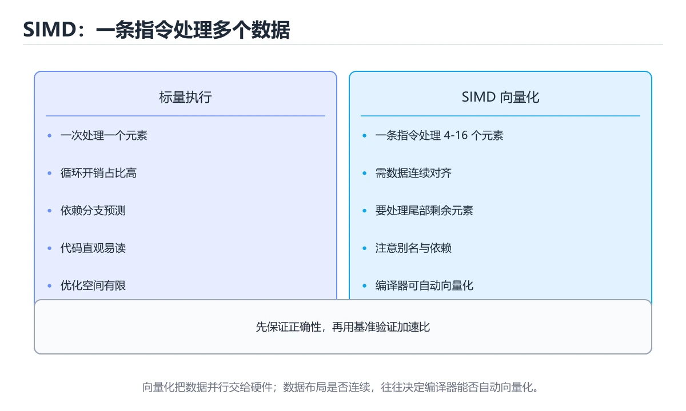
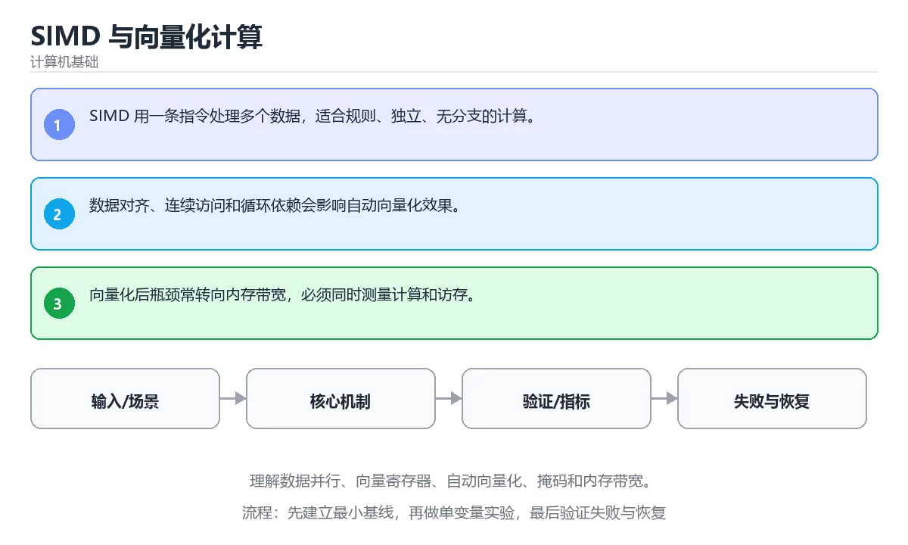

# SIMD 与向量化计算

> 内容更新时间：2026-10-06 · 学习阶段：高级 · 预计用时：35 分钟





## 学习目标

- 能用自己的话解释：SIMD 用一条指令处理多个数据，适合规则、独立、无分支的计算。
- 能用自己的话解释：数据对齐、连续访问和循环依赖会影响自动向量化效果。
- 能用自己的话解释：向量化后瓶颈常转向内存带宽，必须同时测量计算和访存。
- 能把本课知识放回「计算机基础」，并完成练习与测验。

## 前置知识

- 已完成本分类的基础课程，能独立运行 SIMD 的最小示例。
- 本课关键词：SIMD、向量化、数据并行、内存带宽。
- 遇到不熟悉的术语先记录问题，完成练习后再回读。

## 核心知识

### 1. SIMD 用一条指令处理多个数据，适合规则、独立、无分支的计算。

- 关键做法：基线只保留 向量化 必需的部分，其余条件一次加一个。
- 验证标准：向量化 的异常路径有明确错误信息与恢复动作。

### 2. 数据对齐、连续访问和循环依赖会影响自动向量化效果。

把这条结论放回「SIMD 与向量化计算」的完整流程里展开：

- 正文依据：能用自己的话解释：SIMD 用一条指令处理多个数据，适合规则、独立、无分支的计算。
- 落地检查：把「2. 数据对齐、连续访问和循环依赖会影响自动向量化效果。」改写成一条可执行的核对项，逐条验证输入、超时与失败路径。

### 3. 向量化后瓶颈常转向内存带宽，必须同时测量计算和访存。

把这条结论放回「SIMD 与向量化计算」的完整流程里展开：

- 正文依据：能用自己的话解释：数据对齐、连续访问和循环依赖会影响自动向量化效果。
- 落地检查：把「3. 向量化后瓶颈常转向内存带宽，必须同时测量计算和访存。」改写成一条可执行的核对项，逐条验证输入、超时与失败路径。

## 关键流程

```text
输入 → 校验 → 核心处理 → 验证 → 记录指标 → 失败恢复
```

## 实践路径

1. 用一句话复述本课要解决的问题。
2. 跑通正文中的最小示例并记录基线。
3. 只改变一个输入或参数，预测并验证结果。
4. 补一个失败路径，记录错误、恢复和指标。
5. 把结论写成可复现的笔记或测试。

## 常见错误与排查

> 说明：本表由《SIMD 与向量化计算》的核心知识整理（2026-10-07），人工复核进度见 docs/content_review_batches.md。

| 易错点 | 容易踩的做法 | 正确结论 |
| --- | --- | --- |
| 以为打开编译选项就会向量化 | 依赖与别名分析阻止了向量化 | 查看向量化报告，必要时改写数据布局 |
| 忽略对齐与尾部元素 | 边界处理出错或性能下降 | 按块处理主体并单独处理尾部，确认对齐要求 |
| 盲目手写内置函数 | 可移植性差且未必更快 | 优先依赖自动向量化，手写前先做基准对比 |

## 动手练习

1. 合上教程，用 3～5 句话解释SIMD 与向量化计算。
2. 从正文选一个例子，改变一个条件并预测结果。
3. 设计一个失败场景，写出止损与恢复步骤。

**验收标准**：留下输入、命令、输出、差异和下一步问题。

## 本课小结

- 本课围绕 SIMD、向量化、数据并行、内存带宽 展开，复习时重点核对它们的输入、输出和失败路径。
- 完成练习和测验后，把 SIMD 上仍然不确定的问题写成下一轮验证清单。


## 可运行练习

### 任务 1：先跑通，再解释

```python
values = [1.0, 2.0, 3.0, 4.0]
scaled = [value * 2 for value in values]
print(scaled)
```

### 任务 2：只改一个条件

把「SIMD 与向量化计算」的最小示例复制一份，只改一个条件再跑一次：

- 改动点：只调整 values 的一个参数，其余条件一律不动。
- 预测：先写下「SIMD 与向量化计算」在改动后的输出或错误信息，再运行。
- 记录：对照改动前后的结果，指出差异出在哪一步。
- 验收：换回原条件能复现原结果，改动只影响SIMD。

### 任务 3：迁移到自己的数据

把 values 换成你自己的输入，先保持步骤不变，再比较输出差异。

## 故障现场

### 现场 1：以为打开编译选项就会向量化

**症状**：在《SIMD 与向量化计算》的复现场景中，依赖与别名分析阻止了向量化。

**根因**：触发点是把“以为打开编译选项就会向量化”当成安全做法。它没有满足《SIMD 与向量化计算》要求的前提，因此先表现为“依赖与别名分析阻止了向量化”；排查时先完整复现这一段，再核对输入、配置与依赖。

**修复**：针对《SIMD 与向量化计算》的问题，查看向量化报告，必要时改写数据布局。

**验证**：在《SIMD 与向量化计算》中按“查看向量化报告，必要时改写数据布局”调整后，从“以为打开编译选项就会向量化”的触发条件重放同一条路径，确认“依赖与别名分析阻止了向量化”不再出现，并补一个相邻边界用例检查没有引入新问题。

### 现场 2：忽略对齐与尾部元素

**症状**：在《SIMD 与向量化计算》的复现场景中，边界处理出错或性能下降。

**根因**：当出现“忽略对齐与尾部元素”时，执行路径已经绕过了《SIMD 与向量化计算》的关键约束，最终以“边界处理出错或性能下降”暴露出来；修复前必须先确认约束在哪里失效。

**修复**：针对《SIMD 与向量化计算》的问题，按块处理主体并单独处理尾部，确认对齐要求。

**验证**：保留《SIMD 与向量化计算》里触发“边界处理出错或性能下降”的输入、版本和日志，按“按块处理主体并单独处理尾部，确认对齐要求”完成修改后原样重放；只有失败现象消失且相邻场景仍可解释，才保留改动。

### 现场 3：盲目手写内置函数

**症状**：在《SIMD 与向量化计算》的复现场景中，可移植性差且未必更快。

**根因**：当出现“盲目手写内置函数”时，执行路径已经绕过了《SIMD 与向量化计算》的关键约束，最终以“可移植性差且未必更快”暴露出来；修复前必须先确认约束在哪里失效。

**修复**：针对《SIMD 与向量化计算》的问题，优先依赖自动向量化，手写前先做基准对比。

**验证**：在《SIMD 与向量化计算》中按“优先依赖自动向量化，手写前先做基准对比”调整后，从“盲目手写内置函数”的触发条件重放同一条路径，确认“可移植性差且未必更快”不再出现，并补一个相邻边界用例检查没有引入新问题。

## 本课复习清单


离开本课前，逐项确认：

- [ ] 不看解析，能说出「关于「SIMD 用一条指令处理多个数据，适合规则、独立、无分支的计算。」，下列说法正确的是？」的判断依据。
- [ ] 不看解析，能说出「阅读「SIMD 与向量化计算」正文里的这段 Python 代码，下面哪一项判断是正确的？」的判断依据。
- [ ] 不看解析，能说出「关于「向量化后瓶颈常转向内存带宽，必须同时测量计算和访存。」，下列说法正确的是？」的判断依据。
- [ ] 至少运行一次《SIMD 与向量化计算》的示例，记录输入、输出和一个边界情况。
- [ ] 把本课最容易混淆的两个概念写成一句话对照。

| 复盘项 | 记录 |
| --- | --- |
| 已经能独立解释的考点 |  |
| 仍然说不清的概念 |  |
| 下一步验证动作 |  |

## 复习与自测

逐节自检：能说清 SIMD 的输入、输出与失败路径才算通过，否则回到原文。

### 核心知识

自检：这一节与相邻主题的边界在哪里？

### 动手练习

自检：如果去掉这一节里的一个前提，结论会怎样变化？

### 最小可运行示例

```python
values = [1.0, 2.0, 3.0, 4.0]
scaled = [value * 2 for value in values]
print(scaled)
```

自检：把这一节讲给没学过的人，最需要强调哪一点？

### 预期输出

```text
[2.0, 4.0, 6.0, 8.0]
```

### 验证步骤

制造一次错误输入，记录错误信息与修复方式。
### 追问 1：关于「SIMD 用一条指令处理多个数据，适合规则、独立、无分支的计算。」，下列说法正确的是？

- 先写下判断，再对照：SIMD 用一条指令处理多个数据，适合规则、独立、无分支的计算。
- 检查点：向量化 的结论依赖哪一个隐含前提？

### 追问 2：关于「数据对齐、连续访问和循环依赖会影响自动向量化效果。」，下列说法正确的是？

- 先写下判断，再对照：数据对齐、连续访问和循环依赖会影响自动向量化效果。

### 追问 3：关于「向量化后瓶颈常转向内存带宽，必须同时测量计算和访存。」，下列说法正确的是？

- 先写下判断，再对照：向量化后瓶颈常转向内存带宽，必须同时测量计算和访存。

### 追问 4：本课的核心学习目标是什么？

- 先写下判断，再对照：理解数据并行、向量寄存器、自动向量化、掩码和内存带宽。

## 术语速查

| 术语 | 一句话说明 |
| --- | --- |
| `SIMD` | 单指令多数据并行，用一条指令同时处理多个数据元素。 |
| `向量化` | 把循环或标量操作转换成批量 SIMD 运算，提高数据吞吐。 |
| `数据并行` | 把同一运算同时应用到多份数据，硬件上可由 SIMD、GPU 或分布式任务实现。 |
| `内存带宽` | 单位时间内 CPU 或 GPU 能从内存读取或写入的数据量。 |

## 零基础精讲：把SIMD 与向量化计算真正讲透

### 先建立一个直觉

把计算机看成一个分层机器：逻辑门组成运算单元，指令驱动数据移动，缓存缩短等待时间，操作系统把硬件抽象成可编程接口。落到本课，「SIMD 与向量化计算」关心的是 SIMD 与 向量化 的配合，也就是说这条直觉要在 核心知识 里被具体验证。

本课的摘要可以当作一张地图：理解数据并行、向量寄存器、自动向量化、掩码和内存带宽。

### 逐步拆解

1. 澄清输入与目标。先写清「SIMD 与向量化计算」要解决的问题、合法输入范围和成功标准，再进入后续步骤。
2. 描述处理过程。把「SIMD、向量化、数据并行、内存带宽」映射到具体步骤，每步都要求能单独验证。
3. 定义输出。明确 SIMD 与 向量化 各自的产物，以及失败时留下什么证据。
4. 先预测SIMD会怎样失败，再实际触发一次；差异部分就是本课最需要补的前提。
5. 把 values 的规模缩小到一眼能算清的程度，手动推导结果后再用程序验证，差异处就是理解漏洞。

### 把正文串成一条执行链

- **1. SIMD 用一条指令处理多个数据，适合规则、独立、无分支的计算。**：在「SIMD 与向量化计算」里，「1. SIMD 用一条指令处理多个数据，适合规则、独立、无分支的计算。」这一步要先写清输入与预期，再记录实际结果和差异；结果不符时回到对应小节核对前提。
- **2. 数据对齐、连续访问和循环依赖会影响自动向量化效果。**：在「SIMD 与向量化计算」里，「2. 数据对齐、连续访问和循环依赖会影响自动向量化效果。」这一步要先写清输入与预期，再记录实际结果和差异；结果不符时回到对应小节核对前提。
- **3. 向量化后瓶颈常转向内存带宽，必须同时测量计算和访存。**：在「SIMD 与向量化计算」里，「3. 向量化后瓶颈常转向内存带宽，必须同时测量计算和访存。」这一步要先写清输入与预期，再记录实际结果和差异；结果不符时回到对应小节核对前提。
- **考点 1：关于「SIMD 用一条指令处理多个数据，适合规则、独立、无分支的计算。」，下列说法正确的是？**：先独立作答，再回到本课对应小节核对判断依据；答错时记录是哪一个前提被忽略。
- **考点 2：核心知识 的代码阅读题**：先独立作答，再回到本课正文核对 values 的执行路径；答错时记录是哪一个前提被忽略。
- **考点 3：关于「向量化后瓶颈常转向内存带宽，必须同时测量计算和访存。」，下列说法正确的是？**：先独立作答，再回到本课对应小节核对判断依据；答错时记录是哪一个前提被忽略。

### 从测验反推易错点

**检查点 1：关于「SIMD 用一条指令处理多个数据，适合规则、独立、无分支的计算。」，下列说法正确的是？**

- 参考判断：SIMD 用一条指令处理多个数据，适合规则、独立、无分支的计算。
- 自问：如果去掉题干里的一个限定词，结论还成立吗？

**检查点 2：关于「数据对齐、连续访问和循环依赖会影响自动向量化效果。」，下列说法正确的是？**

- 参考判断：数据对齐、连续访问和循环依赖会影响自动向量化效果。

**检查点 3：关于「向量化后瓶颈常转向内存带宽，必须同时测量计算和访存。」，下列说法正确的是？**

- 参考判断：向量化后瓶颈常转向内存带宽，必须同时测量计算和访存。

**检查点 4：本课的核心学习目标是什么？**

- 参考判断：理解数据并行、向量寄存器、自动向量化、掩码和内存带宽。

**检查点 5：以下哪些术语与SIMD 与向量化计算直接相关？（多选）**

- 参考判断：SIMD、向量化

### 工程排错顺序

| 先查什么 | 要得到的证据 | 判断标准 |
| --- | --- | --- |
| 输入如何表示，位宽与精度是否明确？ | 日志、输入样例、测试或指标 | 能复现并解释，才算定位 |
| 数据经过哪些层级，瓶颈在哪一层？ | 日志、输入样例、测试或指标 | 能复现并解释，才算定位 |
| 顺序、分支与并行如何影响结果？ | 日志、输入样例、测试或指标 | 能复现并解释，才算定位 |
| 是否用基准测试验证了推断？ | 日志、输入样例、测试或指标 | 能复现并解释，才算定位 |

### 变式训练

1. 把 SIMD 的实现压缩到一个进程内，去掉所有外部依赖后再谈扩展。
2. 扩大 向量化 的规模，记录本课结论在哪一个量级开始不成立。
3. 把 向量化 换成失败输入，记录错误信息与恢复动作。
5. 故意跳过 向量化 的检查再运行，比较与正常流程的差异，并说明这个检查挡住的到底是哪一类失败。
6. 把 SIMD 的方案切换到低资源设备，重新评估默认参数、超时和降级策略。

### 本课自测

- [ ] 能用一句话解释「SIMD」在本课中的角色与边界。
- [ ] 能举出一个正常例子和一个失败例子。
- [ ] 能说出最小验证步骤，以及需要记录的证据。
- [ ] 能用一句话解释「向量化」在本课中的角色与边界。
- [ ] 能用一句话解释「数据并行」在本课中的角色与边界。
- [ ] 能用一句话解释「内存带宽」在本课中的角色与边界。

### 迁移案例库

围绕 values 重复同一套方法，每完成一轮就把差异写进笔记。

#### 迁移案例 1：围绕「SIMD」做一次小实验

**目标**：在不改变课程主体的前提下，验证SIMD 与向量化计算中的一个关键判断。

**步骤**：
1. 复述当前方案对「SIMD」的假设，写成一句可证伪的话。
2. 设计一个正常输入和一个边界输入，分别预测输出。
3. 运行或逐步演算，记录实际输出、耗时和失败信息。
4. 只调整一个参数，比较前后差异并解释原因。
5. 补充一条测试或复习卡，确保下次能更快复现。

**验收**：迁移过程要留下 values 的可运行记录，并说明向量化在新场景下是否仍然成立。

#### 迁移案例 2：围绕「向量化」做一次小实验

**步骤**：
1. 复述当前方案对「向量化」的假设，写成一句可证伪的话。

#### 迁移案例 3：围绕「数据并行」做一次小实验

**步骤**：
1. 复述当前方案对「数据并行」的假设，写成一句可证伪的话。

#### 迁移案例 4：围绕「内存带宽」做一次小实验

**步骤**：
1. 复述当前方案对「内存带宽」的假设，写成一句可证伪的话。

#### 迁移案例 5：围绕「SIMD」做一次小实验

**步骤**：

#### 迁移案例 6：围绕「向量化」做一次小实验

**步骤**：

#### 迁移案例 7：围绕「数据并行」做一次小实验

**步骤**：

#### 迁移案例 8：围绕「内存带宽」做一次小实验

**步骤**：

#### 迁移案例 9：围绕「SIMD」做一次小实验

**步骤**：

#### 迁移案例 10：围绕「向量化」做一次小实验

**步骤**：

#### 迁移案例 11：围绕「数据并行」做一次小实验

**步骤**：

#### 迁移案例 12：围绕「内存带宽」做一次小实验

**步骤**：

#### 迁移案例 13：围绕「SIMD」做一次小实验

**步骤**：

#### 迁移案例 14：围绕「向量化」做一次小实验

**步骤**：

#### 迁移案例 15：围绕「数据并行」做一次小实验

**步骤**：

#### 迁移案例 16：围绕「内存带宽」做一次小实验

**步骤**：

<!-- p0-depth-v2:end -->

## 考点精讲

### 考点 1：概念判断·SIMD

- **题目**：关于「SIMD 用一条指令处理多个数据，适合规则、独立、无分支的计算。」，下列说法正确的是？
- **判断依据**：在「SIMD 与向量化计算」里，SIMD 用一条指令处理多个数据，适合规则、独立、无分支的计算。回到「SIMD 与向量化计算」的正文示例，用“关于SIMD 用一条指令处理多个数据”走一遍SIMD、向量化、数据并行的完整流程，能复现的结论才可以保留。

### 考点 2：代码补全·SIMD

- **题目**：阅读「SIMD 与向量化计算」正文里的这段 Python 代码，下面哪一项判断是正确的？
- **判断依据**：在「SIMD 与向量化计算」里，题干的正确项是这段代码会产生可观察的输出，运行后能看到结果，在「SIMD 与向量化计算」里要结合SIMD核对输出是否符合预期。把输入或边界换成空值、极值或失败情况后，结论要以「SIMD 与向量化计算」的实际运行结果为准。把“这段代码会产生可观察的输出”代回「SIMD 与向量化计算」里“阅读SIMD 与向量化计算正文里的这段 Python 代码”的例子核对，条件一旦改变，结论就要用SIMD、向量化、数据并行重新推导。

### 考点 3：概念判断·SIMD

- **题目**：关于「向量化后瓶颈常转向内存带宽，必须同时测量计算和访存。」，下列说法正确的是？
- **判断依据**：在「SIMD 与向量化计算」里，向量化后瓶颈常转向内存带宽，必须同时测量计算和访存。在「SIMD 与向量化计算」里，如果只凭关键词作答，很容易把NUMA 下跨节点访存更慢，线程和内存亲和性会影响性能。把“向量化后瓶颈常转向内存带宽”代回「SIMD 与向量化计算」里“向量化后瓶颈常转向内存带宽”的例子核对，条件一旦改变，结论就要用SIMD、向量化、数据并行重新推导。

### 考点 4：概念判断·SIMD

- **题目**：「SIMD 与向量化计算」的核心学习目标是什么？
- **判断依据**：在「SIMD 与向量化计算」里，结论应落在「理解数据并行、向量寄存器、自动向量化、掩码和内存带宽」。在「SIMD 与向量化计算」里，结论应落在理解数据并行、向量寄存器、自动向量化、掩码和内存带宽。在「SIMD 与向量化计算」里，这道题要求区分概念与边界，理解数据并行、向量寄存器、自动向量化、掩码和内存带宽。

### 考点 5：多选辨析·SIMD

- **题目**：以下哪些术语与「SIMD 与向量化计算」直接相关？（多选）
- **判断依据**：在「SIMD 与向量化计算」里判断这道题，要把SIMD、向量化、数据并行的条件、过程与失败路径逐项对齐，换成“以下哪些术语与SIMD 与向量化计算”这个场景，只有满足前提的结论才成立。“以下哪些术语与SIMD”与「SIMD 与向量化计算」的术语表相呼应，只有符合SIMD、向量化、数据并行约束的“SIMD”才是正文支持的结论。

### 考点 6：顺序排列·SIMD

- **题目**：按照「SIMD 与向量化计算」从概念到实践的讲解顺序排列下列主题。
- **判断依据**：结合SIMD、向量化来看，正确的执行顺序是「核心知识 → 关键流程 → 实践路径 → 常见误区」。本课围绕理解数据并行、向量寄存器、自动向量化、掩码和内存带宽。这道题的关键在「SIMD 与向量化计算」的SIMD、向量化、数据并行：先确认题干“按照SIMD 与向量化计算从概念到实”问的是哪一步，再排除偷换前提的选项。

## English Overview

**Title:** SIMD and Vectorized Computing

**Summary:** Learn data parallelism, vector registers, auto-vectorization, masks and bandwidth.

**Category:** Fundamentals
**Level:** 高级
**Key terms:** SIMD, 向量化, 数据并行, 内存带宽

## 内容元数据

- 内容版本：v2.0
- 最后更新：2026-10-06
- 学习阶段：高级
- 适用环境：通用计算机体系结构知识；本课聚焦 SIMD。
- 内容来源：内置结构化课程与工程实践整理
- 相关主题：SIMD、向量化、数据并行、内存带宽
- 质量版本：P0 测验标准 + P1 覆盖扩展 + P2 体验补全

## 最小可运行示例

先用 values 跑通最小示例，然后只改一个与 SIMD 相关的取值：

```python
values = [1.0, 2.0, 3.0, 4.0]
scaled = [value * 2 for value in values]
print(scaled)
```

## 预期输出

```text
[2.0, 4.0, 6.0, 8.0]
```

## 验证步骤

1. 记录运行环境、命令和真实输出。
2. 修改一个输入，先写预测再运行。
4. 把结论写回本课笔记或测试用例。

## 参考资料与复核

- 最后复核：2026-10-04
- 下次复核：2027-03-17
- 复核范围：版本兼容、API 行为、安全建议与工程实践
- 来源性质：官方文档、标准或权威教材；正文为离线教学重组

| 参考资料 | 本课用途 |
| --- | --- |
| [CS50 计算机科学导论](https://cs50.harvard.edu/x/) | 计算机科学综合入门 |
| [MIT 6.004 计算结构](https://ocw.mit.edu/courses/6-004-computation-structures-spring-2017/) | 数字逻辑、ISA 与计算机组织 |
| [NIST 二进制与数据表示](https://www.nist.gov/pml/owm/binary-information) | 二进制、位与数据单位 |

> 「SIMD 与向量化计算」的链接用于离线阅读后的延伸核对；App 不会自动联网。

## 复习与迁移

复习目标：把「SIMD 与向量化计算」的判断标准放回可复现的例子里。先自己作答，再对照依据；如果结论正确但理由不完整，回到正文补足前提。

### 概念复述

- 用一句话说明「SIMD 与向量化计算」解决什么问题：理解数据并行、向量寄存器、自动向量化、掩码和内存带宽。
- 写出SIMD、向量化、数据并行之间的关系，并各举一个例子。
- 说出本课最容易混淆的两个概念，以及区分它们的判据。

### 正文逐节复核

- **零基础精讲：把SIMD 与向量化计算真正讲透**：本课的摘要可以当作一张地图：理解数据并行、向量寄存器、自动向量化、掩码和内存带宽。

### 测验回顾

1. 关于「SIMD 用一条指令处理多个数据，适合规则、独立、无分支的计算。」，下列说法正确的是？
   - 依据：在「SIMD 与向量化计算」里，SIMD 用一条指令处理多个数据，适合规则、独立、无分支的计算。回到「SIMD 与向量化计算」的正文示例，用“关于SIMD 用一条指令处理多个数据”走一遍SIMD、向量化、数据并行的完整流程，能复现的结论才可以保留。
2. 阅读「SIMD 与向量化计算」正文里的这段 Python 代码，下面哪一项判断是正确的？
   - 依据：在「SIMD 与向量化计算」里，题干的正确项是这段代码会产生可观察的输出，运行后能看到结果，在「SIMD 与向量化计算」里要结合SIMD核对输出是否符合预期。把输入或边界换成空值、极值或失败情况后，结论要以「SIMD 与向量化计算」的实际运行结果为准。把“这段代码会产生可观察的输出”代回「SIMD 与向量化计算」里“阅读SIMD 与向量化计算正文里的这段 Python 代码”的例子核对，条件一旦改变，结论就要用SIMD、向量化、数据并行重新推导。
3. 关于「向量化后瓶颈常转向内存带宽，必须同时测量计算和访存。」，下列说法正确的是？
   - 依据：在「SIMD 与向量化计算」里，向量化后瓶颈常转向内存带宽，必须同时测量计算和访存。在「SIMD 与向量化计算」里，如果只凭关键词作答，很容易把NUMA 下跨节点访存更慢，线程和内存亲和性会影响性能。把“向量化后瓶颈常转向内存带宽”代回「SIMD 与向量化计算」里“向量化后瓶颈常转向内存带宽”的例子核对，条件一旦改变，结论就要用SIMD、向量化、数据并行重新推导。
4. 「SIMD 与向量化计算」的核心学习目标是什么？
   - 依据：在「SIMD 与向量化计算」里，结论应落在「理解数据并行、向量寄存器、自动向量化、掩码和内存带宽」。在「SIMD 与向量化计算」里，结论应落在理解数据并行、向量寄存器、自动向量化、掩码和内存带宽。在「SIMD 与向量化计算」里，这道题要求区分概念与边界，理解数据并行、向量寄存器、自动向量化、掩码和内存带宽。
5. 以下哪些术语与「SIMD 与向量化计算」直接相关？（多选）
   - 依据：在「SIMD 与向量化计算」里判断这道题，要把SIMD、向量化、数据并行的条件、过程与失败路径逐项对齐，换成“以下哪些术语与SIMD 与向量化计算”这个场景，只有满足前提的结论才成立。“以下哪些术语与SIMD”与「SIMD 与向量化计算」的术语表相呼应，只有符合SIMD、向量化、数据并行约束的“SIMD”才是正文支持的结论。
6. 按照「SIMD 与向量化计算」从概念到实践的讲解顺序排列下列主题。
   - 依据：结合SIMD、向量化来看，正确的执行顺序是「核心知识 → 关键流程 → 实践路径 → 常见误区」。本课围绕理解数据并行、向量寄存器、自动向量化、掩码和内存带宽。这道题的关键在「SIMD 与向量化计算」的SIMD、向量化、数据并行：先确认题干“按照SIMD 与向量化计算从概念到实”问的是哪一步，再排除偷换前提的选项。

### 迁移练习

把「SIMD 与向量化计算」的结论迁移到相邻主题，每次迁移都写清预测与证据：

1. 换输入：用SIMD处理一组你自己的数据，对比教材示例的结果差异。
2. 换失败条件：制造一个向量化相关的错误，说明如何从错误信息定位根因。
3. 换规模：把数据量或并发度提高一个数量级，说明「SIMD 与向量化计算」的结论是否仍成立。
