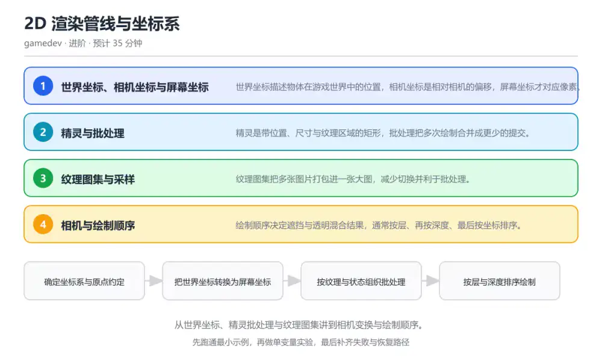
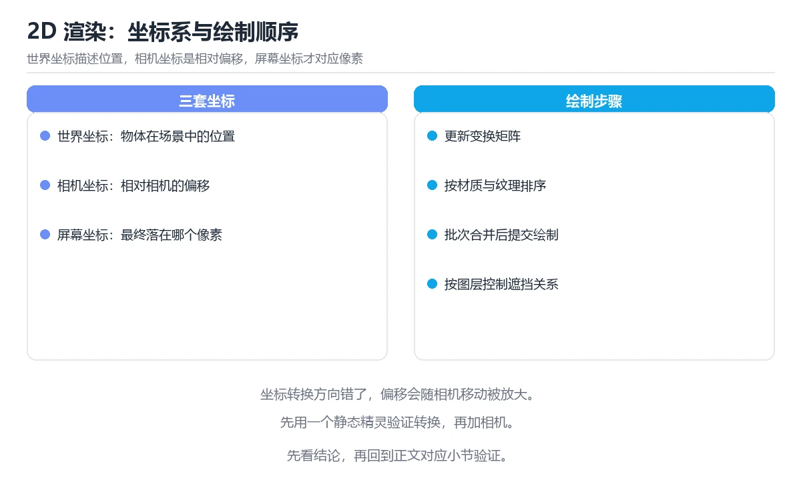

# 2D 渲染管线与坐标系

> 内容更新时间：2026-10-06 · 学习阶段：进阶 · 预计用时：40 分钟

分类：gamedev。关键词：坐标系、精灵、批处理、纹理图集、相机。从世界坐标、精灵批处理与纹理图集讲到相机变换与绘制顺序。



## 本节知识框架

**课程定位**：所属分类 `gamedev`（图形与游戏开发），课程主题 `2D 渲染管线与坐标系`，学习阶段 进阶，建议用时 45 分钟。

本课主线：从世界坐标、精灵批处理与纹理图集讲到相机变换与绘制顺序。

**学完本课应当能够**
- 说清 `世界坐标` 与 `屏幕坐标` 的含义与区别，并各举一个正例和一个反例。
- 用本课示例验证 `精灵` 的行为，记录输入、输出与失败条件。
- 遇到「输入坐标与世界坐标混用」这类问题时，能说出触发条件与修复顺序。

### 从概念到验证的学习链条

1. `世界坐标`：先掌握 描述物体在游戏世界中位置的统一坐标系，再用它解释 `屏幕坐标` 为什么会出现。
2. `屏幕坐标`：先掌握 以像素为单位、原点通常在左上角的显示坐标系，再用它解释 `精灵` 为什么会出现。
3. `精灵`：先掌握 带位置与纹理区域的二维可绘制单元，再用它解释 `纹理图集` 为什么会出现。
4. `纹理图集`：先掌握 把多张小图打包成一张大图的资源组织方式，再用它解释 `绘制调用` 为什么会出现。
5. `绘制调用`：先掌握 向图形接口提交一次绘制的操作，次数越少开销越低，再用它解释 `相机坐标` 为什么会出现。
6. `相机坐标`：先掌握 世界坐标描述物体在游戏世界中的位置，相机坐标是相对相机的偏移，屏幕坐标才对应像素，再用它解释 本课示例的观察结果 为什么会出现。

**先修与衔接**：本课是「图形与游戏开发」分类的第 3 课。当前没有登记显式先修或后续课程；课程主线是从世界坐标、精灵批处理与纹理图集讲到相机变换与绘制顺序。学完后按 `gamedev` 分类顺序继续。

### 完成判据

- **定义关**：不看正文也能说明 `世界坐标` 是 描述物体在游戏世界中位置的统一坐标系，并指出一个反例。
- **机制关**：能按“输入 → 转换 → 输出 → 验证”复述 `2D 渲染管线与坐标系`，而不是只背结论。
- **示例关**：能运行或推演 `2D 渲染管线与坐标系` 的 `text` 示例，并说明一个真实出现的标识符或字面量。
- **证据关**：能从 `2D 渲染管线与坐标系` 的示例写出一个输入、处理、输出三元组，并说明它支持或反驳了本课的哪一条结论。
- **排错关**：能复现 输入坐标与世界坐标混用，记录现象并按 先把屏幕坐标反变换到世界坐标再做碰撞与拾取 修复。
- **迁移关**：能把 `坐标系`、`精灵`、`批处理`、`纹理图集` 放进一个与 `2D 渲染管线与坐标系` 不同的项目场景，并保持输入与验证条件可追踪。
- **复盘关**：学完 `2D 渲染管线与坐标系` 后，用一句话写下仍然不确定的结论，并列出下一次验证需要的输入、环境和成功判据。

### 复习清单

- [ ] 能不看正文复述本课核心术语，并指出一个边界或反例。
- [ ] 能运行或推演本课示例，记录输入、输出与失败现象。
- [ ] 能完成一次自测，并把错题对照错误表定位原因。

**本课配图**



## 核心概念定义

| 术语 | 操作性定义 | 常见边界与风险 |
| --- | --- | --- |
| 世界坐标 | 描述物体在游戏世界中位置的统一坐标系。 | 易错：直接把鼠标屏幕坐标当作世界坐标参与碰撞；正确做法是先把屏幕坐标反变换到世界坐标再做碰撞与拾取。 |
| 屏幕坐标 | 以像素为单位、原点通常在左上角的显示坐标系。 | 易错：直接把鼠标屏幕坐标当作世界坐标参与碰撞；正确做法是先把屏幕坐标反变换到世界坐标再做碰撞与拾取。 |
| 精灵 | 带位置与纹理区域的二维可绘制单元。 | 易错：每个精灵都从不同小图绘制，导致大量状态切换；正确做法是把常用精灵打进同一图集并按纹理排序提交。 |
| 纹理图集 | 把多张小图打包成一张大图的资源组织方式。 | 只在「把多张小图打包成一张大图的资源组织方式」这一前提下成立，换输入或换环境要重新验证。 |
| 绘制调用 | 向图形接口提交一次绘制的操作，次数越少开销越低。 | 隔离级别与并发事务会影响可见性，换级别或换存储引擎后要重新验证。 |
| 相机坐标 | 世界坐标描述物体在游戏世界中的位置，相机坐标是相对相机的偏移，屏幕坐标才对应像素 | 只在「世界坐标描述物体在游戏世界中的位置，相机坐标是相对相机的偏移，屏幕坐标才对应像素」这一前提下成立，换输入或换环境要重新验证。 |

## 原理与运行机制

### 机制总览

**教材衔接：核心知识**

### 1. 世界坐标、相机坐标与屏幕坐标

世界坐标描述物体在游戏世界中的位置，相机坐标是相对相机的偏移，屏幕坐标才对应像素。

相机变换通常是平移加缩放，有时再加旋转；变换后落在视口外的物体被裁剪，剩余部分映射到屏幕像素。

在2D 渲染管线与坐标系里可以这样验证：把相机位置向右移动 100 像素，观察世界坐标不变的物体在屏幕坐标上左移同样的距离。

边界：混用坐标系会让输入与碰撞对不上：鼠标点击给的是屏幕坐标，碰撞检测用的是世界坐标。

工程视角：在代码层区分坐标类型，坐标转换集中到相机对象里，避免各处手写偏移量。

### 2. 精灵与批处理

精灵是带位置、尺寸与纹理区域的矩形，批处理把多次绘制合并成更少的提交。

绘制调用之间的纹理切换与状态切换开销最大，把使用同一纹理的精灵连续提交就能显著减少调用次数。

在2D 渲染管线与坐标系里可以这样验证：统计一帧的绘制调用次数，把同一图集的精灵排在一起后再统计一次，比较两者的差距。

边界：批处理不是免费的：需要在内存中组织顶点数据，静态场景收益明显，频繁变动的精灵可能得不偿失。

工程视角：给渲染层加上绘制调用计数器，把调用次数纳入帧预算，而不是只盯帧率。

### 3. 纹理图集与采样

纹理图集把多张图片打包进一张大图，减少切换并利于批处理。

每个精灵记录图集内的子矩形，采样时按子矩形取纹理坐标；图集边缘需要留出间距以避免相邻像素渗色。

在2D 渲染管线与坐标系里可以这样验证：把两张小图并进同一图集，观察绘制调用次数是否下降与边缘是否出现渗色。

边界：图集过大会超出部分设备的纹理尺寸上限，过小又会让频繁使用的精灵分散在多张图里。

工程视角：按场景或层级分组打包图集，并在构建期检查尺寸上限与留白参数。

### 4. 相机与绘制顺序

绘制顺序决定遮挡与透明混合结果，通常按层、再按深度、最后按坐标排序。

不透明物体可以使用深度缓冲，半透明物体必须按从远到近绘制才能得到正确的混合结果。

在2D 渲染管线与坐标系里可以这样验证：把两个半透明精灵的绘制顺序交换，观察重叠区域的颜色变化。

边界：同一帧内频繁改变排序键会让排序成本上升，动态层级还会引发每帧重排。

工程视角：把排序键设计成整数组合（层、深度、坐标），排序结果可预测且便于调试。

**教材衔接：关键流程**

```text
确定坐标系与原点约定 → 把世界坐标转换为屏幕坐标 → 按纹理与状态组织批处理 → 按层与深度排序绘制 → 统计绘制调用并优化
```

1. 确定坐标系与原点约定
2. 把世界坐标转换为屏幕坐标
3. 按纹理与状态组织批处理
4. 按层与深度排序绘制
5. 统计绘制调用并优化

### 机制拆解：每一步的输入、动作与输出

#### 1. `世界坐标`
- 输入：`坐标系`；本步把 描述物体在游戏世界中位置的统一坐标系 当作判断规则。
- 动作：围绕 `世界坐标` 保留中间状态，并记录它与 `屏幕坐标` 的对应关系。
- 输出：`屏幕坐标`，它可以被下一段代码、测试或记录继续使用。
- `世界坐标` 的失败条件：当输入坐标与世界坐标混用时，会出现直接把鼠标屏幕坐标当作世界坐标参与碰撞。

#### 2. `屏幕坐标`
- 输入：`世界坐标`；本步把 以像素为单位、原点通常在左上角的显示坐标系 当作判断规则。
- 动作：围绕 `屏幕坐标` 保留中间状态，并记录它与 `精灵` 的对应关系。
- 输出：`精灵`，它可以被下一段代码、测试或记录继续使用。
- `屏幕坐标` 的失败条件：当输入坐标与世界坐标混用时，会出现直接把鼠标屏幕坐标当作世界坐标参与碰撞。

#### 3. `精灵`
- 输入：`屏幕坐标`；本步把 带位置与纹理区域的二维可绘制单元 当作判断规则。
- 动作：围绕 `精灵` 保留中间状态，并记录它与 `纹理图集` 的对应关系。
- 输出：`纹理图集`，它可以被下一段代码、测试或记录继续使用。
- `精灵` 的失败条件：当逐精灵切换纹理时，会出现每个精灵都从不同小图绘制，导致大量状态切换。

#### 4. `纹理图集`
- 输入：`精灵`；本步把 把多张小图打包成一张大图的资源组织方式 当作判断规则。
- 动作：围绕 `纹理图集` 保留中间状态，并记录它与 `绘制调用` 的对应关系。
- 输出：`绘制调用`，它可以被下一段代码、测试或记录继续使用。
- `纹理图集` 的失败条件：只在「把多张小图打包成一张大图的资源组织方式」这一前提下成立，换输入或换环境要重新验证。

#### 5. `绘制调用`
- 输入：`纹理图集`；本步把 向图形接口提交一次绘制的操作，次数越少开销越低 当作判断规则。
- 动作：围绕 `绘制调用` 保留中间状态，并记录它与 `相机坐标` 的对应关系。
- 输出：`相机坐标`，它可以被下一段代码、测试或记录继续使用。
- `绘制调用` 的失败条件：隔离级别与并发事务会影响可见性，换级别或换存储引擎后要重新验证。

#### 6. `相机坐标`
- 输入：`绘制调用`；本步把 世界坐标描述物体在游戏世界中的位置，相机坐标是相对相机的偏移，屏幕坐标才对应像素 当作判断规则。
- 动作：围绕 `相机坐标` 保留中间状态，并记录它与 `本课示例的最终结果` 的对应关系。
- 输出：`本课示例的最终结果`，它可以被下一段代码、测试或记录继续使用。
- `相机坐标` 的失败条件：只在「世界坐标描述物体在游戏世界中的位置，相机坐标是相对相机的偏移，屏幕坐标才对应像素」这一前提下成立，换输入或换环境要重新验证。

### 复现实验记录

- 环境：`2D 渲染管线与坐标系` 使用 `text` 示例，固定 `坐标系`、`精灵`、`批处理`、`纹理图集` 作为第一组条件。
- 首轮输入：从示例中的第一个输入开始，预测 `世界坐标` 会怎样变化。
- 基线观察：记录命令、输入、输出和错误原文，不用截图代替可复制的文本。
- 单变量修改：只改变 `坐标系`，观察 `相机坐标` 是否仍满足定义。
- 失败注入：复现 输入坐标与世界坐标混用，确认现象是 直接把鼠标屏幕坐标当作世界坐标参与碰撞。
- 记录结论：把“修改前、修改后、预期变化、实际变化”写成四列表，这样复盘 `2D 渲染管线与坐标系` 时才能区分概念错误与实现错误。

## 典型应用场景

**教材衔接：深度拓展与实战**

### 机制拆解 1：世界坐标、相机坐标与屏幕坐标

相机变换通常是平移加缩放，有时再加旋转；变换后落在视口外的物体被裁剪，剩余部分映射到屏幕像素。

落地时先确认前提：混用坐标系会让输入与碰撞对不上：鼠标点击给的是屏幕坐标，碰撞检测用的是世界坐标。再把结论写进检查表，让下一位同学可以按同样的输入复现。

工程做法：在代码层区分坐标类型，坐标转换集中到相机对象里，避免各处手写偏移量。

### 机制拆解 2：精灵与批处理

绘制调用之间的纹理切换与状态切换开销最大，把使用同一纹理的精灵连续提交就能显著减少调用次数。

落地时先确认前提：批处理不是免费的：需要在内存中组织顶点数据，静态场景收益明显，频繁变动的精灵可能得不偿失。再把结论写进检查表，让下一位同学可以按同样的输入复现。

工程做法：给渲染层加上绘制调用计数器，把调用次数纳入帧预算，而不是只盯帧率。

### 机制拆解 3：纹理图集与采样

每个精灵记录图集内的子矩形，采样时按子矩形取纹理坐标；图集边缘需要留出间距以避免相邻像素渗色。

落地时先确认前提：图集过大会超出部分设备的纹理尺寸上限，过小又会让频繁使用的精灵分散在多张图里。再把结论写进检查表，让下一位同学可以按同样的输入复现。

工程做法：按场景或层级分组打包图集，并在构建期检查尺寸上限与留白参数。

### 机制拆解 4：相机与绘制顺序

不透明物体可以使用深度缓冲，半透明物体必须按从远到近绘制才能得到正确的混合结果。

落地时先确认前提：同一帧内频繁改变排序键会让排序成本上升，动态层级还会引发每帧重排。再把结论写进检查表，让下一位同学可以按同样的输入复现。

工程做法：把排序键设计成整数组合（层、深度、坐标），排序结果可预测且便于调试。

### 机制对照表

| 概念 | 解决什么问题 | 关键前提 | 失败信号 |
| --- | --- | --- | --- |
| 世界坐标、相机坐标与屏幕坐标 | 世界坐标描述物体在游戏世界中的位置，相机坐标是相对相机的偏移，屏幕坐标才对应像素 | 混用坐标系会让输入与碰撞对不上：鼠标点击给的是屏幕坐标，碰撞检测用的是世 | 在代码层区分坐标类型，坐标转换集中到相机对象里，避免各处手写偏移量。 |
| 精灵与批处理 | 精灵是带位置、尺寸与纹理区域的矩形，批处理把多次绘制合并成更少的提交。 | 批处理不是免费的：需要在内存中组织顶点数据，静态场景收益明显，频繁变动的 | 给渲染层加上绘制调用计数器，把调用次数纳入帧预算，而不是只盯帧率。 |
| 纹理图集与采样 | 纹理图集把多张图片打包进一张大图，减少切换并利于批处理。 | 图集过大会超出部分设备的纹理尺寸上限，过小又会让频繁使用的精灵分散在多张 | 按场景或层级分组打包图集，并在构建期检查尺寸上限与留白参数。 |
| 相机与绘制顺序 | 绘制顺序决定遮挡与透明混合结果，通常按层、再按深度、最后按坐标排序。 | 同一帧内频繁改变排序键会让排序成本上升，动态层级还会引发每帧重排。 | 把排序键设计成整数组合（层、深度、坐标），排序结果可预测且便于调试。 |

### 自测问答

**问 1**：把鼠标点击位置用于地图碰撞前，必须先做什么？

**答**：把屏幕坐标反变换成世界坐标。鼠标事件给出的是屏幕像素坐标，而碰撞与地图数据位于世界坐标系，因此必须用相机的逆变换把点击位置换算回去，否则缩放或平移相机会让拾取位置整体偏移。 正确选项「把屏幕坐标反变换成世界坐标」对应《2D 渲染管线与坐标系》的要点「世界坐标、相机坐标与屏幕坐标」：世界坐标描述物体在游戏世界中的位置，相机坐标是相对相机的偏移，屏幕坐标才对应像素。判断「世界坐标、相机坐标与屏幕坐标」时先确认前提是否成立，再回到《2D 渲染管线与坐标系》的示例核对一次；把别的语言或框架的默认做法直接搬到世界坐标、相机坐标与屏幕坐标上，往往会在本课的边界条件里失效。

**问 2**：批处理能提升 2D 渲染性能的主要原因是？

**答**：减少了纹理与状态的切换次数。绘制调用之间的纹理与状态切换是主要开销，把使用同一图集的精灵连续提交可以显著降低调用次数；精灵数量、纹理分辨率与坐标变换并不会因此消失。 正确选项「减少了纹理与状态的切换次数」对应《2D 渲染管线与坐标系》的要点「精灵与批处理」：精灵是带位置、尺寸与纹理区域的矩形，批处理把多次绘制合并成更少的提交。判断「精灵与批处理」时先确认前提是否成立，再回到《2D 渲染管线与坐标系》的示例核对一次；借鉴相邻主题的经验之前，先核对精灵与批处理的前提是否成立。

**问 3**：以下哪些做法有助于正确渲染半透明精灵？（多选）

**答**：按层与深度生成稳定的排序键；半透明物体从远到近绘制；用绘制调用计数器观察提交次数。半透明混合依赖绘制顺序，因此需要稳定排序键并按从远到近提交；把半透明与不透明物体任意混排会得到随机的混合结果，而计数器能帮助确认优化是否真正发生。 正确选项「按层与深度生成稳定的排序键；半透明物体从远到近绘制；用绘制调用计数器观察提交次数」对应《2D 渲染管线与坐标系》的要点「纹理图集与采样」：纹理图集把多张图片打包进一张大图，减少切换并利于批处理。判断「纹理图集与采样」时先确认前提是否成立，再回到《2D 渲染管线与坐标系》的示例核对一次；记住纹理图集与采样的结论之外还要记住适用条件，换一个输入往往就不成立了。

**问 4**：请按世界坐标到像素的变换顺序排列。

**答**：映射到屏幕像素。坐标先经相机变换进入相机空间，再被视口裁剪，随后与其它可见元素一起排序提交，最后映射为屏幕像素；顺序颠倒会导致裁剪范围与排序结果都不正确。 正确选项「相机平移与缩放；视口裁剪；按层与深度排序提交；映射到屏幕像素」对应《2D 渲染管线与坐标系》的要点「相机与绘制顺序」：绘制顺序决定遮挡与透明混合结果，通常按层、再按深度、最后按坐标排序。判断「相机与绘制顺序」时先确认前提是否成立，再回到《2D 渲染管线与坐标系》的示例核对一次；干扰项常常是相邻主题里成立的结论，只有按相机与绘制顺序的输入与约束判断才能排除。

**问 5**：阅读这段绘制代码，下面哪项判断是正确的？

**答**：坐标换算集中在 worldToScreen，绘制按层与深度排序后提交。这段 2D 渲染代码把坐标换算集中在 worldToScreen，绘制前按层与深度排序，绘制调用次数由调用方统计；把坐标换算散落到各处或按加入顺序提交，都是造成拾取偏移与遮挡错误的常见原因。 正确选项「坐标换算集中在 worldToScreen，绘制按层与深度排序后提交」对应《2D 渲染管线与坐标系》的要点「世界坐标、相机坐标与屏幕坐标」：世界坐标描述物体在游戏世界中的位置，相机坐标是相对相机的偏移，屏幕坐标才对应像素。判断「世界坐标、相机坐标与屏幕坐标」时先确认前提是否成立，再回到《2D 渲染管线与坐标系》的示例核对一次；把世界坐标、相机坐标与屏幕坐标的做法换到别的约束下未必成立，先确认边界再决定答案。


### 工程检查表

- [ ] 确定坐标系与原点约定
- [ ] 把世界坐标转换为屏幕坐标
- [ ] 按纹理与状态组织批处理
- [ ] 按层与深度排序绘制
- [ ] 统计绘制调用并优化
- [ ] 【世界坐标、相机坐标与屏幕坐标】在代码层区分坐标类型，坐标转换集中到相机对象里，避免各处手写偏移量。
- [ ] 【精灵与批处理】给渲染层加上绘制调用计数器，把调用次数纳入帧预算，而不是只盯帧率。
- [ ] 【纹理图集与采样】按场景或层级分组打包图集，并在构建期检查尺寸上限与留白参数。
- [ ] 【相机与绘制顺序】把排序键设计成整数组合（层、深度、坐标），排序结果可预测且便于调试。


### 结论与下一步

- **输入坐标与世界坐标混用**：典型现象是直接把鼠标屏幕坐标当作世界坐标参与碰撞；正确做法是先把屏幕坐标反变换到世界坐标再做碰撞与拾取。
- **逐精灵切换纹理**：典型现象是每个精灵都从不同小图绘制，导致大量状态切换；正确做法是把常用精灵打进同一图集并按纹理排序提交。
- **半透明物体排序错误**：典型现象是按加入顺序绘制半透明精灵；正确做法是半透明物体从远到近绘制，排序键包含层与深度。

### 最小验证场景

- 准备：保留 `text` 示例的原始输入，先记录 `2D 渲染管线与坐标系` 的基线输出和完整运行命令。
- 判定：新结果与 `2D 渲染管线与坐标系` 的基线不同不等于错误；只有当差异破坏了 `世界坐标` 的定义或错误表中的约束，才判定为失败。

### 选择与边界

- 使用 `世界坐标` 时，先满足它的定义：描述物体在游戏世界中位置的统一坐标系；易错：直接把鼠标屏幕坐标当作世界坐标参与碰撞；正确做法是先把屏幕坐标反变换到世界坐标再做碰撞与拾取。
- 使用 `屏幕坐标` 时，先满足它的定义：以像素为单位、原点通常在左上角的显示坐标系；易错：直接把鼠标屏幕坐标当作世界坐标参与碰撞；正确做法是先把屏幕坐标反变换到世界坐标再做碰撞与拾取。
- 使用 `精灵` 时，先满足它的定义：带位置与纹理区域的二维可绘制单元；易错：每个精灵都从不同小图绘制，导致大量状态切换；正确做法是把常用精灵打进同一图集并按纹理排序提交。
- 使用 `纹理图集` 时，先满足它的定义：把多张小图打包成一张大图的资源组织方式；只在「把多张小图打包成一张大图的资源组织方式」这一前提下成立，换输入或换环境要重新验证。
- 使用 `绘制调用` 时，先满足它的定义：向图形接口提交一次绘制的操作，次数越少开销越低；隔离级别与并发事务会影响可见性，换级别或换存储引擎后要重新验证。

## 代码/协议/SQL 示例

### 最小可验证示例

```text
确定坐标系与原点约定 → 把世界坐标转换为屏幕坐标 → 按纹理与状态组织批处理 → 按层与深度排序绘制 → 统计绘制调用并优化
```

**教材衔接：原文最小示例**

```text
确定坐标系与原点约定 → 把世界坐标转换为屏幕坐标 → 按纹理与状态组织批处理 → 按层与深度排序绘制 → 统计绘制调用并优化
```

```javascript
// 相机把世界坐标换算成屏幕坐标：先平移，再缩放
function worldToScreen(point, camera) {
  return {
    x: (point.x - camera.x) * camera.zoom + camera.viewportWidth / 2,
    y: (point.y - camera.y) * camera.zoom + camera.viewportHeight / 2,
  };
}

// 同一图集的精灵连续提交，减少纹理切换
function drawSprites(sprites, atlas, ctx, camera) {
  ctx.drawImage(atlas.image, atlas.x, atlas.y, atlas.w, atlas.h, 0, 0, 0, 0);
  const ordered = sprites.slice().sort((a, b) => a.layer - b.layer || a.depth - b.depth);
  let drawCalls = 0;
  for (const sprite of ordered) {
    const p = worldToScreen(sprite.position, camera);
    ctx.drawImage(atlas.image, sprite.frame.x, sprite.frame.y, sprite.frame.w, sprite.frame.h, p.x, p.y, sprite.size.w, sprite.size.h);
    drawCalls++;
  }
  return drawCalls;
}
```

### 示例精读：先找证据，再改一个条件

- 在 `2D 渲染管线与坐标系` 中与 `世界坐标` 对照：示例必须能支持 描述物体在游戏世界中位置的统一坐标系，否则说明这一段还缺少实现或验证步骤。
- 在 `2D 渲染管线与坐标系` 中与 `屏幕坐标` 对照：示例必须能支持 以像素为单位、原点通常在左上角的显示坐标系，否则说明这一段还缺少实现或验证步骤。
- 在 `2D 渲染管线与坐标系` 中与 `精灵` 对照：示例必须能支持 带位置与纹理区域的二维可绘制单元，否则说明这一段还缺少实现或验证步骤。
- 在 `2D 渲染管线与坐标系` 中与 `纹理图集` 对照：示例必须能支持 把多张小图打包成一张大图的资源组织方式，否则说明这一段还缺少实现或验证步骤。
- `2D 渲染管线与坐标系` 的示例没有抽取到函数调用或字面量；按行记录输入、控制流和输出，避免只背代码外形。

## 时间/空间复杂度或性能分析

**性能关注点（2D 渲染管线与坐标系）**：帧预算决定体验：记录帧率与帧时间分布、峰值内存与加载耗时，低端机型要单独跑一遍。

**本课特有开销（2D 渲染管线与坐标系 · 坐标系）**：比较次数与内存移动决定开销，注意稳定性与额外空间。

**测量方法**：以 `2D 渲染管线与坐标系` 的 `坐标系` 场景为对象，固定输入跑一遍记录基线，再把规模或并发度提高一个数量级复测；两次结果的差值与波动范围才是结论依据。

### 需要控制的变量与记录项

- `2D 渲染管线与坐标系` 的 `坐标系`：固定它的版本、输入范围和资源上限，分别记录速度、内存与失败率的变化。
- `2D 渲染管线与坐标系` 的 `精灵`：固定它的版本、输入范围和资源上限，分别记录速度、内存与失败率的变化。
- `2D 渲染管线与坐标系` 的 `批处理`：固定它的版本、输入范围和资源上限，分别记录速度、内存与失败率的变化。
- `2D 渲染管线与坐标系` 的 `纹理图集`：固定它的版本、输入范围和资源上限，分别记录速度、内存与失败率的变化。
- `2D 渲染管线与坐标系` 的 `相机`：固定它的版本、输入范围和资源上限，分别记录速度、内存与失败率的变化。
- `2D 渲染管线与坐标系` 中 `世界坐标` 的边界：易错：直接把鼠标屏幕坐标当作世界坐标参与碰撞；正确做法是先把屏幕坐标反变换到世界坐标再做碰撞与拾取。达到边界时不要外推，必须重新测量。
- `2D 渲染管线与坐标系` 中 `屏幕坐标` 的边界：易错：直接把鼠标屏幕坐标当作世界坐标参与碰撞；正确做法是先把屏幕坐标反变换到世界坐标再做碰撞与拾取。达到边界时不要外推，必须重新测量。
- `2D 渲染管线与坐标系` 中 `精灵` 的边界：易错：每个精灵都从不同小图绘制，导致大量状态切换；正确做法是把常用精灵打进同一图集并按纹理排序提交。达到边界时不要外推，必须重新测量。
- `2D 渲染管线与坐标系` 中 `纹理图集` 的边界：只在「把多张小图打包成一张大图的资源组织方式」这一前提下成立，换输入或换环境要重新验证。达到边界时不要外推，必须重新测量。
- `2D 渲染管线与坐标系` 中 `绘制调用` 的边界：隔离级别与并发事务会影响可见性，换级别或换存储引擎后要重新验证。达到边界时不要外推，必须重新测量。

## 常见误区与易错点

| 容易写错的做法 | 实际现象 | 原因与正确做法 |
| --- | --- | --- |
| 输入坐标与世界坐标混用 | 直接把鼠标屏幕坐标当作世界坐标参与碰撞。 | 先把屏幕坐标反变换到世界坐标再做碰撞与拾取。 |
| 逐精灵切换纹理 | 每个精灵都从不同小图绘制，导致大量状态切换。 | 把常用精灵打进同一图集并按纹理排序提交。 |
| 半透明物体排序错误 | 按加入顺序绘制半透明精灵。 | 半透明物体从远到近绘制，排序键包含层与深度。 |

### 现场 1：输入坐标与世界坐标混用

**症状**：直接把鼠标屏幕坐标当作世界坐标参与碰撞。

**根因与修复**：先把屏幕坐标反变换到世界坐标再做碰撞与拾取。

**自检**：在本课示例里复现「输入坐标与世界坐标混用」，改成先把屏幕坐标反变换到世界坐标再做碰撞与拾取后重跑；如果症状消失且失败路径按预期变化，说明定位正确。

### 现场 2：逐精灵切换纹理

**症状**：每个精灵都从不同小图绘制，导致大量状态切换。

**根因与修复**：把常用精灵打进同一图集并按纹理排序提交。

**自检**：在本课示例里复现「逐精灵切换纹理」，改成把常用精灵打进同一图集并按纹理排序提交后重跑；如果症状消失且失败路径按预期变化，说明定位正确。

### 现场 3：半透明物体排序错误

**症状**：按加入顺序绘制半透明精灵。

**根因与修复**：半透明物体从远到近绘制，排序键包含层与深度。

**自检**：在本课示例里复现「半透明物体排序错误」，改成半透明物体从远到近绘制，排序键包含层与深度后重跑；如果症状消失且失败路径按预期变化，说明定位正确。

## 与其他知识点的关系

**教材衔接：复习与迁移**


### 迁移练习

- **术语归属**：`世界坐标`、`屏幕坐标`、`精灵` 的定义以本课「核心概念定义」为准，换到其他课程时先确认定义是否被改写。

### 容易混淆的相邻概念

- `世界坐标` 与 `屏幕坐标`：前者强调 描述物体在游戏世界中位置的统一坐标系；后者强调 以像素为单位、原点通常在左上角的显示坐标系。判断时分别检查两条定义的适用范围，不要只看名称相似就互换。
- `屏幕坐标` 与 `精灵`：前者强调 以像素为单位、原点通常在左上角的显示坐标系；后者强调 带位置与纹理区域的二维可绘制单元。判断时分别检查两条定义的适用范围，不要只看名称相似就互换。
- `精灵` 与 `纹理图集`：前者强调 带位置与纹理区域的二维可绘制单元；后者强调 把多张小图打包成一张大图的资源组织方式。判断时分别检查两条定义的适用范围，不要只看名称相似就互换。
- `纹理图集` 与 `绘制调用`：前者强调 把多张小图打包成一张大图的资源组织方式；后者强调 向图形接口提交一次绘制的操作，次数越少开销越低。判断时分别检查两条定义的适用范围，不要只看名称相似就互换。
- `绘制调用` 与 `相机坐标`：前者强调 向图形接口提交一次绘制的操作，次数越少开销越低；后者强调 世界坐标描述物体在游戏世界中的位置，相机坐标是相对相机的偏移，屏幕坐标才对应像素。判断时分别检查两条定义的适用范围，不要只看名称相似就互换。

## 自测题与参考答案

> 先独立作答，再对照参考答案；答案都能在本课正文、术语表或错误表里找到依据。

### 自测 1（概念复述）

不看正文，写出 `世界坐标` 的操作性定义，并说明它与 `屏幕坐标` 的区别。

**参考答案**：描述物体在游戏世界中位置的统一坐标系。

`屏幕坐标` 的定位是：以像素为单位、原点通常在左上角的显示坐标系；两者的差别要从适用对象与失败模式上说明。

### 自测 2（排错）

本课错误表记录了「输入坐标与世界坐标混用」这类做法。请写出它会出现的现象、根因，以及修复顺序。

**参考答案**：现象是直接把鼠标屏幕坐标当作世界坐标参与碰撞；正确做法是先把屏幕坐标反变换到世界坐标再做碰撞与拾取。修复时先复现现象并保留证据，再改动一处假设重跑，确认现象消失。

### 自测 3（动手验证）

运行本课的 `text` 示例，改动其中一个输入后重新运行，记录输出与错误信息。

**参考答案**：正常输入下 `text` 示例应当复现正文给出的结果；改动输入后，如果结果改变或报错，先核对它是否满足 `2D 渲染管线与坐标系` 中`世界坐标` 的适用范围，再检查错误表里是否有同类现象。

### 自测 4（代码阅读）

阅读本课开头的 `text` 示例，说明它体现了`世界坐标` 的哪一条性质，并指出改动哪个输入会让这条性质不再成立。

**参考答案**：`世界坐标` 的定义是 描述物体在游戏世界中位置的统一坐标系，示例正是在实现这条定义。改动与 `世界坐标` 有关的一个输入后，如果结果不再符合 `2D 渲染管线与坐标系` 的正文描述，就说明该性质只在当前前提成立。

### 自测 5（迁移）

把 `2D 渲染管线与坐标系` 的方法迁移到自己的项目：围绕 `世界坐标` 写出一个与错误表同类的风险点，并说明触发条件和检验方式。

**参考答案**：例如「半透明物体排序错误」，它会导致按加入顺序绘制半透明精灵；检验方式是按半透明物体从远到近绘制，排序键包含层与深度改一处再复现，确认现象消失且没有引入新的失败分支。

### 自测 6（对比）

用一个表格对比 `世界坐标` 与 `屏幕坐标`：各写一行适用场景、一行失败表现。

**参考答案**：`世界坐标` 的定义是描述物体在游戏世界中位置的统一坐标系；`屏幕坐标` 的定义是以像素为单位、原点通常在左上角的显示坐标系。两者的失败表现分别对应本课错误表里与本术语相关的行。

### 自测 7（排错顺序）

面对「输入坐标与世界坐标混用」引发的问题，请把“复现 直接把鼠标屏幕坐标当作世界坐标参与碰撞 → 保留证据 → 先把屏幕坐标反变换到世界坐标再做碰撞与拾取 → 回归验证”四步写成可执行的检查清单。

**参考答案**：第一步按直接把鼠标屏幕坐标当作世界坐标参与碰撞复现；第二步记录输入、版本与完整报错；第三步按先把屏幕坐标反变换到世界坐标再做碰撞与拾取只改一处；第四步重跑并确认失败路径也按预期变化。

### 自测 8（边界判断）

针对 `相机坐标`，分别写出“可以使用”的条件和“结论不再成立”的条件。

**参考答案**：只在「世界坐标描述物体在游戏世界中的位置，相机坐标是相对相机的偏移，屏幕坐标才对应像素」这一前提下成立，换输入或换环境要重新验证。 同时要把 `相机坐标` 的定义 世界坐标描述物体在游戏世界中的位置，相机坐标是相对相机的偏移，屏幕坐标才对应像素 与实际输入逐项对照。

### 自测 9（机制重建）

不看正文，按输入、转换、输出、验证四段重建 `世界坐标` → `屏幕坐标` → `精灵` → `纹理图集` 的作用链。

**参考答案**：起点是 `世界坐标` 的定义 描述物体在游戏世界中位置的统一坐标系；中间每一步都保留可观察状态；终点由 `相机坐标` 检查，失败时回到错误表定位第一个偏离定义的步骤。

### 自测 10（综合排错）

在 `2D 渲染管线与坐标系` 中，现象是 按加入顺序绘制半透明精灵。请围绕 半透明物体排序错误 写出最小复现、关键证据、修复动作和回归验证，并说明为什么不能只凭一次运行下结论。

**参考答案**：先复现 半透明物体排序错误，记录输入与完整错误；再按 半透明物体从远到近绘制，排序键包含层与深度 只改一处。回归时同时跑正常路径和边界路径，只有两次结果都可解释，才把修复视为完成。

### 自测 11（一分钟复述）

用每分钟约 200 字的速度复述 `2D 渲染管线与坐标系`：先给主问题，再按顺序说出 `世界坐标`、`屏幕坐标`、`精灵`、`纹理图集`，最后给一个失败案例。

**自评标准**：主问题必须对应 从世界坐标、精灵批处理与纹理图集讲到相机变换与绘制顺序；每个术语都要能接上一句定义或边界；失败案例必须写成可观察现象，不能用“可能有风险”代替证据。

## 术语速查

| 术语 | 一句话说明 |
| --- | --- |
| `世界坐标` | 描述物体在游戏世界中位置的统一坐标系。 |
| `屏幕坐标` | 以像素为单位、原点通常在左上角的显示坐标系。 |
| `精灵` | 带位置与纹理区域的二维可绘制单元。 |
| `纹理图集` | 把多张小图打包成一张大图的资源组织方式。 |
| `绘制调用` | 向图形接口提交一次绘制的操作，次数越少开销越低。 |
| `相机坐标` | 世界坐标描述物体在游戏世界中的位置，相机坐标是相对相机的偏移，屏幕坐标才对应像素。 |

**术语关系**：`世界坐标`（描述物体在游戏世界中位置的统一坐标系） → `屏幕坐标`（以像素为单位、原点通常在左上角的显示坐标系） → `精灵`（带位置与纹理区域的二维可绘制单元） → `纹理图集`（把多张小图打包成一张大图的资源组织方式）。

## 考点精讲

`2D 渲染管线与坐标系` 的题库有 5 道题，下面逐题给出题干、正确项与判断依据：先自己作答，再核对正确项，最后回到正文对应小节复核。

### 考点 1：第 1 题

- **题目**：把鼠标点击位置用于地图碰撞前，必须先做什么？
- **正确项**：把屏幕坐标反变换成世界坐标
- **判断依据**：这道题落在术语 `世界坐标` 上：描述物体在游戏世界中位置的统一坐标系。复习时把 `世界坐标` 的定义、适用边界和一个反例一起说清楚，再回到「核心概念定义」核对原文。

### 考点 2：第 2 题

- **题目**：批处理能提升 2D 渲染性能的主要原因是？
- **正确项**：减少了纹理与状态的切换次数
- **判断依据**：这道题检验本课主问题：从世界坐标、精灵批处理与纹理图集讲到相机变换与绘制顺序。复习时先复述本课主问题，再举一个会让结论失效的输入。

### 考点 3：第 3 题

- **题目**：以下哪些做法有助于正确渲染半透明精灵？（多选）
- **正确项**：按层与深度生成稳定的排序键；半透明物体从远到近绘制；用绘制调用计数器观察提交次数
- **判断依据**：这道题落在术语 `精灵` 上：带位置与纹理区域的二维可绘制单元。复习时把 `精灵` 的定义、适用边界和一个反例一起说清楚，再回到「核心概念定义」核对原文。

### 考点 4：第 4 题

- **题目**：请按世界坐标到像素的变换顺序排列。
- **正确项**：相机平移与缩放 → 视口裁剪 → 按层与深度排序提交 → 映射到屏幕像素
- **判断依据**：这道题落在术语 `世界坐标` 上：描述物体在游戏世界中位置的统一坐标系。复习时把 `世界坐标` 的定义、适用边界和一个反例一起说清楚，再回到「核心概念定义」核对原文。

### 考点 5：第 5 题

- **题目**：阅读这段绘制代码，下面哪项判断是正确的？
- **正确项**：坐标换算集中在 worldToScreen，绘制按层与深度排序后提交
- **判断依据**：这道题检验本课主问题：从世界坐标、精灵批处理与纹理图集讲到相机变换与绘制顺序。复习时先复述本课主问题，再举一个会让结论失效的输入。

### 考点 6：`世界坐标`

- **要点**：描述物体在游戏世界中位置的统一坐标系。
- **世界坐标 的边界**：易错：直接把鼠标屏幕坐标当作世界坐标参与碰撞；正确做法是先把屏幕坐标反变换到世界坐标再做碰撞与拾取。

### 考点 7：`屏幕坐标`

- **要点**：以像素为单位、原点通常在左上角的显示坐标系。
- **屏幕坐标 的边界**：易错：直接把鼠标屏幕坐标当作世界坐标参与碰撞；正确做法是先把屏幕坐标反变换到世界坐标再做碰撞与拾取。

### 考点 8：`精灵`

- **要点**：带位置与纹理区域的二维可绘制单元。
- **精灵 的边界**：易错：每个精灵都从不同小图绘制，导致大量状态切换；正确做法是把常用精灵打进同一图集并按纹理排序提交。

### 考点 9：`纹理图集`

- **要点**：把多张小图打包成一张大图的资源组织方式。
- **纹理图集 的边界**：只在「把多张小图打包成一张大图的资源组织方式」这一前提下成立，换输入或换环境要重新验证。

### 考点 10：`绘制调用`

- **要点**：向图形接口提交一次绘制的操作，次数越少开销越低。
- **绘制调用 的边界**：隔离级别与并发事务会影响可见性，换级别或换存储引擎后要重新验证。

### 考点 11：`相机坐标`

- **要点**：世界坐标描述物体在游戏世界中的位置，相机坐标是相对相机的偏移，屏幕坐标才对应像素
- **相机坐标 的边界**：只在「世界坐标描述物体在游戏世界中的位置，相机坐标是相对相机的偏移，屏幕坐标才对应像素」这一前提下成立，换输入或换环境要重新验证。

### 考点 12：排错——输入坐标与世界坐标混用

- **现象**：直接把鼠标屏幕坐标当作世界坐标参与碰撞。
- **处理**：先把屏幕坐标反变换到世界坐标再做碰撞与拾取。

### 考点 13：排错——逐精灵切换纹理

- **现象**：每个精灵都从不同小图绘制，导致大量状态切换。
- **处理**：把常用精灵打进同一图集并按纹理排序提交。

### 考点 14：综合辨析——`世界坐标` 与 `相机坐标`

- **辨析点**：`世界坐标` 的定义是 描述物体在游戏世界中位置的统一坐标系；`相机坐标` 的定义是 世界坐标描述物体在游戏世界中的位置，相机坐标是相对相机的偏移，屏幕坐标才对应像素。
- **答题要求**：面对 `2D 渲染管线与坐标系` 的题目，先判断描述的是 `世界坐标` 还是 `相机坐标`，再归到对应定义，最后写出一个会让该定义失效的边界输入。

### 考点 15：排错评分点

- **现象分**：能写出 直接把鼠标屏幕坐标当作世界坐标参与碰撞，而不是只写“程序有错”。
- **证据分**：保留触发 输入坐标与世界坐标混用 的输入、版本和错误原文。
- **修复分**：按 先把屏幕坐标反变换到世界坐标再做碰撞与拾取 只改一处，并同时回归正常路径与边界路径。

## 内容元数据

- 内容版本：v2.0
- 最后更新：2026-10-06
- 学习阶段：进阶

| 字段 | 值 |
| --- | --- |
| 课程 ID | `gamedev_2d_rendering` |
| 所属分类 | `gamedev` |
| 难度 | 进阶 |
| 预计用时 | 35 分钟 |
| 关键词 | 坐标系、精灵、批处理、纹理图集、相机 |
| 配图 | `images/lesson_gamedev_2d_rendering.webp` |
| 参考资料 | 3 条 |
| 内容更新时间 | 2026-10-06 |

## 参考资料与复核

- 来源性质：官方文档、标准或权威教材；本课核对关键词：坐标系、精灵、批处理、纹理图集、相机。
- 最后复核：2026-10-04
- 下次复核：2027-04-24
- 复核范围：版本兼容、API 行为与工程实践

下面列出的资料用于核对本课结论，复习时可以对照阅读：
- [MDN：Canvas 2D 绘图教程](https://developer.mozilla.org/en-US/docs/Web/API/Canvas_API/Tutorial)
- [Godot 2D 变换文档](https://docs.godotengine.org/en/stable/tutorials/2d/2d_transforms.html)
- [Unity 精灵与图集文档](https://docs.unity3d.com/Manual/Sprites.html)

| [本课术语索引：2D 渲染管线与坐标系](#核心概念定义) | 按本课输入、术语边界和错误表现逐项核对 |
> 复核提示：《2D 渲染管线与坐标系》的结论如与资料冲突，以资料中的规范文本为准，并在笔记里记录差异与日期。