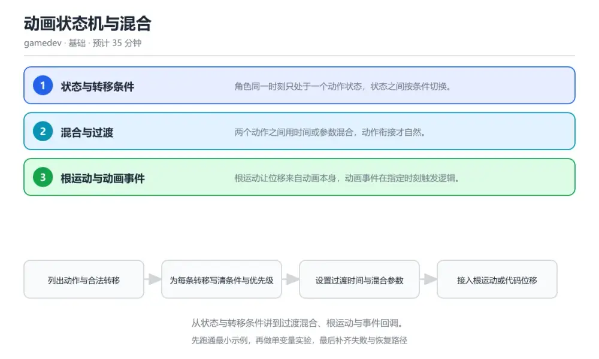

# 动画状态机与混合

> 内容更新时间：2026-10-06 · 学习阶段：基础 · 预计用时：40 分钟

分类：gamedev。关键词：动画状态机、转移条件、混合树、根运动、动画事件。从状态与转移条件讲到过渡混合、根运动与事件回调。



## 本节知识框架

**课程定位**：所属分类 `gamedev`（图形与游戏开发），课程主题 `动画状态机与混合`，学习阶段 基础，建议用时 40 分钟。

本课主线：从状态与转移条件讲到过渡混合、根运动与事件回调。

**学完本课应当能够**
- 说清 `状态机` 与 `过渡` 的含义与区别，并各举一个正例和一个反例。
- 用本课示例验证 `混合空间` 的行为，记录输入、输出与失败条件。
- 遇到「角色在走路与待机之间抖动」这类问题时，能说出触发条件与修复顺序。

### 从概念到验证的学习链条

1. `状态机`：先掌握 用状态与转移描述角色行为的模型，再用它解释 `过渡` 为什么会出现。
2. `过渡`：先掌握 两个动画之间按权重与时间进行的混合过程，再用它解释 `混合空间` 为什么会出现。
3. `混合空间`：先掌握 按参数在多个动画之间连续加权的结构，再用它解释 `根运动` 为什么会出现。
4. `根运动`：先掌握 由动画根骨骼驱动角色位移的方式，再用它解释 `动画事件` 为什么会出现。
5. `动画事件`：先掌握 在动画特定时刻触发的回调，再用它解释 `转移条件` 为什么会出现。
6. `转移条件`：先掌握 转移条件写得过于宽松会出现状态抖动，走路与待机在一帧内反复切换，再用它解释 本课示例的观察结果 为什么会出现。

**先修与衔接**：本课是「图形与游戏开发」分类的第 2 课。当前没有登记显式先修或后续课程；课程主线是从状态与转移条件讲到过渡混合、根运动与事件回调。学完后按 `gamedev` 分类顺序继续。

### 完成判据

- **定义关**：不看正文也能说明 `状态机` 是 用状态与转移描述角色行为的模型，并指出一个反例。
- **机制关**：能按“输入 → 转换 → 输出 → 验证”复述 `动画状态机与混合`，而不是只背结论。
- **示例关**：能运行或推演 `动画状态机与混合` 的 `text` 示例，并说明一个真实出现的标识符或字面量。
- **证据关**：能从 `动画状态机与混合` 的示例写出一个输入、处理、输出三元组，并说明它支持或反驳了本课的哪一条结论。
- **排错关**：能复现 角色在走路与待机之间抖动，记录现象并按 给转移设置滞回区间或最小停留时间，避免在边界反复切换 修复。
- **迁移关**：能把 `动画状态机`、`转移条件`、`混合树`、`根运动` 放进一个与 `动画状态机与混合` 不同的项目场景，并保持输入与验证条件可追踪。
- **复盘关**：学完 `动画状态机与混合` 后，用一句话写下仍然不确定的结论，并列出下一次验证需要的输入、环境和成功判据。

### 复习清单

- [ ] 能不看正文复述本课核心术语，并指出一个边界或反例。
- [ ] 能运行或推演本课示例，记录输入、输出与失败现象。
- [ ] 能完成一次自测，并把错题对照错误表定位原因。

**本课配图**


## 核心概念定义

| 术语 | 操作性定义 | 常见边界与风险 |
| --- | --- | --- |
| 状态机 | 用状态与转移描述角色行为的模型。 | 缓存与状态残留会让结果过期，先明确失效策略再判断正确性。 |
| 过渡 | 两个动画之间按权重与时间进行的混合过程。 | 易错：根运动与代码位移同时作用于角色；正确做法是位移来源二选一，或在过渡期按权重协调，避免重复叠加。 |
| 混合空间 | 按参数在多个动画之间连续加权的结构。 | 结果依赖数据分布、模型版本与算力预算，换数据集或换硬件都要重新评估。 |
| 根运动 | 由动画根骨骼驱动角色位移的方式。 | 易错：根运动与代码位移同时作用于角色；正确做法是位移来源二选一，或在过渡期按权重协调，避免重复叠加。 |
| 动画事件 | 在动画特定时刻触发的回调。 | 只在「在动画特定时刻触发的回调」这一前提下成立，换输入或换环境要重新验证。 |
| 转移条件 | 转移条件写得过于宽松会出现状态抖动，走路与待机在一帧内反复切换 | 缓存与状态残留会让结果过期，先明确失效策略再判断正确性。 |

## 原理与运行机制

### 机制总览

**教材衔接：核心知识**

### 1. 状态与转移条件

角色同一时刻只处于一个动作状态，状态之间按条件切换。

每个状态维护进入、更新与退出逻辑，转移由参数条件触发，触发后按过渡时间混合到目标状态。

在动画状态机与混合里可以这样验证：在本课示例里让角色在待机、跑步与跳跃之间切换，观察条件不满足时状态保持不变。

边界：转移条件写得过于宽松会出现状态抖动，走路与待机在一帧内反复切换。

工程视角：给关键转移加最小停留时间或阈值区间，并用调试面板把当前状态显示在屏幕上。

### 2. 混合与过渡

两个动作之间用时间或参数混合，动作衔接才自然。

过渡按权重在起始与目标姿态之间插值，混合空间按速度等参数在多个动作间连续加权。

在动画状态机与混合里可以这样验证：在本课示例里把跑步过渡时间从零调到零点三秒，对比起停的观感差异。

边界：过渡时间过长会让动作发飘，过短则出现明显跳变，取值要与动作节奏匹配。

工程视角：把过渡时长与混合参数做成可配置资源，方便美术与策划在不改代码的前提下调整。

### 3. 根运动与动画事件

根运动让位移来自动画本身，动画事件在指定时刻触发逻辑。

动画播放时把根骨骼位移应用到角色变换上，动画事件在关键帧回调中触发脚步声、攻击判定或特效。

在动画状态机与混合里可以这样验证：在本课示例里用根运动驱动一次位移，再在落脚帧触发音效，观察两者同步效果。

边界：根运动与代码位移同时生效会让角色速度翻倍或抖动，必须二选一或做权重协调。

工程视角：事件回调只做轻量动作，重逻辑交给状态机处理，避免在动画线程里执行耗时操作。

**教材衔接：关键流程**

```text
列出动作与合法转移 → 为每条转移写清条件与优先级 → 设置过渡时间与混合参数 → 接入根运动或代码位移 → 在关键帧挂事件并验证时机
```

1. 列出动作与合法转移
2. 为每条转移写清条件与优先级
3. 设置过渡时间与混合参数
4. 接入根运动或代码位移
5. 在关键帧挂事件并验证时机

### 机制拆解：每一步的输入、动作与输出

#### 1. `状态机`
- 输入：`动画状态机`；本步把 用状态与转移描述角色行为的模型 当作判断规则。
- 动作：围绕 `状态机` 保留中间状态，并记录它与 `过渡` 的对应关系。
- 输出：`过渡`，它可以被下一段代码、测试或记录继续使用。
- `状态机` 的失败条件：缓存与状态残留会让结果过期，先明确失效策略再判断正确性。

#### 2. `过渡`
- 输入：`状态机`；本步把 两个动画之间按权重与时间进行的混合过程 当作判断规则。
- 动作：围绕 `过渡` 保留中间状态，并记录它与 `混合空间` 的对应关系。
- 输出：`混合空间`，它可以被下一段代码、测试或记录继续使用。
- `过渡` 的失败条件：当角色位移速度异常时，会出现根运动与代码位移同时作用于角色。

#### 3. `混合空间`
- 输入：`过渡`；本步把 按参数在多个动画之间连续加权的结构 当作判断规则。
- 动作：围绕 `混合空间` 保留中间状态，并记录它与 `根运动` 的对应关系。
- 输出：`根运动`，它可以被下一段代码、测试或记录继续使用。
- `混合空间` 的失败条件：结果依赖数据分布、模型版本与算力预算，换数据集或换硬件都要重新评估。

#### 4. `根运动`
- 输入：`混合空间`；本步把 由动画根骨骼驱动角色位移的方式 当作判断规则。
- 动作：围绕 `根运动` 保留中间状态，并记录它与 `动画事件` 的对应关系。
- 输出：`动画事件`，它可以被下一段代码、测试或记录继续使用。
- `根运动` 的失败条件：当角色位移速度异常时，会出现根运动与代码位移同时作用于角色。

#### 5. `动画事件`
- 输入：`根运动`；本步把 在动画特定时刻触发的回调 当作判断规则。
- 动作：围绕 `动画事件` 保留中间状态，并记录它与 `转移条件` 的对应关系。
- 输出：`转移条件`，它可以被下一段代码、测试或记录继续使用。
- `动画事件` 的失败条件：只在「在动画特定时刻触发的回调」这一前提下成立，换输入或换环境要重新验证。

#### 6. `转移条件`
- 输入：`动画事件`；本步把 转移条件写得过于宽松会出现状态抖动，走路与待机在一帧内反复切换 当作判断规则。
- 动作：围绕 `转移条件` 保留中间状态，并记录它与 `本课示例的最终结果` 的对应关系。
- 输出：`本课示例的最终结果`，它可以被下一段代码、测试或记录继续使用。
- `转移条件` 的失败条件：缓存与状态残留会让结果过期，先明确失效策略再判断正确性。

### 复现实验记录

- 环境：`动画状态机与混合` 使用 `text` 示例，固定 `动画状态机`、`转移条件`、`混合树`、`根运动` 作为第一组条件。
- 首轮输入：从示例中的第一个输入开始，预测 `状态机` 会怎样变化。
- 基线观察：记录命令、输入、输出和错误原文，不用截图代替可复制的文本。
- 单变量修改：只改变 `动画状态机`，观察 `转移条件` 是否仍满足定义。
- 失败注入：复现 角色在走路与待机之间抖动，确认现象是 两个状态的切换阈值写在同一个数值上。
- 记录结论：把“修改前、修改后、预期变化、实际变化”写成四列表，这样复盘 `动画状态机与混合` 时才能区分概念错误与实现错误。

## 典型应用场景

**教材衔接：深度拓展与实战**

### 机制拆解 1：状态与转移条件

每个状态维护进入、更新与退出逻辑，转移由参数条件触发，触发后按过渡时间混合到目标状态。

落地时先确认前提：转移条件写得过于宽松会出现状态抖动，走路与待机在一帧内反复切换。再把结论写进检查表，让下一位同学可以按同样的输入复现。

工程做法：给关键转移加最小停留时间或阈值区间，并用调试面板把当前状态显示在屏幕上。

### 机制拆解 2：混合与过渡

过渡按权重在起始与目标姿态之间插值，混合空间按速度等参数在多个动作间连续加权。

落地时先确认前提：过渡时间过长会让动作发飘，过短则出现明显跳变，取值要与动作节奏匹配。再把结论写进检查表，让下一位同学可以按同样的输入复现。

工程做法：把过渡时长与混合参数做成可配置资源，方便美术与策划在不改代码的前提下调整。

### 机制拆解 3：根运动与动画事件

动画播放时把根骨骼位移应用到角色变换上，动画事件在关键帧回调中触发脚步声、攻击判定或特效。

落地时先确认前提：根运动与代码位移同时生效会让角色速度翻倍或抖动，必须二选一或做权重协调。再把结论写进检查表，让下一位同学可以按同样的输入复现。

工程做法：事件回调只做轻量动作，重逻辑交给状态机处理，避免在动画线程里执行耗时操作。

### 机制对照表

| 概念 | 解决什么问题 | 关键前提 | 失败信号 |
| --- | --- | --- | --- |
| 状态与转移条件 | 角色同一时刻只处于一个动作状态，状态之间按条件切换。 | 转移条件写得过于宽松会出现状态抖动，走路与待机在一帧内反复切换。 | 给关键转移加最小停留时间或阈值区间，并用调试面板把当前状态显示在屏幕上。 |
| 混合与过渡 | 两个动作之间用时间或参数混合，动作衔接才自然。 | 过渡时间过长会让动作发飘，过短则出现明显跳变，取值要与动作节奏匹配。 | 把过渡时长与混合参数做成可配置资源，方便美术与策划在不改代码的前提下调整 |
| 根运动与动画事件 | 根运动让位移来自动画本身，动画事件在指定时刻触发逻辑。 | 根运动与代码位移同时生效会让角色速度翻倍或抖动，必须二选一或做权重协调。 | 事件回调只做轻量动作，重逻辑交给状态机处理，避免在动画线程里执行耗时操作 |

### 自测问答

**问 1**：角色在跑步与待机之间高频抖动，最可能的原因是？

**答**：两个状态的切换阈值相同且没有滞回。当速度在阈值附近波动时，两个方向的条件同时成立就会来回切换，加入滞回区间或最短停留时间即可稳定。 正确选项「两个状态的切换阈值相同且没有滞回」对应《动画状态机与混合》的要点「状态与转移条件」：角色同一时刻只处于一个动作状态，状态之间按条件切换。判断「状态与转移条件」时先确认前提是否成立，再回到《动画状态机与混合》的示例核对一次；把别的语言或框架的默认做法直接搬到状态与转移条件上，往往会在本课的边界条件里失效。

**问 2**：根运动与代码位移同时启用会导致？

**答**：位移被重复叠加，出现速度异常与抖动。两者都在修改角色位置，叠加后位移量约为预期两倍，或者相互抵消产生抖动，应只保留一种来源。 正确选项「位移被重复叠加，出现速度异常与抖动」对应《动画状态机与混合》的要点「混合与过渡」：两个动作之间用时间或参数混合，动作衔接才自然。判断「混合与过渡」时先确认前提是否成立，再回到《动画状态机与混合》的示例核对一次；借鉴相邻主题的经验之前，先核对混合与过渡的前提是否成立。

**问 3**：以下哪些做法能改善动作衔接观感？（多选）

**答**：按动作类型设置不同过渡时长；在速度参数上使用混合空间；为关键转移加最小停留时间。过渡时长差异化、参数化混合与转移稳定性都在改善衔接；过渡设为零会直接跳变。 正确选项「按动作类型设置不同过渡时长；在速度参数上使用混合空间；为关键转移加最小停留时间」对应《动画状态机与混合》的要点「根运动与动画事件」：根运动让位移来自动画本身，动画事件在指定时刻触发逻辑。判断「根运动与动画事件」时先确认前提是否成立，再回到《动画状态机与混合》的示例核对一次；记住根运动与动画事件的结论之外还要记住适用条件，换一个输入往往就不成立了。

**问 4**：请按一次动作切换的顺序排列。

**答**：输入与物理状态更新。先更新输入与物理，再评估条件并过渡，进入目标状态后播放动画，最后在关键帧触发事件完成逻辑联动。 正确选项「输入与物理状态更新；评估转移条件；按权重开始过渡；进入目标状态播放动画；在关键帧触发事件回调」对应《动画状态机与混合》的要点「状态与转移条件」：角色同一时刻只处于一个动作状态，状态之间按条件切换。判断「状态与转移条件」时先确认前提是否成立，再回到《动画状态机与混合》的示例核对一次；干扰项常常是相邻主题里成立的结论，只有按状态与转移条件的输入与约束判断才能排除。

**问 5**：阅读这段转移判定，会造成什么问题？

**答**：没有滞回，速度在阈值附近时状态会来回抖动。两条判定共用同一个阈值，速度微小波动就会在两个状态之间反复切换，应设置不同阈值形成滞回区间。 正确选项「没有滞回，速度在阈值附近时状态会来回抖动」对应《动画状态机与混合》的要点「混合与过渡」：两个动作之间用时间或参数混合，动作衔接才自然。判断「混合与过渡」时先确认前提是否成立，再回到《动画状态机与混合》的示例核对一次；把混合与过渡的做法换到别的约束下未必成立，先确认边界再决定答案。


### 工程检查表

- [ ] 列出动作与合法转移
- [ ] 为每条转移写清条件与优先级
- [ ] 设置过渡时间与混合参数
- [ ] 接入根运动或代码位移
- [ ] 在关键帧挂事件并验证时机
- [ ] 【状态与转移条件】给关键转移加最小停留时间或阈值区间，并用调试面板把当前状态显示在屏幕上。
- [ ] 【混合与过渡】把过渡时长与混合参数做成可配置资源，方便美术与策划在不改代码的前提下调整。
- [ ] 【根运动与动画事件】事件回调只做轻量动作，重逻辑交给状态机处理，避免在动画线程里执行耗时操作。


### 结论与下一步

- **角色在走路与待机之间抖动**：典型现象是两个状态的切换阈值写在同一个数值上；正确做法是给转移设置滞回区间或最小停留时间，避免在边界反复切换。
- **角色位移速度异常**：典型现象是根运动与代码位移同时作用于角色；正确做法是位移来源二选一，或在过渡期按权重协调，避免重复叠加。
- **攻击判定时机不对**：典型现象是依赖计时器估算动作关键帧；正确做法是在动画关键帧挂事件回调，由动画时钟驱动判定与特效。

### 最小验证场景

- 准备：保留 `text` 示例的原始输入，先记录 `动画状态机与混合` 的基线输出和完整运行命令。
- 判定：新结果与 `动画状态机与混合` 的基线不同不等于错误；只有当差异破坏了 `状态机` 的定义或错误表中的约束，才判定为失败。

### 选择与边界

- 使用 `状态机` 时，先满足它的定义：用状态与转移描述角色行为的模型；缓存与状态残留会让结果过期，先明确失效策略再判断正确性。
- 使用 `过渡` 时，先满足它的定义：两个动画之间按权重与时间进行的混合过程；易错：根运动与代码位移同时作用于角色；正确做法是位移来源二选一，或在过渡期按权重协调，避免重复叠加。
- 使用 `混合空间` 时，先满足它的定义：按参数在多个动画之间连续加权的结构；结果依赖数据分布、模型版本与算力预算，换数据集或换硬件都要重新评估。
- 使用 `根运动` 时，先满足它的定义：由动画根骨骼驱动角色位移的方式；易错：根运动与代码位移同时作用于角色；正确做法是位移来源二选一，或在过渡期按权重协调，避免重复叠加。
- 使用 `动画事件` 时，先满足它的定义：在动画特定时刻触发的回调；只在「在动画特定时刻触发的回调」这一前提下成立，换输入或换环境要重新验证。

## 代码/协议/SQL 示例

### 最小可验证示例

```text
列出动作与合法转移 → 为每条转移写清条件与优先级 → 设置过渡时间与混合参数 → 接入根运动或代码位移 → 在关键帧挂事件并验证时机
```

**教材衔接：原文最小示例**

```text
列出动作与合法转移 → 为每条转移写清条件与优先级 → 设置过渡时间与混合参数 → 接入根运动或代码位移 → 在关键帧挂事件并验证时机
```

```csharp
// 简化状态机：条件集中判定，转移只做一件事
enum State { Idle, Run, Jump, Land }

State Evaluate(State current, InputState input, float speed, bool grounded) {
    switch (current) {
        case State.Idle:
            // 速度超过阈值才进入跑步，避免边界抖动
            if (speed > 0.1f) return State.Run;
            if (!grounded && input.JumpPressed) return State.Jump;
            return State.Idle;
        case State.Run:
            if (speed <= 0.05f) return State.Idle;
            return State.Run;
        case State.Jump:
            // 只有落地且垂直速度已归零才切回，防止连跳时状态反复
            if (grounded && speed < 0.1f) return State.Land;
            return State.Jump;
        case State.Land:
            return speed > 0.1f ? State.Run : State.Idle;
        default:
            return State.Idle;
    }
}

// 过渡时间按动作类型区分，跳跃用更短的过渡保持响应
float TransitionTime(State from, State to) =>
    (to == State.Jump || from == State.Jump) ? 0.08f : 0.2f;
```

### 示例精读：先找证据，再改一个条件

- 在 `动画状态机与混合` 中与 `状态机` 对照：示例必须能支持 用状态与转移描述角色行为的模型，否则说明这一段还缺少实现或验证步骤。
- 在 `动画状态机与混合` 中与 `过渡` 对照：示例必须能支持 两个动画之间按权重与时间进行的混合过程，否则说明这一段还缺少实现或验证步骤。
- 在 `动画状态机与混合` 中与 `混合空间` 对照：示例必须能支持 按参数在多个动画之间连续加权的结构，否则说明这一段还缺少实现或验证步骤。
- 在 `动画状态机与混合` 中与 `根运动` 对照：示例必须能支持 由动画根骨骼驱动角色位移的方式，否则说明这一段还缺少实现或验证步骤。
- `动画状态机与混合` 的示例没有抽取到函数调用或字面量；按行记录输入、控制流和输出，避免只背代码外形。

## 时间/空间复杂度或性能分析

**性能关注点（动画状态机与混合）**：帧预算决定体验：记录帧率与帧时间分布、峰值内存与加载耗时，低端机型要单独跑一遍。

**测量方法**：以 `动画状态机与混合` 的 `动画状态机` 场景为对象，固定输入跑一遍记录基线，再把规模或并发度提高一个数量级复测；两次结果的差值与波动范围才是结论依据。

### 需要控制的变量与记录项

- `动画状态机与混合` 的 `动画状态机`：固定它的版本、输入范围和资源上限，分别记录速度、内存与失败率的变化。
- `动画状态机与混合` 的 `转移条件`：固定它的版本、输入范围和资源上限，分别记录速度、内存与失败率的变化。
- `动画状态机与混合` 的 `混合树`：固定它的版本、输入范围和资源上限，分别记录速度、内存与失败率的变化。
- `动画状态机与混合` 的 `根运动`：固定它的版本、输入范围和资源上限，分别记录速度、内存与失败率的变化。
- `动画状态机与混合` 的 `动画事件`：固定它的版本、输入范围和资源上限，分别记录速度、内存与失败率的变化。
- `动画状态机与混合` 中 `状态机` 的边界：缓存与状态残留会让结果过期，先明确失效策略再判断正确性。达到边界时不要外推，必须重新测量。
- `动画状态机与混合` 中 `过渡` 的边界：易错：根运动与代码位移同时作用于角色；正确做法是位移来源二选一，或在过渡期按权重协调，避免重复叠加。达到边界时不要外推，必须重新测量。
- `动画状态机与混合` 中 `混合空间` 的边界：结果依赖数据分布、模型版本与算力预算，换数据集或换硬件都要重新评估。达到边界时不要外推，必须重新测量。
- `动画状态机与混合` 中 `根运动` 的边界：易错：根运动与代码位移同时作用于角色；正确做法是位移来源二选一，或在过渡期按权重协调，避免重复叠加。达到边界时不要外推，必须重新测量。
- `动画状态机与混合` 中 `动画事件` 的边界：只在「在动画特定时刻触发的回调」这一前提下成立，换输入或换环境要重新验证。达到边界时不要外推，必须重新测量。

## 常见误区与易错点

| 容易写错的做法 | 实际现象 | 原因与正确做法 |
| --- | --- | --- |
| 角色在走路与待机之间抖动 | 两个状态的切换阈值写在同一个数值上。 | 给转移设置滞回区间或最小停留时间，避免在边界反复切换。 |
| 角色位移速度异常 | 根运动与代码位移同时作用于角色。 | 位移来源二选一，或在过渡期按权重协调，避免重复叠加。 |
| 攻击判定时机不对 | 依赖计时器估算动作关键帧。 | 在动画关键帧挂事件回调，由动画时钟驱动判定与特效。 |

### 现场 1：角色在走路与待机之间抖动

**症状**：两个状态的切换阈值写在同一个数值上。

**根因与修复**：给转移设置滞回区间或最小停留时间，避免在边界反复切换。

**自检**：在本课示例里复现「角色在走路与待机之间抖动」，改成给转移设置滞回区间或最小停留时间，避免在边界反复切换后重跑；如果症状消失且失败路径按预期变化，说明定位正确。

### 现场 2：角色位移速度异常

**症状**：根运动与代码位移同时作用于角色。

**根因与修复**：位移来源二选一，或在过渡期按权重协调，避免重复叠加。

**自检**：在本课示例里复现「角色位移速度异常」，改成位移来源二选一，或在过渡期按权重协调，避免重复叠加后重跑；如果症状消失且失败路径按预期变化，说明定位正确。

### 现场 3：攻击判定时机不对

**症状**：依赖计时器估算动作关键帧。

**根因与修复**：在动画关键帧挂事件回调，由动画时钟驱动判定与特效。

**自检**：在本课示例里复现「攻击判定时机不对」，改成在动画关键帧挂事件回调，由动画时钟驱动判定与特效后重跑；如果症状消失且失败路径按预期变化，说明定位正确。

## 与其他知识点的关系

**教材衔接：复习与迁移**


### 迁移练习

- **术语归属**：`状态机`、`过渡`、`混合空间` 的定义以本课「核心概念定义」为准，换到其他课程时先确认定义是否被改写。

### 容易混淆的相邻概念

- `状态机` 与 `过渡`：前者强调 用状态与转移描述角色行为的模型；后者强调 两个动画之间按权重与时间进行的混合过程。判断时分别检查两条定义的适用范围，不要只看名称相似就互换。
- `过渡` 与 `混合空间`：前者强调 两个动画之间按权重与时间进行的混合过程；后者强调 按参数在多个动画之间连续加权的结构。判断时分别检查两条定义的适用范围，不要只看名称相似就互换。
- `混合空间` 与 `根运动`：前者强调 按参数在多个动画之间连续加权的结构；后者强调 由动画根骨骼驱动角色位移的方式。判断时分别检查两条定义的适用范围，不要只看名称相似就互换。
- `根运动` 与 `动画事件`：前者强调 由动画根骨骼驱动角色位移的方式；后者强调 在动画特定时刻触发的回调。判断时分别检查两条定义的适用范围，不要只看名称相似就互换。
- `动画事件` 与 `转移条件`：前者强调 在动画特定时刻触发的回调；后者强调 转移条件写得过于宽松会出现状态抖动，走路与待机在一帧内反复切换。判断时分别检查两条定义的适用范围，不要只看名称相似就互换。

## 自测题与参考答案

> 先独立作答，再对照参考答案；答案都能在本课正文、术语表或错误表里找到依据。

### 自测 1（概念复述）

不看正文，写出 `状态机` 的操作性定义，并说明它与 `过渡` 的区别。

**参考答案**：用状态与转移描述角色行为的模型。

`过渡` 的定位是：两个动画之间按权重与时间进行的混合过程；两者的差别要从适用对象与失败模式上说明。

### 自测 2（排错）

本课错误表记录了「角色在走路与待机之间抖动」这类做法。请写出它会出现的现象、根因，以及修复顺序。

**参考答案**：现象是两个状态的切换阈值写在同一个数值上；正确做法是给转移设置滞回区间或最小停留时间，避免在边界反复切换。修复时先复现现象并保留证据，再改动一处假设重跑，确认现象消失。

### 自测 3（动手验证）

运行本课的 `text` 示例，改动其中一个输入后重新运行，记录输出与错误信息。

**参考答案**：正常输入下 `text` 示例应当复现正文给出的结果；改动输入后，如果结果改变或报错，先核对它是否满足 `动画状态机与混合` 中`状态机` 的适用范围，再检查错误表里是否有同类现象。

### 自测 4（代码阅读）

阅读本课开头的 `text` 示例，说明它体现了`状态机` 的哪一条性质，并指出改动哪个输入会让这条性质不再成立。

**参考答案**：`状态机` 的定义是 用状态与转移描述角色行为的模型，示例正是在实现这条定义。改动与 `状态机` 有关的一个输入后，如果结果不再符合 `动画状态机与混合` 的正文描述，就说明该性质只在当前前提成立。

### 自测 5（迁移）

把 `动画状态机与混合` 的方法迁移到自己的项目：围绕 `状态机` 写出一个与错误表同类的风险点，并说明触发条件和检验方式。

**参考答案**：例如「攻击判定时机不对」，它会导致依赖计时器估算动作关键帧；检验方式是按在动画关键帧挂事件回调，由动画时钟驱动判定与特效改一处再复现，确认现象消失且没有引入新的失败分支。

### 自测 6（对比）

用一个表格对比 `状态机` 与 `过渡`：各写一行适用场景、一行失败表现。

**参考答案**：`状态机` 的定义是用状态与转移描述角色行为的模型；`过渡` 的定义是两个动画之间按权重与时间进行的混合过程。两者的失败表现分别对应本课错误表里与本术语相关的行。

### 自测 7（排错顺序）

面对「角色在走路与待机之间抖动」引发的问题，请把“复现 两个状态的切换阈值写在同一个数值上 → 保留证据 → 给转移设置滞回区间或最小停留时间，避免在边界反复切换 → 回归验证”四步写成可执行的检查清单。

**参考答案**：第一步按两个状态的切换阈值写在同一个数值上复现；第二步记录输入、版本与完整报错；第三步按给转移设置滞回区间或最小停留时间，避免在边界反复切换只改一处；第四步重跑并确认失败路径也按预期变化。

### 自测 8（边界判断）

针对 `转移条件`，分别写出“可以使用”的条件和“结论不再成立”的条件。

**参考答案**：缓存与状态残留会让结果过期，先明确失效策略再判断正确性。 同时要把 `转移条件` 的定义 转移条件写得过于宽松会出现状态抖动，走路与待机在一帧内反复切换 与实际输入逐项对照。

### 自测 9（机制重建）

不看正文，按输入、转换、输出、验证四段重建 `状态机` → `过渡` → `混合空间` → `根运动` 的作用链。

**参考答案**：起点是 `状态机` 的定义 用状态与转移描述角色行为的模型；中间每一步都保留可观察状态；终点由 `转移条件` 检查，失败时回到错误表定位第一个偏离定义的步骤。

### 自测 10（综合排错）

在 `动画状态机与混合` 中，现象是 依赖计时器估算动作关键帧。请围绕 攻击判定时机不对 写出最小复现、关键证据、修复动作和回归验证，并说明为什么不能只凭一次运行下结论。

**参考答案**：先复现 攻击判定时机不对，记录输入与完整错误；再按 在动画关键帧挂事件回调，由动画时钟驱动判定与特效 只改一处。回归时同时跑正常路径和边界路径，只有两次结果都可解释，才把修复视为完成。

### 自测 11（一分钟复述）

用每分钟约 200 字的速度复述 `动画状态机与混合`：先给主问题，再按顺序说出 `状态机`、`过渡`、`混合空间`、`根运动`，最后给一个失败案例。

**自评标准**：主问题必须对应 从状态与转移条件讲到过渡混合、根运动与事件回调；每个术语都要能接上一句定义或边界；失败案例必须写成可观察现象，不能用“可能有风险”代替证据。

## 术语速查

| 术语 | 一句话说明 |
| --- | --- |
| `状态机` | 用状态与转移描述角色行为的模型。 |
| `过渡` | 两个动画之间按权重与时间进行的混合过程。 |
| `混合空间` | 按参数在多个动画之间连续加权的结构。 |
| `根运动` | 由动画根骨骼驱动角色位移的方式。 |
| `动画事件` | 在动画特定时刻触发的回调。 |
| `转移条件` | 转移条件写得过于宽松会出现状态抖动，走路与待机在一帧内反复切换。 |

**术语关系**：`状态机`（用状态与转移描述角色行为的模型） → `过渡`（两个动画之间按权重与时间进行的混合过程） → `混合空间`（按参数在多个动画之间连续加权的结构） → `根运动`（由动画根骨骼驱动角色位移的方式）。

## 考点精讲

`动画状态机与混合` 的题库有 5 道题，下面逐题给出题干、正确项与判断依据：先自己作答，再核对正确项，最后回到正文对应小节复核。

### 考点 1：第 1 题

- **题目**：角色在跑步与待机之间高频抖动，最可能的原因是？
- **正确项**：两个状态的切换阈值相同且没有滞回
- **判断依据**：这道题检验本课主问题：从状态与转移条件讲到过渡混合、根运动与事件回调。复习时先复述本课主问题，再举一个会让结论失效的输入。

### 考点 2：第 2 题

- **题目**：根运动与代码位移同时启用会导致？
- **正确项**：位移被重复叠加，出现速度异常与抖动
- **判断依据**：这道题落在术语 `根运动` 上：由动画根骨骼驱动角色位移的方式。复习时把 `根运动` 的定义、适用边界和一个反例一起说清楚，再回到「核心概念定义」核对原文。

### 考点 3：第 3 题

- **题目**：以下哪些做法能改善动作衔接观感？（多选）
- **正确项**：按动作类型设置不同过渡时长；在速度参数上使用混合空间；为关键转移加最小停留时间
- **判断依据**：这道题落在术语 `过渡` 上：两个动画之间按权重与时间进行的混合过程。复习时把 `过渡` 的定义、适用边界和一个反例一起说清楚，再回到「核心概念定义」核对原文。

### 考点 4：第 4 题

- **题目**：请按一次动作切换的顺序排列。
- **正确项**：输入与物理状态更新 → 评估转移条件 → 按权重开始过渡 → 进入目标状态播放动画 → 在关键帧触发事件回调
- **判断依据**：这道题落在术语 `过渡` 上：两个动画之间按权重与时间进行的混合过程。复习时把 `过渡` 的定义、适用边界和一个反例一起说清楚，再回到「核心概念定义」核对原文。

### 考点 5：第 5 题

- **题目**：阅读这段转移判定，会造成什么问题？
- **正确项**：没有滞回，速度在阈值附近时状态会来回抖动
- **判断依据**：这道题检验本课主问题：从状态与转移条件讲到过渡混合、根运动与事件回调。复习时先复述本课主问题，再举一个会让结论失效的输入。

### 考点 6：`状态机`

- **要点**：用状态与转移描述角色行为的模型。
- **状态机 的边界**：缓存与状态残留会让结果过期，先明确失效策略再判断正确性。

### 考点 7：`过渡`

- **要点**：两个动画之间按权重与时间进行的混合过程。
- **过渡 的边界**：易错：根运动与代码位移同时作用于角色；正确做法是位移来源二选一，或在过渡期按权重协调，避免重复叠加。

### 考点 8：`混合空间`

- **要点**：按参数在多个动画之间连续加权的结构。
- **混合空间 的边界**：结果依赖数据分布、模型版本与算力预算，换数据集或换硬件都要重新评估。

### 考点 9：`根运动`

- **要点**：由动画根骨骼驱动角色位移的方式。
- **根运动 的边界**：易错：根运动与代码位移同时作用于角色；正确做法是位移来源二选一，或在过渡期按权重协调，避免重复叠加。

### 考点 10：`动画事件`

- **要点**：在动画特定时刻触发的回调。
- **动画事件 的边界**：只在「在动画特定时刻触发的回调」这一前提下成立，换输入或换环境要重新验证。

### 考点 11：`转移条件`

- **要点**：转移条件写得过于宽松会出现状态抖动，走路与待机在一帧内反复切换
- **转移条件 的边界**：缓存与状态残留会让结果过期，先明确失效策略再判断正确性。

### 考点 12：排错——角色在走路与待机之间抖动

- **现象**：两个状态的切换阈值写在同一个数值上。
- **处理**：给转移设置滞回区间或最小停留时间，避免在边界反复切换。

### 考点 13：排错——角色位移速度异常

- **现象**：根运动与代码位移同时作用于角色。
- **处理**：位移来源二选一，或在过渡期按权重协调，避免重复叠加。

### 考点 14：综合辨析——`状态机` 与 `转移条件`

- **辨析点**：`状态机` 的定义是 用状态与转移描述角色行为的模型；`转移条件` 的定义是 转移条件写得过于宽松会出现状态抖动，走路与待机在一帧内反复切换。
- **答题要求**：面对 `动画状态机与混合` 的题目，先判断描述的是 `状态机` 还是 `转移条件`，再归到对应定义，最后写出一个会让该定义失效的边界输入。

### 考点 15：排错评分点

- **现象分**：能写出 两个状态的切换阈值写在同一个数值上，而不是只写“程序有错”。
- **证据分**：保留触发 角色在走路与待机之间抖动 的输入、版本和错误原文。
- **修复分**：按 给转移设置滞回区间或最小停留时间，避免在边界反复切换 只改一处，并同时回归正常路径与边界路径。

## 内容元数据

- 内容版本：v2.0
- 最后更新：2026-10-06
- 学习阶段：基础

| 字段 | 值 |
| --- | --- |
| 课程 ID | `gamedev_animation_fsm` |
| 所属分类 | `gamedev` |
| 难度 | 基础 |
| 预计用时 | 35 分钟 |
| 关键词 | 动画状态机、转移条件、混合树、根运动、动画事件 |
| 配图 | `images/lesson_gamedev_animation_fsm.webp` |
| 参考资料 | 2 条 |
| 内容更新时间 | 2026-10-06 |

## 参考资料与复核

- 来源性质：官方文档、标准或权威教材；本课核对关键词：动画状态机、转移条件、混合树、根运动、动画事件。
- 最后复核：2026-10-04
- 下次复核：2027-04-24
- 复核范围：版本兼容、API 行为与工程实践

下面列出的资料用于核对本课结论，复习时可以对照阅读：
- [Unity 官方手册：动画状态机](https://docs.unity3d.com/Manual/AnimationStateMachines.html)
- [Godot 官方文档：动画树](https://docs.godotengine.org/en/stable/tutorials/animation/animation_tree.html)

| [本课术语索引：动画状态机与混合](#核心概念定义) | 按本课输入、术语边界和错误表现逐项核对 |
> 复核提示：《动画状态机与混合》的结论如与资料冲突，以资料中的规范文本为准，并在笔记里记录差异与日期。