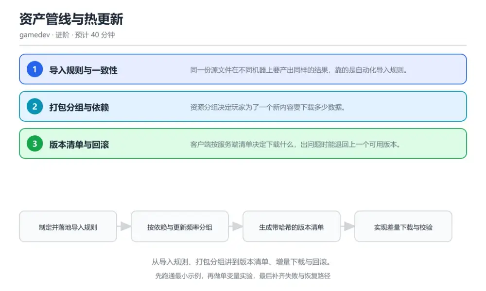
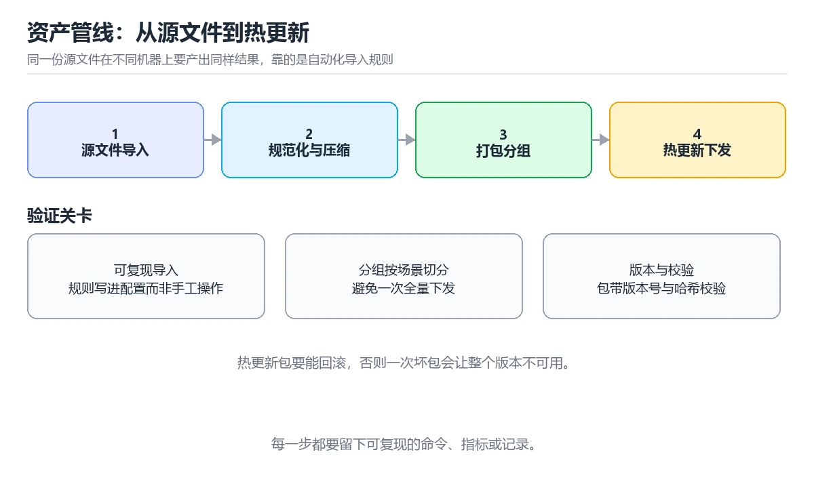

# 资产管线与热更新

> 内容更新时间：2026-10-06 · 学习阶段：进阶 · 预计用时：30 分钟

分类：gamedev。关键词：资产管线、打包分组、热更新、版本清单、增量下载。从导入规则、打包分组讲到版本清单、增量下载与回滚。

学习建议：先通读《资产管线与热更新》的核心知识与关键流程，再运行可运行练习并完成测验；遇到不确定的结论，回到「故障现场」按症状、根因、修复、验证四步核对。



## 学习目标

- 能制定统一的导入规则保证不同机器结果一致。
- 能按依赖与更新频率合理划分资源包。
- 能设计带校验与回滚的热更新流程。

## 前置知识

- 了解纹理、模型与音频的常见压缩格式。
- 知道哈希与版本号的基本作用。
- 用过一次构建打包流程。

## 核心知识

### 1. 导入规则与一致性

同一份源文件在不同机器上要产出同样的结果，靠的是自动化导入规则。

导入设置以配置文件形式随工程管理，按目录或命名约定自动套用压缩格式、分辨率与图集参数。

在资产管线与热更新里可以这样验证：在本课示例里用同一份纹理在两条机器上导入，对比输出的尺寸、格式与哈希是否一致。

边界：依赖个人手工设置会在换机或新增成员后失效，构建结果时好时坏且难以复现。

工程视角：规则文件纳入版本管理并让构建在干净环境执行，把输出哈希写进构建报告。

### 2. 打包分组与依赖

资源分组决定玩家为了一个新内容要下载多少数据。

按功能与更新频率划分资源包，被多个包共享的资源抽到公共包，避免重复打包与版本漂移。

在资产管线与热更新里可以这样验证：在本课示例里把共享贴图抽到公共包，对比更新一个关卡时的下载体积变化。

边界：分组过细会让资源在多个包中重复，下载总量与内存占用都被放大。

工程视角：把分组规则与体积目标写进构建脚本，超过阈值直接让流水线失败。

### 3. 版本清单与回滚

客户端按服务端清单决定下载什么，出问题时能退回上一个可用版本。

服务端发布带版本号与文件哈希的清单，客户端比对本地版本后按差量下载，校验通过后原子切换，异常时保留旧版本目录。

在资产管线与热更新里可以这样验证：在本课示例里发布一个有问题的包并执行回滚，观察客户端恢复到上一版本继续运行。

边界：没有哈希校验的下载会被中间环节损坏影响，玩家侧表现为资源错乱或崩溃。

工程视角：清单与资源同时提供多个版本，客户端保留上一份可用目录并记录切换原因。

## 关键流程

```text
制定并落地导入规则 → 按依赖与更新频率分组 → 生成带哈希的版本清单 → 实现差量下载与校验 → 验证回滚与断点续传
```

1. 制定并落地导入规则
2. 按依赖与更新频率分组
3. 生成带哈希的版本清单
4. 实现差量下载与校验
5. 验证回滚与断点续传

## 动手练习

1. 为项目写一份导入规则文件，在干净环境构建并核对输出哈希一致。
2. 对比拆分资源包前后的单关卡更新体积。
3. 模拟一次校验失败，验证客户端回滚并记录原因。

**验收标准**：留下 UpdateAssets 的输入、命令、输出和结论，让别人能按记录复现。

## 常见错误与排查

> 说明：本表由《资产管线与热更新》的核心知识整理（2026-10-06），人工复核进度见 docs/content_review_batches.md。

| 易错点 | 容易踩的做法 | 正确结论 |
| --- | --- | --- |
| 换一台机器打包结果就变 | 导入设置靠个人手工配置，没有随工程管理 | 把导入规则写成配置文件并纳入版本管理，在干净环境执行构建并记录输出哈希 |
| 更新一个小关卡下载量很大 | 资源分组过粗，所有内容打在一个包里 | 按功能与更新频率细分资源包，共享资源抽到公共包避免重复 |
| 更新失败后游戏打不开 | 资源直接覆盖旧目录且没有校验与回滚 | 先写临时目录，校验通过后原子切换，失败时保留上一份可用目录 |

## 可运行练习

### 任务 1：先跑通，再解释

```csharp
// 资源更新：比对清单、差量下载、校验后原子切换
async Task<bool> UpdateAssets(Manifest remote, Manifest local) {
    var plan = remote.Diff(local);                 // 只下载哈希不同的文件
    long total = plan.Sum(f => f.Size);
    Debug.Log($"need {plan.Count} files, {total / 1024 / 1024} MB");

    foreach (var file in plan) {
        var data = await Download(file.Url, resumeFrom: LocalSize(file));  // 支持断点续传
        if (Hash(data) != file.Hash) {
            Rollback("hash mismatch: " + file.Path);   // 校验失败立即回滚
            return false;
        }
        WriteToStaging(file.Path, data);              // 先写临时目录
    }

    CommitStaging();   // 全部校验通过后一次性切换，避免半更新状态
    return true;
}

```

先按清单差量计算出需要下载的文件，逐个下载并校验哈希，全部写入临时目录后一次性提交切换；任何一步失败都回滚到旧版本，玩家不会处在半新半旧的状态。

### 任务 2：只改一个条件

复制上面的示例，只改一个输入或参数再跑一次；先写下预测，再和真实输出对照，并说明差异来自资产管线与热更新的哪条机制。

### 任务 3：迁移到自己的数据

把《资产管线与热更新》里的示例换成你自己的一小段数据或场景，保持结构不变；如果换不动，说明还有哪条前提没有理解，回到核心知识对应小节。

## 故障现场

### 现场 1：换一台机器打包结果就变

**症状**：在《资产管线与热更新》的复现场景中，导入设置靠个人手工配置，没有随工程管理。

**根因**：当出现“换一台机器打包结果就变”时，执行路径已经绕过了《资产管线与热更新》的关键约束，最终以“导入设置靠个人手工配置，没有随工程管理”暴露出来；修复前必须先确认约束在哪里失效。

**修复**：针对《资产管线与热更新》的问题，把导入规则写成配置文件并纳入版本管理，在干净环境执行构建并记录输出哈希。

**验证**：先在《资产管线与热更新》中记录“换一台机器打包结果就变”留下的失败证据，再执行“把导入规则写成配置文件并纳入版本管理，在干净环境执行构建并记录输出哈希”并重放；确认错误路径变为明确结果，且修复没有掩盖同类故障。

### 现场 2：更新一个小关卡下载量很大

**症状**：在《资产管线与热更新》的复现场景中，资源分组过粗，所有内容打在一个包里。

**根因**：当出现“更新一个小关卡下载量很大”时，执行路径已经绕过了《资产管线与热更新》的关键约束，最终以“资源分组过粗，所有内容打在一个包里”暴露出来；修复前必须先确认约束在哪里失效。

**修复**：针对《资产管线与热更新》的问题，按功能与更新频率细分资源包，共享资源抽到公共包避免重复。

**验证**：先在《资产管线与热更新》中记录“更新一个小关卡下载量很大”留下的失败证据，再执行“按功能与更新频率细分资源包，共享资源抽到公共包避免重复”并重放；确认错误路径变为明确结果，且修复没有掩盖同类故障。

### 现场 3：更新失败后游戏打不开

**症状**：在《资产管线与热更新》的复现场景中，资源直接覆盖旧目录且没有校验与回滚。

**根因**：触发点是把“更新失败后游戏打不开”当成安全做法。它没有满足《资产管线与热更新》要求的前提，因此先表现为“资源直接覆盖旧目录且没有校验与回滚”；排查时先完整复现这一段，再核对输入、配置与依赖。

**修复**：针对《资产管线与热更新》的问题，先写临时目录，校验通过后原子切换，失败时保留上一份可用目录。

**验证**：保留《资产管线与热更新》里触发“资源直接覆盖旧目录且没有校验与回滚”的输入、版本和日志，按“先写临时目录，校验通过后原子切换，失败时保留上一份可用目录”完成修改后原样重放；只有失败现象消失且相邻场景仍可解释，才保留改动。

## 本课复习清单

离开本课前，逐项确认：

- [ ] 能说明导入规则为什么要随工程版本管理。
- [ ] 能按依赖与更新频率给出分组方案。
- [ ] 能描述热更新的四步：差量、校验、暂存、切换。
- [ ] 用 资产管线 构造一个正常输入和一个边界输入，分别记录输出与判断依据。
- [ ] 把本课最容易混淆的两个概念写成一句话对照。

| 复盘项 | 记录 |
| --- | --- |
| 已经能独立解释的考点 |  |
| 仍然说不清的概念 |  |
| 下一步验证动作 |  |

## 复习与自测

### 核心知识

遮住正文回答：资产管线与热更新解决什么问题、依赖哪些前提、失败时先看哪个信号？三问都能答清楚，再进入下一节。

### 动手练习

把《资产管线与热更新》里「只改一个条件」的练习再做一遍，这次先写预测再运行；预测和结果不一致的地方，就是需要回读的章节。

### 最小可运行示例

```csharp
// 资源更新：比对清单、差量下载、校验后原子切换
async Task<bool> UpdateAssets(Manifest remote, Manifest local) {
    var plan = remote.Diff(local);                 // 只下载哈希不同的文件
    long total = plan.Sum(f => f.Size);
    Debug.Log($"need {plan.Count} files, {total / 1024 / 1024} MB");

    foreach (var file in plan) {
        var data = await Download(file.Url, resumeFrom: LocalSize(file));  // 支持断点续传
        if (Hash(data) != file.Hash) {
            Rollback("hash mismatch: " + file.Path);   // 校验失败立即回滚
            return false;
        }
        WriteToStaging(file.Path, data);              // 先写临时目录
    }

    CommitStaging();   // 全部校验通过后一次性切换，避免半更新状态
    return true;
}

```

### 预期输出

```text
need 42 files, 18 MB，resume at 62%，hash ok 42/42，commit staging -> assets-1.7.3
```

### 验证步骤

1. 确认输入数据与运行环境和示例一致。
2. 运行示例，记录输出与耗时等可观测指标。
3. 换一个边界输入重跑，确认结论仍然成立。
4. 把两次结果写成一句话结论，注明前提与局限。

## 术语速查

先遮住右列，尝试用自己的话解释，再回到正文核对。

| 术语 | 一句话说明 |
| --- | --- |
| `导入规则` | 把源文件转换为运行时资产的自动化配置。 |
| `资源包` | 按依赖与更新频率打包的一组资产。 |
| `版本清单` | 记录文件路径、哈希与版本的索引文件。 |
| `差量下载` | 只下载与本地版本不同的文件。 |
| `原子切换` | 全部准备完成后一次性生效，避免中间状态。 |

## 考点精讲

### 考点 1：把共享资源抽到公共包的主要收益是？

题型：概念判断。题干：把共享资源抽到公共包的主要收益是？

判断要点：避免重复打包，减少下载与内存占用。共享资源若分散在多个功能包里会被重复打包，抽到公共包后只需下载与加载一份。 正确选项「避免重复打包，减少下载与内存占用」对应《资产管线与热更新》的要点「导入规则与一致性」：同一份源文件在不同机器上要产出同样的结果，靠的是自动化导入规则。判断「导入规则与一致性」时先确认前提是否成立，再回到《资产管线与热更新》的示例核对一次；把别的语言或框架的默认做法直接搬到导入规则与一致性上，往往会在本课的边界条件里失效。

### 考点 2：下载校验失败后正确的处理是？

题型：概念判断。题干：下载校验失败后正确的处理是？

判断要点：回滚到上一份可用资源并记录原因。校验失败说明资源不完整或已被破坏，回滚并记录原因才能保证玩家可继续运行且问题可追踪。 正确选项「回滚到上一份可用资源并记录原因」对应《资产管线与热更新》的要点「打包分组与依赖」：资源分组决定玩家为了一个新内容要下载多少数据。判断「打包分组与依赖」时先确认前提是否成立，再回到《资产管线与热更新》的示例核对一次；借鉴相邻主题的经验之前，先核对打包分组与依赖的前提是否成立。

### 考点 3：以下哪些内容应纳入构建流水线？（多选）

题型：多选辨析。题干：以下哪些内容应纳入构建流水线？（多选）

判断要点：导入规则的自动化执行；资源包体积阈值检查；版本清单与哈希生成。规则执行、体积阈值与清单生成是发布质量的保证；手工替换无法复现，也不会留下审计记录。 正确选项「导入规则的自动化执行；资源包体积阈值检查；版本清单与哈希生成」对应《资产管线与热更新》的要点「版本清单与回滚」：客户端按服务端清单决定下载什么，出问题时能退回上一个可用版本。判断「版本清单与回滚」时先确认前提是否成立，再回到《资产管线与热更新》的示例核对一次；记住版本清单与回滚的结论之外还要记住适用条件，换一个输入往往就不成立了。

### 考点 4：请按一次热更新的顺序排列。

题型：顺序排列。题干：请按一次热更新的顺序排列。

判断要点：客户端拉取远端清单。先取清单再算差量，下载校验后写临时目录，最后统一提交或回滚，保证任何时刻都有一个可运行版本。 正确选项「客户端拉取远端清单；比对本地版本生成差量计划；下载并逐个校验哈希；写入临时目录；提交切换或失败回滚」对应《资产管线与热更新》的要点「导入规则与一致性」：同一份源文件在不同机器上要产出同样的结果，靠的是自动化导入规则。判断「导入规则与一致性」时先确认前提是否成立，再回到《资产管线与热更新》的示例核对一次；干扰项常常是相邻主题里成立的结论，只有按导入规则与一致性的输入与约束判断才能排除。

### 考点 5：阅读这段更新代码，风险是什么？

题型：排错。题干：阅读这段更新代码，风险是什么？

判断要点：直接覆盖正式目录，中途失败会让资源处于半更新状态。边下边覆盖正式目录，一旦中途失败或断电，本地资源就是新旧混杂，缺少校验与回滚会导致游戏无法启动。 正确选项「直接覆盖正式目录，中途失败会让资源处于半更新状态」对应《资产管线与热更新》的要点「打包分组与依赖」：资源分组决定玩家为了一个新内容要下载多少数据。判断「打包分组与依赖」时先确认前提是否成立，再回到《资产管线与热更新》的示例核对一次；把打包分组与依赖的做法换到别的约束下未必成立，先确认边界再决定答案。

## English Overview

Asset Pipeline and Hot Updates

An asset pipeline turns source files into runtime assets with rules, not with personal settings. Bundles are grouped by feature and update frequency, with shared assets in a common bundle. The server publishes a manifest with versions and hashes; the client downloads only differences, verifies each file, writes to staging and switches atomically, keeping the previous version for rollback.



## 本课小结

- 资产管线与热更新围绕资产管线、打包分组、热更新展开，先建立基线再讨论优化。
- 同一份源文件在不同机器上要产出同样的结果，靠的是自动化导入规则。
- UpdateAssets 出错时先记录症状，再定位根因，最后用一次复跑确认修复。

## 内容元数据

- 内容版本：v2.0
- 最后更新：2026-10-06
- 学习阶段：进阶

| 字段 | 值 |
| --- | --- |
| 课程 ID | `gamedev_asset_pipeline` |
| 所属分类 | `gamedev` |
| 难度 | 进阶 |
| 预计用时 | 40 分钟 |
| 关键词 | 资产管线、打包分组、热更新、版本清单、增量下载 |
| 配图 | `images/lesson_gamedev_asset_pipeline.webp` |
| 参考资料 | 2 条 |
| 内容更新时间 | 2026-10-06 |

## 参考资料与复核

- 最后复核：2026-10-04
- 下次复核：2027-03-10
- 复核范围：版本兼容、API 行为与工程实践

下面列出的资料用于核对本课结论，复习时可以对照阅读：
- [Unity 官方手册：资源包与 Addressables](https://docs.unity3d.com/Manual/AssetBundlesIntro.html)
- [Android 官方文档：Play Asset Delivery](https://developer.android.com/guide/playcore/asset-delivery)

> 复核提示：《资产管线与热更新》的结论如与资料冲突，以资料中的规范文本为准，并在笔记里记录差异与日期。

## 复习与迁移

### 概念复述

不看正文，把资产管线与热更新讲给一个没学过的同事：先讲它解决什么问题，再讲一个最小例子，最后说明一个不适用场景。

### 测验回顾

回到《资产管线与热更新》测验，只重做答错或犹豫的题；对每道题写一句「我为什么改选这个答案」，写不出理由就回到对应小节。

### 迁移练习

把《资产管线与热更新》的方法用到一个你自己的真实场景：说明输入、约束与验证方式，并列出仍然不确定、需要下一次实验回答的问题。

## 深度拓展与实战

这一节把资产管线与热更新的机制拆开验证：每一步都给出输入、判断标准和失败信号，便于在真实项目里复用。

### 机制拆解 1：导入规则与一致性

导入设置以配置文件形式随工程管理，按目录或命名约定自动套用压缩格式、分辨率与图集参数。

落地时先确认前提：依赖个人手工设置会在换机或新增成员后失效，构建结果时好时坏且难以复现。；再把结论写进检查表，让下一位同学可以按同样的输入复现。

工程做法：规则文件纳入版本管理并让构建在干净环境执行，把输出哈希写进构建报告。

### 机制拆解 2：打包分组与依赖

按功能与更新频率划分资源包，被多个包共享的资源抽到公共包，避免重复打包与版本漂移。

落地时先确认前提：分组过细会让资源在多个包中重复，下载总量与内存占用都被放大。；再把结论写进检查表，让下一位同学可以按同样的输入复现。

工程做法：把分组规则与体积目标写进构建脚本，超过阈值直接让流水线失败。

### 机制拆解 3：版本清单与回滚

服务端发布带版本号与文件哈希的清单，客户端比对本地版本后按差量下载，校验通过后原子切换，异常时保留旧版本目录。

落地时先确认前提：没有哈希校验的下载会被中间环节损坏影响，玩家侧表现为资源错乱或崩溃。；再把结论写进检查表，让下一位同学可以按同样的输入复现。

工程做法：清单与资源同时提供多个版本，客户端保留上一份可用目录并记录切换原因。

### 机制对照表

| 概念 | 解决什么问题 | 关键前提 | 失败信号 |
| --- | --- | --- | --- |
| 导入规则与一致性 | 同一份源文件在不同机器上要产出同样的结果，靠的是自动化导入规则。 | 依赖个人手工设置会在换机或新增成员后失效，构建结果时好时坏且难以复现。 | 规则文件纳入版本管理并让构建在干净环境执行，把输出哈希写进构建报告。 |
| 打包分组与依赖 | 资源分组决定玩家为了一个新内容要下载多少数据。 | 分组过细会让资源在多个包中重复，下载总量与内存占用都被放大。 | 把分组规则与体积目标写进构建脚本，超过阈值直接让流水线失败。 |
| 版本清单与回滚 | 客户端按服务端清单决定下载什么，出问题时能退回上一个可用版本。 | 没有哈希校验的下载会被中间环节损坏影响，玩家侧表现为资源错乱或崩溃。 | 清单与资源同时提供多个版本，客户端保留上一份可用目录并记录切换原因。 |

### 自测问答

**问 1**：把共享资源抽到公共包的主要收益是？

**答**：避免重复打包，减少下载与内存占用。共享资源若分散在多个功能包里会被重复打包，抽到公共包后只需下载与加载一份。 正确选项「避免重复打包，减少下载与内存占用」对应《资产管线与热更新》的要点「导入规则与一致性」：同一份源文件在不同机器上要产出同样的结果，靠的是自动化导入规则。判断「导入规则与一致性」时先确认前提是否成立，再回到《资产管线与热更新》的示例核对一次；把别的语言或框架的默认做法直接搬到导入规则与一致性上，往往会在本课的边界条件里失效。

**问 2**：下载校验失败后正确的处理是？

**答**：回滚到上一份可用资源并记录原因。校验失败说明资源不完整或已被破坏，回滚并记录原因才能保证玩家可继续运行且问题可追踪。 正确选项「回滚到上一份可用资源并记录原因」对应《资产管线与热更新》的要点「打包分组与依赖」：资源分组决定玩家为了一个新内容要下载多少数据。判断「打包分组与依赖」时先确认前提是否成立，再回到《资产管线与热更新》的示例核对一次；借鉴相邻主题的经验之前，先核对打包分组与依赖的前提是否成立。

**问 3**：以下哪些内容应纳入构建流水线？（多选）

**答**：导入规则的自动化执行；资源包体积阈值检查；版本清单与哈希生成。规则执行、体积阈值与清单生成是发布质量的保证；手工替换无法复现，也不会留下审计记录。 正确选项「导入规则的自动化执行；资源包体积阈值检查；版本清单与哈希生成」对应《资产管线与热更新》的要点「版本清单与回滚」：客户端按服务端清单决定下载什么，出问题时能退回上一个可用版本。判断「版本清单与回滚」时先确认前提是否成立，再回到《资产管线与热更新》的示例核对一次；记住版本清单与回滚的结论之外还要记住适用条件，换一个输入往往就不成立了。

**问 4**：请按一次热更新的顺序排列。

**答**：客户端拉取远端清单。先取清单再算差量，下载校验后写临时目录，最后统一提交或回滚，保证任何时刻都有一个可运行版本。 正确选项「客户端拉取远端清单；比对本地版本生成差量计划；下载并逐个校验哈希；写入临时目录；提交切换或失败回滚」对应《资产管线与热更新》的要点「导入规则与一致性」：同一份源文件在不同机器上要产出同样的结果，靠的是自动化导入规则。判断「导入规则与一致性」时先确认前提是否成立，再回到《资产管线与热更新》的示例核对一次；干扰项常常是相邻主题里成立的结论，只有按导入规则与一致性的输入与约束判断才能排除。

**问 5**：阅读这段更新代码，风险是什么？

**答**：直接覆盖正式目录，中途失败会让资源处于半更新状态。边下边覆盖正式目录，一旦中途失败或断电，本地资源就是新旧混杂，缺少校验与回滚会导致游戏无法启动。 正确选项「直接覆盖正式目录，中途失败会让资源处于半更新状态」对应《资产管线与热更新》的要点「打包分组与依赖」：资源分组决定玩家为了一个新内容要下载多少数据。判断「打包分组与依赖」时先确认前提是否成立，再回到《资产管线与热更新》的示例核对一次；把打包分组与依赖的做法换到别的约束下未必成立，先确认边界再决定答案。

### 排错速查

- 看到「导入设置靠个人手工配置，没有随工程管理」时，先按「把导入规则写成配置文件并纳入版本管理，在干净环境执行构建并记录输出哈希」处理，再用资产管线与热更新的最小示例确认结论是否恢复。
- 看到「资源分组过粗，所有内容打在一个包里」时，先按「按功能与更新频率细分资源包，共享资源抽到公共包避免重复」处理，再用资产管线与热更新的最小示例确认结论是否恢复。
- 看到「资源直接覆盖旧目录且没有校验与回滚」时，先按「先写临时目录，校验通过后原子切换，失败时保留上一份可用目录」处理，再用资产管线与热更新的最小示例确认结论是否恢复。

### 工程检查表

- [ ] 制定并落地导入规则
- [ ] 按依赖与更新频率分组
- [ ] 生成带哈希的版本清单
- [ ] 实现差量下载与校验
- [ ] 验证回滚与断点续传
- [ ] 【导入规则与一致性】规则文件纳入版本管理并让构建在干净环境执行，把输出哈希写进构建报告。
- [ ] 【打包分组与依赖】把分组规则与体积目标写进构建脚本，超过阈值直接让流水线失败。
- [ ] 【版本清单与回滚】清单与资源同时提供多个版本，客户端保留上一份可用目录并记录切换原因。

### 迁移练习

把资产管线与热更新的方法用到一个真实场景：写下资产管线、打包分组、热更新在你的场景里分别对应什么，再记录一次失败尝试和它的恢复步骤。

### 延伸阅读与下一步

- 复习资产管线、打包分组、热更新、版本清单、增量下载时，优先回看「导入规则与一致性」与「版本清单与回滚」两节。
- 把从「制定并落地导入规则」到「验证回滚与断点续传」的流程画成一张图，放进自己的笔记。
- 一周后重做本课测验，只把答错的题留到下一轮复习。

### 结论与下一步

学完资产管线与热更新，应该能独立完成三件事：先用最小示例确认资产管线的行为，再用一个边界输入验证结论，最后把失败路径写成可重复的检查。下一步把本课术语加入复习清单，并在两周内用一次真实任务检验记忆是否牢固。
