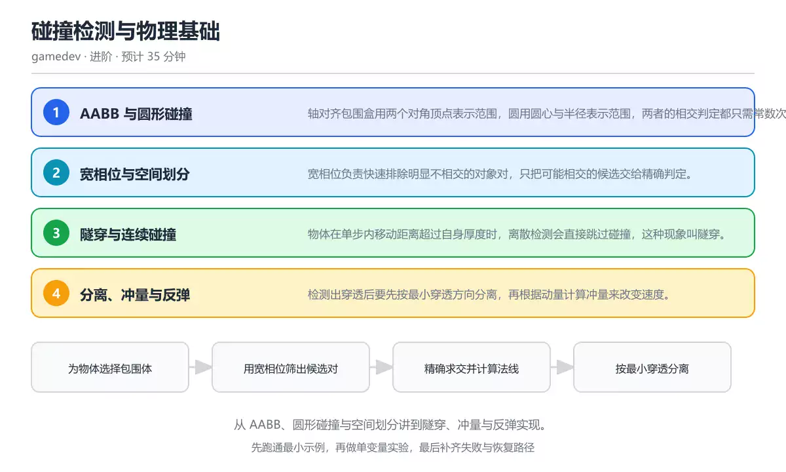
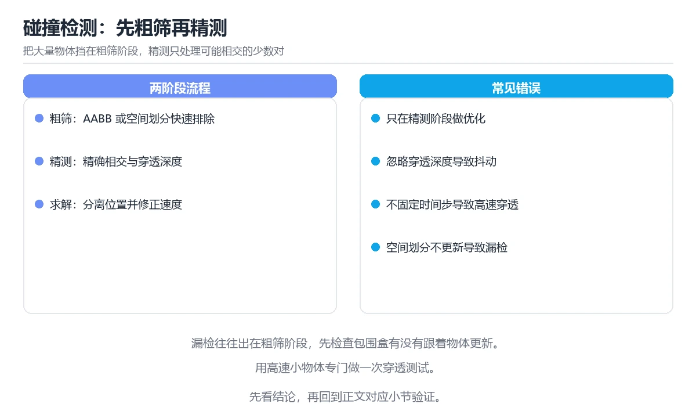

# 碰撞检测与物理基础

> 内容更新时间：2026-10-06 · 学习阶段：进阶 · 预计用时：40 分钟

分类：gamedev。关键词：AABB、圆形碰撞、空间划分、隧穿、冲量。从 AABB、圆形碰撞与空间划分讲到隧穿、冲量与反弹实现。

学习建议：先通读《碰撞检测与物理基础》的核心知识与关键流程，再运行可运行练习并完成测验；遇到不确定的结论，回到「故障现场」按症状、根因、修复、验证四步核对。



## 本节知识框架

**课程定位**：所属分类为「图形与游戏开发」，课程主题为「碰撞检测与物理基础」，学习阶段为「进阶」，建议用时 40 分钟。

**本课要解决的主问题**：从 AABB、圆形碰撞与空间划分讲到隧穿、冲量与反弹实现。

| 学习层次 | 要回答的问题 | 完成判据 |
| --- | --- | --- |
| 概念层 | 「碰撞检测与物理基础」有哪些必须区分的对象与术语？ | 能用自己的话定义核心术语，并各举一个正例和一个反例。 |
| 机制层 | 这些对象按什么顺序发生作用，输入如何变成输出？ | 能画出或写出机制步骤，并说明每一步的失败条件。 |
| 应用层 | 什么场景适合使用「碰撞检测与物理基础」，什么场景不适合？ | 能给出一个真实场景、一个最小示例和一个边界案例。 |
| 性能层 | 时间、空间、吞吐或延迟受哪些量影响？ | 能说出复杂度或性能瓶颈的证据来源；没有证据时明确写“材料未提供”。 |
| 复习层 | 怎样确认自己不是只记住了结论？ | 能独立完成本课自测，并把错误定位到概念、机制、示例或边界。 |

### 阅读路线

1. 先读「核心概念定义」，建立「AABB」等对象的精确定义。
2. 再读「原理与运行机制」，把定义串成可重复的过程。
3. 用「代码/协议/SQL 示例」验证过程，并只改一个条件观察结果变化。
4. 最后检查性能、易错点、知识关系与自测题，形成可复习的证据链。

**前置知识**：没有硬性先修课；仍建议先具备本分类的基础阅读与操作能力。

**学习位置**：本课位于《2D 渲染管线与坐标系》之后；如果前一课的自测不能通过，应先回补再继续。

**后续衔接**：下一课《渲染管线与批次合并》会继续使用本课术语，学完后建议立即完成一次自测。

**教材衔接：学习目标**

- 能写出 AABB 与圆的相交判定并说明各自的适用场景。
- 能用空间划分把候选碰撞对从平方级降到接近线性。
- 能解释高速物体为什么会隧穿，以及连续检测如何补救。

**教材衔接：前置知识**

- 了解向量加减、点积与模长的含义。
- 知道游戏循环中固定时间步的作用。
- 能读懂条件判断与循环代码。

**教材衔接：本课小结**

- 碰撞检测与物理基础围绕AABB、圆形碰撞、空间划分展开，先建立基线再讨论优化。
- 轴对齐包围盒用两个对角顶点表示范围，圆用圆心与半径表示范围，两者的相交判定都只需常数次比较。
- resolve_overlap 出错时先记录症状，再定位根因，最后用一次复跑确认修复。

## 核心概念定义

> 阅读约定：本课先给「碰撞检测与物理基础」相关术语的操作性定义与适用边界；正文里的口语化说法与定义冲突时，以定义和可复现示例为准。

| 术语 | 操作性定义 | 本课中的边界 |
| --- | --- | --- |
| AABB | 与坐标轴对齐的矩形包围盒，用两个对角点表示范围。 | 仅在「碰撞检测与物理基础」明确给出的输入、版本与资源条件下成立。 |
| 宽相位 | 快速排除明显不相交对象对的筛选阶段。 | 仅在「碰撞检测与物理基础」明确给出的输入、版本与资源条件下成立。 |
| 隧穿 | 高速物体在单步内越过目标而未被检测到的现象。 | 仅在「碰撞检测与物理基础」明确给出的输入、版本与资源条件下成立。 |
| 法线 | 指向分离方向、用于修正位置与速度的单位向量。 | 仅在「碰撞检测与物理基础」明确给出的输入、版本与资源条件下成立。 |
| 恢复系数 | 衡量碰撞后相对速度保留比例的参数，1 表示完全弹性。 | 仅在「碰撞检测与物理基础」明确给出的输入、版本与资源条件下成立。 |
| 冲量 | 先分离后计算冲量是本末倒置：残留穿透会让物体在同一帧反复触发碰撞，产生抖动 | 仅在「碰撞检测与物理基础」明确给出的输入、版本与资源条件下成立。 |

### 定义如何使用

在「碰撞检测与物理基础」中判断一个说法是否成立，先确认它使用的是哪个对象的定义，再检查输入规模、运行环境与失败路径。定义不是口号，而是后续推导、代码示例和自测题共享的约束。

## 原理与运行机制

### 机制总览

1. **建立输入**：把「AABB」按本课定义整理成可观察、可重复的输入条件。
2. **执行转换**：围绕「宽相位」执行本课的核心步骤；每一步都记录中间状态，避免只看最终输出。
3. **产生输出**：得到「隧穿」后，用正文示例或协议/SQL 结果核对输出是否符合预期。
4. **改变一个条件**：只替换一个边界条件或环境参数，观察「碰撞检测与物理基础」的结论是否仍然成立。

| 阶段 | 关注对象 | 失败时应检查 |
| --- | --- | --- |
| 输入 | AABB | 类型、范围、编码、版本或前置状态是否满足定义。 |
| 处理 | 宽相位 | 顺序、可见性、锁、路由、事务或调度规则是否被破坏。 |
| 输出 | 隧穿 | 结果是否可复现，错误是否被正确传播而不是被吞掉。 |

本课的机制结论要用「碰撞检测与物理基础」自己的示例验证。「碰撞检测与物理基础」没有给出某个数量级、吞吐或内存数据时，本课把该判断标为“材料未提供”，不从相邻主题外推。

**教材衔接：核心知识**

### 1. AABB 与圆形碰撞

轴对齐包围盒用两个对角顶点表示范围，圆用圆心与半径表示范围，两者的相交判定都只需常数次比较。

AABB 相交要求两个盒子在 x 与 y 轴上的投影都重叠；圆与圆的相交只需比较圆心距离与半径之和。

在碰撞检测与物理基础里可以这样验证：给定两个盒子和一个圆，先用投影判断重叠，再计算最近点与圆心距离。

边界：包围盒是近似表示：旋转的矩形用 AABB 包住会有明显空隙，精细判定需要再补一次形状级检测。

工程视角：先用便宜的包围体筛选，再对少量候选做精细判定，避免把所有物体都送进复杂算法。

### 2. 宽相位与空间划分

宽相位负责快速排除明显不相交的对象对，只把可能相交的候选交给精确判定。

均匀网格、四叉树或排序扫描线把空间切开，每个对象只需与相邻格子里的对象比较，复杂度从平方级下降到接近线性。

在碰撞检测与物理基础里可以这样验证：用网格划分场景，统计每秒需要精确判定的候选对数量，与全量两两比较的结果对照。

边界：格子过大或过小都会退化：过大会让每个格子塞满对象，过小则对象跨格导致重复比较。

工程视角：把格子尺寸与场景中物体的平均尺寸挂钩，并在剖析数据里观察候选对数量随规模的变化。

### 3. 隧穿与连续碰撞

物体在单步内移动距离超过自身厚度时，离散检测会直接跳过碰撞，这种现象叫隧穿。

离散检测只在采样时刻判断重叠；连续检测把运动看作一条线段，求出线段与目标形状首次相交的时间参数。

在碰撞检测与物理基础里可以这样验证：让一颗高速子弹穿过薄墙，对比离散检测与扫掠线段检测的结果。

边界：连续检测开销高于离散检测，对全部物体启用会拖慢帧时间，通常只对高速或关键物体开启。

工程视角：按速度阈值筛选需要连续检测的物体，并对单步位移设置上限。

### 4. 分离、冲量与反弹

检测出穿透后要先按最小穿透方向分离，再根据动量计算冲量来改变速度。

碰撞法线决定分离方向，恢复系数决定反弹强度；质量参与冲量分配，质量大的物体速度变化更小。

在碰撞检测与物理基础里可以这样验证：让两个质量不同的圆相撞，记录碰撞前后的速度，验证动量守恒与恢复系数的作用。

边界：先分离后计算冲量是本末倒置：残留穿透会让物体在同一帧反复触发碰撞，产生抖动。

工程视角：把位置修正与速度修正分成两步，并给位置修正设置上限以避免瞬移。

**教材衔接：关键流程**

```text
为物体选择包围体 → 用宽相位筛出候选对 → 精确求交并计算法线 → 按最小穿透分离 → 用冲量更新速度并验证
```

1. 为物体选择包围体
2. 用宽相位筛出候选对
3. 精确求交并计算法线
4. 按最小穿透分离
5. 用冲量更新速度并验证

## 典型应用场景

| 场景 | 典型输入或前提 | 期望产物 |
| --- | --- | --- |
| 学习验证 | 使用本课最小示例和 AABB、圆形碰撞 | 能复现正文结论，并解释每一步。 |
| 工程落地 | 把「碰撞检测与物理基础」放入真实模块或服务边界 | 输出可观测、失败可定位、参数可配置。 |
| 故障排查 | 只改一个版本、规模、输入或依赖条件 | 能区分概念错误、实现错误和环境差异。 |

判断「碰撞检测与物理基础」的场景是否成立，标准是能否写出输入、处理、输出和失败路径；材料中没有出现的数据在本课标注为“材料未提供”，不用推测替代证据。

**教材衔接：深度拓展与实战**

这一节把碰撞检测与物理基础的机制拆开验证：每一步都给出输入、判断标准和失败信号，便于在真实项目里复用。

### 机制拆解 1：AABB 与圆形碰撞

AABB 相交要求两个盒子在 x 与 y 轴上的投影都重叠；圆与圆的相交只需比较圆心距离与半径之和。

落地时先确认前提：包围盒是近似表示：旋转的矩形用 AABB 包住会有明显空隙，精细判定需要再补一次形状级检测。；再把结论写进检查表，让下一位同学可以按同样的输入复现。

工程做法：先用便宜的包围体筛选，再对少量候选做精细判定，避免把所有物体都送进复杂算法。

### 机制拆解 2：宽相位与空间划分

均匀网格、四叉树或排序扫描线把空间切开，每个对象只需与相邻格子里的对象比较，复杂度从平方级下降到接近线性。

落地时先确认前提：格子过大或过小都会退化：过大会让每个格子塞满对象，过小则对象跨格导致重复比较。；再把结论写进检查表，让下一位同学可以按同样的输入复现。

工程做法：把格子尺寸与场景中物体的平均尺寸挂钩，并在剖析数据里观察候选对数量随规模的变化。

### 机制拆解 3：隧穿与连续碰撞

离散检测只在采样时刻判断重叠；连续检测把运动看作一条线段，求出线段与目标形状首次相交的时间参数。

落地时先确认前提：连续检测开销高于离散检测，对全部物体启用会拖慢帧时间，通常只对高速或关键物体开启。；再把结论写进检查表，让下一位同学可以按同样的输入复现。

工程做法：按速度阈值筛选需要连续检测的物体，并对单步位移设置上限。

### 机制拆解 4：分离、冲量与反弹

碰撞法线决定分离方向，恢复系数决定反弹强度；质量参与冲量分配，质量大的物体速度变化更小。

落地时先确认前提：先分离后计算冲量是本末倒置：残留穿透会让物体在同一帧反复触发碰撞，产生抖动。；再把结论写进检查表，让下一位同学可以按同样的输入复现。

工程做法：把位置修正与速度修正分成两步，并给位置修正设置上限以避免瞬移。

### 机制对照表

| 概念 | 解决什么问题 | 关键前提 | 失败信号 |
| --- | --- | --- | --- |
| AABB 与圆形碰撞 | 轴对齐包围盒用两个对角顶点表示范围，圆用圆心与半径表示范围，两者的相交判定都只需 | 包围盒是近似表示：旋转的矩形用 AABB 包住会有明显空隙，精细判定需要 | 先用便宜的包围体筛选，再对少量候选做精细判定，避免把所有物体都送进复杂算 |
| 宽相位与空间划分 | 宽相位负责快速排除明显不相交的对象对，只把可能相交的候选交给精确判定。 | 格子过大或过小都会退化：过大会让每个格子塞满对象，过小则对象跨格导致重复 | 把格子尺寸与场景中物体的平均尺寸挂钩，并在剖析数据里观察候选对数量随规模 |
| 隧穿与连续碰撞 | 物体在单步内移动距离超过自身厚度时，离散检测会直接跳过碰撞，这种现象叫隧穿。 | 连续检测开销高于离散检测，对全部物体启用会拖慢帧时间，通常只对高速或关键 | 按速度阈值筛选需要连续检测的物体，并对单步位移设置上限。 |
| 分离、冲量与反弹 | 检测出穿透后要先按最小穿透方向分离，再根据动量计算冲量来改变速度。 | 先分离后计算冲量是本末倒置：残留穿透会让物体在同一帧反复触发碰撞，产生抖 | 把位置修正与速度修正分成两步，并给位置修正设置上限以避免瞬移。 |

### 自测问答

**问 1**：两个轴对齐包围盒相交的判定本质是什么？

**答**：两个盒子在 x 与 y 轴上的投影都重叠。AABB 的相交判定就是区间重叠判定：只要在任一轴上投影不重叠，两个盒子就不可能相交；判定只需常数次比较，因此常被用作最便宜的筛选条件。 正确选项「两个盒子在 x 与 y 轴上的投影都重叠」对应《碰撞检测与物理基础》的要点「AABB 与圆形碰撞」：轴对齐包围盒用两个对角顶点表示范围，圆用圆心与半径表示范围，两者的相交判定都只需常数次比较。判断「AABB 与圆形碰撞」时先确认前提是否成立，再回到《碰撞检测与物理基础》的示例核对一次；把别的语言或框架的默认做法直接搬到AABB 与圆形碰撞上，往往会在本课的边界条件里失效。

**问 2**：宽相位的主要目的是什么？

**答**：快速排除明显不相交的对象对。宽相位用网格、四叉树或排序扫描线把两两比较的数量压下来，只把可能相交的候选交给精确判定；法线与动量属于后续阶段的工作。 正确选项「快速排除明显不相交的对象对」对应《碰撞检测与物理基础》的要点「宽相位与空间划分」：宽相位负责快速排除明显不相交的对象对，只把可能相交的候选交给精确判定。判断「宽相位与空间划分」时先确认前提是否成立，再回到《碰撞检测与物理基础》的示例核对一次；借鉴相邻主题的经验之前，先核对宽相位与空间划分的前提是否成立。

**问 3**：以下哪些做法可以缓解高速物体的隧穿？（多选）

**答**：对高速物体使用线段扫掠检测；限制单个时间步内的最大位移；把速度阈值作为是否启用连续检测的依据。扫掠检测与限制单步位移都能避免跳过碰撞，按速度阈值筛选则在效果与开销之间取平衡；对全部物体强制开启连续检测会显著抬高帧时间，通常不是合理默认值。 正确选项「对高速物体使用线段扫掠检测；限制单个时间步内的最大位移；把速度阈值作为是否启用连续检测的依据」对应《碰撞检测与物理基础》的要点「隧穿与连续碰撞」：物体在单步内移动距离超过自身厚度时，离散检测会直接跳过碰撞，这种现象叫隧穿。判断「隧穿与连续碰撞」时先确认前提是否成立，再回到《碰撞检测与物理基础》的示例核对一次；记住隧穿与连续碰撞的结论之外还要记住适用条件，换一个输入往往就不成立了。

**问 4**：请按一次碰撞处理的合理顺序排列步骤。

**答**：按最小穿透方向分离。先用宽相位缩范围，再精确求交得到法线与穿透深度，然后分离位置，最后才计算冲量更新速度；顺序颠倒会让物体在同一帧反复碰撞并出现抖动。 正确选项「宽相位筛出候选对；精确求交得到法线与穿透深度；按最小穿透方向分离；按冲量更新速度」对应《碰撞检测与物理基础》的要点「分离、冲量与反弹」：检测出穿透后要先按最小穿透方向分离，再根据动量计算冲量来改变速度。判断「分离、冲量与反弹」时先确认前提是否成立，再回到《碰撞检测与物理基础》的示例核对一次；干扰项常常是相邻主题里成立的结论，只有按分离、冲量与反弹的输入与约束判断才能排除。

**问 5**：阅读这段碰撞处理代码，下面哪项判断是正确的？

**答**：沿穿透更浅的轴各分离一半，避免单次推开过多。这段碰撞检测代码比较两个轴上的穿透深度，选择更浅的一侧按各一半分离，能避免把物体沿错误方向推开过多；分离只修正位置，速度仍需要后续用冲量按动量关系更新。 正确选项「沿穿透更浅的轴各分离一半，避免单次推开过多」对应《碰撞检测与物理基础》的要点「AABB 与圆形碰撞」：轴对齐包围盒用两个对角顶点表示范围，圆用圆心与半径表示范围，两者的相交判定都只需常数次比较。判断「AABB 与圆形碰撞」时先确认前提是否成立，再回到《碰撞检测与物理基础》的示例核对一次；把AABB 与圆形碰撞的做法换到别的约束下未必成立，先确认边界再决定答案。

### 排错速查

- 看到「让子弹按帧采样位置后判断重叠」时，先按「对高速物体改用线段扫掠或按速度限制单步位移」处理，再用碰撞检测与物理基础的最小示例确认结论是否恢复。
- 看到「在同一帧内反复触发碰撞并不断改变速度」时，先按「先按最小穿透方向分离，再计算一次冲量」处理，再用碰撞检测与物理基础的最小示例确认结论是否恢复。
- 看到「对象数量增长后帧时间平方级上升」时，先按「引入空间划分做宽相位，只对候选对做精确判定」处理，再用碰撞检测与物理基础的最小示例确认结论是否恢复。

### 工程检查表

- [ ] 为物体选择包围体
- [ ] 用宽相位筛出候选对
- [ ] 精确求交并计算法线
- [ ] 按最小穿透分离
- [ ] 用冲量更新速度并验证
- [ ] 【AABB 与圆形碰撞】先用便宜的包围体筛选，再对少量候选做精细判定，避免把所有物体都送进复杂算法。
- [ ] 【宽相位与空间划分】把格子尺寸与场景中物体的平均尺寸挂钩，并在剖析数据里观察候选对数量随规模的变化。
- [ ] 【隧穿与连续碰撞】按速度阈值筛选需要连续检测的物体，并对单步位移设置上限。
- [ ] 【分离、冲量与反弹】把位置修正与速度修正分成两步，并给位置修正设置上限以避免瞬移。

### 迁移练习

把碰撞检测与物理基础的方法用到一个真实场景：写下AABB、圆形碰撞、空间划分在你的场景里分别对应什么，再记录一次失败尝试和它的恢复步骤。

### 延伸阅读与下一步

- 复习AABB、圆形碰撞、空间划分、隧穿、冲量时，优先回看「AABB 与圆形碰撞」与「分离、冲量与反弹」两节。
- 把从「为物体选择包围体」到「用冲量更新速度并验证」的流程画成一张图，放进自己的笔记。
- 一周后重做本课测验，只把答错的题留到下一轮复习。

### 结论与下一步

学完碰撞检测与物理基础，应该能独立完成三件事：先用最小示例确认AABB的行为，再用一个边界输入验证结论，最后把失败路径写成可重复的检查。下一步把本课术语加入复习清单，并在两周内用一次真实任务检验记忆是否牢固。

## 代码/协议/SQL 示例

### 最小可验证示例

下面保留《碰撞检测与物理基础》原文中的最小示例。先预测《碰撞检测与物理基础》示例的输出，再按正文步骤运行或推演；示例依赖外部环境时，同时记录版本与输入。

```text
为物体选择包围体 → 用宽相位筛出候选对 → 精确求交并计算法线 → 按最小穿透分离 → 用冲量更新速度并验证
```

**教材衔接：原文最小示例**

```text
为物体选择包围体 → 用宽相位筛出候选对 → 精确求交并计算法线 → 按最小穿透分离 → 用冲量更新速度并验证
```

## 时间/空间复杂度或性能分析

**复杂度证据**：「碰撞检测与物理基础」的现有材料没有给出渐近时间或空间复杂度的明确结论，本课只做定性检查，不补写未经验证的 $O$ 记号。

| 维度 | 本课关注点 | 判断依据 |
| --- | --- | --- |
| 时间/延迟 | 「碰撞检测与物理基础」的主要步骤是否会随输入规模、并发度或网络往返增长。 | 以正文复杂度、基准数据或可重复测量为准。 |
| 空间/内存 | 中间状态、缓存、副本、连接或索引是否随规模增长。 | 记录峰值内存与数据副本，不只看最终结果。 |
| 吞吐/资源 | 版本、调度、锁、IO、序列化或协议开销是否成为瓶颈。 | 固定环境做对照实验，改变一个变量。 |

评估「碰撞检测与物理基础」时要区分“正确性成立”和“性能达标”两件事；材料没有给出基准时，本课只保留量级来源与测量方法，不写不可验证的绝对数字。

## 常见误区与易错点

> 复核《碰撞检测与物理基础》的易错点时，优先保留原文的错误表、故障现场与排错路径；每条修正都要能用本课示例复验。

| 易错点 | 常见表现 | 正确做法 |
| --- | --- | --- |
| 只背结论 | 能复述「碰撞检测与物理基础」的定义，却说不清输入、输出与边界。 | 回到机制步骤，用最小示例逐一验证。 |
| 混淆相邻概念 | 把本课对象与相邻主题的对象当成同一类。 | 先比较定义、资源归属、生命周期和失败模式。 |
| 忽略版本与环境 | 在开发机通过后直接外推到生产环境。 | 固定版本、输入和资源条件，再记录可复现结果。 |

**教材衔接：常见错误与排查**

> 说明：本表由《碰撞检测与物理基础》的核心知识整理（2026-10-06），人工复核进度见 docs/content_review_batches.md。

| 易错点 | 容易踩的做法 | 正确结论 |
| --- | --- | --- |
| 只用离散检测处理高速物体 | 让子弹按帧采样位置后判断重叠 | 对高速物体改用线段扫掠或按速度限制单步位移 |
| 先算冲量再分离 | 在同一帧内反复触发碰撞并不断改变速度 | 先按最小穿透方向分离，再计算一次冲量 |
| 对全部物体做两两检测 | 对象数量增长后帧时间平方级上升 | 引入空间划分做宽相位，只对候选对做精确判定 |

**教材衔接：故障现场**

### 现场 1：只用离散检测处理高速物体

**症状**：在《碰撞检测与物理基础》的复现场景中，让子弹按帧采样位置后判断重叠。

**根因**：触发点是把“只用离散检测处理高速物体”当成安全做法。它没有满足《碰撞检测与物理基础》要求的前提，因此先表现为“让子弹按帧采样位置后判断重叠”；排查时先完整复现这一段，再核对输入、配置与依赖。

**修复**：针对《碰撞检测与物理基础》的问题，对高速物体改用线段扫掠或按速度限制单步位移。

**验证**：在《碰撞检测与物理基础》中按“对高速物体改用线段扫掠或按速度限制单步位移”调整后，从“只用离散检测处理高速物体”的触发条件重放同一条路径，确认“让子弹按帧采样位置后判断重叠”不再出现，并补一个相邻边界用例检查没有引入新问题。

### 现场 2：先算冲量再分离

**症状**：在《碰撞检测与物理基础》的复现场景中，在同一帧内反复触发碰撞并不断改变速度。

**根因**：触发点是把“先算冲量再分离”当成安全做法。它没有满足《碰撞检测与物理基础》要求的前提，因此先表现为“在同一帧内反复触发碰撞并不断改变速度”；排查时先完整复现这一段，再核对输入、配置与依赖。

**修复**：针对《碰撞检测与物理基础》的问题，先按最小穿透方向分离，再计算一次冲量。

**验证**：在《碰撞检测与物理基础》中按“先按最小穿透方向分离，再计算一次冲量”调整后，从“先算冲量再分离”的触发条件重放同一条路径，确认“在同一帧内反复触发碰撞并不断改变速度”不再出现，并补一个相邻边界用例检查没有引入新问题。

### 现场 3：对全部物体做两两检测

**症状**：在《碰撞检测与物理基础》的复现场景中，对象数量增长后帧时间平方级上升。

**根因**：当出现“对全部物体做两两检测”时，执行路径已经绕过了《碰撞检测与物理基础》的关键约束，最终以“对象数量增长后帧时间平方级上升”暴露出来；修复前必须先确认约束在哪里失效。

**修复**：针对《碰撞检测与物理基础》的问题，引入空间划分做宽相位，只对候选对做精确判定。

**验证**：保留《碰撞检测与物理基础》里触发“对象数量增长后帧时间平方级上升”的输入、版本和日志，按“引入空间划分做宽相位，只对候选对做精确判定”完成修改后原样重放；只有失败现象消失且相邻场景仍可解释，才保留改动。

## 与其他知识点的关系

| 关系 | 课程 | 为什么 |
| --- | --- | --- |
| 前置顺序 | 《2D 渲染管线与坐标系》 | 同分类中安排在本课之前，建议先完成其自测。 |
| 后续顺序 | 《渲染管线与批次合并》 | 同分类中安排在本课之后，会继续使用本课术语。 |

把「碰撞检测与物理基础」放回知识体系时，不只要记住“前面学过什么”，还要说明两个主题在输入、机制、资源边界和失败模式上的差异。这样才能把单课知识迁移到项目、排障和后续课程。

**教材衔接：复习与迁移**

### 概念复述

不看正文，把碰撞检测与物理基础讲给一个没学过的同事：先讲它解决什么问题，再讲一个最小例子，最后说明一个不适用场景。

### 测验回顾

回到《碰撞检测与物理基础》测验，只重做答错或犹豫的题；对每道题写一句「我为什么改选这个答案」，写不出理由就回到对应小节。

### 迁移练习

把《碰撞检测与物理基础》的方法用到一个你自己的真实场景：说明输入、约束与验证方式，并列出仍然不确定、需要下一次实验回答的问题。

## 自测题与参考答案

> 先独立作答《碰撞检测与物理基础》的自测题，再对照答案与解析；每处判断都要能在本课正文或示例中找到依据。

### 自测 1

两个轴对齐包围盒相交的判定本质是什么？

A. 两个盒子在 x 与 y 轴上的投影都重叠
B. 两个盒子的中心点重合
C. 两个盒子的面积相等
D. 两个盒子的顶点数量相同，需要额外的验证与维护

**参考答案**：两个盒子在 x 与 y 轴上的投影都重叠

**解析**：AABB 的相交判定就是区间重叠判定：只要在任一轴上投影不重叠，两个盒子就不可能相交；判定只需常数次比较，因此常被用作最便宜的筛选条件。 正确选项「两个盒子在 x 与 y 轴上的投影都重叠」对应《碰撞检测与物理基础》的要点「AABB 与圆形碰撞」：轴对齐包围盒用两个对角顶点表示范围，圆用圆心与半径表示范围，两者的相交判定都只需常数次比较。判断「AABB 与圆形碰撞」时先确认前提是否成立，再回到《碰撞检测与物理基础》的示例核对一次；把别的语言或框架的默认做法直接搬到AABB 与圆形碰撞上，往往会在本课的边界条件里失效。

### 自测 2

以下哪些做法可以缓解高速物体的隧穿？（多选）

A. 对高速物体使用线段扫掠检测
B. 限制单个时间步内的最大位移
C. 对全部物体强制开启连续检测
D. 把速度阈值作为是否启用连续检测的依据

**参考答案**：对高速物体使用线段扫掠检测；限制单个时间步内的最大位移；把速度阈值作为是否启用连续检测的依据

**解析**：扫掠检测与限制单步位移都能避免跳过碰撞，按速度阈值筛选则在效果与开销之间取平衡；对全部物体强制开启连续检测会显著抬高帧时间，通常不是合理默认值。 正确选项「对高速物体使用线段扫掠检测；限制单个时间步内的最大位移；把速度阈值作为是否启用连续检测的依据」对应《碰撞检测与物理基础》的要点「隧穿与连续碰撞」：物体在单步内移动距离超过自身厚度时，离散检测会直接跳过碰撞，这种现象叫隧穿。判断「隧穿与连续碰撞」时先确认前提是否成立，再回到《碰撞检测与物理基础》的示例核对一次；记住隧穿与连续碰撞的结论之外还要记住适用条件，换一个输入往往就不成立了。

### 自测 3

请按一次碰撞处理的合理顺序排列步骤。

A. 按最小穿透方向分离
B. 宽相位筛出候选对
C. 精确求交得到法线与穿透深度
D. 按冲量更新速度

**参考答案**：宽相位筛出候选对 → 精确求交得到法线与穿透深度 → 按最小穿透方向分离 → 按冲量更新速度

**解析**：先用宽相位缩范围，再精确求交得到法线与穿透深度，然后分离位置，最后才计算冲量更新速度；顺序颠倒会让物体在同一帧反复碰撞并出现抖动。 正确选项「宽相位筛出候选对；精确求交得到法线与穿透深度；按最小穿透方向分离；按冲量更新速度」对应《碰撞检测与物理基础》的要点「分离、冲量与反弹」：检测出穿透后要先按最小穿透方向分离，再根据动量计算冲量来改变速度。判断「分离、冲量与反弹」时先确认前提是否成立，再回到《碰撞检测与物理基础》的示例核对一次；干扰项常常是相邻主题里成立的结论，只有按分离、冲量与反弹的输入与约束判断才能排除。

**教材衔接：动手练习**

1. 实现 AABB 与圆形的相交判定，并用随机用例与暴力采样结果对照。
2. 加入均匀网格宽相位，统计候选对数量随物体规模的变化。
3. 让一个高速小物体穿过薄墙，先复现隧穿再改用线段扫掠修复。

**验收标准**：记录 AABB 的输入、实际输出与差异解释，缺一项都不算完成。

**教材衔接：可运行练习**

### 任务 1：先跑通，再解释

```python
def aabb_hit(a, b):
    return (a.x < b.x + b.w and a.x + a.w > b.x and
            a.y < b.y + b.h and a.y + a.h > b.y)

def circles_hit(p, r1, q, r2):
    dx, dy = q.x - p.x, q.y - p.y
    return dx * dx + dy * dy <= (r1 + r2) ** 2

def resolve_overlap(a, b):
    overlap_x = min(a.x + a.w, b.x + b.w) - max(a.x, b.x)
    overlap_y = min(a.y + a.h, b.y + b.h) - max(a.y, b.y)
    # 沿穿透更浅的方向分离，避免一次推开过多
    if overlap_x < overlap_y:
        shift = overlap_x / 2
        a.x -= shift
        b.x += shift
    else:
        shift = overlap_y / 2
        a.y -= shift
        b.y += shift
```

示例先用投影判断盒子重叠、用距离平方判断圆相交，避免开方；确认穿透后按较浅的轴各推开一半，使两个物体共同承担位置修正。

### 任务 2：只改一个条件

复制上面的示例，只改一个输入或参数再跑一次；先写下预测，再和真实输出对照，并说明差异来自碰撞检测与物理基础的哪条机制。

### 任务 3：迁移到自己的数据

把《碰撞检测与物理基础》里的示例换成你自己的一小段数据或场景，保持结构不变；如果换不动，说明还有哪条前提没有理解，回到核心知识对应小节。

**教材衔接：本课复习清单**

离开本课前，逐项确认：

- [ ] 能手写 AABB 与圆的相交判定。
- [ ] 能说明宽相位在什么规模下开始有收益。
- [ ] 能解释为什么必须先分离再计算冲量。
- [ ] 跑通「碰撞检测与物理基础」的最小示例，并记录一次失败输入的处理方式。
- [ ] 把本课最容易混淆的两个概念写成一句话对照。

| 复盘项 | 记录 |
| --- | --- |
| 已经能独立解释的考点 |  |
| 仍然说不清的概念 |  |
| 下一步验证动作 |  |

**教材衔接：复习与自测**

### 核心知识

遮住正文回答：碰撞检测与物理基础解决什么问题、依赖哪些前提、失败时先看哪个信号？三问都能答清楚，再进入下一节。

### 动手练习

把《碰撞检测与物理基础》里「只改一个条件」的练习再做一遍，这次先写预测再运行；预测和结果不一致的地方，就是需要回读的章节。

### 最小可运行示例

```python
def aabb_hit(a, b):
    return (a.x < b.x + b.w and a.x + a.w > b.x and
            a.y < b.y + b.h and a.y + a.h > b.y)

def circles_hit(p, r1, q, r2):
    dx, dy = q.x - p.x, q.y - p.y
    return dx * dx + dy * dy <= (r1 + r2) ** 2

def resolve_overlap(a, b):
    overlap_x = min(a.x + a.w, b.x + b.w) - max(a.x, b.x)
    overlap_y = min(a.y + a.h, b.y + b.h) - max(a.y, b.y)
    # 沿穿透更浅的方向分离，避免一次推开过多
    if overlap_x < overlap_y:
        shift = overlap_x / 2
        a.x -= shift
        b.x += shift
    else:
        shift = overlap_y / 2
        a.y -= shift
        b.y += shift
```

### 预期输出

```text
两个盒子重叠时返回命中并沿较浅方向分离；把速度提高到超过物体厚度的量级后，离散检测会漏判，需要改用扫掠检测。
```

### 验证步骤

1. 确认输入数据与运行环境和示例一致。
2. 运行示例，记录输出与耗时等可观测指标。
3. 换一个边界输入重跑，确认结论仍然成立。
4. 把两次结果写成一句话结论，注明前提与局限。

---

## 术语速查

先遮住右列，尝试用自己的话解释，再回到正文核对。

| 术语 | 一句话说明 |
| --- | --- |
| `AABB` | 与坐标轴对齐的矩形包围盒，用两个对角点表示范围。 |
| `宽相位` | 快速排除明显不相交对象对的筛选阶段。 |
| `隧穿` | 高速物体在单步内越过目标而未被检测到的现象。 |
| `法线` | 指向分离方向、用于修正位置与速度的单位向量。 |
| `恢复系数` | 衡量碰撞后相对速度保留比例的参数，1 表示完全弹性。 |
| `冲量` | 先分离后计算冲量是本末倒置：残留穿透会让物体在同一帧反复触发碰撞，产生抖动 |

## 考点精讲

### 考点 1：两个轴对齐包围盒相交的判定本质是什么？

题型：概念判断。题干：两个轴对齐包围盒相交的判定本质是什么？

判断要点：两个盒子在 x 与 y 轴上的投影都重叠。AABB 的相交判定就是区间重叠判定：只要在任一轴上投影不重叠，两个盒子就不可能相交；判定只需常数次比较，因此常被用作最便宜的筛选条件。 正确选项「两个盒子在 x 与 y 轴上的投影都重叠」对应《碰撞检测与物理基础》的要点「AABB 与圆形碰撞」：轴对齐包围盒用两个对角顶点表示范围，圆用圆心与半径表示范围，两者的相交判定都只需常数次比较。判断「AABB 与圆形碰撞」时先确认前提是否成立，再回到《碰撞检测与物理基础》的示例核对一次；把别的语言或框架的默认做法直接搬到AABB 与圆形碰撞上，往往会在本课的边界条件里失效。

### 考点 2：宽相位的主要目的是什么？

题型：概念判断。题干：宽相位的主要目的是什么？

判断要点：快速排除明显不相交的对象对。宽相位用网格、四叉树或排序扫描线把两两比较的数量压下来，只把可能相交的候选交给精确判定；法线与动量属于后续阶段的工作。 正确选项「快速排除明显不相交的对象对」对应《碰撞检测与物理基础》的要点「宽相位与空间划分」：宽相位负责快速排除明显不相交的对象对，只把可能相交的候选交给精确判定。判断「宽相位与空间划分」时先确认前提是否成立，再回到《碰撞检测与物理基础》的示例核对一次；借鉴相邻主题的经验之前，先核对宽相位与空间划分的前提是否成立。

### 考点 3：以下哪些做法可以缓解高速物体的隧穿？（多

题型：多选辨析。题干：以下哪些做法可以缓解高速物体的隧穿？（多选）

判断要点：对高速物体使用线段扫掠检测；限制单个时间步内的最大位移；把速度阈值作为是否启用连续检测的依据。扫掠检测与限制单步位移都能避免跳过碰撞，按速度阈值筛选则在效果与开销之间取平衡；对全部物体强制开启连续检测会显著抬高帧时间，通常不是合理默认值。 正确选项「对高速物体使用线段扫掠检测；限制单个时间步内的最大位移；把速度阈值作为是否启用连续检测的依据」对应《碰撞检测与物理基础》的要点「隧穿与连续碰撞」：物体在单步内移动距离超过自身厚度时，离散检测会直接跳过碰撞，这种现象叫隧穿。判断「隧穿与连续碰撞」时先确认前提是否成立，再回到《碰撞检测与物理基础》的示例核对一次；记住隧穿与连续碰撞的结论之外还要记住适用条件，换一个输入往往就不成立了。

### 考点 4：请按一次碰撞处理的合理顺序排列步骤。

题型：顺序排列。题干：请按一次碰撞处理的合理顺序排列步骤。

判断要点：按最小穿透方向分离。先用宽相位缩范围，再精确求交得到法线与穿透深度，然后分离位置，最后才计算冲量更新速度；顺序颠倒会让物体在同一帧反复碰撞并出现抖动。 正确选项「宽相位筛出候选对；精确求交得到法线与穿透深度；按最小穿透方向分离；按冲量更新速度」对应《碰撞检测与物理基础》的要点「分离、冲量与反弹」：检测出穿透后要先按最小穿透方向分离，再根据动量计算冲量来改变速度。判断「分离、冲量与反弹」时先确认前提是否成立，再回到《碰撞检测与物理基础》的示例核对一次；干扰项常常是相邻主题里成立的结论，只有按分离、冲量与反弹的输入与约束判断才能排除。

### 考点 5：阅读这段碰撞处理代码，下面哪项判断是正确

题型：代码阅读。题干：阅读这段碰撞处理代码，下面哪项判断是正确的？

判断要点：沿穿透更浅的轴各分离一半，避免单次推开过多。这段碰撞检测代码比较两个轴上的穿透深度，选择更浅的一侧按各一半分离，能避免把物体沿错误方向推开过多；分离只修正位置，速度仍需要后续用冲量按动量关系更新。 正确选项「沿穿透更浅的轴各分离一半，避免单次推开过多」对应《碰撞检测与物理基础》的要点「AABB 与圆形碰撞」：轴对齐包围盒用两个对角顶点表示范围，圆用圆心与半径表示范围，两者的相交判定都只需常数次比较。判断「AABB 与圆形碰撞」时先确认前提是否成立，再回到《碰撞检测与物理基础》的示例核对一次；把AABB 与圆形碰撞的做法换到别的约束下未必成立，先确认边界再决定答案。

## English Overview

Collision Detection and Physics Basics

Separate collision detection into a cheap broad phase and an accurate narrow phase. Axis-aligned boxes and circles give constant-time tests, spatial partitions cut candidate pairs, and swept tests rescue fast objects from tunnelling. Always resolve penetration before applying impulses, and keep position and velocity corrections as distinct steps.



## 内容元数据

- 内容版本：v2.0
- 最后更新：2026-10-06
- 学习阶段：进阶

| 字段 | 值 |
| --- | --- |
| 课程 ID | `gamedev_collision_physics` |
| 所属分类 | `gamedev` |
| 难度 | 进阶 |
| 预计用时 | 35 分钟 |
| 关键词 | AABB、圆形碰撞、空间划分、隧穿、冲量 |
| 配图 | `images/lesson_gamedev_collision_physics.webp` |
| 参考资料 | 3 条 |
| 内容更新时间 | 2026-10-06 |

## 参考资料与复核

- 最后复核：2026-10-04
- 下次复核：2027-04-24
- 复核范围：版本兼容、API 行为与工程实践

下面列出的资料用于核对本课结论，复习时可以对照阅读：
- [Real-Time Collision Detection 书籍主页](https://realtimecollisiondetection.net/)
- [Godot 物理与碰撞文档](https://docs.godotengine.org/en/stable/tutorials/physics/physics_introduction.html)
- [Box2D 文档与源码](https://box2d.org/documentation/)

> 复核提示：《碰撞检测与物理基础》的结论如与资料冲突，以资料中的规范文本为准，并在笔记里记录差异与日期。
