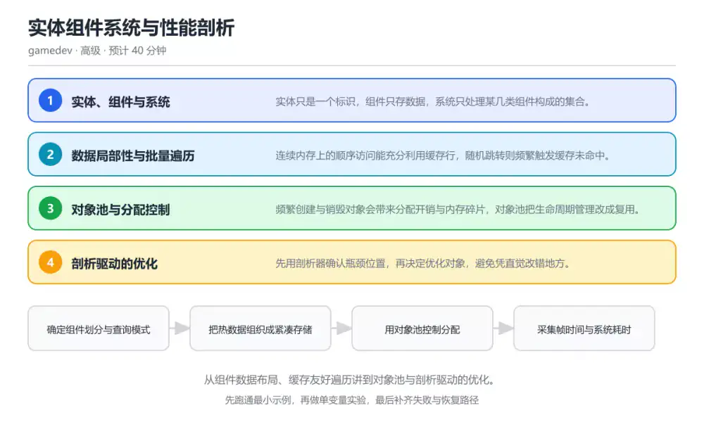
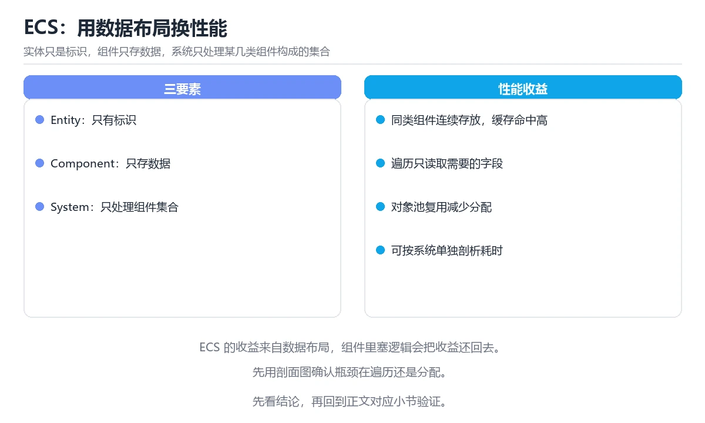

# 实体组件系统与性能剖析

> 内容更新时间：2026-10-06 · 学习阶段：高级 · 预计用时：30 分钟

分类：gamedev。关键词：ECS、数据局部性、对象池、剖析器、帧预算。从组件数据布局、缓存友好遍历讲到对象池与剖析驱动的优化。

学习建议：先通读《实体组件系统与性能剖析》的核心知识与关键流程，再运行可运行练习并完成测验；遇到不确定的结论，回到「故障现场」按症状、根因、修复、验证四步核对。



## 学习目标

- 能解释 ECS 为什么按组件而不是按对象组织数据。
- 能指出一次遍历中影响缓存命中的关键因素。
- 能用剖析数据而不是直觉来决定优化顺序。

## 前置知识

- 了解结构体、数组与索引的基本概念。
- 知道缓存的层级与命中率会影响性能。
- 能读懂一段批量遍历代码。

## 核心知识

### 1. 实体、组件与系统

实体只是一个标识，组件只存数据，系统只处理某几类组件构成的集合。

系统按组件集合查询实体，遍历时把同类数据连续取出，行为与数据分离让组合方式变得灵活。

在实体组件系统与性能剖析里可以这样验证：为移动系统只查询位置与速度组件，统计被处理的实体数量与遍历耗时。

边界：组件划分过细会让一次系统遍历需要拼接多份数组，反而增加随机访问与索引成本。

工程视角：把高频同时访问的组件放进同一组存储，并按实际查询模式决定粒度。

### 2. 数据局部性与批量遍历

连续内存上的顺序访问能充分利用缓存行，随机跳转则频繁触发缓存未命中。

处理器按缓存行预取数据，遍历紧凑数组时预取有效；指针追逐或对象分散在堆上时，预取往往落空。

在实体组件系统与性能剖析里可以这样验证：对比遍历紧凑数组与遍历指针数组的耗时，按元素数量归一化后再比较。

边界：数组过大同样会超出缓存容量，分块遍历能让工作集重新落进缓存。

工程视角：把组件存成并列数组或紧凑结构，尽量让热数据相邻。

### 3. 对象池与分配控制

频繁创建与销毁对象会带来分配开销与内存碎片，对象池把生命周期管理改成复用。

池预先申请一批对象并维护空闲列表，取出与归还都只是索引操作，避免运行期反复申请内存。

在实体组件系统与性能剖析里可以这样验证：把子弹改成从池中取出与归还，记录运行一分钟内的分配次数变化。

边界：池的容量上限决定了并发上限，归还时忘记重置状态会让复用对象带着上一轮的数据。

工程视角：归还时统一重置状态并统计池的峰值使用量，作为容量调整依据。

### 4. 剖析驱动的优化

先用剖析器确认瓶颈位置，再决定优化对象，避免凭直觉改错地方。

采样剖析给出各函数与系统的耗时占比，帧时间直方图能揭示尾延迟问题，两者结合才能区分平均与最坏情况。

在实体组件系统与性能剖析里可以这样验证：在一次长时压测中采集帧时间直方图，找出 P99 对应的帧并定位当时的系统耗时。

边界：在调试构建上测出的耗时不能代表发布版本，断言与日志会显著改变结果。

工程视角：把帧时间指标与系统耗时纳入持续集成，出现回归时能定位到具体提交。

## 关键流程

```text
确定组件划分与查询模式 → 把热数据组织成紧凑存储 → 用对象池控制分配 → 采集帧时间与系统耗时 → 按剖析结果逐项优化并回归
```

1. 确定组件划分与查询模式
2. 把热数据组织成紧凑存储
3. 用对象池控制分配
4. 采集帧时间与系统耗时
5. 按剖析结果逐项优化并回归

## 动手练习

1. 把一份基于指针的对象列表改造成并列数组，对比同一规模的遍历耗时。
2. 给对象池加上峰值使用量统计，并用它调整初始容量。
3. 采集一次长时压测的帧时间直方图，指出 P99 对应帧的耗时来源。

**验收标准**：留下 move_system 的输入、命令、输出和结论，让别人能按记录复现。

## 常见错误与排查

> 说明：本表由《实体组件系统与性能剖析》的核心知识整理（2026-10-06），人工复核进度见 docs/content_review_batches.md。

| 易错点 | 容易踩的做法 | 正确结论 |
| --- | --- | --- |
| 凭直觉优化热点 | 直接重写看起来最慢的系统而不先采样 | 先用剖析器定位耗时占比最高的系统，再动代码 |
| 组件散落在堆上 | 用指针数组组织组件，遍历时不断追逐指针 | 把热组件放进连续存储或分块数组，改善缓存命中 |
| 对象池归还时不重置状态 | 复用对象带着上一轮的速度与标记 | 归还时统一重置字段并统计池峰值使用量 |

## 可运行练习

### 任务 1：先跑通，再解释

```cpp
struct Position { float x, y; };
struct Velocity { float dx, dy; };

// 并列数组：位置与速度各自连续存放，遍历时顺序访问内存
std::vector<Position> positions;
std::vector<Velocity> velocities;

void move_system(float dt) {
    const size_t count = std::min(positions.size(), velocities.size());
    for (size_t i = 0; i < count; ++i) {
        positions[i].x += velocities[i].dx * dt;
        positions[i].y += velocities[i].dy * dt;
    }
}

// 对象池：取出与归还只操作索引，避免运行期反复分配
Bullet& acquire() {
    const size_t index = free_list.back();
    free_list.pop_back();
    return bullets[index];
}
```

示例把位置与速度存成并列数组，遍历时顺序访问连续内存；对象池用空闲索引列表复用对象，把分配与释放从运行期移出。真实项目里还要注意归还时重置状态。

### 任务 2：只改一个条件

复制上面的示例，只改一个输入或参数再跑一次；先写下预测，再和真实输出对照，并说明差异来自实体组件系统与性能剖析的哪条机制。

### 任务 3：迁移到自己的数据

把《实体组件系统与性能剖析》里的示例换成你自己的一小段数据或场景，保持结构不变；如果换不动，说明还有哪条前提没有理解，回到核心知识对应小节。

## 故障现场

### 现场 1：凭直觉优化热点

**症状**：在《实体组件系统与性能剖析》的复现场景中，直接重写看起来最慢的系统而不先采样。

**根因**：“直接重写看起来最慢的系统而不先采样”只是表层结果。向上追溯会落到“凭直觉优化热点”这一步，因为它省略了《实体组件系统与性能剖析》的约束，使实现行为和预期模型发生了偏离。

**修复**：针对《实体组件系统与性能剖析》的问题，先用剖析器定位耗时占比最高的系统，再动代码。

**验证**：先在《实体组件系统与性能剖析》中记录“凭直觉优化热点”留下的失败证据，再执行“先用剖析器定位耗时占比最高的系统，再动代码”并重放；确认错误路径变为明确结果，且修复没有掩盖同类故障。

### 现场 2：组件散落在堆上

**症状**：在《实体组件系统与性能剖析》的复现场景中，用指针数组组织组件，遍历时不断追逐指针。

**根因**：当出现“组件散落在堆上”时，执行路径已经绕过了《实体组件系统与性能剖析》的关键约束，最终以“用指针数组组织组件，遍历时不断追逐指针”暴露出来；修复前必须先确认约束在哪里失效。

**修复**：针对《实体组件系统与性能剖析》的问题，把热组件放进连续存储或分块数组，改善缓存命中。

**验证**：保留《实体组件系统与性能剖析》里触发“用指针数组组织组件，遍历时不断追逐指针”的输入、版本和日志，按“把热组件放进连续存储或分块数组，改善缓存命中”完成修改后原样重放；只有失败现象消失且相邻场景仍可解释，才保留改动。

### 现场 3：对象池归还时不重置状态

**症状**：在《实体组件系统与性能剖析》的复现场景中，复用对象带着上一轮的速度与标记。

**根因**：当出现“对象池归还时不重置状态”时，执行路径已经绕过了《实体组件系统与性能剖析》的关键约束，最终以“复用对象带着上一轮的速度与标记”暴露出来；修复前必须先确认约束在哪里失效。

**修复**：针对《实体组件系统与性能剖析》的问题，归还时统一重置字段并统计池峰值使用量。

**验证**：先在《实体组件系统与性能剖析》中记录“对象池归还时不重置状态”留下的失败证据，再执行“归还时统一重置字段并统计池峰值使用量”并重放；确认错误路径变为明确结果，且修复没有掩盖同类故障。

## 本课复习清单

离开本课前，逐项确认：

- [ ] 能说明 ECS 中数据与行为分离带来的好处。
- [ ] 能解释缓存局部性对遍历性能的影响。
- [ ] 能按剖析数据排出下一轮优化顺序。
- [ ] 至少运行一次 move_system 的示例，记录输入、输出和 ECS 的边界情况。
- [ ] 把本课最容易混淆的两个概念写成一句话对照。

| 复盘项 | 记录 |
| --- | --- |
| 已经能独立解释的考点 |  |
| 仍然说不清的概念 |  |
| 下一步验证动作 |  |

## 复习与自测

### 核心知识

遮住正文回答：实体组件系统与性能剖析解决什么问题、依赖哪些前提、失败时先看哪个信号？三问都能答清楚，再进入下一节。

### 动手练习

把《实体组件系统与性能剖析》里「只改一个条件」的练习再做一遍，这次先写预测再运行；预测和结果不一致的地方，就是需要回读的章节。

### 最小可运行示例

```cpp
struct Position { float x, y; };
struct Velocity { float dx, dy; };

// 并列数组：位置与速度各自连续存放，遍历时顺序访问内存
std::vector<Position> positions;
std::vector<Velocity> velocities;

void move_system(float dt) {
    const size_t count = std::min(positions.size(), velocities.size());
    for (size_t i = 0; i < count; ++i) {
        positions[i].x += velocities[i].dx * dt;
        positions[i].y += velocities[i].dy * dt;
    }
}

// 对象池：取出与归还只操作索引，避免运行期反复分配
Bullet& acquire() {
    const size_t index = free_list.back();
    free_list.pop_back();
    return bullets[index];
}
```

### 预期输出

```text
同一批实体的移动系统耗时随数量近似线性增长；改用对象池后运行期分配次数明显下降，帧时间直方图的尾部更平坦。
```

### 验证步骤

1. 确认输入数据与运行环境和示例一致。
2. 运行示例，记录输出与耗时等可观测指标。
3. 换一个边界输入重跑，确认结论仍然成立。
4. 把两次结果写成一句话结论，注明前提与局限。

## 术语速查

先遮住右列，尝试用自己的话解释，再回到正文核对。

| 术语 | 一句话说明 |
| --- | --- |
| `实体` | 只作为标识存在的游戏对象编号，本身不携带数据。 |
| `组件` | 只保存数据的结构，按类型成组存放。 |
| `系统` | 对满足特定组件组合的实体批量执行逻辑的处理单元。 |
| `对象池` | 预先申请并复用对象的容器，用于减少运行期分配。 |
| `缓存行` | 处理器与内存之间传输数据的最小单位，影响顺序访问效率。 |

## 考点精讲

### 考点 1：ECS 中组件的设计原则是什么？

题型：概念判断。题干：ECS 中组件的设计原则是什么？

判断要点：只存数据，不写行为。ECS 把数据与行为分开：组件只描述状态，系统负责处理逻辑，实体只作为标识；这样同一类数据可以连续存放，系统遍历时能获得更好的缓存局部性。 正确选项「只存数据，不写行为」对应《实体组件系统与性能剖析》的要点「实体、组件与系统」：实体只是一个标识，组件只存数据，系统只处理某几类组件构成的集合。判断「实体、组件与系统」时先确认前提是否成立，再回到《实体组件系统与性能剖析》的示例核对一次；把别的语言或框架的默认做法直接搬到实体、组件与系统上，往往会在本课的边界条件里失效。

### 考点 2：并列数组比指针数组更适合批量遍历的原因是

题型：概念判断。题干：并列数组比指针数组更适合批量遍历的原因是什么？

判断要点：顺序访问连续内存。处理器会按缓存行预取相邻数据，顺序遍历紧凑数组时预取有效；指针数组需要在堆上追逐地址，预取经常落空，于是同样的运算量会花更多时间等待内存。 正确选项「顺序访问连续内存」对应《实体组件系统与性能剖析》的要点「数据局部性与批量遍历」：连续内存上的顺序访问能充分利用缓存行，随机跳转则频繁触发缓存未命中。判断「数据局部性与批量遍历」时先确认前提是否成立，再回到《实体组件系统与性能剖析》的示例核对一次；借鉴相邻主题的经验之前，先核对数据局部性与批量遍历的前提是否成立。

### 考点 3：以下哪些做法属于剖析驱动的优化？（多选）

题型：多选辨析。题干：以下哪些做法属于剖析驱动的优化？（多选）

判断要点：用采样数据确认耗时占比最高的系统；采集帧时间直方图观察 P99；在发布构建上验证优化前后的差异。剖析驱动意味着先测量再修改：采样数据指出热点，直方图揭示尾延迟，最终还要在发布构建上复核效果；按代码行数猜测瓶颈通常会把优化用错地方。 正确选项「用采样数据确认耗时占比最高的系统；采集帧时间直方图观察 P99；在发布构建上验证优化前后的差异」对应《实体组件系统与性能剖析》的要点「对象池与分配控制」：频繁创建与销毁对象会带来分配开销与内存碎片，对象池把生命周期管理改成复用。判断「对象池与分配控制」时先确认前提是否成立，再回到《实体组件系统与性能剖析》的示例核对一次；记住对象池与分配控制的结论之外还要记住适用条件，换一个输入往往就不成立了。

### 考点 4：请按一次剖析驱动的优化流程排列步骤。

题型：顺序排列。题干：请按一次剖析驱动的优化流程排列步骤。

判断要点：在发布构建上复核优化效果。流程是先采集数据、定位热点、单变量修改并重新测量，最后在发布构建上复核；省略测量或一次改动多个变量，都无法判断收益来自哪里。 正确选项「采集成帧时间与系统耗时；定位耗时占比最高的系统；只改一个变量后重新测量；在发布构建上复核优化效果」对应《实体组件系统与性能剖析》的要点「剖析驱动的优化」：先用剖析器确认瓶颈位置，再决定优化对象，避免凭直觉改错地方。判断「剖析驱动的优化」时先确认前提是否成立，再回到《实体组件系统与性能剖析》的示例核对一次；干扰项常常是相邻主题里成立的结论，只有按剖析驱动的优化的输入与约束判断才能排除。

### 考点 5：阅读这段 ECS 遍历代码，下面哪项判断

题型：代码阅读。题干：阅读这段 ECS 遍历代码，下面哪项判断是正确的？

判断要点：位置与速度存成并列数组，遍历按索引顺序访问连续内存。这段 ECS 代码把两种组件分开连续存放，遍历时按索引顺序访问内存，符合数据局部性原则；对象池的取出与归还只操作索引，因此不会在运行期反复分配，性能收益要靠剖析数据验证。 正确选项「位置与速度存成并列数组，遍历按索引顺序访问连续内存」对应《实体组件系统与性能剖析》的要点「实体、组件与系统」：实体只是一个标识，组件只存数据，系统只处理某几类组件构成的集合。判断「实体、组件与系统」时先确认前提是否成立，再回到《实体组件系统与性能剖析》的示例核对一次；把实体、组件与系统的做法换到别的约束下未必成立，先确认边界再决定答案。

## English Overview

Entity Component Systems and Profiling

An ECS keeps entities as identifiers, components as plain data and systems as batch processing over component sets. Layout decides speed: contiguous arrays prefetch well, pointer chasing does not. Pool objects to remove runtime allocation, and always choose the next optimisation from profiler data rather than intuition, verifying the result on a release build.



## 本课小结

- 实体组件系统与性能剖析围绕ECS、数据局部性、对象池展开，先建立基线再讨论优化。
- 实体只是一个标识，组件只存数据，系统只处理某几类组件构成的集合。
- move_system 出错时先记录症状，再定位根因，最后用一次复跑确认修复。

## 内容元数据

- 内容版本：v2.0
- 最后更新：2026-10-06
- 学习阶段：高级

| 字段 | 值 |
| --- | --- |
| 课程 ID | `gamedev_ecs_profiling` |
| 所属分类 | `gamedev` |
| 难度 | 高级 |
| 预计用时 | 40 分钟 |
| 关键词 | ECS、数据局部性、对象池、剖析器、帧预算 |
| 配图 | `images/lesson_gamedev_ecs_profiling.webp` |
| 参考资料 | 3 条 |
| 内容更新时间 | 2026-10-06 |

## 参考资料与复核

- 最后复核：2026-10-04
- 下次复核：2027-04-24
- 复核范围：版本兼容、API 行为与工程实践

下面列出的资料用于核对本课结论，复习时可以对照阅读：
- [ECS FAQ](https://github.com/SanderMertens/ecs-faq)
- [Unity ECS 文档](https://docs.unity3d.com/Packages/com.unity.entities@1.0/manual/index.html)
- [Game Programming Patterns：Component](https://gameprogrammingpatterns.com/component.html)

> 复核提示：《实体组件系统与性能剖析》的结论如与资料冲突，以资料中的规范文本为准，并在笔记里记录差异与日期。

## 复习与迁移

### 概念复述

不看正文，把实体组件系统与性能剖析讲给一个没学过的同事：先讲它解决什么问题，再讲一个最小例子，最后说明一个不适用场景。

### 测验回顾

回到《实体组件系统与性能剖析》测验，只重做答错或犹豫的题；对每道题写一句「我为什么改选这个答案」，写不出理由就回到对应小节。

### 迁移练习

把《实体组件系统与性能剖析》的方法用到一个你自己的真实场景：说明输入、约束与验证方式，并列出仍然不确定、需要下一次实验回答的问题。

## 深度拓展与实战

这一节把实体组件系统与性能剖析的机制拆开验证：每一步都给出输入、判断标准和失败信号，便于在真实项目里复用。

### 机制拆解 1：实体、组件与系统

系统按组件集合查询实体，遍历时把同类数据连续取出，行为与数据分离让组合方式变得灵活。

落地时先确认前提：组件划分过细会让一次系统遍历需要拼接多份数组，反而增加随机访问与索引成本。；再把结论写进检查表，让下一位同学可以按同样的输入复现。

工程做法：把高频同时访问的组件放进同一组存储，并按实际查询模式决定粒度。

### 机制拆解 2：数据局部性与批量遍历

处理器按缓存行预取数据，遍历紧凑数组时预取有效；指针追逐或对象分散在堆上时，预取往往落空。

落地时先确认前提：数组过大同样会超出缓存容量，分块遍历能让工作集重新落进缓存。；再把结论写进检查表，让下一位同学可以按同样的输入复现。

工程做法：把组件存成并列数组或紧凑结构，尽量让热数据相邻。

### 机制拆解 3：对象池与分配控制

池预先申请一批对象并维护空闲列表，取出与归还都只是索引操作，避免运行期反复申请内存。

落地时先确认前提：池的容量上限决定了并发上限，归还时忘记重置状态会让复用对象带着上一轮的数据。；再把结论写进检查表，让下一位同学可以按同样的输入复现。

工程做法：归还时统一重置状态并统计池的峰值使用量，作为容量调整依据。

### 机制拆解 4：剖析驱动的优化

采样剖析给出各函数与系统的耗时占比，帧时间直方图能揭示尾延迟问题，两者结合才能区分平均与最坏情况。

落地时先确认前提：在调试构建上测出的耗时不能代表发布版本，断言与日志会显著改变结果。；再把结论写进检查表，让下一位同学可以按同样的输入复现。

工程做法：把帧时间指标与系统耗时纳入持续集成，出现回归时能定位到具体提交。

### 机制对照表

| 概念 | 解决什么问题 | 关键前提 | 失败信号 |
| --- | --- | --- | --- |
| 实体、组件与系统 | 实体只是一个标识，组件只存数据，系统只处理某几类组件构成的集合。 | 组件划分过细会让一次系统遍历需要拼接多份数组，反而增加随机访问与索引成本 | 把高频同时访问的组件放进同一组存储，并按实际查询模式决定粒度。 |
| 数据局部性与批量遍历 | 连续内存上的顺序访问能充分利用缓存行，随机跳转则频繁触发缓存未命中。 | 数组过大同样会超出缓存容量，分块遍历能让工作集重新落进缓存。 | 把组件存成并列数组或紧凑结构，尽量让热数据相邻。 |
| 对象池与分配控制 | 频繁创建与销毁对象会带来分配开销与内存碎片，对象池把生命周期管理改成复用。 | 池的容量上限决定了并发上限，归还时忘记重置状态会让复用对象带着上一轮的数 | 归还时统一重置状态并统计池的峰值使用量，作为容量调整依据。 |
| 剖析驱动的优化 | 先用剖析器确认瓶颈位置，再决定优化对象，避免凭直觉改错地方。 | 在调试构建上测出的耗时不能代表发布版本，断言与日志会显著改变结果。 | 把帧时间指标与系统耗时纳入持续集成，出现回归时能定位到具体提交。 |

### 自测问答

**问 1**：ECS 中组件的设计原则是什么？

**答**：只存数据，不写行为。ECS 把数据与行为分开：组件只描述状态，系统负责处理逻辑，实体只作为标识；这样同一类数据可以连续存放，系统遍历时能获得更好的缓存局部性。 正确选项「只存数据，不写行为」对应《实体组件系统与性能剖析》的要点「实体、组件与系统」：实体只是一个标识，组件只存数据，系统只处理某几类组件构成的集合。判断「实体、组件与系统」时先确认前提是否成立，再回到《实体组件系统与性能剖析》的示例核对一次；把别的语言或框架的默认做法直接搬到实体、组件与系统上，往往会在本课的边界条件里失效。

**问 2**：并列数组比指针数组更适合批量遍历的原因是什么？

**答**：顺序访问连续内存，缓存命中率更高。处理器会按缓存行预取相邻数据，顺序遍历紧凑数组时预取有效；指针数组需要在堆上追逐地址，预取经常落空，于是同样的运算量会花更多时间等待内存。 正确选项「顺序访问连续内存，缓存命中率更高」对应《实体组件系统与性能剖析》的要点「数据局部性与批量遍历」：连续内存上的顺序访问能充分利用缓存行，随机跳转则频繁触发缓存未命中。判断「数据局部性与批量遍历」时先确认前提是否成立，再回到《实体组件系统与性能剖析》的示例核对一次；借鉴相邻主题的经验之前，先核对数据局部性与批量遍历的前提是否成立。

**问 3**：以下哪些做法属于剖析驱动的优化？（多选）

**答**：用采样数据确认耗时占比最高的系统；采集帧时间直方图观察 P99；在发布构建上验证优化前后的差异。剖析驱动意味着先测量再修改：采样数据指出热点，直方图揭示尾延迟，最终还要在发布构建上复核效果；按代码行数猜测瓶颈通常会把优化用错地方。 正确选项「用采样数据确认耗时占比最高的系统；采集帧时间直方图观察 P99；在发布构建上验证优化前后的差异」对应《实体组件系统与性能剖析》的要点「对象池与分配控制」：频繁创建与销毁对象会带来分配开销与内存碎片，对象池把生命周期管理改成复用。判断「对象池与分配控制」时先确认前提是否成立，再回到《实体组件系统与性能剖析》的示例核对一次；记住对象池与分配控制的结论之外还要记住适用条件，换一个输入往往就不成立了。

**问 4**：请按一次剖析驱动的优化流程排列步骤。

**答**：在发布构建上复核优化效果。流程是先采集数据、定位热点、单变量修改并重新测量，最后在发布构建上复核；省略测量或一次改动多个变量，都无法判断收益来自哪里。 正确选项「采集成帧时间与系统耗时；定位耗时占比最高的系统；只改一个变量后重新测量；在发布构建上复核优化效果」对应《实体组件系统与性能剖析》的要点「剖析驱动的优化」：先用剖析器确认瓶颈位置，再决定优化对象，避免凭直觉改错地方。判断「剖析驱动的优化」时先确认前提是否成立，再回到《实体组件系统与性能剖析》的示例核对一次；干扰项常常是相邻主题里成立的结论，只有按剖析驱动的优化的输入与约束判断才能排除。

**问 5**：阅读这段 ECS 遍历代码，下面哪项判断是正确的？

**答**：位置与速度存成并列数组，遍历按索引顺序访问连续内存。这段 ECS 代码把两种组件分开连续存放，遍历时按索引顺序访问内存，符合数据局部性原则；对象池的取出与归还只操作索引，因此不会在运行期反复分配，性能收益要靠剖析数据验证。 正确选项「位置与速度存成并列数组，遍历按索引顺序访问连续内存」对应《实体组件系统与性能剖析》的要点「实体、组件与系统」：实体只是一个标识，组件只存数据，系统只处理某几类组件构成的集合。判断「实体、组件与系统」时先确认前提是否成立，再回到《实体组件系统与性能剖析》的示例核对一次；把实体、组件与系统的做法换到别的约束下未必成立，先确认边界再决定答案。

### 排错速查

- 看到「直接重写看起来最慢的系统而不先采样」时，先按「先用剖析器定位耗时占比最高的系统，再动代码」处理，再用实体组件系统与性能剖析的最小示例确认结论是否恢复。
- 看到「用指针数组组织组件，遍历时不断追逐指针」时，先按「把热组件放进连续存储或分块数组，改善缓存命中」处理，再用实体组件系统与性能剖析的最小示例确认结论是否恢复。
- 看到「复用对象带着上一轮的速度与标记」时，先按「归还时统一重置字段并统计池峰值使用量」处理，再用实体组件系统与性能剖析的最小示例确认结论是否恢复。

### 工程检查表

- [ ] 确定组件划分与查询模式
- [ ] 把热数据组织成紧凑存储
- [ ] 用对象池控制分配
- [ ] 采集帧时间与系统耗时
- [ ] 按剖析结果逐项优化并回归
- [ ] 【实体、组件与系统】把高频同时访问的组件放进同一组存储，并按实际查询模式决定粒度。
- [ ] 【数据局部性与批量遍历】把组件存成并列数组或紧凑结构，尽量让热数据相邻。
- [ ] 【对象池与分配控制】归还时统一重置状态并统计池的峰值使用量，作为容量调整依据。
- [ ] 【剖析驱动的优化】把帧时间指标与系统耗时纳入持续集成，出现回归时能定位到具体提交。

### 迁移练习

把实体组件系统与性能剖析的方法用到一个真实场景：写下ECS、数据局部性、对象池在你的场景里分别对应什么，再记录一次失败尝试和它的恢复步骤。

### 延伸阅读与下一步

- 复习ECS、数据局部性、对象池、剖析器、帧预算时，优先回看「实体、组件与系统」与「剖析驱动的优化」两节。
- 把从「确定组件划分与查询模式」到「按剖析结果逐项优化并回归」的流程画成一张图，放进自己的笔记。
- 一周后重做本课测验，只把答错的题留到下一轮复习。

### 结论与下一步

学完实体组件系统与性能剖析，应该能独立完成三件事：先用最小示例确认ECS的行为，再用一个边界输入验证结论，最后把失败路径写成可重复的检查。下一步把本课术语加入复习清单，并在两周内用一次真实任务检验记忆是否牢固。
