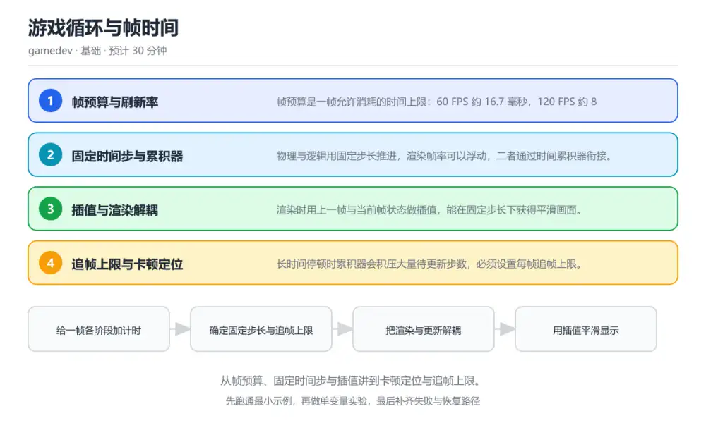
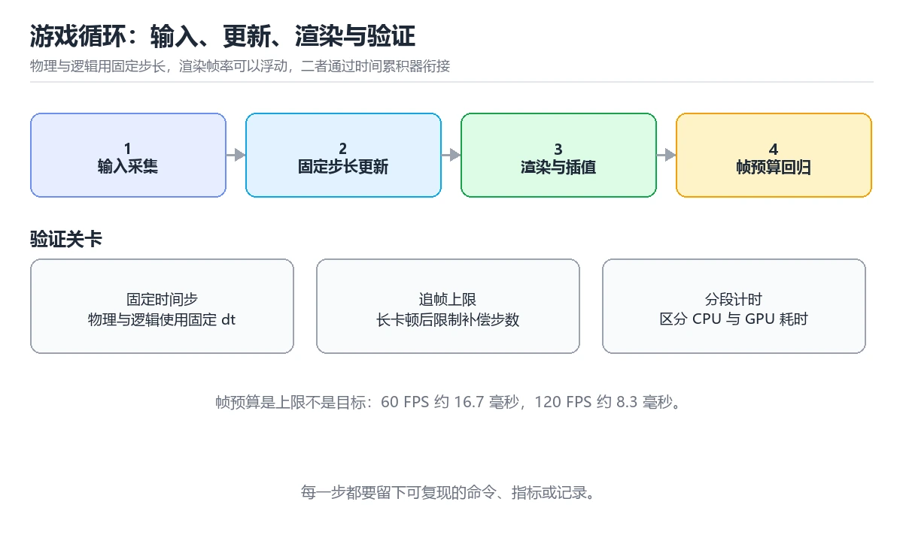

# 游戏循环与帧时间

> 内容更新时间：2026-10-06 · 学习阶段：基础 · 预计用时：40 分钟

分类：gamedev。关键词：游戏循环、固定时间步、帧预算、垂直同步、插值。从帧预算、固定时间步与插值讲到卡顿定位与追帧上限。



## 本节知识框架

**课程定位**：所属分类 `gamedev`（图形与游戏开发），课程主题 `游戏循环与帧时间`，学习阶段 基础，建议用时 40 分钟。

本课主线：从帧预算、固定时间步与插值讲到卡顿定位与追帧上限。

**学完本课应当能够**
- 说清 `帧预算` 与 `固定时间步` 的含义与区别，并各举一个正例和一个反例。
- 用本课示例验证 `累积器` 的行为，记录输入、输出与失败条件。
- 遇到「用渲染帧的时间直接推进物理」这类问题时，能说出触发条件与修复顺序。

### 从概念到验证的学习链条

1. `帧预算`：先掌握 单帧允许消耗的时间上限，由目标帧率决定，再用它解释 `固定时间步` 为什么会出现。
2. `固定时间步`：先掌握 物理与逻辑使用恒定步长推进的模拟方式，再用它解释 `累积器` 为什么会出现。
3. `累积器`：先掌握 记录尚未被固定步长消费的真实时间余量，再用它解释 `插值` 为什么会出现。
4. `插值`：先掌握 用前后两个状态与比例参数生成平滑显示结果，再用它解释 `追帧` 为什么会出现。
5. `追帧`：先掌握 在单帧内补执行多次更新以追上真实时间，再用它解释 `刷新率` 为什么会出现。
6. `刷新率`：先掌握 画面每秒刷新的次数：垂直同步把呈现时机对齐到显示刷新，游戏必须在下一帧开始前完成输入、更新与渲染，否则就会掉帧或撕裂，再用它解释 本课示例的观察结果 为什么会出现。

**先修与衔接**：本课是「图形与游戏开发」分类的第 1 课。当前没有登记显式先修或后续课程；课程主线是从帧预算、固定时间步与插值讲到卡顿定位与追帧上限。学完后按 `gamedev` 分类顺序继续。

### 完成判据

- **定义关**：不看正文也能说明 `帧预算` 是 单帧允许消耗的时间上限，由目标帧率决定，并指出一个反例。
- **机制关**：能按“输入 → 转换 → 输出 → 验证”复述 `游戏循环与帧时间`，而不是只背结论。
- **示例关**：能运行或推演 `游戏循环与帧时间` 的 `text` 示例，并说明一个真实出现的标识符或字面量。
- **证据关**：能从 `游戏循环与帧时间` 的示例写出一个输入、处理、输出三元组，并说明它支持或反驳了本课的哪一条结论。
- **排错关**：能复现 用渲染帧的时间直接推进物理，记录现象并按 物理用固定步长推进，真实耗时只累加进累积器 修复。
- **迁移关**：能把 `游戏循环`、`固定时间步`、`帧预算`、`垂直同步` 放进一个与 `游戏循环与帧时间` 不同的项目场景，并保持输入与验证条件可追踪。
- **复盘关**：学完 `游戏循环与帧时间` 后，用一句话写下仍然不确定的结论，并列出下一次验证需要的输入、环境和成功判据。

### 复习清单

- [ ] 能不看正文复述本课核心术语，并指出一个边界或反例。
- [ ] 能运行或推演本课示例，记录输入、输出与失败现象。
- [ ] 能完成一次自测，并把错题对照错误表定位原因。

**本课配图**



## 核心概念定义

| 术语 | 操作性定义 | 常见边界与风险 |
| --- | --- | --- |
| 帧预算 | 单帧允许消耗的时间上限，由目标帧率决定。 | 只在「单帧允许消耗的时间上限，由目标帧率决定」这一前提下成立，换输入或换环境要重新验证。 |
| 固定时间步 | 物理与逻辑使用恒定步长推进的模拟方式。 | 只在「物理与逻辑使用恒定步长推进的模拟方式」这一前提下成立，换输入或换环境要重新验证。 |
| 累积器 | 记录尚未被固定步长消费的真实时间余量。 | 易错：把每帧真实耗时直接当作固定步长传给物理；正确做法是物理用固定步长推进，真实耗时只累加进累积器。 |
| 插值 | 用前后两个状态与比例参数生成平滑显示结果。 | 易错：渲染时把插值结果写回物体位置；正确做法是渲染只读快照，状态修改只在固定步长更新里进行。 |
| 追帧 | 在单帧内补执行多次更新以追上真实时间。 | 易错：让累积器把积压的时间一次全部追完；正确做法是设置每帧追帧上限，超出部分记录并丢弃。 |
| 刷新率 | 画面每秒刷新的次数：垂直同步把呈现时机对齐到显示刷新，游戏必须在下一帧开始前完成输入、更新与渲染，否则就会掉帧或撕裂 | 缓存与状态残留会让结果过期，先明确失效策略再判断正确性。 |

## 原理与运行机制

### 机制总览

**教材衔接：核心知识**

### 1. 帧预算与刷新率

帧预算是一帧允许消耗的时间上限：60 FPS 约 16.7 毫秒，120 FPS 约 8.3 毫秒。

垂直同步把呈现时机对齐到显示刷新，游戏必须在下一帧开始前完成输入、更新与渲染，否则就会掉帧或撕裂。

在游戏循环与帧时间里可以这样验证：把一帧的输入、物理、逻辑与渲染耗时分别计时，画成堆叠柱状图找出最粗的一段。

边界：帧预算要用最坏情况衡量：一次垃圾回收或一次资源加载就可能吃掉整帧时间，平均值好看并不代表不卡顿。

工程视角：把帧时间与各阶段耗时打成采样日志，发布前用目标机型跑一遍长时压测。

### 2. 固定时间步与累积器

物理与逻辑用固定步长推进，渲染帧率可以浮动，二者通过时间累积器衔接。

每帧把真实耗时累加到 accumulator，只要它超过固定步长就执行一次更新并减去步长，从而让模拟结果与帧率无关。

在游戏循环与帧时间里可以这样验证：把步长设为 1/60 秒，人为把渲染帧率降到 30 FPS，观察物体运动轨迹是否仍然一致。

边界：步长过大时高速物体可能穿过障碍，步长过小则更新次数与开销飙升，需要按游戏类型取舍。

工程视角：固定步长写进配置并记录在存档里，避免版本变更后回放或录像结果不一致。

### 3. 插值与渲染解耦

渲染时用上一帧与当前帧状态做插值，能在固定步长下获得平滑画面。

累积器剩余比例 alpha 表示当前时刻落在两次更新之间的位置，渲染位置取前后两个状态的加权平均。

在游戏循环与帧时间里可以这样验证：把 alpha 从 0 调到 1，观察渲染位置从上一状态平滑过渡到当前状态。

边界：插值只影响显示，不能写回模拟状态，否则会把渲染误差累积进物理世界。

工程视角：渲染层只读快照，避免渲染代码直接修改模拟数据，这样回放与录像也能复用同一份状态。

### 4. 追帧上限与卡顿定位

长时间停顿时累积器会积压大量待更新步数，必须设置每帧追帧上限。

调试器暂停、资源加载或断点会让单帧耗时远超预算，若不限制追帧次数，程序会陷入越追越慢的死亡螺旋。

在游戏循环与帧时间里可以这样验证：人为暂停两秒后恢复，观察是否有追帧上限；没有上限时画面会连续卡顿数秒。

边界：直接丢弃累积时间会让物理时间与真实时间脱钩，因此要记录丢弃量并在设计上接受这一偏差。

工程视角：把追帧上限、丢弃时长与掉帧计数写入日志，线上就能区分偶发卡顿与持续超支。

**教材衔接：关键流程**

```text
给一帧各阶段加计时 → 确定固定步长与追帧上限 → 把渲染与更新解耦 → 用插值平滑显示 → 压测并复盘最慢的一帧
```

1. 给一帧各阶段加计时
2. 确定固定步长与追帧上限
3. 把渲染与更新解耦
4. 用插值平滑显示
5. 压测并复盘最慢的一帧

### 机制拆解：每一步的输入、动作与输出

#### 1. `帧预算`
- 输入：`游戏循环`；本步把 单帧允许消耗的时间上限，由目标帧率决定 当作判断规则。
- 动作：围绕 `帧预算` 保留中间状态，并记录它与 `固定时间步` 的对应关系。
- 输出：`固定时间步`，它可以被下一段代码、测试或记录继续使用。
- `帧预算` 的失败条件：只在「单帧允许消耗的时间上限，由目标帧率决定」这一前提下成立，换输入或换环境要重新验证。

#### 2. `固定时间步`
- 输入：`帧预算`；本步把 物理与逻辑使用恒定步长推进的模拟方式 当作判断规则。
- 动作：围绕 `固定时间步` 保留中间状态，并记录它与 `累积器` 的对应关系。
- 输出：`累积器`，它可以被下一段代码、测试或记录继续使用。
- `固定时间步` 的失败条件：只在「物理与逻辑使用恒定步长推进的模拟方式」这一前提下成立，换输入或换环境要重新验证。

#### 3. `累积器`
- 输入：`固定时间步`；本步把 记录尚未被固定步长消费的真实时间余量 当作判断规则。
- 动作：围绕 `累积器` 保留中间状态，并记录它与 `插值` 的对应关系。
- 输出：`插值`，它可以被下一段代码、测试或记录继续使用。
- `累积器` 的失败条件：当用渲染帧的时间直接推进物理时，会出现把每帧真实耗时直接当作固定步长传给物理。

#### 4. `插值`
- 输入：`累积器`；本步把 用前后两个状态与比例参数生成平滑显示结果 当作判断规则。
- 动作：围绕 `插值` 保留中间状态，并记录它与 `追帧` 的对应关系。
- 输出：`追帧`，它可以被下一段代码、测试或记录继续使用。
- `插值` 的失败条件：当在渲染阶段回写模拟状态时，会出现渲染时把插值结果写回物体位置。

#### 5. `追帧`
- 输入：`插值`；本步把 在单帧内补执行多次更新以追上真实时间 当作判断规则。
- 动作：围绕 `追帧` 保留中间状态，并记录它与 `刷新率` 的对应关系。
- 输出：`刷新率`，它可以被下一段代码、测试或记录继续使用。
- `追帧` 的失败条件：当没有追帧上限时，会出现让累积器把积压的时间一次全部追完。

#### 6. `刷新率`
- 输入：`追帧`；本步把 画面每秒刷新的次数：垂直同步把呈现时机对齐到显示刷新，游戏必须在下一帧开始前完成输入、更新与渲染，否则就会掉帧或撕裂 当作判断规则。
- 动作：围绕 `刷新率` 保留中间状态，并记录它与 `本课示例的最终结果` 的对应关系。
- 输出：`本课示例的最终结果`，它可以被下一段代码、测试或记录继续使用。
- `刷新率` 的失败条件：缓存与状态残留会让结果过期，先明确失效策略再判断正确性。

### 复现实验记录

- 环境：`游戏循环与帧时间` 使用 `text` 示例，固定 `游戏循环`、`固定时间步`、`帧预算`、`垂直同步` 作为第一组条件。
- 首轮输入：从示例中的第一个输入开始，预测 `帧预算` 会怎样变化。
- 基线观察：记录命令、输入、输出和错误原文，不用截图代替可复制的文本。
- 单变量修改：只改变 `游戏循环`，观察 `刷新率` 是否仍满足定义。
- 失败注入：复现 用渲染帧的时间直接推进物理，确认现象是 把每帧真实耗时直接当作固定步长传给物理。
- 记录结论：把“修改前、修改后、预期变化、实际变化”写成四列表，这样复盘 `游戏循环与帧时间` 时才能区分概念错误与实现错误。

## 典型应用场景

**教材衔接：深度拓展与实战**

### 机制拆解 1：帧预算与刷新率

垂直同步把呈现时机对齐到显示刷新，游戏必须在下一帧开始前完成输入、更新与渲染，否则就会掉帧或撕裂。

落地时先确认前提：帧预算要用最坏情况衡量：一次垃圾回收或一次资源加载就可能吃掉整帧时间，平均值好看并不代表不卡顿。再把结论写进检查表，让下一位同学可以按同样的输入复现。

工程做法：把帧时间与各阶段耗时打成采样日志，发布前用目标机型跑一遍长时压测。

### 机制拆解 2：固定时间步与累积器

每帧把真实耗时累加到 accumulator，只要它超过固定步长就执行一次更新并减去步长，从而让模拟结果与帧率无关。

落地时先确认前提：步长过大时高速物体可能穿过障碍，步长过小则更新次数与开销飙升，需要按游戏类型取舍。再把结论写进检查表，让下一位同学可以按同样的输入复现。

工程做法：固定步长写进配置并记录在存档里，避免版本变更后回放或录像结果不一致。

### 机制拆解 3：插值与渲染解耦

累积器剩余比例 alpha 表示当前时刻落在两次更新之间的位置，渲染位置取前后两个状态的加权平均。

落地时先确认前提：插值只影响显示，不能写回模拟状态，否则会把渲染误差累积进物理世界。再把结论写进检查表，让下一位同学可以按同样的输入复现。

工程做法：渲染层只读快照，避免渲染代码直接修改模拟数据，这样回放与录像也能复用同一份状态。

### 机制拆解 4：追帧上限与卡顿定位

调试器暂停、资源加载或断点会让单帧耗时远超预算，若不限制追帧次数，程序会陷入越追越慢的死亡螺旋。

落地时先确认前提：直接丢弃累积时间会让物理时间与真实时间脱钩，因此要记录丢弃量并在设计上接受这一偏差。再把结论写进检查表，让下一位同学可以按同样的输入复现。

工程做法：把追帧上限、丢弃时长与掉帧计数写入日志，线上就能区分偶发卡顿与持续超支。

### 机制对照表

| 概念 | 解决什么问题 | 关键前提 | 失败信号 |
| --- | --- | --- | --- |
| 帧预算与刷新率 | 帧预算是一帧允许消耗的时间上限：60 FPS 约 16.7 毫秒，120 FPS | 帧预算要用最坏情况衡量：一次垃圾回收或一次资源加载就可能吃掉整帧时间，平 | 把帧时间与各阶段耗时打成采样日志，发布前用目标机型跑一遍长时压测。 |
| 固定时间步与累积器 | 物理与逻辑用固定步长推进，渲染帧率可以浮动，二者通过时间累积器衔接。 | 步长过大时高速物体可能穿过障碍，步长过小则更新次数与开销飙升，需要按游戏 | 固定步长写进配置并记录在存档里，避免版本变更后回放或录像结果不一致。 |
| 插值与渲染解耦 | 渲染时用上一帧与当前帧状态做插值，能在固定步长下获得平滑画面。 | 插值只影响显示，不能写回模拟状态，否则会把渲染误差累积进物理世界。 | 渲染层只读快照，避免渲染代码直接修改模拟数据，这样回放与录像也能复用同一 |
| 追帧上限与卡顿定位 | 长时间停顿时累积器会积压大量待更新步数，必须设置每帧追帧上限。 | 直接丢弃累积时间会让物理时间与真实时间脱钩，因此要记录丢弃量并在设计上接 | 把追帧上限、丢弃时长与掉帧计数写入日志，线上就能区分偶发卡顿与持续超支。 |

### 自测问答

**问 1**：60 FPS 下单帧时间预算大约是多少？

**答**：16.7 毫秒。1 秒除以 60 约等于 16.7 毫秒，这就是输入、更新与渲染全部要挤进的时间窗；超过它就只能在下一帧补做，表现为掉帧或输入延迟。 正确选项「16.7 毫秒」对应《游戏循环与帧时间》的要点「帧预算与刷新率」：帧预算是一帧允许消耗的时间上限：60 FPS 约 16.7 毫秒，120 FPS 约 8.3 毫秒。判断「帧预算与刷新率」时先确认前提是否成立，再回到《游戏循环与帧时间》的示例核对一次；把别的语言或框架的默认做法直接搬到帧预算与刷新率上，往往会在本课的边界条件里失效。

**问 2**：固定时间步方案里，累积器的作用是什么？

**答**：记录尚未被固定步长消费的真实时间。累积器把真实耗时攒起来，攒够一个步长就执行一次更新；它让物理推进次数与实际帧率解耦，从而保证不同帧率下运动结果一致。 正确选项「记录尚未被固定步长消费的真实时间」对应《游戏循环与帧时间》的要点「固定时间步与累积器」：物理与逻辑用固定步长推进，渲染帧率可以浮动，二者通过时间累积器衔接。判断「固定时间步与累积器」时先确认前提是否成立，再回到《游戏循环与帧时间》的示例核对一次；借鉴相邻主题的经验之前，先核对固定时间步与累积器的前提是否成立。

**问 3**：以下哪些做法能降低卡顿风险？（多选）

**答**：给一帧各阶段加计时；设置每帧追帧上限；压测最慢的一帧而不是只看平均值。分阶段计时才能定位超支环节，追帧上限避免死亡螺旋，按最坏帧压测才能发现真实卡顿；渲染回写物理状态会把显示误差累积进模拟，属于错误做法。 正确选项「给一帧各阶段加计时；设置每帧追帧上限；压测最慢的一帧而不是只看平均值」对应《游戏循环与帧时间》的要点「插值与渲染解耦」：渲染时用上一帧与当前帧状态做插值，能在固定步长下获得平滑画面。判断「插值与渲染解耦」时先确认前提是否成立，再回到《游戏循环与帧时间》的示例核对一次；记住插值与渲染解耦的结论之外还要记住适用条件，换一个输入往往就不成立了。

**问 4**：请按一帧内从采集输入到呈现的典型顺序排列。

**答**：呈现并等待垂直同步。顺序是先读输入、再按固定步长推进模拟、然后插值渲染、最后呈现并等待刷新；把渲染放在更新之前会让画面永远慢一步。 正确选项「采集输入；按固定步长更新物理与逻辑；插值后渲染；呈现并等待垂直同步」对应《游戏循环与帧时间》的要点「追帧上限与卡顿定位」：长时间停顿时累积器会积压大量待更新步数，必须设置每帧追帧上限。判断「追帧上限与卡顿定位」时先确认前提是否成立，再回到《游戏循环与帧时间》的示例核对一次；干扰项常常是相邻主题里成立的结论，只有按追帧上限与卡顿定位的输入与约束判断才能排除。

**问 5**：阅读这段游戏循环，下面哪项判断是正确的？

**答**：累积器超过步长时才执行更新，且每帧追帧次数有上限。这段游戏循环用累积器判断是否该推进固定步长，并用 MAX_STEPS 限制单帧追帧次数，超出的时间被丢弃并记账；渲染只读状态与插值比例，不会回写物理数据。 正确选项「累积器超过步长时才执行更新，且每帧追帧次数有上限」对应《游戏循环与帧时间》的要点「帧预算与刷新率」：帧预算是一帧允许消耗的时间上限：60 FPS 约 16.7 毫秒，120 FPS 约 8.3 毫秒。判断「帧预算与刷新率」时先确认前提是否成立，再回到《游戏循环与帧时间》的示例核对一次；把帧预算与刷新率的做法换到别的约束下未必成立，先确认边界再决定答案。


### 工程检查表

- [ ] 给一帧各阶段加计时
- [ ] 确定固定步长与追帧上限
- [ ] 把渲染与更新解耦
- [ ] 用插值平滑显示
- [ ] 压测并复盘最慢的一帧
- [ ] 【帧预算与刷新率】把帧时间与各阶段耗时打成采样日志，发布前用目标机型跑一遍长时压测。
- [ ] 【固定时间步与累积器】固定步长写进配置并记录在存档里，避免版本变更后回放或录像结果不一致。
- [ ] 【插值与渲染解耦】渲染层只读快照，避免渲染代码直接修改模拟数据，这样回放与录像也能复用同一份状态。
- [ ] 【追帧上限与卡顿定位】把追帧上限、丢弃时长与掉帧计数写入日志，线上就能区分偶发卡顿与持续超支。


### 结论与下一步

- **用渲染帧的时间直接推进物理**：典型现象是把每帧真实耗时直接当作固定步长传给物理；正确做法是物理用固定步长推进，真实耗时只累加进累积器。
- **没有追帧上限**：典型现象是让累积器把积压的时间一次全部追完；正确做法是设置每帧追帧上限，超出部分记录并丢弃。
- **在渲染阶段回写模拟状态**：典型现象是渲染时把插值结果写回物体位置；正确做法是渲染只读快照，状态修改只在固定步长更新里进行。

### 最小验证场景

- 准备：保留 `text` 示例的原始输入，先记录 `游戏循环与帧时间` 的基线输出和完整运行命令。
- 判定：新结果与 `游戏循环与帧时间` 的基线不同不等于错误；只有当差异破坏了 `帧预算` 的定义或错误表中的约束，才判定为失败。

### 选择与边界

- 使用 `帧预算` 时，先满足它的定义：单帧允许消耗的时间上限，由目标帧率决定；只在「单帧允许消耗的时间上限，由目标帧率决定」这一前提下成立，换输入或换环境要重新验证。
- 使用 `固定时间步` 时，先满足它的定义：物理与逻辑使用恒定步长推进的模拟方式；只在「物理与逻辑使用恒定步长推进的模拟方式」这一前提下成立，换输入或换环境要重新验证。
- 使用 `累积器` 时，先满足它的定义：记录尚未被固定步长消费的真实时间余量；易错：把每帧真实耗时直接当作固定步长传给物理；正确做法是物理用固定步长推进，真实耗时只累加进累积器。
- 使用 `插值` 时，先满足它的定义：用前后两个状态与比例参数生成平滑显示结果；易错：渲染时把插值结果写回物体位置；正确做法是渲染只读快照，状态修改只在固定步长更新里进行。
- 使用 `追帧` 时，先满足它的定义：在单帧内补执行多次更新以追上真实时间；易错：让累积器把积压的时间一次全部追完；正确做法是设置每帧追帧上限，超出部分记录并丢弃。

## 代码/协议/SQL 示例

### 最小可验证示例

```text
给一帧各阶段加计时 → 确定固定步长与追帧上限 → 把渲染与更新解耦 → 用插值平滑显示 → 压测并复盘最慢的一帧
```

**教材衔接：原文最小示例**

```text
给一帧各阶段加计时 → 确定固定步长与追帧上限 → 把渲染与更新解耦 → 用插值平滑显示 → 压测并复盘最慢的一帧
```

```python
STEP = 1 / 60          # 固定步长：物理与逻辑按 60 Hz 推进
MAX_STEPS = 5          # 每帧最多追 5 步，避免死亡螺旋

def frame(dt, state):
    state.accumulator += dt
    steps = 0
    while state.accumulator >= STEP and steps < MAX_STEPS:
        previous = state.snapshot()
        state.step(STEP)               # 固定步长更新物理
        state.accumulator -= STEP
        steps += 1
    if steps == MAX_STEPS:
        state.dropped += state.accumulator   # 记录被丢弃的时间
        state.accumulator = 0.0
    alpha = state.accumulator / STEP         # 插值比例，只用于渲染
    render(state.previous, state.current, alpha)
```

### 示例精读：先找证据，再改一个条件

- 在 `游戏循环与帧时间` 中与 `帧预算` 对照：示例必须能支持 单帧允许消耗的时间上限，由目标帧率决定，否则说明这一段还缺少实现或验证步骤。
- 在 `游戏循环与帧时间` 中与 `固定时间步` 对照：示例必须能支持 物理与逻辑使用恒定步长推进的模拟方式，否则说明这一段还缺少实现或验证步骤。
- 在 `游戏循环与帧时间` 中与 `累积器` 对照：示例必须能支持 记录尚未被固定步长消费的真实时间余量，否则说明这一段还缺少实现或验证步骤。
- 在 `游戏循环与帧时间` 中与 `插值` 对照：示例必须能支持 用前后两个状态与比例参数生成平滑显示结果，否则说明这一段还缺少实现或验证步骤。
- `游戏循环与帧时间` 的示例没有抽取到函数调用或字面量；按行记录输入、控制流和输出，避免只背代码外形。

## 时间/空间复杂度或性能分析

**性能关注点（游戏循环与帧时间）**：帧预算决定体验：记录帧率与帧时间分布、峰值内存与加载耗时，低端机型要单独跑一遍。

**测量方法**：以 `游戏循环与帧时间` 的 `游戏循环` 场景为对象，固定输入跑一遍记录基线，再把规模或并发度提高一个数量级复测；两次结果的差值与波动范围才是结论依据。

### 需要控制的变量与记录项

- `游戏循环与帧时间` 的 `游戏循环`：固定它的版本、输入范围和资源上限，分别记录速度、内存与失败率的变化。
- `游戏循环与帧时间` 的 `固定时间步`：固定它的版本、输入范围和资源上限，分别记录速度、内存与失败率的变化。
- `游戏循环与帧时间` 的 `帧预算`：固定它的版本、输入范围和资源上限，分别记录速度、内存与失败率的变化。
- `游戏循环与帧时间` 的 `垂直同步`：固定它的版本、输入范围和资源上限，分别记录速度、内存与失败率的变化。
- `游戏循环与帧时间` 的 `插值`：固定它的版本、输入范围和资源上限，分别记录速度、内存与失败率的变化。
- `游戏循环与帧时间` 中 `帧预算` 的边界：只在「单帧允许消耗的时间上限，由目标帧率决定」这一前提下成立，换输入或换环境要重新验证。达到边界时不要外推，必须重新测量。
- `游戏循环与帧时间` 中 `固定时间步` 的边界：只在「物理与逻辑使用恒定步长推进的模拟方式」这一前提下成立，换输入或换环境要重新验证。达到边界时不要外推，必须重新测量。
- `游戏循环与帧时间` 中 `累积器` 的边界：易错：把每帧真实耗时直接当作固定步长传给物理；正确做法是物理用固定步长推进，真实耗时只累加进累积器。达到边界时不要外推，必须重新测量。
- `游戏循环与帧时间` 中 `插值` 的边界：易错：渲染时把插值结果写回物体位置；正确做法是渲染只读快照，状态修改只在固定步长更新里进行。达到边界时不要外推，必须重新测量。
- `游戏循环与帧时间` 中 `追帧` 的边界：易错：让累积器把积压的时间一次全部追完；正确做法是设置每帧追帧上限，超出部分记录并丢弃。达到边界时不要外推，必须重新测量。

## 常见误区与易错点

| 容易写错的做法 | 实际现象 | 原因与正确做法 |
| --- | --- | --- |
| 用渲染帧的时间直接推进物理 | 把每帧真实耗时直接当作固定步长传给物理。 | 物理用固定步长推进，真实耗时只累加进累积器。 |
| 没有追帧上限 | 让累积器把积压的时间一次全部追完。 | 设置每帧追帧上限，超出部分记录并丢弃。 |
| 在渲染阶段回写模拟状态 | 渲染时把插值结果写回物体位置。 | 渲染只读快照，状态修改只在固定步长更新里进行。 |

### 现场 1：用渲染帧的时间直接推进物理

**症状**：把每帧真实耗时直接当作固定步长传给物理。

**根因与修复**：物理用固定步长推进，真实耗时只累加进累积器。

**自检**：在本课示例里复现「用渲染帧的时间直接推进物理」，改成物理用固定步长推进，真实耗时只累加进累积器后重跑；如果症状消失且失败路径按预期变化，说明定位正确。

### 现场 2：没有追帧上限

**症状**：让累积器把积压的时间一次全部追完。

**根因与修复**：设置每帧追帧上限，超出部分记录并丢弃。

**自检**：在本课示例里复现「没有追帧上限」，改成设置每帧追帧上限，超出部分记录并丢弃后重跑；如果症状消失且失败路径按预期变化，说明定位正确。

### 现场 3：在渲染阶段回写模拟状态

**症状**：渲染时把插值结果写回物体位置。

**根因与修复**：渲染只读快照，状态修改只在固定步长更新里进行。

**自检**：在本课示例里复现「在渲染阶段回写模拟状态」，改成渲染只读快照，状态修改只在固定步长更新里进行后重跑；如果症状消失且失败路径按预期变化，说明定位正确。

## 与其他知识点的关系

| 关系 | 课程 | 为什么 |
| --- | --- | --- |
| 后续顺序 | 《动画状态机与混合》 | 同分类中安排在本课之后，会继续使用本课术语。 |

**教材衔接：复习与迁移**


### 迁移练习

- **术语归属**：`帧预算`、`固定时间步`、`累积器` 的定义以本课「核心概念定义」为准，换到其他课程时先确认定义是否被改写。
- 同一分类的《多人同步与延迟处理》也涉及 `插值`；两课衔接时先确认这个术语的定义是否一致。
- 同一分类的《移动端性能与功耗优化》也涉及 `帧预算`；两课衔接时先确认这个术语的定义是否一致。

### 容易混淆的相邻概念

- `帧预算` 与 `固定时间步`：前者强调 单帧允许消耗的时间上限，由目标帧率决定；后者强调 物理与逻辑使用恒定步长推进的模拟方式。判断时分别检查两条定义的适用范围，不要只看名称相似就互换。
- `固定时间步` 与 `累积器`：前者强调 物理与逻辑使用恒定步长推进的模拟方式；后者强调 记录尚未被固定步长消费的真实时间余量。判断时分别检查两条定义的适用范围，不要只看名称相似就互换。
- `累积器` 与 `插值`：前者强调 记录尚未被固定步长消费的真实时间余量；后者强调 用前后两个状态与比例参数生成平滑显示结果。判断时分别检查两条定义的适用范围，不要只看名称相似就互换。
- `插值` 与 `追帧`：前者强调 用前后两个状态与比例参数生成平滑显示结果；后者强调 在单帧内补执行多次更新以追上真实时间。判断时分别检查两条定义的适用范围，不要只看名称相似就互换。
- `追帧` 与 `刷新率`：前者强调 在单帧内补执行多次更新以追上真实时间；后者强调 画面每秒刷新的次数：垂直同步把呈现时机对齐到显示刷新，游戏必须在下一帧开始前完成输入、更新与渲染，否则就会掉帧或撕裂。判断时分别检查两条定义的适用范围，不要只看名称相似就互换。

## 自测题与参考答案

> 先独立作答，再对照参考答案；答案都能在本课正文、术语表或错误表里找到依据。

### 自测 1（概念复述）

不看正文，写出 `帧预算` 的操作性定义，并说明它与 `固定时间步` 的区别。

**参考答案**：单帧允许消耗的时间上限，由目标帧率决定。

`固定时间步` 的定位是：物理与逻辑使用恒定步长推进的模拟方式；两者的差别要从适用对象与失败模式上说明。

### 自测 2（排错）

本课错误表记录了「用渲染帧的时间直接推进物理」这类做法。请写出它会出现的现象、根因，以及修复顺序。

**参考答案**：现象是把每帧真实耗时直接当作固定步长传给物理；正确做法是物理用固定步长推进，真实耗时只累加进累积器。修复时先复现现象并保留证据，再改动一处假设重跑，确认现象消失。

### 自测 3（动手验证）

运行本课的 `text` 示例，改动其中一个输入后重新运行，记录输出与错误信息。

**参考答案**：正常输入下 `text` 示例应当复现正文给出的结果；改动输入后，如果结果改变或报错，先核对它是否满足 `游戏循环与帧时间` 中`帧预算` 的适用范围，再检查错误表里是否有同类现象。

### 自测 4（代码阅读）

阅读本课开头的 `text` 示例，说明它体现了`帧预算` 的哪一条性质，并指出改动哪个输入会让这条性质不再成立。

**参考答案**：`帧预算` 的定义是 单帧允许消耗的时间上限，由目标帧率决定，示例正是在实现这条定义。改动与 `帧预算` 有关的一个输入后，如果结果不再符合 `游戏循环与帧时间` 的正文描述，就说明该性质只在当前前提成立。

### 自测 5（迁移）

把 `游戏循环与帧时间` 的方法迁移到自己的项目：围绕 `帧预算` 写出一个与错误表同类的风险点，并说明触发条件和检验方式。

**参考答案**：例如「在渲染阶段回写模拟状态」，它会导致渲染时把插值结果写回物体位置；检验方式是按渲染只读快照，状态修改只在固定步长更新里进行改一处再复现，确认现象消失且没有引入新的失败分支。

### 自测 6（对比）

用一个表格对比 `帧预算` 与 `固定时间步`：各写一行适用场景、一行失败表现。

**参考答案**：`帧预算` 的定义是单帧允许消耗的时间上限，由目标帧率决定；`固定时间步` 的定义是物理与逻辑使用恒定步长推进的模拟方式。两者的失败表现分别对应本课错误表里与本术语相关的行。

### 自测 7（排错顺序）

面对「用渲染帧的时间直接推进物理」引发的问题，请把“复现 把每帧真实耗时直接当作固定步长传给物理 → 保留证据 → 物理用固定步长推进，真实耗时只累加进累积器 → 回归验证”四步写成可执行的检查清单。

**参考答案**：第一步按把每帧真实耗时直接当作固定步长传给物理复现；第二步记录输入、版本与完整报错；第三步按物理用固定步长推进，真实耗时只累加进累积器只改一处；第四步重跑并确认失败路径也按预期变化。

### 自测 8（边界判断）

针对 `刷新率`，分别写出“可以使用”的条件和“结论不再成立”的条件。

**参考答案**：缓存与状态残留会让结果过期，先明确失效策略再判断正确性。 同时要把 `刷新率` 的定义 画面每秒刷新的次数：垂直同步把呈现时机对齐到显示刷新，游戏必须在下一帧开始前完成输入、更新与渲染，否则就会掉帧或撕裂 与实际输入逐项对照。

### 自测 9（机制重建）

不看正文，按输入、转换、输出、验证四段重建 `帧预算` → `固定时间步` → `累积器` → `插值` 的作用链。

**参考答案**：起点是 `帧预算` 的定义 单帧允许消耗的时间上限，由目标帧率决定；中间每一步都保留可观察状态；终点由 `刷新率` 检查，失败时回到错误表定位第一个偏离定义的步骤。

### 自测 10（综合排错）

在 `游戏循环与帧时间` 中，现象是 渲染时把插值结果写回物体位置。请围绕 在渲染阶段回写模拟状态 写出最小复现、关键证据、修复动作和回归验证，并说明为什么不能只凭一次运行下结论。

**参考答案**：先复现 在渲染阶段回写模拟状态，记录输入与完整错误；再按 渲染只读快照，状态修改只在固定步长更新里进行 只改一处。回归时同时跑正常路径和边界路径，只有两次结果都可解释，才把修复视为完成。

### 自测 11（一分钟复述）

用每分钟约 200 字的速度复述 `游戏循环与帧时间`：先给主问题，再按顺序说出 `帧预算`、`固定时间步`、`累积器`、`插值`，最后给一个失败案例。

**自评标准**：主问题必须对应 从帧预算、固定时间步与插值讲到卡顿定位与追帧上限；每个术语都要能接上一句定义或边界；失败案例必须写成可观察现象，不能用“可能有风险”代替证据。

## 术语速查

| 术语 | 一句话说明 |
| --- | --- |
| `帧预算` | 单帧允许消耗的时间上限，由目标帧率决定。 |
| `固定时间步` | 物理与逻辑使用恒定步长推进的模拟方式。 |
| `累积器` | 记录尚未被固定步长消费的真实时间余量。 |
| `插值` | 用前后两个状态与比例参数生成平滑显示结果。 |
| `追帧` | 在单帧内补执行多次更新以追上真实时间。 |
| `刷新率` | 画面每秒刷新的次数：垂直同步把呈现时机对齐到显示刷新，游戏必须在下一帧开始前完成输入、更新与渲染，否则就会掉帧或撕裂。 |

**术语关系**：`帧预算`（单帧允许消耗的时间上限） → `固定时间步`（物理与逻辑使用恒定步长推进的模拟方式） → `累积器`（记录尚未被固定步长消费的真实时间余量） → `插值`（用前后两个状态与比例参数生成平滑显示结果）。

## 考点精讲

`游戏循环与帧时间` 的题库有 5 道题，下面逐题给出题干、正确项与判断依据：先自己作答，再核对正确项，最后回到正文对应小节复核。

### 考点 1：第 1 题

- **题目**：60 FPS 下单帧时间预算大约是多少？
- **正确项**：16.7 毫秒
- **判断依据**：这道题检验本课主问题：从帧预算、固定时间步与插值讲到卡顿定位与追帧上限。复习时先复述本课主问题，再举一个会让结论失效的输入。

### 考点 2：第 2 题

- **题目**：固定时间步方案里，累积器的作用是什么？
- **正确项**：记录尚未被固定步长消费的真实时间
- **判断依据**：这道题落在术语 `固定时间步` 上：物理与逻辑使用恒定步长推进的模拟方式。复习时把 `固定时间步` 的定义、适用边界和一个反例一起说清楚，再回到「核心概念定义」核对原文。

### 考点 3：第 3 题

- **题目**：以下哪些做法能降低卡顿风险？（多选）
- **正确项**：给一帧各阶段加计时；设置每帧追帧上限；压测最慢的一帧而不是只看平均值
- **判断依据**：这道题落在术语 `追帧` 上：在单帧内补执行多次更新以追上真实时间。复习时把 `追帧` 的定义、适用边界和一个反例一起说清楚，再回到「核心概念定义」核对原文。

### 考点 4：第 4 题

- **题目**：请按一帧内从采集输入到呈现的典型顺序排列。
- **正确项**：采集输入 → 按固定步长更新物理与逻辑 → 插值后渲染 → 呈现并等待垂直同步
- **判断依据**：这道题落在术语 `插值` 上：用前后两个状态与比例参数生成平滑显示结果。复习时把 `插值` 的定义、适用边界和一个反例一起说清楚，再回到「核心概念定义」核对原文。

### 考点 5：第 5 题

- **题目**：阅读这段游戏循环，下面哪项判断是正确的？
- **正确项**：累积器超过步长时才执行更新，且每帧追帧次数有上限
- **判断依据**：这道题落在术语 `累积器` 上：记录尚未被固定步长消费的真实时间余量。复习时把 `累积器` 的定义、适用边界和一个反例一起说清楚，再回到「核心概念定义」核对原文。

### 考点 6：`帧预算`

- **要点**：单帧允许消耗的时间上限，由目标帧率决定。
- **帧预算 的边界**：只在「单帧允许消耗的时间上限，由目标帧率决定」这一前提下成立，换输入或换环境要重新验证。

### 考点 7：`固定时间步`

- **要点**：物理与逻辑使用恒定步长推进的模拟方式。
- **固定时间步 的边界**：只在「物理与逻辑使用恒定步长推进的模拟方式」这一前提下成立，换输入或换环境要重新验证。

### 考点 8：`累积器`

- **要点**：记录尚未被固定步长消费的真实时间余量。
- **累积器 的边界**：易错：把每帧真实耗时直接当作固定步长传给物理；正确做法是物理用固定步长推进，真实耗时只累加进累积器。

### 考点 9：`插值`

- **要点**：用前后两个状态与比例参数生成平滑显示结果。
- **插值 的边界**：易错：渲染时把插值结果写回物体位置；正确做法是渲染只读快照，状态修改只在固定步长更新里进行。

### 考点 10：`追帧`

- **要点**：在单帧内补执行多次更新以追上真实时间。
- **追帧 的边界**：易错：让累积器把积压的时间一次全部追完；正确做法是设置每帧追帧上限，超出部分记录并丢弃。

### 考点 11：`刷新率`

- **要点**：画面每秒刷新的次数：垂直同步把呈现时机对齐到显示刷新，游戏必须在下一帧开始前完成输入、更新与渲染，否则就会掉帧或撕裂
- **刷新率 的边界**：缓存与状态残留会让结果过期，先明确失效策略再判断正确性。

### 考点 12：排错——用渲染帧的时间直接推进物理

- **现象**：把每帧真实耗时直接当作固定步长传给物理。
- **处理**：物理用固定步长推进，真实耗时只累加进累积器。

### 考点 13：排错——没有追帧上限

- **现象**：让累积器把积压的时间一次全部追完。
- **处理**：设置每帧追帧上限，超出部分记录并丢弃。

### 考点 14：综合辨析——`帧预算` 与 `刷新率`

- **辨析点**：`帧预算` 的定义是 单帧允许消耗的时间上限，由目标帧率决定；`刷新率` 的定义是 画面每秒刷新的次数：垂直同步把呈现时机对齐到显示刷新，游戏必须在下一帧开始前完成输入、更新与渲染，否则就会掉帧或撕裂。
- **答题要求**：面对 `游戏循环与帧时间` 的题目，先判断描述的是 `帧预算` 还是 `刷新率`，再归到对应定义，最后写出一个会让该定义失效的边界输入。

### 考点 15：排错评分点

- **现象分**：能写出 把每帧真实耗时直接当作固定步长传给物理，而不是只写“程序有错”。
- **证据分**：保留触发 用渲染帧的时间直接推进物理 的输入、版本和错误原文。
- **修复分**：按 物理用固定步长推进，真实耗时只累加进累积器 只改一处，并同时回归正常路径与边界路径。

## 内容元数据

- 内容版本：v2.0
- 最后更新：2026-10-06
- 学习阶段：基础

| 字段 | 值 |
| --- | --- |
| 课程 ID | `gamedev_game_loop` |
| 所属分类 | `gamedev` |
| 难度 | 基础 |
| 预计用时 | 30 分钟 |
| 关键词 | 游戏循环、固定时间步、帧预算、垂直同步、插值 |
| 配图 | `images/lesson_gamedev_game_loop.webp` |
| 参考资料 | 3 条 |
| 内容更新时间 | 2026-10-06 |

## 参考资料与复核

- 来源性质：官方文档、标准或权威教材；本课核对关键词：游戏循环、固定时间步、帧预算、垂直同步、插值。
- 最后复核：2026-10-04
- 下次复核：2027-04-24
- 复核范围：版本兼容、API 行为与工程实践

下面列出的资料用于核对本课结论，复习时可以对照阅读：
- [Game Programming Patterns：Game Loop](https://gameprogrammingpatterns.com/game-loop.html)
- [Fix Your Timestep](https://gafferongames.com/post/fix_your_timestep/)
- [MDN：Anatomy of a video game](https://developer.mozilla.org/en-US/docs/Games/Anatomy)

| [本课术语索引：游戏循环与帧时间](#核心概念定义) | 按本课输入、术语边界和错误表现逐项核对 |
> 复核提示：《游戏循环与帧时间》的结论如与资料冲突，以资料中的规范文本为准，并在笔记里记录差异与日期。