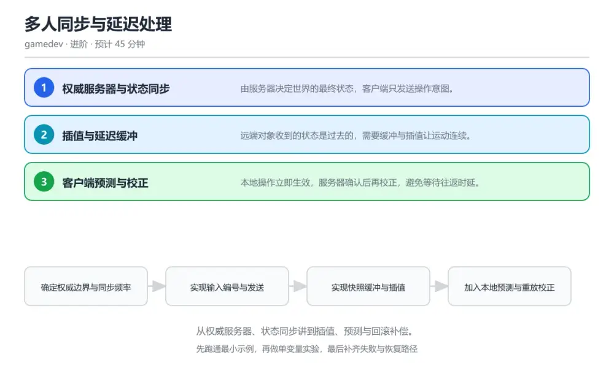
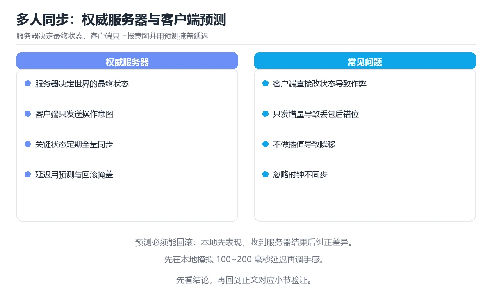

# 多人同步与延迟处理

> 内容更新时间：2026-10-06 · 学习阶段：进阶 · 预计用时：40 分钟

分类：gamedev。关键词：权威服务器、状态同步、客户端预测、插值、回滚。从权威服务器、状态同步讲到插值、预测与回滚补偿。



## 本节知识框架

**课程定位**：所属分类 `gamedev`（图形与游戏开发），课程主题 `多人同步与延迟处理`，学习阶段 进阶，建议用时 40 分钟。

本课主线：从权威服务器、状态同步讲到插值、预测与回滚补偿。

**学完本课应当能够**
- 说清 `权威服务器` 与 `快照` 的含义与区别，并各举一个正例和一个反例。
- 用本课示例验证 `插值` 的行为，记录输入、输出与失败条件。
- 遇到「远端角色移动一顿一顿」这类问题时，能说出触发条件与修复顺序。

### 从概念到验证的学习链条

1. `权威服务器`：先掌握 由服务器决定最终状态的架构模型，再用它解释 `快照` 为什么会出现。
2. `快照`：先掌握 某一时刻的世界状态数据，再用它解释 `插值` 为什么会出现。
3. `插值`：先掌握 在两个快照之间生成中间状态使运动平滑，再用它解释 `客户端预测` 为什么会出现。
4. `客户端预测`：先掌握 本地先执行操作，之后再与服务器校正，再用它解释 `重放` 为什么会出现。
5. `重放`：先掌握 用未确认输入在权威状态上重新模拟的过程，再用它解释 本课示例的观察结果 为什么会出现。

**先修与衔接**：本课是「图形与游戏开发」分类的第 7 课。当前没有登记显式先修或后续课程；课程主线是从权威服务器、状态同步讲到插值、预测与回滚补偿。学完后按 `gamedev` 分类顺序继续。

### 完成判据

- **定义关**：不看正文也能说明 `权威服务器` 是 由服务器决定最终状态的架构模型，并指出一个反例。
- **机制关**：能按“输入 → 转换 → 输出 → 验证”复述 `多人同步与延迟处理`，而不是只背结论。
- **示例关**：能运行或推演 `多人同步与延迟处理` 的 `text` 示例，并说明一个真实出现的标识符或字面量。
- **证据关**：能从 `多人同步与延迟处理` 的示例写出一个输入、处理、输出三元组，并说明它支持或反驳了本课的哪一条结论。
- **排错关**：能复现 远端角色移动一顿一顿，记录现象并按 保留快照缓冲并在相邻快照之间插值，用缓冲吸收抖动与丢包 修复。
- **迁移关**：能把 `权威服务器`、`状态同步`、`客户端预测`、`插值` 放进一个与 `多人同步与延迟处理` 不同的项目场景，并保持输入与验证条件可追踪。
- **复盘关**：学完 `多人同步与延迟处理` 后，用一句话写下仍然不确定的结论，并列出下一次验证需要的输入、环境和成功判据。

### 复习清单

- [ ] 能不看正文复述本课核心术语，并指出一个边界或反例。
- [ ] 能运行或推演本课示例，记录输入、输出与失败现象。
- [ ] 能完成一次自测，并把错题对照错误表定位原因。

**本课配图**



## 核心概念定义

| 术语 | 操作性定义 | 常见边界与风险 |
| --- | --- | --- |
| 权威服务器 | 由服务器决定最终状态的架构模型。 | 缓存与状态残留会让结果过期，先明确失效策略再判断正确性。 |
| 快照 | 某一时刻的世界状态数据。 | 易错：收到快照直接设置位置，没有插值缓冲；正确做法是保留快照缓冲并在相邻快照之间插值，用缓冲吸收抖动与丢包。 |
| 插值 | 在两个快照之间生成中间状态使运动平滑。 | 易错：收到快照直接设置位置，没有插值缓冲；正确做法是保留快照缓冲并在相邻快照之间插值，用缓冲吸收抖动与丢包。 |
| 客户端预测 | 本地先执行操作，之后再与服务器校正。 | 只在「本地先执行操作，之后再与服务器校正」这一前提下成立，换输入或换环境要重新验证。 |
| 重放 | 用未确认输入在权威状态上重新模拟的过程。 | 易错：等待服务器确认后才播放动作；正确做法是本地立即预测执行并把输入入队，收到服务器状态后重放未确认输入校正。 |

## 原理与运行机制

### 机制总览

**教材衔接：核心知识**

### 1. 权威服务器与状态同步

由服务器决定世界的最终状态，客户端只发送操作意图。

客户端上传输入，服务器按固定步长模拟并通过快照或差量广播状态，客户端据此渲染。

在多人同步与延迟处理里可以这样验证：在本课示例里让两个客户端同时移动，观察服务器如何裁决冲突并广播一致结果。

边界：把关键判定放在客户端，作弊者可以直接修改本地状态，其他人看到的却是伪造结果。

工程视角：伤害、掉落等关键判定只在服务器执行，客户端仅做表现层预测。

### 2. 插值与延迟缓冲

远端对象收到的状态是过去的，需要缓冲与插值让运动连续。

客户端保留一小段快照缓冲区，渲染时在相邻两个快照之间插值，用缓冲长度吸收抖动与丢包。

在多人同步与延迟处理里可以这样验证：在本课示例里调节缓冲长度，对比网络抖动下角色移动的平滑度与延迟。

边界：缓冲区过短会出现抖动与瞬移，过长会让操作反馈明显滞后。

工程视角：把缓冲长度与丢包率挂钩并做成可观测指标，异常升高时提示网络质量。

### 3. 客户端预测与校正

本地操作立即生效，服务器确认后再校正，避免等待往返时延。

输入带序号并保存历史，服务器返回已处理的序号，客户端用服务器状态重放未确认输入完成校正。

在多人同步与延迟处理里可以这样验证：在本课示例里人为加入延迟，观察射门动作先本地播放再被服务器校正的过程。

边界：预测与服务器规则不一致时会出现明显回弹，规则差异必须收敛到同一套逻辑。

工程视角：客户端与服务器共用同一份移动逻辑代码，并把校正幅度作为质量指标监控。

**教材衔接：关键流程**

```text
确定权威边界与同步频率 → 实现输入编号与发送 → 实现快照缓冲与插值 → 加入本地预测与重放校正 → 用延迟与丢包模拟验证表现
```

1. 确定权威边界与同步频率
2. 实现输入编号与发送
3. 实现快照缓冲与插值
4. 加入本地预测与重放校正
5. 用延迟与丢包模拟验证表现

### 机制拆解：每一步的输入、动作与输出

#### 1. `权威服务器`
- 输入：`权威服务器`；本步把 由服务器决定最终状态的架构模型 当作判断规则。
- 动作：围绕 `权威服务器` 保留中间状态，并记录它与 `快照` 的对应关系。
- 输出：`快照`，它可以被下一段代码、测试或记录继续使用。
- `权威服务器` 的失败条件：缓存与状态残留会让结果过期，先明确失效策略再判断正确性。

#### 2. `快照`
- 输入：`权威服务器`；本步把 某一时刻的世界状态数据 当作判断规则。
- 动作：围绕 `快照` 保留中间状态，并记录它与 `插值` 的对应关系。
- 输出：`插值`，它可以被下一段代码、测试或记录继续使用。
- `快照` 的失败条件：当远端角色移动一顿一顿时，会出现收到快照直接设置位置，没有插值缓冲。

#### 3. `插值`
- 输入：`快照`；本步把 在两个快照之间生成中间状态使运动平滑 当作判断规则。
- 动作：围绕 `插值` 保留中间状态，并记录它与 `客户端预测` 的对应关系。
- 输出：`客户端预测`，它可以被下一段代码、测试或记录继续使用。
- `插值` 的失败条件：当远端角色移动一顿一顿时，会出现收到快照直接设置位置，没有插值缓冲。

#### 4. `客户端预测`
- 输入：`插值`；本步把 本地先执行操作，之后再与服务器校正 当作判断规则。
- 动作：围绕 `客户端预测` 保留中间状态，并记录它与 `重放` 的对应关系。
- 输出：`重放`，它可以被下一段代码、测试或记录继续使用。
- `客户端预测` 的失败条件：只在「本地先执行操作，之后再与服务器校正」这一前提下成立，换输入或换环境要重新验证。

#### 5. `重放`
- 输入：`客户端预测`；本步把 用未确认输入在权威状态上重新模拟的过程 当作判断规则。
- 动作：围绕 `重放` 保留中间状态，并记录它与 `本课示例的最终结果` 的对应关系。
- 输出：`本课示例的最终结果`，它可以被下一段代码、测试或记录继续使用。
- `重放` 的失败条件：当本地操作延迟明显时，会出现等待服务器确认后才播放动作。

### 复现实验记录

- 环境：`多人同步与延迟处理` 使用 `text` 示例，固定 `权威服务器`、`状态同步`、`客户端预测`、`插值` 作为第一组条件。
- 首轮输入：从示例中的第一个输入开始，预测 `权威服务器` 会怎样变化。
- 基线观察：记录命令、输入、输出和错误原文，不用截图代替可复制的文本。
- 单变量修改：只改变 `权威服务器`，观察 `重放` 是否仍满足定义。
- 失败注入：复现 远端角色移动一顿一顿，确认现象是 收到快照直接设置位置，没有插值缓冲。
- 记录结论：把“修改前、修改后、预期变化、实际变化”写成四列表，这样复盘 `多人同步与延迟处理` 时才能区分概念错误与实现错误。

## 典型应用场景

**教材衔接：深度拓展与实战**

### 机制拆解 1：权威服务器与状态同步

客户端上传输入，服务器按固定步长模拟并通过快照或差量广播状态，客户端据此渲染。

落地时先确认前提：把关键判定放在客户端，作弊者可以直接修改本地状态，其他人看到的却是伪造结果。再把结论写进检查表，让下一位同学可以按同样的输入复现。

工程做法：伤害、掉落等关键判定只在服务器执行，客户端仅做表现层预测。

### 机制拆解 2：插值与延迟缓冲

客户端保留一小段快照缓冲区，渲染时在相邻两个快照之间插值，用缓冲长度吸收抖动与丢包。

落地时先确认前提：缓冲区过短会出现抖动与瞬移，过长会让操作反馈明显滞后。再把结论写进检查表，让下一位同学可以按同样的输入复现。

工程做法：把缓冲长度与丢包率挂钩并做成可观测指标，异常升高时提示网络质量。

### 机制拆解 3：客户端预测与校正

输入带序号并保存历史，服务器返回已处理的序号，客户端用服务器状态重放未确认输入完成校正。

落地时先确认前提：预测与服务器规则不一致时会出现明显回弹，规则差异必须收敛到同一套逻辑。再把结论写进检查表，让下一位同学可以按同样的输入复现。

工程做法：客户端与服务器共用同一份移动逻辑代码，并把校正幅度作为质量指标监控。

### 机制对照表

| 概念 | 解决什么问题 | 关键前提 | 失败信号 |
| --- | --- | --- | --- |
| 权威服务器与状态同步 | 由服务器决定世界的最终状态，客户端只发送操作意图。 | 把关键判定放在客户端，作弊者可以直接修改本地状态，其他人看到的却是伪造结 | 伤害、掉落等关键判定只在服务器执行，客户端仅做表现层预测。 |
| 插值与延迟缓冲 | 远端对象收到的状态是过去的，需要缓冲与插值让运动连续。 | 缓冲区过短会出现抖动与瞬移，过长会让操作反馈明显滞后。 | 把缓冲长度与丢包率挂钩并做成可观测指标，异常升高时提示网络质量。 |
| 客户端预测与校正 | 本地操作立即生效，服务器确认后再校正，避免等待往返时延。 | 预测与服务器规则不一致时会出现明显回弹，规则差异必须收敛到同一套逻辑。 | 客户端与服务器共用同一份移动逻辑代码，并把校正幅度作为质量指标监控。 |

### 自测问答

**问 1**：关键判定放在服务器执行的核心原因是？

**答**：防止客户端篡改结果，并保证所有玩家看到一致状态。客户端环境不可信，只有服务器裁决才能保证一致性并抵御作弊，客户端负责表现与预测。 正确选项「防止客户端篡改结果，并保证所有玩家看到一致状态」对应《多人同步与延迟处理》的要点「权威服务器与状态同步」：由服务器决定世界的最终状态，客户端只发送操作意图。判断「权威服务器与状态同步」时先确认前提是否成立，再回到《多人同步与延迟处理》的示例核对一次；把别的语言或框架的默认做法直接搬到权威服务器与状态同步上，往往会在本课的边界条件里失效。

**问 2**：快照缓冲过短会带来什么现象？

**答**：远端对象抖动甚至瞬移。缓冲用于吸收抖动与丢包，过短时可用快照不足，插值无法平滑，就会出现抖动与瞬移。 正确选项「远端对象抖动甚至瞬移」对应《多人同步与延迟处理》的要点「插值与延迟缓冲」：远端对象收到的状态是过去的，需要缓冲与插值让运动连续。判断「插值与延迟缓冲」时先确认前提是否成立，再回到《多人同步与延迟处理》的示例核对一次；借鉴相邻主题的经验之前，先核对插值与延迟缓冲的前提是否成立。

**问 3**：实现预测校正闭环需要哪些要素？（多选）

**答**：输入编号；未确认输入的历史记录；服务器返回已处理序号。编号、历史与服务器确认序号共同支撑重放；规则分叉会让预测与权威结果始终对不上。 正确选项「输入编号；未确认输入的历史记录；服务器返回已处理序号」对应《多人同步与延迟处理》的要点「客户端预测与校正」：本地操作立即生效，服务器确认后再校正，避免等待往返时延。判断「客户端预测与校正」时先确认前提是否成立，再回到《多人同步与延迟处理》的示例核对一次；记住客户端预测与校正的结论之外还要记住适用条件，换一个输入往往就不成立了。

**问 4**：请按一次带预测的操作顺序排列。

**答**：客户端采集输入并编号。本地先给即时反馈，服务器模拟后返回权威状态，客户端重放未确认输入把预测收敛到权威结果。 正确选项「客户端采集输入并编号；本地立即预测执行；发送输入到服务器；服务器模拟并广播状态；客户端重放未确认输入完成校正」对应《多人同步与延迟处理》的要点「权威服务器与状态同步」：由服务器决定世界的最终状态，客户端只发送操作意图。判断「权威服务器与状态同步」时先确认前提是否成立，再回到《多人同步与延迟处理》的示例核对一次；干扰项常常是相邻主题里成立的结论，只有按权威服务器与状态同步的输入与约束判断才能排除。

**问 5**：阅读这段校正代码，会带来什么问题？

**答**：校正时丢弃了所有未确认输入，玩家会被拉回过去的位置。清空未确认输入后没有重放，本地位置直接退回服务器快照时刻，玩家会看到明显回退甚至来回拉扯。 正确选项「校正时丢弃了所有未确认输入，玩家会被拉回过去的位置」对应《多人同步与延迟处理》的要点「插值与延迟缓冲」：远端对象收到的状态是过去的，需要缓冲与插值让运动连续。判断「插值与延迟缓冲」时先确认前提是否成立，再回到《多人同步与延迟处理》的示例核对一次；把插值与延迟缓冲的做法换到别的约束下未必成立，先确认边界再决定答案。


### 工程检查表

- [ ] 确定权威边界与同步频率
- [ ] 实现输入编号与发送
- [ ] 实现快照缓冲与插值
- [ ] 加入本地预测与重放校正
- [ ] 用延迟与丢包模拟验证表现
- [ ] 【权威服务器与状态同步】伤害、掉落等关键判定只在服务器执行，客户端仅做表现层预测。
- [ ] 【插值与延迟缓冲】把缓冲长度与丢包率挂钩并做成可观测指标，异常升高时提示网络质量。
- [ ] 【客户端预测与校正】客户端与服务器共用同一份移动逻辑代码，并把校正幅度作为质量指标监控。


### 结论与下一步

- **远端角色移动一顿一顿**：典型现象是收到快照直接设置位置，没有插值缓冲；正确做法是保留快照缓冲并在相邻快照之间插值，用缓冲吸收抖动与丢包。
- **本地操作延迟明显**：典型现象是等待服务器确认后才播放动作；正确做法是本地立即预测执行并把输入入队，收到服务器状态后重放未确认输入校正。
- **客户端与服务器状态长期漂移**：典型现象是客户端与服务器使用两套不同的移动规则；正确做法是共用同一份固定步长逻辑代码，服务器为权威并对差异做校正与监控。

### 最小验证场景

- 准备：保留 `text` 示例的原始输入，先记录 `多人同步与延迟处理` 的基线输出和完整运行命令。
- 判定：新结果与 `多人同步与延迟处理` 的基线不同不等于错误；只有当差异破坏了 `权威服务器` 的定义或错误表中的约束，才判定为失败。

### 选择与边界

- 使用 `权威服务器` 时，先满足它的定义：由服务器决定最终状态的架构模型；缓存与状态残留会让结果过期，先明确失效策略再判断正确性。
- 使用 `快照` 时，先满足它的定义：某一时刻的世界状态数据；易错：收到快照直接设置位置，没有插值缓冲；正确做法是保留快照缓冲并在相邻快照之间插值，用缓冲吸收抖动与丢包。
- 使用 `插值` 时，先满足它的定义：在两个快照之间生成中间状态使运动平滑；易错：收到快照直接设置位置，没有插值缓冲；正确做法是保留快照缓冲并在相邻快照之间插值，用缓冲吸收抖动与丢包。
- 使用 `客户端预测` 时，先满足它的定义：本地先执行操作，之后再与服务器校正；只在「本地先执行操作，之后再与服务器校正」这一前提下成立，换输入或换环境要重新验证。
- 使用 `重放` 时，先满足它的定义：用未确认输入在权威状态上重新模拟的过程；易错：等待服务器确认后才播放动作；正确做法是本地立即预测执行并把输入入队，收到服务器状态后重放未确认输入校正。

## 代码/协议/SQL 示例

### 最小可验证示例

```text
确定权威边界与同步频率 → 实现输入编号与发送 → 实现快照缓冲与插值 → 加入本地预测与重放校正 → 用延迟与丢包模拟验证表现
```

**教材衔接：原文最小示例**

```text
确定权威边界与同步频率 → 实现输入编号与发送 → 实现快照缓冲与插值 → 加入本地预测与重放校正 → 用延迟与丢包模拟验证表现
```

```csharp
// 客户端预测与校正：保存未确认输入，收到服务器状态后重放
struct InputFrame { public int Seq; public float MoveX; public float Jump; }

void OnServerState(PlayerState server, int lastAckedSeq) {
    // 1. 用服务器权威状态作为起点
    var state = server;

    // 2. 丢弃已被服务器处理的输入
    pending.RemoveAll(i => i.Seq <= lastAckedSeq);

    // 3. 重放尚未确认的输入，得到当前应显示的位置
    foreach (var input in pending) {
        state = Simulate(state, input, FixedDelta);
    }

    // 4. 误差小就平滑收敛，误差大直接对齐，避免长期漂移
    float error = Vector3.Distance(local.Position, state.Position);
    if (error < 0.1f) local.SmoothTo(state, 0.15f);
    else { local.SnapTo(state); Debug.Log($"correct {error:F2} m, replay {pending.Count} inputs"); }
}
```

### 示例精读：先找证据，再改一个条件

- 在 `多人同步与延迟处理` 中与 `权威服务器` 对照：示例必须能支持 由服务器决定最终状态的架构模型，否则说明这一段还缺少实现或验证步骤。
- 在 `多人同步与延迟处理` 中与 `快照` 对照：示例必须能支持 某一时刻的世界状态数据，否则说明这一段还缺少实现或验证步骤。
- 在 `多人同步与延迟处理` 中与 `插值` 对照：示例必须能支持 在两个快照之间生成中间状态使运动平滑，否则说明这一段还缺少实现或验证步骤。
- 在 `多人同步与延迟处理` 中与 `客户端预测` 对照：示例必须能支持 本地先执行操作，之后再与服务器校正，否则说明这一段还缺少实现或验证步骤。
- `多人同步与延迟处理` 的示例没有抽取到函数调用或字面量；按行记录输入、控制流和输出，避免只背代码外形。

## 时间/空间复杂度或性能分析

**性能关注点（多人同步与延迟处理）**：帧预算决定体验：记录帧率与帧时间分布、峰值内存与加载耗时，低端机型要单独跑一遍。

**本课特有开销（多人同步与延迟处理 · 权威服务器）**：重试与超时会成倍放大尾延迟，记录 P99 而不是平均值。

**测量方法**：以 `多人同步与延迟处理` 的 `权威服务器` 场景为对象，固定输入跑一遍记录基线，再把规模或并发度提高一个数量级复测；两次结果的差值与波动范围才是结论依据。

### 需要控制的变量与记录项

- `多人同步与延迟处理` 的 `权威服务器`：固定它的版本、输入范围和资源上限，分别记录速度、内存与失败率的变化。
- `多人同步与延迟处理` 的 `状态同步`：固定它的版本、输入范围和资源上限，分别记录速度、内存与失败率的变化。
- `多人同步与延迟处理` 的 `客户端预测`：固定它的版本、输入范围和资源上限，分别记录速度、内存与失败率的变化。
- `多人同步与延迟处理` 的 `插值`：固定它的版本、输入范围和资源上限，分别记录速度、内存与失败率的变化。
- `多人同步与延迟处理` 的 `回滚`：固定它的版本、输入范围和资源上限，分别记录速度、内存与失败率的变化。
- `多人同步与延迟处理` 中 `权威服务器` 的边界：缓存与状态残留会让结果过期，先明确失效策略再判断正确性。达到边界时不要外推，必须重新测量。
- `多人同步与延迟处理` 中 `快照` 的边界：易错：收到快照直接设置位置，没有插值缓冲；正确做法是保留快照缓冲并在相邻快照之间插值，用缓冲吸收抖动与丢包。达到边界时不要外推，必须重新测量。
- `多人同步与延迟处理` 中 `插值` 的边界：易错：收到快照直接设置位置，没有插值缓冲；正确做法是保留快照缓冲并在相邻快照之间插值，用缓冲吸收抖动与丢包。达到边界时不要外推，必须重新测量。
- `多人同步与延迟处理` 中 `客户端预测` 的边界：只在「本地先执行操作，之后再与服务器校正」这一前提下成立，换输入或换环境要重新验证。达到边界时不要外推，必须重新测量。
- `多人同步与延迟处理` 中 `重放` 的边界：易错：等待服务器确认后才播放动作；正确做法是本地立即预测执行并把输入入队，收到服务器状态后重放未确认输入校正。达到边界时不要外推，必须重新测量。

## 常见误区与易错点

| 容易写错的做法 | 实际现象 | 原因与正确做法 |
| --- | --- | --- |
| 远端角色移动一顿一顿 | 收到快照直接设置位置，没有插值缓冲。 | 保留快照缓冲并在相邻快照之间插值，用缓冲吸收抖动与丢包。 |
| 本地操作延迟明显 | 等待服务器确认后才播放动作。 | 本地立即预测执行并把输入入队，收到服务器状态后重放未确认输入校正。 |
| 客户端与服务器状态长期漂移 | 客户端与服务器使用两套不同的移动规则。 | 共用同一份固定步长逻辑代码，服务器为权威并对差异做校正与监控。 |

### 现场 1：远端角色移动一顿一顿

**症状**：收到快照直接设置位置，没有插值缓冲。

**根因与修复**：保留快照缓冲并在相邻快照之间插值，用缓冲吸收抖动与丢包。

**自检**：在本课示例里复现「远端角色移动一顿一顿」，改成保留快照缓冲并在相邻快照之间插值，用缓冲吸收抖动与丢包后重跑；如果症状消失且失败路径按预期变化，说明定位正确。

### 现场 2：本地操作延迟明显

**症状**：等待服务器确认后才播放动作。

**根因与修复**：本地立即预测执行并把输入入队，收到服务器状态后重放未确认输入校正。

**自检**：在本课示例里复现「本地操作延迟明显」，改成本地立即预测执行并把输入入队，收到服务器状态后重放未确认输入校正后重跑；如果症状消失且失败路径按预期变化，说明定位正确。

### 现场 3：客户端与服务器状态长期漂移

**症状**：客户端与服务器使用两套不同的移动规则。

**根因与修复**：共用同一份固定步长逻辑代码，服务器为权威并对差异做校正与监控。

**自检**：在本课示例里复现「客户端与服务器状态长期漂移」，改成共用同一份固定步长逻辑代码，服务器为权威并对差异做校正与监控后重跑；如果症状消失且失败路径按预期变化，说明定位正确。

## 与其他知识点的关系

**教材衔接：复习与迁移**


### 迁移练习

- **术语归属**：`权威服务器`、`快照`、`插值` 的定义以本课「核心概念定义」为准，换到其他课程时先确认定义是否被改写。
- 同一分类的《游戏循环与帧时间》也涉及 `插值`；两课衔接时先确认这个术语的定义是否一致。

### 容易混淆的相邻概念

- `权威服务器` 与 `快照`：前者强调 由服务器决定最终状态的架构模型；后者强调 某一时刻的世界状态数据。判断时分别检查两条定义的适用范围，不要只看名称相似就互换。
- `快照` 与 `插值`：前者强调 某一时刻的世界状态数据；后者强调 在两个快照之间生成中间状态使运动平滑。判断时分别检查两条定义的适用范围，不要只看名称相似就互换。
- `插值` 与 `客户端预测`：前者强调 在两个快照之间生成中间状态使运动平滑；后者强调 本地先执行操作，之后再与服务器校正。判断时分别检查两条定义的适用范围，不要只看名称相似就互换。
- `客户端预测` 与 `重放`：前者强调 本地先执行操作，之后再与服务器校正；后者强调 用未确认输入在权威状态上重新模拟的过程。判断时分别检查两条定义的适用范围，不要只看名称相似就互换。

## 自测题与参考答案

> 先独立作答，再对照参考答案；答案都能在本课正文、术语表或错误表里找到依据。

### 自测 1（概念复述）

不看正文，写出 `权威服务器` 的操作性定义，并说明它与 `快照` 的区别。

**参考答案**：由服务器决定最终状态的架构模型。

`快照` 的定位是：某一时刻的世界状态数据；两者的差别要从适用对象与失败模式上说明。

### 自测 2（排错）

本课错误表记录了「远端角色移动一顿一顿」这类做法。请写出它会出现的现象、根因，以及修复顺序。

**参考答案**：现象是收到快照直接设置位置，没有插值缓冲；正确做法是保留快照缓冲并在相邻快照之间插值，用缓冲吸收抖动与丢包。修复时先复现现象并保留证据，再改动一处假设重跑，确认现象消失。

### 自测 3（动手验证）

运行本课的 `text` 示例，改动其中一个输入后重新运行，记录输出与错误信息。

**参考答案**：正常输入下 `text` 示例应当复现正文给出的结果；改动输入后，如果结果改变或报错，先核对它是否满足 `多人同步与延迟处理` 中`权威服务器` 的适用范围，再检查错误表里是否有同类现象。

### 自测 4（代码阅读）

阅读本课开头的 `text` 示例，说明它体现了`权威服务器` 的哪一条性质，并指出改动哪个输入会让这条性质不再成立。

**参考答案**：`权威服务器` 的定义是 由服务器决定最终状态的架构模型，示例正是在实现这条定义。改动与 `权威服务器` 有关的一个输入后，如果结果不再符合 `多人同步与延迟处理` 的正文描述，就说明该性质只在当前前提成立。

### 自测 5（迁移）

把 `多人同步与延迟处理` 的方法迁移到自己的项目：围绕 `权威服务器` 写出一个与错误表同类的风险点，并说明触发条件和检验方式。

**参考答案**：例如「客户端与服务器状态长期漂移」，它会导致客户端与服务器使用两套不同的移动规则；检验方式是按共用同一份固定步长逻辑代码，服务器为权威并对差异做校正与监控改一处再复现，确认现象消失且没有引入新的失败分支。

### 自测 6（对比）

用一个表格对比 `权威服务器` 与 `快照`：各写一行适用场景、一行失败表现。

**参考答案**：`权威服务器` 的定义是由服务器决定最终状态的架构模型；`快照` 的定义是某一时刻的世界状态数据。两者的失败表现分别对应本课错误表里与本术语相关的行。

### 自测 7（排错顺序）

面对「远端角色移动一顿一顿」引发的问题，请把“复现 收到快照直接设置位置，没有插值缓冲 → 保留证据 → 保留快照缓冲并在相邻快照之间插值，用缓冲吸收抖动与丢包 → 回归验证”四步写成可执行的检查清单。

**参考答案**：第一步按收到快照直接设置位置，没有插值缓冲复现；第二步记录输入、版本与完整报错；第三步按保留快照缓冲并在相邻快照之间插值，用缓冲吸收抖动与丢包只改一处；第四步重跑并确认失败路径也按预期变化。

### 自测 8（边界判断）

针对 `重放`，分别写出“可以使用”的条件和“结论不再成立”的条件。

**参考答案**：易错：等待服务器确认后才播放动作；正确做法是本地立即预测执行并把输入入队，收到服务器状态后重放未确认输入校正。 同时要把 `重放` 的定义 用未确认输入在权威状态上重新模拟的过程 与实际输入逐项对照。

### 自测 9（机制重建）

不看正文，按输入、转换、输出、验证四段重建 `权威服务器` → `快照` → `插值` → `客户端预测` 的作用链。

**参考答案**：起点是 `权威服务器` 的定义 由服务器决定最终状态的架构模型；中间每一步都保留可观察状态；终点由 `重放` 检查，失败时回到错误表定位第一个偏离定义的步骤。

### 自测 10（综合排错）

在 `多人同步与延迟处理` 中，现象是 客户端与服务器使用两套不同的移动规则。请围绕 客户端与服务器状态长期漂移 写出最小复现、关键证据、修复动作和回归验证，并说明为什么不能只凭一次运行下结论。

**参考答案**：先复现 客户端与服务器状态长期漂移，记录输入与完整错误；再按 共用同一份固定步长逻辑代码，服务器为权威并对差异做校正与监控 只改一处。回归时同时跑正常路径和边界路径，只有两次结果都可解释，才把修复视为完成。

### 自测 11（一分钟复述）

用每分钟约 200 字的速度复述 `多人同步与延迟处理`：先给主问题，再按顺序说出 `权威服务器`、`快照`、`插值`、`客户端预测`，最后给一个失败案例。

**自评标准**：主问题必须对应 从权威服务器、状态同步讲到插值、预测与回滚补偿；每个术语都要能接上一句定义或边界；失败案例必须写成可观察现象，不能用“可能有风险”代替证据。

## 术语速查

| 术语 | 一句话说明 |
| --- | --- |
| `权威服务器` | 由服务器决定最终状态的架构模型。 |
| `快照` | 某一时刻的世界状态数据。 |
| `插值` | 在两个快照之间生成中间状态使运动平滑。 |
| `客户端预测` | 本地先执行操作，之后再与服务器校正。 |
| `重放` | 用未确认输入在权威状态上重新模拟的过程。 |

**术语关系**：`权威服务器`（由服务器决定最终状态的架构模型） → `快照`（某一时刻的世界状态数据） → `插值`（在两个快照之间生成中间状态使运动平滑） → `客户端预测`（本地先执行操作）。

## 考点精讲

`多人同步与延迟处理` 的题库有 5 道题，下面逐题给出题干、正确项与判断依据：先自己作答，再核对正确项，最后回到正文对应小节复核。

### 考点 1：第 1 题

- **题目**：关键判定放在服务器执行的核心原因是？
- **正确项**：防止客户端篡改结果，并保证所有玩家看到一致状态
- **判断依据**：这道题检验本课主问题：从权威服务器、状态同步讲到插值、预测与回滚补偿。复习时先复述本课主问题，再举一个会让结论失效的输入。

### 考点 2：第 2 题

- **题目**：快照缓冲过短会带来什么现象？
- **正确项**：远端对象抖动甚至瞬移
- **判断依据**：这道题落在术语 `快照` 上：某一时刻的世界状态数据。复习时把 `快照` 的定义、适用边界和一个反例一起说清楚，再回到「核心概念定义」核对原文。

### 考点 3：第 3 题

- **题目**：实现预测校正闭环需要哪些要素？（多选）
- **正确项**：输入编号；未确认输入的历史记录；服务器返回已处理序号
- **判断依据**：这道题检验本课主问题：从权威服务器、状态同步讲到插值、预测与回滚补偿。复习时先复述本课主问题，再举一个会让结论失效的输入。

### 考点 4：第 4 题

- **题目**：请按一次带预测的操作顺序排列。
- **正确项**：客户端采集输入并编号 → 本地立即预测执行 → 发送输入到服务器 → 服务器模拟并广播状态 → 客户端重放未确认输入完成校正
- **判断依据**：这道题落在术语 `重放` 上：用未确认输入在权威状态上重新模拟的过程。复习时把 `重放` 的定义、适用边界和一个反例一起说清楚，再回到「核心概念定义」核对原文。

### 考点 5：第 5 题

- **题目**：阅读这段校正代码，会带来什么问题？
- **正确项**：校正时丢弃了所有未确认输入，玩家会被拉回过去的位置
- **判断依据**：这道题检验本课主问题：从权威服务器、状态同步讲到插值、预测与回滚补偿。复习时先复述本课主问题，再举一个会让结论失效的输入。

### 考点 6：`权威服务器`

- **要点**：由服务器决定最终状态的架构模型。
- **权威服务器 的边界**：缓存与状态残留会让结果过期，先明确失效策略再判断正确性。

### 考点 7：`快照`

- **要点**：某一时刻的世界状态数据。
- **快照 的边界**：易错：收到快照直接设置位置，没有插值缓冲；正确做法是保留快照缓冲并在相邻快照之间插值，用缓冲吸收抖动与丢包。

### 考点 8：`插值`

- **要点**：在两个快照之间生成中间状态使运动平滑。
- **插值 的边界**：易错：收到快照直接设置位置，没有插值缓冲；正确做法是保留快照缓冲并在相邻快照之间插值，用缓冲吸收抖动与丢包。

### 考点 9：`客户端预测`

- **要点**：本地先执行操作，之后再与服务器校正。
- **客户端预测 的边界**：只在「本地先执行操作，之后再与服务器校正」这一前提下成立，换输入或换环境要重新验证。

### 考点 10：`重放`

- **要点**：用未确认输入在权威状态上重新模拟的过程。
- **重放 的边界**：易错：等待服务器确认后才播放动作；正确做法是本地立即预测执行并把输入入队，收到服务器状态后重放未确认输入校正。

### 考点 11：排错——远端角色移动一顿一顿

- **现象**：收到快照直接设置位置，没有插值缓冲。
- **处理**：保留快照缓冲并在相邻快照之间插值，用缓冲吸收抖动与丢包。

### 考点 12：排错——本地操作延迟明显

- **现象**：等待服务器确认后才播放动作。
- **处理**：本地立即预测执行并把输入入队，收到服务器状态后重放未确认输入校正。

### 考点 13：综合辨析——`权威服务器` 与 `重放`

- **辨析点**：`权威服务器` 的定义是 由服务器决定最终状态的架构模型；`重放` 的定义是 用未确认输入在权威状态上重新模拟的过程。
- **答题要求**：面对 `多人同步与延迟处理` 的题目，先判断描述的是 `权威服务器` 还是 `重放`，再归到对应定义，最后写出一个会让该定义失效的边界输入。

### 考点 14：排错评分点

- **现象分**：能写出 收到快照直接设置位置，没有插值缓冲，而不是只写“程序有错”。
- **证据分**：保留触发 远端角色移动一顿一顿 的输入、版本和错误原文。
- **修复分**：按 保留快照缓冲并在相邻快照之间插值，用缓冲吸收抖动与丢包 只改一处，并同时回归正常路径与边界路径。

## 内容元数据

- 内容版本：v2.0
- 最后更新：2026-10-06
- 学习阶段：进阶

| 字段 | 值 |
| --- | --- |
| 课程 ID | `gamedev_multiplayer_sync` |
| 所属分类 | `gamedev` |
| 难度 | 进阶 |
| 预计用时 | 45 分钟 |
| 关键词 | 权威服务器、状态同步、客户端预测、插值、回滚 |
| 配图 | `images/lesson_gamedev_multiplayer_sync.webp` |
| 参考资料 | 2 条 |
| 内容更新时间 | 2026-10-06 |

## 参考资料与复核

- 来源性质：官方文档、标准或权威教材；本课核对关键词：权威服务器、状态同步、客户端预测、插值、回滚。
- 最后复核：2026-10-04
- 下次复核：2027-04-24
- 复核范围：版本兼容、API 行为与工程实践

下面列出的资料用于核对本课结论，复习时可以对照阅读：
- [Valve 开发者社区：Source 多人网络](https://developer.valvesoftware.com/wiki/Source_Multiplayer_Networking)
- [Gabriel Gambetta：快节奏多人游戏网络](https://www.gabrielgambetta.com/client-server-game-architecture.html)

| [本课术语索引：多人同步与延迟处理](#核心概念定义) | 按本课输入、术语边界和错误表现逐项核对 |
> 复核提示：《多人同步与延迟处理》的结论如与资料冲突，以资料中的规范文本为准，并在笔记里记录差异与日期。