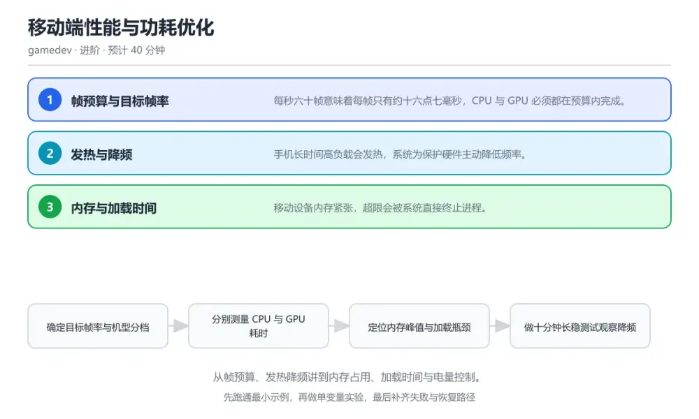
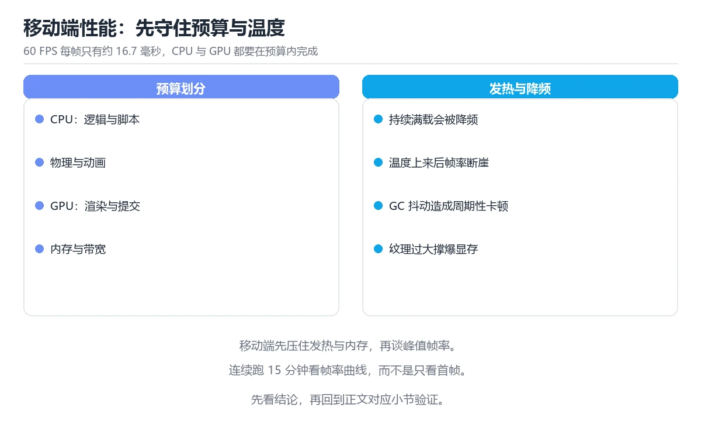

# 移动端性能与功耗优化

> 内容更新时间：2026-10-06 · 学习阶段：进阶 · 预计用时：35 分钟

分类：gamedev。关键词：帧预算、发热降频、内存、加载时间、功耗。从帧预算、发热降频讲到内存占用、加载时间与电量控制。



## 本节知识框架

**课程定位**：所属分类 `gamedev`（图形与游戏开发），课程主题 `移动端性能与功耗优化`，学习阶段 进阶，建议用时 40 分钟。

本课主线：从帧预算、发热降频讲到内存占用、加载时间与电量控制。

**学完本课应当能够**
- 说清 `帧预算` 与 `降频` 的含义与区别，并各举一个正例和一个反例。
- 用本课示例验证 `长稳测试` 的行为，记录输入、输出与失败条件。
- 遇到「只看帧率不看功耗与温度」这类问题时，能说出触发条件与修复顺序。

### 从概念到验证的学习链条

1. `帧预算`：先掌握 每帧允许消耗的最长时间，由目标帧率决定，再用它解释 `降频` 为什么会出现。
2. `降频`：先掌握 设备过热后主动降低频率以保护硬件，再用它解释 `长稳测试` 为什么会出现。
3. `长稳测试`：先掌握 长时间连续运行观察性能稳定性的测试，再用它解释 `内存峰值` 为什么会出现。
4. `内存峰值`：先掌握 运行过程中占用内存的最大值，再用它解释 `机型分档` 为什么会出现。
5. `机型分档`：先掌握 按硬件能力分级配置画质与资源规格，再用它解释 `目标帧率` 为什么会出现。
6. `目标帧率`：先掌握 希望画面每秒更新的次数：按机型分档设定目标帧率与画质，最低档机型作为性能验收基线，再用它解释 本课示例的观察结果 为什么会出现。

**先修与衔接**：本课是「图形与游戏开发」分类的第 8 课。当前没有登记显式先修或后续课程；课程主线是从帧预算、发热降频讲到内存占用、加载时间与电量控制。学完后按 `gamedev` 分类顺序继续。

### 完成判据

- **定义关**：不看正文也能说明 `帧预算` 是 每帧允许消耗的最长时间，由目标帧率决定，并指出一个反例。
- **机制关**：能按“输入 → 转换 → 输出 → 验证”复述 `移动端性能与功耗优化`，而不是只背结论。
- **示例关**：能运行或推演 `移动端性能与功耗优化` 的 `text` 示例，并说明一个真实出现的标识符或字面量。
- **证据关**：能从 `移动端性能与功耗优化` 的示例写出一个输入、处理、输出三元组，并说明它支持或反驳了本课的哪一条结论。
- **排错关**：能复现 只看帧率不看功耗与温度，记录现象并按 同时监控帧时间、占用率与温度 修复。
- **迁移关**：能把 `帧预算`、`发热降频`、`内存`、`加载时间` 放进一个与 `移动端性能与功耗优化` 不同的项目场景，并保持输入与验证条件可追踪。
- **复盘关**：学完 `移动端性能与功耗优化` 后，用一句话写下仍然不确定的结论，并列出下一次验证需要的输入、环境和成功判据。

### 复习清单

- [ ] 能不看正文复述本课核心术语，并指出一个边界或反例。
- [ ] 能运行或推演本课示例，记录输入、输出与失败现象。
- [ ] 能完成一次自测，并把错题对照错误表定位原因。

**本课配图**



## 核心概念定义

| 术语 | 操作性定义 | 常见边界与风险 |
| --- | --- | --- |
| 帧预算 | 每帧允许消耗的最长时间，由目标帧率决定。 | 只在「每帧允许消耗的最长时间，由目标帧率决定」这一前提下成立，换输入或换环境要重新验证。 |
| 降频 | 设备过热后主动降低频率以保护硬件。 | 易错：手机发热降频，帧率随后下滑；正确做法是同时监控帧时间、占用率与温度。 |
| 长稳测试 | 长时间连续运行观察性能稳定性的测试。 | 结论随输入规模变化，小规模成立不代表大规模成立，需要重新测量。 |
| 内存峰值 | 运行过程中占用内存的最大值。 | 越界、悬垂引用与释放顺序会破坏结论，必须在边界输入下复验。 |
| 机型分档 | 按硬件能力分级配置画质与资源规格。 | 只在「按硬件能力分级配置画质与资源规格」这一前提下成立，换输入或换环境要重新验证。 |
| 目标帧率 | 希望画面每秒更新的次数：按机型分档设定目标帧率与画质，最低档机型作为性能验收基线 | 结论随输入规模变化，小规模成立不代表大规模成立，需要重新测量。 |

## 原理与运行机制

### 机制总览

**教材衔接：核心知识**

### 1. 帧预算与目标帧率

每秒六十帧意味着每帧只有约十六点七毫秒，CPU 与 GPU 必须都在预算内完成。

把一帧内的逻辑、渲染提交、物理与音频耗时分别测量，找出超支项；同一帧内 CPU 与 GPU 可以并行，但最慢的一项决定上限。

在移动端性能与功耗优化里可以这样验证：在本课示例里把目标帧率从三十提到六十，观察哪些环节最先超出预算。

边界：只在模拟器上测性能会低估真实设备差异，模拟器显卡与真机完全不同。

工程视角：按机型分档设定目标帧率与画质，最低档机型作为性能验收基线。

### 2. 发热与降频

手机长时间高负载会发热，系统为保护硬件主动降低频率。

温度上升后 CPU 与 GPU 频率被限制，性能曲线在几分钟后出现明显下降，帧率随之波动。

在移动端性能与功耗优化里可以这样验证：在本课示例里连续运行十分钟并记录帧率曲线，找出降频发生的时间点。

边界：只看开局三十秒的帧率会得到过于乐观的结论，长时间稳定性才是真实体验。

工程视角：做长稳测试并把降频后的帧率作为验收指标，必要时提供画质档位让玩家自行取舍。

### 3. 内存与加载时间

移动设备内存紧张，超限会被系统直接终止进程。

纹理、网格与音频占用峰值内存，加载时若一次性读入全部资源会出现长时间卡顿甚至闪退。

在移动端性能与功耗优化里可以这样验证：在本课示例里统计进入关卡时的内存峰值与加载耗时，对比按需加载方案的差异。

边界：只优化平均内存不关注峰值，仍会在切换场景时被系统杀掉进程。

工程视角：按场景划分资源加载与释放边界，给出目标机型的峰值内存上限并纳入自动检查。

**教材衔接：关键流程**

```text
确定目标帧率与机型分档 → 分别测量 CPU 与 GPU 耗时 → 定位内存峰值与加载瓶颈 → 做十分钟长稳测试观察降频 → 把指标写入发布检查清单
```

1. 确定目标帧率与机型分档
2. 分别测量 CPU 与 GPU 耗时
3. 定位内存峰值与加载瓶颈
4. 做十分钟长稳测试观察降频
5. 把指标写入发布检查清单

### 机制拆解：每一步的输入、动作与输出

#### 1. `帧预算`
- 输入：`帧预算`；本步把 每帧允许消耗的最长时间，由目标帧率决定 当作判断规则。
- 动作：围绕 `帧预算` 保留中间状态，并记录它与 `降频` 的对应关系。
- 输出：`降频`，它可以被下一段代码、测试或记录继续使用。
- `帧预算` 的失败条件：只在「每帧允许消耗的最长时间，由目标帧率决定」这一前提下成立，换输入或换环境要重新验证。

#### 2. `降频`
- 输入：`帧预算`；本步把 设备过热后主动降低频率以保护硬件 当作判断规则。
- 动作：围绕 `降频` 保留中间状态，并记录它与 `长稳测试` 的对应关系。
- 输出：`长稳测试`，它可以被下一段代码、测试或记录继续使用。
- `降频` 的失败条件：当只看帧率不看功耗与温度时，会出现手机发热降频，帧率随后下滑。

#### 3. `长稳测试`
- 输入：`降频`；本步把 长时间连续运行观察性能稳定性的测试 当作判断规则。
- 动作：围绕 `长稳测试` 保留中间状态，并记录它与 `内存峰值` 的对应关系。
- 输出：`内存峰值`，它可以被下一段代码、测试或记录继续使用。
- `长稳测试` 的失败条件：结论随输入规模变化，小规模成立不代表大规模成立，需要重新测量。

#### 4. `内存峰值`
- 输入：`长稳测试`；本步把 运行过程中占用内存的最大值 当作判断规则。
- 动作：围绕 `内存峰值` 保留中间状态，并记录它与 `机型分档` 的对应关系。
- 输出：`机型分档`，它可以被下一段代码、测试或记录继续使用。
- `内存峰值` 的失败条件：越界、悬垂引用与释放顺序会破坏结论，必须在边界输入下复验。

#### 5. `机型分档`
- 输入：`内存峰值`；本步把 按硬件能力分级配置画质与资源规格 当作判断规则。
- 动作：围绕 `机型分档` 保留中间状态，并记录它与 `目标帧率` 的对应关系。
- 输出：`目标帧率`，它可以被下一段代码、测试或记录继续使用。
- `机型分档` 的失败条件：只在「按硬件能力分级配置画质与资源规格」这一前提下成立，换输入或换环境要重新验证。

#### 6. `目标帧率`
- 输入：`机型分档`；本步把 希望画面每秒更新的次数：按机型分档设定目标帧率与画质，最低档机型作为性能验收基线 当作判断规则。
- 动作：围绕 `目标帧率` 保留中间状态，并记录它与 `本课示例的最终结果` 的对应关系。
- 输出：`本课示例的最终结果`，它可以被下一段代码、测试或记录继续使用。
- `目标帧率` 的失败条件：结论随输入规模变化，小规模成立不代表大规模成立，需要重新测量。

### 复现实验记录

- 环境：`移动端性能与功耗优化` 使用 `text` 示例，固定 `帧预算`、`发热降频`、`内存`、`加载时间` 作为第一组条件。
- 首轮输入：从示例中的第一个输入开始，预测 `帧预算` 会怎样变化。
- 基线观察：记录命令、输入、输出和错误原文，不用截图代替可复制的文本。
- 单变量修改：只改变 `帧预算`，观察 `目标帧率` 是否仍满足定义。
- 失败注入：复现 只看帧率不看功耗与温度，确认现象是 手机发热降频，帧率随后下滑。
- 记录结论：把“修改前、修改后、预期变化、实际变化”写成四列表，这样复盘 `移动端性能与功耗优化` 时才能区分概念错误与实现错误。

## 典型应用场景

**教材衔接：深度拓展与实战**

### 机制拆解 1：帧预算与目标帧率

把一帧内的逻辑、渲染提交、物理与音频耗时分别测量，找出超支项；同一帧内 CPU 与 GPU 可以并行，但最慢的一项决定上限。

落地时先确认前提：只在模拟器上测性能会低估真实设备差异，模拟器显卡与真机完全不同。再把结论写进检查表，让下一位同学可以按同样的输入复现。

工程做法：按机型分档设定目标帧率与画质，最低档机型作为性能验收基线。

### 机制拆解 2：发热与降频

温度上升后 CPU 与 GPU 频率被限制，性能曲线在几分钟后出现明显下降，帧率随之波动。

落地时先确认前提：只看开局三十秒的帧率会得到过于乐观的结论，长时间稳定性才是真实体验。再把结论写进检查表，让下一位同学可以按同样的输入复现。

工程做法：做长稳测试并把降频后的帧率作为验收指标，必要时提供画质档位让玩家自行取舍。

### 机制拆解 3：内存与加载时间

纹理、网格与音频占用峰值内存，加载时若一次性读入全部资源会出现长时间卡顿甚至闪退。

落地时先确认前提：只优化平均内存不关注峰值，仍会在切换场景时被系统杀掉进程。再把结论写进检查表，让下一位同学可以按同样的输入复现。

工程做法：按场景划分资源加载与释放边界，给出目标机型的峰值内存上限并纳入自动检查。

### 机制对照表

| 概念 | 解决什么问题 | 关键前提 | 失败信号 |
| --- | --- | --- | --- |
| 帧预算与目标帧率 | 每秒六十帧意味着每帧只有约十六点七毫秒，CPU 与 GPU 必须都在预算内完成。 | 只在模拟器上测性能会低估真实设备差异，模拟器显卡与真机完全不同。 | 按机型分档设定目标帧率与画质，最低档机型作为性能验收基线。 |
| 发热与降频 | 手机长时间高负载会发热，系统为保护硬件主动降低频率。 | 只看开局三十秒的帧率会得到过于乐观的结论，长时间稳定性才是真实体验。 | 做长稳测试并把降频后的帧率作为验收指标，必要时提供画质档位让玩家自行取舍 |
| 内存与加载时间 | 移动设备内存紧张，超限会被系统直接终止进程。 | 只优化平均内存不关注峰值，仍会在切换场景时被系统杀掉进程。 | 按场景划分资源加载与释放边界，给出目标机型的峰值内存上限并纳入自动检查。 |

### 自测问答

**问 1**：目标六十帧时每帧的时间预算约为？

**答**：16.7 毫秒。一秒钟一千毫秒除以六十帧，得到每帧约 16.7 毫秒，逻辑与渲染合计超出该值就会掉帧。 正确选项「16.7 毫秒」对应《移动端性能与功耗优化》的要点「帧预算与目标帧率」：每秒六十帧意味着每帧只有约十六点七毫秒，CPU 与 GPU 必须都在预算内完成。判断「帧预算与目标帧率」时先确认前提是否成立，再回到《移动端性能与功耗优化》的示例核对一次；把别的语言或框架的默认做法直接搬到帧预算与目标帧率上，往往会在本课的边界条件里失效。

**问 2**：判断性能瓶颈的第一步是？

**答**：分别测量 CPU 与 GPU 各环节耗时。先测量才知道瓶颈在哪里，盲目降低画质可能优化了不相关的环节，白付代价。 正确选项「分别测量 CPU 与 GPU 各环节耗时」对应《移动端性能与功耗优化》的要点「发热与降频」：手机长时间高负载会发热，系统为保护硬件主动降低频率。判断「发热与降频」时先确认前提是否成立，再回到《移动端性能与功耗优化》的示例核对一次；借鉴相邻主题的经验之前，先核对发热与降频的前提是否成立。

**问 3**：移动端发布前应纳入检查的指标有哪些？（多选）

**答**：帧率与帧时间分布；峰值内存占用；加载耗时。帧率、内存与加载时间直接决定体验与稳定性；理论性能不能代表真机表现，必须用目标机型实测。 正确选项「帧率与帧时间分布；峰值内存占用；加载耗时」对应《移动端性能与功耗优化》的要点「内存与加载时间」：移动设备内存紧张，超限会被系统直接终止进程。判断「内存与加载时间」时先确认前提是否成立，再回到《移动端性能与功耗优化》的示例核对一次；记住内存与加载时间的结论之外还要记住适用条件，换一个输入往往就不成立了。

**问 4**：请按一次移动端性能优化的顺序排列。

**答**：确定目标帧率与机型分档。先定目标与档位，再采集基线数据定位问题，之后优化并长稳复测，最后把指标固化到发布检查里。 正确选项「确定目标帧率与机型分档；在真机上采集性能数据；定位超支环节与内存峰值；实施针对性优化；长稳复测并归档指标」对应《移动端性能与功耗优化》的要点「帧预算与目标帧率」：每秒六十帧意味着每帧只有约十六点七毫秒，CPU 与 GPU 必须都在预算内完成。判断「帧预算与目标帧率」时先确认前提是否成立，再回到《移动端性能与功耗优化》的示例核对一次；干扰项常常是相邻主题里成立的结论，只有按帧预算与目标帧率的输入与约束判断才能排除。

**问 5**：阅读这段加载代码，最可能导致什么问题？

**答**：一次性加载全部资源，进入关卡时内存峰值过高。把整关资源一次性读入会让内存峰值大幅升高，低端机在切换场景时容易被系统终止，应按需加载并释放。装包结构也影响可维护性。 正确选项「一次性加载全部资源，进入关卡时内存峰值过高」对应《移动端性能与功耗优化》的要点「发热与降频」：手机长时间高负载会发热，系统为保护硬件主动降低频率。判断「发热与降频」时先确认前提是否成立，再回到《移动端性能与功耗优化》的示例核对一次；把发热与降频的做法换到别的约束下未必成立，先确认边界再决定答案。


### 工程检查表

- [ ] 确定目标帧率与机型分档
- [ ] 分别测量 CPU 与 GPU 耗时
- [ ] 定位内存峰值与加载瓶颈
- [ ] 做十分钟长稳测试观察降频
- [ ] 把指标写入发布检查清单
- [ ] 【帧预算与目标帧率】按机型分档设定目标帧率与画质，最低档机型作为性能验收基线。
- [ ] 【发热与降频】做长稳测试并把降频后的帧率作为验收指标，必要时提供画质档位让玩家自行取舍。
- [ ] 【内存与加载时间】按场景划分资源加载与释放边界，给出目标机型的峰值内存上限并纳入自动检查。


### 结论与下一步

- **只看帧率不看功耗与温度**：典型现象是手机发热降频，帧率随后下滑；正确做法是同时监控帧时间、占用率与温度。
- **每帧分配对象**：典型现象是垃圾回收造成周期性卡顿；正确做法是复用对象与缓冲池，避免热路径分配。
- **资源规格不分档**：典型现象是低端设备显存不足直接崩溃；正确做法是按设备分档资源，控制纹理尺寸与压缩格式。

### 最小验证场景

- 准备：保留 `text` 示例的原始输入，先记录 `移动端性能与功耗优化` 的基线输出和完整运行命令。
- 判定：新结果与 `移动端性能与功耗优化` 的基线不同不等于错误；只有当差异破坏了 `帧预算` 的定义或错误表中的约束，才判定为失败。

### 选择与边界

- 使用 `帧预算` 时，先满足它的定义：每帧允许消耗的最长时间，由目标帧率决定；只在「每帧允许消耗的最长时间，由目标帧率决定」这一前提下成立，换输入或换环境要重新验证。
- 使用 `降频` 时，先满足它的定义：设备过热后主动降低频率以保护硬件；易错：手机发热降频，帧率随后下滑；正确做法是同时监控帧时间、占用率与温度。
- 使用 `长稳测试` 时，先满足它的定义：长时间连续运行观察性能稳定性的测试；结论随输入规模变化，小规模成立不代表大规模成立，需要重新测量。
- 使用 `内存峰值` 时，先满足它的定义：运行过程中占用内存的最大值；越界、悬垂引用与释放顺序会破坏结论，必须在边界输入下复验。
- 使用 `机型分档` 时，先满足它的定义：按硬件能力分级配置画质与资源规格；只在「按硬件能力分级配置画质与资源规格」这一前提下成立，换输入或换环境要重新验证。

## 代码/协议/SQL 示例

### 最小可验证示例

**教材衔接：原文最小示例**

```csharp
// 帧预算计时器：把一帧拆成逻辑、渲染与其余部分分别统计
struct FrameProfile {
    public float LogicMs;
    public float RenderMs;
    public float OtherMs;
    public float TotalMs => LogicMs + RenderMs + OtherMs;
}

void Update() {
    var sw = Stopwatch.StartNew();
    UpdateGameplay();
    profile.LogicMs = (float)sw.Elapsed.TotalMilliseconds;

    sw.Restart();
    RenderScene();
    profile.RenderMs = (float)sw.Elapsed.TotalMilliseconds;

    // 帧预算按目标帧率计算：60 帧约 16.7 ms，30 帧约 33.3 ms
    float budget = TargetFps == 60 ? 16.7f : 33.3f;
    if (profile.TotalMs > budget) {
        WarnThrottled(profile, budget);   // 记录超支帧与主要原因
    }
}

// 纹理按目标机型分档，低端机使用半分辨率
int TextureSize(Tier tier) => tier == Tier.Low ? 1024 : 2048;
```

### 示例精读：先找证据，再改一个条件

- 在 `移动端性能与功耗优化` 中与 `帧预算` 对照：示例必须能支持 每帧允许消耗的最长时间，由目标帧率决定，否则说明这一段还缺少实现或验证步骤。
- 在 `移动端性能与功耗优化` 中与 `降频` 对照：示例必须能支持 设备过热后主动降低频率以保护硬件，否则说明这一段还缺少实现或验证步骤。
- 在 `移动端性能与功耗优化` 中与 `长稳测试` 对照：示例必须能支持 长时间连续运行观察性能稳定性的测试，否则说明这一段还缺少实现或验证步骤。
- 在 `移动端性能与功耗优化` 中与 `内存峰值` 对照：示例必须能支持 运行过程中占用内存的最大值，否则说明这一段还缺少实现或验证步骤。
- `移动端性能与功耗优化` 的示例没有抽取到函数调用或字面量；按行记录输入、控制流和输出，避免只背代码外形。

## 时间/空间复杂度或性能分析

**性能关注点（移动端性能与功耗优化）**：帧预算决定体验：记录帧率与帧时间分布、峰值内存与加载耗时，低端机型要单独跑一遍。

**测量方法**：以 `移动端性能与功耗优化` 的 `帧预算` 场景为对象，固定输入跑一遍记录基线，再把规模或并发度提高一个数量级复测；两次结果的差值与波动范围才是结论依据。

### 需要控制的变量与记录项

- `移动端性能与功耗优化` 的 `帧预算`：固定它的版本、输入范围和资源上限，分别记录速度、内存与失败率的变化。
- `移动端性能与功耗优化` 的 `发热降频`：固定它的版本、输入范围和资源上限，分别记录速度、内存与失败率的变化。
- `移动端性能与功耗优化` 的 `内存`：固定它的版本、输入范围和资源上限，分别记录速度、内存与失败率的变化。
- `移动端性能与功耗优化` 的 `加载时间`：固定它的版本、输入范围和资源上限，分别记录速度、内存与失败率的变化。
- `移动端性能与功耗优化` 的 `功耗`：固定它的版本、输入范围和资源上限，分别记录速度、内存与失败率的变化。
- `移动端性能与功耗优化` 中 `帧预算` 的边界：只在「每帧允许消耗的最长时间，由目标帧率决定」这一前提下成立，换输入或换环境要重新验证。达到边界时不要外推，必须重新测量。
- `移动端性能与功耗优化` 中 `降频` 的边界：易错：手机发热降频，帧率随后下滑；正确做法是同时监控帧时间、占用率与温度。达到边界时不要外推，必须重新测量。
- `移动端性能与功耗优化` 中 `长稳测试` 的边界：结论随输入规模变化，小规模成立不代表大规模成立，需要重新测量。达到边界时不要外推，必须重新测量。
- `移动端性能与功耗优化` 中 `内存峰值` 的边界：越界、悬垂引用与释放顺序会破坏结论，必须在边界输入下复验。达到边界时不要外推，必须重新测量。
- `移动端性能与功耗优化` 中 `机型分档` 的边界：只在「按硬件能力分级配置画质与资源规格」这一前提下成立，换输入或换环境要重新验证。达到边界时不要外推，必须重新测量。

## 常见误区与易错点

| 容易写错的做法 | 实际现象 | 原因与正确做法 |
| --- | --- | --- |
| 只看帧率不看功耗与温度 | 手机发热降频，帧率随后下滑。 | 同时监控帧时间、占用率与温度。 |
| 每帧分配对象 | 垃圾回收造成周期性卡顿。 | 复用对象与缓冲池，避免热路径分配。 |
| 资源规格不分档 | 低端设备显存不足直接崩溃。 | 按设备分档资源，控制纹理尺寸与压缩格式。 |

### 现场 1：只看帧率不看功耗与温度

**症状**：手机发热降频，帧率随后下滑。

**根因与修复**：同时监控帧时间、占用率与温度。

**自检**：在本课示例里复现「只看帧率不看功耗与温度」，改成同时监控帧时间、占用率与温度后重跑；如果症状消失且失败路径按预期变化，说明定位正确。

### 现场 2：每帧分配对象

**症状**：垃圾回收造成周期性卡顿。

**根因与修复**：复用对象与缓冲池，避免热路径分配。

**自检**：在本课示例里复现「每帧分配对象」，改成复用对象与缓冲池，避免热路径分配后重跑；如果症状消失且失败路径按预期变化，说明定位正确。

### 现场 3：资源规格不分档

**症状**：低端设备显存不足直接崩溃。

**根因与修复**：按设备分档资源，控制纹理尺寸与压缩格式。

**自检**：在本课示例里复现「资源规格不分档」，改成按设备分档资源，控制纹理尺寸与压缩格式后重跑；如果症状消失且失败路径按预期变化，说明定位正确。

## 与其他知识点的关系

**教材衔接：复习与迁移**


### 迁移练习

- **术语归属**：`帧预算`、`降频`、`长稳测试` 的定义以本课「核心概念定义」为准，换到其他课程时先确认定义是否被改写。
- 同一分类的《游戏循环与帧时间》也涉及 `帧预算`；两课衔接时先确认这个术语的定义是否一致。
- 同一分类的《实体组件系统与性能剖析》也涉及 `帧预算`；两课衔接时先确认这个术语的定义是否一致。

### 容易混淆的相邻概念

- `帧预算` 与 `降频`：前者强调 每帧允许消耗的最长时间，由目标帧率决定；后者强调 设备过热后主动降低频率以保护硬件。判断时分别检查两条定义的适用范围，不要只看名称相似就互换。
- `降频` 与 `长稳测试`：前者强调 设备过热后主动降低频率以保护硬件；后者强调 长时间连续运行观察性能稳定性的测试。判断时分别检查两条定义的适用范围，不要只看名称相似就互换。
- `长稳测试` 与 `内存峰值`：前者强调 长时间连续运行观察性能稳定性的测试；后者强调 运行过程中占用内存的最大值。判断时分别检查两条定义的适用范围，不要只看名称相似就互换。
- `内存峰值` 与 `机型分档`：前者强调 运行过程中占用内存的最大值；后者强调 按硬件能力分级配置画质与资源规格。判断时分别检查两条定义的适用范围，不要只看名称相似就互换。
- `机型分档` 与 `目标帧率`：前者强调 按硬件能力分级配置画质与资源规格；后者强调 希望画面每秒更新的次数：按机型分档设定目标帧率与画质，最低档机型作为性能验收基线。判断时分别检查两条定义的适用范围，不要只看名称相似就互换。

## 自测题与参考答案

> 先独立作答，再对照参考答案；答案都能在本课正文、术语表或错误表里找到依据。

### 自测 1（概念复述）

不看正文，写出 `帧预算` 的操作性定义，并说明它与 `降频` 的区别。

**参考答案**：每帧允许消耗的最长时间，由目标帧率决定。

`降频` 的定位是：设备过热后主动降低频率以保护硬件；两者的差别要从适用对象与失败模式上说明。

### 自测 2（排错）

本课错误表记录了「只看帧率不看功耗与温度」这类做法。请写出它会出现的现象、根因，以及修复顺序。

**参考答案**：现象是手机发热降频，帧率随后下滑；正确做法是同时监控帧时间、占用率与温度。修复时先复现现象并保留证据，再改动一处假设重跑，确认现象消失。

### 自测 3（动手验证）

运行本课的 `text` 示例，改动其中一个输入后重新运行，记录输出与错误信息。

**参考答案**：正常输入下 `text` 示例应当复现正文给出的结果；改动输入后，如果结果改变或报错，先核对它是否满足 `移动端性能与功耗优化` 中`帧预算` 的适用范围，再检查错误表里是否有同类现象。

### 自测 4（代码阅读）

阅读本课开头的 `text` 示例，说明它体现了`帧预算` 的哪一条性质，并指出改动哪个输入会让这条性质不再成立。

**参考答案**：`帧预算` 的定义是 每帧允许消耗的最长时间，由目标帧率决定，示例正是在实现这条定义。改动与 `帧预算` 有关的一个输入后，如果结果不再符合 `移动端性能与功耗优化` 的正文描述，就说明该性质只在当前前提成立。

### 自测 5（迁移）

把 `移动端性能与功耗优化` 的方法迁移到自己的项目：围绕 `帧预算` 写出一个与错误表同类的风险点，并说明触发条件和检验方式。

**参考答案**：例如「资源规格不分档」，它会导致低端设备显存不足直接崩溃；检验方式是按按设备分档资源，控制纹理尺寸与压缩格式改一处再复现，确认现象消失且没有引入新的失败分支。

### 自测 6（对比）

用一个表格对比 `帧预算` 与 `降频`：各写一行适用场景、一行失败表现。

**参考答案**：`帧预算` 的定义是每帧允许消耗的最长时间，由目标帧率决定；`降频` 的定义是设备过热后主动降低频率以保护硬件。两者的失败表现分别对应本课错误表里与本术语相关的行。

### 自测 7（排错顺序）

面对「只看帧率不看功耗与温度」引发的问题，请把“复现 手机发热降频，帧率随后下滑 → 保留证据 → 同时监控帧时间、占用率与温度 → 回归验证”四步写成可执行的检查清单。

**参考答案**：第一步按手机发热降频，帧率随后下滑复现；第二步记录输入、版本与完整报错；第三步按同时监控帧时间、占用率与温度只改一处；第四步重跑并确认失败路径也按预期变化。

### 自测 8（边界判断）

针对 `目标帧率`，分别写出“可以使用”的条件和“结论不再成立”的条件。

**参考答案**：结论随输入规模变化，小规模成立不代表大规模成立，需要重新测量。 同时要把 `目标帧率` 的定义 希望画面每秒更新的次数：按机型分档设定目标帧率与画质，最低档机型作为性能验收基线 与实际输入逐项对照。

### 自测 9（机制重建）

不看正文，按输入、转换、输出、验证四段重建 `帧预算` → `降频` → `长稳测试` → `内存峰值` 的作用链。

**参考答案**：起点是 `帧预算` 的定义 每帧允许消耗的最长时间，由目标帧率决定；中间每一步都保留可观察状态；终点由 `目标帧率` 检查，失败时回到错误表定位第一个偏离定义的步骤。

### 自测 10（综合排错）

在 `移动端性能与功耗优化` 中，现象是 低端设备显存不足直接崩溃。请围绕 资源规格不分档 写出最小复现、关键证据、修复动作和回归验证，并说明为什么不能只凭一次运行下结论。

**参考答案**：先复现 资源规格不分档，记录输入与完整错误；再按 按设备分档资源，控制纹理尺寸与压缩格式 只改一处。回归时同时跑正常路径和边界路径，只有两次结果都可解释，才把修复视为完成。

### 自测 11（一分钟复述）

用每分钟约 200 字的速度复述 `移动端性能与功耗优化`：先给主问题，再按顺序说出 `帧预算`、`降频`、`长稳测试`、`内存峰值`，最后给一个失败案例。

**自评标准**：主问题必须对应 从帧预算、发热降频讲到内存占用、加载时间与电量控制；每个术语都要能接上一句定义或边界；失败案例必须写成可观察现象，不能用“可能有风险”代替证据。

## 术语速查

| 术语 | 一句话说明 |
| --- | --- |
| `帧预算` | 每帧允许消耗的最长时间，由目标帧率决定。 |
| `降频` | 设备过热后主动降低频率以保护硬件。 |
| `长稳测试` | 长时间连续运行观察性能稳定性的测试。 |
| `内存峰值` | 运行过程中占用内存的最大值。 |
| `机型分档` | 按硬件能力分级配置画质与资源规格。 |
| `目标帧率` | 希望画面每秒更新的次数：按机型分档设定目标帧率与画质，最低档机型作为性能验收基线。 |

**术语关系**：`帧预算`（每帧允许消耗的最长时间） → `降频`（设备过热后主动降低频率以保护硬件） → `长稳测试`（长时间连续运行观察性能稳定性的测试） → `内存峰值`（运行过程中占用内存的最大值）。

## 考点精讲

`移动端性能与功耗优化` 的题库有 5 道题，下面逐题给出题干、正确项与判断依据：先自己作答，再核对正确项，最后回到正文对应小节复核。

### 考点 1：第 1 题

- **题目**：目标六十帧时每帧的时间预算约为？
- **正确项**：16.7 毫秒
- **判断依据**：这道题检验本课主问题：从帧预算、发热降频讲到内存占用、加载时间与电量控制。复习时先复述本课主问题，再举一个会让结论失效的输入。

### 考点 2：第 2 题

- **题目**：判断性能瓶颈的第一步是？
- **正确项**：分别测量 CPU 与 GPU 各环节耗时
- **判断依据**：这道题检验本课主问题：从帧预算、发热降频讲到内存占用、加载时间与电量控制。复习时先复述本课主问题，再举一个会让结论失效的输入。

### 考点 3：第 3 题

- **题目**：移动端发布前应纳入检查的指标有哪些？（多选）
- **正确项**：帧率与帧时间分布；峰值内存占用；加载耗时
- **判断依据**：这道题检验本课主问题：从帧预算、发热降频讲到内存占用、加载时间与电量控制。复习时先复述本课主问题，再举一个会让结论失效的输入。

### 考点 4：第 4 题

- **题目**：请按一次移动端性能优化的顺序排列。
- **正确项**：确定目标帧率与机型分档 → 在真机上采集性能数据 → 定位超支环节与内存峰值 → 实施针对性优化 → 长稳复测并归档指标
- **判断依据**：这道题落在术语 `内存峰值` 上：运行过程中占用内存的最大值。复习时把 `内存峰值` 的定义、适用边界和一个反例一起说清楚，再回到「核心概念定义」核对原文。

### 考点 5：第 5 题

- **题目**：阅读这段加载代码，最可能导致什么问题？
- **正确项**：一次性加载全部资源，进入关卡时内存峰值过高
- **判断依据**：这道题落在术语 `内存峰值` 上：运行过程中占用内存的最大值。复习时把 `内存峰值` 的定义、适用边界和一个反例一起说清楚，再回到「核心概念定义」核对原文。

### 考点 6：`帧预算`

- **要点**：每帧允许消耗的最长时间，由目标帧率决定。
- **帧预算 的边界**：只在「每帧允许消耗的最长时间，由目标帧率决定」这一前提下成立，换输入或换环境要重新验证。

### 考点 7：`降频`

- **要点**：设备过热后主动降低频率以保护硬件。
- **降频 的边界**：易错：手机发热降频，帧率随后下滑；正确做法是同时监控帧时间、占用率与温度。

### 考点 8：`长稳测试`

- **要点**：长时间连续运行观察性能稳定性的测试。
- **长稳测试 的边界**：结论随输入规模变化，小规模成立不代表大规模成立，需要重新测量。

### 考点 9：`内存峰值`

- **要点**：运行过程中占用内存的最大值。
- **内存峰值 的边界**：越界、悬垂引用与释放顺序会破坏结论，必须在边界输入下复验。

### 考点 10：`机型分档`

- **要点**：按硬件能力分级配置画质与资源规格。
- **机型分档 的边界**：只在「按硬件能力分级配置画质与资源规格」这一前提下成立，换输入或换环境要重新验证。

### 考点 11：`目标帧率`

- **要点**：希望画面每秒更新的次数：按机型分档设定目标帧率与画质，最低档机型作为性能验收基线
- **目标帧率 的边界**：结论随输入规模变化，小规模成立不代表大规模成立，需要重新测量。

### 考点 12：排错——只看帧率不看功耗与温度

- **现象**：手机发热降频，帧率随后下滑。
- **处理**：同时监控帧时间、占用率与温度。

### 考点 13：排错——每帧分配对象

- **现象**：垃圾回收造成周期性卡顿。
- **处理**：复用对象与缓冲池，避免热路径分配。

### 考点 14：综合辨析——`帧预算` 与 `目标帧率`

- **辨析点**：`帧预算` 的定义是 每帧允许消耗的最长时间，由目标帧率决定；`目标帧率` 的定义是 希望画面每秒更新的次数：按机型分档设定目标帧率与画质，最低档机型作为性能验收基线。
- **答题要求**：面对 `移动端性能与功耗优化` 的题目，先判断描述的是 `帧预算` 还是 `目标帧率`，再归到对应定义，最后写出一个会让该定义失效的边界输入。

### 考点 15：排错评分点

- **现象分**：能写出 手机发热降频，帧率随后下滑，而不是只写“程序有错”。
- **证据分**：保留触发 只看帧率不看功耗与温度 的输入、版本和错误原文。
- **修复分**：按 同时监控帧时间、占用率与温度 只改一处，并同时回归正常路径与边界路径。

## 内容元数据

- 内容版本：v2.0
- 最后更新：2026-10-06
- 学习阶段：进阶

| 字段 | 值 |
| --- | --- |
| 课程 ID | `gamedev_performance_mobile` |
| 所属分类 | `gamedev` |
| 难度 | 进阶 |
| 预计用时 | 40 分钟 |
| 关键词 | 帧预算、发热降频、内存、加载时间、功耗 |
| 配图 | `images/lesson_gamedev_performance_mobile.webp` |
| 参考资料 | 2 条 |
| 内容更新时间 | 2026-10-06 |

## 参考资料与复核

- 来源性质：官方文档、标准或权威教材；本课核对关键词：帧预算、发热降频、内存、加载时间、功耗。
- 最后复核：2026-10-04
- 下次复核：2027-04-24
- 复核范围：版本兼容、API 行为与工程实践

下面列出的资料用于核对本课结论，复习时可以对照阅读：
- [Android 官方文档：性能与功耗](https://developer.android.com/topic/performance)
- [Unity 官方手册：移动端优化](https://docs.unity3d.com/Manual/MobileOptimizationPracticalGuide.html)

| [本课术语索引：移动端性能与功耗优化](#核心概念定义) | 按本课输入、术语边界和错误表现逐项核对 |
> 复核提示：《移动端性能与功耗优化》的结论如与资料冲突，以资料中的规范文本为准，并在笔记里记录差异与日期。