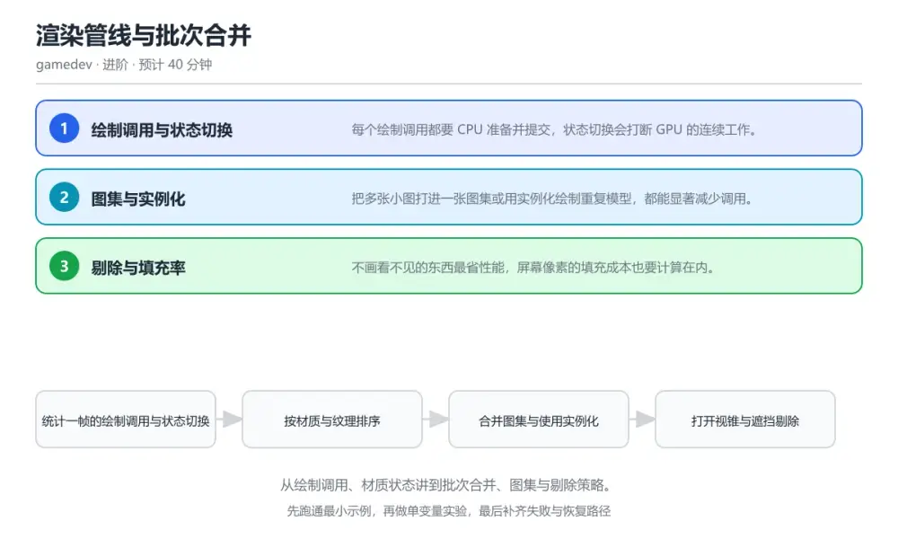
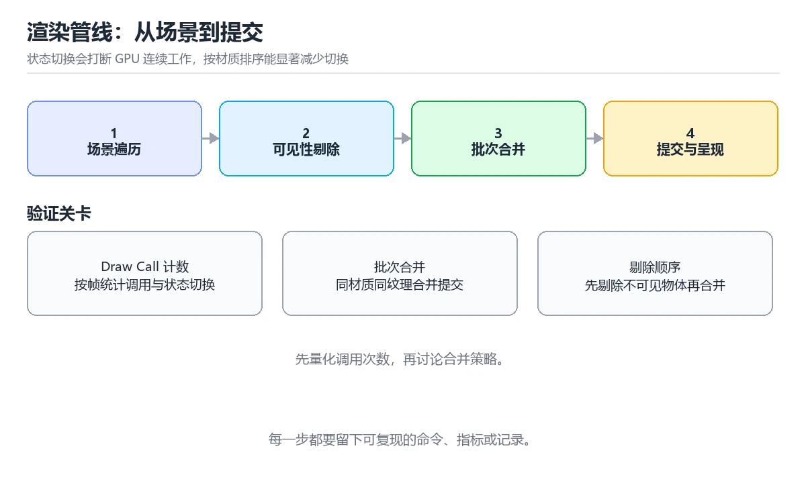

# 渲染管线与批次合并

> 内容更新时间：2026-10-06 · 学习阶段：进阶 · 预计用时：40 分钟

分类：gamedev。关键词：渲染管线、Draw Call、批次合并、图集、剔除。从绘制调用、材质状态讲到批次合并、图集与剔除策略。



## 本节知识框架

**课程定位**：所属分类 `gamedev`（图形与游戏开发），课程主题 `渲染管线与批次合并`，学习阶段 进阶，建议用时 40 分钟。

本课主线：从绘制调用、材质状态讲到批次合并、图集与剔除策略。

**学完本课应当能够**
- 说清 `绘制调用` 与 `批次` 的含义与区别，并各举一个正例和一个反例。
- 用本课示例验证 `图集` 的行为，记录输入、输出与失败条件。
- 遇到「场景一复杂就掉帧」这类问题时，能说出触发条件与修复顺序。

### 从概念到验证的学习链条

1. `绘制调用`：先掌握 CPU 向图形接口提交一次绘制的指令，再用它解释 `批次` 为什么会出现。
2. `批次`：先掌握 状态相同、可以合并提交的一组绘制，再用它解释 `图集` 为什么会出现。
3. `图集`：先掌握 把多张小纹理合并到一张大纹理以减少切换，再用它解释 `实例化` 为什么会出现。
4. `实例化`：先掌握 一次提交绘制同一网格的多个实例，再用它解释 `过度绘制` 为什么会出现。
5. `过度绘制`：先掌握 同一像素被多次着色，浪费填充带宽，再用它解释 `填充率` 为什么会出现。
6. `填充率`：先掌握 GPU 每秒能写入的像素数量：不画看不见的东西最省性能，屏幕像素的填充成本也要计算在内，再用它解释 本课示例的观察结果 为什么会出现。

**先修与衔接**：本课是「图形与游戏开发」分类的第 5 课。当前没有登记显式先修或后续课程；课程主线是从绘制调用、材质状态讲到批次合并、图集与剔除策略。学完后按 `gamedev` 分类顺序继续。

### 完成判据

- **定义关**：不看正文也能说明 `绘制调用` 是 CPU 向图形接口提交一次绘制的指令，并指出一个反例。
- **机制关**：能按“输入 → 转换 → 输出 → 验证”复述 `渲染管线与批次合并`，而不是只背结论。
- **示例关**：能运行或推演 `渲染管线与批次合并` 的 `text` 示例，并说明一个真实出现的标识符或字面量。
- **证据关**：能从 `渲染管线与批次合并` 的示例写出一个输入、处理、输出三元组，并说明它支持或反驳了本课的哪一条结论。
- **排错关**：能复现 场景一复杂就掉帧，记录现象并按 按材质与纹理排序合并批次，重复模型改用实例化绘制 修复。
- **迁移关**：能把 `渲染管线`、`Draw Call`、`批次合并`、`图集` 放进一个与 `渲染管线与批次合并` 不同的项目场景，并保持输入与验证条件可追踪。
- **复盘关**：学完 `渲染管线与批次合并` 后，用一句话写下仍然不确定的结论，并列出下一次验证需要的输入、环境和成功判据。

### 复习清单

- [ ] 能不看正文复述本课核心术语，并指出一个边界或反例。
- [ ] 能运行或推演本课示例，记录输入、输出与失败现象。
- [ ] 能完成一次自测，并把错题对照错误表定位原因。

**本课配图**



## 核心概念定义

| 术语 | 操作性定义 | 常见边界与风险 |
| --- | --- | --- |
| 绘制调用 | CPU 向图形接口提交一次绘制的指令。 | 隔离级别与并发事务会影响可见性，换级别或换存储引擎后要重新验证。 |
| 批次 | 状态相同、可以合并提交的一组绘制。 | 易错：逐个对象提交绘制，材质与纹理频繁切换；正确做法是按材质与纹理排序合并批次，重复模型改用实例化绘制。 |
| 图集 | 把多张小纹理合并到一张大纹理以减少切换。 | 只在「把多张小纹理合并到一张大纹理以减少切换」这一前提下成立，换输入或换环境要重新验证。 |
| 实例化 | 一次提交绘制同一网格的多个实例。 | 易错：逐个对象提交绘制，材质与纹理频繁切换；正确做法是按材质与纹理排序合并批次，重复模型改用实例化绘制。 |
| 过度绘制 | 同一像素被多次着色，浪费填充带宽。 | 只在「同一像素被多次着色，浪费填充带宽」这一前提下成立，换输入或换环境要重新验证。 |
| 填充率 | GPU 每秒能写入的像素数量：不画看不见的东西最省性能，屏幕像素的填充成本也要计算在内 | 结论随输入规模变化，小规模成立不代表大规模成立，需要重新测量。 |

## 原理与运行机制

### 机制总览

**教材衔接：核心知识**

### 1. 绘制调用与状态切换

每个绘制调用都要 CPU 准备并提交，状态切换会打断 GPU 的连续工作。

渲染器把可见对象按材质、着色器与纹理排序，相同状态的合并成一次提交，减少切换与调用次数。

在渲染管线与批次合并里可以这样验证：在本课示例里对比未排序与排序后的一帧绘制调用数量。

边界：过度合并会破坏绘制顺序，透明物体排序错误会出现穿插与闪烁。

工程视角：把不透明与透明对象分开处理，透明按深度排序，不透明优先合并批次。

### 2. 图集与实例化

把多张小图打进一张图集或用实例化绘制重复模型，都能显著减少调用。

图集让小图共享同一纹理，实例化把同一网格的多个变换一次性提交给 GPU，两者都减少了状态切换与调用开销。

在渲染管线与批次合并里可以这样验证：在本课示例里把散落的精灵打进图集，观察调用数从上百降到个位数。

边界：图集过大或分辨率过高会占用大量显存并降低缓存命中，反而拖慢采样。

工程视角：按使用场景分组打图集，设置尺寸上限并把图集清单纳入资产构建产物。

### 3. 剔除与填充率

不画看不见的东西最省性能，屏幕像素的填充成本也要计算在内。

视锥剔除、遮挡剔除与距离分级减少提交对象；降低过度绘制、控制半透明面积可减少像素填充压力。

在渲染管线与批次合并里可以这样验证：在本课示例里统计同一场景在不同视角下的可见对象数与填充率指标。

边界：剔除判定过于保守会漏画，边界物体突然出现是常见的体验问题。

工程视角：给剔除保留适度包围盒余量，分级细节切换加入滞后区间避免来回抖动。

**教材衔接：关键流程**

```text
统计一帧的绘制调用与状态切换 → 按材质与纹理排序 → 合并图集与使用实例化 → 打开视锥与遮挡剔除 → 用分析工具确认瓶颈转移
```

1. 统计一帧的绘制调用与状态切换
2. 按材质与纹理排序
3. 合并图集与使用实例化
4. 打开视锥与遮挡剔除
5. 用分析工具确认瓶颈转移

### 机制拆解：每一步的输入、动作与输出

#### 1. `绘制调用`
- 输入：`渲染管线`；本步把 CPU 向图形接口提交一次绘制的指令 当作判断规则。
- 动作：围绕 `绘制调用` 保留中间状态，并记录它与 `批次` 的对应关系。
- 输出：`批次`，它可以被下一段代码、测试或记录继续使用。
- `绘制调用` 的失败条件：隔离级别与并发事务会影响可见性，换级别或换存储引擎后要重新验证。

#### 2. `批次`
- 输入：`绘制调用`；本步把 状态相同、可以合并提交的一组绘制 当作判断规则。
- 动作：围绕 `批次` 保留中间状态，并记录它与 `图集` 的对应关系。
- 输出：`图集`，它可以被下一段代码、测试或记录继续使用。
- `批次` 的失败条件：当场景一复杂就掉帧时，会出现逐个对象提交绘制，材质与纹理频繁切换。

#### 3. `图集`
- 输入：`批次`；本步把 把多张小纹理合并到一张大纹理以减少切换 当作判断规则。
- 动作：围绕 `图集` 保留中间状态，并记录它与 `实例化` 的对应关系。
- 输出：`实例化`，它可以被下一段代码、测试或记录继续使用。
- `图集` 的失败条件：只在「把多张小纹理合并到一张大纹理以减少切换」这一前提下成立，换输入或换环境要重新验证。

#### 4. `实例化`
- 输入：`图集`；本步把 一次提交绘制同一网格的多个实例 当作判断规则。
- 动作：围绕 `实例化` 保留中间状态，并记录它与 `过度绘制` 的对应关系。
- 输出：`过度绘制`，它可以被下一段代码、测试或记录继续使用。
- `实例化` 的失败条件：当场景一复杂就掉帧时，会出现逐个对象提交绘制，材质与纹理频繁切换。

#### 5. `过度绘制`
- 输入：`实例化`；本步把 同一像素被多次着色，浪费填充带宽 当作判断规则。
- 动作：围绕 `过度绘制` 保留中间状态，并记录它与 `填充率` 的对应关系。
- 输出：`填充率`，它可以被下一段代码、测试或记录继续使用。
- `过度绘制` 的失败条件：只在「同一像素被多次着色，浪费填充带宽」这一前提下成立，换输入或换环境要重新验证。

#### 6. `填充率`
- 输入：`过度绘制`；本步把 GPU 每秒能写入的像素数量：不画看不见的东西最省性能，屏幕像素的填充成本也要计算在内 当作判断规则。
- 动作：围绕 `填充率` 保留中间状态，并记录它与 `本课示例的最终结果` 的对应关系。
- 输出：`本课示例的最终结果`，它可以被下一段代码、测试或记录继续使用。
- `填充率` 的失败条件：结论随输入规模变化，小规模成立不代表大规模成立，需要重新测量。

### 复现实验记录

- 环境：`渲染管线与批次合并` 使用 `text` 示例，固定 `渲染管线`、`Draw Call`、`批次合并`、`图集` 作为第一组条件。
- 首轮输入：从示例中的第一个输入开始，预测 `绘制调用` 会怎样变化。
- 基线观察：记录命令、输入、输出和错误原文，不用截图代替可复制的文本。
- 单变量修改：只改变 `渲染管线`，观察 `填充率` 是否仍满足定义。
- 失败注入：复现 场景一复杂就掉帧，确认现象是 逐个对象提交绘制，材质与纹理频繁切换。
- 记录结论：把“修改前、修改后、预期变化、实际变化”写成四列表，这样复盘 `渲染管线与批次合并` 时才能区分概念错误与实现错误。

## 典型应用场景

**教材衔接：深度拓展与实战**

### 机制拆解 1：绘制调用与状态切换

渲染器把可见对象按材质、着色器与纹理排序，相同状态的合并成一次提交，减少切换与调用次数。

落地时先确认前提：过度合并会破坏绘制顺序，透明物体排序错误会出现穿插与闪烁。再把结论写进检查表，让下一位同学可以按同样的输入复现。

工程做法：把不透明与透明对象分开处理，透明按深度排序，不透明优先合并批次。

### 机制拆解 2：图集与实例化

图集让小图共享同一纹理，实例化把同一网格的多个变换一次性提交给 GPU，两者都减少了状态切换与调用开销。

落地时先确认前提：图集过大或分辨率过高会占用大量显存并降低缓存命中，反而拖慢采样。再把结论写进检查表，让下一位同学可以按同样的输入复现。

工程做法：按使用场景分组打图集，设置尺寸上限并把图集清单纳入资产构建产物。

### 机制拆解 3：剔除与填充率

视锥剔除、遮挡剔除与距离分级减少提交对象；降低过度绘制、控制半透明面积可减少像素填充压力。

落地时先确认前提：剔除判定过于保守会漏画，边界物体突然出现是常见的体验问题。再把结论写进检查表，让下一位同学可以按同样的输入复现。

工程做法：给剔除保留适度包围盒余量，分级细节切换加入滞后区间避免来回抖动。

### 机制对照表

| 概念 | 解决什么问题 | 关键前提 | 失败信号 |
| --- | --- | --- | --- |
| 绘制调用与状态切换 | 每个绘制调用都要 CPU 准备并提交，状态切换会打断 GPU 的连续工作。 | 过度合并会破坏绘制顺序，透明物体排序错误会出现穿插与闪烁。 | 把不透明与透明对象分开处理，透明按深度排序，不透明优先合并批次。 |
| 图集与实例化 | 把多张小图打进一张图集或用实例化绘制重复模型，都能显著减少调用。 | 图集过大或分辨率过高会占用大量显存并降低缓存命中，反而拖慢采样。 | 按使用场景分组打图集，设置尺寸上限并把图集清单纳入资产构建产物。 |
| 剔除与填充率 | 不画看不见的东西最省性能，屏幕像素的填充成本也要计算在内。 | 剔除判定过于保守会漏画，边界物体突然出现是常见的体验问题。 | 给剔除保留适度包围盒余量，分级细节切换加入滞后区间避免来回抖动。 |

### 自测问答

**问 1**：减少绘制调用最直接的两个手段是？

**答**：合并图集与使用实例化。图集让多个精灵共享纹理，实例化让同一网格一次提交多个实例，两者都直接减少调用与状态切换。 正确选项「合并图集与使用实例化」对应《渲染管线与批次合并》的要点「绘制调用与状态切换」：每个绘制调用都要 CPU 准备并提交，状态切换会打断 GPU 的连续工作。判断「绘制调用与状态切换」时先确认前提是否成立，再回到《渲染管线与批次合并》的示例核对一次；把别的语言或框架的默认做法直接搬到绘制调用与状态切换上，往往会在本课的边界条件里失效。

**问 2**：透明物体为什么要单独排序绘制？

**答**：需要按深度从远到近混合，顺序错了会出现穿插。透明混合结果依赖绘制顺序，必须按深度从远到近，混在不透明批次里会产生错误的穿插与闪烁。 正确选项「需要按深度从远到近混合，顺序错了会出现穿插」对应《渲染管线与批次合并》的要点「图集与实例化」：把多张小图打进一张图集或用实例化绘制重复模型，都能显著减少调用。判断「图集与实例化」时先确认前提是否成立，再回到《渲染管线与批次合并》的示例核对一次；借鉴相邻主题的经验之前，先核对图集与实例化的前提是否成立。

**问 3**：以下哪些因素可能让 GPU 成为瓶颈？（多选）

**答**：大面积半透明特效叠加；分辨率翻倍导致填充率上升；同屏粒子数量巨大。填充率与像素着色量决定 GPU 压力；调用少且几何简单的场景通常不会让 GPU 饱和。 正确选项「大面积半透明特效叠加；分辨率翻倍导致填充率上升；同屏粒子数量巨大」对应《渲染管线与批次合并》的要点「剔除与填充率」：不画看不见的东西最省性能，屏幕像素的填充成本也要计算在内。判断「剔除与填充率」时先确认前提是否成立，再回到《渲染管线与批次合并》的示例核对一次；记住剔除与填充率的结论之外还要记住适用条件，换一个输入往往就不成立了。

**问 4**：请按一帧渲染的主要顺序排列。

**答**：收集场景对象。先收集再剔除能减少后续排序与提交的规模，排序后合并批次提交，最后做后处理与呈现。 正确选项「收集场景对象；剔除不可见对象；按材质与纹理排序；提交批次绘制；后处理并呈现画面」对应《渲染管线与批次合并》的要点「绘制调用与状态切换」：每个绘制调用都要 CPU 准备并提交，状态切换会打断 GPU 的连续工作。判断「绘制调用与状态切换」时先确认前提是否成立，再回到《渲染管线与批次合并》的示例核对一次；干扰项常常是相邻主题里成立的结论，只有按绘制调用与状态切换的输入与约束判断才能排除。

**问 5**：阅读这段渲染代码，主要性能问题是什么？

**答**：每个对象单独绑定材质并提交，批次无法合并。循环内逐对象绑定材质与纹理，状态切换次数与对象数量同阶，应改为先排序再合并批次，并只在实际变化时切换状态。 正确选项「每个对象单独绑定材质并提交，批次无法合并」对应《渲染管线与批次合并》的要点「图集与实例化」：把多张小图打进一张图集或用实例化绘制重复模型，都能显著减少调用。判断「图集与实例化」时先确认前提是否成立，再回到《渲染管线与批次合并》的示例核对一次；把图集与实例化的做法换到别的约束下未必成立，先确认边界再决定答案。


### 工程检查表

- [ ] 统计一帧的绘制调用与状态切换
- [ ] 按材质与纹理排序
- [ ] 合并图集与使用实例化
- [ ] 打开视锥与遮挡剔除
- [ ] 用分析工具确认瓶颈转移
- [ ] 【绘制调用与状态切换】把不透明与透明对象分开处理，透明按深度排序，不透明优先合并批次。
- [ ] 【图集与实例化】按使用场景分组打图集，设置尺寸上限并把图集清单纳入资产构建产物。
- [ ] 【剔除与填充率】给剔除保留适度包围盒余量，分级细节切换加入滞后区间避免来回抖动。


### 结论与下一步

- **场景一复杂就掉帧**：典型现象是逐个对象提交绘制，材质与纹理频繁切换；正确做法是按材质与纹理排序合并批次，重复模型改用实例化绘制。
- **半透明物体闪烁**：典型现象是透明与不透明对象混在一起排序；正确做法是不透明先画并按状态合并，透明单独一遍按深度从远到近绘制。
- **物体在画面边缘突然消失**：典型现象是剔除包围盒过紧，旋转后没有更新；正确做法是包围盒留出余量并在变换后重算，分级切换加入滞后区间。

### 最小验证场景

- 准备：保留 `text` 示例的原始输入，先记录 `渲染管线与批次合并` 的基线输出和完整运行命令。
- 判定：新结果与 `渲染管线与批次合并` 的基线不同不等于错误；只有当差异破坏了 `绘制调用` 的定义或错误表中的约束，才判定为失败。

### 选择与边界

- 使用 `绘制调用` 时，先满足它的定义：CPU 向图形接口提交一次绘制的指令；隔离级别与并发事务会影响可见性，换级别或换存储引擎后要重新验证。
- 使用 `批次` 时，先满足它的定义：状态相同、可以合并提交的一组绘制；易错：逐个对象提交绘制，材质与纹理频繁切换；正确做法是按材质与纹理排序合并批次，重复模型改用实例化绘制。
- 使用 `图集` 时，先满足它的定义：把多张小纹理合并到一张大纹理以减少切换；只在「把多张小纹理合并到一张大纹理以减少切换」这一前提下成立，换输入或换环境要重新验证。
- 使用 `实例化` 时，先满足它的定义：一次提交绘制同一网格的多个实例；易错：逐个对象提交绘制，材质与纹理频繁切换；正确做法是按材质与纹理排序合并批次，重复模型改用实例化绘制。
- 使用 `过度绘制` 时，先满足它的定义：同一像素被多次着色，浪费填充带宽；只在「同一像素被多次着色，浪费填充带宽」这一前提下成立，换输入或换环境要重新验证。

## 代码/协议/SQL 示例

### 最小可验证示例

```text
统计一帧的绘制调用与状态切换 → 按材质与纹理排序 → 合并图集与使用实例化 → 打开视锥与遮挡剔除 → 用分析工具确认瓶颈转移
```

**教材衔接：原文最小示例**

```text
统计一帧的绘制调用与状态切换 → 按材质与纹理排序 → 合并图集与使用实例化 → 打开视锥与遮挡剔除 → 用分析工具确认瓶颈转移
```

```csharp
// 每帧收集可见渲染项，按材质与纹理排序后再提交
void RenderFrame(Scene scene, Camera camera) {
    var visible = new List<RenderItem>();
    foreach (var item in scene.Items) {
        if (!camera.Frustum.Contains(item.Bounds)) continue;   // 视锥剔除
        if (item.Distance > item.MaxDistance) continue;        // 距离分级
        visible.Add(item);
    }

    // 排序键：先材质、再纹理，透明物体单独放最后
    visible.Sort((a, b) => {
        int cmp = a.MaterialId.CompareTo(b.MaterialId);
        if (cmp != 0) return cmp;
        return a.TextureId.CompareTo(b.TextureId);
    });

    int batches = 0;
    MaterialId current = MaterialId.None;
    foreach (var item in visible) {
        if (item.IsTransparent) continue;              // 透明单独一遍
        if (item.MaterialId != current) {
            BindMaterial(item.MaterialId);             // 只在必要时切换状态
            current = item.MaterialId;
            batches++;
        }
        Submit(item.Mesh, item.Transform);
    }
    Debug.Hud($"visible={visible.Count} batches={batches}");
}
```

### 示例精读：先找证据，再改一个条件

- 在 `渲染管线与批次合并` 中与 `绘制调用` 对照：示例必须能支持 CPU 向图形接口提交一次绘制的指令，否则说明这一段还缺少实现或验证步骤。
- 在 `渲染管线与批次合并` 中与 `批次` 对照：示例必须能支持 状态相同、可以合并提交的一组绘制，否则说明这一段还缺少实现或验证步骤。
- 在 `渲染管线与批次合并` 中与 `图集` 对照：示例必须能支持 把多张小纹理合并到一张大纹理以减少切换，否则说明这一段还缺少实现或验证步骤。
- 在 `渲染管线与批次合并` 中与 `实例化` 对照：示例必须能支持 一次提交绘制同一网格的多个实例，否则说明这一段还缺少实现或验证步骤。
- `渲染管线与批次合并` 的示例没有抽取到函数调用或字面量；按行记录输入、控制流和输出，避免只背代码外形。

## 时间/空间复杂度或性能分析

**性能关注点（渲染管线与批次合并）**：帧预算决定体验：记录帧率与帧时间分布、峰值内存与加载耗时，低端机型要单独跑一遍。

**本课特有开销（渲染管线与批次合并 · 渲染管线）**：比较次数与内存移动决定开销，注意稳定性与额外空间。

**测量方法**：以 `渲染管线与批次合并` 的 `渲染管线` 场景为对象，固定输入跑一遍记录基线，再把规模或并发度提高一个数量级复测；两次结果的差值与波动范围才是结论依据。

### 需要控制的变量与记录项

- `渲染管线与批次合并` 的 `渲染管线`：固定它的版本、输入范围和资源上限，分别记录速度、内存与失败率的变化。
- `渲染管线与批次合并` 的 `Draw Call`：固定它的版本、输入范围和资源上限，分别记录速度、内存与失败率的变化。
- `渲染管线与批次合并` 的 `批次合并`：固定它的版本、输入范围和资源上限，分别记录速度、内存与失败率的变化。
- `渲染管线与批次合并` 的 `图集`：固定它的版本、输入范围和资源上限，分别记录速度、内存与失败率的变化。
- `渲染管线与批次合并` 的 `剔除`：固定它的版本、输入范围和资源上限，分别记录速度、内存与失败率的变化。
- `渲染管线与批次合并` 中 `绘制调用` 的边界：隔离级别与并发事务会影响可见性，换级别或换存储引擎后要重新验证。达到边界时不要外推，必须重新测量。
- `渲染管线与批次合并` 中 `批次` 的边界：易错：逐个对象提交绘制，材质与纹理频繁切换；正确做法是按材质与纹理排序合并批次，重复模型改用实例化绘制。达到边界时不要外推，必须重新测量。
- `渲染管线与批次合并` 中 `图集` 的边界：只在「把多张小纹理合并到一张大纹理以减少切换」这一前提下成立，换输入或换环境要重新验证。达到边界时不要外推，必须重新测量。
- `渲染管线与批次合并` 中 `实例化` 的边界：易错：逐个对象提交绘制，材质与纹理频繁切换；正确做法是按材质与纹理排序合并批次，重复模型改用实例化绘制。达到边界时不要外推，必须重新测量。
- `渲染管线与批次合并` 中 `过度绘制` 的边界：只在「同一像素被多次着色，浪费填充带宽」这一前提下成立，换输入或换环境要重新验证。达到边界时不要外推，必须重新测量。

## 常见误区与易错点

| 容易写错的做法 | 实际现象 | 原因与正确做法 |
| --- | --- | --- |
| 场景一复杂就掉帧 | 逐个对象提交绘制，材质与纹理频繁切换。 | 按材质与纹理排序合并批次，重复模型改用实例化绘制。 |
| 半透明物体闪烁 | 透明与不透明对象混在一起排序。 | 不透明先画并按状态合并，透明单独一遍按深度从远到近绘制。 |
| 物体在画面边缘突然消失 | 剔除包围盒过紧，旋转后没有更新。 | 包围盒留出余量并在变换后重算，分级切换加入滞后区间。 |

### 现场 1：场景一复杂就掉帧

**症状**：逐个对象提交绘制，材质与纹理频繁切换。

**根因与修复**：按材质与纹理排序合并批次，重复模型改用实例化绘制。

**自检**：在本课示例里复现「场景一复杂就掉帧」，改成按材质与纹理排序合并批次，重复模型改用实例化绘制后重跑；如果症状消失且失败路径按预期变化，说明定位正确。

### 现场 2：半透明物体闪烁

**症状**：透明与不透明对象混在一起排序。

**根因与修复**：不透明先画并按状态合并，透明单独一遍按深度从远到近绘制。

**自检**：在本课示例里复现「半透明物体闪烁」，改成不透明先画并按状态合并，透明单独一遍按深度从远到近绘制后重跑；如果症状消失且失败路径按预期变化，说明定位正确。

### 现场 3：物体在画面边缘突然消失

**症状**：剔除包围盒过紧，旋转后没有更新。

**根因与修复**：包围盒留出余量并在变换后重算，分级切换加入滞后区间。

**自检**：在本课示例里复现「物体在画面边缘突然消失」，改成包围盒留出余量并在变换后重算，分级切换加入滞后区间后重跑；如果症状消失且失败路径按预期变化，说明定位正确。

## 与其他知识点的关系

**教材衔接：复习与迁移**


### 迁移练习

- **术语归属**：`绘制调用`、`批次`、`图集` 的定义以本课「核心概念定义」为准，换到其他课程时先确认定义是否被改写。

### 容易混淆的相邻概念

- `绘制调用` 与 `批次`：前者强调 CPU 向图形接口提交一次绘制的指令；后者强调 状态相同、可以合并提交的一组绘制。判断时分别检查两条定义的适用范围，不要只看名称相似就互换。
- `批次` 与 `图集`：前者强调 状态相同、可以合并提交的一组绘制；后者强调 把多张小纹理合并到一张大纹理以减少切换。判断时分别检查两条定义的适用范围，不要只看名称相似就互换。
- `图集` 与 `实例化`：前者强调 把多张小纹理合并到一张大纹理以减少切换；后者强调 一次提交绘制同一网格的多个实例。判断时分别检查两条定义的适用范围，不要只看名称相似就互换。
- `实例化` 与 `过度绘制`：前者强调 一次提交绘制同一网格的多个实例；后者强调 同一像素被多次着色，浪费填充带宽。判断时分别检查两条定义的适用范围，不要只看名称相似就互换。
- `过度绘制` 与 `填充率`：前者强调 同一像素被多次着色，浪费填充带宽；后者强调 GPU 每秒能写入的像素数量：不画看不见的东西最省性能，屏幕像素的填充成本也要计算在内。判断时分别检查两条定义的适用范围，不要只看名称相似就互换。

## 自测题与参考答案

> 先独立作答，再对照参考答案；答案都能在本课正文、术语表或错误表里找到依据。

### 自测 1（概念复述）

不看正文，写出 `绘制调用` 的操作性定义，并说明它与 `批次` 的区别。

**参考答案**：CPU 向图形接口提交一次绘制的指令。

`批次` 的定位是：状态相同、可以合并提交的一组绘制；两者的差别要从适用对象与失败模式上说明。

### 自测 2（排错）

本课错误表记录了「场景一复杂就掉帧」这类做法。请写出它会出现的现象、根因，以及修复顺序。

**参考答案**：现象是逐个对象提交绘制，材质与纹理频繁切换；正确做法是按材质与纹理排序合并批次，重复模型改用实例化绘制。修复时先复现现象并保留证据，再改动一处假设重跑，确认现象消失。

### 自测 3（动手验证）

运行本课的 `text` 示例，改动其中一个输入后重新运行，记录输出与错误信息。

**参考答案**：正常输入下 `text` 示例应当复现正文给出的结果；改动输入后，如果结果改变或报错，先核对它是否满足 `渲染管线与批次合并` 中`绘制调用` 的适用范围，再检查错误表里是否有同类现象。

### 自测 4（代码阅读）

阅读本课开头的 `text` 示例，说明它体现了`绘制调用` 的哪一条性质，并指出改动哪个输入会让这条性质不再成立。

**参考答案**：`绘制调用` 的定义是 CPU 向图形接口提交一次绘制的指令，示例正是在实现这条定义。改动与 `绘制调用` 有关的一个输入后，如果结果不再符合 `渲染管线与批次合并` 的正文描述，就说明该性质只在当前前提成立。

### 自测 5（迁移）

把 `渲染管线与批次合并` 的方法迁移到自己的项目：围绕 `绘制调用` 写出一个与错误表同类的风险点，并说明触发条件和检验方式。

**参考答案**：例如「物体在画面边缘突然消失」，它会导致剔除包围盒过紧，旋转后没有更新；检验方式是按包围盒留出余量并在变换后重算，分级切换加入滞后区间改一处再复现，确认现象消失且没有引入新的失败分支。

### 自测 6（对比）

用一个表格对比 `绘制调用` 与 `批次`：各写一行适用场景、一行失败表现。

**参考答案**：`绘制调用` 的定义是CPU 向图形接口提交一次绘制的指令；`批次` 的定义是状态相同、可以合并提交的一组绘制。两者的失败表现分别对应本课错误表里与本术语相关的行。

### 自测 7（排错顺序）

面对「场景一复杂就掉帧」引发的问题，请把“复现 逐个对象提交绘制，材质与纹理频繁切换 → 保留证据 → 按材质与纹理排序合并批次，重复模型改用实例化绘制 → 回归验证”四步写成可执行的检查清单。

**参考答案**：第一步按逐个对象提交绘制，材质与纹理频繁切换复现；第二步记录输入、版本与完整报错；第三步按按材质与纹理排序合并批次，重复模型改用实例化绘制只改一处；第四步重跑并确认失败路径也按预期变化。

### 自测 8（边界判断）

针对 `填充率`，分别写出“可以使用”的条件和“结论不再成立”的条件。

**参考答案**：结论随输入规模变化，小规模成立不代表大规模成立，需要重新测量。 同时要把 `填充率` 的定义 GPU 每秒能写入的像素数量：不画看不见的东西最省性能，屏幕像素的填充成本也要计算在内 与实际输入逐项对照。

### 自测 9（机制重建）

不看正文，按输入、转换、输出、验证四段重建 `绘制调用` → `批次` → `图集` → `实例化` 的作用链。

**参考答案**：起点是 `绘制调用` 的定义 CPU 向图形接口提交一次绘制的指令；中间每一步都保留可观察状态；终点由 `填充率` 检查，失败时回到错误表定位第一个偏离定义的步骤。

### 自测 10（综合排错）

在 `渲染管线与批次合并` 中，现象是 剔除包围盒过紧，旋转后没有更新。请围绕 物体在画面边缘突然消失 写出最小复现、关键证据、修复动作和回归验证，并说明为什么不能只凭一次运行下结论。

**参考答案**：先复现 物体在画面边缘突然消失，记录输入与完整错误；再按 包围盒留出余量并在变换后重算，分级切换加入滞后区间 只改一处。回归时同时跑正常路径和边界路径，只有两次结果都可解释，才把修复视为完成。

### 自测 11（一分钟复述）

用每分钟约 200 字的速度复述 `渲染管线与批次合并`：先给主问题，再按顺序说出 `绘制调用`、`批次`、`图集`、`实例化`，最后给一个失败案例。

**自评标准**：主问题必须对应 从绘制调用、材质状态讲到批次合并、图集与剔除策略；每个术语都要能接上一句定义或边界；失败案例必须写成可观察现象，不能用“可能有风险”代替证据。

## 术语速查

| 术语 | 一句话说明 |
| --- | --- |
| `绘制调用` | CPU 向图形接口提交一次绘制的指令。 |
| `批次` | 状态相同、可以合并提交的一组绘制。 |
| `图集` | 把多张小纹理合并到一张大纹理以减少切换。 |
| `实例化` | 一次提交绘制同一网格的多个实例。 |
| `过度绘制` | 同一像素被多次着色，浪费填充带宽。 |
| `填充率` | GPU 每秒能写入的像素数量：不画看不见的东西最省性能，屏幕像素的填充成本也要计算在内。 |

**术语关系**：`绘制调用`（CPU 向图形接口提交一次绘制的指令） → `批次`（状态相同、可以合并提交的一组绘制） → `图集`（把多张小纹理合并到一张大纹理以减少切换） → `实例化`（一次提交绘制同一网格的多个实例）。

## 考点精讲

`渲染管线与批次合并` 的题库有 5 道题，下面逐题给出题干、正确项与判断依据：先自己作答，再核对正确项，最后回到正文对应小节复核。

### 考点 1：第 1 题

- **题目**：减少绘制调用最直接的两个手段是？
- **正确项**：合并图集与使用实例化
- **判断依据**：这道题落在术语 `绘制调用` 上：CPU 向图形接口提交一次绘制的指令。复习时把 `绘制调用` 的定义、适用边界和一个反例一起说清楚，再回到「核心概念定义」核对原文。

### 考点 2：第 2 题

- **题目**：透明物体为什么要单独排序绘制？
- **正确项**：需要按深度从远到近混合
- **判断依据**：这道题检验本课主问题：从绘制调用、材质状态讲到批次合并、图集与剔除策略。复习时先复述本课主问题，再举一个会让结论失效的输入。

### 考点 3：第 3 题

- **题目**：以下哪些因素可能让 GPU 成为瓶颈？（多选）
- **正确项**：大面积半透明特效叠加；分辨率翻倍导致填充率上升；同屏粒子数量巨大
- **判断依据**：这道题落在术语 `填充率` 上：GPU 每秒能写入的像素数量：不画看不见的东西最省性能，屏幕像素的填充成本也要计算在内。复习时把 `填充率` 的定义、适用边界和一个反例一起说清楚，再回到「核心概念定义」核对原文。

### 考点 4：第 4 题

- **题目**：请按一帧渲染的主要顺序排列。
- **正确项**：收集场景对象 → 剔除不可见对象 → 按材质与纹理排序 → 提交批次绘制 → 后处理并呈现画面
- **判断依据**：这道题落在术语 `批次` 上：状态相同、可以合并提交的一组绘制。复习时把 `批次` 的定义、适用边界和一个反例一起说清楚，再回到「核心概念定义」核对原文。

### 考点 5：第 5 题

- **题目**：阅读这段渲染代码，主要性能问题是什么？
- **正确项**：每个对象单独绑定材质并提交，批次无法合并
- **判断依据**：这道题落在术语 `批次` 上：状态相同、可以合并提交的一组绘制。复习时把 `批次` 的定义、适用边界和一个反例一起说清楚，再回到「核心概念定义」核对原文。

### 考点 6：`绘制调用`

- **要点**：CPU 向图形接口提交一次绘制的指令。
- **绘制调用 的边界**：隔离级别与并发事务会影响可见性，换级别或换存储引擎后要重新验证。

### 考点 7：`批次`

- **要点**：状态相同、可以合并提交的一组绘制。
- **批次 的边界**：易错：逐个对象提交绘制，材质与纹理频繁切换；正确做法是按材质与纹理排序合并批次，重复模型改用实例化绘制。

### 考点 8：`图集`

- **要点**：把多张小纹理合并到一张大纹理以减少切换。
- **图集 的边界**：只在「把多张小纹理合并到一张大纹理以减少切换」这一前提下成立，换输入或换环境要重新验证。

### 考点 9：`实例化`

- **要点**：一次提交绘制同一网格的多个实例。
- **实例化 的边界**：易错：逐个对象提交绘制，材质与纹理频繁切换；正确做法是按材质与纹理排序合并批次，重复模型改用实例化绘制。

### 考点 10：`过度绘制`

- **要点**：同一像素被多次着色，浪费填充带宽。
- **过度绘制 的边界**：只在「同一像素被多次着色，浪费填充带宽」这一前提下成立，换输入或换环境要重新验证。

### 考点 11：`填充率`

- **要点**：GPU 每秒能写入的像素数量：不画看不见的东西最省性能，屏幕像素的填充成本也要计算在内
- **填充率 的边界**：结论随输入规模变化，小规模成立不代表大规模成立，需要重新测量。

### 考点 12：排错——场景一复杂就掉帧

- **现象**：逐个对象提交绘制，材质与纹理频繁切换。
- **处理**：按材质与纹理排序合并批次，重复模型改用实例化绘制。

### 考点 13：排错——半透明物体闪烁

- **现象**：透明与不透明对象混在一起排序。
- **处理**：不透明先画并按状态合并，透明单独一遍按深度从远到近绘制。

### 考点 14：综合辨析——`绘制调用` 与 `填充率`

- **辨析点**：`绘制调用` 的定义是 CPU 向图形接口提交一次绘制的指令；`填充率` 的定义是 GPU 每秒能写入的像素数量：不画看不见的东西最省性能，屏幕像素的填充成本也要计算在内。
- **答题要求**：面对 `渲染管线与批次合并` 的题目，先判断描述的是 `绘制调用` 还是 `填充率`，再归到对应定义，最后写出一个会让该定义失效的边界输入。

### 考点 15：排错评分点

- **现象分**：能写出 逐个对象提交绘制，材质与纹理频繁切换，而不是只写“程序有错”。
- **证据分**：保留触发 场景一复杂就掉帧 的输入、版本和错误原文。
- **修复分**：按 按材质与纹理排序合并批次，重复模型改用实例化绘制 只改一处，并同时回归正常路径与边界路径。

## 内容元数据

- 内容版本：v2.0
- 最后更新：2026-10-06
- 学习阶段：进阶

| 字段 | 值 |
| --- | --- |
| 课程 ID | `gamedev_render_pipeline` |
| 所属分类 | `gamedev` |
| 难度 | 进阶 |
| 预计用时 | 40 分钟 |
| 关键词 | 渲染管线、Draw Call、批次合并、图集、剔除 |
| 配图 | `images/lesson_gamedev_render_pipeline.webp` |
| 参考资料 | 2 条 |
| 内容更新时间 | 2026-10-06 |

## 参考资料与复核

- 来源性质：官方文档、标准或权威教材；本课核对关键词：渲染管线、Draw Call、批次合并、图集、剔除。
- 最后复核：2026-10-04
- 下次复核：2027-04-24
- 复核范围：版本兼容、API 行为与工程实践

下面列出的资料用于核对本课结论，复习时可以对照阅读：
- [Unity 官方文档：批处理与性能](https://docs.unity3d.com/Manual/optimizing-draw-calls.html)
- [Godot 官方文档：渲染优化](https://docs.godotengine.org/en/stable/tutorials/performance/general_optimization.html)

| [本课术语索引：渲染管线与批次合并](#核心概念定义) | 按本课输入、术语边界和错误表现逐项核对 |
> 复核提示：《渲染管线与批次合并》的结论如与资料冲突，以资料中的规范文本为准，并在笔记里记录差异与日期。