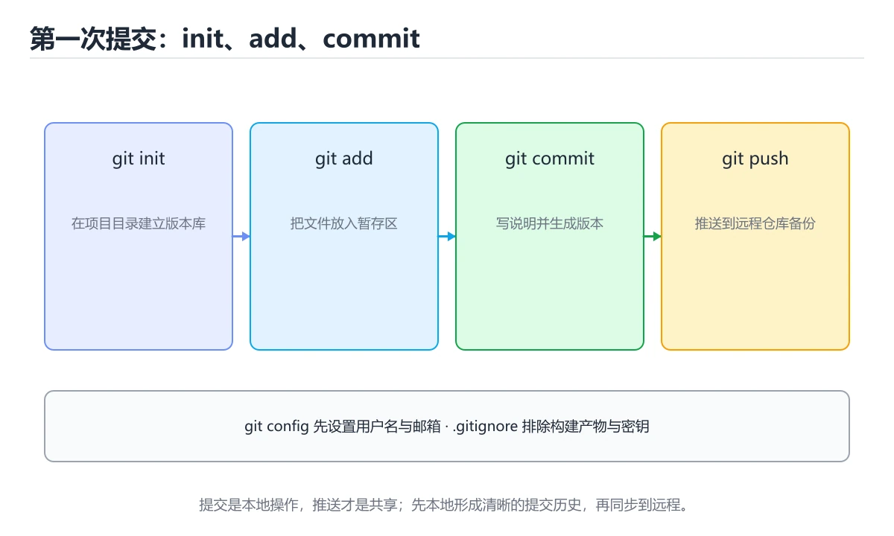

# Git 入门

> 内容更新时间：2026-10-06 · 学习阶段：入门 · 预计用时：35 分钟




## 学习目标

- 先认识Git 入门需要的工具、输入和输出。
- 按步骤运行最小示例，并记录结果与错误。
- 用一个边界输入验证自己是否真正掌握。

## 前置知识

- 会进行基本的文件或命令行操作。
- 不需要预先掌握「工具链」的高级知识。

## 一句话入门

完成初始化、提交、分支和远程同步。

## 最小示例

```bash
git init -q demo
cd demo
printf '# 学习笔记\n' > README.md
git add README.md
git -c user.name=learner -c user.email=learner@example.com commit -q -m "docs: 添加说明"
git log -1 --format=%s
```

## 预期输出

```text
docs: 添加说明
```

## 常见错误与排查

> 说明：本表由《Git 入门》的核心知识整理（2026-10-07），人工复核进度见 docs/content_review_batches.md。

| 易错点 | 容易踩的做法 | 正确结论 |
| --- | --- | --- |
| 直接在主干上改 | 多件事混在一起，无法回退 | 用分支隔离改动，提交粒度保持小 |
| 提交信息写得太笼统 | 历史无法回溯问题来源 | 写清改动目的与影响范围 |
| 冲突随便选一边 | 丢失他人改动 | 逐段理解双方意图后再决定保留内容 |

## 动手练习

1. 原样运行最小示例，保存命令和输出。
2. 把数字 2 改成 10，预测并验证新结果。
3. 制造一个错误输入，写出错误信息和修复方法。

## 本课小结

- 入门阶段先保证能运行、能观察、能解释，再追求复杂功能。
- 每次只改一个变量，记录预测与实际结果。
- 遇到错误先看第一条错误信息，再回到最小示例。

## Git 的三个区域与一次提交

Git 的核心模型是三个区域：工作区保存你正在编辑的文件，暂存区保存下一次提交的快照，本地仓库保存已经提交的历史。`git add` 把工作区变化放入暂存区，`git commit` 把暂存区内容写成一个新的提交对象。提交对象包含作者、时间、提交说明、父提交以及一棵完整的目录树，因此历史不是“文件差异的列表”，而是一串可以追溯和回放的状态快照。

`HEAD` 通常指向当前分支的最新提交，分支本质上只是一个可移动的提交指针。工作区、暂存区和 HEAD 三者不一致时，`git status` 会告诉你每个文件处于什么状态。修改文件后先看差异，再决定暂存哪些改动；`git diff` 看工作区与暂存区，`git diff --staged` 看暂存区与 HEAD。养成“小步暂存、单一目的提交”的习惯，比事后写一篇很长的提交说明更能保证历史清晰。

提交说明应说明“为什么做这个改动”，而不是重复文件名。一个好的提交可以独立回滚，也能让 reviewer 快速判断影响范围。如果一次提交同时包含格式化、重构和功能变更，回滚时就会被迫带走不相关的内容，这是最常见的历史污染。

## 分支、合并与远程同步

分支让你在不影响主线的情况下开发。创建分支只是新建一个指针，成本很低；真正需要处理的是合并时的差异。`merge` 会保留两条分支的历史并生成合并提交，`rebase` 则把你的提交重新放到目标分支之后，历史更线性但会改写提交 ID。已经推送并被他人使用的提交不要随意 rebase，否则会给协作者制造冲突。

远程仓库不是自动同步的。`fetch` 只把远程对象和引用下载到本地，`pull` 通常等于 fetch 后再 merge 或 rebase，`push` 才把本地提交上传。遇到冲突时，Git 会标记冲突文件，需要手动选择保留哪些内容，再 `git add` 并继续操作。冲突不是错误，而是两个分支对同一区域做了不同修改，解决时要同时理解两边的意图。

撤销操作要先判断影响范围：`git restore` 恢复工作区文件，`git revert` 创建一个反向提交，适合已经共享的历史；`git reset` 移动分支指针，可能改变暂存区或工作区，因此要格外谨慎。验证 Git 操作是否成功，不要只看命令退出码，还要用 `git status`、`git log --oneline --graph` 和差异命令确认最终状态。

## 代码实验：把示例跑成证据

### 实验一：建立基线

```bash
git init -q demo
cd demo
printf '# 学习笔记\n' > README.md
git add README.md
git -c user.name=learner -c user.email=learner@example.com commit -q -m "docs: 添加说明"
git log -1 --format=%s
```

### 实验二：只改一个输入

沿用「Git 入门」的最小示例做一次单变量实验：

| 实验 | 改动 | 预测 | 实际 | 结论 |
| --- | --- | --- | --- | --- |
| 基线 | 保持「Git 入门」示例原样 |  |  |  |
| 边界 | 把Git 入门换成空值或极值 |  |  |  |
| 失败 | 给工具链传入非法输入 |  |  |  |

做完后用一句话写出「Git 入门」的结论：输入怎么变，结果才怎么变。

### 实验三：制造一个可控错误

在 Git 入门 相关命令里去掉引号或让管道前段失败，记录退出码与标准错误，确认错误是否被掩盖。

| 实验 | 改动 | 预测 | 实际 | 结论 |
| --- | --- | --- | --- | --- |
| 基线 | 保持原样 |  |  |  |
| 边界 |  |  |  |  |
| 失败 |  |  |  |  |

### 实验四：用三句话复述

1. Git 入门 的输入是什么，哪些取值合法，哪些属于边界或非法范围？
2. README 的执行顺序里，哪一步会写数据或产生外部副作用？
3. 输出如何验证，失败时第一条可观察证据是什么？

## 可运行练习

### 任务 1：先跑通，再解释

```bash
git init -q demo
cd demo
printf '# 学习笔记\n' > README.md
git add README.md
git -c user.name=learner -c user.email=learner@example.com commit -q -m "docs: 添加说明"
git log -1 --format=%s
```

### 任务 2：只改一个条件

把「Git 入门」的最小示例复制一份，只改一个条件再跑一次：

- 改动点：把 工具链 换成边界值，其他输入保持原样。
- 预测：先写下「Git 入门」在改动后的输出或错误信息，再运行。
- 记录：对照改动前后的结果，指出差异出在哪一步。
- 验收：换回原条件能复现原结果，改动只影响Git 入门。

### 任务 3：迁移到自己的数据

换一个 工具链 场景重做一次，确认结论不是只对示例数据成立。

## 故障现场

### 现场 1：直接在主干上改

**症状**：在《Git 入门》的复现场景中，多件事混在一起，无法回退。

**根因**：“多件事混在一起，无法回退”只是表层结果。向上追溯会落到“直接在主干上改”这一步，因为它省略了《Git 入门》的约束，使实现行为和预期模型发生了偏离。

**修复**：针对《Git 入门》的问题，用分支隔离改动，提交粒度保持小。

**验证**：保留《Git 入门》里触发“多件事混在一起，无法回退”的输入、版本和日志，按“用分支隔离改动，提交粒度保持小”完成修改后原样重放；只有失败现象消失且相邻场景仍可解释，才保留改动。

### 现场 2：提交信息写得太笼统

**症状**：在《Git 入门》的复现场景中，历史无法回溯问题来源。

**根因**：触发点是把“提交信息写得太笼统”当成安全做法。它没有满足《Git 入门》要求的前提，因此先表现为“历史无法回溯问题来源”；排查时先完整复现这一段，再核对输入、配置与依赖。

**修复**：针对《Git 入门》的问题，写清改动目的与影响范围。

**验证**：保留《Git 入门》里触发“历史无法回溯问题来源”的输入、版本和日志，按“写清改动目的与影响范围”完成修改后原样重放；只有失败现象消失且相邻场景仍可解释，才保留改动。

### 现场 3：冲突随便选一边

**症状**：在《Git 入门》的复现场景中，丢失他人改动。

**根因**：当出现“冲突随便选一边”时，执行路径已经绕过了《Git 入门》的关键约束，最终以“丢失他人改动”暴露出来；修复前必须先确认约束在哪里失效。

**修复**：针对《Git 入门》的问题，逐段理解双方意图后再决定保留内容。

**验证**：保留《Git 入门》里触发“丢失他人改动”的输入、版本和日志，按“逐段理解双方意图后再决定保留内容”完成修改后原样重放；只有失败现象消失且相邻场景仍可解释，才保留改动。

## 本课复习清单

离开本课前，逐项确认：

- [ ] 不看解析，能说出「Git 中工作区、暂存区与提交之间的关系是？」的判断依据。
- [ ] 不看解析，能说出「git log -1 --format=%s 会输出什么？」的判断依据。
- [ ] 不看解析，能说出「把本地提交发布到远程仓库，通常使用哪个命令？」的判断依据。
- [ ] 不看解析，能说出「把首次提交并推送到远程仓库的步骤调整为正确顺序。」的判断依据。
- [ ] 用 Git 入门 构造一个正常输入和一个边界输入，分别记录输出与判断依据。
- [ ] 把本课最容易混淆的两个概念写成一句话对照。

| 复盘项 | 记录 |
| --- | --- |
| 已经能独立解释的考点 |  |
| 仍然说不清的概念 |  |
| 下一步验证动作 |  |

## 复习与自测

下面按正文顺序回顾「Git 入门」的每一节；说不清的地方回到 Git 的三个区域与一次提交 补课。

### 最小示例

```bash
git init -q demo
cd demo
printf '# 学习笔记\n' > README.md
git add README.md
git -c user.name=learner -c user.email=learner@example.com commit -q -m "docs: 添加说明"
git log -1 --format=%s
```

自检：这一节与相邻主题的边界在哪里？

### 预期输出

```text
docs: 添加说明
```

### 常见错误

自检：把这一节讲给没学过的人，最需要强调哪一点？

### 动手练习

自检：如果去掉这一节里的一个前提，结论会怎样变化？

### Git 的三个区域与一次提交

Git 的核心模型是三个区域：工作区保存你正在编辑的文件，暂存区保存下一次提交的快照，本地仓库保存已经提交的历史。`git add` 把工作区变化放入暂存区，`git commit` 把暂存区内容写成一个新的提交对象。

自检：用自己的话复述这一节，并举一个反例。

### 分支、合并与远程同步

创建分支只是新建一个指针，成本很低；真正需要处理的是合并时的差异。`merge` 会保留两条分支的历史并生成合并提交，`rebase` 则把你的提交重新放到目标分支之后，历史更线性但会改写提交 ID。

自检：Git 的三个区域与一次提交 的结论在什么条件下会失效？

## 术语速查

把「Git 入门」里反复出现的术语集中放在一起。复习时先遮住右列，尝试用自己的话解释，再回到正文核对。

| 术语 | 一句话说明 |
| --- | --- |
| `仓库` | 由 .git 目录保存全部提交历史的项目目录。 |
| `提交（commit）` | 一次带说明的历史快照，记录作者、时间与改动内容。 |
| `暂存区` | 用 git add 把改动放进暂存区，再一次性提交，便于挑选改动。 |
| `分支` | 指向某次提交的可移动指针，用来隔离并行开发。 |
| `远程仓库` | 托管在服务器上的副本，push 上传、pull 拉取并合并。 |

## 考点精讲

### 考点 1：概念判断·Git 入门

- **题目**：Git 中工作区、暂存区与提交之间的关系是？
- **判断依据**：在「Git 入门」里，修改先进入工作区，用 add 放入暂存区，再用 commit 写入历史。「Git 入门」要求先交代Git 入门、工具链、入门练习的前提再下结论，所以“修改先进入工作区”只在题干“Git 中工作区、暂存区与提交之间的关系是”给定的条件下成立。

### 考点 2：概念判断·Git 入门

- **题目**：git log -1 --format=%s 会输出什么？
- **判断依据**：在「Git 入门」里，最近一次提交的标题行。-1 限制只显示最近一次提交，--format=%s 指定输出提交说明的标题行，因此结果是类似「docs: 添加说明」的一行文本，适合在脚本中读取。在「Git 入门」里判断这道题，要把Git 入门、工具链、入门练习的条件、过程与失败路径逐项对齐，换成“git log -1 --forma”这个场景，只有满足前提的结论才成立。

### 考点 3：概念判断·Git 入门

- **题目**：把本地提交发布到远程仓库，通常使用哪个命令？
- **判断依据**：在「Git 入门」里，git push，把本地提交推送到远程分支。git push 把本地分支的提交发送到远程并更新对应分支引用。「Git 入门」要求先交代Git 入门、工具链、入门练习的前提再下结论，所以“git push”只在题干“把本地提交发布到远程仓库”给定的条件下成立。

### 考点 4：顺序排列·Git 入门

- **题目**：把首次提交并推送到远程仓库的步骤调整为正确顺序。
- **判断依据**：在「Git 入门」里，正确的执行顺序是「git init」 → 「git add .」 → 「git commit -m "first commit"」 → 「git push -u origin main」。先在目录中执行 git init 创建版本库，再用 git add 把要提交的改动放入暂存区，随后通过 git commit 生成一次本地提交。

### 考点 5：多选辨析·Git 入门

- **题目**：关于「Git 入门」，下列哪些说法是正确的？（多选）
- **判断依据**：题干的正确项是修改先进入工作区，用 add 放入暂存区，再用 commit 写入历史。在「Git 入门」里，最近一次提交的标题行。把“修改先进入工作区”代回「Git 入门」里“Git 入门”的例子核对，条件一旦改变，结论就要用Git 入门、工具链、入门练习重新推导。“下列哪些说法是正确的（多选）”与术语表相呼应，只有符合Git 入门、工具链、入门练习约束的“修改先进入工作区”才是正文支持的结论。

### 考点 6：排错·Git 入门

- **题目**：阅读「Git 入门」的代码片段，下面哪项判断是正确的？
- **判断依据**：在「Git 入门」里，题干的正确项是修改先进入工作区，用 add 放入暂存区，再用 commit 写入历史。回到「Git 入门」的正文示例，用“阅读Git 入门的代码片段”走一遍Git 入门、工具链、入门练习的完整流程，能复现的结论才可以保留。判断这道题时，要把Git 入门、工具链、入门练习的条件、过程与失败路径逐项对齐，换成“阅读Git”这个场景，只有满足前提的结论才成立。

## English Overview

**Title:** Git Basics

**Summary:** Init, commit, branch and sync.

**Category:** Toolchain
**Level:** 入门
**Key terms:** Git 入门, 工具链, 入门练习

## 内容元数据

- 内容版本：v2.0
- 最后更新：2026-10-06
- 学习阶段：入门
- 适用环境：Git / Docker / Kubernetes / CI 平台；本课聚焦 Git 入门。
- 内容来源：内置结构化课程与工程实践整理
- 相关主题：Git 入门、工具链、入门练习
- 质量版本：P0 测验标准 + P1 覆盖扩展 + P2 体验补全

## 参考资料与复核

- 最后复核：2026-10-04
- 下次复核：2027-08-17
- 复核范围：版本兼容、API 行为、安全建议与工程实践
- 来源性质：官方文档、标准或权威教材；正文为离线教学重组

| 参考资料 | 本课用途 |
| --- | --- |
| [Pro Git](https://git-scm.com/book/zh/v2) | Git 原理与协作流程 |
| [CMake 文档](https://cmake.org/documentation/) | 跨平台构建与依赖 |
| [Kubernetes 文档](https://kubernetes.io/docs/) | 编排、服务与配置 |

> 「Git 入门」的链接用于离线阅读后的延伸核对；App 不会自动联网。

## 复习与迁移

复习目标：把「Git 入门」的判断标准放回可复现的例子里。先自己作答，再对照依据；如果结论正确但理由不完整，回到正文补足前提。

### 概念复述

- 用一句话说明「Git 入门」解决什么问题：完成初始化、提交、分支和远程同步。
- 写出Git 入门、工具链、入门练习之间的关系，并各举一个例子。
- 说出本课最容易混淆的两个概念，以及区分它们的判据。

### 测验回顾

1. Git 中工作区、暂存区与提交之间的关系是？
   - 依据：在「Git 入门」里，修改先进入工作区，用 add 放入暂存区，再用 commit 写入历史。「Git 入门」要求先交代Git 入门、工具链、入门练习的前提再下结论，所以“修改先进入工作区”只在题干“Git 中工作区、暂存区与提交之间的关系是”给定的条件下成立。
2. git log -1 --format=%s 会输出什么？
   - 依据：在「Git 入门」里，最近一次提交的标题行。-1 限制只显示最近一次提交，--format=%s 指定输出提交说明的标题行，因此结果是类似「docs: 添加说明」的一行文本，适合在脚本中读取。在「Git 入门」里判断这道题，要把Git 入门、工具链、入门练习的条件、过程与失败路径逐项对齐，换成“git log -1 --forma”这个场景，只有满足前提的结论才成立。
3. 把本地提交发布到远程仓库，通常使用哪个命令？
   - 依据：在「Git 入门」里，git push，把本地提交推送到远程分支。git push 把本地分支的提交发送到远程并更新对应分支引用。「Git 入门」要求先交代Git 入门、工具链、入门练习的前提再下结论，所以“git push”只在题干“把本地提交发布到远程仓库”给定的条件下成立。
4. 把首次提交并推送到远程仓库的步骤调整为正确顺序。
   - 依据：在「Git 入门」里，正确的执行顺序是「git init」 → 「git add .」 → 「git commit -m "first commit"」 → 「git push -u origin main」。先在目录中执行 git init 创建版本库，再用 git add 把要提交的改动放入暂存区，随后通过 git commit 生成一次本地提交。
5. 关于「Git 入门」，下列哪些说法是正确的？（多选）
   - 依据：题干的正确项是修改先进入工作区，用 add 放入暂存区，再用 commit 写入历史。在「Git 入门」里，最近一次提交的标题行。把“修改先进入工作区”代回「Git 入门」里“Git 入门”的例子核对，条件一旦改变，结论就要用Git 入门、工具链、入门练习重新推导。“下列哪些说法是正确的（多选）”与术语表相呼应，只有符合Git 入门、工具链、入门练习约束的“修改先进入工作区”才是正文支持的结论。
6. 阅读「Git 入门」的代码片段，下面哪项判断是正确的？
   - 依据：在「Git 入门」里，题干的正确项是修改先进入工作区，用 add 放入暂存区，再用 commit 写入历史。回到「Git 入门」的正文示例，用“阅读Git 入门的代码片段”走一遍Git 入门、工具链、入门练习的完整流程，能复现的结论才可以保留。判断这道题时，要把Git 入门、工具链、入门练习的条件、过程与失败路径逐项对齐，换成“阅读Git”这个场景，只有满足前提的结论才成立。

### 迁移练习

把「Git 入门」的结论迁移到相邻主题，每次迁移都写清预测与证据：

1. 换输入：用Git 入门处理一组你自己的数据，对比教材示例的结果差异。
2. 换失败条件：制造一个工具链相关的错误，说明如何从错误信息定位根因。
3. 换规模：把数据量或并发度提高一个数量级，说明「Git 入门」的结论是否仍成立。

## 工程化精练：决策、失败与验证

这一章把「Git 入门」从“看懂”推进到“能判断、能验证、能排错”。所有判断都围绕Git 入门、工具链与入门练习展开，并与前文的示例、测验和失败现场互相对照。

### 一、Git 入门 的判断算法

| 步骤 | 要回答的问题 | 判断依据 | 记录什么 |
| --- | --- | --- | --- |
| 1. 定目标 | 「Git 入门」这一步要解决什么问题？ | 把Git 入门的目标写成一句可验证的结论 | 输入、约束、成功标准 |
| 2. 找边界 | 工具链在什么条件下失效？ | 先列空值、极值、重复和失败路径 | 反例与触发条件 |
| 3. 跑基线 | 原始示例的真实输出是什么？ | 命令、版本和环境必须可复现 | 命令、输出、耗时 |
| 4. 只改一处 | 把入门练习换成另一种取值会怎样？ | 预测写在运行之前 | 预测与实际的差异 |
| 5. 回写结论 | 结论能否被他人复现？ | 把判断写成清单或测试 | 结论、证据、遗留问题 |

这张表的用法不是从上到下浏览，而是每次只填一行：先用「Git 入门」前文的示例验证第 3 行，再故意破坏一个条件验证第 2 行。当你能在不看解析的情况下说出Git 入门的判断依据，才算真正掌握本课。

- 先从Git 入门入手：把它写成“输入是什么、输出是什么、哪一步最容易出错”。如果这三句话中有一句说不清，说明对「Git 入门」的理解还停留在术语层面，需要回到正文的最小示例重新观察一次。

- 再把工具链当成对照实验的变量：固定其他条件，只改变它的取值，记录输出是否变化。结论“变”或“不变”都要写出理由，并说明这个理由能否被他人独立复现。

- 针对入门练习做一次失败演练：故意给出空值、极值或错误类型，观察「Git 入门」的报错位置和处理方式。错误信息只是入口，真正要定位的是哪一层假设被破坏。

- 把「Git 入门」的结论压缩成一条可执行清单：先检查输入，再检查版本与环境，然后跑最小用例，最后才扩大规模。顺序颠倒会让排错范围成倍增加。

- 如果结论依赖时间或规模，就把数据量提高一个数量级再跑一次。在「Git 入门」里，小样本成立不代表大样本成立，复杂度、资源占用和失败率都要重新记录。

- 如果结论依赖并发或共享状态，就固定输入并连续运行多次。结果不一致时，优先怀疑「Git 入门」中Git 入门相关步骤的隐藏状态，而不是先改代码。

- 把「Git 入门」的判断写成测试：一个正常用例、一个边界用例、一个失败用例。测试通过只是起点，还要确认失败用例确实以预期方式失败。

- 把本课与相邻主题连起来：Git 入门解决的是“怎么做”，工具链回答“什么时候不适用”。两者都答得出来，迁移才算完成。

> 第 2 轮复核「Git 入门」：把上面的结论逐条改写为可验证的问题，并记录仍不确定的部分。

- 先从Git 入门入手：把它写成“输入是什么、输出是什么、哪一步最容易出错”。如果这三句话中有一句说不清，说明对「Git 入门」的理解还停留在术语层面，需要回到正文的最小示例重新观察一次。

- 再把工具链当成对照实验的变量：固定其他条件，只改变它的取值，记录输出是否变化。结论“变”或“不变”都要写出理由，并说明这个理由能否被他人独立复现。

- 针对入门练习做一次失败演练：故意给出空值、极值或错误类型，观察「Git 入门」的报错位置和处理方式。错误信息只是入口，真正要定位的是哪一层假设被破坏。

- 把「Git 入门」的结论压缩成一条可执行清单：先检查输入，再检查版本与环境，然后跑最小用例，最后才扩大规模。顺序颠倒会让排错范围成倍增加。

- 如果结论依赖时间或规模，就把数据量提高一个数量级再跑一次。在「Git 入门」里，小样本成立不代表大样本成立，复杂度、资源占用和失败率都要重新记录。

- 如果结论依赖并发或共享状态，就固定输入并连续运行多次。结果不一致时，优先怀疑「Git 入门」中Git 入门相关步骤的隐藏状态，而不是先改代码。

- 把「Git 入门」的判断写成测试：一个正常用例、一个边界用例、一个失败用例。测试通过只是起点，还要确认失败用例确实以预期方式失败。

- 把本课与相邻主题连起来：Git 入门解决的是“怎么做”，工具链回答“什么时候不适用”。两者都答得出来，迁移才算完成。

> 第 3 轮复核「Git 入门」：把上面的结论逐条改写为可验证的问题，并记录仍不确定的部分。

- 先从Git 入门入手：把它写成“输入是什么、输出是什么、哪一步最容易出错”。如果这三句话中有一句说不清，说明对「Git 入门」的理解还停留在术语层面，需要回到正文的最小示例重新观察一次。

- 再把工具链当成对照实验的变量：固定其他条件，只改变它的取值，记录输出是否变化。结论“变”或“不变”都要写出理由，并说明这个理由能否被他人独立复现。

- 针对入门练习做一次失败演练：故意给出空值、极值或错误类型，观察「Git 入门」的报错位置和处理方式。错误信息只是入口，真正要定位的是哪一层假设被破坏。

- 把「Git 入门」的结论压缩成一条可执行清单：先检查输入，再检查版本与环境，然后跑最小用例，最后才扩大规模。顺序颠倒会让排错范围成倍增加。

- 如果结论依赖时间或规模，就把数据量提高一个数量级再跑一次。在「Git 入门」里，小样本成立不代表大样本成立，复杂度、资源占用和失败率都要重新记录。

- 如果结论依赖并发或共享状态，就固定输入并连续运行多次。结果不一致时，优先怀疑「Git 入门」中Git 入门相关步骤的隐藏状态，而不是先改代码。

- 把「Git 入门」的判断写成测试：一个正常用例、一个边界用例、一个失败用例。测试通过只是起点，还要确认失败用例确实以预期方式失败。

- 把本课与相邻主题连起来：Git 入门解决的是“怎么做”，工具链回答“什么时候不适用”。两者都答得出来，迁移才算完成。

> 第 4 轮复核「Git 入门」：把上面的结论逐条改写为可验证的问题，并记录仍不确定的部分。

- 先从Git 入门入手：把它写成“输入是什么、输出是什么、哪一步最容易出错”。如果这三句话中有一句说不清，说明对「Git 入门」的理解还停留在术语层面，需要回到正文的最小示例重新观察一次。

### 二、Git 入门 的机制拆解与自测

把本课考点还原成可回答的问题，再逐题写出依据：

**问题 1**：Git 中工作区、暂存区与提交之间的关系是？

- 关联术语：Git 入门
- 判断依据：修改先进入工作区，用 add 放入暂存区，再用 commit 写入历史
- 追问：如果把Git 入门的条件换成边界值，这个结论是否仍然成立？

**问题 2**：git log -1 --format=%s 会输出什么？

- 关联术语：工具链
- 判断依据：最近一次提交的标题行
- 追问：如果把工具链的条件换成边界值，这个结论是否仍然成立？

**问题 3**：把本地提交发布到远程仓库，通常使用哪个命令？

- 关联术语：入门练习
- 判断依据：git push，把本地提交推送到远程分支
- 追问：当 README 的输入越过合法范围时，本课结论还成立吗？

**问题 4**：把首次提交并推送到远程仓库的步骤调整为正确顺序。

- 关联术语：Git 入门
- 判断依据：git push -u origin main
- 追问：如果把Git 入门的条件换成边界值，这个结论是否仍然成立？

**问题 5**：关于「Git 入门」，下列哪些说法是正确的？（多选）

- 关联术语：工具链
- 判断依据：修改先进入工作区，用 add 放入暂存区，再用 commit 写入历史
- 追问：如果把工具链的条件换成边界值，这个结论是否仍然成立？

**问题 6**：阅读「Git 入门」的代码片段，下面哪项判断是正确的？

- 关联术语：入门练习
- 判断依据：回到「Git 入门」正文对应小节，先用最小示例验证再下结论。
- 追问：当 README 的输入越过合法范围时，本课结论还成立吗？

### 三、失败模式与修复顺序

| 失败信号 | 常见根因 | 先做什么 | 修复后如何确认 |
| --- | --- | --- | --- |
| 「Git 入门」中 Git 入门 相关步骤报错 | 输入、版本或前置条件与示例不一致 | 保留第一条错误信息，回到最小输入 | 用修改先进入工作区，用 add 放入暂存区，再用 commit 写入历史复跑，确认输出可复现 |
| 「Git 入门」中 工具链 相关步骤报错 | 输入、版本或前置条件与示例不一致 | 保留第一条错误信息，回到最小输入 | 用最近一次提交的标题行复跑，确认输出可复现 |
| 「Git 入门」中 入门练习 相关步骤报错 | 输入、版本或前置条件与示例不一致 | 保留第一条错误信息，回到最小输入 | 用git push，把本地提交推送到远程分支复跑，确认输出可复现 |
- 检查点：固定版本与输入重跑《Git 入门》，记录两次差异并定位不稳定条件。
| 单次结果正确但规模一大就失效 | 只测了正常路径，没有覆盖边界 | 把数据量或并发度提高一个数量级 | 记录边界值、耗时与失败率 |

排错顺序固定为：先复现，再缩小输入，然后只改一个条件，最后把结论写成回归用例。对「Git 入门」来说，任何不能复现的“修好了”都不算完成。

### 四、离开本课前的验证清单

| 检查项 | 通过标准 | 证据 |
| --- | --- | --- |
| 能复述 | 用三句话说明「Git 入门」解决什么问题、边界在哪 | 不看解析写出的结论 |
| 能运行 | 最小示例在本机跑通 | 命令、输出与版本 |
| 能改条件 | 只改一个输入并解释差异 | 预测与实际的对照 |
| 能排错 | 至少制造并修复一个失败 | 错误信息与修复步骤 |
| 能迁移 | 把Git 入门、工具链、入门练习用到新场景 | 一个自选练习的结论 |

完成标准：能不看解析说清「Git 入门」全部自测题的依据，并且至少有一条Git 入门相关的结论经过真实运行验证。如果某一步只停留在“感觉懂了”，就把它写成下一轮针对「Git 入门」的最小验证任务。

### 五、把结论写成可检查的证据

学习「Git 入门」时，最容易出现的情况是“听过、看懂了，但换一个输入就说不清”。下面把Git 入门与工具链放进一条可检查的证据链：每一句结论都要能回答“从哪里来、在什么条件下成立、失败时怎么发现”。

| 证据类型 | 本课要求 | 不合格的表现 |
| --- | --- | --- |
| 概念证据 | 用一句话说明Git 入门的定义与适用场景 | 只背术语，说不出它解决什么问题 |
| 运行证据 | 能复现「Git 入门」的最小示例 | 输出与记录对不上，或换机器就不一致 |
| 对照证据 | 只改一个条件，说明差异来自哪里 | 一次改多个变量，无法归因 |
| 失败证据 | 故意制造错误并记录恢复步骤 | 只测正常路径，失败时靠猜 |
| 迁移证据 | 把工具链用到自选场景 | 换一个例子就完全套不上 |

举例：修改先进入工作区，用 add 放入暂存区，再用 commit 写入历史。把这个结论代回「Git 入门」的正文，找出它对应的输入、处理步骤与输出；再换掉其中一个条件，观察结论是否仍然成立。能完成这一步，才说明这条知识已经从“记忆”变成“可用的判断”。

最后留一个自检问题：如果只能保留三条笔记，你会写下哪三句？把答案限定为「Git 入门」中的可验证结论，并给每条结论配一个反例。这三句加上对应反例，就是本课最值得带入后续课程的复习材料。
