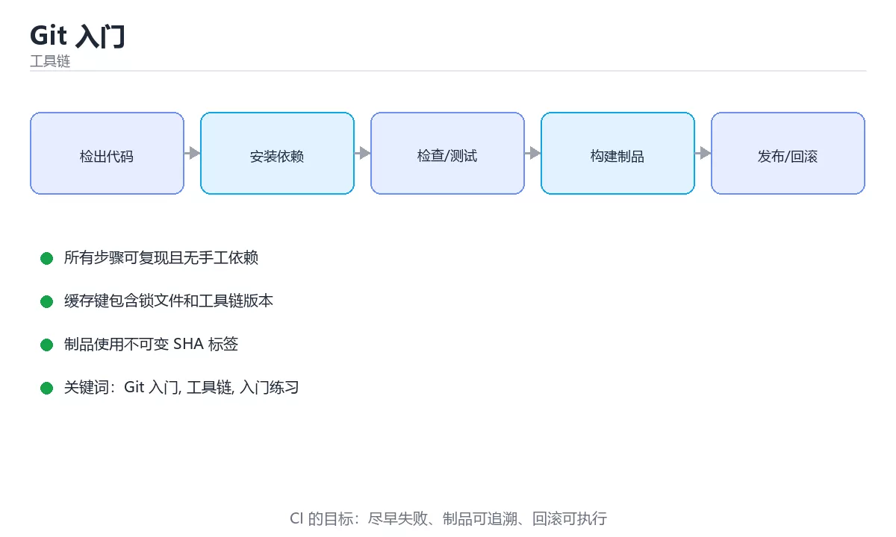

# Git 入门



> 内容更新时间：2026-10-03 · 学习阶段：入门 · 预计用时：15 分钟

## 学习目标

- 先认识「Git 入门」需要的工具、输入和输出。
- 按步骤运行最小示例，并记录结果与错误。
- 用一个边界输入验证自己是否真正掌握。

## 前置知识

- 会进行基本的文件或命令行操作。
- 不需要预先掌握「工具链」的高级知识。

## 一句话入门

完成初始化、提交、分支和远程同步。

## 最小示例

```bash
git init -q demo
cd demo
printf '# 学习笔记\n' > README.md
git add README.md
git -c user.name=learner -c user.email=learner@example.com commit -q -m "docs: 添加说明"
git log -1 --format=%s
```

## 预期输出

```text
docs: 添加说明
```

## 常见错误

- 输入或环境与示例不一致，导致结果不符合预期。
- 复制命令时遗漏空格、引号或必要参数。

## 动手练习

1. 原样运行最小示例，保存命令和输出。
2. 把数字 2 改成 10，预测并验证新结果。
3. 制造一个错误输入，写出错误信息和修复方法。

## 本课小结

- 入门阶段先保证能运行、能观察、能解释，再追求复杂功能。
- 每次只改一个变量，记录预测与实际结果。
- 遇到错误先看第一条错误信息，再回到最小示例。

<!-- p0-thicken:v1 -->

## Git 的三个区域与一次提交

Git 的核心模型是三个区域：工作区保存你正在编辑的文件，暂存区保存下一次提交的快照，本地仓库保存已经提交的历史。`git add` 把工作区变化放入暂存区，`git commit` 把暂存区内容写成一个新的提交对象。提交对象包含作者、时间、提交说明、父提交以及一棵完整的目录树，因此历史不是“文件差异的列表”，而是一串可以追溯和回放的状态快照。

`HEAD` 通常指向当前分支的最新提交，分支本质上只是一个可移动的提交指针。工作区、暂存区和 HEAD 三者不一致时，`git status` 会告诉你每个文件处于什么状态。修改文件后先看差异，再决定暂存哪些改动；`git diff` 看工作区与暂存区，`git diff --staged` 看暂存区与 HEAD。养成“小步暂存、单一目的提交”的习惯，比事后写一篇很长的提交说明更能保证历史清晰。

提交说明应说明“为什么做这个改动”，而不是重复文件名。一个好的提交可以独立回滚，也能让 reviewer 快速判断影响范围。如果一次提交同时包含格式化、重构和功能变更，回滚时就会被迫带走不相关的内容，这是最常见的历史污染。

## 分支、合并与远程同步

分支让你在不影响主线的情况下开发。创建分支只是新建一个指针，成本很低；真正需要处理的是合并时的差异。`merge` 会保留两条分支的历史并生成合并提交，`rebase` 则把你的提交重新放到目标分支之后，历史更线性但会改写提交 ID。已经推送并被他人使用的提交不要随意 rebase，否则会给协作者制造冲突。

远程仓库不是自动同步的。`fetch` 只把远程对象和引用下载到本地，`pull` 通常等于 fetch 后再 merge 或 rebase，`push` 才把本地提交上传。遇到冲突时，Git 会标记冲突文件，需要手动选择保留哪些内容，再 `git add` 并继续操作。冲突不是错误，而是两个分支对同一区域做了不同修改，解决时要同时理解两边的意图。

撤销操作要先判断影响范围：`git restore` 恢复工作区文件，`git revert` 创建一个反向提交，适合已经共享的历史；`git reset` 移动分支指针，可能改变暂存区或工作区，因此要格外谨慎。验证 Git 操作是否成功，不要只看命令退出码，还要用 `git status`、`git log --oneline --graph` 和差异命令确认最终状态。

## 考点精讲：把选择题还原成判断过程

下面不是答案速查，而是把本课测验里每个选项背后的判断标准展开。先自己作答，再对照解析检查推理链；如果结论正确但理由不完整，仍然需要回到正文补足概念。

### 考点 1：《Git 入门》的“最小示例”主要使用哪种语言或格式？

- **正确判断**：Shell
- **解析**：代码块的语言标记决定了示例的运行方式和复习工具。正确项来自本课最小示例的围栏标记，其他选项来自其他课程或输出说明。阅读代码题时要先确认语言、输入、预期输出，再判断运行环境。本题正确项是「Shell」。复习《Git 入门》时，把这一条写进自己的复述，再用原文示例或练习做一次验证；如果仍说不清，就回到对应章节。
- **迁移检查**：把题目中的一个输入换成边界值，原来的结论还成立吗？为什么？

### 考点 2：《Git 入门》的“常见错误/误区”提醒优先检查什么？

- **正确判断**：输入或环境与示例不一致，导致结果不符合预期。
- **解析**：这道题来自本课的排错清单。正确项是正文强调的检查点，其他选项把排错方向引向无关细节。遇到错误时应先复现最小案例，只改变一个变量，检查输入、环境、边界和错误信息，再继续修改。本题正确项是「输入或环境与示例不一致，导致结果不符合预期。」。复习《Git 入门》时，把这一条写进自己的复述，再用原文示例或练习做一次验证；如果仍说不清，就回到对应章节。
- **迁移检查**：如果去掉一个限制条件，哪个选项会变成正确？请写出判断过程。

### 考点 3：《Git 入门》的“动手练习”首先要求做什么？

- **正确判断**：原样运行最小示例，保存命令和输出。
- **解析**：这道题来自本课练习步骤。正确项对应正文中列出的第一项动手任务，其他选项虽然也是学习动作，但缺少本课要求的输入、步骤或观察目标。做完练习后应记录预测结果和实际输出的差异。本题正确项是「原样运行最小示例，保存命令和输出。」。复习《Git 入门》时，把这一条写进自己的复述，再用原文示例或练习做一次验证；如果仍说不清，就回到对应章节。
- **迁移检查**：把这道题改写成一次可运行或可人工验证的实验，并记录预期输出。

### 考点 4：把首次提交并推送到远程仓库的步骤调整为正确顺序。

- **正确判断**：1. git init → 2. git add . → 3. git commit -m "first commit" → 4. git push -u origin main
- **解析**：先在目录中执行 git init 创建版本库，再用 git add 把要提交的改动放入暂存区，随后通过 git commit 生成一次本地提交。最后使用 git push -u origin main 把本地分支推送到远程并建立跟踪关系。提交前还应该用 git status 和 git diff 检查内容；跳过暂存或直接推送都不符合 Git 的基本数据流。
- **迁移检查**：这道order 题：用自己的话写出正确项和两个错误项的适用边界。

<!-- p0-practice:v1 -->

## 代码实验：把示例跑成证据

这一节不引入新语法，而是把「Git 入门」的最小示例变成可以复现、可以对照的实验。每次只改变一个条件，先写预测，再运行，最后解释差异。

### 实验一：建立基线

```bash
git init -q demo
cd demo
printf '# 学习笔记\n' > README.md
git add README.md
git -c user.name=learner -c user.email=learner@example.com commit -q -m "docs: 添加说明"
git log -1 --format=%s
```

先原样运行上面的代码，记录命令、完整输出和退出状态。然后把输出与正文的预期输出逐字对照，不要用“看起来差不多”代替核对；空格、大小写、换行和错误流向都可能暴露环境差异。

### 实验二：只改一个输入

从代码中选一个会影响结果的字面量、参数或输入，把它替换成边界值：数值可尝试 0、1、最大值和最小值，字符串可尝试空串和超长文本，集合可尝试空集合、单元素和重复元素。先写出预测，再运行并记录实际结果。

### 实验三：制造一个可控错误

去掉变量展开外的引号，或者让管道中的前一段命令失败。记录退出码、标准错误和最终输出，确认错误是否被掩盖。

| 实验 | 改动 | 预测 | 实际 | 结论 |
| --- | --- | --- | --- | --- |
| 基线 | 保持原样 |  |  |  |
| 边界 |  |  |  |  |
| 失败 |  |  |  |  |

### 实验四：用三句话复述

1. 输入是什么，哪些输入属于合法范围，哪些属于边界或非法范围？
2. 程序按什么顺序处理输入，在哪一步产生了状态变化或副作用？
3. 输出如何验证，失败时第一条可观察证据是什么？

### 与测验考点的连接

- 考点 1「《Git 入门》的“最小示例”主要使用哪种语言或格式？」：先写出你的判断，再回到上方解析核对。正确判断：Shell。
- 考点 2「《Git 入门》的“常见错误/误区”提醒优先检查什么？」：先写出你的判断，再回到上方解析核对。正确判断：输入或环境与示例不一致，导致结果不符合预期。。
- 考点 3「《Git 入门》的“动手练习”首先要求做什么？」：先写出你的判断，再回到上方解析核对。正确判断：原样运行最小示例，保存命令和输出。。
- 考点 4「把首次提交并推送到远程仓库的步骤调整为正确顺序。」：先写出你的判断，再回到上方解析核对。正确判断：1. git init → 2. git add . → 3. git commit -m "first commit" → 4. git push -u origin main。

<!-- p2-enrichment:v1 -->

## English Overview

**Title:** Git Basics

**Summary:** Init, commit, branch and sync.

**Category:** Toolchain  
**Level:** 入门  
**Key terms:** Git 入门, 工具链, 入门练习

> The full tutorial is written in Chinese. This bilingual overview helps English readers identify the topic, scope and key terms before studying the detailed examples.

## 内容元数据

- 内容版本：v2.0
- 最后更新：2026-10-03
- 学习阶段：入门
- 适用环境：Git / Docker / Kubernetes / CI 平台
- 内容来源：内置结构化课程与工程实践整理
- 相关主题：Git 入门、工具链、入门练习
- 质量版本：P0 测验标准 + P1 覆盖扩展 + P2 体验补全

<!-- top50-rewrite:v1 -->

## 课程专属精读：Git 入门

### 一、知识地图

| 主题 | 核心要点 | 验证方式 |
| --- | --- | --- |
| Git 的三个区域与一次提交 | Git 的核心模型是三个区域：工作区保存你正在编辑的文件，暂存区保存下一次提交的快照，本地仓库保存已经提交的历史。 | 复述要点 + 举一个反例 |
| 分支、合并与远程同步 | 分支让你在不影响主线的情况下开发。 | 复述要点 + 举一个反例 |
| 考点精讲：把选择题还原成判断过程 | 下面不是答案速查，而是把本课测验里每个选项背后的判断标准展开。 | 复述要点 + 举一个反例 |
| 代码实验：把示例跑成证据 | 这一节不引入新语法，而是把「Git 入门」的最小示例变成可以复现、可以对照的实验。 | 运行示例 + 换一个边界输入 |

### 二、机制与验证

1. **Git 的三个区域与一次提交**：Git 的核心模型是三个区域：工作区保存你正在编辑的文件，暂存区保存下一次提交的快照，本地仓库保存已经提交的历史。 验证方式：先复述要点，再举一个反例说明边界。
2. **分支、合并与远程同步**：分支让你在不影响主线的情况下开发。 验证方式：先复述要点，再举一个反例说明边界。
3. **考点精讲：把选择题还原成判断过程**：下面不是答案速查，而是把本课测验里每个选项背后的判断标准展开。 验证方式：先复述要点，再举一个反例说明边界。
4. **代码实验：把示例跑成证据**：这一节不引入新语法，而是把「Git 入门」的最小示例变成可以复现、可以对照的实验。 验证方式：先原样运行示例，再把输入换成边界值，对照输出差异。

### 三、专属检查问题

1. 「Git 的三个区域与一次提交」要解决什么问题？请用一句话说明，并给出一个具体例子。
2. 「分支、合并与远程同步」的输入和输出分别是什么？
3. 「考点精讲：把选择题还原成判断过程」最常见的失败方式是什么？如何定位？
4. 「代码实验：把示例跑成证据」的适用边界在哪里？什么情况下不该使用？

### 四、故障排查

1. 固定输入和环境，确认问题能稳定复现。
2. 找到第一个异常状态，不从最终错误倒推。
3. 每次只改一个变量，记录预测和真实结果。
4. 修复后补边界、失败与重复执行三类测试。

## 专属复习题库

**问：Git 的三个区域与一次提交的核心要点是什么？**

答：Git 的核心模型是三个区域：工作区保存你正在编辑的文件，暂存区保存下一次提交的快照，本地仓库保存已经提交的历史。

**问：分支、合并与远程同步的核心要点是什么？**

答：分支让你在不影响主线的情况下开发。

**问：考点精讲：把选择题还原成判断过程的核心要点是什么？**

答：下面不是答案速查，而是把本课测验里每个选项背后的判断标准展开。

**问：代码实验：把示例跑成证据的核心要点是什么？**

答：这一节不引入新语法，而是把「Git 入门」的最小示例变成可以复现、可以对照的实验。

## 逐步练习：Git 入门

### 练习 1：Git 的三个区域与一次提交

1. 不看原文，用自己的话复述：Git 的核心模型是三个区域：工作区保存你正在编辑的文件，暂存区保存下一次提交的快照，本地仓库保存已经提交的历史。
2. 举一个正例和一个反例，说明边界在哪里。
3. 把结论写成两行笔记：一行结论，一行验证方式。

### 练习 2：分支、合并与远程同步

1. 不看原文，用自己的话复述：分支让你在不影响主线的情况下开发。
2. 举一个正例和一个反例，说明边界在哪里。
3. 把结论写成两行笔记：一行结论，一行验证方式。

### 练习 3：考点精讲：把选择题还原成判断过程

1. 不看原文，用自己的话复述：下面不是答案速查，而是把本课测验里每个选项背后的判断标准展开。
2. 举一个正例和一个反例，说明边界在哪里。
3. 把结论写成两行笔记：一行结论，一行验证方式。

### 练习 4：代码实验：把示例跑成证据

1. 不看原文，用自己的话复述：这一节不引入新语法，而是把「Git 入门」的最小示例变成可以复现、可以对照的实验。
2. 跑通本课示例，再把其中一个输入换成边界值，记录输出差异。
3. 把结论写成两行笔记：一行结论，一行验证方式。

## 故障排查手册：Git 入门

| 现象 | 优先检查 | 修复动作 |
| --- | --- | --- |
| 「Git 的三个区域与一次提交」的结果与预期不符 | 输入、环境、依赖版本、日志里的第一条错误 | 固定最小复现，只改一个变量并回归 |
| 「分支、合并与远程同步」的结果与预期不符 | 输入、环境、依赖版本、日志里的第一条错误 | 固定最小复现，只改一个变量并回归 |
| 「考点精讲：把选择题还原成判断过程」的结果与预期不符 | 输入、环境、依赖版本、日志里的第一条错误 | 固定最小复现，只改一个变量并回归 |
| 「代码实验：把示例跑成证据」的结果与预期不符 | 输入、环境、依赖版本、日志里的第一条错误 | 固定最小复现，只改一个变量并回归 |

## 自测与面试：Git 入门

1. 「Git 的三个区域与一次提交」的输入和输出分别是什么？
2. 「分支、合并与远程同步」最常见的失败方式是什么？如何定位？
3. 「考点精讲：把选择题还原成判断过程」的适用边界在哪里？什么情况下不该使用？
4. 「代码实验：把示例跑成证据」和相邻主题相比，最关键的差别是什么？

## 专属进阶任务 5：Git 入门

把本课 4 个主题串成一个小练习：选其中一个主题做出可运行的例子，再为另外两个主题各写一条边界用例，最后用一句话说明你的验证结论。

### 验收标准

- 例子可以独立运行，输出与预期一致。
- 两条边界用例都说清了输入、预期与实际结果。
- 验证结论用一句话写清，不依赖“感觉正确”。

<!-- top50-rewrite:v1 -->
## 参考资料与复核

- 最后复核：2026-10-04
- 下次复核：2027-04-04
- 复核范围：版本兼容、API 行为、安全建议与工程实践
- 来源性质：官方文档与标准；本课正文为离线教学重组，不复制原文

| 参考资料 | 本课用途 |
| --- | --- |
| [Git 文档](https://git-scm.com/doc) | 版本控制与协作 |
| [Docker 文档](https://docs.docker.com/) | 容器与镜像 |
| [Kubernetes 文档](https://kubernetes.io/docs/) | 编排与运维 |

> 本课主题：完成初始化、提交、分支和远程同步。

> App 完全离线展示文字链接，不会自动联网；需要延伸阅读时可复制链接到浏览器。
<!-- p2-references:v1 -->
